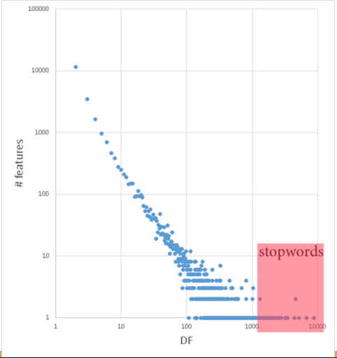
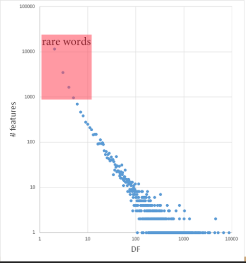
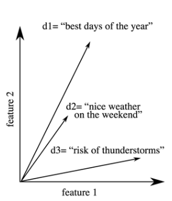
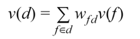

### Il Linguaggio Naturale: Caratteristiche e Complessità

Il **linguaggio naturale** è il mezzo che gli esseri umani usano quotidianamente per comunicare tra loro, sia in forma scritta che parlata, senza la necessità di ricorrere a formalismi artificiali predefiniti. A differenza dei linguaggi formali, come possono essere quelli matematici o i linguaggi di programmazione, si definisce "naturale" proprio perché si è evoluto in modo del tutto spontaneo. Esso non si limita alla semplice emissione di singole parole, ma si articola in frasi, interi discorsi, intonazioni e possiede un profondo contesto culturale. Di conseguenza, l'utilizzo di un linguaggio così articolato rappresenta un tratto distintivo ed esclusivo della specie umana. 

L'elaborazione di questo strumento comunicativo è estremamente complessa a causa di numerose sue caratteristiche intrinseche. Innanzitutto, il linguaggio si basa su **migliaia di simboli** e possiede una **sintassi complessa**.

Inoltre, la semantica del linguaggio è prevalentemente **composizionale**, il che significa che il significato generale di un'espressione deriva solitamente dall'unione delle sue singole parti. Tuttavia, in questo ambito esistono varie sfumature che complicano l'analisi. Si passa da espressioni puramente composizionali (come "comprare un'auto" o "leggere un libro" ) alle collocazioni, ovvero associazioni abituali di parole (come "make the bed" o "saltare la lezione" ), per giungere alle **espressioni idiomatiche**, il cui significato non è in alcun modo deducibile in via letterale dalle singole parole.

Una delle sfide più gravose per un sistema automatizzato è la natura **potenzialmente ambigua** del testo. Questa ambiguità si presenta a molteplici livelli strutturali. Esiste **l'ambiguità grammaticale** (part of speech ambiguity), dove una medesima parola può rivestire ruoli sintattici differenti; per esempio, la parola "beat" può fungere sia da sostantivo ("Ascolta questo bel beat") sia da verbo ("Ti batterò a dama") . Sussiste poi **un'ambiguità semantica** legata al senso della parola (word sense ambiguity), come nel caso del termine "interest", che può indicare l'attenzione verso un argomento, oppure il tasso di interesse economico alzato da una banca . Infine, vi è **l'ambiguità sintattica** pura, in cui la struttura della frase permette interpretazioni multiple e contrastanti, ben esemplificata dalla nota gag in cui si afferma di aver sparato a un elefante mentre si indossava un pigiama .

Come se non bastasse, la comprensione reale si affida in maniera vitale alla **conoscenza condivisa del mondo** (shared world knowledge). Frasi apparentemente semplici nascondono significati che diamo per scontati: affermare "Sono più veloce di Lewis Hamilton" richiede all'ascoltatore di sapere chi sia costui per dedurre la relazione di velocità alla guida.

Infine, il linguaggio è un'entità dinamica che viene **imparata da zero** durante la nostra vita e che **continua a evolversi** assieme a noi e alla società. Il vocabolario si adatta ai tempi, introducendo nuovi concetti o modificandone il senso.

### Natural Language Understanding (NLU) e Applicazioni Pratiche

Il campo della **Natural Language Understanding (NLU)** mira specificamente a costruire macchine che siano in grado di ricevere e fornire informazioni utilizzando il linguaggio naturale, emulando il modo in cui lo fanno gli esseri umani . Dal punto di vista computazionale e teorico, l'NLU è considerato un problema **AI-completo**, ovvero uno degli ostacoli più ardui dell'Intelligenza Artificiale, la cui risoluzione equivarrebbe a produrre un'intelligenza di livello umano. 

### Relazioni con Altri Tipi di Dati e Cross-media Processing

Le metodologie applicate al testo non restano confinate alle sole sequenze di parole, ma stringono fortissime relazioni con altre tipologie di dati.

Quando analizziamo i **Dati Tabulari** — i quali contengono valori numerici, categorici o simbolici organizzati con vincoli e strutture esplicite — scopriamo che è possibile estrarre informazioni strutturate direttamente da fonti testuali storiche, abilitando operazioni di *data mining* su informazioni originariamente non progettate per tali processi automatizzati . Un affascinante ponte tra i due mondi è rappresentato dall'uso di domande formulate in linguaggio naturale per interrogare veri e propri database strutturati.

Anche le reti complesse, o **Grafi**, tipiche dei Social Network, beneficiano ampiamente dell'elaborazione del linguaggio. Tali reti sono immense fonti aggiornate su gruppi, eventi e dibattiti. I metodi basati sulla mera analisi dei grafi consentono di mappare relazioni locali, macro-comunità e comportamenti su larga scala. Ciononostante, arricchire l'analisi strutturale del grafo con l'analisi del contenuto effettivo testuale condiviso, consente di caratterizzare minuziosamente gli elementi della rete, conferendo un significato dettagliato alle interazioni e facilitando l'indagine su processi complessi quali comportamenti anomali o tentativi di manipolazione.

Infine, l'intersezione tra elaborazione linguistica, **Immagini e Video** genera la branca del *Cross-media processing*. Un classico compito è l'**Image Captioning**, ovvero la generazione automatica di descrizioni testuali per il contenuto di un'immagine. Tali metodologie sono utilissime per affinare i processi di recupero e ricerca visiva e forniscono un aiuto inestimabile per le persone affette da disabilità visive, descrivendo loro in linguaggio naturale, e con vari livelli di accuratezza, le scene presentate a schermo.

### Interazioni Visive e Tecnologie Fondamentali

Per raggiungere questi traguardi ci si avvale di una profonda convergenza di diverse **Tecnologie**. Storicamente e metodologicamente, le discipline del **Natural Language Processing (NLP)**, dell'**Information Retrieval (IR)** e del **Machine Learning (ML)** non sono nettamente distinte tra loro . Al contrario, si influenzano e si nutrono reciprocamente: i metodi legati al NLP sono molto spesso costruiti sfruttando e poggiandosi sui fondamenti dell'IR e del ML. Allo stesso tempo, il ML adotta sistematicamente le metriche e le misure tipiche dell'IR per poter definire gli obiettivi qualitativi dei propri modelli di apprendimento. Di conseguenza, il ML presuppone in modo intrinseco che il linguaggio naturale debba essere prima manipolato e strutturato dai metodi NLP e IR affinché gli algoritmi predittivi possano lavorarci efficacemente.

### Il Concetto di Pipeline ed Estrazione dei Dati dal Web

Questo indispensabile pre-processamento è strutturato attraverso le cosiddette **Pipelines**. Una *Processing Pipeline* si definisce come una catena ordinata di passaggi o moduli sequenziali attraverso cui un dato passa per essere trasformato, analizzato o elaborato . 

Questo concetto è ricorrente nei metodi di *text analytics*, in quanto il testo grezzo è raramente elaborabile "così com'è" dai complessi metodi di Machine Learning. Esso richiede tassativamente di essere trasformato in una rappresentazione che si adatti al metodo specifico in uso in quel momento. È fondamentale notare che queste trasformazioni non sono mai delle semplici conversioni di formato informatico: esse possono filtrare attivamente e modificare l'informazione per far sì che venga sfruttata al meglio dagli stadi successivi della pipeline, avendo come obiettivo il sostanziale miglioramento del risultato finale dell'intero processo.

Il primo step empirico di questa catena riguarda spesso l'ottenimento e l'estrazione di testo direttamente dalla rete. Nel linguaggio di programmazione Python, si utilizzano librerie specifiche per estrapolare agilmente testo o dati da siti e applicazioni web. Il primo pacchetto citato in questo contesto è **urllib**, il quale implementa metodi che consentono una necessaria interazione a basso livello direttamente con i server web ospitanti . Il recupero del contenuto di una pagina risulta tipicamente semplice: importando il modulo `request` da `urllib`, è possibile definire l'URL desiderato (ad esempio la directory `http://hpc.isti.cnr.it/~nardini/`), utilizzare la funzione `urlopen` per ottenere la risposta dal server e infine leggerla e decodificarla nel formato UTF-8, facendosi restituire un output grezzo corrispondente al codice sorgente HTML (`<!DOCTYPE html>\n<html lang="en-US">...`) .

Tuttavia, tale codice include marcatori e strutture superflue. Per estrarre testo "pulito", si adotta il pacchetto **BeautifulSoup**. Questa libreria implementa svariati metodi progettati per navigare, modificare ed estrarre sistematicamente dati in formato HTML e XML, permettendo all'utente di isolare unicamente le informazioni di reale interesse all'interno di una determinata pagina web .

### Introduzione a NLTK e Prime Analisi sul Testo

Con il testo purificato, la pipeline si avvale di librerie specializzate come **NLTK** (Natural Language Toolkit) . Si tratta di una potente e rinomata libreria *open source* che supporta e velocizza enormemente lo sviluppo rapido di applicazioni in ambito NLP, offrendo validi strumenti sia per l'elaborazione di tipo simbolico sia per quella statistica.

A questo punto si entra nel vivo della scomposizione della frase, focalizzandosi su **Tokens & Sentences**. Una delle operazioni più elementari, ma al contempo centrali sul testo, consiste nell'isolare e identificare le singole parole che lo compongono, unità che assumono il nome tecnico di **token**. In informatica, questo processo assume il nome di **Tokenizzazione**. In NLTK è possibile suddividere il documento nei suoi rispettivi token molto agevolmente. La libreria fornisce allo scopo una funzione basilare (`word_tokenize`) che esegue questa segmentazione in modo consapevole rispetto alle regole intrinseche della lingua.

### Segmentazione delle Sentenze e Strumenti di Tokenizzazione Avanzati

Dopo aver estratto e pulito il testo, l'operazione successiva non si limita alla scomposizione in singole parole, ma richiede spesso la divisione del documento in frasi di senso compiuto. La **suddivisione di un testo in sotto-sentenze** (sentence splitting) non è affatto un compito banale. Sebbene l'uso della punteggiatura rappresenti l'indizio più rilevante e giochi un ruolo di primo piano nella costruzione e separazione delle frasi , il suo impiego per segnalare altre informazioni—come acronimi, numeri o iniziali—può indurre facilmente i sistemi in errore producendo divisioni errate.  Per risolvere questo problema, NLTK fornisce la funzione `sent_tokenize`, che agisce come un separatore di frasi consapevole della lingua, capace di gestire queste ambiguità.

Parallelamente, la scomposizione in singole parole può richiedere approcci dedicati. Il pacchetto `tokenize` di NLTK implementa segmentatori ideati per un gran numero di casi d'uso specifici. Tra questi troviamo strumenti per processare il testo di Twitter. Sono inoltre disponibili tokenizzatori in grado di gestire espressioni composte da più parole (multi-word expressions) fornendo una lista di MWE in input , analizzatori basati su espressioni regolari , strumenti che si appoggiano al noto tool Stanford CoreNLP e ulteriori tokenizzatori specifici per particolari tipologie di dataset.

Una volta ottenuto un testo correttamente tokenizzato, si può costruire un vocabolario dei termini utilizzati , contare la frequenza d'uso di ogni singolo termine , e persino tracciare graficamente la distribuzione di queste frequenze attraverso tutto il vocabolario. Inoltre, è possibile individuare le posizioni in cui i termini appaiono nel testo e visualizzare in quali contesti specifici vengano utilizzati. 
### Normalizzazione del Testo: Stemming e Lemmatizzazione

Il linguaggio naturale presenta le parole in molteplici forme flesse. Lo **Stemming** e la **Lemmatizzazione** ) sono due tecniche complementari che mirano a ridurre le diverse declinazioni e coniugazioni di una parola alla sua radice fondamentale.

Nello specifico, lo **Stemming** esegue questo processo applicando un insieme di regole di trasformazione della parola che sono strettamente dipendenti dalla lingua in uso. Poiché si tratta di un approccio prettamente algoritmico basato su troncamenti, il risultato può produrre una radice che è lessicalmente scorretta o priva di significato autonomo. Utilizzando il modulo `PorterStemmer` di NLTK, possiamo osservare come la parola al plurale "cars" venga correttamente ridotta al singolare "car" . Tuttavia, applicando lo stesso algoritmo al verbo "was", l'output risultante è il moncone "wa", una parola grammaticalmente inesistente .

Al contrario, la **Lemmatizzazione** adotta un'analisi NLP molto più profonda e, di conseguenza, computazionalmente più costosa. Il suo obiettivo non è troncare, ma ricondurre una parola esattamente alla sua forma da dizionario, il cosiddetto "lemma".

Implementando l'oggetto `WordNetLemmatizer` di NLTK, notiamo differenze cruciali rispetto allo stemming . La parola "cars" viene nuovamente ridotta a "car" . Quando si valuta la parola "was", l'algoritmo di base restituisce ancora "wa", poiché la lemmatizzazione richiede di conoscere preventivamente la *Part of Speech* (POS), ovvero la categoria grammaticale della parola analizzata. Se infatti forniamo al lemmatizzatore l'informazione aggiuntiva che "was" svolge la funzione di verbo (impostando il parametro `pos='v'`), l'analisi si affina e restituisce correttamente il lemma base "be" (essere) .

### Verso una Rappresentazione Computazionale: Il Modello Bag of Words

Finora, le *feature* (le caratteristiche) sono state estratte dal testo sotto forma di liste che riflettono l'esatta sequenza delle parole, comprensive di eventuali ripetizioni. Prendendo in esame la frase "the president of the united states of america" ed eseguendo la consueta `word_tokenize`, otteniamo una lista di 8 elementi contenente i singoli token in ordine .

Tuttavia, articoli (come "the") e preposizioni (come "of") tendono a ripetersi molto spesso nei documenti testuali. Rappresentare il testo conservando queste liste a lunghezza variabile, piene di elementi ridondanti, costituisce un notevole problema tecnico per la maggior parte degli algoritmi di Machine Learning, i quali necessitano tipicamente di strutture dati standardizzate e a lunghezza fissa.

Per superare questo ostacolo, il modello più frequentemente adottato è il **Bag of Words (BOW)**. Questo paradigma concettuale rappresenta un documento considerando unicamente l'insieme (in senso matematico) delle parole da cui è composto, ignorando le ripetizioni multiple. A livello di codice, questo si traduce nel convertire la lista dei token in un *set* di Python (`bow = set(feats)`). Eseguendo questa conversione sulla frase d'esempio, la lunghezza della struttura dati passa da 8 a 6, producendo il seguente insieme non ordinato di token unici: `['america', 'of', 'president', 'states', 'the', 'united']` . In questo modo, il modello riduce drasticamente la lunghezza dei vettori dei token estrapolando esclusivamente il vocabolario base che definisce il testo in esame.

### I Limiti del Modello Bag of Words e l'Introduzione degli N-grammi

Il modello Bag of Words (BOW), per sua stessa definizione, riduce drasticamente la complessità computazionale e la lunghezza dei vettori dei token, ma lo fa a un prezzo elevato: esso perde inesorabilmente le informazioni relative all'ordine in cui le parole compaiono e alla loro frequenza di utilizzo. Sebbene le conteggi delle occorrenze di ciascuna parola possano essere salvate e gestite in strutture dati addizionali per non perdere l'informazione sulla frequenza, il problema dell'ordine strutturale rimane. L'insieme risultante di tutte le feature distinte estratte (che in ambito tecnico può essere definito in modo intercambiabile come vocabolario, dizionario, *feature set* o *feature space* ) non è in grado di cogliere il senso logico della frase originaria.

Un esempio lampante di questa criticità si evince confrontando due frasi dal significato diametralmente opposto: "I won, and thus you lose." (Ho vinto, e quindi tu perdi) e "I lose, and thus you won." (Ho perso, e quindi tu hai vinto) . Applicando il modello BOW, le due stringhe generano lo stesso identico set di parole non ordinate: `['and', 'lose', 'thus', 'won', 'you']` . Di conseguenza, per il calcolatore i due vettori risultano perfettamente identici (`t1 == t2` restituisce `True`), rendendo impossibile per un algoritmo distinguere frasi con significati diversi ma vocabolario sovrapponibile .

Per ovviare a questa grave perdita di significato posizionale, si introduce il concetto di **Word N-grams** (N-grammi di parole). Un N-gramma è semplicemente una sequenza di *n* elementi consecutivi estratti da un testo, che permette di rappresentare il linguaggio in termini di "pezzi locali", aggiungendo ordine e contesto al vettore delle feature. Riprendendo le frasi precedenti e applicando la funzione `nltk.ngrams` con una dimensione pari a 2 (creando quindi dei 2-grammi o bigrammi), l'algoritmo non isola più le singole parole, ma le coppie consecutive. La prima frase produrrà feature composite come `W2G_won_and` e `W2G_you_lose`, mentre la seconda genererà `W2G_lose_and` e `W2G_you_won` . Pertanto, il confronto logico tra i due set restituirà correttamente `False`, riflettendo la diversità concettuale delle due espressioni . Il formato preciso con cui vengono denominate queste nuove feature (come l'aggiunta del prefisso `W2G_`) è irrilevante ai fini pratici, purché non si crei ambiguità tra le feature estratte da metodi differenti.

Questa logica di raggruppamento sequenziale può essere applicata anche a livello sub-lessicale, dando origine ai **Character N-grams** (N-grammi di caratteri). Eseguendo l'algoritmo sulle singole parole anziché sull'intera frase, si scompone il vocabolo in sequenze di lettere. Questa tecnica si rivela estremamente utile per mitigare l'effetto dei refusi e degli errori di battitura (typos). Se si confronta la corretta ortografia "rainbow" con la forma errata "rainbaw" utilizzando dei 3-grammi di caratteri, si otterranno due set di feature in gran parte sovrapponibili . L'intersezione tra i due insiemi dimostrerà infatti che i due termini condividono svariati N-grammi (come `C3G_a_i_n`, `C3G_i_n_b`, e `C3G_r_a_i`), segnalando all'algoritmo una fortissima similarità strutturale nonostante l'errore di digitazione .

### La Legge di Zipf e la Frequenza delle Parole

Analizzando il linguaggio da una prospettiva puramente statistica, emerge un fenomeno universale: la distribuzione delle parole in un qualsiasi testo linguistico non è uniforme, ma segue rigorosamente la **Legge di Zipf**. Questa legge empirica stabilisce che la frequenza di utilizzo di una parola in un testo è inversamente proporzionale al suo rango (la sua posizione) nella classifica globale delle frequenze del documento. In termini matematici, indicando con $r$ il rango (dove 1 spetta alla parola più frequente, 2 alla seconda e così via) e con $f(r)$ la frequenza, si ha la relazione $f(r) \propto 1/r$ . Per dare un'idea dell'impatto di questo squilibrio, basti pensare che in un noto dataset di test, il Reuters 21578, appena 313 vocaboli distinti riescono a coprire da soli la metà dell'intero volume di 500.000 occorrenze totali.

Questa distribuzione altamente sbilanciata viene teoricamente giustificata dal **Principio del minor sforzo** (Principle of least effort), una dinamica psicologica e comunicativa insita nell'evoluzione umana che punta a minimizzare lo sforzo complessivo durante una conversazione . In ogni scambio esistono due attori in competizione: il parlante tende a voler usare un vocabolario ristretto, prediligendo parole molto comuni, magari corte e facili da riprodurre, per sforzarsi il meno possibile nel comunicare. L'ascoltatore, al polo opposto, beneficerebbe di un vocabolario enorme, popolato da termini altamente specifici, rari e inequivocabili, in modo da decodificare il messaggio con il minimo sforzo interpretativo e senza ambiguità . La curva tracciata dalla Legge di Zipf rappresenta l'esatto punto di compromesso evolutivo tra queste due istanze contrastanti.

Da questo postulato derivano due leggi correlate altrettanto interessanti: vi è una relazione inversa tra la frequenza d'uso di un termine e la sua lunghezza grafica, e si osserva che anche il numero di significati diversi $m$ associati a una parola obbedisce a una legge inversa rispetto alla sua frequenza ($m \propto 1/f$) .

### L'Ottimizzazione del Vocabolario: Stopwords e Parole Rare

Le conseguenze della Legge di Zipf incidono direttamente su come i sistemi informatici filtrano i testi. Agli estremi della curva troviamo, da un lato, parole onnipresenti, e dall'altro parole uniche. Si osserva che le parole più comuni di una determinata lingua—come gli articoli ("il", "lo", "the", "a"), le preposizioni ("di", "con", "of") o le congiunzioni—non contribuiscono in modo significativo alla reale comprensione semantica del documento in cui si trovano. Questi vocaboli vengono denominati **Stopwords**.

Rimuovere queste Stopwords dal testo abbatte notevolmente il carico computazionale senza comportare una sensibile perdita di informazione. Ad esempio, trasformando la frase originale in `president united states america`, l'intento comunicativo rimane chiarissimo. I pacchetti NLP moderni, come la libreria NLTK, forniscono elenchi predefiniti per numerose lingue; importando `stopwords.words('english')` ed eseguendo una sottrazione insiemistica (`difference`) tra le feature estratte e la lista di Stopwords, i vocaboli accessori vengono automaticamente filtrati via . Tuttavia, l'uso di liste preconfezionate non è sempre raccomandabile per tutti gli scenari applicativi: la lista predefinita del database MySQL, per esempio, include tra le sue stopwords parole come "appreciate" (apprezzare), "serious" (serio) e "unfortunately" (sfortunatamente), vocaboli carichi di significato che si rivelano assolutamente cruciali se lo scopo dell'analisi è eseguire una classificazione del sentimento testuale (Sentiment Analysis) .

All'estremità opposta della curva troviamo le **Parole rare** (Rare features), vocaboli di nicchia che possiedono una frequenza bassissima.

I termini che compaiono in pochissimi documenti non apportano un'informazione statistica utile a generalizzare il modello di apprendimento automatico che stiamo addestrando. Se una parola appare raramente nei testi osservati nel passato, con altissima probabilità continuerà a presentarsi raramente anche nei testi futuri, rendendola di scarsa utilità per il processamento di nuovi input . Tali parole compaiono spesso una singola volta e costituiscono una fetta sorprendentemente ampia delle parole distinte in una collezione; esse sono perlopiù frutto di errori di battitura casuali o derivano da identificatori artificiali legati unicamente alla formattazione del documento specifico, come può essere lo slug di un indirizzo web . La potatura sistematica di queste parole rare dal vocabolario rende non solo nettamente più veloce il processamento del testo indicizzato, ma riduce anche drasticamente lo spazio di memoria richiesto dal calcolatore.

### Il Vector Space Model (VSM)

Avendo pulito il testo e normalizzato il vocabolario, l'ultimo gradino della pipeline di strutturazione consiste nel quantificare l'informazione trasformando formalmente l'insieme di parole di ogni documento in un vettore algebrico; questo approccio è il cuore del **Vector Space Model (VSM)**.

In questo modello, ogni documento viene mappato come un vettore $v$ definito all'interno di uno spazio a $|F|$ dimensioni, dove $|F|$ rappresenta il numero esatto (la cardinalità) di tutte le feature o token distinti estratti dal corpus analizzato. L'ipotesi geometrica alla base del VSM è affascinante e intuitiva: se i vettori di due documenti nello spazio cartesiano sono orientati l'uno vicino all'altro (ossia presentano un angolo molto ristretto), è estremamente probabile che quei due documenti condividano argomenti simili e siano semanticamente affini.

La transizione dallo spazio testuale a quello vettoriale richiede l'assegnazione di ogni singola feature a una dimensione univoca dello spazio $\mathbb{R}^{|F|}$. Questo si ottiene generando una matrice identità in cui si crea per ciascun token un **one-hot vector**, ossia un vettore che possiede tutti i valori impostati a 0, ad eccezione della singola posizione corrispondente a quella specifica parola, che viene marcata con un 1. In questa struttura basilare, il vocabolo 'I' potrebbe assumere la forma $v('I') = [1, 0, \dots, 0, 0]$, il termine 'you' sarà $v('you') = [0, 1, \dots, 0, 0]$ e così via, per ogni token esistente nel dizionario .

Una volta definite le dimensioni per i singoli vocaboli, l'intero documento viene espresso analiticamente come la somma pesata dei vettori delle feature che vi sono contenute. La formula è:

In questa equazione, il termine $w_{fd}$ rappresenta la rilevanza (il peso) della specifica feature $f$ all'interno del documento $d$ . Pertanto, un breve documento composto dalla frase $d =$ 'you played a good game' si tramuterà nel vettore $v(d) = [0, w_{played,d}, w_{game,d}, 0, \dots, w_{good,d}, 0, \dots, 0, 0]$ .

Da questa composizione emerge immediatamente un aspetto strutturale vitale: la stragrande maggioranza dei valori contenuti in questi vettori è pari a zero, determinando quella che in algebra lineare viene definita **sparsità**. Essendo la lunghezza del vettore pari alla totalità dei termini dell'intero vocabolario e contenendo un singolo documento solo una frazione irrisoria di tutte quelle parole, si ottiene un **vettore sparso**, la cui formula matematica enuncia che la cardinalità degli elementi non nulli del vettore è molto inferiore all'intero numero di feature esistenti 

($|\{i | v_i(d) \neq 0\}| \ll n$) .

L'interrogativo cruciale che chiude questa fase di modellizzazione, e che fa da ponte verso gli algoritmi di pesatura avanzati, consiste nello stabilire con quale esatto criterio e valore si debbano impostare questi pesi $w_{fd}$ in modo che riflettano la reale importanza del termine all'interno del corpus testuale.
