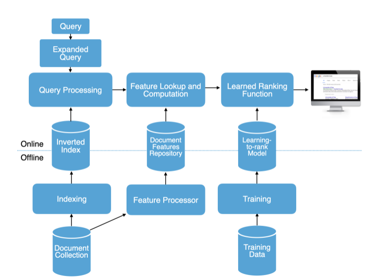
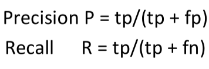
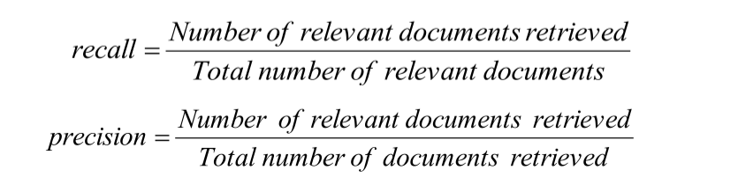
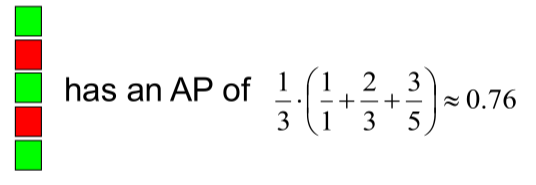
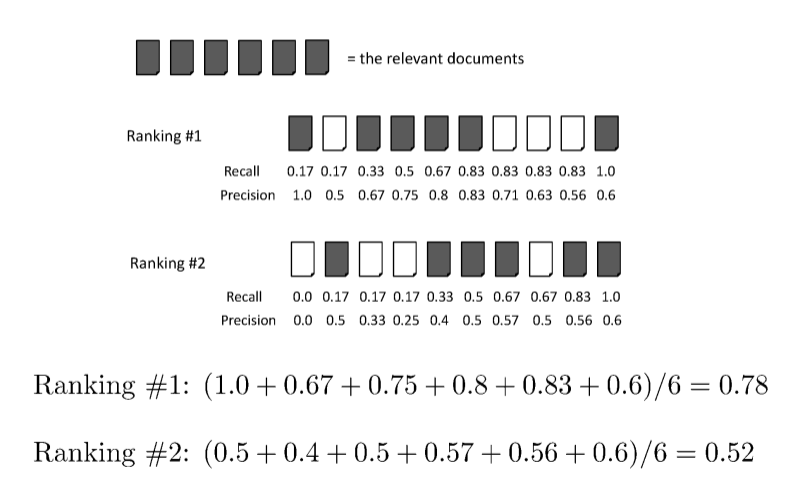
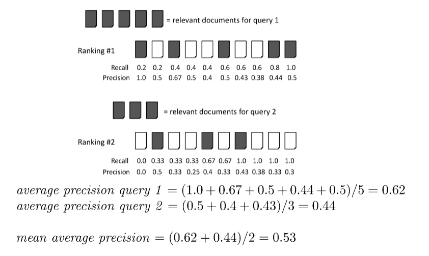
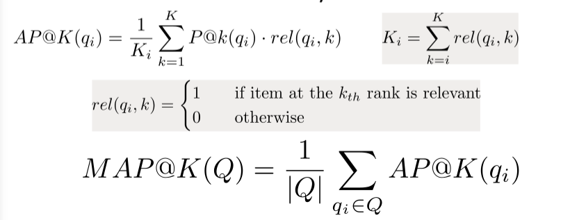
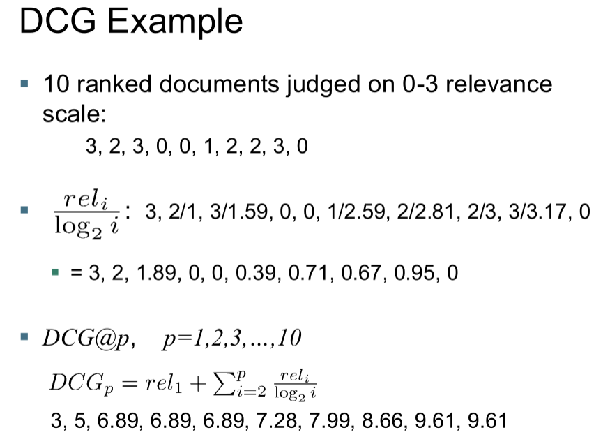
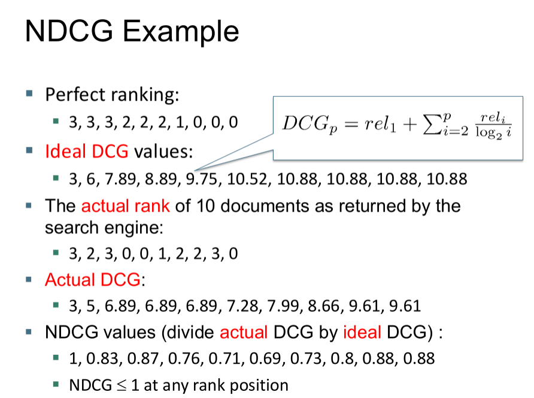
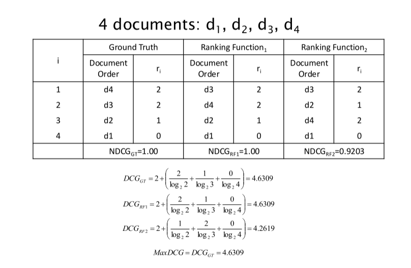

# Slide 1: L'Architettura Generale di un Motore di Ricerca

Per comprendere come valutare un sistema di Information Retrieval, è essenziale osservare la sua architettura interna, la quale si divide in componenti di elaborazione **Offline** e **Online**. 

La **fase offline** è propedeutica e dedicata alla preparazione dell'infrastruttura sui dati: partendo da una vasta **Document Collection**, il sistema esegue un processo di indicizzazione ("Indexing") per costruire un **Inverted Index**. Parallelamente, un processore estrae le caratteristiche dai testi (Feature Processor) per memorizzarle all'interno di una **Document Features Repository**. In questa fase viene anche effettuato il training di un modello di **Learning-to-rank**, sfruttando un insieme di dati di addestramento (Training Data). 

Durante la **fase online**, il sistema processa in tempo reale la **Query** immessa dall'utente: quest'ultima viene innanzitutto espansa e passata al modulo di Query Processing, che consulta l'indice invertito. I documenti candidati passano poi a una fase di calcolo e recupero delle feature (Feature Lookup and Computation), per essere infine ordinati in base alla loro pertinenza da una **Learned Ranking Function** e presentati all'utente.

### Efficienza, Efficacia e la Misura della Soddisfazione

La valutazione di un motore di ricerca parte da interrogativi di natura prettamente prestazionale. Dal punto di vista dell'efficienza, ci si interroga sulla velocità con cui il sistema indicizza la collezione (in numero di documenti elaborati per ora) e sulla sua capacità di eseguire un'indicizzazione incrementale, ad esempio assorbendo 10.000 nuovi prodotti al giorno. 

Riguardo alla ricerca in sé, è fondamentale misurare la latenza e i requisiti di elaborazione della CPU necessari per elaborare query su indici di grandissime dimensioni, come collezioni da 5 milioni di documenti. Inoltre, si valuta la qualità dei servizi collaterali, verificando se il sistema è in grado di suggerire all'utente prodotti correlati validi per l'acquisto.

Questi aspetti tecnici, per quanto cruciali, non descrivono tuttavia l'efficacia e la qualità intrinseca del motore di ricerca in ottica utente. L'obiettivo finale di un sistema IR è garantire un'alta soddisfazione durante l'esperienza di ricerca, concentrandosi in particolar modo sulla bontà della pagina dei risultati (SERP) costruita per ogni specifica interrogazione. Valutare se un utente sia "felice" rappresenta però una sfida notevole. Un segnale apparente di successo è l'elevato numero di clic sui risultati restituiti, ma questo dato va analizzato criticamente poiché titoli o sommari fuorvianti potrebbero ingannare gli utenti e forzare clic non legati a una reale pertinenza. In determinate situazioni, l'assenza di clic ("no clicks") può persino configurarsi come una buona notizia se, per esempio, l'utente trova l'informazione desiderata direttamente nelle anteprime della SERP. 

Ulteriori segnali forti di soddisfazione derivano da azioni concrete post-ricerca, come l'acquisto di beni investendo ingenti somme di denaro, il ritorno di visitatori ricorrenti su base settimanale o mensile, e l'analisi del **Dwell time**, ovvero il tempo trascorso sulla pagina di destinazione dopo aver cliccato un link della SERP prima di tornare alla lista dei risultati.

### Misurare la Rilevanza: Il Metodo Cranfield e TREC

Essendo la felicità di natura elusiva e complessa da tracciare, il proxy più comune utilizzato nella valutazione accademica e industriale è la misurazione della **rilevanza dei risultati di ricerca**. Tale metodologia fu pionieristicamente introdotta da Cyril Cleverdon attraverso gli Esperimenti di Cranfield.

La quantificazione formale della rilevanza richiede l'interazione di tre elementi imprescindibili: 

- una collezione documentale di test (benchmark), 

- una suite di query prefissate,  

- un giudizio formale che associ a ogni singola coppia query-documento un'etichetta di rilevanza o non-rilevanza. 

Supponendo di voler valutare un nuovo algoritmo, si può immaginare di incrociare una collezione da 5 milioni di documenti con un campione di 50.000 query, per produrre una matrice di giudizi. I giudizi possono manifestarsi nella forma più semplice come valutazioni binarie (rilevante contro non rilevante) o adottare misurazioni più sfumate su scale numeriche progressive (es. 0, 1, 2, 3...).

Questo approccio incontra limiti fisici colossali. Moltiplicando 5 milioni di documenti per 50.000 query si otterrebbero un quarto di trilione ($0.25 \times 10^{12}$) di coppie teoriche da valutare. 

Se per ogni giudizio un revisore umano impiegasse solo 2,5 secondi, occorrerebbero circa 170 milioni di ore-persona per completare il task. È pertanto obbligatorio restringere il numero dei documenti da valutare a un sottoinsieme della collezione totale. Per abbattere i costi elevati degli esaminatori esperti, la ricerca ha ampiamente studiato l'utilizzo del **crowdsourcing** tramite piattaforme online come Amazon Mechanical Turk, per far valutare i risultati a lavoratori generici a basso costo. Il principale insegnamento derivante dalla letteratura in merito è che questo metodo restituisce un segnale di base utile, ma la varianza qualitativa derivante dai giudizi è inevitabilmente molto alta.

### La Costruzione delle Query e le Collezioni Pubbliche

Per testare adeguatamente i sistemi, le test query impiegate devono essere direttamente pertinenti ai documenti a disposizione e, soprattutto, risultare rappresentative dei reali bisogni formativi di un utente. L'estrazione casuale di termini dai testi archiviati per simulare query è considerata una pessima pratica.

Un metodo decisamente migliore consiste invece nel campionare interrogazioni autentiche estrapolandole dai log del motore di ricerca. Nelle metodologie classiche sviluppate prima dell'avvento del Web, dove i tassi di interrogazione esigui limitavano la disponibilità dei log, la prassi richiedeva che gli esperti ideassero e confezionassero a mano i cosiddetti "bisogni dell'utente" (che la terminologia TREC chiama **topics**) e le query associate. L'ecosistema dell'IR si basa fortemente su collezioni di test pubbliche. 

**TREC (Text Retrieval Conference)** è il punto di riferimento in questo ambito: un'iniziativa sponsorizzata dal National Institute of Standards and Technology (NIST) il cui fine primario è consolidare l'infrastruttura di test per valutazioni su vasta scala nel dominio IR, unificando sia la ricerca sui metodi che la creazione dei materiali. L'accezione di "Information Retrieval" viene qui mantenuta volutamente vasta, per abbracciare tutte le tecniche dedicate all'accesso a informazioni non strutturate preventivamente per le macchine. TREC è suddiviso concettualmente in **track**, vere e proprie aree di interesse ispirate da specifici "use case" e bisogni dell'utente.

Ogni collezione di test TREC si articola su tre direttrici: i documenti, i bisogni informativi o "topic" e, infine, i giudizi di pertinenza (relevance judgments), i quali descrivono quali testi andrebbero estratti per i determinati argomenti. 

Quando un sistema algoritmico processa un intero set di istruzioni all'interno di una collezione, il risultato finale si chiama **run**. Nelle prime edizioni, per risolvere il problema dell'impossibilità di valutare l'intera base di dati di TREC, venne ideata la tecnica del **Pooling**. Essa consiste nel fondere in un solo "pool" i documenti posizionati nelle primissime posizioni dai vari partecipanti; solo quelli all'interno del bacino vengono successivamente valutati dal giudizio umano. Ai fini del punteggio finale, qualunque documento posizionato fuori da questo limitato pool viene considerato di default come non rilevante. Numerose divisioni interne a TREC continuano tuttora la ricerca per ideare modalità ottimali e imparziali per il campionamento su larga scala.

### Bisogno Informativo e Valutazioni Binarie: Precision e Recall

Prima di passare al calcolo delle metriche di ranking vere e proprie, bisogna fare una distinzione categorica: la pertinenza finale valutata da un benchmark risponde all'effettivo bisogno informativo di fondo, e non alla stringa di testo digitata dall'utente. Per intenderci, se l'esigenza reale è "il fondo della mia piscina sta diventando nero e necessita pulizia", e l'utente digita semplicemente "pulitore piscina", un algoritmo deve soddisfare concettualmente la prima frase per risultare rilevante. Per questo motivo i vari partecipanti ai convegni TREC hanno generalmente la libertà di derivare la query dalle descrizioni dei topic in maniera autonoma, adoperando sia procedure manuali sia automazioni.

Assumendo che i giudizi di rilevanza siano esclusivamente binari (un documento o è pertinente, o non lo è), l'IR adotta storicamente due metriche non basate sull'ordinamento chiamate **Precision** e **Recall**.

- La **Precision** si definisce come la porzione dei documenti recuperati dal sistema che risultano concretamente rilevanti all'interno della ristretta cerchia di testi proposti al lettore. In termini probabilistici: $P(\text{relevant retrieved} \mid \text{retrieved})$.

- La **Recall** valuta la metrica dal punto di vista globale, calcolando la percentuale di tutti i documenti effettivamente rilevanti celati nel corpus che l'algoritmo ha saputo intercettare: $P(\text{relevant retrieved} \mid \text{relevant})$.

Questi due concetti vengono estrapolati quantificando i Veri Positivi ($tp$), Falsi Positivi ($fp$), e Falsi Negativi ($fn$):

|                                | **Rilevante (Relevant)** | **Non Rilevante (Nonrelevant)** |
| ------------------------------ | ------------------------ | ------------------------------- |
| Recuperato (Retrieved)         | $tp$                     | $fp$                            |
| Non Recuperato (Not Retrieved) | $fn$                     | $tn$                            |

### L'Armonizzazione con la F-Measure (o F-Score)

Spesso durante la valutazione emerge la difficoltà intrinseca di ottimizzare simultaneamente i parametri di Recall e Precision. Si adotta perciò una combinazione singola definita **F-Measure** (o F-Score), la quale restituisce il loro valore medio calcolato però tramite media armonica, anziché aritmetica o geometrica.
La formula di base è: $F = \frac{1}{0.5\frac{1}{P} + 0.5\frac{1}{R}} = 2\frac{PR}{P+R}$

Il motivo matematico alla base di questa scelta risiede nel fatto che la media armonica fornisce un risultato che non potrà mai superare né la media aritmetica né quella geometrica e, soprattutto, quando i due valori a confronto presentano grandi deviazioni, tende ad avvicinarsi fortemente verso il numero più basso dei due. Se, come puro caso teorico, un motore di ricerca cattura tutti i documenti possibili portando il valore Recall al 100%, la sua Precision subirà un inevitabile crollo; il valore di F-Score si adatterà assecondando e mostrando con precisione le penalizzazioni dovute al valore peggiore.

Nei casi in cui il progettista intenda dare priorità mirata ad uno solo dei due indicatori asimmetrici, può fare affidamento su una formula di ponderazione definendo l'iperparametro $\beta$ attraverso l'equazione $\alpha = 1/(1+\beta^{2})$ che conferisce il peso $\alpha$ alla Precision e il suo complimento alla Recall. La **F-Measure pesata** si scriverà dunque in questo modo: $F_{\beta} = \frac{1}{\alpha\frac{1}{P} + (1-\alpha)\frac{1}{R}} = (\beta^{2}+1)\frac{PR}{\beta^{2}P+R}$ Ne consegue che, abbassando la frazione in modo che $\beta < 1$, si avvantaggerà lo studio e il peso della Precision (andandone in direzione convergente); mentre se si solleverà l'asticella cosicché $\beta > 1$, la priorità dell'equazione ricadrà forzatamente sulla Recall.

---

### Glossario e Concetti Chiave

- **Information Need vs Query**: Distinzione critica fra l'effettivo bisogno conoscitivo, di senso compiuto, dell'utente e le parole chiave semplificate che vengono infine digitate nell'interfaccia. La valutazione della rilevanza si aggancia metodologicamente al primo concetto.

- **Relevance e Benchmark**: La pertinenza dei risultati ottenuti, che costituisce la proxy fondamentale della qualità. Viene analizzata incrociando Document Collection e Topic Query predefinite contro giudizi di pertinenza emessi (solitamente per via di meccanismi come il *Pooling* e il Crowdsourcing).

- **Precision e Recall**: Le metriche fondanti relative a valutazioni binarie nei documenti recuperati dal software, le quali quantificano l'efficacia misurando la frazione di utilità ritornata (Precision) e la completezza delle fonti raccolte (Recall).

- **F-Measure**: Media armonica che sintetizza Precision e Recall, progettata matematicamente per avvicinarsi e mettere in rilievo la stima minima, impedendo a variazioni eccessive di uno dei due poli di ingannare il voto prestazionale finale.

---

### Misure Basate sull'Ordinamento (Rank-Based Measures)

Una volta compresi i fondamenti della rilevanza binaria aspecifica (come Precision e Recall), è necessario introdurre le metriche basate sull'ordinamento, fondamentali poiché in un motore di ricerca reale la posizione in cui appare un risultato è cruciale. Queste misure si dividono in due macro-categorie: quelle che operano ancora in un regime di rilevanza binaria, come la **Mean Average Precision (MAP)**, la **Precision@K** e il **Mean Reciprocal Rank (MRR)**, e quelle capaci di gestire molteplici livelli di rilevanza sfumata, come il **Normalized Discounted Cumulative Gain (NDCG)**.

### Mean Average Precision (MAP)

Per valutare la qualità dell'intero ranking restituito per una singola query, si utilizza l'**Average Precision (AP)**. Questa misura considera la posizione in classifica di ogni singolo documento pertinente man mano che la recall aumenta lungo la lista dei risultati. Più precisamente, si calcola la "Precision@K" esclusivamente nei punti $K_{1}, K_{2}, \dots, K_{R}$ in cui viene effettivamente incontrato un documento utile. Ad esempio, per una query che possiede in totale $R=3$ documenti rilevanti, i quali compaiono alle posizioni 1, 3 e 5 della classifica, l'AP si calcola sommando le precisioni in quei punti e dividendole per 3, ottenendo $\frac{1}{3}\cdot(\frac{1}{1}+\frac{2}{3}+\frac{3}{5})\approx0.76$.

La **MAP (Mean Average Precision)** non è altro che la media aritmetica di tutti i valori di AP calcolati trasversalmente su un intero set di query, fornendo così un singolo valore riassuntivo della qualità del sistema. Questo approccio adotta un meccanismo di macro-averaging, il che significa che ogni query pesa equamente sul risultato finale, indipendentemente dal fatto che per alcuni bisogni informativi esistano moltissimi documenti rilevanti e per altri pochissimi. Proprio per questa sua robustezza, la MAP rappresenta una delle misure più adoperate all'interno delle pubblicazioni scientifiche che trattano la rilevanza binaria.

### Precision@K e MAP@K nel Contesto Web

Ci si potrebbe chiedere se metriche olistiche come la MAP siano ottimali anche per la Web Search moderna. La risposta è che esse considerano la precisione a tutti i livelli di recall, ma sul web il numero totale di documenti pertinenti per una determinata query è spesso del tutto ignoto o potenzialmente sterminato. Ciò che conta davvero per un utente reale è quanti buoni risultati sono presenti nella primissima pagina (o nelle prime tre), ossia tra i primi 10 o 30 link restituiti.

Per catturare questa dinamica si introduce la **Precision@K (P@K)**, che fissa una soglia di ranking $K$ e calcola semplicemente la percentuale di documenti pertinenti presenti nei primi $K$ risultati, ignorando tutto ciò che si trova al di sotto di tale soglia. Ad esempio, se tra i primi tre risultati ne abbiamo due rilevanti, la Prec@3 sarà $2/3=0.66$; se il quarto risultato è irrilevante, la Prec@4 scenderà a $2/4=0.5$, dimostrando come questa curva non sia strettamente monotona crescente (infatti Prec@4 è inferiore a Prec@3). Se il quinto è nuovamente rilevante, la Prec@5 risalirà a $3/5=0.6$. Analogamente si può calcolare la Recall@K.

Il difetto principale della P@K è che non restituisce medie affidabili su un insieme eterogeneo di query, poiché il numero totale di documenti rilevanti specifici per ogni interrogazione influenza pesantemente i risultati. Per arginare il problema pur concentrandosi sui vertici delle classifiche, si ricorre alle metriche **AP@K** e **MAP@K**, ampiamente utilizzate nei Motori di Ricerca Web e nei Recommender Systems.
La formula per l'Average Precision al rango K per una determinata query $q_i$ è: $AP@K(q_{i})=\frac{1}{K_{i}}\sum_{k=1}^{K}P@k(q_{i})\cdot rel(q_{i},k)$ 

Dove $rel(q_{i},k)$ vale $1$ se l'elemento al k-esimo rango è rilevante, altrimenti $0$, e il fattore di normalizzazione è $K_{i}=\sum_{k=1}^{K}rel(q_{i},k)$.

Di conseguenza, la MAP@K sull'intero insieme di query $Q$ si ottiene calcolando la media aritmetica delle singole AP@K: $MAP@K(Q)=\frac{1}{|Q|}\sum_{q_{i}\in Q}AP@K(q_{i})$.

### Mean Reciprocal Rank (MRR)

Esistono scenari limite, molto frequenti sul Web, in cui per l'utente esiste un solo, unico documento rilevante. Questo accade nelle ricerche di un item specifico già noto ("known-item search"), nelle query navigazionali (cercare l'homepage di una determinata banca) o nella ricerca di un fatto o dato puntuale. In questi casi limite, la durata della ricerca per l'utente è direttamente proporzionale al rango occupato dalla risposta corretta: la posizione in classifica misura direttamente lo sforzo cognitivo e temporale impiegato.

Per misurare formalmente questo sforzo si utilizza il **Mean Reciprocal Rank (MRR)**, che generalizza il concetto basandosi sulla posizione in classifica $rank_i$ del *primo* documento utile restituito per la query $q_i$. Questo può coincidere banalmente con l'unico documento cliccato. Il Reciprocal Rank (RR) di una singola query è il reciproco della sua posizione ($1/rank_i$). L'MRR si ottiene facendo la media dei punteggi RR su tutto l'insieme di query: $MRR=\frac{1}{|Q|}\sum_{i=1}^{|Q|}\frac{1}{rank_{i}}$.

### Oltre la Rilevanza Binaria: Il Discounted Cumulative Gain (DCG)

Nei moderni motori di ricerca commerciali, i documenti non sono semplicemente utili o inutili, ma possiedono sfumature di utilità.

Per gestire questa gradualità, la metrica più diffusa è il **Discounted Cumulative Gain (DCG)**. Essa poggia su due assunti cognitivi fondamentali: in primo luogo, i documenti altamente pertinenti sono intrinsecamente più utili rispetto a quelli marginalmente pertinenti; in secondo luogo, più un documento rilevante scivola in basso nella classifica, meno probabilità avrà di essere esaminato, risultando di conseguenza meno utile.

Il DCG accumula il guadagno o utilità ("gain") scendendo lungo le posizioni della classifica, applicando però una "penalità" progressiva ai ranghi più bassi (lo sconto, o "discount"). 

Svolgendo giudizi di pertinenza su una scala che va da $0$ a $m$ (con $m>2$), il semplice Cumulative Gain (CG) al rango $n$ sarebbe una pura somma: $CG=r_{1}+r_{2}+\dots+r_{n}$. 

Il DCG interviene penalizzando i documenti che compaiono ai ranghi maggiori di 1, dividendone il valore di rilevanza generalmente per il logaritmo della loro posizione: $1/log(rank)$. Usando la base 2, ad esempio, lo sconto applicato alla quarta posizione dimezzerà il punteggio ($1/log_2(4) = 1/2$), mentre all'ottava lo ridurrà a un terzo ($1/log_2(8) = 1/3$).
La formulazione standard al rango $p$ è: $DCG_{p}=rel_{1}+\sum_{i=2}^{p}\frac{rel_{i}}{log_{2}i}$.

Esiste tuttavia una formulazione alternativa, adottata da alcune grandi aziende di web search, che amplifica esponenzialmente il peso dei documenti altamente rilevanti per dare massima priorità al loro recupero: $DCG_{p}=\sum_{i=1}^{p}\frac{2^{rel_{i}}-1}{log(1+i)}$.

Ad esempio, valutando 10 documenti con giudizi su una scala da 0 a 3 (es: 3, 2, 3, 0, 0, 1, 2, 2, 3, 0), il DCG applicherà i logaritmi ai denominatori ottenendo valori parziali scontati, per poi sommarli progressivamente e giungere a un DCG complessivo al decimo rango pari a 9.61.

### Normalizzazione dei Punteggi: NDCG

Il limite del puro DCG risiede nell'impossibilità di fare confronti coerenti tra query che posseggono quantità di documenti rilevanti intrinsecamente differenti. Per risolvere questo problema strutturale si introduce il **Normalized Discounted Cumulative Gain (NDCG)**, diventato oggi uno standard assoluto nella valutazione della Web Search.

Il processo consiste nel calcolare prima il ranking ideale (chiamato Ideal DCG), ordinando i risultati decrescenti partendo dai giudizi di rilevanza più alti verso i più bassi. Il valore finale si ottiene dividendo il DCG misurato empiricamente per l'Ideal DCG calcolato teoricamente. A causa di questa normalizzazione, il valore dell'NDCG in qualsiasi posizione $p$ sarà sempre compreso tra 0 e 1 ($NDCG \le 1$). Riprendendo l'esempio precedente, se il ranking perfetto dei documenti avrebbe prodotto un Ideal DCG finale di 10.88, e il nostro algoritmo si è fermato a 9.61, l'NDCG risultante sarà pari a 0.88.

Di seguito una tabella riassuntiva che mostra il confronto diretto tra il Ground Truth (verità di base) e le funzioni di ranking algoritmiche (RF1 e RF2) su una scala ristretta a 4 documenti:

Come si evince, il $MaxDCG$ (cioè l'Ideal DCG del Ground Truth) è pari a $4.6309$. La Ranking Function 1, seppur invertendo l'ordine dei due documenti con rilevanza massima 2 (d4 e d3), ottiene anch'essa un $DCG$ perfetto di $4.6309$, e quindi un NDCG di $1.00$. La Ranking Function 2, invece, inserendo un documento meno rilevante al rango 2, vede il suo punteggio abbassarsi a $4.2619$, ottenendo di conseguenza un NDCG normalizzato di $0.9203$.

### Ricapitolazione

In sintesi, i benchmark per la valutazione in ambito Information Retrieval necessitano strutturalmente di una Document collection, un Query set (i topic), e una Assessment methodology chiara. Questa metodologia può affidarsi a revisori umani, all'analisi dei clic degli utenti, o a sistemi ibridi. I giudizi estratti vengono infine quantizzati matematicamente all'interno di misure di bontà (come Precision o NDCG), le quali permettono alla comunità scientifica e industriale di confrontare le prestazioni di differenti motori e algoritmi su un terreno empirico unificato e standardizzato.

---

### Glossario e Concetti Chiave

- **Mean Average Precision (MAP)**: Metrica riassuntiva che calcola la media aritmetica dell'Average Precision su un insieme di query, adatta per rilevanze binarie. Ha la caratteristica di pesare equamente tutte le query analizzate (macro-averaging).

- **Precision@K e MAP@K**: Varianti delle metriche classiche ritagliate sulle necessità dei Motori di Web Search, focalizzandosi esclusivamente sulla densità di risultati utili all'interno di una determinata soglia $K$ (come i primi 10 risultati su schermo), ignorando le code di basso rango.

- **Mean Reciprocal Rank (MRR)**: Misura dello sforzo utente, si applica prevalentemente su scenari dove esiste o interessa un unico risultato corretto. Dipende direttamente dal reciproco della posizione in classifica del primo documento trovato.

- **Discounted Cumulative Gain (DCG)**: Metrica avanzata che abbandona la logica binaria, introducendo scale di rilevanza graduali. Il suo assunto logico penalizza matematicamente tramite un abbattimento logaritmico l'utilità di un testo man mano che esso viene scalzato in fondo ai risultati.

- **Normalized DCG (NDCG)**: Correttivo del DCG nato per rendere compatibili tra loro query eterogenee. Costringe l'esito frazionando il risultato reale per un "Ideal DCG" teorico, calcolato supponendo di aver ordinato i risultati dal più al meno influente.

---

