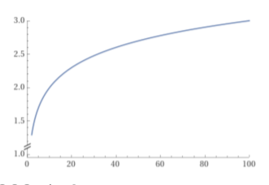
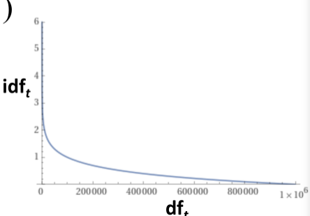
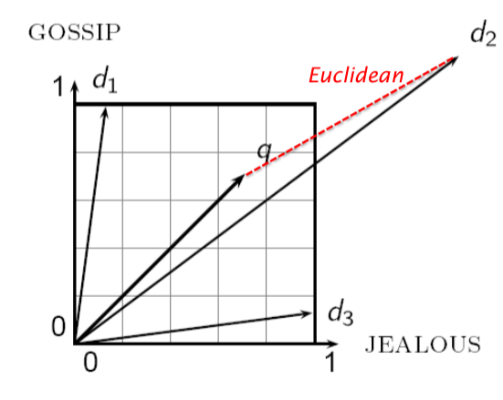
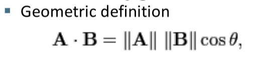
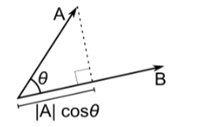
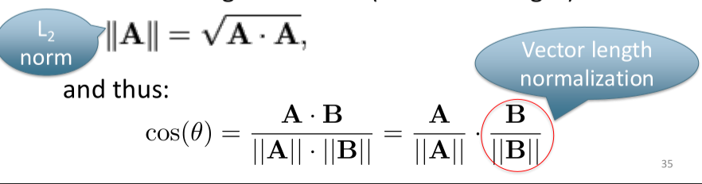

# Slide 3: Punteggi, Pesi dei Termini e Modello Spaziale Vettoriale

Questo capitolo introduce il passaggio dai sistemi di recupero logici classici ai modelli di **Ranked Retrieval**, esplorando le tecniche fondamentali di calcolo dei punteggi per ordinare i documenti, come la frequenza dei termini (TF) e la frequenza inversa dei documenti (IDF).

### Dal Boolean Search al Ranked Retrieval

Nei sistemi più semplici, le query sono rigorosamente booleane: i documenti corrispondono ai criteri richiesti oppure vengono del tutto scartati. Questo paradigma si rivela eccellente per gli utenti esperti, che hanno una profonda comprensione dei propri bisogni informativi e della collezione, o per applicazioni in grado di consumare agilmente migliaia di risultati. Al contrario, questo approccio non è ottimale per l'utente comune, il quale si dimostra spesso incapace o riluttante a comporre complesse espressioni logiche e non desidera affatto vagliare manualmente migliaia di risultati. Nel contesto della web search, il limite del modello booleano è comunemente noto come la sindrome del "**feast or famine**" (abbondanza o carestia): le ricerche tendono a produrre o zero risultati oppure un numero incontrollabile di hit, poiché l'uso dell'operatore AND risulta troppo restrittivo e l'uso dell'operatore OR troppo permissivo.

Per risolvere queste criticità, si è passati al **Ranked Retrieval**. In questo modello, il sistema riordina i documenti della collezione proponendo all'utente i migliori per una data **Free-Text query**. La ricerca si basa quindi su una o più parole formulate in linguaggio naturale, senza l'uso di complessi operatori. Con il ranked retrieval, il problema delle enormi liste di risultati scompare, poiché il sistema presenta ordinatamente solo i top $k$ documenti (tipicamente $\approx 10$), non sovraccaricando mai l'operatore umano. La premessa di base è, ovviamente, che l'algoritmo di ranking alla base funzioni a dovere.

### Il Concetto di Scoring e il Coefficiente di Jaccard

Il fulcro del ranked retrieval è il calcolo dello **Score**. Lo scopo è assegnare a ciascun documento un punteggio, ad esempio compreso nell'intervallo $[0,1]$, che misuri l'affinità con la query dell'utente, in modo da poter restituire per primi i testi ritenuti più utili.

Un primo rudimentale indicatore matematico è il **Coefficiente di Jaccard**, impiegato per quantificare la sovrapposizione tra due insiemi A (la query) e B (il documento). La sua formula è $jaccard(A,B)=|A\cap B|/|A\cup B|$. La metrica restituisce sempre un valore tra 0 e 1, assegnando 1 quando gli insiemi coincidono perfettamente e 0 quando l'intersezione è nulla, senza richiedere che A e B abbiano la stessa cardinalità. Se prendiamo come esempio la query "ides of march" e due documenti $d_1$ ("caesar died in march") e $d_2$ ("the long march"), il punteggio calcolato è rispettivamente $J(q,d1)=1/(3+4-1)=1/6$ e $J(q,d2)=1/(3+3-1)=1/5$, suggerendo che $d_2$ sia più simile alla richiesta rispetto a $d_1$.

Tuttavia, il Coefficiente di Jaccard si dimostra presto insufficiente per l'Information Retrieval avanzato. Poiché modella i testi come semplici "insiemi" (in linea con la logica booleana), fallisce nel considerare la **Term Frequency**, ignorando completamente il numero di volte in cui una parola occorre nel testo e l'elevato valore informativo che i termini rari detengono rispetto a quelli più inflazionati.

### Rappresentazione dei Documenti e Term Frequency (TF)

Nel tentativo di incorporare il peso delle occorrenze, si passa dalla semplice matrice binaria di incidenza (dove ogni documento è descritto da vettori in $\{0,1\}^{|V|}$) a matrici di conteggio termine-documento. In questo nuovo modello spaziale, noto come **Bag of Words** (o multinsieme), ciascun documento diventa un vettore di conteggio nello spazio $\mathbb{N}^{v}$. Questo approccio si focalizza puramente sulle quantità, ignorando totalmente l'ordinamento sequenziale delle parole nel testo (rendendo indistinguibili frasi invertite logicamente ma composte dagli stessi lemmi).

In questo paradigma prende forma la **Term Frequency** ($tf_{t,d}$), intesa strettamente come il mero conteggio delle apparizioni di un termine $t$ all'interno di un documento $d$. Applicarla in modo grezzo, tuttavia, creerebbe distorsioni: se è vero che un testo con 10 occorrenze di una parola chiave debba avere uno score più alto di uno con 1 singola occorrenza, è ugualmente vero che esso non sarà esattamente "10 volte" più rilevante. L'aumento della rilevanza, infatti, non è direttamente proporzionale alla crescita della frequenza matematica.

Per ammorbidire questo sbilanciamento si introduce il **Log-frequency weighting**, una funzione logaritmica concepita per smorzare l'effetto dei conteggi estremi. Il nuovo peso del termine diviene $w_{t,d} = 1 + log_{10}tf_{t,d}$ nei casi in cui $tf_{t,d} > 0$, restando fermo a 0 in caso contrario. Attraverso questa correzione, progressioni aritmetiche marcate come 1, 10, 1000 vengono compresse linearmente verso i punteggi 1, 2 e 4. Lo score di match query/documento diventa quindi la sommatoria dei pesi smorzati per i termini in comune: $score_{qd}=\sum_{t\in q\cap d}(1+log~tf_{t,d})$.

### Document Frequency e Inverse Document Frequency (IDF)

In aggiunta alle occorrenze testuali, un buon sistema di ranking deve saper isolare l'efficacia intrinseca delle parole all'interno della macro-collezione. È un principio fondante che i termini globalmente rari (es. "arachnocentric") siano indicatori d'informazione nettamente superiori rispetto alle parole ad altissima frequenza d'uso. Una pagina web che contiene parole inusuali presenti in una query ha una forte probabilità di essere inerente alla ricerca effettuata. Inverso è il caso di parole onnipresenti ("high", "increase", "line"): pur garantendo un livello base di affinità, non offrono certezze qualitative poiché figurano in una fetta eccessivamente larga dell'archivio.

Il fattore impiegato per formalizzare questa intuizione è la **Document Frequency** ($df_{t}$), definita come il quantitativo totale di documenti, all'interno di una collezione grande $N$, che ospitano il vocabolo $t$. Avere un elevato valore di $df_{t}$ implica una bassa informatività concettuale. Ribaltando matematicamente questo indicatore nasce l'**Inverse Document Frequency (IDF)**. Per addolcire l'impatto di collezioni testuali sterminate, la formula definitiva applica anch'essa un logaritmo al rapporto di questi valori: $idf_{t}=log_{10}(N/df_{t})$.

Questo punteggio di rarità è unico e immutabile per ciascun termine nella collezione prescindendo dalla query attiva, rendendolo precalcolabile offline. A titolo esemplificativo, analizzando un volume ipotetico di un milione di documenti, articoli molto comuni avranno un divisore identico al totale, producendo un peso nullo ($IDF=0$), mentre termini rintracciabili in un solo documento arriveranno a ottenere un moltiplicatore pari a 6.

### Glossario / Concetti Chiave

- **Ranked Retrieval**: Metodologia di Information Retrieval che supera il limite del modello booleano proponendo risultati in liste ordinate decrescenti in base all'utilità, tipicamente accettando in input espressioni di testo libero.

- **Coefficiente di Jaccard**: Misura matematica basata unicamente sull'intersezione rispetto all'unione delle keyword, utile come approccio teorico di similarità ma inadatta all'IR avanzato perché ignora il peso quantitativo e qualitativo delle parole.

- **Term Frequency (TF)**: Calcolo formale delle presenze di un singolo elemento lessicale interno al testo analizzato; le sue manifestazioni numeriche dirette vengono logaritmicamente smorzate per evitare che il peso cresca linearmente.

- **Inverse Document Frequency (IDF)**: Penalità proporzionale imposta ai vocaboli dominanti in una collezione; favorisce nel ranking i lemmi scarsamente impiegati aumentandone vertiginosamente la rilevanza ai fini della query.

---

### L'Effetto dell'IDF sul Ranking e la Frequenza nella Collezione

A questo punto ci si potrebbe chiedere se l'**Inverse Document Frequency (IDF)** abbia un effetto tangibile sul ranking nel caso di query composte da un singolo termine, come ad esempio la ricerca isolata della parola "iPhone". La risposta è negativa, poiché l'IDF da solo non è in grado di ordinare i documenti per query basate su un solo termine. In questo specifico scenario, tutti i documenti all'interno dei quali si verifica l'occorrenza del termine ottengono esattamente lo stesso punteggio, calcolato sommando i logaritmi in base 10 del rapporto $N/df_{t}$ per tutti i termini presenti sia nella query che nel documento: $Score_{qd}=\sum_{t\in qnd}log_{10}(\frac{N}{df_{t}})$. Di conseguenza, l'impiego esclusivo dell'IDF può produrre un vero e proprio ordinamento (ranking) dei documenti corrispondenti soltanto per le query contenenti almeno due termini, sempre a patto che i documenti non contengano tutti quanti i vocaboli ricercati. Questo principio si comprende facilmente immaginando una query come "capricious person". In questa circostanza, la pesatura IDF farà in modo che le occorrenze del termine "capricious" – che risulta essere molto più raro a livello globale – contino molto di più nel calcolo del punteggio finale del documento rispetto alle occorrenze della diffusissima parola "person".

Per valutare la rarità e l'efficacia di una parola chiave, è inoltre essenziale non confondere la frequenza nei documenti con la **Collection Frequency** ($cf_t$). Quest'ultima misura il numero totale e assoluto di occorrenze di un termine $t$ all'interno dell'intera collezione, conteggiando quindi anche le occorrenze multiple che si verificano ripetutamente all'interno di ogni singolo documento, un principio strettamente legato all'andamento statistico descritto dalla legge di Zipf. Per osservare l'evidente differenza pratica tra i due concetti, possiamo analizzare la seguente tabella comparativa:

| **Word**  | **Collection frequency** | **Document frequency** |
| --------- | ------------------------ | ---------------------- |
| Insurance | 10440                    | 3997                   |
| Try       | 10422                    | 8760                   |

Di fronte a questi due indicatori, sorge spontaneo domandarsi quale delle due parole rappresenti un termine di ricerca migliore, meritevole di un peso maggiore nel motore di ricerca. Osservando i dati, risulta palese che il lemma "Insurance", pur avendo una presenza totale nella collezione molto simile al verbo "Try", è distribuito in meno della metà dei testi (una Document frequency nettamente inferiore), risultando perciò molto più distintivo, informativo e utile per filtrare i risultati della ricerca.

### Lo Schema di Pesatura TF-IDF

Avendo chiarito le dinamiche dell'IDF, si pone il problema matematico di come pesare in maniera corretta i termini dei documenti all'interno dei vettori. L'intuizione concettuale che guida questa misurazione si basa su due pilastri fondamentali. In primo luogo, i termini che compaiono con alta frequenza in un documento – parametro misurato dalla **Term Frequency** (TF) – dovrebbero ricevere pesi elevati. Il motivo è puramente logico: quanto più spesso un documento contiene, ad esempio, la parola "dog", tanto maggiore è la probabilità che il documento tratti effettivamente di cani. In secondo luogo, però, i vocaboli che appaiono in moltissimi documenti differenti – parametro tracciato dalla **Document Frequency** (DF) – dovrebbero ottenere pesi decisamente più bassi. È il caso di congiunzioni, articoli o preposizioni come "the", "a" oppure "of", che figurano nella quasi totalità dei documenti archiviati e risultano sprovvisti di un peso semantico discriminante.

Per tradurre questa intuizione in una formula matematica solida, l'Information Retrieval coniuga la Term Frequency con la Inverse Document Frequency. Nasce così lo schema di pesatura **TF-IDF**, nel quale il peso di un termine è strutturato come il prodotto esatto del suo peso TF (espresso come frequenza normalizzata $wf$) moltiplicato per il suo peso IDF. Delineando le formule, se $idf_{t}=log\frac{N}{df_{t}}$ e il peso normalizzato $wf_{t,d}$ è calcolato come $1+log~tf_{t,d}$ (restituendo 1 + logaritmo per frequenze maggiori di zero, e zero assoluto altrimenti), il calcolo definitivo diverrà $wf-idf_{t,d}=wf_{t,d}\times idf_{t}$. 

Esiste anche un'alternativa in cui si riduce l'impatto del termine TF adottando una formula logaritmica più contenuta, pari a $log(1+tf_{t,d})$. Ad oggi, questo rappresenta il più conosciuto e apprezzato schema di pesatura nel settore. 

Riassumendo le sue proprietà, il peso restituito dalla formula incrementa di pari passo con il numero di occorrenze della parola all'interno del documento analizzato, e si innalza simultaneamente grazie alla generale rarità del termine nell'intera collezione dei dati.

Nel momento in cui si richiede di produrre un punteggio totale – o Score – per accoppiare un documento $d$ a una query $q$, il risultato sarà la semplice somma progressiva dei pesi TF-IDF per ciascun termine isolato che compare contemporaneamente nell'intersezione tra la query e il documento in esame. I motori di ricerca permettono l'adozione di moltissime varianti operative di questa base teorica. Le differenze si riscontrano in base a come il punteggio TF viene matematicamente calcolato, decidendo per esempio se applicare i logaritmi o se discretizzare i valori delle frequenze, e scegliendo, inoltre, se estendere la medesima pesatura logica anche ai termini originariamente digitati nella query.

### Calcolo Pratico dei Pesi TF-IDF

Per trasformare questa astrazione in un calcolo verificabile, supponiamo di dover analizzare una determinata collezione testuale composta da un numero totale di documenti $N$ equivalente a 806.791. Il nostro obiettivo è calcolare con precisione i pesi TF-IDF per i termini della query "car", "auto", "insurance" e "best" all'interno di tre specifici documenti, sfruttando l'IDF generato sulla collezione. I parametri precalcolati e l'applicazione dell'IDF (secondo l'espressione $idf_{t}=log\frac{N}{df_{t}}$) sono racchiusi in questa tabella strutturale:

| **Termine** | **Doc1 (tft​)** | **Doc2 (tft​)** | **Doc3 (tft​)** | **dft​** | **idft​** |
| ----------- | --------------- | --------------- | --------------- | -------- | --------- |
| car         | 27              | 4               | 24              | 18,165   | 1.65      |
| auto        | 3               | 33              | 0               | 6723     | 2.08      |
| insurance   | 0               | 33              | 29              | 19,241   | 1.62      |
| best        | 14              | 0               | 17              | 25,235   | 1.5       |

Procediamo al calcolo effettivo per il Doc1 applicando la normale formula per moltiplicazione $tf_{t,d}\times idf_{t}$. Il termine "car", occorrendo 27 volte nel testo originale, genera un peso di $27\times1.65$, per un totale di 44.55. Il lemma "insurance", del tutto assente dal documento, incide con un risultato pari a 0. Valutando il vocabolo "auto", il punteggio riscontrato si attesta a $3\times2.08 = 6.24$, mentre l'ultimo indicatore "best" conferisce uno score massiccio di $14\times1.5 = 21$. Nel caso in cui gli ingegneri del sistema di ricerca optassero per utilizzare la funzione logaritmica moderata espressa da $log(1+tf_{t,d})$, il fattore $idf_{t}$ finirebbe per ricoprire un'importanza quantitativamente molto più profonda all'interno dell'economia dei risultati. Eseguendo di nuovo i calcoli per il medesimo Doc1, scopriamo come le frequenze vengano attenuate: la parola "car" produrrà in questo caso uno score di appena $1.45\times1.65 = 2.39$. Coerentemente, il lemma "insurance" perdura a 0, ma "auto" fa segnare un modesto risultato di $0.6\times2.08 = 1.2543$ e "best" frena i suoi risultati stabilizzandosi su $1.18\times1.5 = 1.764$.

### Il Modello Spaziale Vettoriale: Dai Conteggi ai Pesi

In sostanza, l'algoritmo prende i classici sistemi usati per misurare i testi e li trasforma in veri e propri oggetti matematici. Questo processo segue un'evoluzione precisa: si parte da un semplice formato binario, dove si guarda solo se una parola c'è o non c'è, per poi passare ai conteggi posizionali, che tengono traccia di dove appaiono i termini. Alla fine, si arriva alla creazione di una *Weight Matrix* molto avanzata, che assegna dei valori in base alle relazioni tra le parole. Se proviamo a immaginare questo meccanismo applicato alle opere di Shakespeare, la struttura che mette in ordine i testi diventa una matrice di numeri reali che possiamo leggere e interpretare con precisione.

| **Termine** | **Antony and Cleopatra** | **Julius Caesar** | **The Tempest** | **Hamlet** | **Othello** | **Macbeth** |
| ----------- | ------------------------ | ----------------- | --------------- | ---------- | ----------- | ----------- |
| Antony      | 5.25                     | 3.18              | 0               | 0          | 0           | 0.35        |
| Brutus      | 1.21                     | 6.1               | 0               | 1          | 0           | 0           |
| Caesar      | 8.59                     | 2.54              | 0               | 1.51       | 0.25        | 0           |
| Calpurnia   | 0                        | 1.54              | 0               | 0          | 0           | 0           |
| Cleopatra   | 2.85                     | 0                 | 0               | 0          | 0           | 0           |
| mercy       | 1.51                     | 0                 | 1.9             | 0.12       | 5.25        | 0.88        |
| worser      | 1.37                     | 0                 | 0.11            | 4.15       | 0.25        | 1.95        |

In sostanza, questo sistema cambia tutto: ogni documento viene trasformato in un **vettore** fatto di numeri reali (i famosi pesi **TF-IDF**). Questi vettori si muovono in uno spazio matematico chiamato **Modello Spaziale Vettoriale** (*Vector Space Model*). La grandezza di questo spazio dipende dal vocabolario totale, indicato con **|V|**: in pratica, ogni singola parola del vocabolario diventa un asse, e i documenti diventano dei punti o delle frecce posizionate in questo enorme spazio a tantissime dimensioni.

Se pensiamo a come funziona un normale motore di ricerca sul web, parliamo di uno spazio con decine di milioni di dimensioni diverse. I vettori che ne derivano sono però "molto sparsi": significa che sono pieni di zeri, perché ogni documento contiene solo una minima parte di tutte le parole esistenti al mondo.

Il passaggio finale si basa su due idee fondamentali per gestire le ricerche degli utenti, trattando anche le **query come vettori**. La prima idea è semplice: si applica alla ricerca dell'utente lo stesso procedimento usato per i documenti, trasformandola in un vettore nello stesso spazio. La seconda idea è quella di ordinare i risultati in base alla loro **vicinanza geometrica** (o *proximity*) rispetto al vettore della query. In matematica, questa vicinanza indica quanto i due vettori si somigliano: più sono vicini, più sono simili.

In conclusione, tutto questo serve a superare i limiti del vecchio **modello Booleano**, che era troppo rigido e poteva solo dire "sì" o "no" (dentro o fuori). Con questo nuovo sistema, invece, otteniamo una classifica sensibile (il **ranking**), che mette i contenuti più rilevanti e importanti direttamente in cima alla lista.

---

### Glossario / Concetti Chiave

- **Collection frequency vs Document frequency**: La Collection frequency conta tutte le ripetizioni assolute che un termine ha all'interno della collezione totale, tenendo in considerazione le occorrenze multiple nello stesso testo; la Document frequency valuta strettamente in quanti singoli e univoci documenti della collezione compaia quel preciso termine, rendendola l'indicatore principe per stabilire quanto una keyword sia distintiva.

- **TF-IDF Weighting**: Rappresenta in assoluto il più impiegato modello matematico di pesatura per i documenti. Moltiplica la Term frequency di una parola all'interno del singolo documento con la Inverse Document frequency della collezione intera, innalzando il valore della parola solo se questa si ripete spesse volte in un determinato documento ma raramente nel resto della libreria.

- **Modello Spaziale Vettoriale (Vector Space Model)**: Metodologia topologica in cui i singoli termini del vocabolario assumono la forma di dimensioni di uno spazio vettoriale. I documenti, e conseguentemente le query digitate dagli utenti, divengono punti (o vettori sparsi a dimensione $\mathbb{R}^{|V|}$) misurabili in questo spazio. Più i due vettori sono vicini fra loro, maggiore è la similarità per definire il ranking.

---

### I Limiti della Distanza Euclidea

Una volta rappresentati i documenti e le query come vettori, sorge la necessità di formalizzare matematicamente la loro prossimità. Un primo approccio intuitivo per risolvere il problema potrebbe essere l'utilizzo della **Distanza Euclidea**. Questa metrica calcola letteralmente la distanza fisica intercorrente tra i punti finali (le punte) dei due vettori analizzati. Purtroppo, affidarsi alla pura Distanza Euclidea si rivela una pessima idea. Il motivo principale del suo fallimento risiede nel fatto che questa metrica restituisce valori enormi quando viene applicata a vettori caratterizzati da lunghezze molto diverse tra loro.

Come si evince osservando lo spazio vettoriale, la distanza tra il vettore della query $\vec{q}$ e il vettore del documento $\vec{d_2}$ risulta estremamente ampia, nonostante la distribuzione effettiva dei termini (ovvero l'argomento trattato) all'interno di entrambi sia molto simile. In definitiva, la Distanza Euclidea funziona correttamente solamente se applicata a vettori che sono stati precedentemente normalizzati.

### Sostituire la Distanza con l'Angolo

Per aggirare gli ostacoli posti dalla difformità di lunghezza dei testi, si abbandona la misurazione lineare per adottare l'angolo tra i vettori. A riprova di questa logica, si può ricorrere a un semplice esperimento mentale: prendiamo un documento qualsiasi $d$ e accodiamolo a se stesso per generare un nuovo documento che chiameremo $d'$. Da un punto di vista strettamente semantico, $d'$ e $d$ possiedono l'identico contenuto. Nello spazio vettoriale, le rappresentazioni di questi due documenti si sovrappongono perfettamente, con l'unica differenza che la magnitudine (lunghezza) di $d'$ risulta essere esattamente il doppio di quella di $d$. In questo scenario, la Distanza Euclidea tra i due restituirebbe un valore piuttosto elevato e fuorviante. Al contrario, l'angolo compreso tra le due rappresentazioni vettoriali dei documenti risulta pari a $0^{\circ}$. Da qui scaturisce un'idea chiave del Ranked Retrieval: bisogna ordinare i vettori dei documenti basandosi sull'"angolo" che essi formano in relazione al vettore della query.

### Dal Coseno al Prodotto Scalare

I concetti di ordinamento basato sull'angolo o basato sul coseno sono del tutto equivalenti. Ordinare i documenti in base all'ordine crescente dell'angolo compreso tra query e documento equivale a tutti gli effetti a ordinarli in ordine decrescente rispetto al loro **Coseno**, ovvero calcolando $cosine(query, document)$. In questa equivalenza logica, l'angolo funge da indice di "distanza", mentre il valore del coseno incarna la pura "similarità". Questa proprietà è dettata dal fatto che il coseno è una funzione monotonicamente decrescente per l'intervallo di gradi che va da $[0^{\circ}, 180^{\circ}]$.

Per estrarre questo valore, si ricorre al concetto algebrico e geometrico di **Dot-product** (prodotto scalare). La sua definizione algebrica prevede la somma dei prodotti delle singole componenti: $A \cdot B = \sum_{i=1}^{n} A_i B_i = A_1 B_1 + A_2 B_2 + \dots + A_n B_n$. La sua definizione geometrica lo inquadra invece come:

## Length Normalization e Cosine Similarity

Come introdotto dalla formula precedente, l'operazione che prevede di dividere un vettore per la sua Norma $L_2$ ($||\vec{x}||_2 = \sqrt{\sum_{i} x_i^2}$) prende il nome di **Length Normalization**. L'applicazione di questa divisione trasforma di fatto il vettore originario in un vettore unitario (di lunghezza intrinseca pari a 1), andandolo a proiettare idealmente sulla superficie esterna di un'ipersfera unitaria. Ritornando al nostro esempio teorico precedente, i due documenti fittizi $d$ e $d'$ avranno vettori totalmente identici a seguito della normalizzazione della lunghezza. Questa operazione è vitale in ambito IR perché permette a documenti lunghi e documenti brevi di disporre finalmente di pesi paragonabili tra loro in maniera equa. 

La **Cosine Similarity**, denotata come $\cos(\vec{q}, \vec{d})$, è quindi il calcolo del coseno dell'angolo tra il vettore query e il vettore documento. Sviluppando l'intera formula con i pesi TF-IDF, otteniamo: 
![[Pasted image 20260414112205.png]]
In questa equazione, $q_i$ rappresenta il peso TF-IDF del termine $i$ all'interno della query, mentre $d_i$ è il corrispettivo peso del termine $i$ calcolato all'interno del documento analizzato. Se operiamo alla base con vettori già pre-normalizzati per lunghezza (unitari), il denominatore diventa automaticamente 1, e la Cosine Similarity si semplifica magistralmente coincidendo in tutto e per tutto con il puro prodotto scalare: $\cos(\vec{q}, \vec{d}) = \vec{q} \bullet \vec{d} = \sum_{i=1}^{|V|} q_i d_i$.
[INSERIRE IMMAGINE: Grafico cartesiano bidimensionale delimitato dagli assi POOR e RICH su una scala da 0 a 1. All'interno si osserva la curva tratteggiata di un'ipersfera unitaria lungo la quale si attestano le estremità dei vettori normalizzati relativi a tre documenti (d1, d2, d3) e a una query (q), con l'angolo theta indicato in evidenza]

### Document Clustering: Un Esempio su Tre Documenti

Le medesime logiche di similarità tramite coseno applicate al rapporto query/documento si rivelano efficaci per comparare la vicinanza intercorrente tra multipli documenti fra di loro, uno scopo tipicamente ricollegato alle operazioni di **Document Clustering**. Per chiarire l'implementazione numerica del concetto, proviamo a calcolare quanto siano simili fra di loro tre celebri romanzi della letteratura inglese classica. I testi in esame sono:

- **SaS**: *Sense and Sensibility* (scritto da Jane Austen, 1775-1817)

- **PaP**: *Pride and Prejudice* (della medesima Jane Austen)

- **WH**: *Wuthering Heights* (capolavoro di Emily J. Brontë, 1818-1848).
  [INSERIRE IMMAGINE: Ritratto affiancato di due donne d'epoca, storicamente identificabili come le scrittrici Jane Austen e Emily J. Brontë]

Analizziamo a tal fine le "Term frequencies", ovvero i meri conteggi quantitativi delle occorrenze estratti dalle opere per quattro peculiari parole chiave prese a campione:

| **term**  | **SaS** | **PaP** | **WH** |
| --------- | ------- | ------- | ------ |
| affection | 115     | 58      | 20     |
| jealous   | 10      | 7       | 11     |
| gossip    | 2       | 0       | 6      |
| wuthering | 0       | 0       | 38     |

Attraverso i dati non normalizzati di questa tabella, combinati con la successiva pesatura logaritmica delle frequenze e relativa normalizzazione della lunghezza, il motore sarà in grado di stabilire gli angoli geometrici che separano i tre romanzi all'interno dello spazio vettoriale, aggregando tra di loro le opere oggettivamente più affini.

---

### Glossario / Concetti Chiave

- **Distanza Euclidea vs Distanza Angolare**: La prima calcola lo spazio tra le estremità di due vettori risultando inefficiente a causa delle diverse magnitudini dei testi non normalizzati; la seconda stima la prossimità osservando l'angolo formato tra i vettori alla loro origine spaziale.

- **Cosine Similarity**: Funzione trigonometrica utilizzata in Retrieval per tramutare l'ampiezza dell'angolo in un gradiente di "similarità". Più l'angolo è stretto, più il suo coseno si avvicina al valore 1 garantendo una corrispondenza semantica.

- **Length Normalization**: Operazione matematica che prevede la divisione di ogni coordinata di un vettore per la sua magnitudine totale (Norma L2), equiparando vettori intrinsecamente corti a quelli lunghi trasformandoli tutti in vettori unitari.

- **Prodotto Scalare (Dot-product)**: Operazione algebrica fondamentale che, qualora applicata a vettori assoggettati a Length Normalization preventiva, coincide esattamente con il punteggio della Cosine Similarity, rendendo la sua formula rapida da processare a livello computazionale.

---

### Il Calcolo Pratico della Cosine Similarity (Continuazione)

Riprendendo l'esempio del **Document Clustering** relativo ai tre romanzi classici (*Sense and Sensibility*, *Pride and Prejudice*, *Wuthering Heights*), è possibile osservare matematicamente come le pure frequenze si trasformino in vettori normalizzati. In un primo momento, i conteggi grezzi vengono smorzati attraverso la **Log frequency weighting**. La matrice ottenuta assume questi valori:

| **term**  | **SaS** | **PaP** | **WH** |
| --------- | ------- | ------- | ------ |
| affection | 3.06    | 2.76    | 2.30   |
| jealous   | 2.00    | 1.85    | 2.04   |
| gossip    | 1.30    | 0       | 1.78   |
| wuthering | 0       | 0       | 2.58   |

Successivamente, ai vettori generati viene applicata la **Length normalization** (normalizzazione della lunghezza), in modo da parificare il peso delle opere a prescindere dal numero totale delle loro pagine. I vettori unitari definitivi diventano:

| **term**  | **SaS** | **PaP** | **WH** |
| --------- | ------- | ------- | ------ |
| affection | 0.789   | 0.832   | 0.524  |
| jealous   | 0.515   | 0.555   | 0.465  |
| gossip    | 0.335   | 0       | 0.405  |
| wuthering | 0       | 0       | 0.588  |

A questo punto, avendo a disposizione vettori normalizzati, il calcolo della similarità si riduce al semplice prodotto scalare. Moltiplicando e sommando le componenti, i risultati indicano che $cos(SaS, PaP) \approx 0.789 \times 0.832 + 0.515 \times 0.555 + 0.335 \times 0.0 + 0.0 \times 0.0 \approx 0.94$. Eseguendo la stessa operazione per le altre coppie, otteniamo $cos(SaS, WH) \approx 0.79$ e $cos(PaP, WH) \approx 0.69$. Di conseguenza, la classifica finale di affinità decreta che $cos(SaS, PaP) > cos(SaS, WH) > cos(PaP, WH)$, dimostrando, come prevedibile, che i due testi scritti dallo stesso autore sono oggettivamente i più simili tra loro.

### Le Varianti del Punteggio e la Notazione SMART

Il concetto di pesatura TF-IDF non è un dogma fisso, ma un'infrastruttura adattabile. Esistono innumerevoli varianti, che differiscono in base a come viene calcolata la Term Frequency (ad esempio introducendo logaritmi o booleani), a come si gestisce la Document Frequency e, infine, al metodo scelto per la normalizzazione. Per mappare agilmente queste varianti, i sistemi di Information Retrieval fanno uso della **Notazione SMART**. La tabella seguente sintetizza le sigle standardizzate:

| **Term frequency**                                                  | **Document frequency**                         | **Normalization**                                   |
| ------------------------------------------------------------------- | ---------------------------------------------- | --------------------------------------------------- |
| n (natural) $tf_{t,d}$                                              | n (no) 1                                       | n (none) 1                                          |
| l (logarithm) $1+log(tf_{t,d})$                                     | t (idf) $log\frac{N}{df_t}$                    | c (cosine) $\frac{1}{\sqrt{w_1^2+w_2^2+...+w_M^2}}$ |
| a (augmented) $0.5+\frac{0.5\times tf_{t,d}}{max_t(tf_{t,d})}$      | p (prob idf) $max\{0,log\frac{N-df_t}{df_t}\}$ | u (pivoted unique) $1/u$                            |
| b (boolean) $1$ if $tf_{t,d}>0$, $0$ otherwise                      |                                                | b (byte size) 1/CharLength, $\alpha<1$              |
| L (log ave) $\frac{1+log(tf_{t,d})}{1+log(ave_{t\in d}(tf_{t,d}))}$ |                                                |                                                     |

La convenzione in uso nei motori di ricerca prevede di unire queste lettere nel formato **ddd.qqq**, dove le prime tre lettere ("ddd") specificano le scelte operate per i documenti del set, mentre le ultime tre ("qqq") indicano il trattamento riservato alla query immessa dall'utente. Uno schema operativo standard e diffusissimo è identificato dalla sigla **lnc.ltc**. Questa dicitura impone che il documento ("lnc") venga elaborato con un logaritmo per la TF ('l'), nessuna IDF ('n') e normalizzato tramite coseno ('c'). Per contro, la query ("ltc") subirà un approccio logaritmico alla TF ('l'), integrerà il fattore IDF in fase di ricerca ('t') e verrà anch'essa normalizzata con il coseno ('c').

Per esemplificare lo schema lnc.ltc, supponiamo di avere un documento contenente i termini "car insurance auto insurance" e una query "best car insurance". Il calcolo produrrà dei vettori pre-normalizzati con una lunghezza vettoriale (Doc length) stimabile in $\sqrt{1^2+0^2+1^2+1.3^2} \approx 1.92$. Il punteggio definitivo ("Score"), calcolato sommando i prodotti finali tra query e documento, si assesterà sul valore di $0 + 0 + 0.27 + 0.53 = 0.8$.

### Sintesi del Vector Space Ranking

Ricapitolando il funzionamento pratico del Vector Space Ranking, il flusso procedurale si può dividere in passi chiarissimi:

1. Rappresentare la query dell'utente come un vettore ponderato TF-IDF.

2. Modellare ogni singolo documento dell'archivio come un vettore ponderato TF-IDF.

3. Calcolare lo score di "Cosine similarity" confrontando il vettore della query con ciascun vettore documentale.

4. Ordinare i documenti con rispetto alla query partendo dal punteggio più alto.

5. Mostrare a schermo solamente i "Top K" (es. $K=10$) documenti all'utente.

### L'evoluzione del Ranking: Best Match 25 (Okapi BM25)

Il logico successore del classico TF-IDF vettoriale è il modello **Best Match 25**, universalmente noto come **Okapi BM25**. Esso non è altro che una funzione di ranking basata su teorie probabilistiche di recupero delle informazioni e sul comportamento utente (information-seeking behaviour). È stato sviluppato a cavallo tra gli anni '80 e '90 nell'ambito del sistema sperimentale Okapi presso il Centre for Interactive Systems Research del dipartimento di Information Science della City University di Londra. Attualmente, il BM25 è considerato una baseline robusta ed è lo standard de facto integrato quasi ovunque. Troviamo riferimenti importanti in accademia ad opera di ricercatori come Stephen Robertson e Hugo Zaragoza (2009).

La complessa formula algoritmica di base del modello BM25 definisce lo score tra il documento $D$ e la query $Q$ nel modo seguente:

$$score(D,Q) = \sum_{i=1}^{n} IDF(q_i) \cdot \frac{f(q_i, D) \cdot (k_1 + 1)}{f(q_i, D) + k_1 \cdot (1 - b + b \cdot \frac{|D|}{avgdl})}$$

Affiancata dal calcolo probabilistico per il fattore Inverse Document Frequency:

$$IDF(q_i) = \ln\left(\frac{N - n(q_i) + 0.5}{n(q_i) + 0.5} + 1\right)$$

All'interno di queste equazioni figurano variabili cruciali:

- **$|D|$**: La cardinalità o lunghezza del singolo documento espressa in numero di parole.

- **$avgdl$** (o $L$): La lunghezza media dei documenti nell'intera collezione.

- **$N$**: Il numero totale dei documenti.

- **$n(q_i)$**: Il parametro di document-frequency per l'i-esimo termine della query.

- **$b$** e **$k_1$**: Iper-parametri di taratura. Tipicamente, se non ottimizzati nello specifico, $b$ si colloca nell'intervallo $[0, 1]$ (spesso fissato a 0.75), mentre $k_1$ assume un valore tra $[1.2, 2.0]$.

### Normalizzazione e Saturazione nel Modello BM25

Ciò che distingue il BM25 dagli schemi precedenti sono due meccanismi: la normalizzazione pivotata e la saturazione della frequenza.

La **Pivoted length normalization** introduce un normalizzatore al denominatore della formula, basato sul rapporto tra la lunghezza del testo in esame e la media globale ($avgdl$). Essendo modellata dal parametro $b \in [0, 1]$, se viene assegnato un valore $b > 0$, il normalizzatore assumerà proporzioni superiori a 1.0 per tutti quei documenti la cui lunghezza supera la media del set. Il fine ultimo di questo espediente è penalizzare deliberatamente i documenti troppo lunghi, compensando il fatto che testi estremamente estesi presentano una naturale inclinazione statistica ad accoppiarsi erroneamente e a far match con qualunque query immessa. I testi più corti vengono invece ricompensati.
[INSERIRE IMMAGINE: Grafico cartesiano della "Pivoted length normalization", in cui le linee mostrano l'effetto del parametro 'b'. Documenti più lunghi della media subiscono una penalizzazione (linee discendenti o normalizzatore > 1), mentre quelli più corti ottengono un premio (Reward)]

Infine, la porzione della formula $\tau(F_t) = \frac{F_t}{k + F_t}$ funge da **funzione di saturazione** (Saturation function). Il suo compito essenziale è modellare matematicamente la non-linearità del contributo apportato dalla Term Frequency, affiancata alla sopracitata normalizzazione documentale. Mentre nei modelli TF classici il peso aumenta inesorabilmente (eccesso di fiducia per keyword ripetute ad libitum), nel modello BM25 il peso derivante dalla frequenza cresce inizialmente in modo ripido per poi appiattirsi (saturarsi) all'aumentare esponenziale delle occorrenze. Questo limite asintotico scongiura manipolazioni dei risultati (come il Keyword Stuffing) e raffina notevolmente l'equità del motore di ricerca.
[INSERIRE IMMAGINE: Grafico a linee curve comparativo: mostra la progressione illimitata in salita del 'Classic TF score' a confronto con la curva del 'BM25 TF Score', che si appiattisce rapidamente creando un tetto massimo di saturazione al crescere della Term Frequency]

---

### Glossario / Concetti Chiave

- **Notazione SMART (ddd.qqq)**: Sintassi contratta utilizzata in accademia e nell'industria dell'IR per indicare univocamente quali varianti di pesatura e di normalizzazione sono state assegnate ai documenti analizzati (primo blocco ddd) e alla query ricercata (secondo blocco qqq).

- **BM25 (Best Match 25)**: Funzione probabilistica di ranking sviluppata dall'Università di Londra, diventata baseline assoluta nel recupero testuale grazie alla sua gestione intelligente e bilanciata delle frequenze.

- **Pivoted Length Normalization**: Componente del BM25 progettato esplicitamente per infliggere malus aritmetici ai testi estremamente prolissi, ridimensionando i vantaggi statistici che documenti enormi maturano casualmente intercettando parole chiave spurie.

- **Funzione di Saturazione**: Principio logico alla base del BM25 per il quale la ripetizione insistente di un termine si blocca progressivamente verso un tetto massimo di "peso", prevenendo l'accumulo sproporzionato di rilevanza nei conteggi altissimi di Term Frequency.

---

