# Il Sistema ZigBee: Livelli Applicativi e Architettura di Rete

### Obiettivi di Apprendimento e Applicazioni dello Standard

Lo standard ZigBee, sviluppato e promosso dall'omonima organizzazione globale, la **ZigBee Alliance**, si è affermato come il protocollo di riferimento per le reti di sensori wireless (**wireless sensor networks**). La sua flessibilità ha permesso un'ampia diffusione in molteplici campi applicativi. Tra questi spicca la domotica, o **home automation**, che include anche l'assistenza ambientale per disabili e anziani (ambient assisted living). Questo standard è ugualmente centrale nei settori dell'assistenza sanitaria (**health care**), nell'elettronica di consumo (**consumer electronics**) e nell'automazione industriale. Un'applicazione particolarmente affascinante ed estrema riguarda il suo impiego persino per l'esplorazione spaziale; la tecnologia ZigBee è stata infatti integrata nei protocolli di comunicazione dei rover marziani.

### Requisiti, Funzionalità ed Ecosistema

Il successo dello standard deriva dai rigidi requisiti (main requirements) sui quali è stato fondato. In primis, una rete ZigBee deve risultare completamente autonoma, operando in assenza di qualsivoglia intervento umano. Tale autonomia deve essere supportata da un'autonomia energetica formidabile, traducendosi nel requisito di una lunghissima durata delle batterie (**very long battery life**). Inoltre, lo standard è esplicitamente progettato per operare con una bassa velocità di trasmissione dati (**low data rate**) e deve assolutamente garantire la piena interoperabilità tra dispositivi ZigBee prodotti da costruttori (vendors) differenti. Di conseguenza, le funzionalità principali (main features) presentate includono il fatto di essere uno standard consolidato e a basso costo (**low cost**). Può essere utilizzato a livello globale, risulta estremamente affidabile e dotato di capacità di auto-riparazione (**self healing**). Oltre a ciò, la tecnologia supporta agilmente reti composte da un numero elevato di nodi, risulta facilissima da distribuire sul campo (**easy to deploy**) e intrinsecamente sicura dal punto di vista crittografico.

### Relazione tra ZigBee e lo Standard IEEE 802.15.4

L'architettura dello stack protocollare evidenzia una simbiosi perfetta tra ZigBee e l'**IEEE 802.15.4**. Lo standard IEEE 802.15.4, consegnato per la prima volta nel 2003 e revisionato nel 2006 (la cui prima revisione è distribuita gratuitamente), fornisce le specifiche essenziali dei livelli inferiori, operando sul livello fisico (**Physical layer**) e sul livello di controllo dell'accesso al mezzo, o **MAC layer**. Al di sopra di questa infrastruttura di base si innesta lo standard ZigBee. Rilasciato formalmente alla fine del 2004 (e rivisto nel 2006, sempre con prima revisione liberamente distribuita) dalla ZigBee Alliance (un'associazione di aziende), lo standard ZigBee definisce i protocolli per i livelli superiori, fornendo il livello di rete (**Network layer**) e il livello applicativo (**Application layer**).

Lo standard IEEE 802.15.4 fornisce una specifica dedicata alle reti PAN (**Personal Area Networks**) wireless a bassa frequenza. Questo protocollo inferiore agisce in un ambiente privo di infrastruttura cablata fissa (**infrastructure-less**) ed è ottimizzato per comunicazioni a corto raggio. Fornisce supporto basilare per topologie a stella (**star**) e peer-to-peer, ed è progettato per coesistere senza interferenze con reti come l'IEEE 802.11 (Wi-Fi) o l'IEEE 802.15.1 (Bluetooth). Riguardo lo spettro di frequenza, esso opera su bande esenti da licenza: la banda tra gli 868 e gli 868.6 MHz (tipicamente in Europa) con un data rate di 20 kbps; la banda compresa tra i 902 e i 928 MHz (ad esempio nel Nord America) con una capacità di 40 kbps; e infine la frequenza di risonanza universale (worldwide) situata a 2400-2483.5 MHz, in grado di garantire fino a 250 kbps.

### L'Architettura del Livello Applicativo

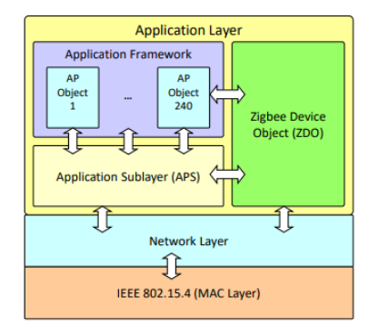

Come si evince dall'architettura complessiva costruita sullo standard IEEE 802.15.4, ZigBee si incarica di specificare appieno sia il Network Layer che l'**Application Layer**. Questo livello applicativo si scompone in tre entità principali strettamente interconnesse. In primo luogo, troviamo l'**Application Framework**, un ambiente di esecuzione che può contenere fino a 240 Oggetti Applicativi, chiamati **Application Objects (APO)**. Ogni singolo APO rappresenta un'applicazione ZigBee definita a discrezione dell'utente. Il secondo componente è costituito dallo **ZigBee Device Object (ZDO)**, il quale fornisce i necessari servizi per permettere ai vari APO di organizzarsi in una vera e propria applicazione distribuita. A fondamento di questi due moduli risiede il sottolivello di supporto applicativo, noto come **Application Support sublayer (APS)**. La funzione primaria dell'APS è proprio quella di fornire servizi di gestione e trasmissione di dati sia agli oggetti applicativi (APO) sia al gestore dei dispositivi (ZDO).

### Le Primitive di Servizio

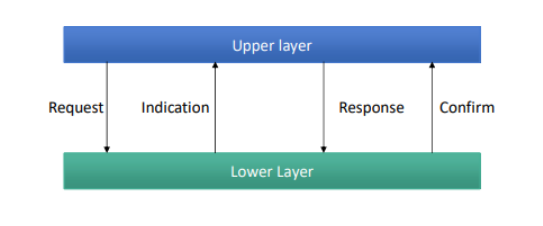

Il dialogo interno ai livelli protocollari avviene seguendo la rigida logica delle "primitive di servizio", un meccanismo attraverso il quale ogni livello offre i propri servizi (di gestione e di transito dati) al livello immediatamente superiore. Questa interfaccia si articola su un set di primitive riconducibili a quattro tipologie generiche.

- **Request** (Richiesta) viene invocata dal livello superiore allo scopo di richiedere l'erogazione di un servizio specifico. 

- **Indication** (Indicazione) viene generata autonomamente dal livello inferiore ed è diretta a quello superiore per notificarlo circa il manifestarsi di un particolare evento correlato al servizio in corso. 

- **Response** (Risposta) conseguentemente, per completare e gestire una procedura innescata in precedenza da un'Indication, il livello superiore chiama la primitiva di risposta.

- **Confirm** (Conferma) infine, la conclusione del ciclo passa attraverso la conferma, che è generata dal livello inferiore per recapitare al livello superiore i risultati legati a una o più richieste di servizio (Request) evase in precedenza.
  
  È fondamentale precisare che non tutti i servizi erogati richiedono obbligatoriamente l'impiego simultaneo di tutte queste quattro tipologie di primitive.

Si consideri ad esempio una comunicazione completa fra due dispositivi fisici separati: nel **Device 1** il Livello N+1 origina una *request* verso il Livello N, che invia l'informazione sul canale verso il **Device 2**. Nel secondo dispositivo, l'informazione passa dal Livello N come *indication* verso il Livello N+1 locale. Tale livello risponderà invocando una *response* al proprio Livello N sottostante, chiudendo infine la catena con una *confirm* restituita al livello superiore del Device 1 originario.

### Il Flusso di Trasferimento dei Dati (Data Transfer)

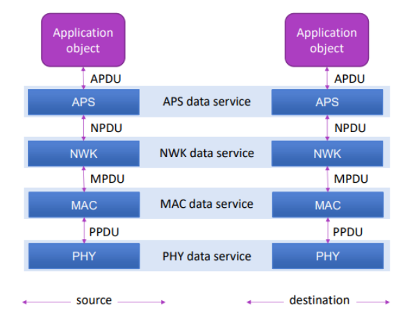

Il trasferimento dei dati (**Data Transfer**) è un processo stratificato in cui i dati attraversano discendendo l'intera pila dei livelli nel dispositivo sorgente (source), raggiungono la destinazione (destination) e risalgono fino al livello applicativo. L'Application object crea il suo payload originario, battezzato **APDU**. Questo entra nel modulo APS attraverso il servizio dati (APS data service). L'APS aggiunge le sue informazioni di controllo formando la **NPDU**, che viene poi consegnata al livello di rete (NWK). Sfruttando il NWK data service, il dato diventa una **MPDU**. A questo punto, il livello MAC processa il pacchetto convertendolo tramite il MAC data service nell'unità base **PPDU**, che infine giunge al livello fisico (PHY) e viene instradata sul canale trasmissivo dal PHY data service fino a raggiungere il dispositivo ricevente in cui subisce il percorso logico speculare di spacchettamento.

### Struttura e Topologie del Livello di Rete

All'interno del livello di rete ZigBee, il sistema si compone di tre tipologie essenziali di dispositivi. Il più importante è il **Network coordinator** (coordinatore di rete), rappresentato formalmente da un dispositivo completo di tutte le funzionalità o **FFD** (Full Functional Device), incaricato unicamente di creare, avviare e gestire l'intera rete. Subito sotto si innestano i **Routers**, anch'essi basati su unità FFD, ma dotati di specifiche capacità di instradamento del traffico. A chiudere la gerarchia vi sono gli **End-devices** (dispositivi finali), che possono coincidere sia con nodi **RFD** (Reduced Functional Device) che con unità FFD, purché operanti in modalità limitata di dispositivo semplice.

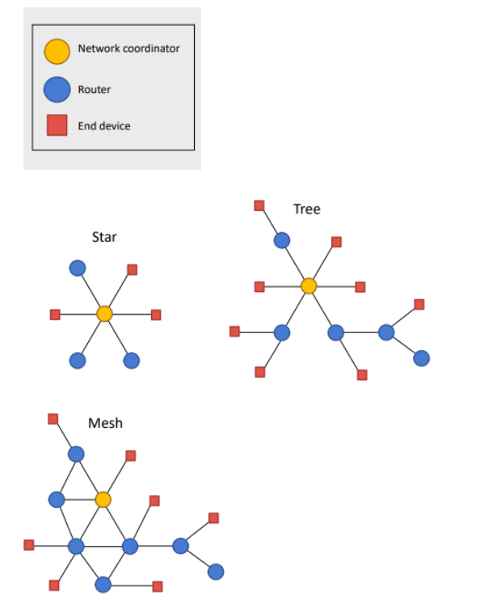

Queste tipologie di dispositivi possono essere orchestrate secondo diverse topologie di livello di rete. La topologia a stella (**Star**) si mappa direttamente e fedelmente sulla topologia a stella contemplata dallo standard IEEE 802.15.4 e adotta nativamente l'impiego del "superframe" (concetto esaminato in dettaglio nelle lezioni dell'IEEE 802.15.4). Esiste poi la struttura ad albero (**Tree**), la quale mantiene la possibilità opzionale di sfruttare la struttura del superframe per le sue comunicazioni. Diversamente, la topologia a maglia (**Mesh**) si caratterizza per le comunicazioni strutturate senza il vincolo di alcun superframe, garantendo percorsi di invio estremamente dinamici.

### Gestione e Servizi del Network Layer

Il Livello di Rete è demandato a coprire vari servizi indispensabili per il sistema. Ha l'onere della trasmissione dei dati (sia per comunicazioni di tipo unicast che multicast) e l'inizializzazione della rete. Parallelamente, si occupa in prima linea dell'indirizzamento univoco dei dispositivi sul campo (devices addressing), della complessa procedura di instradamento del traffico e di gestione dei percorsi logici (routes management & routing) e, per ultimo, del coordinamento durante le procedure di unione o abbandono (management of joins/leaves) da parte dei nodi periferici.

| **Name**          | **Request** | **Indication** | **Confirm** | **Description**                                                                                                                                                             |
| ----------------- | ----------- | -------------- | ----------- | --------------------------------------------------------------------------------------------------------------------------------------------------------------------------- |
| DATA              | X           | X              | X           | Servizio di trasmissione dati (Data transmission service)                                                                                                                   |
| NETWORK-DISCOVERY | X           |                | X           | Ricerca la presenza di eventuali PAN preesistenti (Look for existing PANs)                                                                                                  |
| NETWORK-FORMATION | X           |                | X           | Avvia e crea una nuova rete PAN. Può essere invocato unicamente da un router o da un coordinatore                                                                           |
| PERMIT-JOINING    | X           |                | X           | Attiva l'autorizzazione permettendo a nuovi nodi di associarsi alla PAN in corso (invocabile da router o coordinator)                                                       |
| START-ROUTER      | X           |                | X           | Avvia o reinizializza la gestione del superframe a livello del PAN coordinator o all'interno di un router logico                                                            |
| JOIN              | X           | X              | X           | Rappresenta la richiesta fisica di aderire a una PAN in essere. È invocabile liberamente da qualsiasi dispositivo                                                           |
| DIRECT-JOIN       | X           |                | X           | Procedura forzata utilizzata dai router o dal coordinator per vincolare in modo coercitivo l'unione di un end-device alla loro rete PAN                                     |
| LEAVE             | X           | X              | X           | Abbandono volontario o forzato di una PAN                                                                                                                                   |
| RESET             | X           |                | X           | Esegue il ripristino di stato e reinizializza le tabelle e logiche del network layer                                                                                        |
| SYNC              | X           |                | X           | Interfaccia concepita per consentire al layer applicativo di allinearsi e sincronizzarsi al router o al coordinator, al fine di estrarre eventuali messaggi/dati in pending |
| GET               | X           |                | X           | Acquisisce e legge un parametro di configurazione insito nel network layer                                                                                                  |
| SET               | X           |                | X           | Modifica e sovrascrive un parametro specifico interno al network layer                                                                                                      |

### La Formazione della Rete (Network Formation)

Per poter stabilire qualsiasi comunicazione utile, le logiche ZigBee impongono un'azione preliminare inderogabile: il dispositivo deve necessariamente formare ex novo una nuova rete (assumendo su di sé il ruolo di **ZigBee Coordinator**), oppure in alternativa aggregarsi a un network pre-esistente assumendo lo status formale di **ZigBee router** o **end-device**. Di enorme rilevanza è il fatto che questo specifico ruolo operativo ricoperto dal dispositivo non sia deciso in modo volatile ma stabilito in maniera definitiva a tempo di compilazione (compile-time).

La procedura formale volta alla creazione dell'architettura di rete (Network Formation) si innesca mediante la primitiva `NETWORK-FORMATION.request`. Questa richiesta viene lanciata da un nodo predisposto al ruolo di coordinatore che non risulti ancora integrato in altre Personal Area Network (PAN).

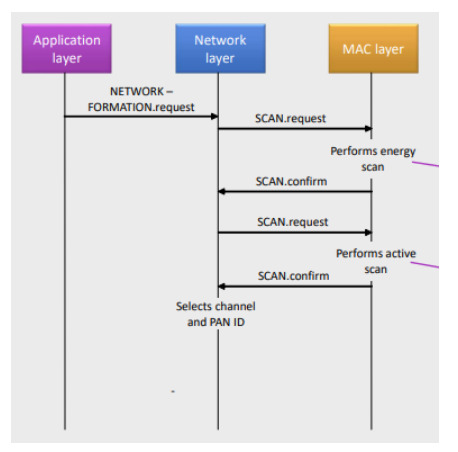

In questa delicata prima fase, il livello di rete utilizza operativamente i servizi del livello MAC sottostante per individuare un canale libero da potenziali conflitti con altre architetture vicine e contestualmente per allocare un identificatore della PAN (PAN ID) che risulti parimenti univoco nell'ambiente circostante. La scansione viene commissionata mediante la primitiva `SCAN.request` al MAC layer, che avvierà in un primo step una indagine di energia radio (energy scan) per rispondere alla logica: "Quale frequenza e canale risultano essere meno disturbati dal rumore di fondo?". Conseguito tale risultato confermato via `SCAN.confirm`, una seconda istanza di `SCAN.request` viene generata, portando stavolta il MAC layer ad attuare una scansione attiva (active scan) necessaria per determinare l'incognita cruciale: "Esiste la presenza tangibile di un altro network contiguo nelle immediate vicinanze?". Ottenuta la seconda `SCAN.confirm`, il livello Network provvede formalmente a fissare l'associazione matematica di canale radio e PAN ID (Selects channel and PAN ID).

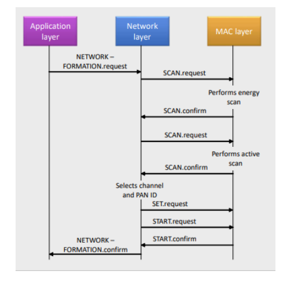

Definita questa infrastruttura logica, il coordinatore provvede alla fase conclusiva del setup procedendo con l'auto-assegnarsi l'indirizzo nominale di rete a 16-bit **0x0000**. Attraverso la chiamata `SET.request`, impartisce al livello MAC l'ordine definitivo di ratificare la selezione dell'identificatore PAN e del proprio address di sistema. Infine, si esegue la primitiva `START.request` destinata anch'essa al livello MAC, allo scopo precipuo di far debuttare la PAN (fase coincidente con l'avvio formale dell'emissione radio periodica dei messaggi beacon da parte del MAC layer). Completato tale startup, il MAC rende un avviso `START.confirm` che chiude il cerchio operativo autorizzando l'inoltro ai piani superiori di una risolutiva `NETWORK-FORMATION.confirm`.

###### Associazione e Unione al Network (Joining)

Una volta formata la rete, è necessario permettere a nuovi dispositivi di aggiungersi. Questo processo è chiamato **Joining a network**. Esistono due metodi principali per farlo. Il primo è il **Join through association**, in cui è il dispositivo stesso a prendere l'iniziativa e chiedere di unirsi a una rete già esistente. Il secondo metodo è il **Direct join**, in cui sono un router o il coordinatore (coordinator) a invitare direttamente un dispositivo a entrare nella loro PAN.

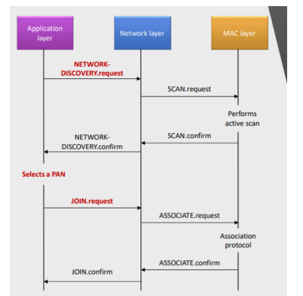

Analizzando la procedura di Join through association dal lato del dispositivo che vuole unirsi (la fase **Child-side**), il primo passo per il nuovo nodo è cercare le reti vicine. Per farlo, il dispositivo utilizza la primitiva `NETWORK-DISCOVERY.request` per individuare le PAN esistenti. Questa richiesta genera una `SCAN.request` verso il livello MAC, il quale esegue una scansione attiva sul canale radio. Quando rileva delle reti disponibili, il MAC risponde con una `SCAN.confirm`. A questo punto, il livello di rete avvisa il livello applicativo dei risultati della ricerca inoltrando la `NETWORK-DISCOVERY.confirm`.

Una volta ricevute le opzioni disponibili, il livello applicativo sceglie a quale PAN unirsi e avvia la fase operativa inviando una `JOIN.request`. Questa richiesta deve contenere due parametri fondamentali: l'identificatore esatto della PAN selezionata e un flag che indica se il dispositivo si unirà alla rete con il ruolo di router oppure di end-device.

Il livello di rete elabora questa richiesta e invia a sua volta una `ASSOCIATE.request` al livello MAC, innescando così l'**Association protocol**. L'intera sequenza di eventi si conclude positivamente quando il livello MAC termina l'associazione e restituisce una `ASSOCIATE.confirm` al livello di rete. Quest'ultimo, infine, conferma il successo dell'operazione al livello applicativo tramite la primitiva `JOIN.confirm`.

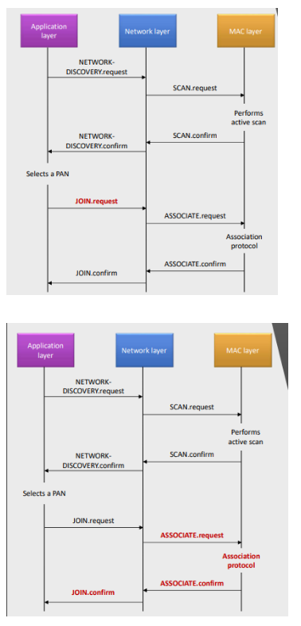

---

### Glossario e Concetti Chiave

- **ZigBee Coordinator**: È il nodo fondante della rete in ZigBee. Responsabile univoco della procedura di "Network Formation", deve operare come FFD e gli viene immancabilmente associato l'indirizzo corto `0x0000`.

- **Primitive di Servizio**: Elementi cardine della comunicazione inter-layer dello stack di ZigBee. Sono costituite unicamente da quattro istanze primarie (Request, Indication, Response e Confirm) indispensabili a orchestrare servizi, gestire comandi e avvalorare l'event flow.

- **Application Framework (APO, ZDO, APS)**: È l'ecosistema del livello più alto, costituito dagli Application Objects personalizzati (fino a 240 APO), dall'infrastruttura amministrativa unificatrice dello ZigBee Device Object (ZDO), e retto dalle funzionalità di trasferimento dati dell'APS.

- **Topologie Star, Tree e Mesh**: Modelli di distribuzione spaziale su cui gravita il protocollo di rete; laddove Topologia a Stella e ad Albero possono dipendere dal superframe IEEE 802.15.4, l'infrastruttura Mesh si declina in operazioni prive dei rigidi binari del superframe, consentendo comunicazioni cross-node decentralizzate.

---

# Il Livello di Rete ZigBee: Associazione, Topologie e Protocolli di Routing

La fase di ingresso in una rete, definita "Join through association", richiede una stretta collaborazione tra i dispositivi. Proseguendo l'analisi dal lato del dispositivo che richiede l'ingresso (Child-Side), la primitiva `JOIN.request` originata nel livello di rete ha il delicato compito di selezionare un nodo genitore, o **parent node**, identificato con la lettera **P**, scegliendolo tra i dispositivi presenti nel vicinato radio. Le dinamiche cambiano in base alla topologia. Nelle architetture a stella (**Star topologies**), il nodo P corrisponde inevitabilmente al coordinatore centrale e il nuovo dispositivo si unisce esclusivamente con il ruolo di end-device. Nelle architetture ad albero (**Tree topologies**), il nodo P può essere tanto il coordinatore quanto un nodo router intermedio, permettendo al nuovo dispositivo di assumere sia le sembianze di un router aggiuntivo, sia quelle di un end-device periferico. A questo punto subentra l'**Association protocol**, il quale si occupa fisicamente di estrapolare dal nodo genitore P un indirizzo di rete corto a 16 bit (**16-bits short address**). Il rilascio di questo identificativo avviene attraverso l'istanza di conferma `ASSOCIATE.confirm`, che restituisce formalmente l'indirizzo di rete al livello Network. Da quell'esatto istante in poi, il livello di rete utilizzerà esclusivamente questo indirizzo corto per instradare qualsiasi comunicazione futura all'interno del sistema, confermando l'avvenuto ingresso con un `JOIN.confirm` verso l'applicazione.

### Topologie ad Albero e Assegnazione Statica degli Indirizzi

La complessa rete di relazioni di tipo genitore-figlio (parent-child relationships), stabilita durante le procedure di join, modella l'intera rete conferendole una rigorosa struttura ad albero logico. In questo ecosistema, il **ZigBee coordinator** rappresenta la radice assoluta (root). I **ZigBee routers** agiscono come nodi interni di diramazione, sebbene possano operare anche come foglie qualora non abbiano nodi subordinati, mentre i **ZigBee end-devices** sono, per definizione strutturale, unicamente le foglie terminali del sistema. Questa topologia ad albero viene impiegata sistematicamente per pianificare l'assegnazione degli indirizzi di rete corti, basandosi su una pre-configurazione matematica del coordinatore.

Allo ZigBee coordinator vengono infatti impartiti staticamente tre parametri vitali: la variabile **Rm**, che stabilisce il numero massimo di router che ogni router può accettare come figli; la variabile **Dm**, che definisce il numero massimo di end-devices che ogni singolo router può ospitare; e la variabile **Lm**, che impone la profondità massima ammissibile per l'intero albero (maximum depth). Conseguentemente a questa parametrizzazione, ad ogni router viene affidato in gestione un intervallo precalcolato (range) di indirizzi. Questo intervallo serve per assegnare tempestivamente indirizzi ai propri figli in fase di join, ed è computato algebricamente proprio sulla base dei valori Rm, Dm e Lm. In virtù di questa struttura, le logiche interne forzano i dispositivi a unirsi alla rete posizionandosi il più in alto possibile nell'albero gerarchico, una strategia fondamentale per minimizzare il numero di salti (hops) necessari per far viaggiare le informazioni. È essenziale sottolineare che, sebbene gli indirizzi siano distribuiti seguendo questo rigido schema ad albero, l'effettiva topologia fisica di comunicazione sul campo può benissimo rivelarsi una rete a maglia (mesh).

### Esempi Pratici e Scenari di Allocazione

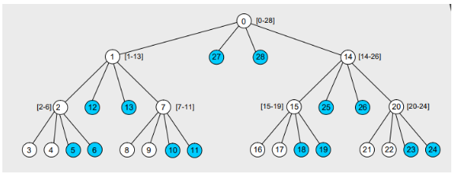

Per comprendere appieno l'assegnazione degli indirizzi, si analizzi una rete configurata con i parametri **Rm=2**, **Dm=2** e **Lm=3**. Il nodo coordinatore, assumendo l'indirizzo 0, gestisce l'intero range di indirizzi [0-28]. Al suo primo figlio router assegnerà l'indirizzo 1, dotandolo del sub-range [1-13], mentre al secondo router affiderà l'indirizzo 14 col sub-range [14-26]. Scendendo nei rami, il nodo 1 passerà il sub-range [2-6] al nodo 2, e così via, garantendo un'assegnazione non conflittuale.

### Metodologie di Routing: Broadcast, Tree e Mesh

Il livello di rete ZigBee supporta una molteplicità di metodi per l'instradamento dei dati: il **Broadcast** per trasmissioni a pioggia, il **Tree routing** (instradamento ad albero nodo a nodo) e il **Mesh routing** (instradamento a maglia nodo a nodo).

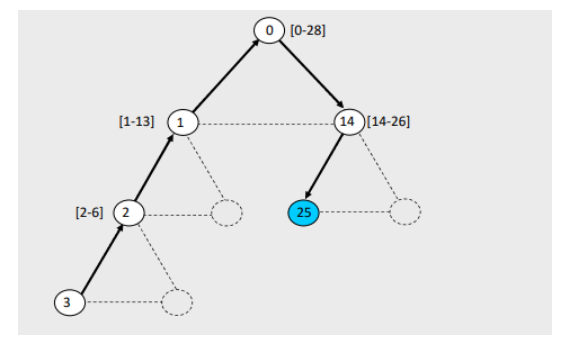

Il routing ad albero è estremamente lineare: i pacchetti vengono smistati lungo l'infrastruttura dell'albero valutando unicamente l'indirizzo di destinazione finale e facendo risalire o discendere il dato lungo i rami prestabiliti.

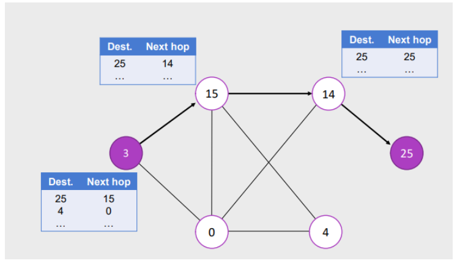

Per contro, il mesh routing è profondamente decentralizzato ed è basato sul noto protocollo **AODV** (Ad hoc On-Demand Distance Vector), ottimizzato per reti mobili. In questo scenario, se il mittente è un semplice end-device, non dovendo compiere scelte, inoltra passivamente il messaggio al proprio nodo genitore. Qualora il mittente sia un router o lo stesso coordinatore, esso fa affidamento su un registro interno denominato **Routing Table (RT)**, per instradare attivamente il pacchetto.

| **Field Name**      | **Size** | **Description**                                                                 |
| ------------------- | -------- | ------------------------------------------------------------------------------- |
| Destination Address | 16 bits  | Indirizzo di rete corrispondente alla destinazione finale                       |
| Next-hop Address    | 16 bits  | Indirizzo di rete del nodo adiacente (next hop) verso cui inoltrare i pacchetti |
| Entry Status        | 3 bits   | Stato della rotta: Active, Discovery_underway, Discovery_failed, o Inactive     |

Le topologie Tree e Mesh non sono mutuamente esclusive e possono coesistere pacificamente all'interno dello stesso sistema. I router ZigBee hanno la capacità computazionale di mantenere le informazioni necessarie per ambo le metodologie, e l'algoritmo di routing ha facoltà di passare (switch) dall'una all'altra modalità a seconda delle necessità. Bisogna però fare i conti con precise limitazioni: mentre il tree routing supporta il meccanismo del "beaconing" (richiedendo che ogni router che fa da ponte si sincronizzi preventivamente con il frame beacon del salto successivo), il mesh routing non consente operativamente l'utilizzo dei beacon periodici.

### Il Protocollo di Scoperta delle Rotte (Route Discovery)

Nel mesh routing, qualora un router debba inviare un pacchetto verso una destinazione sconosciuta (cioè mancante di una voce attiva nella Routing Table), si innesca il **Route discovery protocol**. Per gestire questa operazione, i router si avvalgono di un database temporaneo: la **Route Discovery Table (RDT)**.

| **Field Name**  | **Size** | **Description**                                                                                          |
| --------------- | -------- | -------------------------------------------------------------------------------------------------------- |
| RREQ ID         | 8 bits   | Identificativo univoco (numero di sequenza) assegnato ad ogni messaggio RREQ broadcast                   |
| Source Address  | 16 bits  | Indirizzo di rete logico di chi ha iniziato originariamente la richiesta di rotta                        |
| Sender Address  | 16 bits  | Indirizzo di rete del dispositivo che ha appena inoltrato la RREQ con il costo minore (l'hop precedente) |
| Forward Cost    | 8 bits   | Costo di percorso accumulato dalla sorgente al dispositivo corrente (compilato durante la RREQ)          |
| Residual Cost   | 8 bits   | Costo di percorso accumulato dal dispositivo corrente alla destinazione (compilato durante la RREP)      |
| Expiration time | 16 bits  | Un timer che quantifica in millisecondi quanto manca prima della cancellazione e scadenza della voce     |

Il protocollo si avvia con il nodo sorgente che trasmette in broadcast un messaggio esplorativo chiamato **RREQ** (Route Request). Questo messaggio incapsula il RREQ ID, l'indirizzo di destinazione cercato e il costo del percorso (path cost), che parte inizialmente dal valore 0. Man mano che la RREQ viaggia nella rete, i dispositivi intermedi elaborano il pacchetto aggiornando le proprie tabelle interne e lo ritrasmettono. Un passaggio cardine avviene in questi nodi di transito: essi incrementano il costo del percorso (Forward Cost) basandosi non su una semplice somma, ma su accurate stime della qualità del segnale radio fornite a basso livello dall'interfaccia IEEE 802.15.4. Un nodo intermedio che possiede già un percorso noto potrebbe rispondere direttamente alla RREQ bloccandone l'inoltro, ma in generale sarà il nodo di destinazione a rispondere invariabilmente, generando un pacchetto di conferma chiamato **Route reply (RREP)**. A differenza della richiesta che viaggia in broadcast, il pacchetto RREP viaggia esclusivamente in unicast, ripercorrendo a ritroso il percorso ottimale verso il nodo originatore e compilando, durante il viaggio, i campi "Residual cost" nei nodi intermedi.

### Considerazioni sull'Addressing

Questa disamina empirica introduce considerazioni finali vitali (Considerations) sul modello di indirizzamento ZigBee. Il difetto intrinseco è che si tratta di un modello strutturalmente molto "rigido" (rigid addressing model). Come dimostrato negli esercizi, si presentano frequenti paradossi in cui un dispositivo si vede negata la possibilità di unirsi alla rete, pur essendoci teoricamente spazio fisico, solo per il superamento locale dei limiti Rm o Dm su un particolare nodo. Per contrasto, il pregio immenso di questa tecnologia è di essere completamente decentralizzata (fully decentralized). Non è mai necessario richiedere o validare un nuovo indirizzo contattando remotamente il coordinatore principale; ogni router presente sul campo ha l'autorità matematica per prendere decisioni autonome. Questo approccio ingegnoso garantisce matematicamente l'impossibilità di generare collisioni di indirizzi, eliminando alla radice l'esigenza di implementare gravosi e dispendiosi protocolli di accordo distribuito (distributed agreements) in fase di accensione e unione alla rete.

---

### Glossario e Concetti Chiave

- **Join Through Association**: Procedimento in cui un nuovo dispositivo cerca attivamente un nodo "genitore" nella rete per ottenere, tramite l'Association protocol, un indirizzo a 16-bit univoco e validato.

- **Parametri Rm, Dm e Lm**: Variabili strutturali codificate staticamente nel coordinatore che delimitano rispettivamente i router massimi per nodo, gli end-device massimi per nodo e la profondità dell'albero. Costituiscono la matrice per l'assegnazione rigida degli indirizzi.

- **Mesh Routing e AODV**: Protocollo di instradamento decentralizzato a maglia. Utilizza complesse tabelle di instradamento (Routing Tables) che evitano colli di bottiglia, sfruttando le rotte su base "on-demand".

- **Route Discovery (RREQ / RREP)**: Meccanismo di indagine per trovare rotte inesplorate. Il nodo sorgente "grida" in broadcast una richiesta (RREQ) e riceve indietro dalla destinazione un percorso ottimizzato e validato (RREP) basato sulla qualità del segnale.

- **Addressing Decentralizzato**: Il principio secondo cui l'architettura ZigBee permette ai singoli router di fungere da agenti autonomi di distribuzione indirizzi, azzerando le collisioni senza il bisogno di onerose comunicazioni di rete a lungo raggio.

---

### L'Architettura del Livello Applicativo (Application Layer)

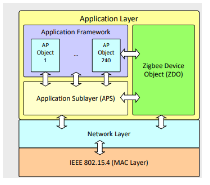

Salendo nella pila protocollare, incontriamo il Livello Applicativo ZigBee. Questa architettura è composta da tre elementi strettamente integrati: l'**Application Framework** (che ospita le applicazioni vere e proprie), lo **ZigBee Device Object (ZDO)** (che funge da amministratore per gestire i servizi applicativi) e il sottolivello **Application Support Sublayer (APS)**, incaricato di fornire i servizi pratici di trasmissione dati, scoperta dei dispositivi e associazione (binding).

L'**Application Framework** funge da contenitore e può ospitare fino a 240 applicazioni distinte, chiamate **Application Objects (APO)**. Ogni APO corrisponde a una funzionalità del dispositivo ed è identificato da un numero chiamato **Endpoint** (che va da 1 a 240). L'Endpoint 0 è invece rigidamente riservato allo ZDO. Gli endpoint possono essere paragonati a cavi virtuali (o socket in ambito Unix) che connettono le applicazioni tra loro, permettendo a profili, dispositivi fisici e punti di controllo differenti di coesistere all'interno di un unico nodo fisico. L'identità univoca di un APO sulla rete è data dalla combinazione del suo numero di endpoint e dall'indirizzo di rete del nodo che lo ospita. Nelle prime versioni dello standard, gli APO più semplici venivano interrogati tramite un servizio dati basato su coppie chiave-valore, il **Key Value Pair (KVP)**, che permetteva transazioni di Set, Get ed Event. Sebbene il KVP nativo sia scomparso dalla seconda versione di ZigBee, i suoi principi sopravvivono oggi nella libreria dei cluster. Le applicazioni più complesse comunicano invece tramite un servizio dati basato su messaggi.

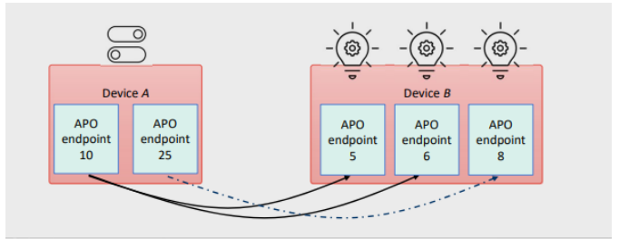

Per visualizzare questo concetto, possiamo immaginare un'applicazione domotica in cui un dispositivo B (che funge da server al livello applicativo) ospita gli APO 5, 6 e 8, corrispondenti a delle lampadine con un attributo "acceso/spento". Un dispositivo A (che funge da client) ospita gli APO 10 e 25, che rappresentano degli interruttori. Attraverso gli endpoint, gli interruttori possono impostare da remoto gli attributi delle lampadine.

### Cluster, Profili e Identificativi di Dispositivo

Per standardizzare la comunicazione, ZigBee organizza i comportamenti tramite i cluster. In parole semplici, un **Cluster** fornisce l'accesso a un servizio o a una funzionalità specifica di un oggetto applicativo. Esso definisce il protocollo di interazione, che a volte può limitarsi allo scambio di un singolo messaggio. Un cluster raggruppa **comandi** (che provocano un'azione sul dispositivo) e **attributi** (che mostrano lo stato del dispositivo). Ogni cluster è definito da un identificativo a 16 bit e assume significato all'interno di un determinato profilo.

| **Cluster Name**                  | **Cluster ID** |
| --------------------------------- | -------------- |
| Basic Cluster                     | 0x0000         |
| Power Configuration Cluster       | 0x0001         |
| Temperature Configuration Cluster | 0x0002         |
| Identify Cluster                  | 0x0003         |
| Group Cluster                     | 0x0004         |
| Scenes Cluster                    | 0x0005         |
| OnOff Cluster                     | 0x0006         |
| OnOff Configuration Cluster       | 0x0007         |
| Level Control Cluster             | 0x0008         |
| Time Cluster                      | 0x000a         |
| Location Cluster                  | 0x000b         |

A un livello logico superiore si trovano gli **Application Profiles** (Profili Applicativi), che definiscono il comportamento di un'intera categoria di applicazioni operanti su più dispositivi, raggruppando specifici cluster e dispositivi. Anche i profili possiedono identificatori a 16 bit assegnati dalla ZigBee Alliance: i profili pubblici coprono il range da `0x0000` a `0x7fff`, mentre i profili proprietari dei produttori spaziano da `0xbf00` a `0xffff`. In una rete possono coesistere pacificamente messaggi etichettati con Profile ID differenti.

| **Profile ID** | **Profile name**               |
| -------------- | ------------------------------ |
| 0101           | Industrial Plant Monitoring    |
| 0104           | Home Automation                |
| 0105           | Commercial Building Automation |
| 0107           | Telecom Applications           |
| 0108           | Personal Home & Hospital Care  |
| 0109           | Advanced Metering Initiative   |

Oltre a cluster e profili, esistono i **Device IDs** (Identificatori di Dispositivo), che vanno da `0x0000` a `0xFFFF`. Il loro scopo primario è rendere i dispositivi riconoscibili agli esseri umani, permettendo, ad esempio, a un'interfaccia grafica di mostrare l'icona corretta (un forno, una tenda o una lampadina). Il Device ID rivela "che cos'è" l'oggetto, ma non dice nulla su come comunicare con esso: quest'ultima informazione è dedotta esclusivamente dai Cluster ID supportati. La scoperta dei servizi (service discovery) sulla rete avviene infatti in base ai Profile ID e ai Cluster ID, mai in base al Device ID.

| **Name**            | **Identifier** | **Name**             | **Identifier** |
| ------------------- | -------------- | -------------------- | -------------- |
| Range Extender      | 0x0008         | Light Sensor         | 0x0106         |
| Main Power Outlet   | 0x0009         | Shade                | 0x0200         |
| On/Off Light        | 0x0100         | Shade Controller     | 0x0201         |
| Dimmable Light      | 0x0101         | Heating/Cooling Unit | 0x0300         |
| On/Off Light Switch | 0x0103         | Thermostat           | 0x0301         |
| Dimmer Switch       | 0x0104         | Temperature Sensor   | 0x0302         |

### Il Livello di Supporto Applicativo (APS)

Il modulo **APS** costruisce il frame di comunicazione assemblando endpoint, cluster ID, profile ID e device ID. Offre principalmente due tipologie di servizi: il servizio dati (Data Service) e la gestione logica (Management).

Il **servizio dati** agisce come un livello di trasporto molto leggero che garantisce lo scambio di messaggi tra i dispositivi. Si occupa di filtrare i pacchetti (scartando quelli diretti a endpoint non registrati o associati a profili non corrispondenti) e di generare le conferme di ricezione end-to-end (acknowledgments). Lo scambio avviene tramite tre primitive: la *request* per l'invio, l'*indication* per la notifica di ricezione e la *confirm* per restituire lo stato del trasferimento.

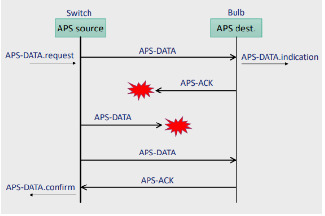

Per quanto riguarda il **Management**, l'APS amministra tre tabelle fondamentali: la tabella dei gruppi, la tabella di binding e la mappa degli indirizzi.

La **Gestione dei Gruppi** abilita le comunicazioni multicast creando aggregati logici di APO. Ogni gruppo possiede un indirizzo a 16 bit, e le singole applicazioni vi partecipano tramite la solita coppia di rete (network address / endpoint). Per gestire le iscrizioni si utilizzano le primitive `ADD-GROUP` e `REMOVE-GROUP`; se si tenta di aggiungere un nodo a un gruppo inesistente, il livello APS provvede a crearlo automaticamente.

### Binding e Gestione Dinamica degli Indirizzi (Address Map)

Un problema critico delle reti ZigBee è la volatilità degli indirizzi di rete. Durante la lezione è stato posto un quesito esemplificativo: supponiamo che in cucina vi sia un sensore di temperatura (indirizzo 100) associato a un termostato (indirizzo 200). A seguito di un black-out, la rete si resetta e alla riaccensione, per via dell'assegnazione dinamica, il sensore ottiene l'indirizzo 75 e il termostato il 220. Non avendo più gli indirizzi originari, come possono tornare a comunicare senza l'intervento di un tecnico?

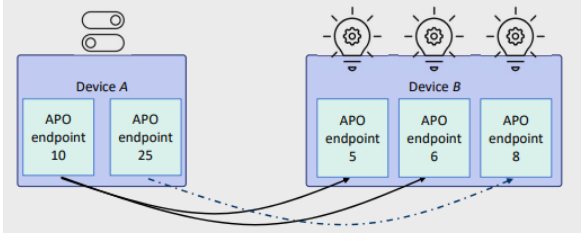

La risposta risiede nei servizi di **Binding** e nell'**Address Map** dell'APS. L'indirizzamento diretto (basato esplicitamente sulla combinazione fissa di endpoint e indirizzo di rete) è molto fragile di fronte ai cambiamenti di topologia. Per ovviare a questo, il Binding crea un collegamento logico unidirezionale e persistente tra gli endpoint (modificabile solo dallo ZDO del coordinatore o del router), consentendo un **indirizzamento indiretto**.

A supporto di questo meccanismo opera la mappa degli indirizzi (**Address Map**), una tabella interna all'APS che associa l'indirizzo di rete a 16 bit (mutevole) all'indirizzo MAC IEEE a 64 bit (che è l'identificativo hardware del dispositivo, assoluto e immutabile). Nel caso del black-out, quando il sensore e il termostato si ricollegano con i nuovi indirizzi, inviano automaticamente un messaggio di annuncio globale. Tutti i nodi della rete aggiornano all'istante le proprie mappe degli indirizzi e le tabelle di binding associate al MAC address, ripristinando magicamente la comunicazione senza alcun intervento umano.

| **IEEE Addr**      | **NWK Addr** |
| ------------------ | ------------ |
| 0x00300237B0230102 | 0x0000       |
| 0x00308237B0235CA3 | 0x0001       |
| 0x0031C237b023A291 | 0x895B       |

---

### Glossario e Concetti Chiave

- **Application Objects (APO) ed Endpoint**: Applicazioni specifiche ospitate su un dispositivo, identificate da canali virtuali chiamati Endpoint (da 1 a 240).

- **Cluster e Profile**: Un cluster definisce un singolo servizio (es. On/Off) con i relativi comandi e attributi. Un Profile raggruppa logicamente set di dispositivi e cluster in macro-aree commerciali (es. Home Automation).

- **Binding (Indirizzamento Indiretto)**: Collegamento logico tra endpoint di dispositivi diversi che rende la comunicazione indipendente dalle variazioni degli indirizzi di rete.

- **Address Map**: Tabella gestita dall'APS che lega dinamicamente l'indirizzo MAC a 64 bit (fisso) con l'indirizzo logico di rete a 16 bit (variabile), garantendo resilienza alla rete in caso di disconnessioni.

---

### Il Livello APS e i Meccanismi di Binding

La gestione dei collegamenti all'interno delle reti ZigBee, nota come **APS Binding** , si affida a primitive specifiche di rete denominate **BIND** e **UNBIND**. Nello specifico, la primitiva `BIND.request` ha lo scopo di creare una nuova voce (entry) all'interno della tabella di binding locale. Per funzionare, questa richiesta prende in input una tupla specifica che comprende l'indirizzo sorgente, l'endpoint sorgente, l'identificatore del cluster, l'indirizzo di destinazione e l'endpoint di destinazione. Al contrario, la primitiva `UNBIND.request` si occupa dell'operazione inversa, ovvero di eliminare una voce esistente dalla medesima tabella locale.

Il meccanismo di **indirizzamento indiretto** (Indirect addressing) si fonda sull'utilizzo combinato della tabella di binding e della mappa degli indirizzi. Questo sistema fa corrispondere in modo univoco l'indirizzo sorgente (composto dalla coppia indirizzo di rete ed endpoint) unito all'identificatore del cluster, a una specifica destinazione formata dall'endpoint di destinazione e dall'indirizzo di rete di destinazione. La **tabella di binding** viene fisicamente memorizzata a livello APS all'interno dello ZigBee coordinator, dei router, o in entrambi. L'aggiornamento di tale tabella avviene esclusivamente su esplicita richiesta dello ZDO presente nei router o nel coordinatore. Tipicamente, questa tabella viene inizializzata durante la fase di implementazione (deployment) della rete e associa le sorgenti e le destinazioni basandosi sui rispettivi indirizzi MAC.

Per comprendere concretamente il funzionamento, si consideri un esempio in cui una richiesta dati `APS-DATA.req` relativa al cluster 6 e proveniente dall'endpoint 5 sul nodo 0x3232... (inoltrata in modalità indiretta) genera tre distinte richieste di dati. Nello scenario descritto, le richieste vengono smistate: al nodo 0x1234... sull'endpoint 12, in modalità multicast al gruppo 0x9999, e infine al nodo 0x5678... sull'endpoint 44. Questa configurazione è formalizzata dalla seguente tabella:

| **Src MAC Addr (64 bits)** | **Src EP** | **Cluster ID** | **Dest Addr (16/64 bits)** | **Addr/Grp** | **Dest EP** |
| -------------------------- | ---------- | -------------- | -------------------------- | ------------ | ----------- |
| 0x3232...                  | 5          | 0x0006         | 0x1234...                  | A            | 12          |
| 0x3232...                  | 6          | 0x0006         | 0x796F...                  | A            | 240         |
| 0x3232...                  | 5          | 0x0006         | 0x9999                     | G            |             |
| 0x3232...                  | 5          | 0x0006         | 0x5678...                  | A            | 44          |
|                            |            |                |                            |              |             |

---

### Lo ZigBee Device Object (ZDO) e la Gestione della Rete

Lo **ZigBee Device Object (ZDO)** è una speciale applicazione di rete collegata in modo intrinseco all'endpoint 0. Questa componente logica è l'entità responsabile dell'implementazione pratica dei dispositivi ZigBee End Devices, degli ZigBee Routers e degli ZigBee Coordinators. Lo ZDO viene formalmente specificato attraverso un profilo dedicato, noto come **ZigBee Device Profile** (ZDP). Il compito primario di questo profilo è descrivere dettagliatamente i cluster che devono essere obbligatoriamente supportati da qualsiasi dispositivo ZigBee per garantirne la conformità. Inoltre, lo ZDP definisce i meccanismi attraverso i quali lo ZDO implementa i servizi essenziali di scoperta e di binding, oltre a regolamentare le modalità di gestione dell'intera rete e delle relative architetture di sicurezza.

I servizi operativi offerti dallo ZDO sono molteplici e includono la scoperta dei dispositivi e dei servizi, la gestione del binding, la gestione della rete stessa e, infine, la gestione dei singoli nodi. Per quanto attiene alla **Device and Service Discovery** (scoperta di dispositivi e servizi) , lo ZigBee Device Profile specifica i meccanismi necessari per ottenere qualsiasi tipo di informazione relativa a dispositivi e servizi presenti nel network. La scoperta dei dispositivi (Device discovery) è la funzione che permette a un nodo di ricavare l'indirizzo di rete o l'indirizzo MAC di altri dispositivi appartenenti al medesimo ecosistema di rete. Tale interrogazione può essere inoltrata a un singolo dispositivo tramite trasmissione unicast , oppure può essere inviata in broadcast sfruttando un'implementazione di tipo gerarchico. Nel modello gerarchico, un router restituisce al proprio nodo genitore (parent) il proprio indirizzo accompagnato dagli indirizzi di tutti i dispositivi finali (end devices) a esso direttamente associati; in modo analogo, il coordinatore restituisce gli indirizzi dei propri dispositivi associati.

La **scoperta dei servizi (Service discovery)** si articola invece su interrogazioni (queries) strutturate basate su specifici parametri, quali ID di profilo, ID di cluster, indirizzi o descrittori di dispositivo. Anche per i servizi è contemplato l'utilizzo di messaggi in broadcast, frangente in cui il coordinatore gestisce le interrogazioni rispondendo con liste di indirizzi di endpoint che soddisfano i criteri della query. In alternativa al broadcast, l'implementazione gerarchica prevede che ogni router raccolga proattivamente le informazioni dai dispositivi a esso associati per poi inoltrarle al proprio nodo genitore. La scoperta dei servizi può avvenire anche tramite chiamate dirette a un singolo dispositivo in modalità unicast ; ciononostante, se tale richiesta viene indirizzata verso un dispositivo finale (che solitamente ha limitate capacità energetiche e computazionali), sarà il coordinatore o il router a cui esso fa capo a formulare la risposta per suo conto.

Un'ulteriore funzione cardine dello ZDO è la **Binding Management**. Lo ZDO si prende carico di elaborare tutte le richieste di binding provenienti sia dagli endpoint locali sia da quelli remoti. L'obiettivo di questa elaborazione è l'aggiunta o l'eliminazione dinamica di voci all'interno della tabella di binding gestita al livello APS. È fondamentale ricordare che questo sistema di binding opera basandosi in maniera esclusiva sull'indirizzo fisico IEEE MAC. Per quanto riguarda la gestione più ampia delineata in **Managing Network and Nodes** , il modulo di Network management implementa fattivamente i protocolli necessari per far operare il nodo nel ruolo di coordinatore, router o end device, configurandosi in base alle impostazioni stabilite in fase di programmazione dell'applicazione o durante le procedure di installazione fisica. Parallelamente, il modulo di Node management prevede che lo ZDO serva le richieste in ingresso finalizzate a eseguire funzioni di esplorazione della rete, di recupero strutturato delle tabelle di routing e di binding presenti nel dispositivo, nonché di orchestrazione delle procedure di ingresso (join) e uscita (leave) dei nodi dalla rete.

---

### La ZigBee Cluster Library (ZCL) e il Modello Architetturale

La **ZigBee Cluster Library (ZCL)** rappresenta una componente fondativa e indispensabile dell'intero ecosistema ZigBee, agendo strutturalmente come un vasto repository centralizzato per tutte le funzionalità dei cluster. Dal punto di vista ingegneristico, la ZCL è progettata come una "libreria di lavoro" (working library) dinamica, mantenuta attraverso aggiornamenti regolari e costantemente integrata con nuove funzionalità. Di conseguenza, gli sviluppatori che operano in ambiente ZigBee sono fortemente incentivati a fare riferimento alla ZCL per individuare i cluster idonei da utilizzare all'interno delle proprie applicazioni. Questo approccio metodologico evita l'inefficienza di "reinventare la ruota" sviluppando da zero soluzioni proprietarie per necessità architettoniche già risolte a livello di standard. L'adozione sistematica della ZCL garantisce inoltre un elevatissimo grado di interoperabilità tra i dispositivi di diversi produttori e facilita enormemente tutte le future operazioni di manutenibilità del codice e dell'infrastruttura.

Un caso studio particolarmente calzante per l'applicazione dei concetti della libreria ZCL è quello relativo alla **Home Automation** (Domotica).

Il fondamento architetturale della ZCL si basa sull'applicazione rigorosa del **modello Client-Server**. All'interno di tale modello, un cluster viene concettualmente definito come una precisa collezione di comandi e attributi che delineano l'interfaccia standardizzata verso una specifica funzione di un dispositivo. Dal punto di vista logico, i cluster sono sempre raggruppati in riferimento a specifici domini funzionali (functional domains) all'interno dei rispettivi profili operativi. Nelle logiche di interazione del protocollo, il dispositivo che ha la responsabilità tecnica di memorizzare e mantenere lo stato degli attributi assume il ruolo di **server** del cluster. Di contro, il dispositivo che interroga o invia istruzioni atte a manipolare i valori di tali attributi ricopre il ruolo di **client** del cluster.

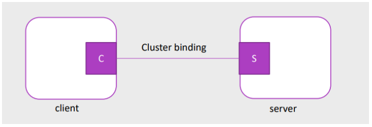

Analizzando nel dettaglio i **Functional Domains** storicamente impiegati nel campo dell'automazione domestica (Home Automation) , emergono varie categorie standardizzate: 

- la categoria "General" viene utilizzata per accedere e controllare gli attributi base di qualsiasi dispositivo in rete, in maniera del tutto trasversale e indipendente dal suo specifico dominio funzionale di competenza; 

- il dominio "Closures" è verticalizzato sulla gestione degli apparati di chiusura, includendo i controllori per tende oscuranti, le serrature intelligenti per porte e soluzioni similari ; 

- la categoria "HVAC" è preposta al controllo climatico, orchestrando dispositivi quali pompe, sistemi di ventilazione, apparati di riscaldamento e unità di deumidificazione ; 

- il dominio funzionale "Lighting" concentra invece tutte le specifiche per il controllo accurato dell'illuminazione ; la nutrita sezione "Measurement and sensing" è il ricettacolo dei dati provenienti dalla sensoristica, spaziando dalle misurazioni di illuminamento ambientale alla rilevazione di presenza, misurazione di flussi e monitoraggio dell'umidità ; 

- il dominio "Security and safety" si focalizza sui dispositivi dedicati all'allestimento di zone di sicurezza e sistemi anti-intrusione; 

- in ultimo, le cosiddette "Protocol interfaces" agiscono come ponti logici progettati per interconnettere nativamente l'ambiente ZigBee con altri protocolli di comunicazione esterni.

Le istruzioni operative all'interno della ZCL prendono la forma di **Comandi** (Commands), strutturati tecnicamente come messaggi inviati in un formato formale definito e certificato dalla ZCL stessa. 

Dal punto di vista della struttura dati, ogni comando include due elementi base: un'intestazione (header) e un carico utile contenente le direttive (payload). Per quanto concerne i comandi destinati alla manipolazione dello stato degli attributi, l'architettura prevede che essi vengano tipicamente inviati dall'entità client in direzione dell'entità server; di riflesso, le risposte a queste manipolazioni, elaborate dal server, vengono poi ricevute e processate dal client. Una dinamica inversa si osserva invece con i comandi utilizzati per la segnalazione dinamica e proattiva degli attributi (dynamic attribute reporting), dei quali il comando "report attribute" è l'esempio principe. Questi comandi di notifica vengono abitualmente inviati dal dispositivo server, che rappresenta il luogo in cui il dato originale dell'attributo è fisicamente custodito, in direzione del dispositivo client, che solitamente ha precedentemente istituito un legame (bound) operativo con il dispositivo server al fine di ricevere tali aggiornamenti.

Esplorando le principali categorie o **tipi di comandi** (Types of commands) , troviamo prima di tutto le funzioni elementari per leggere o scrivere il valore puntuale di un attributo. Un gradino più sopra in complessità si collocano i comandi per configurare un report e leggere la relativa risposta (Configure a report and read a reporting response). Questi strumenti logici risultano fondamentali poiché consentono al programmatore di richiedere esplicitamente delle letture periodiche di attributi o interi set di configurazioni , o in alternativa di imporre l'invio automatico di un report ogni qualvolta un attributo o una determinata configurazione subisce un cambiamento di stato. È proprio durante questa delicata fase di configurazione che si definiscono i parametri tecnici vincolanti per il reporting, come la durata temporale dell'attività, il periodo di scansione e, soprattutto, la soglia di variazione minima necessaria affinché venga generato il report (minimum change). Un'ulteriore e ultima categoria cruciale di comandi è dedicata alla scoperta degli attributi (Discover attributes) , un'operazione che serve al client per scoprire l'esistenza, ricavare gli ID univoci e dedurre le tipologie di dati degli attributi di un dato cluster che risultano attualmente supportati da un server interrogato.

La somma di tutte queste metodologie di comunicazione modella quelli che vengono definiti specifici **Schemi d'uso** (Schemes of use) , osservabili con chiarezza nelle procedure di utilizzo tipico per la configurazione dei dispositivi e l'installazione iniziale dei cluster.

---

### Glossario e Concetti Chiave

- **APS Binding:** Meccanismo nativo dello strato di rete ZigBee che consente l'indirizzamento indiretto. Mappa l'indirizzo e l'endpoint sorgente alla corretta combinazione di indirizzo e endpoint di destinazione utilizzando tabelle memorizzate all'interno di coordinatori e router.

- **ZDO (ZigBee Device Object):** Componente applicativa essenziale posizionata sull'endpoint 0, responsabile dei servizi primari di un nodo (come End Device, Router o Coordinator), occupandosi della scoperta di dispositivi e servizi (discovery) e della gestione logica della rete.

- **ZigBee Cluster Library (ZCL):** Un repository unificato (working library) e in continua espansione di cluster funzionali, che incentiva il riutilizzo del codice e garantisce un alto tasso di interoperabilità fra dispositivi di produttori dissimili.

- **Modello Client-Server ZCL:** Architettura comunicativa alla base della ZCL. Il server è il nodo che memorizza fisicamente i dati degli attributi, mentre il client è il nodo che interroga il server per leggere, modificare o essere notificato dei cambiamenti di tali attributi.

---

# Applicazioni Avanzate della ZigBee Cluster Library e Localizzazione Indoor

Le modalità di interazione tra i dispositivi ZigBee seguono precisi **Schemi d'uso** (Schemes of use) basati sul modello client-server. Osservando le dinamiche operative dei cluster dedicati all'accensione e spegnimento ("On/off"), si nota come un dispositivo incaricato della configurazione (Configuration tool) agisca nel ruolo di client (C) verso l'interfaccia di configurazione di un interruttore (On/off switch config), che opera come server (S). A sua volta, l'interruttore fisico (On/off switch) si comporta da client per inviare i comandi di accensione e spegnimento a una lampada semplice (Simple lamp), la quale funge da server. In scenari più complessi, come quelli che coinvolgono l'intensità luminosa, un interruttore dimmerabile (Dimmer switch) agirà come client utilizzando contemporaneamente i comandi del cluster "On/off" e del cluster di controllo del livello ("Level control") per pilotare una lampada dimmerabile (Dimmable lamp).

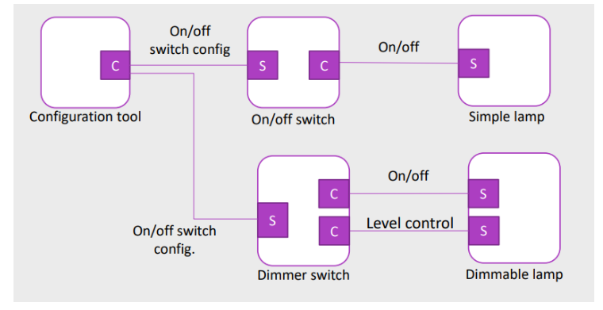

Ogni dispositivo ZigBee, per essere identificato e interrogato correttamente, deve implementare il **Basic Device Info Cluster**. Questo cluster espone una serie di attributi fondamentali (Attributes) di sola lettura, che descrivono l'hardware e il software del nodo. La tabella seguente ne riassume i parametri obbligatori (M) e opzionali (O):

| Identifier | Name                | Data Type           | Range       | Access    | Default      | Mandatory / Optional |
| ---------- | ------------------- | ------------------- | ----------- | --------- | ------------ | -------------------- |
| `0x0000`   | ZCLVersion          | uint8               | 0x00 - 0xff | Read Only | 0x02         | M                    |
| `0x0001`   | Application Version | uint8               | 0x00 - 0xff | Read Only | 0x00         | O                    |
| `0x0002`   | Stack Version       | uint8               | 0x00 - 0xff | Read Only | 0x00         | O                    |
| `0x0003`   | HWVersion           | uint8               | 0x00 - 0xff | Read Only | 0x00         | O                    |
| `0x0004`   | ManufacturerName    | string (0-32 bytes) | -           | Read Only | Empty string | O                    |
| `0x0005`   | ModelIdentifier     | string (0-32 bytes) | -           | Read Only | Empty string | O                    |
| `0x0006`   | DateCode            | string (0-16 bytes) | -           | Read Only | Empty string | O                    |
| `0x0007`   | PowerSource         | enum8               | 0x00 - 0xff | Read Only | 0x00         | M                    |

Un attributo di particolare interesse è il **PowerSource** (`0x0007`), il quale, essendo di tipo enumerativo a 8 bit, indica la fonte di alimentazione primaria del dispositivo. I valori assumibili da questo attributo (nei bit b6-b0) sono rigidamente standardizzati:

- `0x00`: Unknown (Sconosciuto)

- `0x01`: Mains (single phase) - Rete elettrica monofase

- `0x02`: Mains (3 phase) - Rete elettrica trifase

- `0x03`: Battery - Batteria

- `0x04`: DC source - Sorgente in corrente continua

- `0x05`: Emergency mains constantly powered - Rete di emergenza costantemente alimentata

- `0x06`: Emergency mains and transfer switch - Rete di emergenza con interruttore di trasferimento

- Da `0x07` in poi: Riservati per molteplici altri utilizzi futuri o specifici.

---

### Il Cluster di Misurazione della Temperatura

Spostando l'attenzione sul dominio della sensoristica, il **Temperature Measurement Cluster** rappresenta il blocco funzionale dedicato alla rilevazione termica. Gli attributi di questo cluster definiscono non solo il valore letto, ma anche i limiti hardware del sensore:

| Id       | Name             | Type   | Range                               | Access | Default | Mandatory / Optional |
| -------- | ---------------- | ------ | ----------------------------------- | ------ | ------- | -------------------- |
| `0x0000` | MeasuredValue    | int16  | MinMeasuredValue - MaxMeasuredValue | RP     | 0       | M                    |
| `0x0001` | MinMeasuredValue | int16  | 0x954d - 0x7ffe                     | R      | -       | M                    |
| `0x0002` | MaxMeasuredValue | int16  | 0x954e - 0x7fff                     | R      | -       | M                    |
| `0x0003` | Tolerance        | uint16 | 0x0000 - 0x0800                     | RP     | -       | O                    |

L'architettura operativa di questo cluster è volutamente essenziale: utilizza in modo esclusivo i comandi generici della ZCL. Il dispositivo sfrutta questi comandi standard per leggere e scrivere gli attributi (read/write attributes), per scoprire quali attributi sono supportati (discover attributes), e per impostare le configurazioni di reporting (configure and report). Come precisato dalle specifiche, non esistono altri comandi specifici o procedure di reporting proprietarie dedicate unicamente a questo cluster.

---

### Approccio Gerarchico e Combinazione dei Cluster

La libreria ZCL è stata intenzionalmente progettata per imporre un approccio gerarchico alla funzionalità dei dispositivi (hierarchical approach to device functionality). Questo paradigma di progettazione è fondamentale perché assicura la retrocompatibilità (backward compatibility) e promuove l'interoperabilità tra apparati di generazioni e marchi differenti.

Per comprendere questo approccio incrementale, si prenda in esame un **esempio di lampada** (Lamp example). Il livello base è rappresentato da una lampada on/off (On/off lamp), la cui unica funzionalità prevede i comandi elementari di accensione, spegnimento o commutazione (toggle), gestiti dal cluster `on/off`. Salendo nella gerarchia, una lampada dimmerabile (Dimmable lamp) erediterà il cluster `on/off` ma aggiungerà il cluster `Level control`, che permette di muoversi verso uno specifico livello luminoso o di effettuare passi di intensità (step). Aumentando ancora la complessità, una lampada con ballast dimmerabile (Dimmable ballast lamp) includerà i due cluster precedenti aggiungendo il `Ballast config`, utilizzato per impostare i limiti operativi e il fattore di ballast. Al vertice, una lampada dimmerabile a colori (Color dimmable lamp) includerà tutti i cluster summenzionati e incorporerà il `Color control` per la gestione dettagliata della tonalità e della saturazione (hue & saturation). Solo al di sopra di questo stack standardizzato, il produttore può implementare liberamente funzionalità proprietarie e specifiche (Manufacturer features).

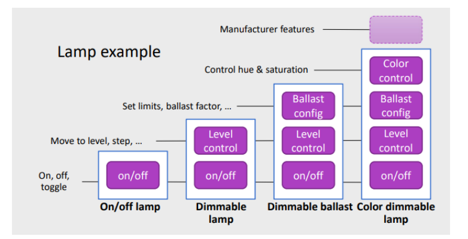

---

### Localizzazione Indoor in ZigBee: Concetti e Architetture

Un caso di studio avanzato e di notevole interesse applicativo riguarda l'**Indoor Localization** (localizzazione al chiuso) implementata all'interno delle reti ZigBee. Sebbene il tracciamento della posizione possa essere ottenuto attraverso molteplici metodologie, il metodo più comune per localizzare un dispositivo mobile all'interno di questi network consiste nello scambio di segnali radio (exchange of radio signals). Questo processo richiede l'orchestrazione di tre componenti fondamentali: un trasmettitore e un ricevitore di segnali radio (componente Hardware), un'unità di misurazione (componente Hardware), e un algoritmo di localizzazione (componente Software).

A livello sistemico, la localizzazione indoor può essere implementata seguendo due architetture principali:

1. **Remote positioning** (Posizionamento remoto): In questa configurazione, il dispositivo mobile trasmette segnali radio chiamati "beacons". Una rete di dispositivi fissi, noti come "anchors" (ancore), riceve questi segnali e, sulla base dei dati raccolti, stima la posizione del dispositivo in movimento.

2. **Self positioning** (Auto-posizionamento): Al contrario, in questo approccio è la rete di dispositivi fissi (anchors) a trasmettere costantemente i segnali radio. Il dispositivo mobile ascolta e riceve tali segnali, calcolando autonomamente la propria stima di posizione.

Il calcolo della posizione basato sulla potenza del segnale (**Indoor localization with signal strength**) si fonda su principi geometrici. L'unità di misurazione a bordo del sistema valuta la distanza del dispositivo mobile da un'ancora fisica analizzando l'intensità del segnale radio ricevuto. Integrando i dati di distanza rispetto a più ancore di riferimento (ad esempio, le ancore A, B e C), la posizione esatta del dispositivo mobile (M) viene ricavata mediante tecniche di triangolazione, calcolando matematicamente l'intersezione dei segmenti AM, BM e CM

---

### L'RSSI Location Cluster: Struttura, Attributi e Comandi

Per standardizzare le operazioni descritte, ZigBee impiega l'**RSSI Location Cluster**. Questo componente logico ha il compito primario di scambiare le informazioni di localizzazione basate sull'indicatore di potenza del segnale ricevuto (RSSI). Tra le sue funzioni, esso scambia i parametri del canale di trasmissione tra i nodi e, su richiesta, riporta i dati RSSI grezzi a un dispositivo centralizzato incaricato di eseguire computazionalmente i calcoli di localizzazione vera e propria. Un aspetto architettonico controintuitivo ma fondamentale di questo cluster, il cui utilizzo ricordiamo essere opzionale, è la distribuzione dei ruoli: il nodo mobile che deve essere localizzato agisce in qualità di **server**, mentre le ancore fisse sparse nell'ambiente operano come **client**.

Nelle configurazioni avanzate, l'**utilizzo del Location Cluster con un dispositivo centralizzato** richiede un'intensa coreografia di messaggi. Un dispositivo centralizzato (spesso un gateway) interagisce con le ancore (Anchor device, Client) e con il dispositivo mobile (Any device, Server). La sequenza temporale prevede l'invio di segnali di presenza (1. Send pings) dal mobile verso l'ancora, seguito da una serie di raffiche di misurazione (2. RSSI ping x N). Le ancore annunciano la propria presenza (Anchor node announce) e inviano richieste di dati (3. RSSI request) a cui il dispositivo risponde (4. RSSI Response). Successivamente, l'ancora inoltra le misurazioni lette al gateway (5. Report RSS measurement). Infine, il dispositivo mobile può fare una richiesta attiva per conoscere la propria ubicazione (6. Request own location), inducendo il gateway a rispondergli impostando la sua posizione assoluta (7. Set absolute location).

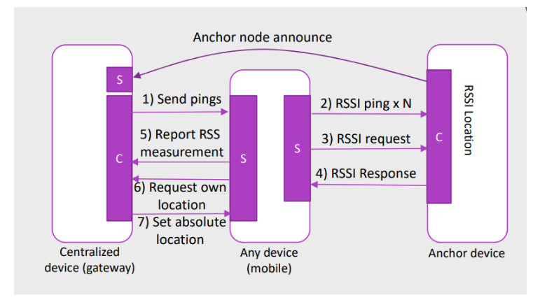

#### Attributi di Informazione sulla Posizione

Gli attributi informativi di questo cluster sono determinanti per definire il contesto spaziale:

| Identifier | Name            | Type         | Range           | Access     | Default | Mandatory / Optional |
| ---------- | --------------- | ------------ | --------------- | ---------- | ------- | -------------------- |
| `0x0000`   | Location Type   | data 8 bits  | 0000xxxx        | Read Write | -       | M                    |
| `0x0001`   | Location Method | enum 8 bits  | 0x00 - 0xff     | Read Write | -       | M                    |
| `0x0002`   | LocationAge     | uint 16 bits | 0x0000 - 0xffff | Read Only  | -       | O                    |
| `0x0003`   | Quality Measure | uint 8 bits  | 0x00 - 0xff     | Read Only  | -       | O                    |
| `0x0004`   | NumberOfDevices | uint 8 bits  | 0x00 - 0xff     | Read Only  | -       | O                    |

L'attributo **Location type** (`0x0000`) serve a discriminare se il sistema opera tramite un posizionamento assoluto o relativo, se si trova in uno spazio bidimensionale (2D) o tridimensionale (3D), e se adotta un sistema di coordinate rettangolari oppure formati riservati. L'attributo **Location Method** (`0x0001`) è altrettanto critico. I suoi valori determinano la precisa tecnologia di calcolo impiegata:

- `0x00` Lateration (Laterazione): un metodo basato su misurazioni RSSI ottenute da tre o più sorgenti.

- `0x01` Signposting (Segnaletica/Prossimità): la posizione riportata equivale semplicemente alle coordinate del nodo ancorato vicino che presenta il segnale ricevuto più forte.

- `0x02` RF fingerprinting: sfrutta un database in cui sono state raccolte firme (signatures) RSSI durante la fase di messa in servizio (commissioning); la posizione stimata corrisponde al punto nel database che si avvicina maggiormente alla firma RSSI rilevata al momento.

- `0x03` Out of band: indica che la posizione viene ottenuta interfacciandosi con dispositivi "fuori banda", ovvero apparati che non fanno parte della rete ZigBee nativa.

- `0x04` Centralized: indica che il calcolo è eseguito in maniera centralizzata da un nodo (come un Gateway) appartenente alla rete ZigBee.

- Da `0x40` a `0xff`: valori riservati (Reserved) per metodi di localizzazione specifici del produttore.

#### Attributi per le Impostazioni di Posizione (Location Settings)

A supporto del metodo scelto, intervengono gli attributi di impostazione che immagazzinano le coordinate fisiche e i parametri ambientali (Location settings attributes):

| Identifier | Name                   | Type   | Range           | Access     | Default | M/O |
| ---------- | ---------------------- | ------ | --------------- | ---------- | ------- | --- |
| `0x0010`   | Coordinate1            | int16  | 0x8000 - 0x7fff | Read Write | -       | M   |
| `0x0011`   | Coordinate2            | int16  | 0x8000 - 0x7fff | Read Write | -       | M   |
| `0x0012`   | Coordinate3            | int16  | 0x8000 - 0x7fff | Read Write | -       | O   |
| `0x0013`   | Power                  | int16  | 0x8000 - 0x7fff | Read Write | -       | M   |
| `0x0014`   | PathLoss Exponent      | uint16 | 0x0000 - 0xffff | Read Write | -       | M   |
| `0x0015`   | Reporting Period       | uint16 | 0x0000 - 0xffff | Read Write | -       | O   |
| `0x0016`   | Calculation Period     | uint16 | 0x0000 - 0xffff | Read Write | -       | O   |
| `0x0017`   | NumberRSSIMeasurements | uint8  | 0x01 - 0xff     | Read Write | -       | M   |

#### Comandi dell'RSSI Location Cluster

La complessa danza di messaggi osservata in precedenza è regolata da comandi strettamente codificati. I **Comandi ricevuti dal server** (il nodo mobile) comprendono funzioni mandatory (obbligatorie) e opzionali:

- `0x00`: Set Absolute Location (M)

- `0x01`: Set Device Configuration (M)

- `0x02`: Get Device Configuration (M)

- `0x03`: Get Location Data (M)

- `0x04`: RSSI Response (O)

- `0x05`: Send Pings (O)

- `0x06`: Anchor Node Announce (O)

Di contro, i **Comandi generati dal server** per rispondere alle sollecitazioni o notificare lo stato includono:

- `0x00`: Device configuration response (M)

- `0x01`: Location data response (M)

- `0x02`: Location data notification (M)

- `0x03`: Compact location data notification (M)

- `0x04`: RSSI Ping (M)

- `0x05`: RSSI Request (O)

- `0x06`: Report RSSI Measurements (O)

- `0x07`: Request Own Location (O)

---

### Wrap-Up: Costruzione di una Soluzione ZigBee

Tirando le fila sulle procedure operative per lo sviluppo pratico, la creazione di un dispositivo (Building a ZigBee solution) segue una filiera ingegneristica ben definita. I produttori delle piattaforme hardware conformi allo standard ZigBee forniscono solitamente lo stack di base, che include nativamente lo ZigBee Device Object (ZDO) e le interfacce per le ZigBee Cluster libraries (ZCL).

Partendo da questa architettura software pre-validata, il produttore finale della soluzione assembla i propri dispositivi. In questa fase vengono integrati gli elementi fisici necessari, quali trasduttori (transducers) o sensori specifici, e viene implementata la porzione rimanente del software e della configurazione personalizzata. A livello di topologia, per ogni nuovo nodo inserito è tassativo decidere a monte il suo ruolo all'interno della rete (se agirà da coordinator, router o semplice end-device) e procedere con la conseguente configurazione, intervenendo direttamente nel software o utilizzando appositi strumenti (tools).

L'ultimo passo critico per ogni dispositivo è l'implementazione del cosiddetto **APO** (Application Object). L'APO rappresenta il cuore applicativo del nodo, essendo l'entità software che implementa la reale "logica di business" (business logic) del dispositivo stesso. Se la stesura dell'APO avviene rispettando scrupolosamente le specifiche dettate dalla ZCL, il produttore si assicurerà che il suo dispositivo sarà pienamente interoperabile con gli ecosistemi e i dispositivi creati da altre case costruttrici (manufacturers) presenti sul mercato.

---

### Glossario e Concetti Chiave

- **Basic Device Info Cluster:** Il cluster essenziale e obbligatorio in ZigBee che fornisce attributi di sola lettura per identificare la versione hardware, l'alimentazione (PowerSource) e la versione del software del dispositivo.

- **Approccio Gerarchico della ZCL:** Principio di progettazione in base al quale dispositivi complessi (es. lampada a colori dimmerabile) ereditano funzionalmente i cluster dei dispositivi base (es. lampada on/off), massimizzando la retrocompatibilità.

- **RSSI Location Cluster:** Il cluster dedicato all'implementazione della localizzazione indoor (remote positioning o self positioning) all'interno delle reti ZigBee, basato sulla misurazione e triangolazione della potenza del segnale (RSSI). Nel modello, il nodo mobile in movimento funge in maniera atipica da "Server", mentre i punti di riferimento fissi (Ancore) operano come "Client".

- **APO (Application Object):** L'oggetto applicativo che risiede all'interno di ogni dispositivo e che ne racchiude la logica operativa e decisionale ("business logic"). La sua conformità alla ZCL è il prerequisito fondamentale per garantire l'interoperabilità tra brand diversi. 

---

# Sicurezza in ZigBee e Architetture Applicative

### Specifiche di Sicurezza in ZigBee: Concetti Fondamentali e Assunzioni

La specifica di sicurezza in ZigBee (ZigBee Security Specification) si fonda su un rigoroso insieme di servizi dedicati alla protezione globale della rete. Questi servizi core includono metodi strutturati per la creazione delle chiavi (key establishment) , il trasporto sicuro delle stesse da un nodo all'altro (key transport) , la protezione effettiva dei frame dati (frame protection) e la gestione avanzata dei dispositivi (device management). Insieme, questi elementi costituiscono i blocchi costruttivi fondamentali (building blocks) per l'implementazione di solide e inattaccabili politiche di sicurezza all'interno di qualsiasi apparato certificato ZigBee.

Il livello effettivo di sicurezza garantito dal protocollo non è assoluto, bensì dipende fortemente da alcune assunzioni tecniche critiche. Innanzitutto, esso si basa sulla salvaguardia fisica e logica delle chiavi simmetriche , sull'efficacia intrinseca dei meccanismi di protezione impiegati , e sulla corretta implementazione software sia dei meccanismi crittografici sia delle relative politiche di sicurezza coinvolte. La fiducia nell'intera architettura di sicurezza deriva direttamente dalla fiducia riposta in una sicura inizializzazione e installazione del materiale crittografico (keying material) , nonché nell'elaborazione e conservazione sicura di tale materiale all'interno delle memorie del nodo. Ulteriori assunzioni operative per garantire la solidità del sistema richiedono la corretta e attenta implementazione di tutti i protocolli coinvolti , l'impiego di generatori di numeri casuali privi di difetti strutturali e l'assoluta garanzia che le chiavi segrete non diventino mai disponibili all'esterno del dispositivo in maniera non protetta. A quest'ultima severa regola esiste un'unica, circoscritta eccezione: il momento esatto e vulnerabile in cui un nuovo dispositivo tenta di unirsi (join) alla rete per la prima volta.

Rispetto ad altre tecnologie, in ZigBee esistono tuttavia delle importanti avvertenze (caveats) derivanti dalla natura prevalentemente a basso costo dei dispositivi prodotti. In primo luogo, in sede di progettazione di sicurezza non si può mai assumere la disponibilità generale di hardware resistente alle manomissioni fisiche (tamper resistant). Di conseguenza, un accesso fisico diretto e malevolo a un dispositivo potrebbe teoricamente consentire a un attaccante di estrarre il materiale crittografico segreto e altre informazioni privilegiate, oltre a fornire accesso non autorizzato al software e all'hardware preposti alla sicurezza. In secondo luogo, le diverse istanze logiche (Application Objects, APO) residenti nel medesimo dispositivo hardware non sono logicamente separate tra loro, e i livelli inferiori dello stack risultano essere interamente accessibili e visibili al livello applicativo. Per questo specifico motivo architettonico, è imperativo che le diverse APO in esecuzione all'interno dello stesso nodo si fidino ciecamente e reciprocamente le une delle altre.

---

### Scelte Progettuali e Architettura di Sicurezza

Le stringenti scelte progettuali inerenti alla sicurezza (Security Design Choices) sono focalizzate alla protezione dei dispositivi individuali considerati come entità unitarie, e non sono volte a garantire una protezione isolata per le singole applicazioni (o processi) ospitate all'interno di uno stesso nodo. Questo approccio consente un forte riutilizzo del medesimo materiale crittografico tra i vari livelli di astrazione dello stesso dispositivo, snellendo l'overhead. Dal punto di vista delle chiavi crittografiche, la topologia prevede l'uso di una singola chiave per l'intera rete, la quale gestisce la sicurezza a livello di network (network level security) , e di una singola chiave per ogni collegamento, che gestisce la sicurezza punto-punto a livello di comunicazione dispositivo-dispositivo.

Un principio ingegneristico fondamentale stabilisce che il layer dello stack che origina un frame dati è considerato l'unico responsabile per la messa in sicurezza iniziale di tale frame. Ad esempio, se un pacchetto di comando generato al livello di rete (NWK) necessita di essere protetto, dovrà essere applicata in maniera tassativa la sicurezza crittografica del livello NWK. Inoltre, qualora i requisiti di sistema richiedano una difesa attiva contro il furto di servizio (theft of service), la sicurezza a livello di rete deve essere applicata sistematicamente per tutti i frame in transito , fatta eccezione solo ed esclusivamente per i pacchetti legati al momento di associazione di un nuovo nodo. L'architettura prevede il massiccio riutilizzo dei materiali crittografici tra i diversi livelli, ma utilizza anche chiavi di collegamento specifiche (link-keys) per sovrapporre una sicurezza addizionale end-to-end dalla sorgente fino alla destinazione finale. Un'applicazione specifica è libera di usare meccanismi crittografici aggiuntivi (proprietari o meno), ma tale onere ricade interamente sull'applicazione stessa, senza gravare sullo standard di base. A livello applicativo, i profili (Application profiles) dovrebbero peraltro includere rigorose policy per gestire e mitigare le condizioni di errore derivanti dalle operazioni di cifratura e decifratura dei pacchetti (securing and unsecuring). Questi specifici errori possono rivelarsi cruciali, indicando sovente una potenziale perdita di sincronizzazione del materiale crittografico tra i nodi o segnalando attacchi informatici in pieno svolgimento. Per questo, le policy di sicurezza devono obbligatoriamente rilevare e gestire problematiche quali la perdita di sincronizzazione dei contatori, il loro eventuale overflow e la desincronizzazione delle chiavi vere e proprie , imponendo inoltre, se ritenuto strategicamente necessario, la scadenza pianificata e il conseguente aggiornamento periodico delle chiavi operative.

Analizzando la gerarchia della Sicurezza (Security Architecture), si delinea un modello a strati. Il livello di rete (NWK layer) è investito della responsabilità per il trasporto sicuro e inalterato dei propri frame. Per perseguire tale scopo, il livello NWK utilizza in modo esclusivo le chiavi fornite dal sottostante livello APS , offrendo ai pacchetti le fondamentali proprietà di crittografia (encryption), integrità del dato (integrity) e "freschezza" (freshness, essenziale per sventare tentativi di attacco replay e duplicazione dei messaggi). Bisogna tuttavia precisare che alcuni messaggi di comando fondamentali per il bootstrap del sistema, quali i messaggi di associazione, non possono per natura tecnica essere crittografati durante le negoziazioni iniziali. Spostandoci al sottolivello APS, a quest'ultimo spetta la responsabilità di assicurare il trasporto protetto dei propri frame specifici (APS-level frames). L'APS fornisce inoltre i delicati meccanismi operativi indispensabili per la generazione (key establishment) e il trasporto delle chiavi crittografiche , offrendo infine servizi cruciali per il management globale del dispositivo. Al vertice di tutto il sistema troviamo l'oggetto ZDO (ZigBee Device Object), il cui ruolo è governare dall'alto le politiche di sicurezza (security policies) e l'intera configurazione crittografica del nodo in uso. Nello specifico, l'unità ZDO esercita il controllo ferreo sulla gestione e sui cicli di vita delle chiavi crittografiche emettendo a tal proposito delle precise istruzioni (primitive) indirizzate al livello APS.

---

### Gestione delle Chiavi Crittografiche e Key Establishment

Le fondamentali chiavi crittografiche, necessarie alla sussistenza della rete ZigBee, possono essere ottenute attraverso l'impiego di tre meccanismi ben distinti. Il primo meccanismo è il "Key transport" (trasporto della chiave), che si identifica in un meccanismo unidirezionale per comunicare una chiave pre-generata da un dispositivo originario verso uno o più dispositivi di destinazione. Il secondo metodo è il "Key establishment", un sofisticato meccanismo bilaterale che prevede l'esecuzione sincrona di un protocollo matematico da parte di due dispositivi comunicanti, con il fine ultimo di derivare e far combaciare una chiave segreta reciprocamente condivisa, senza che essa transiti in chiaro sul canale. Il terzo e ultimo approccio è la Pre-installazione, che consiste semplicemente nel memorizzare nel firmware del nodo una chiave fissa e predefinita durante la fase di fabbricazione del dispositivo.

Le tipologie di chiavi che entrano in gioco nel sistema (The Keys) sono tre. In primis, la **Chiave di Rete a 128 bit** (Network key), la quale è matematicamente condivisa da tutti i dispositivi appartenenti al medesimo ecosistema e viene acquisita dal nodo unicamente tramite meccanismi di key-transport oppure mediante pre-installazione in fabbrica. Di questa chiave esistono due diverse implementazioni: la variante standard e la variante ad alta sicurezza (high-security). In secondo luogo, vi sono le **Chiavi di Collegamento a 128 bit** (Link keys), che presentano una condivisione esclusiva solo tra due specifici dispositivi (modalità unicast logica) e vengono acquisite in modo flessibile tramite trasporto, establishment o pre-installazione. È importante notare che se si sceglie di utilizzare il protocollo di key establishment per crearle, tale processo si deve basare sull'utilizzo propedeutico di una Master key già preesistente a bordo dei due nodi. Queste Link keys possono variare in base al loro perimetro di utilizzo, classificandosi come globali o univoche; in particolare, un'apposita "chiave globale di default" ha lo scopo precipuo di consentire ai nuovi dispositivi di stabilire la prima connessione con il Trust Center della rete. Infine, la **Master key a 128 bit**, il cui compito è estremamente specifico: essa viene utilizzata dalla logica di rete solamente per implementare e far girare i complessi protocolli matematici di key establishment , e viene acquisita dal nodo in via esclusiva tramite key-transport preventivo o pre-installazione fisica. Lo standard prevede inoltre l'esistenza di ulteriori chiavi transitorie o dedicate (other keys), impiegate unicamente per eseguire in sicurezza il trasporto di altro materiale crittografico; esse vengono tipicamente derivate e generate dalla link key operativa mediante l'utilizzo algoritmico di funzioni matematiche unidirezionali (one-way functions).

Approfondendo i Servizi di Sicurezza APS legati alla creazione delle chiavi, il **Key Establishment** coinvolge immancabilmente due entità attive ben distinte: un dispositivo definito iniziatore (initiator) e un dispositivo risponditore (responder). Per consentire l'attuazione di questo meccanismo, il livello APS incorpora e implementa un rigido protocollo di tipo "challenge-response" (chiamata e risposta) denominato **Symmetric-Key Key Establishment** (spesso abbreviato in SKKE). Questo protocollo si svolge in quattro fasi consequenziali inalienabili. La Fase 1 è definita "provisioning della fiducia" (trust provisioning) e si fonda sull'utilizzo delle informazioni sicure (trust information) fornite tipicamente, in questo frangente, dall'utilizzo della Master key. Tale Master key può derivare da una pre-installazione hardware, può venire installata remotamente da un Trust Center (che sia l'iniziatore stesso, il risponditore o un terzo nodo garante) , oppure può essere derivata da dati inseriti in quel momento da un utente umano sotto forma di PIN, password o codice testuale. La Fase 2 comporta lo scambio in chiaro di dati di natura effimera, che consistono quasi sempre in un numero pseudo-casuale (random number). La Fase 3 impiega questo dato effimero per scatenare le funzioni matematiche che deriveranno e calcoleranno asincronamente l'agognata "link key" sui due lati della comunicazione. La Fase 4 chiude il ciclo imponendo una conferma logica tra i due nodi, atta a certificare reciprocamente che la link key sia stata computata correttamente e coincida su ambo i dispositivi.

---

### Il Ruolo del Trust Center

Il cuore pulsante di tutto l'infrastruttura difensiva della rete è costituito dal **Trust Center**. Esso rappresenta l'autorità centrale, un dispositivo fidato a cui tutti i nodi operanti all'interno di un perimetro di rete accordano la propria totale fiducia. Il suo compito prioritario consiste nel distribuire le chiavi di criptazione (impiegando il meccanismo del key transport) al nobile fine di supportare due elementi: la gestione e configurazione globale della rete e la sicurezza delle applicazioni end-to-end tra pari. Le ferree regole topologiche impongono che tutti i membri che si accreditano sulla rete debbano obbligatoriamente riconoscere uno e un solo Trust Center operativo ; conseguentemente, lo standard impone che debba esistere "esattamente un" Trust Center in ogni singola e distinta rete dichiarata come "sicura" (secure network).

L'implementazione del Trust Center varia a seconda dei requisiti di sicurezza e del caso d'uso (use case). In infrastrutture classificate come ad "alta sicurezza" (high security applications), il Trust Center può fisicamente coincidere con un dispositivo blindato e dedicato, il quale viene pre-caricato in fase manifatturiera con il proprio indirizzo definitivo di Trust Center e l'importantissima Master key iniziale (initial master key). Nelle alternative di implementazione più diffuse in ambito consumer, è l'hub o il coordinatore di rete (Coordinator) ad assumere su di sé gli oneri e il ruolo logico di Trust Center. In alternativa, quest'ultimo ha facoltà di delegare l'autorità a un altro dispositivo della topologia ritenuto tecnicamente idoneo a questo scopo preposto. Il protocollo di interazione si attiva non appena un dispositivo esterno tenta di unirsi (joins) alla rete: esso deve per forza ottenere le nuove chiavi dal Trust Center, seguendo di volta in volta protocolli distinti in funzione della tipologia di chiavi di cui i nodi dispongono (oppure in base al fatto che un nodo non disponga di alcuna chiave pregressa). Nelle implementazioni a bassa sicurezza (low-security applications), il Trust Center è istruito a cedere e trasmettere la Master key al nodo entrante utilizzando semplicemente un trasporto non protetto (unsecured transport). All'opposto della gravità della situazione, se un dispositivo entrante dispone preventivamente della propria Master key per via di una pre-installazione o altro mezzo, sfrutterà quest'ultima con l'esplicito intento di instaurare preventivamente un collegamento comunicativo sicuro (secure communication link) con il Trust Center, procedendo poi ad acquisire il trasporto delle chiavi in via blindata.

---

### Glossario e Concetti Chiave Fondamentali

- **Symmetric-Key Key Establishment (SKKE):** Un protocollo crittografico del tipo challenge-response integrato a livello APS che permette a due nodi (un iniziatore e un risponditore) di calcolare e derivare privatamente una chiave di collegamento segreta (link key), basandosi esclusivamente su una Master key originaria e sull'elaborazione matematica di valori casuali scambiati (dati effimeri).

- **Trust Center:** Entità centrale, unica e inviolabile per ogni rete sicura, delegata all'amministrazione, archiviazione sicura e distribuzione sicura del materiale crittografico ai nodi. Esso è riconosciuto universalmente da tutti i membri della topologia di rete ZigBee.

- **Link Key vs. Network Key:** La distinzione basilare di sicurezza dello stack ZigBee. La *Network key* copre il canale in modo globale, mettendo in sicurezza tutto il traffico a livello di NWK; la *Link key* agisce in maniera puntuale, mettendo in comunicazione bidirezionale e criptata solo ed esclusivamente due nodi in uno scambio privato unicast.

- **Security Design Caveats (Avvertenze):** Il tallone d'Achille della topologia, causato dal design compatto e a basso costo dei SoC (System on Chip) usati per ZigBee. La mancanza tipica di hardware resistente alle intrusioni fisiche impone architetture basate sulla fiducia reciproca incondizionata tra le varie parti dell'Application Object (APO) su uno stesso chip.

---
