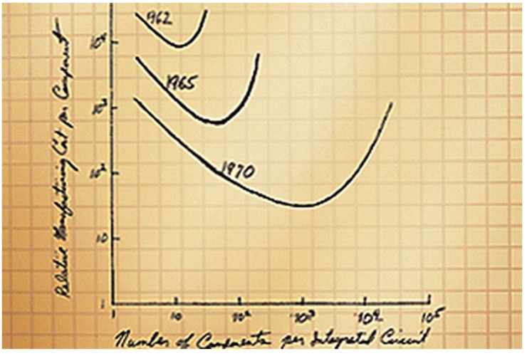
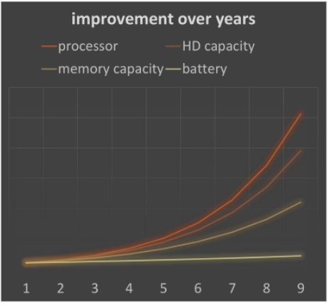
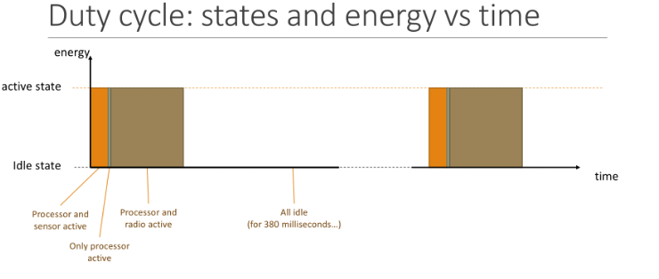

# IoT – Design Aspects

Il seguente capitolo affronta i concetti introduttivi legati alla progettazione di sistemi operanti nell'ambito dell'Internet of Things (IoT), rielaborando gli argomenti discussi durante il corso di "Mobile and Cyber-Physical Systems" del Prof. Stefano Chessa. Gli obiettivi principali di apprendimento si concentrano sull'analisi delle caratteristiche dei dispositivi IoT, lo studio dell'efficienza energetica e l'introduzione al concetto di *duty cycle*.

### Caratteristiche e Struttura dei Dispositivi IoT

Ogni dispositivo IoT si distingue tipicamente per essere un sistema progettato per mantenere un basso costo e un basso consumo energetico (**low power, low cost system**). Tali dispositivi sono generalmente di dimensioni ridotte e strutturati per poter operare in modo completamente autonomo nell'ambiente circostante. A livello di architettura hardware, un nodo IoT è tipicamente equipaggiato con un **processore**, un banco di **memoria** e un **ricetrasmettitore radio** (**Radio Transceiver**).

Per permettere l'interazione con l'ambiente fisico circostante, la scheda include specifici **elementi di sensing** in grado di rilevare grandezze fisiche quali accelerazione, pressione, umidità, luce, segnali acustici, temperatura, coordinate GPS e campi magnetici. A questi sensori si affiancano spesso degli **attuatori**, la cui presenza varia strettamente in base al caso d'uso dell'applicazione. Infine, per garantire l'autonomia, l'alimentazione è solitamente fornita da una batteria oppure da celle solari per il recupero di energia ambientale.

### Problematiche di Progettazione nell'IoT

La progettazione di infrastrutture IoT solleva diverse e complesse sfide architetturali. In primis, l'**efficienza energetica** rappresenta un ostacolo primario, dal momento che i sensori sono prevalentemente alimentati a batteria o utilizzano tecniche di *energy harvesting*, rendendo imprescindibile l'adozione di soluzioni hardware e software altamente efficienti dal punto di vista dei consumi. Una seconda problematica è la necessità di adattabilità alle condizioni mutevoli dell'ambiente, che richiede un paradigma di gestione e programmazione della rete di tipo dinamico.

A causa delle severe limitazioni in termini di risorse computazionali dei nodi, sorge inoltre l'esigenza di sviluppare e adottare protocolli a bassa complessità e con un *overhead* estremamente ridotto a qualsiasi livello dello *stack* protocollare. Parallelamente, le garanzie di **sicurezza** devono essere assicurate trasversalmente a tutti i livelli dell'architettura di rete. Infine, la necessità di supportare comunicazioni di tipo *multihop* e la potenziale mobilità dei nodi impongono la creazione di *stack* protocollari dedicati e di algoritmi di *routing* dinamico, aggiungendo ulteriore complessità alla gestione dell'archiviazione e del pre-processamento locale dei dati raccolti (**Data storage & (pre-) processing**).

### La Legge di Moore e le Implicazioni Hardware

Molte delle limitazioni affrontate nella progettazione dei dispositivi IoT derivano direttamente dai vincoli intrinseci di capacità di elaborazione, memoria disponibile, densità della batteria e capacità di comunicazione. Viene naturale chiedersi se la naturale evoluzione delle tecnologie hardware riuscirà da sola a superare questi limiti. Storicamente, l'evoluzione dei processori ha seguito la **Legge di Moore**, la quale postula che il numero di transistor che possono essere integrati a basso costo all'interno di un singolo chip cresce in modo esponenziale, raddoppiando all'incirca ogni due anni.

Per comprendere l'enormità di questa crescita, basti osservare che il processore INTEL 4004 prodotto nel 1971 ospitava circa 2.300 transistor operanti a 740 KHz e supportati da 4KB di memoria di programma. Facendo un balzo temporale, un INTEL CORE I9-7980XE rilasciato nel terzo trimestre del 2017 è in grado di vantare 1.8 miliardi di transistor, operare a una frequenza di 4.4 GHz con 128 GB di memoria gestita e richiedere 165 W di potenza elettrica.

Tuttavia, quando si applica la Legge di Moore al settore IoT, si aprono tre diverse chiavi di interpretazione. La prima sostiene che le prestazioni del processore raddoppiano ogni due anni a parità di costo; un paradigma che, fino ad oggi, si è rivelato assolutamente vero e trainante nel mercato dei server e dei computer desktop. La seconda interpretazione osserva che le dimensioni fisiche del chip si dimezzano ogni due anni mantenendo lo stesso costo, comportando una conseguente e fondamentale riduzione dei consumi energetici. La terza chiave di lettura, infine, postula che le dimensioni e la potenza di elaborazione possono rimanere costanti, mentre il costo industriale si dimezza ogni biennio.

Nell'ecosistema IoT, sorprendentemente, tutte e tre queste interpretazioni trovano riscontro concreto. Esistono infatti applicazioni che richiedono rigorosamente l'utilizzo di sensori di dimensioni miniaturizzate o con consumi energetici irrisori. Al contempo, determinati scenari richiedono capacità di elaborazione decisamente superiori a bordo del singolo sensore per processare i dati localmente. In quasi tutti i casi, tuttavia, il contenimento dei costi rimane un parametro progettuale fondamentale.

Oggi il mercato offre innumerevoli piattaforme hardware IoT, ciascuna caratterizzata da capacità di elaborazione e profili energetici profondamente differenti. A differenza di quanto avviene per i computer tradizionali, lo sviluppo dei dispositivi IoT fa massicciamente affidamento su processori a basso costo e a bassa potenza. Spesso, in ottica di ottimizzazione, si integrano vecchi processori o varianti riaggiornate tuttora disponibili sul mercato. In generale, i progettisti tendono a utilizzare sempre l'hardware più economico capace di soddisfare i requisiti specifici dell'applicazione, in quanto l'effetto scala – dettato dal volume massiccio di dispositivi IoT che formano una rete – si riflette in modo considerevole sui costi finali dell'infrastruttura. Pertanto, la Legge di Moore non risolverà per magia i problemi legati alla progettazione IoT nel prossimo futuro, ma verrà piuttosto sfruttata come volano per rendere la tecnologia sempre più piccola, efficiente ed economica.

### Il Divario Tecnologico: "Intel vs Duracell"

Un problema architetturale evidente è dato dallo sviluppo asimmetrico delle tecnologie fisiche. Negli anni si è assistito a un rapido e costante miglioramento della capacità dei processori e degli hard disk (*HD capacity*), seguiti con andamento positivo dalla capacità delle memorie; tuttavia, la densità energetica delle batterie è cresciuta a un ritmo esasperatamente lento, definendo una dinamica ironicamente ribattezzata "INTEL VS DURACELL".

Questa disparità si riflette drammaticamente nell'allocazione del budget energetico. Confrontando un computer portatile e un sensore wireless, si notano profili di consumo agli antipodi. In un portatile tradizionale, l'elemento più dispendioso è di gran lunga lo schermo (48% dell'energia totale), seguito dal chipset della scheda madre (23%), dal processore (10%), dalla scheda grafica (9%), dal disco rigido (6%) e infine dalla rete (4%). In un sensore IoT wireless privo di display, invece, l'energia è spartita equamente in modo differente: un blocco del 40% è assorbito dalla scheda di interfaccia di rete wireless (**Wireless NIC**), un altro 40% è richiesto dal blocco del processore e del chipset, mentre il restante 20% viene utilizzato dal comparto di sensing e dal convertitore analogico-digitale (**ADC**).

### Dinamiche di Consumo Energetico e Radio

Il costo energetico delle comunicazioni rappresenta una delle componenti più critiche per l'autonomia del sistema. Prendendo in esame una tradizionale interfaccia di rete WiFi, si possono misurare chiaramente i consumi associati ai vari stati operativi: quando la periferica è posta in modalità di sospensione profonda (*Sleep mode*) consuma appena 10 mA, ma questo valore schizza a 180 mA in modalità di ascolto continuo (*Listen mode*). La ricezione attiva dei dati (*Receive mode*) incrementa l'assorbimento a 200 mA, mentre la trasmissione raggiunge il picco massimo di 280 mA.

Analizzando i consumi su scala molto più piccola, come quelli di un sensore di tipo *Mote-clone*, i rapporti di consumo subiscono interessanti variazioni. In stato di sonno, un *Mote-clone* assorbe la cifra irrisoria di 0.016 mW. Quando la radio è posta in ascolto (*Listen mode*) il dispositivo assorbe 12.36 mW, un valore quasi identico all'assorbimento in fase di pura ricezione (*Receive mode*), quantificabile in 12.50 mW. Il consumo legato alla trasmissione (*Transmit mode* a 19.2 kbps) scala proporzionalmente al livello di potenza impostato per l'antenna: al livello di potenza minimo (0.1) si registrano 12.36 mW, al livello 0.4 si toccano i 15.54 mW, fino a un massimo di 17.76 mW per un livello di potenza pari a 0.7.

Questi dati empirici portano a dedurre principi cruciali per l'efficienza energetica della radio. Sorprendentemente, in determinati scenari la potenza necessaria per inviare pacchetti (*transmit power*) risulta inferiore a quella impiegata per captarli e processarli in ingresso (*receive power*), ed è appurato che il consumo per restare passivamente in ascolto equivale grossomodo a quello di ricezione attiva. Di conseguenza, la logica di ottimizzazione impone che la radio debba essere mantenuta rigorosamente spenta per la maggior parte del tempo possibile.

Dato che anche l'unità di elaborazione è responsabile per il 30%-50% dell'energia totale spesa, il processore stesso andrebbe parimenti tenuto disattivato (*turned off*) quanto più possibile. In ogni caso, i progettisti hardware e software devono calcolare attentamente i propri bilanci energetici, poiché la sola transizione di stato termodinamico necessaria per accendere o spegnere fisicamente il processore e la radio comporta un consumo energetico che non può essere trascurato.

### Duty Cycle e Sospensione dell'Attività

Il cardine per garantire una lunga autonomia e risparmiare preziose riserve di energia risiede nella drastica riduzione dei periodi in cui il sensore è in stato di piena attività (*active state*). Fortunatamente, il carico di lavoro di un dispositivo IoT è per sua natura profondamente ciclico e ripetitivo. Le operazioni classiche si riassumono in un ciclo sequenziale: misurazione ambientale (*Sense*), successiva elaborazione e salvataggio locale dei dati (*Process & store*) e, infine, invio o ricezione degli stessi (*Transmit/receive*).

Poiché il sensore deve unicamente alternare queste finestre di intensa attività a lunghe fasi di profonda inattività, viene a definirsi formalmente un rapporto temporale noto come **Duty Cycle**. Durante queste lunghe finestre di silenzio, il consumo energetico del nodo crolla a livelli minimi, un risultato che però si ottiene soltanto assicurandosi che l'intera catena hardware – processore, modulo radio e le relative interfacce di *I/O* – venga posta attivamente in uno stato "congelato" o sospeso (*freezed*).

---

### Glossario e Concetti Chiave

- **Autonomia vs Evoluzione dell'Hardware**: I nodi IoT sono intrinsecamente sistemi a basso costo progettati per agire autonomamente. Il vero "collo di bottiglia" che ne limita lo sviluppo non è la potenza di calcolo (guidata dalla Legge di Moore), ma il bassissimo tasso di miglioramento delle batterie rispetto all'architettura dei microchip ("Intel vs Duracell").

- **Bilancio Energetico dei Nodi**: Diversamente da un portatile dove lo schermo assorbe metà della potenza, nei piccoli nodi wireless la quasi totalità dell'energia (circa l'80%) è divorata dall'uso combinato del ricetrasmettitore di rete (40%) e dell'unità di elaborazione (40%).

- **Necessità del Duty Cycle**: Poiché lo stato di ascolto della radio consuma all'incirca la stessa energia della fase di vera ricezione, l'unica strategia per estendere la vita della batteria è ricorrere al concetto di Duty Cycle, ibernando alternativamente i componenti di rete e logici del dispositivo tra un'attività ciclica e la successiva.

---

### Il Duty Cycle: Definizione e Ottimizzazione del Codice

Il risparmio energetico nei dispositivi IoT si ottiene in modo efficace riducendo il periodo complessivo di attività del sensore. Di base, l'attività di un nodo all'interno di una rete è in gran parte ripetitiva e si scompone tipicamente in tre fasi sequenziali: la misurazione delle grandezze fisiche tramite i sensori (sense), la successiva elaborazione e memorizzazione locale (process & store), e infine la trasmissione o ricezione dei dati via radio. Poiché il sistema opera in modo intrinsecamente ciclico, il sensore è costretto ad alternare queste finestre di intensa attività a lunghi periodi di inattività, definendo formalmente la metrica del **duty cycle**. Durante le necessarie fasi di inattività, il consumo energetico crolla a livelli molto bassi, a condizione primaria, però, che il processore, il modulo radio e le interfacce di input/output (I/O) vengano attivamente "congelati" (freezed) o posti in stati di ibernazione. Concettualmente, il duty cycle rappresenta la frazione di un periodo totale di riferimento in cui il sistema risulta essere in uno stato attivo. Esso viene tipicamente espresso sotto forma di rapporto o percentuale: un duty cycle del 100% indica che il dispositivo è perennemente in funzione, senza mai prendersi una pausa, mentre un valore dell'1% denota un sistema che è attivo esclusivamente per la centesima parte del suo periodo operativo.

Analizzando un frammento teorico di codice applicativo, si può osservare come il flusso proceda dalla lettura analogica di un sensore, passando per una conversione matematica del voltaggio, fino alla stampa del dato sulla seriale (trasmissione), per chiudersi infine con un'istruzione di pausa. Dal punto di vista temporale, la lettura del sensore dura 4 millisecondi (impegnando attivamente sia il processore che il sensore), la conversione matematica richiede 1 millisecondo (richiamando il solo processore), la trasmissione occupa 15 millisecondi (coinvolgendo processore e radio), e il successivo tempo di attesa lascia tutti i componenti in stato "idle" per 380 millisecondi. Complessivamente, un intero ciclo impegna il nodo per 400 millisecondi, sebbene questi valori millisecondi siano intesi a mero scopo illustrativo del concetto. Purtroppo, questo approccio basilare tramite la funzione `delay()` non provvede allo spegnimento reale dei componenti hardware che non sono in uso. Per ottimizzare seriamente l'efficienza, lo sviluppatore deve fare affidamento su routine specifiche, come funzioni `turnOn(x)` e `turnOff(x)` per l'accensione e lo spegnimento selettivo delle singole periferiche, affiancate da istruzioni `idle(y)` capaci di forzare il microcontrollore in uno stato di riposo a basso consumo per $y$ millisecondi. Quando il codice viene riscritto integrando queste accortezze architetturali, diviene fondamentale calcolare separatamente il nuovo duty cycle per ciascun componente (processore, radio e sensore), isolando i rispettivi tempi di attività e riposo.

### Modelli di Consumo e Misurazione dell'Energia

Per comprendere quantitativamente l'impatto di un buon duty cycle, è sufficiente prendere in esame le specifiche tecniche reali di un sensore wireless di classe *mote*. Nello specifico, il microprocessore Atmega128L assorbe 8 mA in modalità operativa completa e scende drasticamente a 15 $\mu$A durante lo sleep. L'antenna radio necessita di 19,7 mA per poter ricevere, 17,4 mA per trasmettere e solamente 20 $\mu$A in standby; parallelamente, un sistema di logging su memoria flash richiede 15 mA in fase di scrittura, 4 mA in lettura e 2 $\mu$A in sleep, mentre la scheda dei sensori (Sensor Board) assorbe 5 mA a regime e 5 $\mu$A in sleep. Bisogna inoltre considerare che la batteria subisce un naturale deterioramento della capacità quantificabile nel 3% annuo. L'analisi comparata di due differenti modelli operativi – il primo configurato con un duty cycle generale del 100% e il secondo ottimizzato al 5% – dimostra come la gestione del riposo influisca asimmetricamente sui moduli, dato che alcuni componenti devono lavorare in parallelo con cicli di attività disgiunti. Il componente di logger, ad esempio, può mantenere un suo duty cycle di scrittura/lettura fisso al 3% in entrambi i modelli, restando in sleep per il restante 97% del tempo, svincolato dal comportamento del processore principale. Anche un modesto duty cycle del 10% per un componente non implica necessariamente un blocco continuo di accensione; tale porzione attiva può essere distribuita nell'arco del periodo con diverse configurazioni temporali, alternando rapidamente accensioni e spegnimenti per soddisfare le tempistiche del protocollo di rete.

Prima di proseguire col dimensionamento degli accumulatori, è importante richiamare i concetti fisici alla base del dimensionamento energetico. A livello del Sistema Internazionale, l'energia si misura in Joule (J) e la potenza assorbita in Watt (W), definiti rigorosamente dalla relazione $1J=1W\cdot sec$. Più nello specifico, i principi dell'elettromagnetismo definiscono un Watt come il lavoro prodotto quando una corrente di 1 Ampere (A) fluisce soggetta a una differenza di potenziale elettrico pari a 1 Volt (V), espressa come $1W=1V\cdot 1A$. Poiché i dispositivi integrati impiegano correnti continue fornite a una differenza di potenziale considerata quasi costante, diviene evidente che i valori di potenza ed energia assorbite dipendono univocamente dall'intensità della corrente espressa in Ampere. Alla luce di questa proprietà, nei sistemi IoT è prassi comune esprimere sia l'energia residua immagazzinata dalla batteria (la carica), **sia il consumo complessivo richiesto dal circuito utilizzando l'unità pratica dei milliampere-ora (mAh).**

### Formule Matematiche per il Calcolo del Consumo e dell'Autonomia

Il bilancio energetico di un singolo ciclo si ottiene ponderando il consumo dei singoli sottosistemi hardware per le rispettive percentuali di impiego. Iniziando dall'elaboratore centrale, il costo energetico del microprocessore per ciclo $E_{\mu}$ è descritto dall'equazione $E_{\mu}=C_{\mu}^{full}\cdot dc_{\mu}+C_{\mu}^{idle}\cdot(1-dc_{\mu})$, dove $C_{\mu}^{full}$ rappresenta il costo energetico del microprocessore a pieno carico per singolo ciclo, $C_{\mu}^{idle}$ il rispettivo costo in stato di idle e $dc_{\mu}$ la percentuale del suo duty cycle. Passando al modulo di trasmissione wireless, il costo energetico della radio $E_{\rho}$ per ogni iterazione è modellato tramite una formula tripartita, che separa ricezione, trasmissione e sonno: $E_{\rho}=C_{\rho}^{T}\cdot dc_{\rho}^{T}+C_{\rho}^{R}\cdot dc_{\rho}^{R}+C_{\rho}^{idle}\cdot(1-dc_{\rho}^{T}-dc_{\rho}^{R})$. All'interno di quest'ultima equazione, i coefficienti $C_{\rho}^{T}$ e $C_{\rho}^{R}$ indicano rispettivamente il dispendio in trasmissione e in ricezione, mentre $C_{\rho}^{idle}$ identifica il consumo nello stato di riposo. Le variabili $dc_{\rho}^{T}$ e $dc_{\rho}^{R}$ esprimono invece le percentuali frazionarie di duty cycle dedicate all'invio o all'ascolto radiofonico. Mantenendo una struttura identica a quella del processore per definire il costo del logger $E_{\lambda}$ e della sensor board $E_{\sigma}$, diviene finalmente calcolabile il costo energetico totale per duty cycle (espresso come $E$), dato dalla semplice sommatoria $E=E_{\mu}+E_{\rho}+E_{\lambda}+E_{\sigma}$.

L'obiettivo finale del dimensionamento è il calcolo della durata operativa del sensore sul campo, detta comunemente **lifetime**. L'aspettativa di vita totale, qualora venga quantificata in numero di duty cycle eseguibili, risponde alla formula macroscopica $Lifetime=\frac{B_{0}-L}{E}$, in cui $B_{0}$ corrisponde alla carica iniziale della batteria inserita e $L$ rappresenta il degrado, ovvero la frazione di carica persa strutturalmente a causa delle inefficienze costruttive della batteria nel corso del tempo. Questo parametro di perdita strutturale introduce una complessità algebrica non indifferente, poiché il valore complessivo $L$ dipende intimamente dal lifetime stesso. Per aggirare questa ricorsività, si può esprimere la perdita di carica come parametro discreto $\epsilon$ su singolo ciclo e rimodellare il bilancio tramite una precisa equazione di ricorrenza: $B_{n}=B_{n-1}\cdot(1-\epsilon)-E$, dove $B_{n}$ è la carica effettiva residua al ciclo $n$-esimo. La risoluzione matematica di questa equazione alle differenze finite restituisce la formula in forma chiusa: $B_{n}=B_{0}\cdot(1-\epsilon)^{n-1}+\frac{E\cdot((1-\epsilon)^{n}-1)}{\epsilon}$. Ponendo il valore di $B_{n}$ a zero, è possibile estrapolare il valore di $n$ cicli che determina la morte energetica del dispositivo. Dal punto di vista prettamente pratico ed ingegneristico, è però necessario tenere a mente che un microcontrollore reale va in blocco (smettendo di operare) decisamente prima dello zero termodinamico, spegnendosi qualora il livello della batteria valichi il gradino di "minimo" voltaggio necessario ad alimentare la circuiteria interna.

### Analisi Visiva e Risoluzione Pratica

Le correlazioni matematiche descritte possono essere facilmente interpolate graficamente per guidare le scelte dei costruttori. L'andamento dell'autonomia misurata in mesi contro la capacità del pacco batteria assume una marcata fisionomia logaritmica. Un sensore gestito dal modello con 5% di duty cycle si posizionerà sempre lungo una curva prestazionale nettamente più alta rispetto a un sensore obbligato a processare dati al 100%. Simmetricamente, mettendo a confronto l'aspettativa di vita contro la percentuale del duty cycle per accumulatori standard da 2000 mAh e varianti maggiorate da 3000 mAh, risulta chiarissimo come all'aumentare dell'efficienza logica del codice si otterranno prolungamenti del ciclo vitale superiori rispetto all'aumento fisico dei volumi di immagazzinamento al litio.

[INSERIRE IMMAGINE: Grafici analitici "Battery life (months) vs battery capacity (mA-hr)" e "Sensor lifetime (months) vs duty cycle" che confrontano i trend tra i diversi modelli operativi e i blocchi batteria ].

Per mettere alla prova quanto esposto, si rende necessario approcciarsi al dimensionamento effettivo di un dispositivo dotato di batteria da 2000 mAh, al fine di calcolarne il prelievo orario e la durata ignorando momentaneamente il rateo di dispersione fisiologica. Considerando che il processore Atmega128L assorbe 8 mA in esecuzione e 15 $\mu$A in sleep, che il ricevitore richiede 20 mA in sola trasmissione per scendere anch'esso a 20 $\mu$A di base, e che i sensori a bordo impiegano 5 mA o 5 $\mu$A in base allo stato, è indispensabile tracciare prima i ratei di attivazione temporale all'interno del ciclo prefissato. Ricostruendo la durata degli stati attivi e incrociandoli in una griglia di consumo ponderato divisa per componente, si derivano i duty cycle definitivi che permetteranno allo sviluppatore di estrarre l'ampere/ora e, mediante banale divisione con la capacità nominale, definire i mesi di operatività attesi.

---

### Glossario e Concetti Chiave

**Il Duty Cycle e il Risparmio Energetico:** La tecnica primaria per garantire la sostenibilità dei sensori, basata sulla gestione chirurgica dell'alternanza tra finestre di attività ciclica (lettura e invio radio) e lunghi periodi in cui l'intero chip è indotto in stato dormiente (sleep), limitando i flussi di corrente.

**La Metrica di Capacità (mAh):** Nei sistemi in corrente continua operanti a tensioni tendenzialmente fisse, l'assorbimento di potenza e la capacità di stoccaggio si riconducono analiticamente alla corrente assorbita; l'adozione diffusa del milliampere-ora risulta dunque lo strumento più pratico e diretto sia per esprimere la riserva iniziale della batteria, sia il consumo per singolo ciclo di codice.

**Modellazione del Lifetime e Degradazione Costruttiva:** L'equazione matematica che descrive il numero di iterazioni massime permesse prima dello spegnimento del nodo non può sottrarsi a una formula di ricorrenza in cui, oltre ai consumi reali hardware per ciclo elaborato, gioca un ruolo fondamentale il continuo e inesorabile decadimento elettrico dovuto all'usura fisica degli elementi chimici interni alle pile.

---

### Decisioni Locali e Globali: L'Impatto sulla Rete

Come analizzato in precedenza, la soluzione cardine per garantire l'**efficienza energetica** risiede nella riduzione sistematica del *duty cycle*. Tuttavia, l'implementazione di questa strategia comporta conseguenze diametralmente opposte a seconda del componente hardware che viene disattivato. Spegnere il processore è considerata una **decisione locale**: il *node scheduler* interno al dispositivo ha piena visibilità su quali siano le attività in coda e sa esattamente quando il processore debba essere risvegliato per eseguirle.

Al contrario, la disattivazione del modulo radio rappresenta una **decisione globale** che impatta l'intera architettura. Un dispositivo con la radio spenta non è in grado di comunicare con l'esterno. Di conseguenza, non può ricevere messaggi in ingresso, comandi remoti o aggiornamenti di sistema. Ancora più critico è il fatto che un nodo "sordo" non può fungere da *router* in un'infrastruttura di rete *multihop*. All'atto pratico, spegnere la radio significa escludere fisicamente e logicamente il dispositivo dalla rete.

Per orchestrare queste delicate fasi di accensione e spegnimento, entrano in gioco i **Protocolli MAC** (Medium Access Control). Si tratta di protocolli di comunicazione di basso livello incaricati di inviare e ricevere pacchetti da e verso i sensori che si trovano nel raggio di copertura. Mentre nelle reti convenzionali i protocolli MAC si limitano ad arbitrare in modo equo l'accesso al canale di comunicazione condiviso , nell'ecosistema IoT essi assumono un ruolo vitale implementando le strategie per l'efficienza energetica. Sono infatti questi protocolli a doversi occupare di sincronizzare i dispositivi e di spegnere la radio non appena quest'ultima non è strettamente necessaria, bilanciando il risparmio vitale di energia con la necessità di mantenere la connettività.

Questi aspetti chiudono il quadro riepilogativo sulle sfide di design dell'Internet of Things, che spaziano dalla basilare efficienza energetica alla complessa modulazione del duty cycle, culminando nella stima del consumo energetico totale e della conseguente aspettativa di vita (lifetime) del nodo sensoriale.

### Esercizio 1: Trasmissione Continua dei Dati Sensoriali

Per calare questi concetti nella pratica, si consideri un primo scenario applicativo in cui un dispositivo indossabile è incaricato di misurare il battito cardiaco (Heart-Rate, HR) di un utente. Il sensore effettua il campionamento tramite un fotodiodo posizionato sul polso con una frequenza di 20 Hz. Ogni singola operazione di campionamento dura 0.5 ms e richiede tassativamente che sia il processore sia il sensore siano attivi simultaneamente. Il battito cardiaco viene computato ogni 2 secondi, periodo che corrisponde alla raccolta di 40 campioni consecutivi. Quando è necessario inviare un pacchetto dati al server centrale, l'operazione richiede un tempo medio di 2 ms, impegnando attivamente sia il processore che il modulo radio.

In questa prima configurazione progettuale, il dispositivo adotta una strategia di *offloading* computazionale: memorizza 5 campioni consecutivi letti dal fotodiodo e li trasmette direttamente al server. È il server, dotato di maggiore potenza e senza vincoli energetici, a occuparsi di calcolare la frequenza cardiaca effettiva, sgravando del tutto il nodo IoT da questa computazione. Per la risoluzione, ignorando eventuali perdite strutturali della batteria (battery leaks), si farà riferimento alla seguente tabella delle specifiche hardware basata su un microprocessore Atmega128L:

| **Componente**                   | **Stato**                | **Consumo Corrente** | **Unità di misura** |
| -------------------------------- | ------------------------ | -------------------- | ------------------- |
| **Micro Processor (Atmega128L)** | current (full operation) | 8                    | mA                  |
|                                  | current sleep            | 15                   | µA                  |
| **Radio**                        | current xmit             | 20                   | mA                  |
|                                  | current sleep            | 20                   | µA                  |
| **Sensor Board**                 | current (full operation) | 5                    | mA                  |
|                                  | current sleep            | 5                    | µA                  |
| **Battery Specifications**       | Capacity                 | 2000                 | mAh                 |
|                                  |                          |                      |                     |

L'obiettivo dell'esercizio è ricavare il consumo totale orario e il *lifetime* calcolando l'energia spesa per campionare a 20 Hz e trasmettere raffiche di 5 campioni con i rispettivi tempi di attività e inattività indicati.

### Esercizio 2: Calcolo Locale del Battito Cardiaco (Edge Computing)

Il secondo scenario ripropone il medesimo dispositivo e la medesima architettura hardware, ma varia la strategia software introducendo un paradigma di elaborazione locale. Anche in questo caso il fotodiodo campiona a 20 Hz impiegando 0.5 ms per lettura (con processore e sensore attivi) e necessita di 40 campioni per stimare i battiti ogni 2 secondi. La trasmissione continua a durare in media 2 ms con radio e processore accesi.

La differenza fondamentale risiede nel fatto che il dispositivo calcola esso stesso la frequenza cardiaca (HR), un'operazione algoritmica che impegna il processore per 5 ms ad ogni occorrenza. Ottimizzando le comunicazioni, il nodo trasmette i dati al server solamente dopo aver cumulato 5 valori di HR precedentemente calcolati, traducendosi in una singola trasmissione (1 pacchetto) ogni 10 secondi. Sfruttando la stessa tabella di specifiche tecniche di riferimento e trascurando le dispersioni della batteria , lo studente è chiamato a calcolare la nuova efficienza energetica e il nuovo *lifetime*. Il confronto tra la soluzione 1 e la soluzione 2 permetterà di valutare quantitativamente se il dispendio energetico richiesto per l'elaborazione locale (5 ms ogni 2 secondi) venga adeguatamente ammortizzato dal drastico calo del numero di accensioni del costoso modulo radiofonico.

### Esercizio Extra 1: Dimensionamento Completo del Duty Cycle

L'ultimo caso di studio analizza un sensore di classe *Mote* deputato a un compito di *sensing* ambientale estremamente rarefatto. Il progettista deve estrarre il duty cycle esatto di ogni singola componente hardware e determinare l'autonomia temporale del dispositivo fino al completo esaurimento della carica. I dati hardware di riferimento presentano lievi variazioni nei consumi di trasmissione e sono interamente convertiti in milliampere (mA) per agevolare il bilancio matematico:

| **Componente**                   | **Stato**                | **Consumo Corrente** | **Unità di misura** |
| -------------------------------- | ------------------------ | -------------------- | ------------------- |
| **Micro Processor (Atmega128L)** | current (full operation) | 8                    | mA                  |
|                                  | current sleep            | 0.015                | mA                  |
| **Radio**                        | current xmit             | 1                    | mA                  |
|                                  | current sleep            | 0.02                 | mA                  |
| **Sensor Board**                 | current (full operation) | 5                    | mA                  |
|                                  | current sleep            | 0.005                | mA                  |
| **Battery Specifications**       | Capacity                 | 2000                 | mAh                 |
|                                  |                          |                      |                     |

Dal punto di vista temporale, il dispositivo si attiva con una frequenza di 0.1 Hz (ovvero esegue un ciclo ogni 10 secondi). Durante questo ciclo, la scheda sensori entra in funzione per soli 0.5 millisecondi per raccogliere il dato ambientale, operazione durante la quale il processore è necessariamente attivo. Subito dopo, la Sensor Board viene rimessa in *sleep mode*, mentre il processore prosegue la sua esecuzione per ulteriori 2 millisecondi al fine di processare i dati acquisiti. Terminata l'elaborazione, il processore "sveglia" la radio e trasmette le informazioni; questa operazione di rete ha una durata di 1 millisecondo e coinvolge sia il ricetrasmettitore che l'unità logica. Al termine della trasmissione, sia il processore che la radio tornano in stato di profondo riposo fino al successivo scoccare dei 10 secondi.

La soluzione di questo scenario richiede di scomporre temporalmente le attività. Il duty cycle associato all'operazione di campionamento (*sampling*) terrà conto del rapporto tra gli 0.5 ms di attività e i 10000 ms del periodo totale; il duty cycle associato alla pura computazione (*processing*) isolerà i 2 ms di calcolo; infine, il duty cycle della trasmissione inquadrerà il singolo millisecondo dedicato alla rete. Calcolando questi rapporti per ciascun componente (Sensore, Processore e Radio), è possibile determinare con precisione chirurgica il consumo totale espresso in mAh per ogni ora di operatività. Dividendo infine la capacità del pacco batteria (2000 mAh) per l'assorbimento orario appena calcolato, si otterrà in modo deterministico il tempo di vita complessivo (Lifetime) del sensore sul campo.

---

### Glossario e Concetti Chiave

- **Decisioni Locali vs Globali:** Nell'ottimizzazione energetica, spegnere un processore è una manovra "locale" facilmente gestibile dal software interno, mentre disattivare l'antenna radiofonica rappresenta un atto "globale" che isola il dispositivo, precludendogli aggiornamenti, ricezione di comandi e il ruolo di instradamento in reti a salti multipli.

- **Protocolli MAC (Medium Access Control) nell'IoT:** A differenza delle reti classiche in cui gestiscono unicamente le collisioni sul canale, nei sistemi a basso consumo i protocolli di livello MAC sono pesantemente modificati per governare attivamente la sincronizzazione dei *timer* di sonno e risveglio delle interfacce radio di tutti i nodi partecipanti.

- **Offloading vs Edge Computing:** La scelta ingegneristica tra demandare l'elaborazione dei dati grezzi a un server centrale (consumando energia per trasmettere molti pacchetti) oppure eseguire un calcolo locale sul dispositivo (spendendo energia nel processore ma trasmettendo pochissimi risultati sintetici) è il principale crocevia per ottimizzare la longevità di un'architettura sensoristica.

---
