# Protocolli MAC: Linee Guida di Progettazione e S-MAC

### Introduzione

Questo capitolo esplora i fondamenti dei protocolli MAC (Medium Access Control) applicati ai sistemi mobili e cyber-fisici, con un'attenzione particolare alle strategie necessarie per massimizzare l'efficienza energetica dei dispositivi. Verranno analizzate le direttive generali di progettazione, per poi introdurre nel dettaglio il funzionamento di S-MAC, esaminando le sue dinamiche di sincronizzazione, i meccanismi di accesso al canale e l'impatto reale sui consumi e sulla latenza.

### Linee Guida di Progettazione ed Efficienza Energetica

Nell'ambito del corso sui sistemi mobili e cyber-fisici tenuto dal Professor Stefano Chessa, la progettazione dei protocolli MAC assume un ruolo critico. Tali protocolli non si devono limitare esclusivamente all'arbitrato per l'accesso al canale di comunicazione, ma devono puntare fortemente all'efficienza energetica. Gli obiettivi principali sono due: ridurre il *duty cycle* (ciclo di lavoro) della radio e mantenere la connettività della rete. Questo equilibrio richiede di gestire un inevitabile compromesso, o *tradeoff*, bilanciando il risparmio energetico rispetto alla latenza e all'ampiezza di banda disponibile. Per ottenere questa efficienza energetica sono stati sviluppati tre approcci fondamentali: la sincronizzazione dei nodi (utilizzata, ad esempio, in S-MAC e nello standard IEEE 802.15.4), il campionamento del preambolo o *preamble sampling* (tipico di B-MAC) e il *polling* (anch'esso presente in IEEE 802.15.4).

### Dinamiche della Sincronizzazione e Latenza

Analizzando l'approccio basato sulla sincronizzazione, i nodi appartenenti alla rete si accordano per accendere le proprie interfacce radio in modo simultaneo. La regola di base è semplice: la rete è connessa solamente quando le radio sono attive, mentre nei periodi in cui sono inattive la rete risulta assente. Per massimizzare il risparmio della batteria, le radio operano con un basso *duty cycle*, rimanendo inattive per la stragrande maggioranza del tempo. Questo modello operativo solleva interrogativi importanti sulla gestione, in particolare su chi debba decidere il *duty cycle* adeguato e su come questa inattività prolungata influenzi la latenza complessiva all'interno delle reti wireless multi-hop. Le reti di sensori wireless, che saranno oggetto di studio approfondito nella terza parte del corso, rappresentano un esempio perfetto in cui l'impatto sulla latenza nelle comunicazioni multi-hop risulta particolarmente rilevante.

### Il Protocollo S-MAC e l'Organizzazione della Rete

Il protocollo **S-MAC** (Sensor-MAC) è un sistema di controllo degli accessi al mezzo sviluppato espressamente per le reti wireless multi-hop. Si tratta di una soluzione standard ampiamente disponibile in ambienti come TinyOS e su dispositivi hardware come i *mica motes* (tra cui i modelli Iris e Tmote). Il suo funzionamento si basa sullo sfruttamento della sincronizzazione tra i nodi e, per questa sua caratteristica strutturale, agisce anche come un vero e proprio protocollo di organizzazione della rete. È fondamentale sottolineare che S-MAC si affida esclusivamente a una sincronizzazione locale, rinunciando categoricamente a qualsiasi forma di sincronizzazione globale. In pratica, i nodi alternano fasi in cui ascoltano il mezzo a periodi in cui dormono; durante questi intervalli di inattività (*sleep time*), il sensore non ha alcuna possibilità di rilevare messaggi in arrivo.

Affinché la comunicazione possa avvenire, i nodi adiacenti devono allineare i propri periodi di ascolto. Tale processo avviene attraverso trasmissioni periodiche e locali di speciali messaggi in broadcast, definiti **frame SYNC**. Ogni frame SYNC trasporta al suo interno la pianificazione dei periodi di accensione e spegnimento di quel particolare nodo. Le regole di sincronizzazione sono dinamiche: se un nodo rileva altri vicini che hanno già stabilito un periodo di ascolto predefinito, adotta lo stesso identico periodo per integrarsi. Nel caso in cui non avverta nessuna pianificazione esterna, ne sceglie autonomamente una propria. Il programma così deciso viene poi pubblicizzato ai vicini tramite l'invio dei frame SYNC. Per garantire flessibilità, un nodo può persino abbandonare il proprio programma per adeguarsi alla pianificazione di qualcun altro, nel caso in cui la sua schedulazione originale non fosse condivisa con nessun altro partecipante.

### Gestione delle Trasmissioni e Fase di Avvio

Le regole di invio dei pacchetti in S-MAC sono rigorose. Un nodo è in grado di ricevere trame provenienti dai suoi vicini unicamente durante il proprio periodo di ascolto programmato. Questo significa che, se il nodo A desidera inviare una trama al nodo B, potrà procedere all'invio esclusivamente quando il nodo B si trova nel suo periodo di ascolto. Per poter completare l'operazione, il nodo A potrebbe dover accendere la sua radio anche in momenti non previsti dal suo personale ciclo di ascolto. Risulta quindi evidente come il nodo A debba necessariamente conoscere tutte le pianificazioni dei vicini con cui intende interfacciarsi. Questa conoscenza viene acquisita durante l'accensione: nella fase di *startup*, il nodo si mette preliminarmente in ascolto per intercettare e registrare i frame SYNC trasmessi dai nodi confinanti.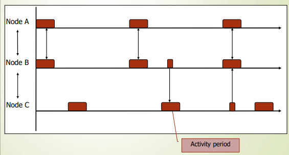

### Accesso al Canale e Consumi Energetici

Nel momento in cui si passa alla trasmissione effettiva, i frame vengono inoltrati sfruttando il periodo in cui il ricevitore è in ascolto. Prima di trasmettere, il nodo effettua una verifica dello stato del canale tramite *carrier sense*. Qualora il canale risulti occupato e il nodo non ottenga la disponibilità del mezzo, la trasmissione della trama viene forzatamente ritardata fino al periodo di ascolto successivo. Oltre a ciò, per prevenire problemi legati all'interferenza, S-MAC impiega un sistema di evitamento delle collisioni basato sullo scambio di pacchetti RTS e CTS, seguendo una logica del tutto simile a quella dello standard IEEE 802.11.

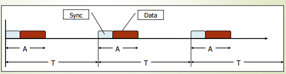

Dal punto di vista dell'impatto sui consumi, i benefici sono evidenti se si osserva l'energia aggregata consumata lungo un percorso comunicativo lungo 10 salti (10-hop). Analizzando i dati al variare del periodo di arrivo dei messaggi, è chiara la divergenza tra una rete priva di periodi di inattività e una rete gestita tramite S-MAC. Nello specifico, S-MAC introduce un meccanismo di rifinitura noto come **adaptive duty cycle** (ciclo di lavoro adattivo). Tramite questa ottimizzazione, se un nodo ascolta accidentalmente un messaggio RTS o CTS destinato ad altri, decide di mantenere la propria interfaccia radio accesa fino al completamento di quella trasmissione. L'obiettivo è farsi trovare preventivamente pronti nell'ipotesi in cui si venga selezionati come salto (*hop*) successivo della medesima comunicazione, migliorando la reattività del sistema a costo di un impercettibile dispendio energetico.

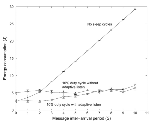

---

### Glossario e Concetti Chiave

- **Tradeoff Energetico**: Rappresenta il compromesso progettuale tra l'incremento dell'efficienza energetica (riduzione dell'uso della radio) e il conseguente degrado di prestazioni in termini di maggiore latenza e minore ampiezza di banda. 

- **Frame SYNC**: Sono speciali pacchetti trasmessi a livello locale in formato broadcast, il cui scopo è comunicare ai nodi adiacenti i propri intervalli programmati di sonno e risveglio per facilitare la sincronizzazione. 

- **Sincronizzazione Locale**: È la strategia cardine adottata da S-MAC in cui l'allineamento dei cicli di sonno-veglia avviene unicamente tra nodi direttamente comunicanti (vicini), evitando la complessità e l'onere di implementare un clock globale per l'intera infrastruttura. 

- **Adaptive Duty Cycle**: Una raffinata ottimizzazione che permette a un nodo di posticipare l'entrata nella modalità sonno se intercetta segnali di controllo RTS/CTS vicini, restando in allerta nel caso diventi il passaggio successivo lungo il percorso multi-hop dei dati.

---

### Latenza e Mantenimento della Sincronizzazione in S-MAC

Il protocollo S-MAC presenta una criticità intrinseca legata alla **latenza**. Mentre un frame viaggia attraverso un percorso multihop, potrebbe trovarsi costretto ad attendere, nella peggiore delle ipotesi, il periodo di ascolto di ciascun nodo intermedio prima di poter essere inoltrato. Questo accumulo di ritardi viene in parte mitigato dal fatto che, idealmente, un certo numero di nodi tenderà a convergere verso il medesimo programma di accensione, sebbene tale allineamento non sia mai garantito in modo assoluto.

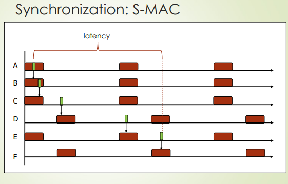

L'impatto di questa dinamica è evidente osservando la latenza media per hop in funzione del numero di salti: le reti con cicli di sonno subiscono un aumento progressivo del ritardo, diversamente dalle reti sempre attive in cui la latenza si mantiene costante. Mantenere questa sincronizzazione richiede uno sforzo costante, poiché le inevitabili derive dei clock interni ai dispositivi (clock drifts) alterano progressivamente l'allineamento temporale originario. Inoltre, a seconda della complessità topologica della rete, potrebbe risultare matematicamente impossibile per un singolo nodo stabilire un periodo di ascolto che sia pienamente compatibile con tutti i suoi vicini simultaneamente. Di conseguenza, S-MAC include specifici protocolli ausiliari dedicati al mantenimento attivo dei programmi , consentendo a un nodo di decidere proattivamente di cambiare la propria schedulazione se rileva che la maggior parte dei nodi adiacenti ha optato per un programma differente.

### Il Protocollo B-MAC e la Tecnica del Preamble Sampling

Come alternativa alla sincronizzazione esplicita, il protocollo **B-MAC** introduce un approccio completamente diverso per il controllo degli accessi al mezzo in ambienti multi-hop. Questa soluzione, ampiamente disponibile in sistemi operativi come TinyOS e sull'hardware dei dispositivi mica motes , non sfrutta alcuna forma di sincronizzazione tra i dispositivi. L'architettura prevede che un mittente sia libero di inviare dati in qualsiasi momento lo desideri. Per garantire che il destinatario riceva la comunicazione, il frame trasmesso viene preceduto da un preambolo estremamente lungo inserito nella sua intestazione.

Il ricevitore, dal canto suo, attiva la propria radio solo periodicamente per effettuare una rapida verifica della presenza di un preambolo "nell'aria". Questa specifica attività prende il nome di **preamble sampling** (campionamento del preambolo) e si basa su una modalità operativa a bassissimo consumo definita **Low-Power Listening (LPL)**. Se durante il campionamento viene rilevato un preambolo, il dispositivo mantiene la radio accesa per mettersi in attesa e ricevere il frame completo ; altrimenti, la radio viene immediatamente spenta.

L'idea fondante di B-MAC è quella di spendere deliberatamente più energia durante la fase di trasmissione, riuscendo al contempo a risparmiare ingenti quantità di energia durante le lunghe fasi di ricezione passiva. Per far sì che l'equazione sia vantaggiosa, l'operazione di campionamento deve essere estremamente breve e "con un costo energetico basso". In questo modo, i costi intrinseci legati all'attivazione e alla disattivazione dell'hardware radio lato ricevitore vengono bilanciati dalla bassa frequenza del campionamento. Condizione vitale per il funzionamento dell'intero sistema è che la durata del preambolo in trasmissione sia rigorosamente maggiore rispetto al periodo di sonno del ricevitore.

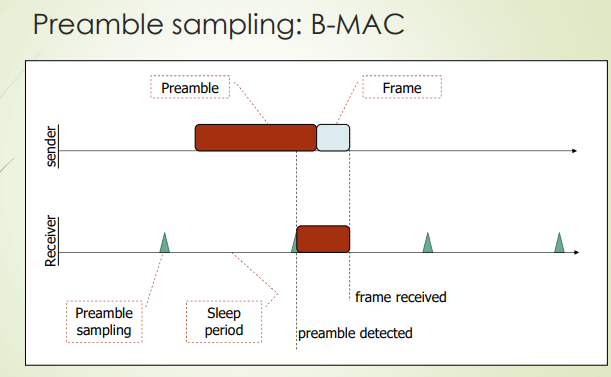

Questo meccanismo di Low-Power Listening comporta tuttavia un sovraccarico operativo (overhead) specifico. Prendendo in esame la radio dei Mica-Mote, il ciclo completo partendo dallo stato di sonno (sleep) richiede innanzitutto l'inizializzazione della radio attivata da un timer interrupt. A questa segue la fase di startup vera e propria, che include la configurazione dell'hardware e del cristallo radio. Successivamente, il modulo entra nella modalità di ricezione , rileva il segnale , effettua la complessa decodifica del segnale e l'analisi del frame , per poi infine tornare a spegnersi.

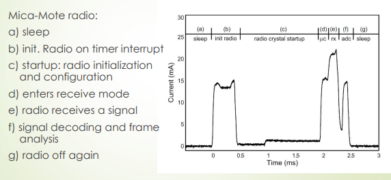

### Modelli Energetici e Aspettativa di Vita (Lifetime)

L'impatto del preamble sampling può essere valutato attraverso formule matematiche che modellano il consumo. L'energia spesa per la trasmissione, identificata come $E_{tx}$, è calcolata come il prodotto tra la potenza in trasmissione ($p_{tx}$) e la somma del tempo del preambolo ($t_{preamble}$) e del tempo dei dati ($t_{data}$): $E_{tx}=(t_{preamble}+t_{data})\cdot p_{tx}$. Per il controllo del canale, l'energia impiegata è $E_{check}=t_{check}\cdot p_{rx}$, dove $p_{rx}$ è la potenza assorbita in ricezione. Nel caso di ricezione completa, il calcolo diventa $E_{rx}=(\frac{1}{2}t_{preamble}+t_{data})\cdot p_{rx}$. Infine, l'energia spesa nello stato di riposo equivale a $E_{sleep}=t_{sleep}\cdot p_{sleep}$, con $p_{sleep}$ che indica la potenza quando il nodo è in idle.

Considerando uno scenario con un trasmettitore e un ricevitore, definiti i parametri $f_{data}$ (frequenza dei dati trasmessi in hertz) e $f_{check}$ (frequenza del campionamento), è possibile estrapolare il duty cycle complessivo. Il trasmettitore consuma un'energia totale in un tempo $t$ pari a: $ET(t)=t\cdot(p_{tx}\cdot DC_{tx}+p_{rx}\cdot DC_{check}+p_{sleep}\cdot(1-DC_{tx}-DC_{check}))$. Allo stesso modo, il ricevitore sosterrà un consumo basato sui propri duty cycle: $ER(t)=t\cdot(p_{rx}\cdot DC_{rec}+p_{rx}\cdot DC_{check}+p_{sleep}\cdot(1-DC_{rec}-DC_{check}))$. Da questi valori deriva l'aspettativa di vita netta dei dispositivi, calcolata dividendo la carica totale della batteria per l'energia consumata nell'unità di tempo: per il trasmettitore sarà $lifetime=battery_{charge}/ET(1)$, mentre per il ricevitore sarà $lifetime=battery_{charge}/ER(1)$.

A livello empirico, i fogli dati della radio CC1000 inclusi nell'articolo originale su B-MAC riportano i seguenti valori caratteristici:

| **Parametro**                      | **Valore**  |
| ---------------------------------- | ----------- |
| Potenza in trasmissione ($P_{tx}$) | 60 mW       |
| Potenza in ricezione ($P_{rx}$)    | 45 mW       |
| Potenza in sleep ($P_{sleep}$)     | 0,09 mW     |
| Dimensione preambolo               | 271 bytes   |
| Dimensione frame dati              | 36 bytes    |
| Lunghezza byte                     | 4,16 E-04 s |
| Lunghezza check                    | 3,5 E-04 s  |
| Lunghezza preambolo                | 1,13 E-01 s |
| Lunghezza frame                    | 1,5 E-02 s  |

I modelli grafici di queste proiezioni (che omettono i consumi per elaborazione, sensori e dispersioni della batteria, supponendo un'unità da 3000 mAh) mostrano che l'andamento dell'aspettativa di vita non muta drasticamente nemmeno all'aumentare dei trasmettitori. La longevità del nodo dipende strettamente dall'intervallo di controllo per il campionamento e dal volume di traffico della cella di rete. I grafici pongono in evidenza uno specifico intervallo di controllo ottimale (indicato da cerchi sulle curve) in cui si registra la durata massima della vita utile per ogni determinata frequenza di campionamento.

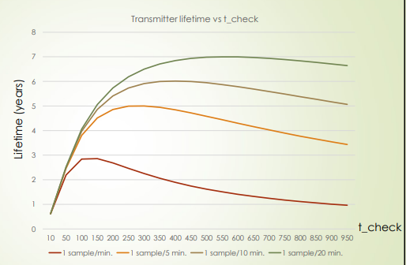

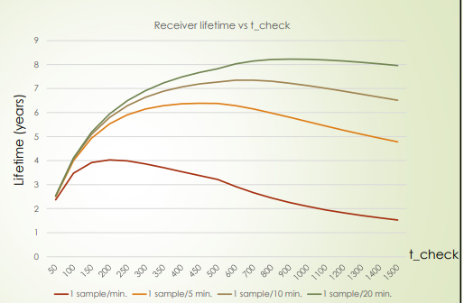

Per consolidare i concetti energetici appena trattati, si ponga un quesito pratico: ipotizzando che la radio impieghi 4,0 E-04 secondi per controllare il preambolo , e che la frequenza del campionamento sia di 5 operazioni al secondo, quale sarà il duty cycle dell'attività di preamble sampling? La risposta a questa domanda è fondamentale per quantificare l'impatto reale del protocollo sul dispositivo.

### Evoluzioni: X-MAC e BoX-MAC

Per risolvere la conclamata debolezza dei preamboli eccessivamente lunghi tipica di B-MAC, sono state sviluppate soluzioni più avanzate. La prima diretta evoluzione è **X-MAC** , appositamente studiata per ridurre questo spreco di risorse. X-MAC permette al ricevitore di arrestare in modo proattivo il preambolo in arrivo. Il meccanismo prevede l'inclusione dell'ID del ricevitore bersaglio sotto forma di informazione di indirizzamento nei cosiddetti "short preambles". Quando il ricevitore si attiva, verifica tempestivamente di essere lui l'effettivo destinatario della trasmissione; in caso affermativo, interrompe il mittente inviando un segnale *early ACK* (Acknowledgement anticipato), procedendo poi all'acquisizione del frame dati. Nelle simulazioni che pongono a confronto il ciclo di lavoro totale dei trasmettitori in una configurazione a stella (con un ricevitore, svariati trasmettitori e jitter randomizzati), X-MAC si dimostra sistematicamente più efficiente rispetto al suo predecessore su vari intervalli di inattività (es. 40ms, 200ms, 500ms).

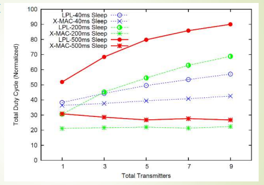

Il percorso di ottimizzazione prosegue ulteriormente con **BoX-MAC**, un'evoluzione di X-MAC nata con il medesimo scopo di snellire l'impatto dei preamboli. L'innovazione radicale di BoX-MAC consiste nel fatto che il preambolo scompare in quanto entità separata: è il messaggio stesso a venire ripetuto in una sequenza continua per fare le veci del preambolo. Se un ricevitore si risveglia, ascolta il frame e aspetta l'intestazione successiva per verificare se ne è il destinatario; se l'esito è positivo, invia un segnale di ACK per fermare il ciclo infinito del trasmettitore. Questo protocollo è progettato assumendo a monte l'uso di frame di dati di piccole dimensioni, per evitare di saturare inutilmente la banda.

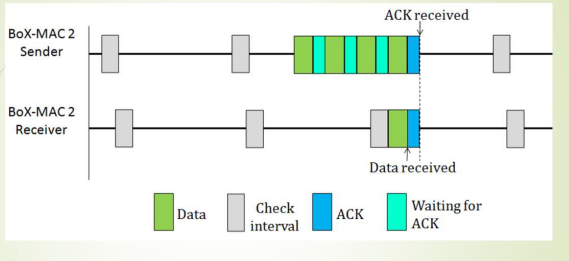

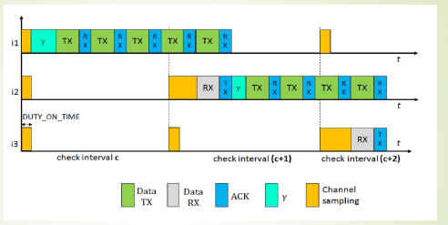

### L'Architettura Asimmetrica del Polling

Infine, affiancandosi al preamble sampling e alla sincronizzazione, troviamo la tecnica del **Polling**. Questo sistema, impiegato in tecnologie d'uso quotidiano come il Bluetooth e specifici profili dello standard IEEE 802.15.4, può anche essere agilmente combinato con i metodi di sincronizzazione. La sua caratteristica principale è l'asimmetria organizzativa della topologia di rete. In questo schema esiste un nodo principale o gerarchicamente superiore (master) il cui compito è quello di emettere segnali faro (beacons) a cadenza periodica. Ad esso sono sottoposti svariati nodi subordinati (slave), i quali godono della totale libertà di mantenere la propria radio spenta ogniqualvolta lo desiderino. Se il master dovesse ricevere un messaggio indirizzato a uno dei suoi dispositivi slave, lo immagazzina temporaneamente nella sua memoria e ne inserisce l'avviso nel successivo beacon emesso. Non appena il dispositivo slave deciderà di attivare la propria interfaccia radio, attenderà per prima cosa l'arrivo del beacon ; riconoscendo la notifica di un messaggio in sospeso, ne richiederà infine la consegna formale al master.

---

### Glossario e Concetti Chiave

- **Preamble Sampling / LPL**: Una tecnica asincrona introdotta da B-MAC in cui il ricevitore attiva la radio brevemente e periodicamente per campionare l'aria in cerca di preamboli estesi, risparmiando energia rispetto a un ascolto continuo.

- **X-MAC Early ACK**: Miglioria architetturale che sostituisce il lungo preambolo ininterrotto con brevi pacchetti di identificazione, permettendo al ricevitore di intercettare l'ID e interrompere la sequenza del mittente inviando un segnale di riconoscimento anticipato.

- **Polling**: Architettura asimmetrica master/slave in cui un coordinatore immagazzina i dati e notifica i nodi subordinati tramite beacon, lasciando liberi i nodi finali di spegnere il modulo radio in modo totalmente autonomo.

- **Intervallo di Controllo Ottimale**: In sistemi come B-MAC, rappresenta il punto matematico ideale nel bilanciamento tra l'energia spesa per trasmettere preamboli lunghi e quella spesa per i controlli rapidi del canale, massimizzando di fatto la longevità della rete.

---
