# Capitolo 1: Fondamenti delle Reti Wireless e Sistemi Cyber-Fisici

### Perché le Reti Wireless? L'Era dei Sistemi Cyber-Fisici

Storicamente, i cavi nei sistemi informatici hanno assolto a due funzioni primarie: consentire la comunicazione e fornire alimentazione elettrica. Tuttavia, l'evoluzione tecnologica ha portato all'emergere dei sistemi cyber-fisici, i quali incorporano computer all'interno di qualsiasi tipologia di oggetto fisico. Questi sistemi integrano capacità di rilevamento, calcolo, controllo e networking direttamente nell'infrastruttura fisica, connettendo gli oggetti sia tra loro sia a Internet. Poiché risulta fisicamente impossibile cablare ogni singolo oggetto del mondo reale , si rende necessaria una transizione tecnologica: le connessioni wireless sostituiscono i cavi per le comunicazioni, mentre le batterie rimpiazzano i cavi per l'alimentazione elettrica.

### Architettura e Componenti delle Reti Senza Fili

Una rete wireless è definita come una rete di host connessi tramite collegamenti senza fili. Gli host sono dispositivi terminali che eseguono applicazioni. Sebbene siano spesso mobili e alimentati a batteria (come nel caso di smartphone, tablet, sensori, elettrodomestici intelligenti o veicoli), è fondamentale sottolineare che il concetto di "wireless" non implica necessariamente la mobilità: un host può infatti essere stazionario. In questo ecosistema, risulta indispensabile coordinare l'accesso a un mezzo trasmissivo condiviso e definire meccanismi per localizzare e inoltrare i dati ai vari dispositivi.

Le reti wireless operano principalmente secondo due modalità. La prima è la modalità infrastrutturata, che prevede l'utilizzo di una o più stazioni base (o Access Point). In questo scenario, la stazione base è responsabile dell'invio e della ricezione dei pacchetti dati da e verso gli host wireless a essa associati. Un host si considera "associato" a una stazione base quando si trova all'interno della sua distanza di comunicazione e la utilizza per instradare i dati verso la rete più ampia. La stazione base agisce quindi come un relay tipicamente connesso a un'infrastruttura cablata (esempi classici sono le torri cellulari o gli Access Point IEEE 802.11). In questa modalità, tutti i servizi di rete tradizionali, come l'autenticazione, la fatturazione, l'assegnazione degli indirizzi e il routing, sono forniti dall'infrastruttura cablata. Inoltre, l'infrastruttura gestisce l'interazione tra le celle e procedure cruciali come l'handoff, ovvero il processo in cui un dispositivo mobile cambia la stazione base che gli fornisce la connessione.

La seconda modalità è il networking ad-hoc, caratterizzato dall'assenza di coordinatori centralizzati. In questo caso, i nodi della rete comunicano direttamente con gli altri dispositivi che rientrano nel loro raggio d'azione.

I collegamenti wireless (wireless links) uniscono fisicamente i dispositivi mobili alla stazione base o vengono impiegati come collegamenti di backhaul. Essi sono gestiti da protocolli di accesso multiplo (come Random Access, FDMA, TDMA, CDMA o Polling) che ne coordinano l'utilizzo e offrono svariate velocità di trasmissione e raggi di copertura. È interessante notare l'incredibile densità tecnologica raggiunta dai moderni host: un singolo dispositivo wireless integra diverse radio per connettersi a reti differenti. A titolo esemplificativo, un iPhone 16 possiede circa 11 radio distinte e numerose antenne, includendo 5 diverse radio cellulari, moduli WiFi, Bluetooth, UWB, connettività satellitare, NFC e GPS. Infine, vale la pena ricordare che le reti prive di infrastruttura non sono necessariamente connesse a una rete più ampia.

### Tassonomia e Prestazioni dei Collegamenti Wireless

La classificazione delle reti wireless si basa sulla presenza o assenza di un'infrastruttura e sul numero di salti (hop) necessari per la comunicazione.

| **Topologia**                    | **Infrastruttura Presente**                                                                                                                                             | **Infrastruttura Assente**                                                                                                       |
| -------------------------------- | ----------------------------------------------------------------------------------------------------------------------------------------------------------------------- | -------------------------------------------------------------------------------------------------------------------------------- |
| **Singolo Hop (Single hop)**     | L'host si connette direttamente a una stazione base (es. WiFi, WiMAX, reti cellulari 3G/4G/5G) che fornisce l'accesso a Internet.                                       | Nessuna stazione base; l'host non ha necessariamente una connessione verso Internet (es. Bluetooth).                             |
| **Multipli Hop (Multiple hops)** | L'host deve passare attraverso diversi nodi wireless per raggiungere l'infrastruttura cablata (es. reti MESH WiFi o tecnologie radio di pubblica sicurezza come TETRA). | L'host si affida ad altri nodi per raggiungere una destinazione wireless all'interno della rete (es. ZigBee, reti MANET, VANET). |

Le prestazioni dei collegamenti wireless sono caratterizzate da un intrinseco compromesso (tradeoff) tra la velocità dei dati (data rate) e il raggio di copertura. Negli ambienti al chiuso (10-30 metri), troviamo tecnologie come il Bluetooth a **2 Mbps**, lo standard 802.11b a **11 Mbps** e l'802.11g a **54 Mbps**. Spostandosi all'aperto (50-200 metri), le velocità aumentano vertiginosamente con l'802.11n a **600 Mbps**, l'802.11ac a **3.5 Gbps** e l'802.11ax che raggiunge i **14 Gbps**. Per le distanze di fascia media all'aperto (200 metri - 4 Km) operano gli standard 802.11 af e ah, insieme alla tecnologia 5G in grado di spingersi fino a **10 Gbps**. Infine, le reti cellulari come il 4G LTE garantiscono la copertura a lungo raggio (4 Km - 15 Km).

### Fondamenti di Elettromagnetismo e Caratteristiche dei Segnali Radio

La comunicazione wireless è resa possibile dalle leggi dell'elettromagnetismo: una corrente elettrica in una determinata posizione, ovvero il trasmettitore, crea un campo elettromagnetico nello spazio che, a sua volta, induce una corrente in una posizione remota, il ricevitore. Il campo elettromagnetico unisce il campo elettrico e quello magnetico e si propaga sotto forma di onda alla velocità della luce.

Un'onda elettromagnetica possiede specifiche proprietà fondamentali. La lunghezza d'onda, indicata con $\lambda$, rappresenta la distanza tra due picchi successivi dell'onda. Il tempo di ciclo è l'intervallo temporale che intercorre tra due picchi successivi. Da quest'ultimo deriva la frequenza, misurata in Hertz, che equivale all'inverso del tempo di ciclo e si calcola come il rapporto tra la velocità della luce e la lunghezza d'onda ($c/\lambda$). Completano il profilo dell'onda la sua direzionalità di propagazione e la sua ampiezza variabile nel tempo. Un altro concetto essenziale è la fase di un segnale periodico, la quale indica la posizione del segnale all'interno del suo ciclo in un determinato momento temporale. Spesso misurata in unità angolari da 0 a 360 gradi, la fase consente di codificare le informazioni modificando la sua posizione, pur mantenendo inalterata la frequenza del segnale.

### Potenza, Larghezza di Banda, Rumore e Interferenza

La caratterizzazione di un segnale radio dipende fortemente dalla sua potenza, ovvero l'energia di trasmissione o ricezione dell'antenna per unità di tempo. Essa può essere misurata in scala lineare, tipicamente in Watt o milliwatt, oppure in scala logaritmica utilizzando i decibel. La formula per la conversione in decibel-milliwatt è:

$$P_{dBm}=10\cdot \log_{10}(\frac{P_{mW}}{1mW})$$

A titolo di esempio, consideriamo una tipica potenza di trasmissione massima per un dispositivo mobile pari a **250 mW**; applicando la formula, otteniamo un valore di **24 dBm**. La potenza è strettamente legata alla densità spettrale di potenza (PSD), che descrive la potenza presente nel segnale in funzione della sua frequenza e che, di norma, è centrata attorno a una frequenza portante (carrier frequency).

Strettamente connessa a questi valori è la larghezza di banda (bandwidth), che indica l'ampiezza in Hertz dell'intervallo di frequenze effettivamente utilizzato dal segnale radio. In questo contesto, l'assenza di potenza del segnale a una determinata frequenza corrisponde a una densità spettrale pari a zero. È cruciale non confondere la larghezza di banda del segnale radio con il concetto di larghezza di banda inteso come capacità di trasmissione (il "link bandwidth" usato dagli ingegneri di rete per indicare il data rate massimo). Ad esempio, un segnale radio con una larghezza di banda di **22 MHz** distribuito uniformemente tra 2.427 GHz e 2.449 GHz (con frequenza portante a 2.438 GHz) corrisponde all'utilizzo del canale 6 in una rete WiFi.

In ogni sistema di comunicazione, il segnale originale subisce un degrado prima di raggiungere il ricevitore. Questo fenomeno è causato sia dal rumore termico ed elettronico generato all'interno del ricevitore stesso (dovuto a variazioni termiche naturali o imperfezioni dei circuiti), sia dall'interferenza proveniente da altri trasmettitori. L'interferenza è particolarmente severa nelle frequenze non licenziate. Basti pensare alla banda ISM (Industrial, Scientific, and Medical) a 2.4 GHz, dove si trovano a convivere contemporaneamente centinaia di dispositivi consumer tra cui WiFi, Bluetooth, Zigbee, forni a microonde, apriporta per garage, baby monitor, telefoni cordless, microfoni wireless, e persino droni e giocattoli radiocomandati.

---

### Glossario e Concetti Chiave

**Sistemi Cyber-Fisici (CPS):** Architetture che fondono elaborazione computazionale, reti di comunicazione e rilevamento fisico all'interno di oggetti del mondo reale.

**Modalità Infrastrutturata vs Ad-Hoc:** La prima richiede una stazione base centrale per gestire le comunicazioni e fornire servizi di rete, la seconda permette comunicazioni dirette peer-to-peer tra host ravvicinati.

**Trade-off Data Rate vs Copertura:** Principio fondamentale per cui le tecnologie che offrono bande passanti elevatissime (come l'802.11ax) hanno solitamente una portata metrica limitata, mentre reti a lungo raggio offrono prestazioni velocistiche inferiori o necessitano di tecnologie profondamente diverse (come il 4G LTE).

**Fase di un Segnale:** La variazione angolare della posizione di un segnale nel suo ciclo, sfruttata per codificare flussi di bit mantenendo costante la frequenza.

**Interferenza ISM:** Fenomeno di congestione e degrado del segnale dovuto all'utilizzo di bande di frequenza non licenziate (es. 2.4 GHz) da parte di apparecchiature eterogenee.

---

## Caratteristiche del Canale Wireless, Qualità del Segnale e Protocolli MAC

### Il Rapporto Segnale/Rumore (SNR) e la Capacità del Canale

Per comprendere l'affidabilità di una trasmissione, dobbiamo introdurre una misura fondamentale della "qualità" del canale: il Rapporto Segnale/Rumore, o SNR (Signal to Noise Ratio). Questo valore esprime il rapporto tra la potenza del segnale ricevuto e la potenza del rumore di fondo, e viene abitualmente misurato in decibel (dB). La sua formulazione matematica è la seguente:

$SNR(dB)=10\cdot \log_{10}(\frac{received\ signal\ power}{noise\ power})$

Un valore di SNR pari a 0 implica che il segnale e il rumore hanno esattamente la stessa potenza. Conseguentemente, un SNR alto rende facile per il ricevitore estrarre il segnale originale dal rumore, mentre un SNR basso rende questa operazione estremamente ardua. Nelle radio attuali, i limiti inferiori tipici si attestano tra i -10 e i -6 dB per le reti cellulari, e intorno ai 20 dB per le reti WiFi.

La conoscenza dell'SNR ci permette di calcolare il limite teorico invalicabile di una trasmissione, definito in un classico articolo del 1948 come la Capacità di Shannon. Questa rappresenta il tasso massimo al quale i dati possono essere trasmessi in un canale, dati i vincoli di larghezza di banda e SNR. La formula è:

$C=B\cdot \log_{2}(1+\frac{received\ signal\ power}{noise\ power})$

Dove $C$ è la capacità in bit al secondo (bits/sec), $B$ è la larghezza di banda in Hertz (Hz), e la potenza è misurata in scala lineare (ad esempio, in mW). Da questa equazione derivano due osservazioni cruciali: a parità di SNR, la capacità scala in modo lineare con l'aumento della larghezza di banda. Al contrario, in condizioni di SNR già elevato, la capacità scala in modo logaritmico, il che significa che c'è pochissimo valore aggiunto nell'aumentare ulteriormente la potenza del segnale oltre un certo limite.

### Fenomeni di Propagazione: Attenuazione (Path Loss) e Multipath

Mentre si propaga nello spazio, un segnale radio subisce una perdita di potenza nota come attenuazione o *path loss*. Questo fenomeno, detto anche fading, consiste nella riduzione della densità di potenza dell'onda elettromagnetica nel tragitto dal trasmettitore al ricevitore. La formula generale per descrivere questa perdita è $\frac{P_{received}}{P_{transmitted}}\sim\frac{1}{(fd)^{n}}$, dove $f$ indica la frequenza e $d$ la distanza. L'esponente $n$ varia a seconda dell'ambiente: è pari a 2 nello spazio libero, oscilla tra 2.7 e 3.5 in ambienti urbani, e si attesta tra 3 e 6 all'interno degli edifici.

L'attenuazione quadratica (proporzionale a $d^2$) e la presenza di ostacoli fisici (come una montagna) generano uno dei problemi più critici delle reti senza fili: il problema del "terminale nascosto" (hidden terminal). Immaginiamo tre nodi disposti spazialmente: A, B e C. Se A e B possono sentirsi a vicenda, e B e C possono sentirsi, ma A e C non possono ascoltarsi a causa della distanza o di un ostacolo, A e C risultano reciprocamente "nascosti" e inconsapevoli delle rispettive trasmissioni. Se entrambi trasmettono simultaneamente a B, le loro onde interferiranno, complicando enormemente la condivisione del canale wireless.

Un'ulteriore complicazione fisica è data dal fenomeno del *multipath*. Il segnale radio, infatti, si riflette sugli oggetti circostanti, come il suolo o gli edifici, subendo fenomeni di riflessione, diffrazione e dispersione (scattering). Di conseguenza, un segnale trasmesso raggiunge il ricevitore viaggiando su percorsi multipli e arrivando in momenti leggermente diversi. Tutto ciò rende la comunicazione molto più "difficile", persino nei collegamenti punto a punto. Per ovviare a questo, il trasmettitore deve distanziare temporalmente le sue trasmissioni di segnale. Il segnale in linea di vista (Line of Sight - LoS) e tutte le sue riflessioni multipath devono essere ricevute prima che arrivi il segnale LoS successivo. Entra in gioco qui il concetto di Tempo di Coerenza ($T_c$): esso rappresenta il tempo minimo necessario tra i cambiamenti del segnale del mittente affinché i tempi di coerenza non si sovrappongano. Questo parametro influenza la massima velocità di trasmissione possibile ed è inversamente proporzionale alla frequenza e alla velocità del ricevitore, se quest'ultimo è in movimento.

### Bit Error Rate (BER) e le Sfide delle Reti Wireless

Il tasso di errore sui bit (Bit Error Rate - BER) indica la probabilità che un bit trasmesso venga ricevuto con un errore. Dato un certo livello fisico, aumentare la potenza di trasmissione comporta un aumento dell'SNR e, di conseguenza, una diminuzione del BER. Esiste una correlazione stretta tra modulazione, SNR e BER: per un dato SNR, il progettista deve scegliere un livello fisico (lo schema di modulazione) che soddisfi i requisiti di BER. Se l'SNR è basso, è d'obbligo utilizzare una modulazione robusta (es. BPSK a 1 Mbps); se l'SNR è alto, è possibile passare a modulazioni più veloci (es. QAM256 a 8 Mbps). In ogni caso, per un dato schema di modulazione, maggiore è l'SNR, minore sarà il BER.

Tutte queste particolarità fisiche si traducono in sfide enormi per le reti wireless. Tali sfide si raggruppano in diverse categorie:

- **Conoscenza limitata:** un terminale non può ascoltare tutti gli altri, dando origine ai problemi del terminale nascosto o del terminale esposto.

- **Mobilità e guasti:** i terminali si spostano nel raggio di diverse stazioni base (BS) o si allontanano tra loro.

- **Risorse limitate:** i terminali soffrono di limiti intrinseci di durata della batteria, memoria, potenza di elaborazione e raggio di trasmissione.

- **Privacy:** le trasmissioni via etere sono intrinsecamente soggette a intercettazione (eavesdropping).

Per gestire tali problematiche, le reti necessitano di meccanismi specifici. Devono coordinare l'accesso a un canale wireless condiviso (dove protocolli cablati come il CSMA/CD non possono essere usati). Nelle reti infrastrutturate è vitale la procedura di *Hand-off*, che permette a un terminale in movimento di transitare nel raggio di una nuova stazione base senza disconnessioni. Nelle reti ad-hoc multi-hop, invece, servono algoritmi di Routing capaci di trovare percorsi tra sorgente e destinazione gestendo i cambiamenti arbitrari del vicinato. Questo complesso ecosistema è gestito da uno stack protocollare ben definito. Partendo dall'alto, troviamo il livello Applicazione (con varie App). Sotto di esso, il livello di Trasporto (UDP/TCP). Al livello di Rete, se c'è infrastruttura usiamo IP, mentre in sua assenza usiamo protocolli di routing ad-hoc come AODV, DSR o DYMO. Infine, il livello Datalink con il MAC (es. CSMA/CA) si appoggia al livello Fisico (Interfacce Radio o Infrarossi).

*Verifica dell'apprendimento:* Vi è chiaro ora quali siano le due cause del problema del terminale nascosto, e che differenza intercorra tra l'attenuazione (path loss) e gli effetti multipath?

### Un Riepilogo sui Protocolli MAC Cablati: Il CSMA/CD

Per capire perché il wireless è speciale, dobbiamo fare un passo indietro e rivedere i protocolli MAC per le reti cablate (wired). Tali protocolli, come ALOHA, slotted ALOHA, CSMA e CSMA/CD, si basano su assunzioni molto forti: esiste un singolo canale disponibile per tutte le comunicazioni, tutte le stazioni possono ricevervi e trasmettervi e, se i frame vengono inviati contemporaneamente, il segnale risultante è confuso e genera una collisione. L'assunzione chiave è che *tutte le stazioni possono rilevare le collisioni*.

Il protocollo CSMA/CD (Carrier Sense Multiple Access with Collision Detection), largamente usato nelle reti LAN come l'IEEE 802.3 Ethernet, parte da un'idea basilare di CSMA. Quando una stazione ha un frame da inviare, "ascolta" il canale per capire se qualcun altro sta trasmettendo. Se il canale è occupato, attende che si liberi. Quando è libero, inizia la trasmissione. Se avviene una collisione, la stazione attende un tempo casuale e ripete la procedura. Il vero vantaggio della variante "CD" (Collision Detection) è che la stazione interrompe (aborta) la trasmissione non appena rileva la collisione. Se due stazioni sentono il canale libero e trasmettono simultaneamente, entrambe abortiscono rapidamente il frame appena rilevano l'urto dei segnali.

Analizziamo le tempistiche del CSMA/CD. Chiamiamo $T$ il tempo di propagazione necessario per raggiungere la stazione più lontana. Nel caso peggiore, ci vorrà un tempo pari a un RTT (Round Trip Time), ovvero $2T$, per rilevare una collisione. Immaginate che la stazione A inizi a trasmettere al tempo $t=0$. Appena prima che il segnale raggiunga la stazione B, per l'esattezza a $t=T-\delta$, B sente il canale libero e inizia a trasmettere a sua volta. B rileverà la collisione quasi subito, a $t=T$, ma A dovrà attendere che il segnale di B viaggi indietro verso di lei, rilevando l'urto solo a $t=2T-\delta$.

Da questo deriva un vincolo architetturale stringente: affinché A possa rilevare la collisione, deve continuare a monitorare il canale per l'intero RTT. Poiché la stazione, una volta inviato tutto il frame, non ne conserva copia e smette di verificare il mezzo, è obbligatorio imporre una dimensione minima del frame affinché la trasmissione duri almeno quanto l'RTT. Facciamo un esempio numerico sul frame minimo. In una rete Ethernet CSMA/CD a 10 Mbps, con un tempo di propagazione massimo (inclusi i ritardi hardware) di 25.6 $\mu sec$, il tempo minimo di trasmissione del frame nel caso peggiore ($T_{fr}$) sarà $2 \times T_p = 51.2\ \mu sec$. Questo è il periodo per cui la stazione deve trasmettere per poter captare la collisione. Di conseguenza, la dimensione minima del frame è data da 10 Mbps x 51.2 $\mu sec$, ovvero 512 bit, pari a 64 byte (dimensione tipica dello standard Ethernet).

In seguito a una collisione, il protocollo gestisce le ritrasmissioni tramite l'algoritmo di **Binary Exponential Backoff**. Il tempo successivo all'urto è diviso in "slot di contesa", ciascuno di lunghezza pari al tempo di propagazione circolare nel caso peggiore ($2T$). Dopo la prima collisione, ogni stazione attende 0 oppure 1 slot prima di riprovare. Dopo l'i-esima collisione, la stazione sceglie a caso un numero $x$ nell'intervallo $[0, 2^i - 1]$ e salta esattamente $x$ slot prima di ritentare. L'intervallo di randomizzazione cresce esponenzialmente ma viene "congelato" al range $0..1023$ dopo 10 collisioni. Dopo 16 collisioni consecutive, il protocollo rinuncia e segnala un fallimento ai livelli superiori.

### L'Inapplicabilità del CSMA/CD nel Wireless e i Paradossi del Ricevitore

Il CSMA/CD rileva le interferenze *mentre* sta trasmettendo. Questo approccio, che funziona perfettamente nel rame, è inapplicabile nel wireless! Come abbiamo visto con il path loss, nel mezzo radio la potenza del segnale decresce proporzionalmente al quadrato della distanza. Questo significa che, presso il mittente, la potenza del proprio segnale di trasmissione (self-signal) sarebbe talmente forte da "accecare" l'antenna, rendendo impossibile rilevare il debole segnale di una collisione causata da un altro trasmettitore lontano.

Inoltre, le condizioni del canale wireless sono spazialmente diverse tra trasmettitore e ricevitore. Pertanto, una collisione ipoteticamente rilevata dal trasmettitore potrebbe non indicare affatto una collisione al ricevitore. Il vero paradigma da assimilare per comprendere i protocolli MAC wireless è questo: **le collisioni avvengono al ricevitore**.

Quello che conta davvero non è l'interferenza presso chi invia il messaggio, ma l'interferenza presso chi lo deve ricevere. Questa asimmetria spaziale è la radice dei complessi problemi del terminale nascosto e del terminale esposto, che richiedono soluzioni MAC radicalmente diverse da quelle studiate per il mondo cablato.

### Anatomia del Problema del Terminale Nascosto

Per comprendere a fondo i limiti del rilevamento della portante nel wireless, dobbiamo analizzare topologicamente il **Problema del Terminale Nascosto** (Hidden Terminal Problem). Immaginiamo una disposizione lineare di quattro nodi, denominati A, B, C e D . In questo scenario, il raggio radio del nodo A copre il nodo B, ma non riesce a raggiungere il nodo C. Ipotizziamo ora che il nodo A stia inviando una trasmissione al nodo B.

Contemporaneamente, il nodo C decide di valutare lo stato del mezzo trasmissivo. Trovandosi al di fuori della portata radio di A, il nodo C non percepirà alcuna trasmissione in corso e dedurrà, erroneamente, che il canale sia libero. Di conseguenza, se C decidesse di iniziare a trasmettere un messaggio verso una qualsiasi destinazione (che sia B o D), il suo segnale raggiungerebbe B sovrapponendosi a quello di A. Questo evento genera una rovinosa collisione esattamente presso il ricevitore B.

La definizione formale di questo fenomeno stabilisce che il problema del terminale nascosto si verifica quando due o più stazioni, che si trovano reciprocamente fuori dal rispettivo raggio d'azione, trasmettono simultaneamente verso un destinatario comune. In questa dinamica, la stazione C non è in grado di rilevare un potenziale concorrente per l'accesso al mezzo perché è semplicemente troppo lontana. Specularmente, per lo stesso principio fisico, nemmeno A si renderà mai conto dell'avvenuta collisione. In gergo tecnico, si afferma che C è "nascosto" rispetto alla comunicazione in atto tra A e B.

### Il Paradosso del Terminale Esposto

Se il terminale nascosto porta a collisioni non volute, il **Problema del Terminale Esposto** (Exposed Terminal Problem) genera un incredibile spreco di risorse, portando le stazioni a un'attesa del tutto inutile. Consideriamo nuovamente la nostra topologia lineare con i nodi A, B, C e D . In questo caso, invertiamo la direzione del flusso di dati: è il nodo B che sta trasmettendo verso il nodo A. Nel frattempo, il nodo C desidera avviare una trasmissione verso il nodo D.

Avviando la procedura di ascolto, C percepisce chiaramente l'energia radio sul mezzo trasmissivo, poiché si trova nel raggio d'azione di B. Ascoltando questa trasmissione, C conclude che il canale è occupato e che non gli è permesso trasmettere verso D. Tuttavia, questa conclusione è fallace rispetto al reale obiettivo della comunicazione. Se C iniziasse a trasmettere verso D, il suo segnale non creerebbe alcun disturbo alla ricezione presso il nodo A, poiché A si trova fuori dal raggio di interferenza di C. In altre parole, le due trasmissioni (da B verso A e da C verso D) potrebbero avvenire perfettamente in parallelo senza darsi alcun fastidio.

La definizione accademica sancisce che il problema del terminale esposto si manifesta quando a una stazione trasmittente viene impedito di inviare frame a causa della presunta interferenza con un'altra stazione trasmittente, un'interferenza che nella realtà non pregiudicherebbe la corretta ricezione dei pacchetti. La stazione C, pur potendo inviare dati con successo, rimane in silenzio perché risulta "esposta" rispetto alla comunicazione in corso tra B ed A.

### Il Cambio di Paradigma nel MAC Wireless

Questi due problemi fisici ci costringono a una profonda revisione concettuale delle architetture di rete. Il paradigma fondamentale da assimilare è che nelle reti wireless ciò che conta davvero è unicamente l'interferenza presso il ricevitore, non quella rilevata presso il mittente . Questo dato di fatto invalida alla base l'approccio delle reti cablate (LAN): lo stato di congestione del mezzo non può essere verificato semplicemente auscultando la portante presso la stazione che desidera trasmettere .

Abbiamo dimostrato che trasmissioni multiple possono coesistere pacificamente e simultaneamente se le relative destinazioni sono fisicamente distanti e reciprocamente fuori portata . Una stazione può benissimo ascoltare una trasmissione in corso ed essere comunque in grado di trasmettere i propri dati senza causare alcuna interferenza dannosa . Risulta quindi evidente la necessità imperativa di sviluppare protocolli MAC (Medium Access Control) sensibilmente diversi da quelli impiegati nelle tradizionali LAN cablate .

### La Rivoluzione del Protocollo MACA

La risposta ingegneristica a queste sfide è incapsulata nel **Protocollo MACA** (Multiple Access with Collision Avoidance) . Questo protocollo fu introdotto formalmente nel 1990 da Phil Karn in un articolo intitolato "MACA - A New Channel Access Method for Packet Radio", presentato alla nona conferenza sul computer networking radio amatoriale (ARRL/CRRL) .

L'idea di base del protocollo MACA è brillante nella sua semplicità: invece di affidarsi al solo ascolto del canale, il protocollo stimola proattivamente il ricevitore a trasmettere un breve frame di controllo prima che avvenga l'invio del blocco dati vero e proprio . Tutte le stazioni limitrofe che riescono ad ascoltare questo breve frame di controllo sono istruite ad astenersi dal trasmettere per tutta la durata della successiva trasmissione del frame di dati.

Per comprendere la meccanica del MACA, introduciamo una topologia leggermente più complessa comprendente i nodi A, B, C, D ed E . Posizioniamo C all'interno del raggio di A, ma fuori dalla portata di B e D. D si trova nel raggio di B, ma non può ascoltare né A né C. Infine, il nodo E si trova in una posizione centrale, rientrando contemporaneamente nel raggio d'azione sia di A che di B.

Il processo di comunicazione inizia quando A desidera trasmettere un pacchetto al nodo B. Per prima cosa, A invia a B uno speciale pacchetto di controllo denominato **RTS** (Request To Send). Questo frame RTS è denso di informazioni vitali: contiene l'identificativo (ID) della sorgente, l'identificativo della destinazione e, fattore cruciale, la lunghezza esatta del frame di dati che seguirà a breve. Essendo trasmesso via etere, questo RTS viene ricevuto non solo da B, ma anche dai nodi C ed E che si trovano nel raggio di copertura di A.

A questo punto, la palla passa al destinatario. Se B è disponibile a ricevere il messaggio, risponde trasmettendo a sua volta un breve frame di controllo chiamato **CTS** (Clear To Send). Il frame CTS non è altro che una conferma che copia fedelmente l'informazione sulla lunghezza dei dati originariamente contenuta nell'RTS. Espandendosi nello spazio, il CTS viene captato dal mittente A, ma anche dai nodi D ed E che risiedono nel raggio di copertura di B. Solamente al momento dell'effettiva ricezione del frame CTS, il nodo A è autorizzato a trasmettere il frame di dati finale.

### La Risoluzione Elegante delle Anomalie

Il protocollo MACA, attraverso il meccanismo di scambio RTS/CTS (handshake), offre una soluzione elegante sia al problema del terminale esposto che a quello del terminale nascosto.

Analizziamo il destino del nodo C nella nostra topologia. Come abbiamo visto, C ha ascoltato il pacchetto RTS proveniente da A, ma, trovandosi fuori dal raggio di B, non ha mai ricevuto il pacchetto CTS. Questa asimmetria informativa segnala a C una condizione ben precisa: la trasmissione in corso non lo riguarda e la ricezione avverrà lontano dalla sua area di influenza. Riconoscendosi in una situazione di "terminale esposto", il nodo C capisce di essere totalmente libero di trasmettere verso altre destinazioni senza causare danni .

Osserviamo ora il nodo D. A differenza di C, il nodo D non ha udito il pacchetto RTS iniziale di A, ma ha captato chiaramente il pacchetto CTS emesso da B. Questo avvisa D che una stazione vicina sta per ricevere un flusso di dati importante. Trovandosi in una chiara situazione di "terminale nascosto", il nodo D comprende che qualsiasi sua trasmissione interferirebbe con la ricezione di B. Pertanto, obbedendo alle regole del MACA, D rimarrà in rigoroso silenzio, attendendo inattivo per tutto il tempo strettamente necessario al completamento della trasmissione del frame di dati (tempo calcolato grazie alle informazioni sulla lunghezza originariamente propagate dai frame di controllo).

---

### Glossario e Concetti Chiave

**Problema del Terminale Nascosto:** Situazione di rete in cui due stazioni, impossibilitate ad ascoltarsi reciprocamente a causa della distanza o di ostacoli, collidono trasmettendo simultaneamente a un medesimo destinatario centrale.

**Problema del Terminale Esposto:** Condizione di inefficienza in cui una stazione rinuncia ingiustificatamente a trasmettere dati, credendo erroneamente che il proprio segnale possa interferire con una ricezione che in realtà sta avvenendo al di fuori del suo raggio d'interferenza.

**MACA (Multiple Access with Collision Avoidance):** Protocollo di livello MAC ideato per risolvere le anomalie di rilevamento nel wireless, sostituendo la fiducia cieca nell'ascolto della portante con uno scambio proattivo di messaggi di controllo.

**RTS (Request To Send):** Breve frame di controllo emesso dal mittente per richiedere l'accesso al canale, comunicando a tutta la propria cella le proprie intenzioni e la durata prevista dell'occupazione del mezzo.

**CTS (Clear To Send):** Frame di risposta emesso dal destinatario che accorda il permesso di trasmissione, diffondendo parallelamente l'informazione sulla durata dell'occupazione del canale a tutte le stazioni limitrofe potenzialmente interferenti.

---

## Evoluzione del MAC Wireless e lo Standard IEEE 802.11

### Risoluzione delle Casistiche Complesse e Collisioni nel MACA

Nel precedente capitolo abbiamo visto come il MACA prevenga le collisioni dati, ma è fondamentale chiedersi come gestisca le situazioni limite. Consideriamo la topologia in cui il nodo E si trova nel raggio d'azione di due nodi A e B che stanno comunicando . Il nodo E ascolta sia il pacchetto RTS che il CTS. Se in quel frangente un altro nodo, completamente fuori dal raggio di A e B, desiderasse trasmettere un messaggio proprio verso E, quest'ultimo non potrebbe rispondere; il nodo esterno deve rimanere in rigoroso silenzio finché la trasmissione del frame dati tra A e B non si è completamente conclusa .

Sorge spontanea una domanda cruciale: con il protocollo MACA, le collisioni sono ancora possibili? La risposta è assolutamente affermativa . Le collisioni possono ancora verificarsi, ma avvengono esclusivamente tra i pacchetti di controllo RTS. Immaginiamo che i nodi C e B decidano di inviare simultaneamente un frame RTS verso il nodo A . In questo scenario, i messaggi entrano in collisione e, di conseguenza, il nodo A non riuscirà a decodificarli, non generando alcun frame CTS di risposta .

Tuttavia, l'impatto di questa collisione è drasticamente ridotto rispetto alle reti cablate tradizionali, grazie a due vantaggi intrinseci. In primo luogo, in questa fase non viene perso alcun dato applicativo (Nessuna informazione DATA viene smarrita) . In secondo luogo, i pacchetti RTS sono estremamente brevi, occupando appena 20 byte; pertanto, la collisione mantiene il canale occupato solo per una frazione di tempo minuscola . Per risolvere lo stallo generato dalla collisione degli RTS, i nodi C e B ricorrono allo stesso algoritmo utilizzato dallo standard Ethernet: il Binary Exponential Backoff . Essi attenderanno un tempo casuale, calcolato esponenzialmente a ogni tentativo fallito, prima di ritrasmettere il loro pacchetto RTS.

### Dal MACA al MACAW e al CSMA/CA

Il protocollo MACA ha rappresentato una pietra miliare, ma ha subito perfezionamenti successivi, in particolare attraverso il protocollo **MACAW** (MACA for Wireless networks) . Come descritto nel celebre articolo del 1994 di Bharghavan, Demers, Shenker e Zhang, pubblicato su *ACM SIGCOMM Computer Communication Review*, il MACAW ottimizza le prestazioni introducendo un frame aggiuntivo di riscontro: il pacchetto ACK, utile per confermare l'effettivo e corretto arrivo del frame di dati . Inoltre, il MACAW implementa meccanismi sofisticati per lo scambio di informazioni tra le stazioni, come la condivisione del contatore di backoff, al fine di garantire un'allocazione equa (fairness) del throughput tra i nodi.

Tutti questi sforzi teorici sono culminati nel protocollo **CSMA/CA** (Carrier Sense Multiple Access with Collision Avoidance), che costituisce il cuore dello standard IEEE 802.11 ed è fondato proprio sul MACAW. Il CSMA/CA aggiunge al modello il Carrier Sensing (rilevamento della portante), utile per prevenire l'invio di pacchetti RTS inutili qualora il canale risulti già fisicamente occupato.

*Verifica dell'apprendimento topologico:* Immaginiamo un grafo di rete complesso dove A è connesso a B e C; B è connesso a D; C è connesso a D; D è connesso a E ed F; E ed F sono connessi tra loro . Applicando il meccanismo RTS/CTS, provate ad analizzare chi risulta nascosto o esposto nelle varie direttrici (es. E verso D, oppure D verso C) . Se D sente l'RTS inviato da E ma non percepisce alcun CTS di risposta, D dedurrà di essere un terminale esposto e potrà considerarsi libero di agire . Al contrario, se B ascolta un CTS proveniente da D senza aver prima udito alcun RTS, B capirà di trovarsi nella condizione di terminale nascosto e dovrà obbligatoriamente astenersi dal trasmettere . Se, in un ultimo scenario, D sta già ricevendo una comunicazione e B non ha ricevuto né RTS né CTS e non ode alcun segnale verso D, un eventuale tentativo di trasmissione da B verso D scatenerebbe inevitabilmente una collisione catastrofica direttamente presso il ricevitore D.

### La Famiglia IEEE 802.11 e la sua Architettura di Livello

Entriamo ora nel mondo dello standard IEEE 802.11, il vero pilastro delle reti Wireless LAN, comunemente note con il nome commerciale di Wi-Fi . La standardizzazione delle LAN è gestita dall'Institute of Electrical and Electronics Engineers (IEEE), specificamente attraverso il gruppo di lavoro del Progetto IEEE 802 .

L'architettura protocollare di questo standard è sapientemente stratificata. I livelli superiori e il sottolivello LLC (Logical Link Control, catalogato come 802.2) sono comuni a tutte le architetture, garantendo uniformità . Le differenziazioni si manifestano scendendo nello stack protocollare: il sottolivello MAC e il livello Fisico (Physical) si adattano ai diversi mezzi trasmissivi, come illustrato anche nel testo accademico "Internet and Computer and Networks" di A. Pattavina (Pearson 2018-2022) . A livello MAC troviamo infatti diramazioni come l'802.3 per il CSMA/CD cablato, l'802.11 per le Wireless LAN, l'802.15 per le reti PAN (Personal Area Network) senza fili, e l'802.16 per il wireless a banda larga . Il livello fisico sottostante gestisce la codifica del segnale su supporti come cavi UTP, STP, fibra ottica o, nel nostro caso, interfacce radio .

Lo standard 802.11 prevede l'utilizzo di canali radio specifici allocati nelle bande ISM (Industrial, Scientific, and Medical), operando inizialmente sulle frequenze dei 900 MHz, 2.4 GHz e 5 GHz . Se all'alba della tecnologia la capacità del canale si aggirava tra gli 11 e i 54 Mbit/s, con l'introduzione dei nuovi standard abbiamo assistito a un'escalation che ha portato il throughput a centinaia di Mbit/s e oltre .

### Cronologia e Parametri degli Standard Wi-Fi

L'evoluzione dell'albero del livello Fisico (PHY) 802.11 è segnata da tappe storiche precise . Il primo rilascio, la cosiddetta "Modalità Legacy" dell'IEEE 802.11, vide la luce nel 1997 e fu perfezionato nel 1999 . Offriva un modesto data rate di 1-2 Mbps sfruttando segnali a infrarossi (IR) o la banda radio ISM a 2.4 GHz . L'eccessiva libertà implementativa causò severi problemi di interoperabilità tra i prodotti di diversi fornitori, portando al rapido accantonamento di questa versione.

Fu rapidamente soppiantato e reso popolare dalle versioni successive, che oggi costituiscono il nucleo dell'utilizzo globale ($802.11a/b/g/n$) .
Analizziamo i profili tecnici dei vari standard attraverso i dati forniti:

| **Standard IEEE**     | **Anno**  | **Velocità Massima (Max data rate)**         | **Raggio tipico** | **Frequenza**                                                                                                       |
| --------------------- | --------- | -------------------------------------------- | ----------------- | ------------------------------------------------------------------------------------------------------------------- |
| **802.11b**           | 1999      | 11 Mbps (Tipico: 4.3 Mbps)                   | 30 m              | 2.4 GHz (Banda ISM). La sua modulazione fu studiata per limitare le interferenze con telefoni cordless e microonde. |
| **802.11a**           | 1999      | 54 Mbps (Tipico: 23 Mbps)                    | Non specificato   | 5 GHz (Banda U-NII, Unlicensed National Information Infrastructure).                                                |
| **802.11g**           | 2003      | 54 Mbps (Tipico: 19 Mbps)                    | 30 m              | 2.4 GHz (Banda ISM).                                                                                                |
| **802.11n (WiFi 4)**  | 2009      | 600 Mbps (Tipico: 74 Mbps, a volte 248 Mbps) | 70 m              | 2.4 GHz e 5 GHz. Introduce le fondamentali tecnologie MIMO (multiple-input multiple-output) sfruttando più antenne. |
| **802.11ac (WiFi 5)** | 2013      | 3.47 Gbps (spesso indicato 1.3 Gbps)         | 70 m              | 5 GHz.                                                                                                              |
| **802.11ax (WiFi 6)** | 2019/2020 | 14 Gbps (fino a 10 Gbps)                     | 70 m              | 2.4 GHz e 5/6 GHz. Introduce drastici miglioramenti nei consumi energetici e nella sicurezza.                       |
| **802.11af**          | 2014      | 35-560 Mbps                                  | 1 Km              | Bande TV non utilizzate (54-790 MHz).                                                                               |
| **802.11ah**          | 2017      | 347 Mbps                                     | 1 Km              | 900 MHz.                                                                                                            |

*Nota bene:* Tutti gli standard menzionati nella tabella impiegano il CSMA/CA per l'accesso multiplo al mezzo e dispongono di declinazioni sia per reti basate su stazione base (infrastrutturate) sia per reti ad-hoc.

### Architettura di Rete: BSS ed ESS

Sotto il profilo topologico, l'architettura logica delineata dallo standard IEEE 802.11 si basa su due raggruppamenti fondamentali. Il primo è il **Basic Service Set (BSS)**, che rappresenta un gruppo di stazioni in grado di comunicare tra loro . Formalmente, è un gruppo di nodi sottoposto al controllo diretto di un'unica funzione di coordinamento. Il BSS può o non può prevedere l'utilizzo di un Access Point (AP) centrale. Quando l'AP è assente, ci troviamo di fronte a una rete di tipo *ad-hoc*, dove ogni stazione comunica direttamente con l'altra senza instradare il traffico altrove . Qualora l'AP sia invece presente, la stazione delega a quest'ultimo la veicolazione di tutto il traffico .

Il secondo raggruppamento è l'**Extended Service Set (ESS)**. Un ESS nasce dall'interconnessione logica di più BSS. In questo scenario su larga scala, gli Access Point fungono da portali, offrendo connettività con altri AP e con altre porzioni della rete attraverso un'infrastruttura fissa dorsale, definita tecnicamente come Sistema di Distribuzione (Distribution System - DS) .

L'accesso a queste architetture richiede procedure ben precise di selezione dei canali e di associazione. Lo spettro elettromagnetico viene suddiviso in canali a frequenze differenti, la cui selezione spetta all'amministratore dell'Access Point . Questo processo non è esente da rischi operativi: è sempre possibile che sorgano interferenze qualora un AP adiacente operi accidentalmente sullo stesso canale. Quando un nuovo host desidera entrare nella rete, deve obbligatoriamente *associarsi* a un Access Point. Per farlo, il dispositivo scansiona attivamente o passivamente i canali radio, mettendosi in ascolto dei cosiddetti "beacon frames". Questi speciali pacchetti contengono l'identificativo alfanumerico della rete (il Service Set Identifier, o **SSID**) e l'indirizzo MAC fisico dell'Access Point (denominato **BSSID**). Una volta ricevute queste informazioni, l'host seleziona l'AP più consono, esegue le procedure di autenticazione previste e, solitamente, sfrutta il protocollo DHCP per ottenere un indirizzo IP valido all'interno della sottorete gestita dall'AP .

---

### Glossario e Concetti Chiave

**MACAW (MACA for Wireless):** Evoluzione del protocollo MACA che introduce i pacchetti di riconoscimento (ACK) e lo scambio dei contatori di backoff per migliorare l'affidabilità e l'equità nella trasmissione.

**Binary Exponential Backoff:** Algoritmo impiegato sia in Ethernet sia nel Wi-Fi per calcolare tempi di attesa via via crescenti in modo esponenziale in seguito a collisioni (come quelle occorrenti tra pacchetti RTS).

**MIMO (Multiple-Input Multiple-Output):** Tecnologia fisica introdotta massicciamente a partire dall'802.11n (WiFi 4) che sfrutta la propagazione multipath impiegando più antenne in trasmissione e ricezione per aumentare vertiginosamente la capacità del canale.

**BSS (Basic Service Set):** L'unità costruttiva fondamentale di una rete 802.11, costituita da un gruppo di stazioni che comunicano tra loro, operante sia con il supporto di un Access Point sia in modalità ad-hoc.

**SSID e BSSID:** Rispettivamente il nome logico della rete (Service Set Identifier) e l'indirizzo MAC hardware (Basic Service Set Identifier) dell'Access Point, trasmessi periodicamente tramite i beacon frames per consentire l'associazione degli host.

---

## L'Architettura MAC dell'IEEE 802.11 e la Gestione delle Collisioni

### L'Ingresso nella Rete: Scansione Attiva e Passiva

Prima di poter trasmettere qualsiasi dato, un dispositivo (host) deve individuare e associarsi a un Access Point (AP). Lo standard IEEE 802.11 prevede due modalità distinte per compiere questa operazione: la scansione passiva e la scansione attiva .

Nel caso della **scansione passiva**, l'iniziativa parte dall'infrastruttura . Gli Access Point inviano periodicamente dei frame di segnalazione, noti come *beacon frames*, che annunciano la presenza della rete. L'host, sintonizzandosi in sequenza sui vari canali radio, ascolta questi beacon, seleziona un AP (tipicamente quello il cui beacon viene ricevuto con la massima potenza di segnale) e gli invia un pacchetto denominato *Association Request frame* . A questo punto, l'Access Point selezionato risponde con un *Association Response frame*, finalizzando così l'ingresso dell'host nella rete.

La **scansione attiva**, al contrario, ribalta questa dinamica rendendo l'host il promotore della ricerca . In questo scenario, l'host invia in broadcast un pacchetto chiamato *Probe Request frame* su tutti i canali supportati. Gli Access Point che ricevono tale richiesta rispondono inviando dei *Probe Response frames*. L'host analizza le risposte ricevute, seleziona l'AP più idoneo e invia il suo *Association Request frame*, a cui l'AP replicherà con il consueto *Association Response frame* .

### L'Architettura del Sottolivello MAC: DCF e PCF

Una volta associato, l'host deve rispettare precise regole per accedere al mezzo trasmissivo. Nello standard IEEE 802.11, il sottolivello MAC è strutturato gerarchicamente in due moduli fondamentali . Alla base troviamo la **Distributed Coordination Function (DCF)**, la quale è sempre disponibile per tutte le stazioni della rete . La DCF è progettata per fornire servizi basati sulla contesa (contention services) e utilizza il protocollo CSMA/CA, il quale, per sua natura, può portare al verificarsi di collisioni .

Al di sopra della DCF opera la **Point Coordination Function (PCF)** . Si tratta di una procedura opzionale, implementata solitamente nell'Access Point, che previene attivamente le collisioni coordinando in modo centralizzato l'accesso al mezzo. La PCF è impiegata per garantire servizi privi di contesa (contention-free services) e si appoggia sempre e comunque sulle fondamenta temporali fornite dalla DCF.

### Temporizzazione delle Trasmissioni: Gli Spazi Interframe (IFS)

Il controllo prioritario dell'accesso al mezzo trasmissivo è gestito elegantemente attraverso l'uso di intervalli di tempo predefiniti, denominati **Interframe Space (IFS)** . Questi sono periodi di tempo obbligatori durante i quali il canale deve rimanere inattivo prima che una stazione possa tentare di trasmettere. Lo standard definisce specifici intervalli, tra cui i due più importanti sono il DIFS e il SIFS .

Il **DIFS** (Distributed coordination function IFS) è il tempo di attesa standard che una stazione deve rispettare ascoltando il canale in stato di inattività prima di poter iniziare una nuova trasmissione di dati. Il **SIFS** (Short IFS), invece, è un tempo di attesa notevolmente più breve del DIFS. Viene impiegato per le risposte immediate e critiche del protocollo, come l'invio di un pacchetto CTS o di un ACK (Acknowledgement). Essendo $SIFS < DIFS$, le stazioni che devono attendere solamente un tempo SIFS (come il destinatario che deve confermare la ricezione) ottengono implicitamente la massima priorità nell'accesso al mezzo, prevenendo l'intrusione di altre stazioni .

### Carrier Sensing Fisico e Virtuale: Il Vettore NAV

Prima di attendere il DIFS, la stazione deve verificare che il canale sia effettivamente libero. L'IEEE 802.11 implementa questo controllo, noto come *Carrier Sensing* (CS), su due livelli complementari . Il **Carrier Sensing Fisico** agisce sull'hardware radio, controllando l'energia della frequenza per determinare se il mezzo è in uso e rilevando la presenza di segnali in arrivo o altre attività .

Il **Carrier Sensing Virtuale** è invece un meccanismo prettamente logico. Le stazioni includono un'informazione sulla durata totale prevista della transazione (compreso il tempo necessario per il successivo ACK) direttamente nell'intestazione dei frame RTS, CTS o dei frame dati (nei primissimi byte del pacchetto). Le altre stazioni che ascoltano questo valore di durata aggiornano un contatore interno chiamato **NAV (Network Allocation Vector)** . Il NAV indica quanto tempo deve trascorrere prima di poter campionare nuovamente il canale per valutarne lo stato di inattività. Il canale viene considerato occupato, e quindi inaccessibile, se anche uno solo tra il Carrier Sensing Fisico o il NAV (Carrier Sensing Virtuale) segnala uno stato di occupazione .

### Dinamiche e Regole del Protocollo CSMA/CA

Uniamo ora i concetti per descrivere il metodo di accesso base della DCF. Quando un mittente 802.11 deve inviare un frame, ascolta il canale . Se il canale risulta inattivo per un periodo ininterrotto pari al DIFS, il mittente trasmette l'intero frame dati, senza alcuna possibilità di rilevare collisioni in corso d'opera (no collision detection) . Al termine della ricezione corretta del frame, il destinatario attende il brevissimo tempo SIFS e invia in risposta un pacchetto ACK . L'ACK è vitale nelle reti wireless proprio a causa dell'impossibilità di rilevare le collisioni e della minaccia perenne del terminale nascosto.

Cosa accade se, durante il primo ascolto, il canale risulta occupato? In questo caso, il mittente attiva un algoritmo di **random backoff** . Genera un tempo di attesa casuale, scegliendo nell'intervallo $[0, \sim 200\ \mu sec]$ a seconda del livello fisico sottostante . Questo timer viene decrementato solo ed esclusivamente mentre il canale viene percepito come inattivo; qualora il canale torni occupato, il conto alla rovescia si congela. Il frame verrà trasmesso solo quando il timer raggiungerà lo zero. Tutte le altre stazioni (nodi "other"), protette dal NAV, dovranno anch'esse attendere il termine dell'occupazione virtuale e un successivo intervallo DIFS prima di tentare l'accesso .

### Il Problema delle Collisioni e lo Spreco di Banda

Nonostante il CSMA/CA e i backoff, le collisioni si verificano comunque . Immaginiamo che il nodo A senta il canale libero, attenda il DIFS e trasmetta . Il nodo B fa lo stesso: sente il canale vuoto (poiché il segnale di A non lo ha ancora raggiunto a causa del ritardo di propagazione o del fading), attende il DIFS e trasmette . I due segnali si scontrano irrimediabilmente.

A differenza delle reti cablate, i nodi wireless non interrompono la trasmissione, ma continuano a inviare l'intero frame dati fino alla fine. Questo comportamento causa un grave spreco di banda passante, specialmente se i pacchetti dati collisi sono di grandi dimensioni. Il mittente, non ricevendo l'ACK dal destinatario, deduce che si è verificata una perdita o una collisione. A questo punto, riapplica la regola del DIFS seguita da un nuovo tempo di backoff randomizzato, raddoppiando l'intervallo massimo del backoff dopo ogni collisione consecutiva, nel tentativo di desincronizzarsi dagli altri trasmettitori concorrenti .

### L'Integrazione Pratica del Meccanismo RTS/CTS

Per ovviare al terribile spreco di risorse causato dalle collisioni di pacchetti di grandi dimensioni, lo standard DCF permette l'integrazione del meccanismo RTS/CTS visto nei capitoli precedenti . Il mittente prenota il canale trasmettendo un piccolissimo frame RTS, composto da appena 20 byte. L'Access Point (o il nodo ricevente) risponde, previo tempo SIFS, con un frame CTS di soli 14 byte. Solo a questo punto, dopo un ulteriore SIFS, il mittente invia il frame dati, al termine del quale seguirà l'ACK.

I frame RTS, CTS e il frame dati contengono tutti l'informazione sulla durata, imponendo a tutte le altre stazioni riceventi di aggiornare progressivamente il loro NAV (NAV/RTS, NAV/CTS, NAV/data) e obbligandole a differire le proprie trasmissioni . Sebbene i pacchetti RTS possano comunque collidere tra loro, la brevità della loro contesa minimizza drasticamente i tempi morti .

L'utilizzo dell'RTS/CTS all'interno della Distributed Coordination Function non è però un obbligo assoluto, bensì una scelta configurabile attraverso tre alternative . Si può decidere di non utilizzare mai l'RTS/CTS, una configurazione ideale quando il carico sul mezzo wireless è molto leggero. Si può optare per un utilizzo condizionato, impiegando lo scambio RTS/CTS solo per messaggi lunghi, la cui dimensione supera una soglia configurabile definita "RTS Threshold". Infine, in ambienti saturi con un altissimo carico sul mezzo wireless, si può forzare l'uso sistematico e continuo dello scambio RTS/CTS per ogni pacchetto.

---

### Glossario e Concetti Chiave

**Scansione Attiva vs Passiva:** Due metodi di associazione alla rete. La passiva si affida all'ascolto dei Beacon Frame generati dall'AP, mentre l'attiva prevede l'invio proattivo di Probe Request da parte dell'host.

**DCF (Distributed Coordination Function):** Il metodo di base per l'accesso al canale in 802.11, operante sempre e basato sul meccanismo a contesa CSMA/CA.

**NAV (Network Allocation Vector):** Un timer logico implementato nel Carrier Sensing Virtuale che indica per quanto tempo il canale sarà occupato dalla trasmissione (e dai relativi messaggi di controllo) di altre stazioni.

**DIFS e SIFS:** Gli spazi interframe principali. Il DIFS è il tempo di attesa standard per trasmettere nuovi dati, mentre il SIFS, più breve, garantisce la massima priorità per le risposte critiche come gli ACK e i CTS.

**RTS Threshold:** Un parametro configurabile della DCF che stabilisce la dimensione limite oltre la quale un pacchetto dati deve essere necessariamente preceduto da una prenotazione RTS/CTS per evitare disastrosi sprechi di banda dovuti a collisioni di lunga durata.

---

# Capitolo 2: L'Evoluzione delle Generazioni Cellulari: Dal 1G al 6G

La storia delle reti radiomobili è scandita da salti generazionali che ne hanno rivoluzionato periodicamente sia la velocità che gli ambiti di utilizzo. Tutto ebbe inizio negli anni '80 con la tecnologia **1G**, destinata puramente al servizio vocale analogico. I sistemi 1G, come gli standard AMPS e TACS, non supportavano la messaggistica SMS, operavano tramite instradamento dati a commutazione di circuito e facevano affidamento sul multiplexing FDMA (Frequency Division Multiple Access). Si trattava di reti con velocità bassissime (intorno a 2.4 kbps) afflitte da grossi limiti inerenti sia alla copertura del segnale che alla sicurezza delle comunicazioni.

Il decennio successivo ha visto negli anni '90 l'avvento del **2G**, l'epoca in cui il segnale vocale è stato digitalizzato e sono stati lanciati per la prima volta i servizi di testo SMS, garantendo velocità innalzate a circa 64 kbps. In questa fase sono sbocciati standard digitali molto popolari come GSM, CDMA ed EDGE, i quali combinavano tecniche TDM e FDM. Da notare che, per quanto la voce rimanesse confinata alla commutazione di circuito, per la prima volta lo scambio dati veniva traghettato verso la commutazione a pacchetto. Questo ponte architetturale ha preso forma soprattutto attraverso le reti 2.5G basate sullo standard **GPRS** (General Packet Radio Service).

Gli anni 2000 aprono la strada alla navigazione sul Web da mobile grazie all'implementazione del **3G**, con picchi velocistici di 2 Mbps. Le tecnologie associate, tra cui UMTS, CDMA2000 e HSDPA, impiegavano un doppio binario parallelo all'interno della rete: la core network gestiva i servizi voce tramite commutazione di circuito, mentre una rete dati indipendente lavorava simultaneamente in commutazione di pacchetto.

Il panorama è mutato radicalmente negli anni 2010 con lo sbarco del **4G**, periodo storico etichettato come il "Mobile Internet of Applications" a causa della massiccia diffusione di applicazioni per smartphone con rate compresi tra i 100 e i 1000 Mbps. Qui si assiste alla convergenza verso un'architettura definita "All-IP core", all'interno della quale lo standard **LTE (Long-Term Evolution) Advanced** soppianta definitivamente la commutazione di circuito. Scompare infatti del tutto la separazione fra traffico dati e voce; tutte le comunicazioni viaggiano veicolate da pacchetti IP instradati tramite dei tunnel che vanno dalle stazioni base fino ai gateway.

Negli anni 2020 ci troviamo di fronte all'era del **5G**, una tecnologia concepita per connettere dispositivi eterogenei e supportare appieno l'Internet Industriale delle Cose (IIOT), offrendo ritmi di trasferimento impressionanti, pari a circa 20 Gbps. Lo standard **5G NR** si differenzia introducendo un nucleo potenziato noto come "Enhanced All-IP core", basato fortemente sui concetti di Service Based Architecture (SBA) e sulla rigorosa separazione fisica e logica tra il piano di controllo (Control Plane) e il piano dati (Data Plane). Altra rivoluzione del 5G risiede nell'implementazione del **Network slicing** – la creazione di più reti virtuali e indipendenti stratificate sopra la stessa infrastruttura fisica – e nel contemporaneo sfruttamento dello spettro di frequenze sub-6Ghz accoppiato a quello ad altissima frequenza delle onde millimetriche (mmWave).

Infine, le proiezioni per l'anno 2030 (riportate nello studio di Qadir et al., Elsevier, giugno 2023) suggeriscono che la sesta generazione (**6G**) punterà a offrire un ambiente "fully connected" per la totalità degli ecosistemi IoT, con capacità mostruose vicine al Terabit per secondo (~1 Tbps). Questa generazione futura integrerà l'Intelligenza Artificiale, tecnologie altamente dirompenti e rivoluzionarie architetture strutturate come "cell-less networks", ovvero sprovviste delle canoniche celle radiomobili.

### L'Architettura Generale e la Mobile Core nelle Reti 4G/5G

Lo sviluppo e il dispiegamento su vastissima scala delle architetture di rete 4G e 5G costituiscono la soluzione dominante per garantire Internet mobile in grandi aree geografiche. La portata di queste tecnologie è enorme: già nel 2019, i dispositivi connessi tramite banda larga mobile risultavano essere cinque volte più numerosi dei dispositivi basati su banda larga fissa (una ratio di 5 a 1). Sempre in merito alla disponibilità capillare, le statistiche confermano che i segnali 4G godono di una presenza attiva per il 97% del tempo in territori come la Corea e per il 90% negli Stati Uniti d'America, fornendo regolarmente velocità uguali o superiori a 20 Mbps. Tutte queste infrastrutture si appoggiano sugli standard tecnici stabiliti e ratificati a livello globale dal 3GPP, il 3rd Generation Partnership Project.

L'accesso cellulare si compone tipicamente di tre sezioni architettoniche di primaria importanza che formano una sorta di imbuto tra gli utenti finali e Internet:

1. **Radio Access Network (RAN)**: Chiamata anche rete di accesso cellulare, è la collezione fisicamente distribuita delle Stazioni Base. Il suo compito principale è gestire l'erogazione dello spettro radio nell'etere per connettersi agli apparati degli utenti.

2. **Backhaul Network**: Rappresenta il cablaggio o la linea di giunzione che collega a monte l'intera RAN con i centri della Core Network. Questo collegamento sfrutta tipicamente reti cablate ad alte prestazioni (fibra ottica) ma assiste all'introduzione sempre più frequente di emergenti reti wireless targate come IAB (Integrated Access Backhaul).

3. **Mobile Core Network**: Conosciuto ufficialmente col termine tecnico Evolved Packet Core (**EPC**) sotto rete 4G, e col termine **NG-Core** nel 5G, il Core risiede al centro della topologia per fornire vera e propria connettività IP a Internet a tutto il traffico (sia dati sia voce). Questo componente nevralgico lavora incessantemente per assicurare i requisiti minimi di QoS (Quality of Service), monitorare la mobilità dell'utente garantendo fluidità e ininterrotta continuità del servizio e operare il sistema delle tariffe e dei pagamenti (Billing and charging).

### Gli Elementi dell'Architettura 4G LTE

Andando ad esplorare nei dettagli gli specifici blocchi funzionali della rete 4G LTE, si evidenziano alcune entità distinte, ciascuna con compiti rigidamente definiti:

- **Mobile device (User Equipment o UE)**: Rappresenta il nodo finale dell'utente, ad esempio uno smartphone, un tablet, un laptop o un apparecchio IoT che incorpora un modulo radio per 4G LTE. Dal punto di vista software, l'UE si comporta a tutti gli effetti come un terminale IP ed esegue lo stack completo del protocollo Internet nei suoi 5 layer. Sotto il profilo identificativo, ogni device monta una SIM card (Subscriber Identity Module) all'interno della quale risiede l'**IMSI** (International Mobile Subscriber Identity). L'IMSI è una firma elettronica a 64-bit di fondamentale valenza logica, poiché serve a farsi riconoscere dal network cellulare a livello planetario definendo l'identità dell'abbonato, quale sia la sua nazione di provenienza e a quale gestore (home carrier network) sia originariamente contrattualizzato.

- **Base Station (eNode-B)**: Posizionato proprio ai margini o "all'edge" dell'infrastruttura dell'operatore, gestisce localmente tutte le risorse e trasmissioni dei dispositivi in una precisa area delimitata spazialmente e denominata "cella". Anche se le sue mansioni radiotelevisive appaiono simili a quelle di un comune Access Point WiFi, l'eNode-B detiene un'intelligenza molto superiore nella conduzione attiva della mobilità dell'utente. L'eNode-B LTE dialoga direttamente in fase di autenticazione, ma soprattutto agisce coordinandosi continuamente con le stazioni base adiacenti: questa concertazione ha lo scopo di minimizzare i disturbi tra celle vicine manipolando in tempo reale lo spettro radio, di instaurare precisi tunnel IP dal terminale mobile verso la rete profonda, e soprattutto di pilotare il cambio cella mantenendo la chiamata attiva.

- **Home Subscriber Service (HSS)**: È un grande database che custodisce in maniera persistente ogni singola informazione riferita agli abbonati. Registra, nello specifico, tutti i profili dei clienti che identificano tale rete specifica come loro rete nativa ("home network"). L'HSS si interfaccia costantemente con le centraline di gestione per autorizzare e validare le credenziali dei dispositivi mobili in via di associazione.

- **Mobility Management Entity (MME)**: Costituisce il pilastro logico del traffico di controllo. Tra i suoi incarichi vi è lo svolgimento, insieme all'HSS, di tutte quelle pratiche di convalida bidirezionale inerenti l'autenticazione del dispositivo (ovvero far confermare alla rete che il device sia legittimo, ma pure al device che la rete a cui si appoggia sia legittima). Rientrano poi nelle sue deleghe la gestione della mobilità vera e propria come gli "handover" inter-cella e il monitoraggio e ricerca sul territorio del cliente (tracking/paging). Infine è il modulo MME che traccia e configura per il client le rotte di instradamento necessarie (le sessioni di tunneling) per raggiungere i gateway periferici S-GW e P-GW.

- **Serving Gateway (S-GW) e PDN Gateway (P-GW)**: Si trovano direttamente seduti sul sentiero fisico (data path) in cui navigheranno i datagrammi da e per l'Internet pubblico, ed è contemplato dalle specifiche che possano anche risiedere combinati sopra il medesimo hardware. Il gateway di servizio **S-GW** si occupa del mero forwarding per smistare e incanalare la mole di pacchetti IP della RAN, lavorando al tempo stesso come "Local Mobility Anchor" quando l'abbonato cambia la propria posizione tra diversi moduli eNodeB, nascondendo dunque il movimento al lato remoto della connessione. Al contrario, il gateway PDN **P-GW** costituisce effettivamente l'ultima porta dell'architettura cellulare 4G LTE prima di gettarsi nelle reti dati esteriori quali la rete Internet palese o le dorsali informatiche private del mondo aziendale. Appare al software né più né meno come un convenzionale router da esterno capace di erogare traduzione IP tramite servizi NAT. Data la sua natura strategica, il P-GW compie svariate funzioni di sorveglianza d'accesso e controllo dell'utente tra cui l'enforcement di restrizioni logiche (policy enforcement), l'alterazione di priorità delle bande di traffico (traffic shaping) e la contabilizzazione.

L'intero nucleo di questa Mobile Core vanta margini estremi nel layout costruttivo fisico, per cui i gestori dispiegano l'hardware assecondando ragioni di vastità geografica. Molteplici configurazioni sono regolarmente autorizzate nei documenti ufficiali (3GPP); è plausibile assistere a un panorama in cui vi sia un isolato set centrale di nodi MME accoppiati a PGW a servire un capoluogo intero, avvalendosi di 10 locazioni remote marginali fornite di S-GW, in cui ognuna è preposta alla gestione simultanea di centinaia di stazioni base. All'interno di questi passaggi intermedi vige la regola dell'utilizzo massiccio del tunneling IP: esistono numerosi altri apparati router a fare semplice inoltro per i datagrammi ma trasparenti ai due vertici della comunicazione.

### Architettura Protocollare LTE: La Separazione Logica tra Dati e Controllo

Elemento primario del design infrastrutturale dell'LTE è la scissione netta e inequivocabile dei canali dedicati al controllo (la cosiddetta Control Plane) da quelli preposti allo scambio effettivo del traffico Internet per l'abbonato (la Data Plane). Si noti come alla base del collegamento, ovvero alla Base Station o eNodeB, la stazione si incarichi di far transitare indissolubilmente sia il contenuto logico di governo della connessione che i contenuti utente da e per la Core.

Il **Piano di Controllo (Control Plane)**, sfruttato per registrare nel network l'esistenza dell'apparecchiatura, per condurre in porto l'autenticazione e rendicontare lo storico della sua mobilità spaziale, si avvale di una suite del tutto atipica: trasporta infatti pacchetti tunnel per via di un protocollo **SCTP/IP**. L'acronimo SCTP sta per Stream Control Transmission Protocol ed è esplicitamente dettagliato all'interno del documento normativo RFC 4960. Il suo scopo precipuo è porsi come validissimo rivale garantito del rinomato TCP per assolvere all'invio di preziose informazioni di signaling critico inerenti ai soli servizi di natura telefonica.

Di natura antitetica appare invece il livello di scambio di navigazione, o **Piano Dati (User Plane)**. Qui la priorità si sposta interamente sulle performance di inoltro. Tutto ciò che fuoriesce o debba entrare in uno smartphone viene trasportato con il metodo del tunneling grazie allo strumento di nome **GTP-U** (General Packet Radio Service Tunneling Protocol) impiantato su messaggi di tipo non confermato UDP. Questi standard redatti dal 3GPP incapsulano il datagramma iniziale in formato mobile IP spedendolo nel cuore di un nuovo frame UDP/IP verso il S-GW intermedio. Subito in successione, quest'ultimo estrae per ritrasmettere, imbustando su un nuovo tunnel in direzione del terminale P-GW. Questa stratificazione apparentemente macchinosa rivela il suo vero scopo nel supporto della transumanza geografica del device mobile: il variare l'indirizzo IP fisico ad ogni migrazione di cella o trasloco regionale obbligherà i router EPC a rimappare con scioltezza le coordinate e gli endpoint del tunnel inferiore senza dover disturbare in nessun momento i registri IP della testata dati dei client.

Per rendere tangibile questo processo, esaminiamo lo stack gerarchico del cosiddetto "primo balzo" (il first hop) che lega un tablet alla rete d'antenna LTE. Procedendo al di sotto del protocollo Internet (IP) fino ai livelli più ferrei del link , i messaggi sottostanno a specifici software:

- In primis vi è il **Packet Data Convergence**, a cui sono addebitate funzioni vitali di natura trasversale, tra cui una violenta e utile riduzione di banda tramite la compressione delle intestazioni e soprattutto l'applicazione dei sofisticati cifrari per l'encryption della privacy a tutela dell'aria.

- Di rincalzo giace il **Radio Link Control (RLC) Protocol**: per garantire una fruizione trasparente dei contenuti esso prende i cospicui pacchetti di strato superiore IP e li spezzetta (frammentazione) per poi provvedere al riassemblaggio. L'RLC applica un rudimentale controllo di validazione al transfer del livello Link attraverso semplici primitive di ritrasmissione ACK/NACK.

- Subito dopo incontriamo il protocollo **Medium Access**: funge da giudice insindacabile regolamentando nel tempo come, per quanto e in che slot temporale l'antenna trasmetterà senza recare interruzioni di segnale per altrui competizione congiuntamente all'espletamento formale di moduli per la correzione o detection degli errori analogici.

Dal lato prettamente ingegneristico della RAN, le tecnologie radianti per l'anello di ricezione per la singola frequenza d'antenna nel canale in ribasso (downlink) incrociano modulazioni multiplexing sia spaziali (FDM) sia temporali (TDM) ricorrendo quasi globalmente alla formula matematica modulare nota come **OFDM (Orthogonal Frequency Division Multiplexing)** dove le grandezze fasoriali non cozzano l'una contro l'altra annientandosi. Il segnale inviato dall'apparecchiatura verso la rete (uplink) poggia su basi TDM/FDM in maniera similare al parente ortogonale dell'OFDM. Di base, all'utente che sta trasmettendo correntemente verrà garantito matematicamente l'impiego per multipli di mezzo millisecondo temporale (0.5 ms) ripartiti su porzioni precise di 12 canali frequenziali radiofonici sebbene in termini pratici l'aritmetica di questo scheduling algorithm venga rimessa completamente alla bontà implementativa dei software proprietari del carrier telefonico. I risultati garantiscono ad un singolo terminale flussi da molteplici mega al secondo (100's Mbps possible) per ogni sessione attivata.

---

### Glossario e Concetti Chiave

- **Architettura e Separazione dei Piani (4G/5G)**: Passaggio storico determinante e necessario nel protocollo 4G (LTE) e 5G per separare interamente il Controllo (MME, SCTP) dai flussi Dati degli utenti (S-GW, P-GW, GTP) a beneficio di mobilità e flessibilità.

- **Tunneling GTP/SCTP**: Tecniche per le quali i pacchetti IP base (Payload IP/UDP/TCP/HTTP) passano senza modifiche lungo i network cellulari all'interno di imbustamenti secondari capaci di mutare gli estremi geografici (endpoint) a seconda dello spostamento ininterrotto della SIM verso altre stazioni radio in una rete.

- **Gateway P-GW ed S-GW**: Pilastri per la conversione del formato traffico radio IP nativo verso le rotte pubbliche e aziendali per via di NAT offrendo inoltre reportistica per limitare o tarifarre le policy di abbonamento.

- **Livelli Radio e Link (RLC, OFDM, PDCP)**: Protocolli operanti localmente nelle aree di prossimità dei ripetitori dell'aria che si battono per far rispettare priorità frequenziali in scaglioni piccolissimi da 0.5 ms e comprimere a protezione dell'identità le header incapsulate

---

# Gestione Avanzata dei Dati, Architettura 5G e Sicurezza Cellulare

In questa sezione, approfondiremo le meccaniche di instradamento dei datagrammi all'interno delle reti LTE, per poi esplorare la dirompente transizione verso l'architettura 5G e i rigorosi protocolli di sicurezza che proteggono l'identità e le comunicazioni degli utenti in mobilità.

### Dinamiche di Inoltro, Associazione e Risparmio Energetico in LTE

Per comprendere a fondo il viaggio di un pacchetto dati dal dispositivo dell'utente (UE) fino a Internet, è necessario analizzare la complessa catena di tunnel IP che si instaura nella rete 4G. Quando un datagramma parte dal dispositivo mobile con un indirizzo IP sorgente associato all'UE e un indirizzo di destinazione pubblico, esso attraversa il primo collegamento radio per giungere alla stazione base (eNodeB). A questo punto, l'eNodeB incapsula il pacchetto originale all'interno di un tunnel GTP, noto specificamente come tunnel S1 GTP, e lo instrada verso il Serving Gateway (S-GW). In questa fase di transito, l'indirizzo IP di destinazione esterno diventa quello dell'S-GW, l'IP sorgente è quello dell'eNodeB e viene applicato un identificatore univoco del tunnel, il TEID (Tunnel Endpoint Identifier), in particolare l'Uplink S1-TEID. Una volta ricevuto dal S-GW, il pacchetto viene estratto e re-incapsulato in un secondo segmento, il tunnel S5 GTP, per essere recapitato al PDN Gateway (P-GW). Qui, gli indirizzi fisici mutano nuovamente: la destinazione è il P-GW, la sorgente è il S-GW, e il TEID diventa l'Uplink S5-TEID. Infine, il P-GW decapsula definitivamente il datagramma, ripristinando gli IP originali (Sorgente: UE, Destinazione: Internet) e lo immette nella rete pubblica. Il percorso inverso, da Internet all'utente, segue la medesima logica speculare, attraversando prima il tunnel S5 in downlink (con TEID DL S5-TEID) e poi il tunnel S1 in downlink (con TEID DL S1-TEID) fino a raggiungere il dispositivo.

Prima ancora di poter trasmettere dati, tuttavia, un dispositivo mobile deve fisicamente associarsi a una stazione base. Questo processo di aggancio inizia con l'eNodeB che trasmette in broadcast un segnale di sincronizzazione primario ogni 5 millisecondi, coprendo tutte le frequenze a sua disposizione. Poiché in un dato ambiente potrebbero esserci segnali provenienti da antenne di molteplici operatori, il dispositivo mobile prima intercetta questo segnale primario e successivamente si sintonizza su un secondo segnale di sincronizzazione sulla medesima frequenza. Attraverso questi segnali, il terminale acquisisce le informazioni vitali trasmesse dalla cella, quali la larghezza di banda del canale, le configurazioni tecniche e i dati identificativi dell'operatore cellulare proprietario dell'antenna. Avendo a disposizione una panoramica delle stazioni base limitrofe e delle reti disponibili, il software del dispositivo effettua una scelta, orientandosi tipicamente verso l'antenna che garantisce la preferenza per il proprio operatore di casa (home carrier). Sebbene l'associazione fisica sia completata, sono richiesti ulteriori passaggi logici per l'autenticazione, la definizione dello stato della connessione e la configurazione definitiva del piano dati.

Un aspetto cruciale per i terminali radiomobili è la preservazione della batteria, motivo per cui lo standard LTE, analogamente al WiFi e al Bluetooth, implementa sofisticate modalità di "sleep" (riposo) per il modulo radio. Quando il dispositivo non genera né riceve traffico per alcune centinaia di millisecondi, entra in uno stato di "light sleep", risvegliandosi periodicamente per controllare l'eventuale presenza di trasmissioni in arrivo dalla rete (downlink). Se l'inattività si prolunga per un lasso di tempo compreso tra i 5 e i 10 secondi, il terminale sprofonda in una modalità di "deep sleep". Durante questo letargo profondo, è altamente probabile che l'utente in movimento cambi cella di competenza; pertanto, il dispositivo deve ciclicamente ripristinare l'associazione con le nuove antenne per poter ricevere i messaggi di "paging". Il paging è il meccanismo attraverso cui la rete, tramite la Mobility Management Entity (MME), invia un avviso in broadcast in un'area specifica per rintracciare un dispositivo dormiente nel momento in cui deve instradare una chiamata in entrata o un nuovo messaggio.

### La Transizione verso il 5G: Parametri e Casi d'Uso

Il passaggio dalla quarta alla quinta generazione di reti mobili non rappresenta un semplice aggiornamento, ma un salto paradigmatico guidato da obiettivi prestazionali estremamente ambiziosi stabiliti dall'International Telecommunication Union (ITU) e analizzati da enti come il GAO. Dal punto di vista metrico, l'obiettivo del 5G è garantire un incremento di dieci volte del bitrate di picco, una riduzione decuplicata dei tempi di latenza e un aumento di cento volte della capacità di traffico complessiva rispetto all'architettura 4G. Concretamente, mentre il 4G offriva velocità percepite dall'utente intorno ai 10 Mbps, ritardi di 10 millisecondi e una densità di connessione di centomila dispositivi per chilometro quadrato, il 5G punta a una velocità utente di 100 Mbps, latenze estreme di 1 millisecondo e l'incredibile densità di un milione di dispositivi per chilometro quadrato.

Per raggiungere questi risultati, la nuova radiofrequenza, denominata **5G NR (New Radio)**, non è retrocompatibile con le apparecchiature 4G e sfrutta due macro-bande di frequenza distinte: la banda FR1 (da 450 MHz a 6 GHz) e la banda FR2 (da 24 GHz a 52 GHz), che include le microonde e le onde millimetriche (mmWave). Le altissime frequenze millimetriche sono il vero motore per abilitare velocità di trasferimento impressionanti, ma soffrono di un raggio di propagazione estremamente ridotto. Questo limite fisico impone un radicale cambio di topologia: le macro-celle lasciano il posto a "pico-celle" con diametri compresi tra soli 10 e 100 metri, richiedendo di conseguenza un dispiegamento massiccio e densissimo di nuove stazioni base sul territorio. Inoltre, il 5G fa largo uso della tecnologia MIMO (Multiple Input Multiple Output), impiegando antenne direzionali multiple per ottimizzare il segnale.

L'ecosistema 5G è stato ingegnerizzato per soddisfare tre giganteschi e diversificati scenari d'uso (use cases):

- **eMBB (Enhanced Mobile Broadband)**: Questa categoria mira a fornire un'esperienza illimitata ("Unlimited experience") potenziando enormemente la larghezza di banda per supportare applicazioni multimediali pesanti, come la realtà virtuale e aumentata in mobilità, o lo streaming di video in 4K e a $360^{\circ}$. I requisiti tecnici per l'eMBB sono estremi, puntando a picchi di velocità superiori ai 10 Gbps, velocità sostenute costantemente sopra i 100 Mbps e una capacità aggregata spaventosa di 10 Terabit al secondo per chilometro quadrato.

- **URLLC (Ultra Reliable Low-Latency Communications)**: Questa fetta dell'architettura è dedicata al controllo critico delle macchine ("Instant action"), essenziale per applicazioni dove il ritardo o l'errore sono inaccettabili, come l'automazione industriale delle fabbriche o la guida autonoma dei veicoli. I parametri chiave richiedono latenze radio inferiori a 1 millisecondo e un'affidabilità ultra-elevata (definita come "five nines", ovvero una disponibilità superiore al 99.999%, con outage end-to-end inferiore a $10^{-5}$) mantenuta persino in scenari di mobilità estrema, con veicoli in movimento fino a $100~km/h$ garantendo zero interruzioni di servizio.

- **mMTC (Massive Machine Type Communications)**: Questo ramo è progettato per connettere letteralmente "qualsiasi cosa" ("For everything"), focalizzandosi sulle comunicazioni tra macchine su vasta scala, come sensori pervasivi, contatori intelligenti (metering) e dispositivi di monitoraggio. A differenza dell'eMBB, qui non serve velocità, ma un accesso a banda stretta (narrowband) che garantisca costi di produzione ultra-bassi e consumi energetici irrisori. I dispositivi mMTC sono progettati per una complessità ridotta al minimo (scambiando solo decine di bit al secondo), una densità di connessione di un milione di nodi per chilometro quadrato e un'autonomia della batteria che deve superare i 10 anni in isolamento.

### Principi Architetturali e Service Based Architecture (SBA)

Le fondamenta della **5G Core Network** si basano intrinsecamente sui protocolli di Rete IP. Tutte le unità di dati vengono trasportate attraverso pacchetti IP e la gestione basilare del flusso informativo eredita concetti già collaudati nel 4G, come l'incapsulamento tramite protocollo di tunneling GTP-U. Tuttavia, il vero paradigma rivoluzionario del 5G risiede nell'adozione della **Service Based Architecture (SBA)**. Invece di avere apparati hardware monolitici e rigidi, la rete 5G è concepita come un insieme fluido di "Funzioni". Una funzione di rete (Network Function) è sostanzialmente un pacchetto di software che esegue specifici task operando come una macchina virtuale ospitata su hardware server generico. Questa virtualizzazione totale (Network Function Virtualization) permette agli operatori di avviare, scalare o spegnere porzioni della rete in tempo reale, assecondando flessibilmente le fluttuazioni della domanda degli utenti e le condizioni ambientali. Di conseguenza, queste funzioni risultano essere entità auto-contenute, totalmente indipendenti e riutilizzabili all'interno dell'ecosistema. Affinché queste funzioni possano comunicare in modo orchestrato, ciascuna di esse espone i propri servizi tramite una **Service-Based Interface (SBI)**, che sfrutta moderne e ben definite interfacce di programmazione REST appoggiandosi al protocollo di trasporto Web $HTTP/2$.

L'architettura 5G è stata ridisegnata da zero (risultando "cloud-native") per integrarsi armoniosamente con Internet e i servizi cloud periferici. Questo design sancisce la separazione completa e irreversibile tra il Control Plane (Piano di Controllo) e lo User Plane (Piano Dati), spingendo l'industria verso la distribuzione di server e memorie cache direttamente ai margini della rete per abbattere fisicamente le latenze. Inoltre, questa modularità abilita il "Network Slicing", ovvero la capacità di affettare virtualmente la rete fisica per creare fette logiche dedicate in grado di soddisfare in modo granulare i requisiti diametralmente opposti delle applicazioni 5G (come le già citate eMBB e URLLC).

### Comparazione ed Evoluzione delle Funzioni Logiche (Da 4G a 5G)

La trasformazione architetturale ha comportato la ridenominazione e la scomposizione logica degli apparati storici dell'EPC 4G nella nuova NG-Core 5G. La tabella seguente illustra le mappature dirette tra le due generazioni:

| **Elemento Architetturale 4G** | **Equivalente/Evoluzione nel 5G** |
| ------------------------------ | --------------------------------- |
| **eNB** (eNodeB)               | **gNB** (gNodeB)                  |
| **S-GW, P-GW**                 | **UPF** (User Plane Function)     |
| **MME**                        | **AMF**, **SMF**                  |
| **HSS**                        | **AUSF**, **UDM**                 |

Analizzando in dettaglio l'accesso radio, il monolitico eNB viene sostituito dal **gNB**, un'implementazione altamente modulare che scinde le funzioni in Unità Distribuite (DU) e Unità Centrali (CU), garantendo una natura cloud-nativa e un dispiegamento altamente flessibile. Nel piano dati (User Plane), le funzioni un tempo divise tra Serving Gateway e PDN Gateway vengono fuse nella **UPF (User Plane Function)**. L'UPF è il cuore dell'inoltro del traffico tra la RAN e Internet, e si fa carico anche dell'ispezione profonda dei pacchetti, del rilevamento delle applicazioni in uso, della delicata gestione della Quality of Service (QoS) e della reportistica sull'utilizzo del traffico. La sua natura virtualizzata consente di frammentare l'UPF in istanze multiple dislocate sia nel core centrale sia negli edge data center periferici, supportando nativamente l'infrastruttura di Multi-Access Edge Computing (MEC). I collegamenti interni dell'UPF sono categorizzati da interfacce standardizzate: la connessione dati dal gNodeB all'UPF è la N3, l'eventuale collegamento tra UPF intermedi è la N9, mentre lo sfogo verso la rete dati Internet è normato dall'interfaccia N6. Il controllo sull'UPF viene esercitato tramite l'interfaccia N4.

Sul versante del Control Plane, l'ingombrante entità MME del 4G viene divisa in due funzioni specializzate e snelle. La prima è l'**AMF (Access and Mobility Management Function)**, che riceve tutte le informazioni di sessione dal dispositivo utente ma si occupa esclusivamente dell'autenticazione, della raggiungibilità e della gestione puramente spaziale e di connessione della mobilità. La seconda è la **SMF (Session Management Function)**, che assorbe i compiti di controllo dei vecchi P-GW, facendosi carico dell'instaurazione, modifica e abbattimento delle sessioni dati, nonché della fondamentale allocazione degli indirizzi IP per gli utenti.

Anche il grande database storico degli utenti, l'HSS, subisce una divisione funzionale nel 5G. Nasce così l'**AUSF (Authentication Server Function)**, un server puro dedicato alla sola esecuzione delle procedure matematiche di autenticazione, il quale recupera le credenziali crittografiche interrogando il modulo **UDM (Unified Data Management)**. L'UDM, di contro, agisce come deposito strutturato per gestire stabilmente i dati di abbonamento e le identità a lungo termine degli utenti.

A corollario di questa architettura orientata ai servizi, il Control Plane del 5G introduce una serie di funzioni del tutto inedite ereditando compiti logici dal PCRF 4G, ora denominato **PCF (Policy Control Function)**, che stabilisce le regole di policy poi imposte al traffico. Per orchestrare l'infrastruttura virtuale, il 5G impiega l'**NRF (NF Repository Function)**, un registro per scoprire dinamicamente i servizi di rete disponibili, e l'**NEF (Network Exposure Function)**, un ponte software per esporre in sicurezza specifiche capacità della rete 5G ad applicazioni e servizi di terze parti. Per la gestione del Network Slicing entra in gioco la **NSSF (Network Slicing Selector Function)**, delegata a instradare il dispositivo dell'utente verso la specifica "fetta" di rete (slice) idonea al suo contratto di servizio. Infine, per garantire che tutte queste funzioni possano operare in modalità "stateless" (senza conservare memoria interna dello stato per poter scalare istantaneamente all'infinito), sono stati introdotti servizi di archiviazione persistente dedicati: l'**SDSF (Structured Data Storage Network Function)** per dati tabellari e strutturati, e l'**UDSF (Unstructured Data Storage Network Function)** per i dati non strutturati.

### Opzioni di Dispiegamento e Reti Globali

L'adozione del 5G da parte dei provider mondiali non avviene in modo omogeneo, motivo per cui gli standard 3GPP prevedono diverse opzioni di dispiegamento costruttivo. L'approccio più ibrido è il **Non-Standalone (NSA)**. In questo scenario, le stazioni base 5G vengono affiancate ai tralicci 4G esistenti per fornire un drastico incremento di capacità e larghezza di banda. Tuttavia, l'intelligenza rimane ancorata alla generazione precedente: tutto il traffico del piano di controllo (le segnalazioni vitali) passa attraverso le vecchie antenne 4G verso l'EPC 4G, relegando i moduli radio 5G al solo ruolo di "tubi" ad alta velocità per i dati utente. Il vero traguardo architetturale è la modalità **Standalone (SA)**, dove le antenne 5G comunicano nativamente in via esclusiva con la modernissima infrastruttura NG-Core, slegandosi del tutto dai retaggi del passato. Al momento, l'implementazione SA procede a ritmi variabili: dati recenti del febbraio 2025 indicano una disponibilità Standalone dell'80% in Cina, del 52% in India e del 24% negli Stati Uniti, mentre l'Europa arranca severamente con un misero 2%.

Guardando al quadro generale, la rete cellulare globale è di fatto una gigantesca "rete di reti IP". Quando un utente viaggia, sperimenta il concetto di roaming: lascia la propria "home mobile carrier network" (dove risiede fisicamente il server HSS o UDM che custodisce i suoi diritti contrattuali) per appoggiarsi alle antenne e ai P-GW di una "visited mobile carrier network" estera. L'identificazione avviene grazie alla scheda SIM (Subscriber Identity Module), che funge da passaporto globale per interrogare i server domestici in qualsiasi angolo del globo. Queste immense dorsali di operatori concorrenti si interconnettono scambiandosi traffico interamente in protocollo IP presso grandi nodi di scambio chiamati "inter-carrier IPX", collegandosi da lì all'Internet pubblico. Pur essendo sempre basata su protocolli Internet (HTTP, DNS, TCP, UDP, IP) e tecniche note (SDN, NAT, tunneling Ethernet), l'Internet cellulare si distingue dalla controparte cablata per via della mobilità trattata come servizio primario di base, per il livello fisico radio profondamente diverso e per i complessi modelli di business governati da rigide infrastrutture di autenticazione tra carrier per la fatturazione del roaming.

### Sicurezza e Protocolli di Autenticazione: AKA (Authentication and Key Agreement)

L'ingresso di un dispositivo in una rete cellulare espone l'utente e il carrier a enormi rischi, richiedendo protocolli di sicurezza crittografica impenetrabili. Nelle reti 4G LTE e 5G, quando un terminale mobile si associa fisicamente a una base station in un paese estero (Visited Network), esso deve autenticarsi reciprocamente. Non è solo la rete che verifica la liceità dell'abbonato; anche l'abbonato deve avere garanzia crittografica di non essersi connesso a una torre di controllo fasulla. Essendo ospite, l'entità che autorizza l'accesso non è la MME locale del paese visitato, ma interviene l'HSS della rete di casa originaria (Home Network) tramite una catena di fiducia stipulata commercialmente tra gli operatori.

La pietra angolare di questo processo è il protocollo **AKA (Authentication and Key Agreement)** redatto dal 3GPP. Questo protocollo garantisce l'autenticazione delle entità in gioco, l'integrità dei messaggi per prevenire manomissioni e la confidenzialità crittografica dei contenuti. L'AKA opera tramite un meccanismo di sfida e risposta (challenge-and-response) che poggia interamente sull'esistenza di una chiave simmetrica primaria inviolabile, pre-condivisa fisicamente e saldata all'interno del chip della SIM dell'utente e custodita nei caveau digitali dell'HSS.

Il balletto crittografico procede attraverso fasi metodiche:

1. **Richiesta di Attach:** L'utente invia un messaggio in chiaro di aggancio contenente la propria identità IMSI globale all'antenna (BS). L'antenna lo rilancia al server MME della rete visitata.

2. **Inoltro della Sfida (AUTH_REQ):** La MME locale, leggendo l'IMSI, capisce a quale operatore mondiale appartiene l'utente e invia all'HSS estero una richiesta formale di autenticazione ("AUTH_REQ"), includendo i dati della rete ospitante (VN info).

3. **Generazione dei Token (AUTH_RESP):** L'HSS remoto riceve la richiesta e utilizza la chiave segreta simmetrica condivisa con quella specifica SIM, indicata matematicamente come $K_{HSS-M}$, per generare due valori fondamentali: un gettone di autenticazione ("auth_token") e una risposta di controllo attesa chiamata $xres_{HSS}$ (expected response). L'HSS impacchetta questi dati e li spedisce alla MME visitata assieme a un set di chiavi crittografiche derivate.

4. **La Sfida al Dispositivo:** La MME custodisce gelosamente il risultato atteso $xres_{HSS}$ e inoltra unicamente il gettone "auth_token" al cellulare dell'utente. L'auth_token contiene parametri offuscati con la chiave master $K_{HSS-M}$; il telefono, decifrandolo con successo grazie alla copia della chiave saldata nella propria SIM, ottiene la prova inconfutabile che il messaggio proviene dal suo operatore legittimo: in questo istante l'utente ha validato e autenticato con successo la rete a cui si appoggia.

5. **Risoluzione e Validazione Mutevole:** Utilizzando algoritmi crittografici interni e la propria chiave segreta, il processore del cellulare elabora un risultato derivato matematico denominato $res_M$ e lo invia via etere alla MME locale.

6. **Esito Positivo:** Il server MME confronta banalmente il risultato $res_M$ prodotto dal telefono con la soluzione attesa $xres_{HSS}$ fornita precedentemente dall'HSS. Se i valori combaciano perfettamente, la MME sancisce l'autenticazione del dispositivo ("OK") e fornisce alla Base Station le credenziali di cifratura.

7. **Derivazione Chiavi Locali:** Verificata la reciproca liceità, il terminale mobile e l'antenna base si accordano per derivare una chiave di sessione transitoria e a breve termine chiamata $K_{BS-M}$. Questa chiave, spesso basata sul solido cifrario AES, verrà utilizzata da questo momento in poi per mascherare e crittografare tutto il traffico dati radio e i frame di controllo scambiati via etere in locale.

Benché robusto, il protocollo AKA in 4G palesava debolezze che il 5G ha puntualmente risolto. In primis, nel 4G LTE, la decisione finale di accettare un cliente in roaming era demandata unilateralmente alla MME della rete estera visitata, che agiva confrontando i parametri crittografici. Nel 5G, il paradigma di potere si inverte: la decisione finale e il consenso definitivo all'autenticazione spettano esclusivamente alla rete di casa (home network), relegando l'AMF della rete visitata al ruolo di mero passacarte intermediario, pur mantenendo per esso il diritto di rifiuto in caso di anomalie di policy. In secondo luogo, il 4G soffriva di una nota criticità di privacy durante lo step iniziale: l'identificativo primario del cittadino, l'IMSI, veniva trasmesso in totale formato di testo in chiaro (cleartext) verso la stazione base, esponendolo a intercettazioni tramite i famigerati dispositivi "IMSI-catcher". Nel 5G, questa vulnerabilità viene eradicata impiegando sofisticate routine di crittografia a chiave pubblica per schermare e cifrare l'IMSI fin dalla prima frazione di millisecondo di trasmissione.

---

### Glossario e Concetti Chiave

- **Network Slicing**: Paradigma esclusivo del 5G in grado di compartimentare fisicamente e logicamente le infrastrutture radiomobili affinché possano assecondare al contempo use cases con requisiti incompatibili (velocità esagerata eMBB, oppure latenze istantanee e URLLC).

- **Service Based Architecture (SBA)**: Innovazione architetturale alla base del 5G. La rete abbandona la rigidità hardware a favore di componenti di rete (Network Functions) completamente basate sul cloud che comunicano ed espongono servizi tra loro come applicazioni web tramite API REST e HTTP/2.

- **Autenticazione AKA (Authentication and Key Agreement)**: La base di sicurezza a doppio livello e sfida-risposta che assicura crittograficamente un legame di verità tra l'identità dell'utente (SIM), il server della rete visitata (MME/AMF) e la validazione decisiva della home network originaria (HSS/AUSF).

- **Stand-Alone (SA) vs Non-Standalone (NSA)**: Le due ramificazioni temporali del dispiegamento della connettività di nuova generazione. L'NSA utilizza antenne 5G gestite ancora dal "cervello" 4G EPC. L'SA slega le antenne 5G connettendole a una NG-Core interamente ridisegnata, abilitando di fatto la vera rivoluzione Service Based dell'architettura.

---

# Capitolo 3: La Mobilità nelle Reti Mobili

Questo capitolo esplora in dettaglio il concetto di mobilità all'interno delle reti di telecomunicazione mobili, analizzando le sfide architetturali, i protocolli di indirizzamento e le procedure pratiche che permettono ai dispositivi di spostarsi fluidamente tra diverse aree di copertura senza interrompere le proprie connessioni.

### Definire lo Spettro della Mobilità

Il concetto di mobilità nelle reti mobili non è univoco, ma si sviluppa lungo uno spettro che va dall'assenza totale di mobilità fino a un livello di mobilità estremamente elevato, analizzato sempre dalla prospettiva della rete. Il livello più elementare si verifica quando un dispositivo si sposta tra reti diverse ma viene spento durante il tragitto. Salendo nella scala della complessità, troviamo dispositivi che si muovono all'interno del raggio d'azione di un singolo Access Point (AP) o che transitano tra diversi AP appartenenti alla rete di uno stesso provider. Tuttavia, il livello di mobilità che riveste il maggiore interesse architetturale è quello in cui un dispositivo si sposta tra molteplici reti di provider differenti, mantenendo attive le connessioni in corso.

### L'Importanza di una "Home" e le Reti Visitate

Per comprendere le dinamiche della mobilità, è utile un'analogia: cercare di contattare un amico (come "Alice") che cambia frequentemente posizione. In passato, si potevano cercare tutti gli elenchi telefonici, aspettare che fosse l'amico a farsi vivo, oppure chiamare i suoi genitori; oggi ci si affida a piattaforme come Facebook. Questo sottolinea l'importanza di avere una "**home**", ovvero un luogo che funge da fonte definitiva di informazioni su un individuo e dove le persone possono scoprire dove si trova in quel momento.

Nelle reti **4G/5G**, questa dicotomia si traduce nei concetti di **rete domestica** (Home network) e **rete visitata** (Visited network). La rete domestica è quella con cui l'utente possiede un piano di servizio a pagamento, come ad esempio Verizon o Orange. Al suo interno, la **SIM card** del dispositivo fornisce le informazioni globali di identità, associando in modo univoco il dispositivo alla sua rete domestica. Questa rete contiene un elemento cruciale chiamato **Home Subscriber Server (HSS)**, che memorizza l'identità dell'utente e le informazioni sui servizi a lui associati, oltre a un gateway noto come **P-GW** (Packet Data Network Gateway). Quando il dispositivo effettua il roaming, si collega a una rete visitata, definita semplicemente come qualsiasi rete diversa da quella domestica. Questa rete, dotata di un proprio P-GW, garantisce l'accesso al dispositivo in visita grazie a specifici accordi di servizio stipulati con altre reti. Le due reti comunicano attraverso l'Internet pubblico o un IPX (IP eXchange) inter-carrier.

Questo paradigma differisce profondamente dagli scenari **ISP/WiFi**, in cui non esiste una nozione globale di "home". Nelle reti WiFi, le credenziali fornite dall'ISP (come nome utente e password) sono conservate sul dispositivo dell'utente o dall'utente stesso, e l'autenticazione avviene tramite server di accesso. Poiché gli ISP possono avere una presenza nazionale o internazionale, reti diverse richiedono generalmente credenziali diverse per eseguire l'operazione di "attach", salvo eccezioni specifiche in ambito accademico come *eduroam*. Sebbene esistano architetture come il **Mobile IP** concepite per fornire una mobilità simile al 4G su queste reti, esse, all'atto pratico, non vengono utilizzate.

### Architettura Generica: Indirizzamento e Gestione

Dal punto di vista dell'indirizzamento, l'infrastruttura deve gestire la comunicazione tra un dispositivo mobile e un nodo corrispondente (Correspondent). Il dispositivo è identificato da un **IMSI** (International Mobile Subscriber Identity) unico, ad esempio 78:41:43:98:09:27, e possiede un **Indirizzo IP Permanente** associato alla sua rete domestica, come 128.119.40.186 appartenente alla sottorete 128.119/16. Quando si sposta in una rete visitata (es. 79.129/16), il dispositivo necessita di un nuovo indirizzo IP locale, tipicamente assegnato tramite **NAT** (Network Address Translation), ad esempio 10.0.0.99, assumendo la funzione di identificatore transitorio. La sfida principale risiede nel permettere al nodo corrispondente di inviare datagrammi al dispositivo e nel supportare la mobilità di quest'ultimo. Entrambe le reti si avvalgono di un gateway e di un **Mobility Manager**, comunicando attraverso Internet (pubblico o privato).

Per risolvere questo problema, un approccio puramente teorico consisterebbe nel lasciare che la rete e i router gestiscano la mobilità. I router potrebbero annunciare l'indirizzo permanente a 32 bit o il numero di cella del nodo in visita aggiornando le tradizionali tabelle di routing basate sul *longest prefix match*. Sebbene i protocolli Internet attuali possano supportare questa modalità senza alcuna modifica, questo approccio non è assolutamente scalabile per miliardi di dispositivi mobili. L'alternativa vincente, adottata globalmente, consiste nello spostare la gestione ai sistemi periferici (end-systems), applicando funzionalità "all'edge" della rete attraverso la **registrazione** del dispositivo, indispensabile affinché la rete domestica sappia dove si trova l'utente.

Il processo di registrazione avviene in passi precisi. Dapprima, il dispositivo mobile si associa al Mobility Manager della rete visitata. Successivamente, questo Mobility Manager visitato registra la posizione del dispositivo presso l'HSS della rete domestica. Il risultato finale è duplice: il Mobility Manager visitato viene a conoscenza della presenza del dispositivo mobile, mentre l'HSS domestico memorizza la sua posizione esatta.

### Routing Indiretto e Diretto

Una volta registrato il dispositivo, le reti possono impiegare due strategie di routing per i datagrammi: indiretto o diretto. Nel **routing indiretto**, standard utilizzato nelle reti 4G LTE e nel protocollo Mobile IP, la comunicazione dal corrispondente al mobile transita sempre attraverso la rete domestica, per poi essere inoltrata al mobile remoto. Il corrispondente utilizza l'indirizzo IP permanente della "home" come indirizzo di destinazione. Il gateway domestico riceve il datagramma e lo inoltra, incapsulandolo all'interno di un tunnel, verso il gateway della rete visitata. Questo, a sua volta, decapsula e inoltra il pacchetto al dispositivo mobile. Le risposte del dispositivo possono tornare al corrispondente in modo diretto oppure passando a ritroso per la rete domestica.

Questa architettura richiede tre elementi fondamentali:

1. Un protocollo di associazione tra dispositivo e rete visitata, utile per associarsi e disassociarsi al momento opportuno.

2. Un protocollo di registrazione tra rete visitata e HSS domestico per notificare la posizione.

3. Un protocollo di tunneling dei datagrammi tra i gateway, dove il gateway domestico esegue l'incapsulamento mentre quello visitato si occupa di decapsulamento e traduzione NAT.

Benché il routing indiretto assicuri trasparenza al nodo corrispondente durante i cambi di rete visitata (il dispositivo si associa a una nuova rete, che si registra all'HSS, e i datagrammi continuano a essere inoltrati) e garantisca il mantenimento delle connessioni TCP in corso con perdite minime, esso introduce il problema del "**triangle routing**". Questa è un'inefficienza strutturale che si manifesta chiaramente quando il dispositivo e il corrispondente si trovano all'interno della medesima rete, ma il traffico deve ugualmente compiere una deviazione fino alla rete domestica lontana.

Il **routing diretto** risolve le inefficienze del *triangle routing* inviando i dati senza passare forzatamente per la rete domestica. In questo modello, il corrispondente contatta inizialmente l'HSS domestico per ottenere l'indirizzo della rete visitata (care-of-address) in cui si trova il dispositivo. Dopodiché, il corrispondente indirizza il datagramma direttamente a tale indirizzo, affidandosi al gateway visitato per l'inoltro finale. Sebbene più efficiente a livello di percorso, questo approccio non è trasparente per il corrispondente. La criticità principale emerge quando il dispositivo cambia rete visitata durante una sessione: mentre nel routing indiretto il problema si risolve facilmente aggiornando l'HSS e cambiando l'endpoint del tunnel, nel routing diretto la gestione richiede una complessità aggiuntiva, poiché l'HSS viene interrogato dal corrispondente esclusivamente all'inizio della comunicazione.

### La Mobilità Pratica nelle Reti 4G

La mobilità nelle reti 4G LTE si concretizza attraverso compiti e procedure ben definiti. La prima fase è l'**associazione alla Base Station (BS)**: il dispositivo mobile si collega a una BS all'interno della rete visitata, fornendo il proprio identificativo IMSI per palesare l'appartenenza alla propria rete domestica. La seconda fase riguarda la **configurazione del piano di controllo (control-plane)**. L'entità **MME (Mobility Management Entity)** e l'HSS domestico stabiliscono lo stato di controllo. Il dispositivo comunica con l'MME locale tramite un canale dedicato della stazione base; a sua volta, l'MME utilizza l'IMSI per interrogare l'HSS domestico, recuperando preziose informazioni di autenticazione, crittografia e servizi di rete. In questo modo, l'HSS apprende che il dispositivo risiede nella rete visitata e la BS può selezionare i parametri radio corretti per il piano dati.

La terza fase prevede la **configurazione dei tunnel del piano dati**. L'MME configura il piano dati affinché tutto il traffico da e per il dispositivo mobile venga incanalato ("tunneled") attraverso la rete domestica. Vengono stabiliti due tunnel distinti. Il primo tunnel collega l'**S-GW (Serving Gateway)** alla stazione base; questo è progettato in modo che, qualora il dispositivo cambi BS, sia sufficiente aggiornare l'indirizzo IP dell'endpoint del tunnel. Il secondo tunnel collega l'S-GW al P-GW domestico, implementando di fatto il routing indiretto. L'incapsulamento dei datagrammi (ad esempio verso un server di streaming) sfrutta il protocollo **GTP (GPRS Tunneling Protocol)**.

La quarta e ultima procedura, essenziale per la continuità del servizio, è l'**handover** tra stazioni base nella stessa rete cellulare. Un handover si verifica quando il dispositivo cambia il proprio punto di attacco da una stazione base (sorgente) a un'altra (target). L'iniziativa spetta alla BS sorgente, la quale decide di avviare il trasferimento a causa di fattori come il sovraccarico della cella o il deterioramento del segnale. Essa seleziona la BS target e le invia un messaggio di richiesta (Handover Request). La BS target risponde pre-allocando gli slot temporali radio e inviando un riconoscimento (HR ACK) contenente le informazioni per il dispositivo. Solo a questo punto la BS sorgente informa il dispositivo della nuova destinazione; per il dispositivo mobile, l'handover appare già completo. Contestualmente, la BS sorgente smette di inviare datagrammi al mobile e li inoltra invece alla nuova BS. Parallelamente, la BS target notifica all'MME il proprio ruolo di nuova stazione; l'MME istruisce allora l'S-GW affinché modifichi l'endpoint del tunnel, puntandolo verso la target BS. Completato l'instradamento, la BS target invia un ACK alla sorgente per segnalare la fine dell'operazione, permettendo il rilascio delle risorse radio inutilizzate. Da questo momento, i datagrammi fluiscono fluidamente attraverso il nuovo tunnel dalla BS target all'S-GW.

### Il Protocollo Mobile IP e l'Impatto sui Livelli Superiori

Prima della diffusione capillare degli smartphone e del supporto nativo 4G, fu standardizzata l'architettura **Mobile IP** (esattamente con la RFC 5944, circa vent'anni fa). Sebbene definita, non ha conosciuto un'ampia adozione pratica, probabilmente perché in quell'epoca l'utilizzo del WiFi per Internet e delle reti 2G/3G per la voce risultava "sufficientemente buono". Il Mobile IP si basa su un routing indiretto tramite tunnel verso un **Home Agent** (che accorpa le funzioni di HSS e P-GW) e un **Foreign Agent** (che unisce le funzioni di MME e S-GW), utilizzando estensioni ICMP per la registrazione e la scoperta degli agenti.

Tutte queste dinamiche fisiche e architetturali hanno un impatto sui protocolli di livello superiore. Logicamente, l'impatto dovrebbe essere minimo, poiché il modello di servizio "best effort" di Internet rimane inalterato e i protocolli TCP e UDP possono funzionare (e di fatto funzionano) anche su reti wireless e mobili. Tuttavia, in termini di performance si riscontrano criticità. Si verificano perdite di pacchetti e ritardi dovuti a errori di bit (che causano pacchetti scartati o ritardi per ritrasmissioni a livello di collegamento) e alle micro-interruzioni durante l'handover. Questo è problematico in quanto il protocollo TCP interpreta la perdita di pacchetti come sintomo di congestione di rete, riducendo di conseguenza la *congestion window* in maniera non necessaria. Inoltre, le anomalie di ritardo influiscono negativamente sul traffico in tempo reale e la larghezza di banda rappresenta una risorsa fisiologicamente scarsa nei collegamenti senza fili.

---

### Glossario / Concetti Chiave

- **Routing Indiretto vs Routing Diretto:** Due strategie per la gestione del traffico mobile. Il primo instrada i pacchetti sempre attraverso la Home Network (trasparente ma prono al *triangle routing*), il secondo li invia direttamente alla Visited Network.

- **HSS (Home Subscriber Server) e MME:** L'HSS funge da database centralizzato per le identità e i servizi nella rete domestica. L'MME, operante nella rete visitata, ne interroga i dati per autenticare l'utente e configurare i tunnel.

- **GTP e Struttura dei Gateway (S-GW / P-GW):** Il protocollo GTP incapsula i datagrammi che viaggiano tra la stazione base, il Serving Gateway (locale) e il Packet Data Network Gateway (domestico), creando il tunnel essenziale per la mobilità 4G.

- **Handover Cellulare:** L'operazione orchestrata (dalla BS sorgente verso la BS target in cooperazione con l'MME) mediante la quale un dispositivo passa da una cella all'altra mantenendo la continuità dei flussi di rete e riallocando tempestivamente l'endpoint del tunnel GTP.

- **Impatto sul TCP:** La tendenza del protocollo TCP a interpretare erroneamente la perdita di pacchetti fisiologica dei mezzi wireless (es. handover o errori di bit) come un segnale di congestione della rete, riducendo le proprie prestazioni in modo superfluo.

---

# Capitolo 4: Software Defined Networking, dai Protocolli Distribuiti al Controllo di Rete Programmabile

### L'Evoluzione dei Requisiti di Rete e i Limiti Attuali

Prima di esaminare i dettagli tecnici, è doveroso analizzare i requisiti di rete e le limitazioni della tecnologia attuale. Il modello SDN viene spesso definito come un'idea radicalmente nuova nel campo del networking, ma occorre domandarsi quale problema pratico miri realmente a risolvere. Osservando i trend tecnologici odierni, notiamo una fortissima espansione in diversi settori: il *Cloud computing*, i *Big data*, il massiccio incremento del traffico generato dai dispositivi mobili e la pervasività dell'Internet of Things (IoT). L'inevitabile conseguenza di tali tendenze è che la domanda complessiva di banda e connettività è in vertiginoso aumento.

Bisogna tuttavia notare che anche l'offerta tecnologica da parte dei produttori sta contestualmente aumentando. I dispositivi di rete sono stati ampiamente migliorati nel corso degli anni: oggi dispongono di CPU sempre più veloci, buffer di memoria sensibilmente più capienti e collegamenti fisici con capacità nettamente superiori. Qual è dunque il reale problema se sia l'offerta che la domanda crescono di pari passo? La risposta è che la gestione del traffico non è più soltanto una semplice questione di volumi di domanda e offerta. Il paradigma è cambiato e la complessità operativa si è spostata dalla pura gestione del volume di dati alla gestione della loro enorme variabilità. Oggi misuriamo la complessità analizzando i cosiddetti pattern di traffico, definibili rigorosamente come l'unità di misura di come il traffico vari nel tempo e nello spazio. Tali pattern sono mutati radicalmente rispetto al passato, diventando dinamici e sempre più complessi. Per natura, il traffico contemporaneo si presenta in tre forme: è variante nel tempo, altamente dinamico dal punto di vista spaziale e strettamente sensibile alla tipologia di applicazione che lo genera. Soddisfare queste tre caratteristiche richiede inevitabilmente l'adozione di un controllo di rete programmabile.

### Pattern di Traffico Complessi e Dinamici

Analizzando nel dettaglio questi pattern complessi, scopriamo innanzitutto che le moderne applicazioni distribuite accedono tipicamente a innumerevoli database multipli e server di backend che devono costantemente comunicare tra loro. Questa continua interazione genera un significativo traffico cosiddetto "orizzontale", ovvero comunicazioni dirette da server a server, che va a sommarsi al tradizionale traffico "verticale" in architettura client-server. In ambito aziendale, per esempio, si assiste a una crescente adozione dei servizi di *Unified Communications* (UC). Queste tecnologie offrono l'integrazione, su un'unica piattaforma di servizi unificata, di molteplici strumenti come la messaggistica istantanea (chat), le informazioni di presenza, le chiamate vocali, la mobilità, i canali audio, le risorse web e le trasmissioni video. La conseguenza diretta di tali architetture è che le singole applicazioni interagiscono simultaneamente con innumerevoli componenti software distribuiti. Pertanto, l'infrastruttura di rete è chiamata a supportare una moltitudine di flussi di traffico concorrenti. Emerge un'ulteriore criticità: flussi differenti manifestano esigenze di prestazioni e requisiti di Quality of Service (QoS) ampiamente diversificati.

Un secondo fattore determinante che ha alterato le dinamiche della rete è l'adozione su larga scala del Cloud computing, una rivoluzione che ha modificato profondamente la località del traffico. Flussi di dati che in un passato recente restavano confinati ed elaborati esclusivamente all'interno delle reti aziendali, oggi attraversano costantemente le dorsali esterne (WAN) per dirigersi verso data center remoti residenti in cloud. Questo spostamento esterno si traduce in carichi di lavoro enormemente accresciuti e spesso del tutto imprevedibili a carico dei router d'impresa. A complicare ulteriormente il quadro interviene il fenomeno della virtualizzazione dei server, che accelera le dinamiche di scambio di informazioni. Oggigiorno, infatti, un singolo server fisico può ospitare un vasto ecosistema composto da svariate macchine virtuali (VM) in funzione simultanea. Queste entità software generano a loro volta un traffico imponente tra i vari server virtuali, necessario per gestire operazioni nevralgiche come la migrazione a caldo, la replica continua dei database e i meccanismi di failover per la tolleranza ai guasti. Come risultato di questa virtualizzazione, i flussi di traffico orizzontale subiscono continue mutazioni di ubicazione geografica e di intensità temporale. Diventa imperativo, perciò, che l'allocazione delle risorse di rete diventi notevolmente più flessibile e adattiva.

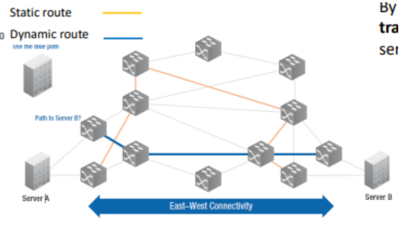

Secondo alcune stime autorevoli, menzionate nel blog sulla sicurezza di Cisco, l'enormità di questo fenomeno fa sì che attualmente oltre il 70 percento di tutto il traffico prodotto si configuri come connettività Est-Ovest, ovvero traffico che scorre trasversalmente tra i vari server racchiusi all'interno del data center stesso. Le architetture tradizionali dei data center citate dalla Open Data Center Alliance, invece, seguono tipicamente un consolidato design strutturato su tre livelli, denominati Access, Aggregation e Core. Queste architetture classiche sono state concepite e ottimizzate nativamente solo per assecondare il traffico di natura Nord-Sud, ovvero le direttrici tipiche dei paradigmi client-server. Al contrario, la gestione efficiente dell'imponente traffico Est-Ovest impone requisiti stringenti, esigendo specificamente una selezione flessibile dei percorsi, un bilanciamento del carico efficace per evitare colli di bottiglia e la capacità di operare una riconfigurazione estremamente veloce.

Infine, l'uso sempre più pervasivo e costante dei dispositivi mobili genera scenari operativi molto severi. Tali abitudini producono carichi di traffico altamente imprevedibili e che cambiano in modo estremamente rapido, combinati a frequentissimi e improvvisi mutamenti nei punti di collegamento e attaccamento fisici alla rete. Parallelamente, come accennato, le applicazioni odierne presentano necessità di QoS profondamente eterogenee. Nel dettaglio, le applicazioni *real-time*, come i protocolli VoIP o le odierne piattaforme di videoconferenza, necessitano di una latenza minima e di priorità assoluta di esecuzione. I trasferimenti massivi di file o *bulk data*, come i tipici salvataggi di backup, richiedono invece un'ampia disponibilità di larghezza di banda ma possono fortunatamente tollerare notevoli ritardi. Vi sono poi i software critici, le cosiddette applicazioni *mission-critical* (si pensi ai circuiti per le transazioni finanziarie), per le quali è mandatoria un'altissima affidabilità e la rigorosa garanzia di consegna dei dati. La rete, per poter funzionare correttamente, deve perciò essere in grado di assicurare un trattamento altamente differenziato ai vari flussi di traffico che la attraversano simultaneamente. A fronte di questo complesso scenario operativo, è evidente che un approccio statico, basato unicamente sul routing tramite indirizzi di destinazione, risulta palesemente inadeguato.

### I Limiti delle Reti Tradizionali e l'Importanza dei Livelli

Tutti i trend emergenti finora illustrati richiedono imperativamente l'adozione di un sistema di gestione flessibile delle risorse fisiche di rete. Purtroppo, le reti tradizionali palesano pesanti limitazioni raggruppabili in tre diverse categorie critiche.

In primo luogo, si affronta il problema dell'**Architettura Statica e Complessa**. Le reti tradizionali sono state fisicamente concepite come mere collezioni di protocolli che, per loro natura, vengono definiti in maniera del tutto indipendente l'uno dall'altro. Ciascun protocollo entra in gioco solo per risolvere una funzione estremamente ristretta e delineata, come avviene per il routing, lo spanning tree o le liste di controllo degli accessi (ACL). Questo approccio frammentato disintegra l'unità organica del piano di controllo, causando un accrescimento drastico e insostenibile della complessità a livello operativo.

In secondo luogo, persiste una cronica **Inconsistenza delle Policy e Rigidità Operativa**. Le modifiche necessarie alle configurazioni devono per forza di cose essere applicate manualmente agendo individualmente su molteplici dispositivi hardware. Poiché queste policy vengono obbligatoriamente fatte rispettare a livello puramente locale su ogni singola macchina e non sono coordinate a livello globale, il rischio intrinseco di introdurre una misconfigurazione umana aumenta drasticamente.

Infine, l'ultimo enorme ostacolo all'innovazione è rappresentato dalla forte **Dipendenza dai Vendor e dall'Innovazione Limitata**. Negli apparati preesistenti, l'intera logica necessaria al controllo della rete risulta saldamente incastonata (embedded) all'interno di specifici chip o circuiti hardware proprietari. La completa assenza di interfacce aperte, che possano permettere una programmazione esterna agnostica, relega di fatto questi strumenti a meri dispositivi chiusi. Di conseguenza, l'implementazione pratica e l'effettivo rilascio nel mercato di nuovi servizi e capacità subiscono ritardi sistematici e si rivelano processi estenuanti e molto lenti.

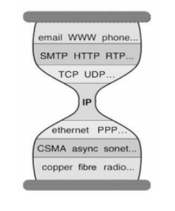

Per comprendere come evolvere la rete moderna, è fondamentale rivolgere lo sguardo al passato per chiedersi: "Perché l'architettura di Internet ha potuto scalare in modo così trionfale?". Il vero segreto risiede nella brillante concezione della sua architettura strettamente stratificata a livelli. Procedendo dall'alto verso il basso della cosiddetta pila protocollare, si susseguono il livello Application, seguito dal livello Transport (che si occupa di gestire comunicazioni affidabili o inaffidabili), fino ad arrivare all'imprescindibile livello Network (focalizzato sull'operazione di best-effort, gestendo la consegna globale dei pacchetti). Il transito locale fisico avviene poi grazie al livello Link, per concludersi con le operazioni elettroniche sul livello di Physical transmission. In questo schema magistrale, ciascun livello garantisce la disponibilità di una astrazione di servizio chiara e incontrovertibile, nascondendo gelosamente la sua complessa implementazione interna agli strati operativi circostanti. È proprio questa compartimentazione che ha permesso alle varie tecnologie di abilitare un'innovazione totalmente indipendente su ciascun layer. Approfondendo, la stratificazione (o layering) riveste una rilevanza assoluta perché consente la scomposizione logica di sistemi immensamente complessi in blocchi gestibili, istituendo interfacce di servizio trasparenti che si pongono in mezzo ai vari componenti elaborativi. Tutto ciò promuove un'innovazione indipendente, pur mantenendosi perfettamente compatibile con ciascun livello superiore o inferiore. Senza tema di smentita, questo elegantissimo principio di astrazione è stata la chiave tecnica decisiva per determinare il successo planetario e inarrestabile di Internet.

Sfortunatamente, questo virtuoso principio fondativo non ha trovato un'applicazione coerente ovunque. A totale differenza del livello deputato al transito del dato, il piano per il controllo e la gestione della rete (Network Control/Management Plane) non poggia la propria fondazione architettonica attorno a una singola e pulita astrazione concettuale. Per decenni, esso si è voluto evolvere solamente a compartimenti stagni, aggiungendo funzioni caso per caso e in modo del tutto frammentario. Per ogni nuovo requisito espresso dagli operatori, l'unica risposta dell'industria è stata l'introduzione di un ennesimo e distinto protocollo indipendente. Gli hardware di rete sono stati commercializzati unicamente come apparati chiusi ("closed equipment"), equipaggiati con pacchetti software prettamente proprietari inclusi forzatamente assieme alla parte hardware, tutti provvisti rigorosamente di interfacce molto specifiche legate in modo esclusivo ai voleri del singolo vendor. Manca del tutto un set integrato di principi generali o astrazioni solide in grado di guidare il progettista verso una stesura pulita e logicamente corretta del piano di controllo o gestione, creando un netto divario tecnologico se paragoniamo questo settore all'eleganza teorica posta oggi alla base dei grandi sistemi distribuiti o dei database relazionali. Il risultato visibile oggi sul campo è l'operatività tramite un "grande calderone di protocolli" ("Big bag of protocols"), universalmente noto nell'ambiente tecnico per essere estremamente arduo e spigoloso da dover amministrare. Questo ingarbugliamento produce cicli di standardizzazione lentissimi e frena quasi irrimediabilmente l'effettiva evoluzione del settore.

### Software Defined Networking: Concetti Principali e Definizioni

È in reazione a questo immobilismo che entra in scena il Software Defined Networking. Iniziamo definendo i concetti principali e sviscerando nel dettaglio le diverse funzioni che competono rigorosamente ai diversi strati del livello rete. La funzione di inoltro, nota come **forwarding**, è prerogativa assoluta del *data plane* (il piano dati). Essa consiste semplicemente nello spostare fisicamente i pacchetti dati dall'interfaccia di ingresso di un router fino all'appropriata e determinata interfaccia in uscita. Essendo un processo meccanico e ripetitivo, opera rigorosamente su scale temporali estramamente veloci ("fast timescales"), venendo elaborata individualmente per ogni singolo pacchetto in transito. 

La funzione di instradamento, meglio conosciuta come **routing**, afferisce invece al *control plane* (il piano di controllo). Il suo scopo preciso consiste nel calcolare e determinare formalmente l'intero percorso logico o topologico che ogni flusso di pacchetti dovrà seguire partendo dalla fonte per potersi adagiare a destinazione. 

A differenza del forwarding, l'algoritmo di routing si attua in maniera computazionalmente più laboriosa e, di conseguenza, prende vita su scale temporali dilatate o lente ("slow time-scales"), la cui interazione è dettata non per ciascun bit, ma al presentarsi di un perimetro per singolo "evento di controllo".

Per strutturare tecnicamente e fisicamente questo control plane esistono fondamentalmente due approcci antitetici. L'approccio convenzionale storico prevede un controllo definito *per-router*, in cui ogni apparato possiede una sua specifica individualità, mentre l'approccio propugnato e promosso dal Software Defined Networking si concretizza invece in un livello di controllo logicamente unificato e centralizzato.

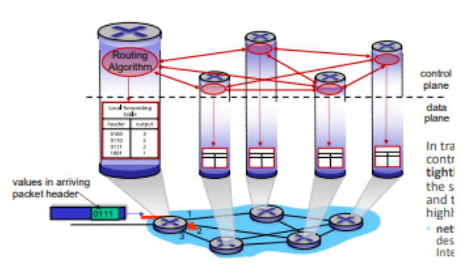

Nel modello a controllo distribuito *per-router*, singole componenti frazionate dell'algoritmo globale di instradamento operano disgiuntamente all'interno di ciascuno e in ogni singolo router distribuito sul territorio. Tali frammenti algoritmici interagiscono caoticamente scambiandosi comunicazioni sul control plane limitrofo per calcolare individualmente e localmente le proprie specifiche tabelle di inoltro o *forwarding tables*. Per comprendere la concretezza di questa procedura locale, le tabelle di forwarding implementate dai router convenzionali contengono un'associazione rigida e diretta tra gli specifici valori letti all'interno dell'intestazione di un pacchetto appena arrivato (ad esempio, rilevando il valore binario di un header corrispondente a 0111) e la corrispondente interfaccia fisica di output verso cui questo dato dovrà venire incanalato e smistato (indirizzandolo per l'appunto sulla porta 1, escludendo a priori le eventuali opzioni dirottate sulle porte fisiche numero 3 o numero 2, che verrebbero impiegate per associazioni binarie differenti come ad esempio header 0100 o 0110). Nelle reti tradizionali IP basate su tali presupposti, il piano del controllo assieme a quello del recapito dati risultano essere forzatamente e strettamente correlati ("tightly coupled"), incastrati materialmente e irrevocabilmente nei medesimi e soliti dispositivi proprietari incaricati alla commutazione. Questa struttura è caratterizzata da un profilo nel complesso altamente frammentato e totalmente decentralizzato. Questa non è una svista di design, ma una precisa ed esplicita direttiva implementativa voluta sin dagli albori progettuali del primordiale protocollo Internet, creata appositamente attorno all'indiscutibile obiettivo di dover conferire a tale rete la massima resilienza operativa nell'eventualità malaugurata di distruzioni settoriali delle tratte connesse.

### Le Sfide dell'Ingegneria del Traffico nel Routing Tradizionale

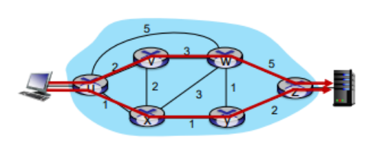

Immaginiamo che un operatore voglia traffico da u a z che passi attraverso uvwz invece che fa uxyz. Risulta necessario ri definire i pesi dei collegamenti così che l'algoritmo possa seguire la strada indicata oppure usare un nuovo algoritmo.

I pesi sono manopole, ma non abbiamo molto controllo.

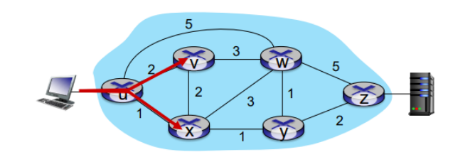

Risulta impossibile splittare il traffico u-z attraverso due percorsi differenti,  risulta necessario un nuovo algoritmo.

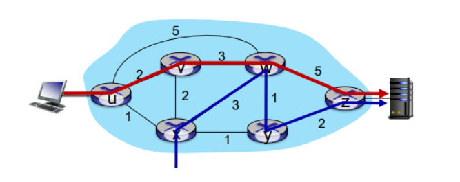

Sorge infine un ultimo quesito legato alla priorità: come ci si deve comportare se voglio effettuare percorso diverso da quello stabilito?

Non si può almeno che non uso altri algoritmi.

### Il Piano di Controllo SDN e l'Architettura Centralizzata

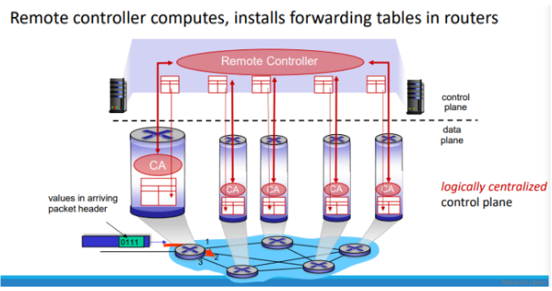

### Il Concetto Base del Software-Defined Networking (SDN)

L'innovazione principale dell'SDN è la netta separazione delle responsabilità:

- **Control Plane (Il Cervello):** Un'entità centralizzata intelligente (il Controller Remoto) che prende tutte le decisioni.

- **Data Plane (Il Braccio):** I router fisici sottostanti, che si limitano a instradare materialmente i pacchetti di dati seguendo gli ordini del Controller.

Questi due livelli comunicano tra loro tramite protocolli standardizzati chiamati **Open Interfaces**.

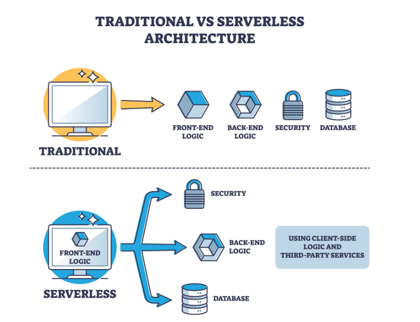

---

### Reti Tradizionali vs. Reti SDN

Per capire perché si preferisce l'approccio SDN centralizzato, confrontiamolo con il vecchio modello ad anarchia distribuita.

| **Caratteristica**        | **Reti Tradizionali (Distributed Control)**              | **SDN (Centralized Control Model)**                     |
| ------------------------- | -------------------------------------------------------- | ------------------------------------------------------- |
| **Visione della Rete**    | Limitata e locale (ogni router vede solo i suoi vicini). | Globale (panottica) grazie al Controller centralizzato. |
| **Chi calcola le rotte?** | Ogni singolo apparato lavora in modo autarchico.         | Il Controller Remoto calcola per tutti.                 |
| **Formula di base**       | $T_i= SPF(Topology, \text{link weights})$                | $\mathcal{F}:S(t)\rightarrow\{T_{1},T_{2},...,T_{n}\}$  |
| **Gestione Traffico**     | Ignora i carichi reali e le policy applicative.          | Analizza traffico reale, topologia e regole umane.      |
| **Risultato Globale**     | Casuale e non coordinato (impossibile da ottimizzare).   | Coerente, uniforme e ottimizzato su tutta la rete.      |

---

### Spiegazione delle Formule (in parole povere)

Nel **modello tradizionale**, ogni router calcola la sua tabella di inoltro locale ($T_i$) basandosi esclusivamente sulla mappa fissa e sul "peso" dei collegamenti:

> $T_i= SPF(Topology, \text{link weights})$

Nel **modello SDN**, il Controller usa una funzione globale ($\mathcal{F}$) per generare contemporaneamente tutte le tabelle per l'intera rete:

> $\mathcal{F}:S(t)\rightarrow\{T_{1},T_{2},...,T_{n}\}$

La grande differenza sta nella variabile **$S(t)$**. Questa variabile non guarda solo la mappa statica, ma tiene conto in tempo reale di:

1. Topologia fisica della rete.

2. Stato del traffico (i picchi di carico istantanei).

3. Policy e regole strategiche impostate dagli amministratori.

In sintesi: con l'SDN, un unico cervello guarda l'intero traffico dall'alto e distribuisce ordini coordinati a tutti i router, evitando ingorghi e rispettando le regole di business.

### L'Architettura SDN nel Dettaglio

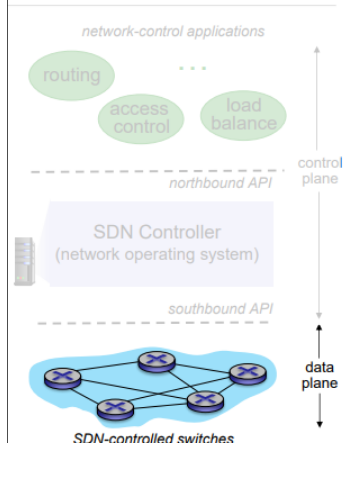

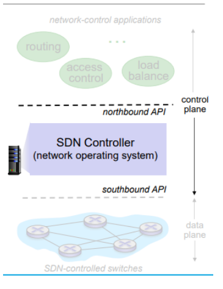

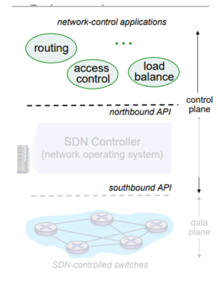

### I Tre Livelli dell'Architettura SDN

#### 1. Livello Dati / Data Plane (I "Muscoli")

È lo strato più basso, quello fisico.

- **Chi ci lavora:** I classici switch di rete (*commodity switches*).

- **Caratteristiche:** Sono apparati hardware semplici e velocissimi. Il loro unico scopo è smistare materialmente i pacchetti dati.

- **Come funzionano:** Sono "stupidi". Non calcolano le rotte da soli, ma si limitano ad applicare le regole (le *flow tables*) che gli vengono imposte dall'alto.

- **Comunicazione:** Ricevono ordini dal livello superiore tramite protocolli standardizzati (come **OpenFlow**).

#### 2. Livello di Controllo / Control Plane (Il "Direttore d'Orchestra")

È il livello intermedio, il cuore nevralgico del sistema.

- **Chi ci lavora:** L'SDN Controller (spesso chiamato Sistema Operativo di Rete).

- **Caratteristiche:** È un ponte. Conosce in tempo reale tutto lo stato della rete e fa da traduttore tra i comandi complessi delle applicazioni e le azioni pratiche degli switch.

- **Il trucco ingegneristico:** Anche se *logicamente* è un unico cervello centrale, *fisicamente* è un sistema distribuito su più server. Questo garantisce che la rete sia veloce, scalabile e, soprattutto, che non crolli tutto se un singolo server si guasta (*fault-tolerance*).

- **Comunicazione:** Usa le **Southbound API** per comandare gli switch (sotto) e le **Northbound API** per ascoltare le applicazioni (sopra).

#### 3. Livello Applicativo / Application Plane (La "Mente")

È il livello più alto, dove risiedono le logiche di business.

- **Chi ci lavora:** Le App di controllo di rete (*Network-control apps*).

- **Caratteristiche:** Sono i veri e propri "cervelli" che decidono le strategie: come bilanciare il traffico, bloccare accessi indesiderati (firewall) o definire percorsi prioritari.

- **La vera rivoluzione ("Unbundled"):** Queste app sono totalmente svincolate dall'hardware. Puoi comprare gli switch dall'azienda A, il controller dall'azienda B e far scrivere le app di gestione da un programmatore terzo. È la fine del monopolio dei fornitori hardware.

---

## Glossario / Concetti Chiave

- SDN (Software Defined Networking)

- Data Plane vs Control Plane

- Northbound API e Southbound API

- Astrazione Match-Action

- Commodity Switches e Architettura SDN

---

# Capitolo 5: Il Data Plane nelle Architetture SDN e il Protocollo OpenFlow

Questo capitolo analizza l'architettura di base del livello dati (Data Plane) all'interno del paradigma Software-Defined Networking (SDN). Verranno approfonditi i concetti fondamentali dell'inoltro generalizzato e del protocollo OpenFlow, esplorando come l'astrazione delle regole di instradamento consenta di programmare il comportamento dell'intera rete.

### L'Architettura SDN e il Ruolo del Data Plane

Nelle architetture di rete tradizionali, l'hardware è strettamente accoppiato al software che ne decide il comportamento. Nel paradigma SDN, l'architettura è invece strutturata su livelli distinti: l'Application Plane (che ospita applicazioni di sicurezza, di rete e di business), il Control Plane (dove risiedono i controller SDN) e il Data Plane. Questi livelli comunicano tramite interfacce standardizzate; in particolare, le applicazioni comunicano con il controller tramite le Northbound API (ad esempio, le REST API), mentre il controller gestisce l'infrastruttura sottostante tramite le Southbound API, di cui OpenFlow è l'esempio più noto.

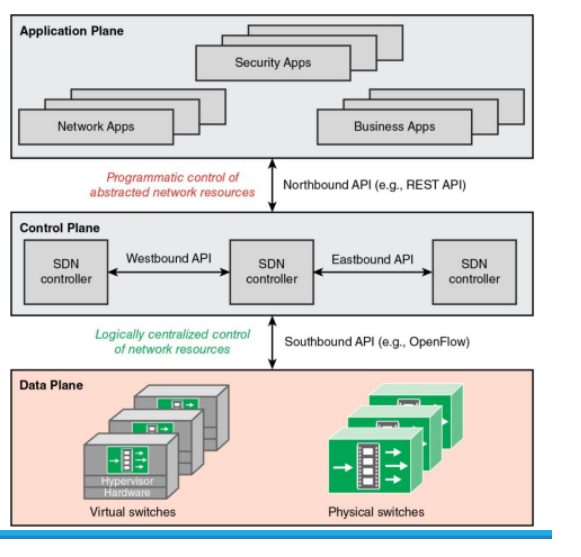

Il Data Plane rappresenta il livello delle risorse infrastrutturali ed è costituito dai dispositivi di inoltro, come switch virtuali, switch fisici e hypervisor hardware. La peculiarità di questi apparati in ambito SDN è che essi sono privi di software integrato per prendere decisioni autonome. Il loro unico scopo è eseguire il trasporto e l'elaborazione dei dati attenendosi scrupolosamente alle decisioni centralizzate calcolate dal Control Plane. Questo disaccoppiamento prende il nome di "Forwarding Abstraction", che consiste in un metodo universale (general-purpose) per permettere al piano di controllo di istruire il piano dati su come instradare i singoli pacchetti.

### L'Inoltro Generalizzato (Generalized Forwarding)

Nei router tradizionali, le regole di inoltro si basano sulla destinazione: il dispositivo si limita a instradare il pacchetto verso una porta in base all'indirizzo IP di destinazione. Nelle architetture SDN, si passa all'inoltro generalizzato (generalized forwarding), un paradigma in cui l'operatività si fonda sull'astrazione definita "match plus action".

All'interno di ogni router o switch SDN è presente una tabella di inoltro, comunemente nota come "flow table". Al momento della ricezione di un pacchetto, il dispositivo confronta (match) i valori dei bit contenuti in molteplici campi dell'intestazione (header). A seconda dell'esito della corrispondenza, il dispositivo può intraprendere diverse azioni, quali scartare (drop), copiare (copy), modificare (modify) o semplicemente registrare (log) il pacchetto.

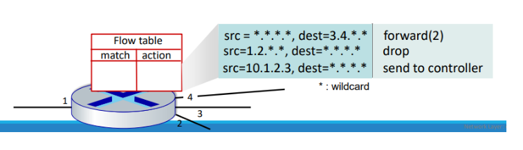

Un "flusso" (flow) è definito dai valori dei campi presenti nelle intestazioni a livello di collegamento (link layer), rete (network layer) e trasporto (transport layer). Le regole alla base della gestione dei pacchetti prevedono pattern precisi di valori (match) e le relative azioni da compiere sul pacchetto qualora i criteri vengano soddisfatti; tra le azioni più comuni troviamo l'inoltro, la modifica, lo scarto, o l'invio del pacchetto stesso al controller. Poiché potrebbero esserci pattern di match sovrapposti, i dispositivi fanno ricorso a un sistema di priorità (priority) per risolvere le ambiguità. Ogni regola è dotata inoltre di contatori (counters) che tengono traccia sia dei byte che del numero di pacchetti transitati per fini statistici.

Per fare un esempio pratico, se un pacchetto arriva con un indirizzo sorgente e destinazione che rientrano in una regola che prevede l'uso di caratteri jolly (wildcard, indicati con l'asterisco *), lo switch potrebbe inoltrarlo alla porta 2 o decidere di inviarlo al controller SDN, a seconda di ciò che recita la regola di azione.

### Il Protocollo OpenFlow e la Struttura delle Flow Table

OpenFlow è un protocollo di comunicazione vitale per le architetture SDN, in quanto costituisce un'implementazione pratica delle Southbound API. Rilasciato originariamente nell'aprile del 2008 da Nick McKeown et al., all'interno della rivista ACM SIGCOMM Computer Communication Review, le sue versioni successive sono oggi amministrate dalla Open Networking Foundation (ONF). Sebbene il suo impiego negli ambienti di produzione reali sia rimasto limitato, il protocollo conserva un immenso valore accademico e didattico.

Le voci all'interno di una tabella OpenFlow si compongono principalmente dei blocchi "Match", "Action" e "Stats" (contatori di pacchetti e byte). Le istruzioni del blocco azione permettono allo switch di inoltrare i dati su specifiche porte, farli cadere (drop), modificarne i campi dell'header oppure incapsularli e spedirli al controller.

I campi di intestazione che lo switch può valutare nella fase di match attraversano i principali livelli della pila ISO/OSI. A livello Link (livello 2), OpenFlow controlla la porta di ingresso (Ingress Port), i MAC Address sorgente e destinazione, l'Ethernet Type e i tag VLAN (VLAN ID e VLAN Pri). A livello Network (livello 3), le verifiche ricadono su IP sorgente e destinazione, IP Protocol e IP ToS. A livello Trasporto, infine, è possibile verificare le porte TCP o UDP di sorgente e destinazione.

L'efficacia dell'astrazione "match+action" risiede nella sua capacità di unificare comportamenti originariamente prerogativa di dispositivi hardware differenti.

- Un **Router** si ottiene effettuando il match sul prefisso IP di destinazione più lungo, associato a un'azione di inoltro su uno specifico collegamento.

- Uno **Switch** si modella facendo match sul MAC Address di destinazione e impostando azioni di inoltro o flooding.

- Un **Firewall** analizza gli indirizzi IP e le porte TCP/UDP per poi applicare azioni di permesso o di negazione del traffico.
  
  - Un esempio pratico di firewall in OpenFlow consiste nel bloccare, tramite l'azione "drop", tutti i datagrammi diretti alla porta TCP 22 (la porta di default per le connessioni SSH) o, in alternativa, bloccare l'intero traffico originato da uno specifico host come l'IP 128.119.1.1.

- Un **NAT (Network Address Translation)** si sviluppa facendo match su indirizzi IP e porte, con un'azione corrispondente atta a sovrascrivere tali valori (rewrite).

L'orchestrazione combinata di queste tabelle su più switch permette al controller di stabilire percorsi e comportamenti a livello di intera rete (network-wide behavior). Questa "programmabilità della rete", che affonda le sue radici storiche nel concetto di active networking e che trova oggi un'evoluzione generalizzata in strumenti come P4, rende l'elaborazione del singolo pacchetto un'operazione completamente programmabile.

### Funzionamento Interno di un OpenFlow Switch

Un dispositivo di rete all'interno del Data Plane assolve a due scopi complementari. Da un lato troviamo la funzione di "Data forwarding", che accetta i flussi dati (come traffico TCP/IP, UDP/IP o altri protocolli) dai sistemi finali o da altri apparati, instradandoli secondo percorsi pre-calcolati dalle applicazioni SDN. Dall'altro lato, vi è la "Control support function", atta a gestire l'interazione costante con il controller SDN.

Il controller comunica con lo switch tramite un canale di controllo, incapsulando i messaggi (Protocol Data Units) di OpenFlow su connessioni sicure (OpenFlow/TLS/TCP/IP). Attraverso questo canale OpenFlow, il sistema direzionale può aggiungere, rimuovere o aggiornare le regole, agendo sia in modo proattivo (pre-caricando le rotte), sia in modo reattivo (rispondendo a specifici pacchetti "sconosciuti" allo switch).

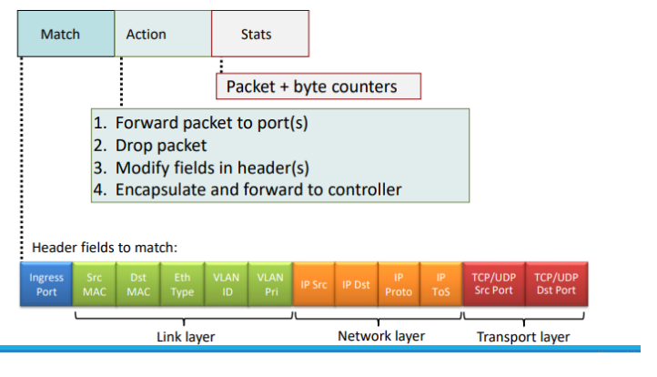

La vera flessibilità dell'SDN si concretizza nel modo in cui vengono gestite le regole interne, strutturate non come un'unica grande tabella, ma come una **Pipeline di Flow Table**. Le tabelle sono numerate sequenzialmente partendo dalla "Tabella 0". Quando un pacchetto fa il suo ingresso (Packet In), viene processato in primo luogo contro le voci della Tabella 0; in base al risultato di tale confronto, esso può essere indirizzato per ulteriori verifiche alle tabelle successive. Se viene trovato un match (che per convenzione deve essere sempre relativo alla regola con la priorità più alta), lo switch esegue il corredo di istruzioni associato.

Queste istruzioni possono modificare i metadati, aggiornare il cosiddetto "Action Set" o impartire una "Goto Instruction" che sposta il pacchetto più a valle nella pipeline, verso un'altra flow table, verso una Meter table, o verso una Group Table per essere infine inoltrato da una porta d'uscita.

Qualora un pacchetto non trovi alcuna regola specifica corrispondente, viene confrontato con una regola speciale detta "table-miss entry", la quale prevede tipicamente tre scenari:

1. Inviare il pacchetto al controller (in modo che quest'ultimo decida la nuova strada da impartire alla rete);

2. Direzionare il pacchetto verso una tabella successiva della pipeline;

3. Scartare definitivamente il pacchetto. Nel caso estremo in cui non sia presente neanche la table-miss entry e non ci sia alcun match positivo, il pacchetto viene semplicemente scartato.

### Tabelle di Gruppo (Group Tables)

Esistono situazioni in cui è conveniente inviare i pacchetti non verso una specifica singola porta, ma verso logiche più complesse descritte in una tabella di gruppo (Group Table). Un record all'interno della Group Table è caratterizzato da un Group ID univoco, una tipologia (Group type) che stabilisce le logiche operative, e una serie di "Action buckets", ovvero contenitori contenenti le vere e proprie istruzioni di inoltro.

Tra i comportamenti di gruppo più impiegati, spiccano i tipi "All" e "Select". Il tipo "All" viene utilizzato per le funzioni di trasmissione circolare (broadcast/multicast e flooding), poiché impone l'invio del pacchetto a tutti i bucket disponibili. Il tipo "Select", invece, risulta ideale per le funzioni di bilanciamento del carico (load balancing), in quanto il pacchetto viene inviato verso un solo bucket determinato dinamicamente tramite algoritmi appositi come l'hashing.

| **Group ID** | **Group Type** | **Buckets (actions)**  |
| ------------ | -------------- | ---------------------- |
| 1            | ALL            | Output: Port 2, Port 3 |
| 2            | SELECT         | Output: Port 4 or 5    |

---

### Esercitazione e Consolidamento

Per assimilare pienamente i concetti trattati in questa sezione, si invitano gli studenti a riflettere sui seguenti quesiti fondamentali:

1. In che modo il "general forwarding" differisce dall'inoltro tradizionale basato sulla destinazione?

2. Cosa si intende con l'operazione "match-action" all'interno di un router o di uno switch? E nel caso del destination-based forwarding, cosa viene specificatamente comparato e quale azione viene intrapresa?

3. Relativamente al forwarding generalizzato nell'SDN, fornire tre esempi di campi di intestazione che possono essere verificati e tre tipologie di azioni intraprendibili dal dispositivo.

### Glossario / Concetti Chiave

- **Forwarding Abstraction:** Il disaccoppiamento concettuale tra il piano direzionale e la componente fisica di trasporto, che rende i dispositivi di rete semplici meri esecutori di regole imposte.

- **Match plus action:** Paradigma operativo degli switch SDN in cui si confrontano pattern specifici degli header a cui corrisponde l'esecuzione di un'azione.

- **Flow Table Pipeline:** L'architettura interna degli switch OpenFlow che prevede il processamento a cascata dei pacchetti attraverso tabelle multiple.

- **Table-miss entry:** Regola di default, interpellata quando il pacchetto in arrivo non combacia con nessuna delle regole esplicite preimpostate.

- **Group Tables:** Meccanismo per implementare operazioni evolute come il broadcast e il bilanciamento del carico tramite la creazione di "gruppi" di porte logiche.

----

### L'Architettura SDN e il Ruolo del Data Plane

Nelle architetture di rete tradizionali, l'hardware è strettamente accoppiato al software che ne decide il comportamento. Nel paradigma SDN, l'architettura è invece strutturata su livelli distinti: l'Application Plane (che ospita applicazioni di sicurezza, di rete e di business), il Control Plane (dove risiedono i controller SDN) e il Data Plane. Questi livelli comunicano tramite interfacce standardizzate; in particolare, le applicazioni comunicano con il controller tramite le Northbound API (ad esempio, le REST API), mentre il controller gestisce l'infrastruttura sottostante tramite le Southbound API, di cui OpenFlow è l'esempio più noto.

Il Data Plane rappresenta il livello delle risorse infrastrutturali ed è costituito dai dispositivi di inoltro, come switch virtuali, switch fisici e hypervisor hardware. La peculiarità di questi apparati in ambito SDN è che essi sono privi di software integrato per prendere decisioni autonome. Il loro unico scopo è eseguire il trasporto e l'elaborazione dei dati attenendosi scrupolosamente alle decisioni centralizzate calcolate dal Control Plane. Questo disaccoppiamento prende il nome di "Forwarding Abstraction", che consiste in un metodo universale (general-purpose) per permettere al piano di controllo di istruire il piano dati su come instradare i singoli pacchetti.

### L'Inoltro Generalizzato (Generalized Forwarding)

Nei router tradizionali, le regole di inoltro si basano sulla destinazione: il dispositivo si limita a instradare il pacchetto verso una porta in base all'indirizzo IP di destinazione. Nelle architetture SDN, si passa all'inoltro generalizzato (generalized forwarding), un paradigma in cui l'operatività si fonda sull'astrazione definita "match plus action".

All'interno di ogni router o switch SDN è presente una tabella di inoltro, comunemente nota come "flow table". Al momento della ricezione di un pacchetto, il dispositivo confronta (match) i valori dei bit contenuti in molteplici campi dell'intestazione (header). A seconda dell'esito della corrispondenza, il dispositivo può intraprendere diverse azioni, quali scartare (drop), copiare (copy), modificare (modify) o semplicemente registrare (log) il pacchetto.

[INSERIRE IMMAGINE: Schematizzazione di un router contenente una Flow table che illustra il processo di confronto dei valori dell'intestazione in ingresso con le regole di match e la relativa azione]

Un "flusso" (flow) è definito dai valori dei campi presenti nelle intestazioni a livello di collegamento (link layer), rete (network layer) e trasporto (transport layer). Le regole alla base della gestione dei pacchetti prevedono pattern precisi di valori (match) e le relative azioni da compiere sul pacchetto qualora i criteri vengano soddisfatti; tra le azioni più comuni troviamo l'inoltro, la modifica, lo scarto, o l'invio del pacchetto stesso al controller. Poiché potrebbero esserci pattern di match sovrapposti, i dispositivi fanno ricorso a un sistema di priorità (priority) per risolvere le ambiguità. Ogni regola è dotata inoltre di contatori (counters) che tengono traccia sia dei byte che del numero di pacchetti transitati per fini statistici.

Per fare un esempio pratico, se un pacchetto arriva con un indirizzo sorgente e destinazione che rientrano in una regola che prevede l'uso di caratteri jolly (wildcard, indicati con l'asterisco *), lo switch potrebbe inoltrarlo alla porta 2 o decidere di inviarlo al controller SDN, a seconda di ciò che recita la regola di azione.

### Il Protocollo OpenFlow e la Struttura delle Flow Table

OpenFlow è un protocollo di comunicazione vitale per le architetture SDN, in quanto costituisce un'implementazione pratica delle Southbound API. Rilasciato originariamente nell'aprile del 2008 da Nick McKeown et al., all'interno della rivista ACM SIGCOMM Computer Communication Review, le sue versioni successive sono oggi amministrate dalla Open Networking Foundation (ONF). Sebbene il suo impiego negli ambienti di produzione reali sia rimasto limitato, il protocollo conserva un immenso valore accademico e didattico.

Le voci all'interno di una tabella OpenFlow si compongono principalmente dei blocchi "Match", "Action" e "Stats" (contatori di pacchetti e byte). Le istruzioni del blocco azione permettono allo switch di inoltrare i dati su specifiche porte, farli cadere (drop), modificarne i campi dell'header oppure incapsularli e spedirli al controller.

I campi di intestazione che lo switch può valutare nella fase di match attraversano i principali livelli della pila ISO/OSI. A livello Link (livello 2), OpenFlow controlla la porta di ingresso (Ingress Port), i MAC Address sorgente e destinazione, l'Ethernet Type e i tag VLAN (VLAN ID e VLAN Pri). A livello Network (livello 3), le verifiche ricadono su IP sorgente e destinazione, IP Protocol e IP ToS. A livello Trasporto, infine, è possibile verificare le porte TCP o UDP di sorgente e destinazione.

L'efficacia dell'astrazione "match+action" risiede nella sua capacità di unificare comportamenti originariamente prerogativa di dispositivi hardware differenti.

- Un **Router** si ottiene effettuando il match sul prefisso IP di destinazione più lungo, associato a un'azione di inoltro su uno specifico collegamento.

- Uno **Switch** si modella facendo match sul MAC Address di destinazione e impostando azioni di inoltro o flooding.

- Un **Firewall** analizza gli indirizzi IP e le porte TCP/UDP per poi applicare azioni di permesso o di negazione del traffico.
  
  - Un esempio pratico di firewall in OpenFlow consiste nel bloccare, tramite l'azione "drop", tutti i datagrammi diretti alla porta TCP 22 (la porta di default per le connessioni SSH) o, in alternativa, bloccare l'intero traffico originato da uno specifico host come l'IP 128.119.1.1.

- Un **NAT (Network Address Translation)** si sviluppa facendo match su indirizzi IP e porte, con un'azione corrispondente atta a sovrascrivere tali valori (rewrite).

L'orchestrazione combinata di queste tabelle su più switch permette al controller di stabilire percorsi e comportamenti a livello di intera rete (network-wide behavior). Questa "programmabilità della rete", che affonda le sue radici storiche nel concetto di active networking e che trova oggi un'evoluzione generalizzata in strumenti come P4, rende l'elaborazione del singolo pacchetto un'operazione completamente programmabile.

### Funzionamento Interno di un OpenFlow Switch

Un dispositivo di rete all'interno del Data Plane assolve a due scopi complementari. Da un lato troviamo la funzione di "Data forwarding", che accetta i flussi dati (come traffico TCP/IP, UDP/IP o altri protocolli) dai sistemi finali o da altri apparati, instradandoli secondo percorsi pre-calcolati dalle applicazioni SDN. Dall'altro lato, vi è la "Control support function", atta a gestire l'interazione costante con il controller SDN.

Il controller comunica con lo switch tramite un canale di controllo, incapsulando i messaggi (Protocol Data Units) di OpenFlow su connessioni sicure (OpenFlow/TLS/TCP/IP). Attraverso questo canale OpenFlow, il sistema direzionale può aggiungere, rimuovere o aggiornare le regole, agendo sia in modo proattivo (pre-caricando le rotte), sia in modo reattivo (rispondendo a specifici pacchetti "sconosciuti" allo switch).

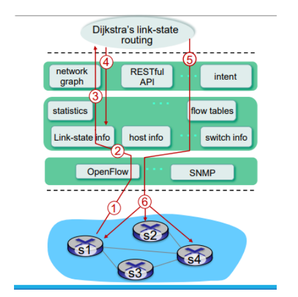

La vera flessibilità dell'SDN si concretizza nel modo in cui vengono gestite le regole interne, strutturate non come un'unica grande tabella, ma come una **Pipeline di Flow Table**. Le tabelle sono numerate sequenzialmente partendo dalla "Tabella 0". Quando un pacchetto fa il suo ingresso (Packet In), viene processato in primo luogo contro le voci della Tabella 0; in base al risultato di tale confronto, esso può essere indirizzato per ulteriori verifiche alle tabelle successive. Se viene trovato un match (che per convenzione deve essere sempre relativo alla regola con la priorità più alta), lo switch esegue il corredo di istruzioni associato.

Queste istruzioni possono modificare i metadati, aggiornare il cosiddetto "Action Set" o impartire una "Goto Instruction" che sposta il pacchetto più a valle nella pipeline, verso un'altra flow table, verso una Meter table, o verso una Group Table per essere infine inoltrato da una porta d'uscita.

Qualora un pacchetto non trovi alcuna regola specifica corrispondente, viene confrontato con una regola speciale detta "table-miss entry", la quale prevede tipicamente tre scenari:

1. Inviare il pacchetto al controller (in modo che quest'ultimo decida la nuova strada da impartire alla rete);

2. Direzionare il pacchetto verso una tabella successiva della pipeline;

3. Scartare definitivamente il pacchetto. Nel caso estremo in cui non sia presente neanche la table-miss entry e non ci sia alcun match positivo, il pacchetto viene semplicemente scartato.

### Tabelle di Gruppo (Group Tables)

Esistono situazioni in cui è conveniente inviare i pacchetti non verso una specifica singola porta, ma verso logiche più complesse descritte in una tabella di gruppo (Group Table). Un record all'interno della Group Table è caratterizzato da un Group ID univoco, una tipologia (Group type) che stabilisce le logiche operative, e una serie di "Action buckets", ovvero contenitori contenenti le vere e proprie istruzioni di inoltro.

Tra i comportamenti di gruppo più impiegati, spiccano i tipi "All" e "Select". Il tipo "All" viene utilizzato per le funzioni di trasmissione circolare (broadcast/multicast e flooding), poiché impone l'invio del pacchetto a tutti i bucket disponibili. Il tipo "Select", invece, risulta ideale per le funzioni di bilanciamento del carico (load balancing), in quanto il pacchetto viene inviato verso un solo bucket determinato dinamicamente tramite algoritmi appositi come l'hashing.

| Group ID | Group Type | Buckets (actions)      |
| -------- | ---------- | ---------------------- |
| 1        | ALL        | Output: Port 2, Port 3 |
| 2        | SELECT     | Output: Port 4 or 5    |

---

### Esercitazione e Consolidamento

Per assimilare pienamente i concetti trattati in questa sezione, si invitano gli studenti a riflettere sui seguenti quesiti fondamentali:

1. In che modo il "general forwarding" differisce dall'inoltro tradizionale basato sulla destinazione?

2. Cosa si intende con l'operazione "match-action" all'interno di un router o di uno switch? E nel caso del destination-based forwarding, cosa viene specificatamente comparato e quale azione viene intrapresa?

3. Relativamente al forwarding generalizzato nell'SDN, fornire tre esempi di campi di intestazione che possono essere verificati e tre tipologie di azioni intraprendibili dal dispositivo.

### Glossario / Concetti Chiave

- **Forwarding Abstraction:** Il disaccoppiamento concettuale tra il piano direzionale e la componente fisica di trasporto, che rende i dispositivi di rete semplici meri esecutori di regole imposte.

- **Match plus action:** Paradigma operativo degli switch SDN in cui si confrontano pattern specifici degli header a cui corrisponde l'esecuzione di un'azione.

- **Flow Table Pipeline:** L'architettura interna degli switch OpenFlow che prevede il processamento a cascata dei pacchetti attraverso tabelle multiple.

- **Table-miss entry:** Regola di default, interpellata quando il pacchetto in arrivo non combacia con nessuna delle regole esplicite preimpostate.

- **Group Tables:** Meccanismo per implementare operazioni evolute come il broadcast e il bilanciamento del carico tramite la creazione di "gruppi" di porte logiche.

---

### Le Funzioni di Routing Centralizzato

A differenza delle architetture tradizionali, nelle reti SDN il calcolo dei percorsi è affidato a un'applicazione di routing centralizzata, la quale esegue due funzioni ben distinte. La prima è la **Link/Topology discovery**, poiché la funzione di routing necessita di essere costantemente aggiornata sui collegamenti fisici esistenti tra gli switch del Data Plane. È importante notare che, allo stato attuale, la procedura di scoperta della topologia nei domini OpenFlow non è formalmente standardizzata dalle specifiche base, ma si appoggia a best practice consolidate. La seconda funzione è assolta dal **Topology manager**, un componente che mantiene in memoria le informazioni sull'intera topologia di rete e si occupa di calcolare le rotte, determinando in particolare il percorso più breve (shortest path) tra due nodi del Data Plane o tra un nodo e un host finale.

### L'Inizializzazione degli Switch e l'Handshake Iniziale

Il processo di riconoscimento inizia nel momento in cui un dispositivo viene acceso. Quando uno switch OpenFlow viene inizializzato, esso tenta immediatamente di stabilire una connessione di controllo con il controller SDN. A seguito di questo contatto, il controller invia un messaggio denominato **FEATURE REQUEST MESSAGE** per interrogare il dispositivo. Lo switch risponde con un **FEATURE REPLY MESSAGE**, comunicando al controller una serie di parametri fondamentali per la futura scoperta dei collegamenti, tra cui il proprio identificativo univoco (Switch ID) e un elenco completo delle porte attive in quel momento.

[INSERIRE IMMAGINE: Controller connesso a due switch, Switch OF1 e Switch OF2, che illustra le porte di connessione p1 verso il controller e i collegamenti fisici p2 tra gli switch stessi ]

Al termine di questa fase di "handshake" iniziale, il controller ha acquisito la conoscenza dell'esatto numero di porte attive presenti su tutti gli switch OpenFlow connessi. Tuttavia, questa informazione non è sufficiente per instradare il traffico: il controller, infatti, non conosce ancora come queste porte siano interconnesse fisicamente tra loro, rendendo obbligatorio l'avvio della vera e propria fase di "Topology discovery".

### La Scoperta della Topologia tramite Protocollo LLDP

Per abilitare la mappatura della rete, gli switch OpenFlow si affidano a due configurazioni iniziali determinanti. In primo luogo, ogni apparato possiede, preimpostati di default, l'indirizzo IP e la porta TCP del controller, garantendo così la connessione immediata all'accensione. In secondo luogo, gli switch dispongono di regole di flusso preinstallate che li obbligano a instradare direttamente verso il controller (tramite un messaggio Packet-In) qualsiasi pacchetto relativo al **Link Layer Discovery Protocol (LLDP)** che dovesse transitare sulle loro interfacce. Questa dinamica è ben analizzata nella letteratura di settore, come evidenziato nello studio "Current trends of topology discovery in OpenFlow-based software defined networks" a cura di Ochoa Aday L., Cervelló Pastor C. e Fernández Fernández A..

Il protocollo LLDP è stato standardizzato per la prima volta dall'IEEE nel 2005 e successivamente aggiornato nel 2009. Si tratta di un protocollo "vendor neutral" che opera a Livello 2 (Data Link) del modello OSI ed è concepito per la scoperta dei vicini limitata a un singolo salto (single jump). Il suo scopo è pubblicizzare l'identità e le capacità di un dispositivo, ricevendo contestualmente le medesime informazioni dagli switch adiacenti. Nelle reti tradizionali, i frame LLDP vengono inviati a intervalli di tempo fissi stabiliti dall'amministratore di rete ; nel paradigma SDN basato su OpenFlow, al contrario, gli switch inviano i messaggi LLDP unicamente su esplicita richiesta del controller.

A livello tecnico, LLDP utilizza comunemente Ethernet come protocollo di "trasporto", identificato dall'Ethertype specifico `0x88cc`. Il payload del pacchetto, noto come LLDPDU, è strutturato in campi TLV (Type-Length-Value):

- **Chassis ID (Type 1):** Contiene l'identificativo dello switch che ha generato e inviato il pacchetto LLDP.

- **Port ID (Type 2):** Contiene l'identificativo della specifica porta attraverso cui il pacchetto LLDP viene fisicamente trasmesso.

- **Time to Live (Type 3):** Indica, in secondi, il periodo di validità delle informazioni trasportate nel pacchetto.

- **End of LLDPDU (Type 4):** Segnala la fine effettiva del payload all'interno del frame LLDP.

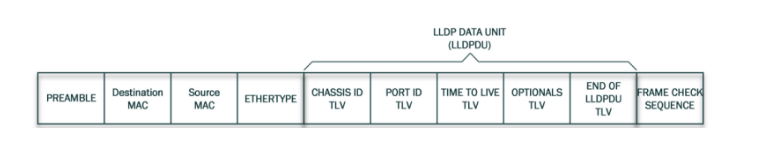

### Il Processo Operativo di Mapping dei Collegamenti

Una volta appreso il numero esatto delle porte attive tramite l'handshake iniziale , il controller innesca un processo di scoperta metodico e periodico per dedurre i collegamenti.

Il processo si articola in quattro passaggi fondamentali:

1. Il controller genera un messaggio Packet-Out per ogni singola porta attiva di ciascuno switch conosciuto, incapsulando all'interno di esso un pacchetto LLDP appositamente formattato.

2. Quando lo switch riceve questo Packet-Out, estrae il messaggio LLDP e lo inoltra fisicamente sulla rete attraverso la porta specifica (Port ID) indicata dal controller, raggiungendo così l'apparato adiacente.

3. Lo switch vicino riceve il frame LLDP su una propria porta. Essendo configurato per intercettare questo traffico (che non proviene dalla porta diretta verso il controller), incapsula il pacchetto all'interno di un messaggio Packet-In e lo spedisce al controller. In questa fase, lo switch arricchisce il messaggio con dei preziosi metadati, inserendo il proprio Switch ID e il Port ID su cui ha effettivamente captato il pacchetto LLDP.

4. Quando il Packet-In raggiunge il controller, quest'ultimo estrae l'intero set di informazioni. Confrontando lo Switch ID e il Port ID originali (scritti dentro il payload LLDP) con lo Switch ID e il Port ID presenti nei metadati del Packet-In, il controller ha la certezza matematica che esista un collegamento fisico (link) tra quelle due specifiche porte.

Questa sequenza viene iterata per ogni singolo switch OpenFlow presente nell'infrastruttura. Volendo quantificare l'onere di questo processo, in una rete composta da un numero $S$ di switch OpenFlow interconnessi da un set di collegamenti $L$, il totale dei messaggi Packet-Out che il controller deve emettere per scoprire tutti i link esistenti tra gli apparati, ipotizzando $P$ porte attive, è dato dalla seguente formula matematica:

$TOTAL_{PACKET-OUT}=\sum_{i=1}^{S}P_{i}$

[INSERIRE IMMAGINE: Processo interattivo di Topology Discovery in cui il controller invia un Packet Out contenente un LLDP allo Switch S1, che lo propaga allo Switch S2, il quale chiude il ciclo inviando un Packet In di notifica al controller ]

In base a questi scambi, il controller è in grado di compilare internamente una tabella dei link, come mostrato nell'esempio sottostante:

| **Src Switch** | **Src Port** | **Dst Switch** | **Dst Port** |
| -------------- | ------------ | -------------- | ------------ |
| S1             | 2            | S2             | 1            |

### La Raggiungibilità degli Host (Host Reachability)

Oltre a mappare i nodi dell'infrastruttura di trasporto, il controller deve scoprire dove risiedono i dispositivi finali (host) degli utenti. Questo processo di "discovery" degli host viene tipicamente innescato dalla comparsa di traffico sconosciuto ("unknown traffic") che entra nel dominio di rete controllato. Tale traffico può provenire da un host direttamente collegato allo switch o, in alternativa, da un router limitrofo.

Quando un host (ad esempio, l'Host A) trasmette un dato, lo switch ricevente, non avendo ancora regole di inoltro per quella sorgente, subisce un "table-miss". Conformemente al protocollo, lo switch genera un messaggio Packet-In, delegando la gestione del pacchetto sconosciuto al controller. Ispezionando questo pacchetto, il controller estrapola l'indirizzo MAC (Eth Address) della sorgente e registra la porta e lo switch d'ingresso all'interno della sua "Host Table", acquisendo così la posizione esatta dell'utente sulla mappa di rete.

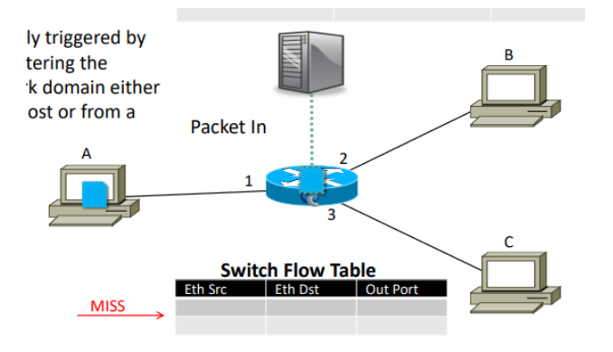

| **Eth Address** | **Switch** | **Port** |
| --------------- | ---------- | -------- |
| A               | 1          | 1        |

### Glossario / Concetti Chiave

- **FEATURE REQUEST / REPLY:** Messaggi OpenFlow utilizzati nella primissima fase di accensione di uno switch per scambiare informazioni basilari come le porte attive.

- **LLDP (Link Layer Discovery Protocol):** Standard IEEE di livello 2, utilizzato nelle reti SDN per sondare in modo sistematico l'esistenza di collegamenti fisici tra apparati adiacenti.

- **Topology Manager:** Il modulo logico del controller preposto a consolidare le informazioni scoperte tramite LLDP e a tracciare la mappa completa dell'infrastruttura per i calcoli di routing.

- **Host Reachability:** Il meccanismo reattivo tramite il quale il controller apprende la posizione degli utenti finali (host) analizzando i messaggi Packet-In generati da traffico inizialmente sconosciuto.

---

# Capitolo 6:
