# 

# Lezione 1: Introduzione al Corso: P2P Systems and Blockchains

### Dal Modello Client-Server alle Reti P2P

L'evoluzione verso le reti decentralizzate richiede prima di tutto una profonda comprensione del tradizionale paradigma Client-Server. In questa architettura asimmetrica, il sistema è diviso in due entità distinte. Il Client è un software eseguito sugli host finali degli utenti (end-hosts) che manifesta un comportamento intermittente definito "on/off" (si accende e si spegne a discrezione dell'utente). Il client agisce come mero consumatore del servizio inviando richieste (issue requests), ed è tecnicamente isolato, poiché i client non comunicano mai direttamente tra di loro. Per poter funzionare, un client ha il bisogno assoluto di conoscere a priori l'indirizzo IP del server bersaglio. Di contro, il Server è eseguito su macchine host altamente specializzate e dedicate a questo unico scopo, rimanendo perpetuamente accese e connesse (always on) per operare come fornitori del servizio. Essi ricevono le richieste e hanno il compito di soddisfarle tutte indistintamente. Proprio per poter essere sempre rintracciabili dai client, i server necessitano di un indirizzo IP fisso, o in alternativa di un nome DNS stabile nel tempo. 

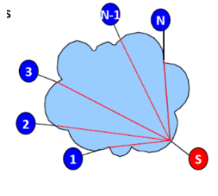

Il paradigma Peer-to-Peer scardina completamente questa asimmetria gerarchica. In una rete P2P, l'entità software chiamata "Peer" viene sempre eseguita sugli host finali e presenta lo stesso comportamento intermittente (on/off) dei client tradizionali; tuttavia, la rete deve essere ingegnerizzata in modo da poter tollerare e gestire questo continuo e imprevedibile ricambio di nodi, un fenomeno tecnico noto come "churn". Un peer ha la necessità intrinseca di sapersi unire al network ("need to join") e di possedere protocolli atti a scoprire autonomamente la presenza di altri pari ("need to discover other peers"). L'aspetto rivoluzionario è che ogni singolo peer incarna contemporaneamente il ruolo di fornitore e di consumatore di servizi, potendo comunicare direttamente con i suoi pari senza passare per un centro nevralgico. 

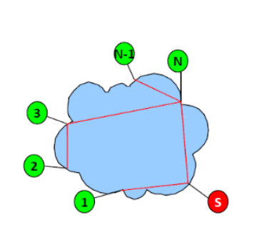

Proprio a causa di questa totale libertà strutturale, diventa imperativo stabilire rigorose regole di comunicazione. È necessario implementare dei meccanismi sociali e crittografici per prevenire il problema del "free riding" (il comportamento opportunistico di chi sfrutta la rete senza restituire risorse) incentivando, al contrario, la partecipazione attiva e il principio di reciprocazione tra gli utenti. Sebbene la condivisione delle risorse avvenga unicamente tra pari, va precisato che un server centralizzato potrebbe rivelarsi ancora necessario unicamente per facilitare le primissime fasi di connessione ("bootstrap"), ma non è in alcun modo coinvolto o richiesto durante le fasi vere e proprie di resource sharing. 

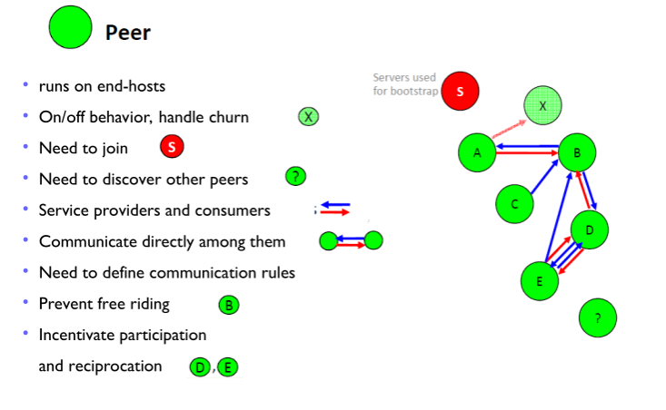

### Condivisione delle Risorse e File Sharing

Formalizzando queste architetture, la **Definizione 1** classifica un sistema P2P come un insieme di entità autonome (i peer) in grado di auto-organizzarsi e di condividere attivamente un insieme di risorse distribuite all'interno di una rete informatica. Sfruttando queste enormi risorse aggregative, il sistema riesce a erogare un servizio mantenendo un assetto completamente (o almeno parzialmente) decentralizzato. Tra le risorse comunemente condivise troviamo la potenza di calcolo (Computing power), lo spazio di archiviazione con permessi di lettura e scrittura (generando i Distributed File System), la larghezza di banda (Bandwidth) e i registri crittografici (Ledgers).

Una formulazione alternativa, la **Definizione 2**, descrive il P2P come un sistema distribuito fondato su un set di nodi interconnessi capaci di auto-organizzarsi, formando svariate e complesse topologie di rete atte a condividere cicli di CPU, memoria e banda. Questa definizione pone un accento ancora più marcato sulla resilienza tecnica: il sistema deve sapersi adattare proattivamente a un continuo ricambio (churn) dei nodi, preservando sempre e comunque la connettività complessiva e assicurando buone prestazioni senza mai doversi affidare a un server centrale.

La logica del *Resource Sharing* nel P2P si basa sul concetto di reciprocità comunitaria: ciascun peer elargisce un set di risorse ricevendo in cambio una contropartita paritaria di servizi dalla rete. In questo ambiente speculare, i nodi esercitano funzionalità simmetriche diventando dei **Servent** (neologismo derivato da Server + Client). Storicamente, il primo grande scenario applicativo fu rappresentato dallo scambio dei file audio: un utente condivideva la propria libreria musicale per ottenere il privilegio di scaricare le canzoni degli altri, come pionieristicamente dimostrato da piattaforme come Napster, Gnutella o BitTorrent.
La flessibilità del sistema, tuttavia, spazia ben oltre l'intrattenimento. Un utente può scegliere di donare gratuitamente risorse per scopi accademici o benefici, partecipando a reti di calcolo distribuito per la ricerca di forme di vita extraterrestre o per lo sviluppo di terapie oncologiche. Nel contesto delle valute digitali, invece, un peer può decidere di contribuire al mantenimento di un registro distribuito guadagnando in cambio una ricompensa formale per la gestione della rete, un'attività universalmente nota come "mining" nell'universo Bitcoin. Indipendentemente dal loro scopo, tutte queste risorse giacciono direttamente nei "confini" o "margini" (border) della rete Internet, ospitate dai dispositivi degli utenti senza transitare su infrastrutture hardware "special purpose" destinate al loro controllo centralizzato.

Tutto ciò presenta sfide considerevoli per la progettazione del network. Essendo le connessioni puramente transitorie, la topologia della rete viene continuamente scossa da feroci disconnessioni, con risorse che appaiono e svaniscono in maniera estremamente dinamica. L'architettura tipica di Internet complica ulteriormente lo scenario: ogni volta che un utente si ricollega, il suo fornitore di servizi gli assegna un indirizzo IP diverso. Di conseguenza, è assolutamente impossibile tracciare o mappare stabilmente l'ubicazione di un file o di una risorsa affidandosi semplicemente a degli IP statici. I sistemi P2P hanno quindi dovuto inventare e definire protocolli di indirizzamento totalmente nuovi, stratificati sul "livello applicativo" del modello di rete, e del tutto slegati dai rigidi protocolli di routing del livello IP.

Questa evoluzione è partita dal **P2P file sharing**, la prima vera e propria "killer application" della categoria. Pensati all'origine come sistemi rudimentali, leggeri e basati su un protocollo "best effort", essi ignoravano concetti complessi come la persistenza inalterabile o l'estrema sicurezza, privilegiando esclusivamente la velocità di scambio e l'anonimato degli utenti. Da software iconici come Napster, Gnutella, KaZaa ed eMule, la tecnologia si è potenziata giungendo ai protocolli in sciami come BitTorrent. Dal perfezionamento di queste stesse dinamiche P2P è poi scaturita una seconda, maestosa ondata di innovazione, materializzatasi con l'avvento della crittografia su Blockchain e con i File System Distribuiti planetari, come l'acclamato IPFS.

---

### Glossario / Concetti Chiave

- **P2P (Peer-to-Peer):** Architettura di rete distribuita in cui ogni nodo (peer) possiede privilegi e responsabilità equivalenti, operando sia come client che come server (Servent).

- **Churn:** Tasso di ricambio continuo dei nodi in una rete P2P (causato dalla loro natura "on/off"), che la struttura deve saper sopportare mantenendo l'operatività complessiva.

- **Overlay Networks:** Reti logiche virtuali create al livello applicativo sopra l'infrastruttura di rete preesistente (es. Internet) allo scopo di indirizzare le risorse quando non si possono usare IP statici.

- **Free Riding:** Il comportamento di quegli utenti che, all'interno di una rete P2P, scaricano o consumano risorse dalla comunità senza contribuire fornendone a loro volta.

- **Blockchain e Smart Contract:** L'evoluzione dei registri P2P (attraverso l'uso di crittografia avanzata e algoritmi di consenso) per validare l'integrità e il tracciamento in un ambiente non affidabile, e i contratti auto-eseguibili scritti in linguaggi come Solidity.

---

### La Linea del Tempo del P2P e della Blockchain

Per comprendere l'ecosistema attuale, è fondamentale tracciare una cronologia storica delle tecnologie P2P e crittografiche. Nel 1999, l'introduzione di Napster ha inaugurato l'era del file sharing musicale. L'anno successivo, nel 2000, Gnutella ha spinto l'innovazione introducendo veri e propri network decentralizzati. Il 2001 ha visto emergere protocolli per la condivisione di file di grandi dimensioni come eDonkey ed eMule, parallelamente alla nascita di BitTorrent, che ha rivoluzionato il settore implementando le Distributed Hash Tables. Il protocollo Torrent si è poi consolidato definitivamente nel 2003.
Successivamente, l'attenzione si è spostata verso la crittografia e la blockchain: nel 2009 è nato Bitcoin, la prima vera criptovaluta , seguito nel 2015 dall'introduzione degli smart contract. Il 2017 ha segnato l'esplosione di Ethereum, aprendo la strada alla finanza decentralizzata (DeFi). Arrivando agli anni 2020, ci troviamo nell'era del Web3, caratterizzata da applicazioni P2P avanzate, protocolli come IPFS e piattaforme sociali decentralizzate.

### Il File Sharing: La Prima "Killer Application" del P2P

Il primo grande caso di successo per le reti P2P è stato indubbiamente il **file sharing**. Immaginiamo un utente $U$ che esegue un client P2P sul proprio computer portatile. La sua connessione a Internet è intermittente; di conseguenza, ogni volta che si connette ottiene un indirizzo IP diverso. L'utente archivia i file che desidera condividere in una directory specifica, associando a ciascun file un set di chiavi identificative (ad esempio, per un brano musicale: titolo, autore, data di pubblicazione). Quando $U$ è interessato a trovare una particolare canzone, invia una query (richiesta) al sistema. Il sistema individua e mostra le informazioni relative agli altri peer che possiedono il brano richiesto. A questo punto, l'utente $U$ sceglie un peer specifico, chiamiamolo $P$, in base a determinati criteri che verranno approfonditi nel corso. Il file viene quindi copiato direttamente dal computer di $P$ a quello di $U$. Un aspetto cruciale di questa architettura è che, mentre $U$ sta ancora eseguendo il download, altri utenti possono già iniziare a caricare (upload) le parti del file che $U$ ha già scaricato e inserito nella sua directory condivisa, massimizzando l'efficienza della rete.

Questa rivoluzione è iniziata con il rapido successo di Napster alla fine degli anni '90, circa dieci anni dopo l'invenzione del World Wide Web. Napster rappresenta la **prima generazione** di questi sistemi. Esso introduceva un set di server centralizzati in cui gli utenti registravano i descrittori dei file che intendevano condividere. Di fatto, solamente la trasmissione effettiva dei contenuti (download e upload) sfruttava un protocollo P2P, mentre la fase di ricerca dei file rimaneva strettamente centralizzata. Questa presenza di una directory centralizzata si è rivelata essere il vero "tallone d'Achille" dell'applicazione. Napster venne infatti condannato per non aver rispettato le leggi sul copyright, in quanto le autorità avrebbero potuto facilmente rilevare i contenuti scambiati tra gli utenti proprio attraverso l'analisi di quella singola directory centralizzata.

Per ovviare a queste vulnerabilità legali e strutturali, è nata la **seconda generazione** di applicazioni di file sharing. In questi nuovi sistemi, non esiste più alcun punto di centralizzazione. Sia la fase di ricerca dei file che il trasferimento dei contenuti sono distribuiti in maniera completamente paritaria, come dimostrato da protocolli storici quali Gnutella, FastTrack/Kazaa e le prime versioni di BitTorrent.

### Blockchain: La Seconda "Killer Application"

Se il file sharing ha dimostrato la fattibilità delle reti distribuite, la **Blockchain** ne ha espanso enormemente le potenzialità, diventando la seconda "killer application" del mondo P2P. Possiamo fornire diverse definizioni per inquadrare questa tecnologia. La prima definizione la descrive come un database condiviso e archiviato in copie multiple su computer sparsi in tutto il mondo, mantenuto in funzione senza la necessità di un'autorità centrale (come potrebbe essere una banca, un governo o un'entità come Google). Una seconda, più tecnica definizione, la inquadra come un sistema di archiviazione dati replicato e coerente, immutabile, di tipo "append-only" (in cui si possono solo aggiungere dati, ma non modificarli o cancellarli) e intrinsecamente resistente alle manomissioni. Infine, una terza definizione la identifica come una macchina a stati decentralizzata, di sola scrittura, mantenuta da attori che non si fidano necessariamente l'uno dell'altro, ma la cui sicurezza è garantita da specifici incentivi economici. A causa di queste caratteristiche, i dati su una blockchain non possono essere cancellati, la rete non può essere spenta o censurata e supporta solo operazioni ben definite e concordate dai partecipanti. In queste reti, tipicamente pubbliche, i partecipanti potrebbero non conoscersi affatto, ma agiscono nel migliore interesse di tutti semplicemente rispettando le regole del protocollo per ottenere la loro ricompensa economica.

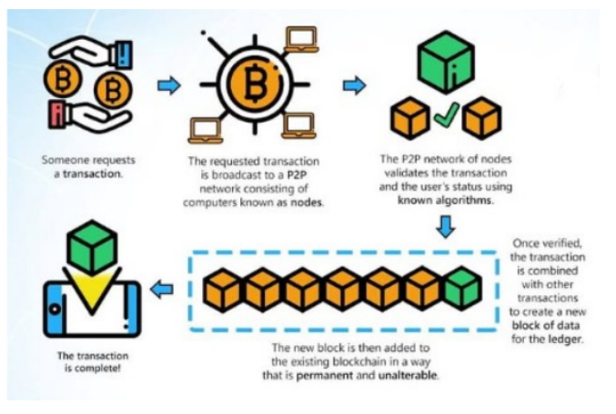

In sintesi, il ciclo vitale di una transazione su blockchain si articola in passaggi precisi: qualcuno richiede una transazione; questa viene trasmessa in broadcast a una rete P2P formata da computer chiamati "nodi". La rete di nodi valida la transazione e lo stato dell'utente utilizzando algoritmi noti. Una volta verificata, la transazione viene combinata con altre per creare un nuovo blocco di dati per il registro (ledger). Infine, il nuovo blocco viene aggiunto alla blockchain esistente in modo permanente e inalterabile, portando a compimento la transazione.

Per funzionare, la blockchain si affida a solide tecnologie di base. Le **firme digitali**, basate sulla crittografia a chiave pubblica, forniscono l'autenticazione necessaria. Le **funzioni crittografiche di hash**, che concatenano le transazioni di dati, garantiscono l'immutabilità e la resistenza alle manomissioni. La continua **replicazione**, ovvero il salvataggio di copie complete del registro ovunque, assicura l'altissima disponibilità del sistema. Infine, i protocolli di **consenso distribuito** tra le repliche, siano esse mutuamente fiduciose o meno, forniscono l'integrità e il controllo decentralizzato necessari per far progredire il sistema in modo concorde.

### Quando è Davvero Necessaria una Blockchain?

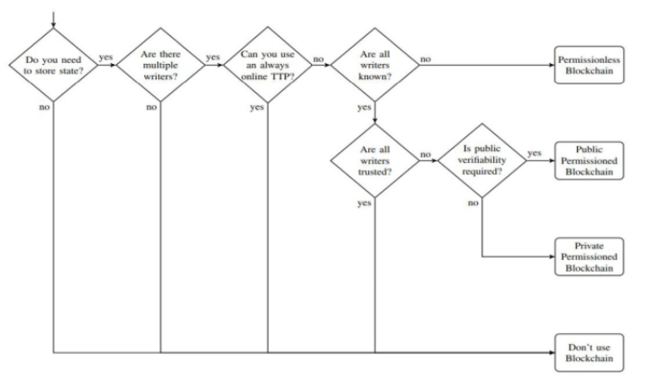

Una domanda classica nello sviluppo software è: perché usare una blockchain invece di un normale database?. Un'analisi rigorosa suggerisce di farsi diverse domande: abbiamo bisogno di memorizzare uno stato? Ci sono molteplici attori che devono scrivere dati?. Se la risposta a queste prime domande è no, non si dovrebbe usare una blockchain. Se invece dobbiamo archiviare dati da parte di più scrittori, dobbiamo chiederci se è possibile utilizzare una Terza Parte Fidata (TTP) sempre online. Se sì, la blockchain è superflua. Se non possiamo usare una TTP, dobbiamo valutare se tutti gli scrittori sono noti. Se non sono noti, la soluzione ideale è una **Permissionless Blockchain** (pubblica e senza autorizzazioni). Se invece gli scrittori sono noti, dobbiamo chiederci se sono tutti fidati. Sorprendentemente, se tutte le parti sono note e fidate, *non* si dovrebbe usare una blockchain, ma affidarsi a database standard. Molti dei casi d'uso proposti per le aziende cadono erroneamente in questa categoria! Se gli scrittori sono noti ma *non* fidati, dobbiamo infine capire se è richiesta una verificabilità pubblica. In caso affermativo, la scelta ricade su una **Public Permissioned Blockchain**; in caso negativo, su una **Private Permissioned Blockchain**. Va ribadito che se i partecipanti sono noti e fidati, ma necessitano solo di un registro immutabile, non serve la blockchain: è sufficiente usare database tradizionali potenziati con checksum crittografici, come AWS QLDB o Apache Kafka.

### Bitcoin: La "Madre" di Tutte le Blockchain

Il paradigma moderno è nato nell'ottobre del 2008, quando un individuo (o un gruppo) sotto lo pseudonimo di **Satoshi Nakamoto** (raggiungibile all'epoca tramite l'email satoshin@gmx.com e il sito www.bitcoin.org) ha pubblicato il paper fondativo: *"Bitcoin: A Peer-to-Peer Electronic Cash System"*. L'abstract del documento presentava una visione audace: una versione puramente peer-to-peer di denaro elettronico che avrebbe permesso di inviare pagamenti online direttamente da una parte all'altra, senza passare attraverso alcuna istituzione finanziaria. Sebbene le firme digitali fornissero parte della soluzione, Nakamoto notò che i benefici principali si perdevano se era ancora necessaria una terza parte fidata per prevenire il problema del "double-spending" (la doppia spesa degli stessi fondi). La soluzione proposta utilizzava una rete P2P che marca temporalmente (timestamp) le transazioni effettuandone l'hash in una catena continua.

Il contesto storico di questa invenzione è racchiuso indelebilmente nel codice stesso. Nel primissimo blocco della catena Bitcoin (la cosiddetta "coinbase transaction"), Satoshi ha inserito la seguente stringa: *"The Times 03/Jan/2009 Chancellor on brink of second bailout for banks"* (Il Cancelliere dello scacchiere Alistair Darling ipotizza un secondo salvataggio per le banche). Questo messaggio, oltre a certificare inequivocabilmente la data della prima transazione , rappresenta un manifesto politico: la volontà di porre fine al controllo esclusivo delle banche e dei governi sul denaro dei cittadini.

Bitcoin ha dimostrato che è possibile effettuare pagamenti diretti tra utenti senza un'entità finanziaria centralizzata che debba fare da garante, abbattendo così i costi di transazione. Questo ha realizzato la "visione cypherpunk": rivoluzionare il mondo costruendo protocolli crittografici sicuri. Ha fornito, inoltre, enormi stimoli per l'apprendimento di concetti tradizionali legati alla sicurezza informatica. Nel tempo, ci si è accorti che la tecnologia blockchain era un concetto più generale, utile per sviluppare svariate applicazioni sicure all'interno di ambienti "untrusted" (non fidati), influenzando profondamente molti processi aziendali e sociali. La naturale evoluzione di questo pensiero ha portato allo sviluppo di reti come Ethereum.

### L'Avvento di Ethereum e degli Smart Contract

Lanciato tramite un'operazione di crowdfunding che ha raccolto circa 20 milioni di dollari in un solo mese, **Ethereum** ha popolarizzato la grande visione di una criptovaluta "generalizzata". Questa rete introduce formalmente il concetto di **Smart Contract**: protocolli implementati e basati su una blockchain, programmabili attraverso un linguaggio "Turing completo" (ossia in grado di risolvere qualsiasi problema computazionale), chiamato Solidity. A differenza degli script presenti in Bitcoin, che posseggono un potere computazionale limitato, Ethereum tratta l'intera blockchain e i suoi nodi alla stregua di un unico, coerente computer globale replicato. In esso, l'intera macchina a stati, il suo codice e gli input/output vengono replicati ed eseguiti dai nodi in maniera perfettamente coerente.

Il codice di uno smart contract viene eseguito in maniera distribuita su tutti i nodi della rete, generando applicazioni decentralizzate globali in cui il consenso non è solo sui dati, ma funge da accordo effettivo sui *risultati* della computazione stessa. Per evitare abusi e attacchi di tipo "Denial of Service" causati da cicli infiniti in un linguaggio Turing completo, Ethereum impiega il meccanismo del **gas**, ovvero un costo computazionale addebitato per ogni singola operazione eseguita dal contratto.

Per illustrare il funzionamento pratico di uno smart contract, consideriamo l'uso nel settore assicurativo per i ritardi aerei. Immaginiamo che un passeggero, Bob, si trovi in aeroporto e il suo volo subisca un ritardo. Bob ha stipulato un'assicurazione che garantisce un rimborso in caso di volo ritardato. La compagnia assicurativa, in precedenza, ha rilasciato uno smart contract sulla blockchain di Ethereum, collegato a un database esterno che monitora costantemente lo stato dei voli. Non appena il sistema verifica e certifica un ritardo superiore a una certa soglia $X$ (minuti o ore) , lo smart contract scatta in totale autonomia, generando automaticamente il rimborso in criptovaluta. L'importo viene accreditato direttamente sul portafoglio digitale (wallet) di Bob, senza alcun intervento umano o burocratico intermedio.

L'ecosistema blockchain contemporaneo è vastissimo e non si limita più solo a Bitcoin ed Ethereum. Esso si dirama in molteplici settori: criptovalute (BTC, ETH, LTC...), fornitori di infrastrutture (come Polkadot, Tezos, Hyperledger, Cosmos), piattaforme di exchange (Coinbase, Binance, Kraken), e mercati innovativi per la gestione del rischio (Risk Marketplaces) o per i token non fungibili (NFT Marketplaces).

### Le Sfide Aperte: Il "Trilemma" della Blockchain

Nonostante l'entusiasmo, le reti P2P e le blockchain devono affrontare importanti sfide. In primo luogo, vi è il problema della **Privacy**. Poiché le transazioni sono visibili sul registro pubblico, le identità degli utenti possono talvolta essere dedotte tramite analisi on-chain, creando il rischio concreto di esporre dati sensibili. In secondo luogo, vi è il problema colossale della **Scalabilità**. La maggior parte delle piattaforme ha un volume di transazioni per secondo (throughput) estremamente limitato, che causa alta latenza e severa congestione della rete, oltre a richiedere requisiti energetici e di risorse hardware sempre crescenti.

Per comprendere la gravità del problema della scalabilità, basti confrontare il numero di Transazioni Per Secondo (TPS) dei sistemi blockchain rispetto a quelli della finanza tradizionale. Mentre il circuito Visa gestisce in media circa 24.000 TPS, una criptovaluta ad alta velocità come Ripple ne gestisce 1.500. Piattaforme centralizzate come PayPal elaborano 193 TPS. Spostandoci sulle blockchain pure, i numeri crollano drasticamente: Bitcoin Cash gestisce 60 TPS, Litecoin 56 TPS, Dash 48 TPS, Ethereum si ferma a sole 20 TPS, e Bitcoin processa appena 7 TPS.

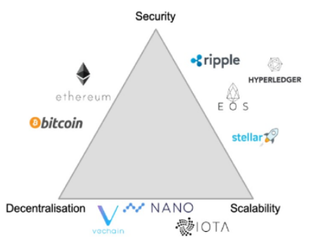

Queste problematiche portano al famoso **Blockchain Trilemma**, che descrive il delicato equilibrio tra Sicurezza, Decentralizzazione e Scalabilità. Reti come Bitcoin ed Ethereum massimizzano Sicurezza e Decentralizzazione, sacrificando drasticamente la Scalabilità. Progetti come Ripple (XRP) o Hyperledger optano per altissima Sicurezza e Scalabilità, ma a discapito della vera Decentralizzazione. Altri network emergenti, come IOTA o Nano, puntano su Decentralizzazione e Scalabilità. La grande sfida scientifica e ingegneristica attuale consiste proprio nel trovare una soluzione a questa equazione: come possiamo migliorare drasticamente la scalabilità senza ridurre il livello di sicurezza e mantenendo contemporaneamente un alto grado di decentralizzazione?.

---

### Glossario / Concetti Chiave

- **Smart Contract:** Protocolli implementati su blockchain, resi programmabili tramite linguaggi Turing completi (es. Solidity), che si eseguono in maniera autonoma, distribuita e coerente su tutti i nodi della rete una volta soddisfatte determinate condizioni pre-programmate.

- **Permissionless vs Permissioned Blockchain:** Le reti *Permissionless* sono pubbliche e aperte a partecipanti non fidati (es. Bitcoin), mentre le reti *Permissioned* (Private o Pubbliche) richiedono un'autorizzazione per accedere e scrivere sul registro, usate tipicamente in ambiti consortili o aziendali.

- **Double-Spending:** Il problema informatico relativo al denaro digitale per cui lo stesso "token" (la stessa unità di valore) potrebbe essere spesa due o più volte. La Blockchain risolve nativamente questo problema usando firme digitali combinate con una validazione P2P basata sul consenso e timestamping crittografico.

- **Blockchain Trilemma:** Il concetto teorico che afferma la difficoltà per un sistema decentralizzato di offrire contemporaneamente tre proprietà a massimi livelli: Sicurezza (resistenza agli attacchi), Decentralizzazione (nessun punto centrale di controllo) e Scalabilità (alta capacità di transazioni per secondo).

---

### Strumenti Crittografici Avanzati

Per superare i limiti innati delle reti decentralizzate, è richiesto l'impiego di strumenti crittografici di livello avanzato. Tra le strutture dati fondamentali troviamo i **Merkle Trees** e le loro varianti alternative, che permettono di verificare l'integrità di grandi moli di dati in maniera efficiente. A questi si affiancano le **Authenticated Data Structures (ADS)**, indispensabili per garantire la validità delle interrogazioni su dati esternalizzati. Per affrontare i nodi cruciali della privacy, la ricerca si sta spingendo verso l'utilizzo delle **Zero Knowledge Proofs (ZKP)** , della **Fully Homomorphic Encryption (FHE)** e delle **Multiparty Computations (MPC)**. Lo sviluppo e l'adozione di questi sofisticati strumenti matematici richiedono però fasi rigorose di testing , al fine di valutarne attentamente le prestazioni operative (performances) , l'usabilità pratica e l'effettiva integrazione all'interno dei protocolli blockchain preesistenti. 

### Il Dilemma della Privacy e le Soluzioni ZK e FHE

La privacy rappresenta una delle sfide più spinose dell'ecosistema blockchain. Bilanciare la riservatezza delle transazioni con la necessità di "auditabilità" (ovvero la capacità di revisione e controllo) è un'impresa estremamente ardua. Se da un lato l'incremento della privacy oscura inevitabilmente i dettagli delle transazioni , dall'altro una completa auditabilità richiede, per sua stessa natura, totale trasparenza. Questo conflitto è particolarmente evidente nei protocolli di **Decentralized Finance (DeFi)**. Tali protocolli, infatti, potrebbero necessitare di assoluta confidenzialità per eseguire transazioni, depositi, swap (scambi) e prestiti di asset senza rivelare "on-chain" gli importi scambiati o gli indirizzi degli utenti coinvolti , tutelando così gli utenti che non desiderano esporre pubblicamente le somme prese in prestito. Ciononostante, questi stessi protocolli DeFi esigono auditabilità: anche se alcuni dati rimangono privati, il protocollo deve poter verificare la correttezza delle operazioni , prevenendo in primis il fenomeno del double-spending e confermando la presenza delle corrette garanzie collaterali (collateralisation).

Le soluzioni matematiche a questo dilemma risiedono nelle ZKP e nella FHE. La **Fully Homomorphic Encryption (FHE)** è una tipologia di cifratura che consente di eseguire calcoli computazionali direttamente sui dati crittografati, senza aver alcun bisogno di decifrarli prima dell'elaborazione. Incredibilmente, i risultati di queste computazioni, una volta decifrati, corrispondono esattamente a ciò che si sarebbe ottenuto eseguendo i calcoli sul testo in chiaro (plaintext). L'idea chiave può essere riassunta nella frase: *"Posso eseguire calcoli sui tuoi dati segreti senza mai vedere il segreto stesso"*. Questo è cruciale nella blockchain per preservare la privacy durante le computazioni. Permette, ad esempio, di calcolare tassi di interesse (yield), erogazioni di prestiti (lending) o staking senza mai rivelare i saldi reali degli utenti. I protocolli possono così dimostrare la correttezza delle operazioni proteggendo al contempo i segreti. In un esempio pratico, un protocollo di prestito calcola l'eleggibilità di un utente per un finanziamento basandosi sui suoi saldi crittografati: l'importo esatto del saldo rimane totalmente privato, ma il sistema produce ugualmente risultati matematicamente inappuntabili.

Parallelamente, le **Zero Knowledge Proofs (ZKP)** consentono a una parte (chiamata *prover*, o dimostratore) di dimostrare la validità di una determinata affermazione a un'altra parte (il *verifier*, o verificatore) senza rivelare minimamente i dati sottostanti a tale affermazione. Le ZKP incrementano la privacy nascondendo dati sensibili pur preservando la correttezza dell'output. Esse abilitano l'esecuzione privata degli smart contract e mantengono la verificabilità pubblica senza alcuna esposizione di dati. Le applicazioni spaziano dalla dimostrazione della validità di una transazione omettendo importi e identità , fino alla verifica privata dell'identità sulla blockchain e alla creazione di piattaforme DeFi incentrate sulla privacy.

### Il Problema della Scalabilità e il Layer-2

Per affrontare i colli di bottiglia del network, l'industria sta massicciamente investendo in soluzioni di scalabilità architetturali. L'obiettivo primario di queste tecnologie è spostare il "carico pesante" (computazione e archiviazione dati) all'esterno della blockchain principale , utilizzando quest'ultima non più come processore, ma esclusivamente come "ancora di fiducia" (trust anchor) finale. L'ecosistema si divide in diverse categorie: i **Payment channels** (come la Lightning Network) , le **Sidechain** (come Polygon) , gli **Optimistic rollups** (che includono progetti come Boba Network, Optimism e Arbitrum) , e i **ZK-rollups** (come StarkNet, zkSync e Hermez). È di fondamentale importanza notare come, nel contesto dei ZK-rollups, la crittografia *Zero Knowledge* venga impiegata con un fine radicalmente diverso rispetto a quello della privacy: qui viene usata per dimostrare matematicamente "on-chain" la totale correttezza delle complesse computazioni avvenute "off-chain".

### Analisi dei Target e Casi d'Uso nel Mondo Reale

L'applicazione della tecnologia blockchain risulta vincente quando vi sono requisiti ben precisi: la necessità di un database condiviso, comune e di tipo append-only con capacità limitata ; la presenza di molteplici partecipanti caratterizzati da livelli variabili di reciproca fiducia ; e l'esigenza di far girare l'applicazione in modo puramente distribuito. È indicata inoltre per rimpiazzare processi complessi di "settlement" che altrimenti richiederebbero costose terze parti fidate , o per software che necessitano di totale integrità, autenticazione e non-ripudio delle azioni. Infine, si adatta ad applicazioni governate da regole rigide, inalterabili e facili da tradurre in codice informatico , dove si predilige la trasparenza assoluta a discapito della privacy totale.

Alla luce di questi requisiti, oggi possiamo osservare oltre 50 applicazioni concrete nel mondo reale. A livello governativo, **Essentia** sta sviluppando il primo hub logistico internazionale per il Governo Finlandese (Traffic Labs) , oltre a gestire sistemi di controllo alle frontiere nei Paesi Bassi (Border Control) e tracciamenti energetici in tempo reale tutelando la confidenzialità dei dati. Il progetto **Uport** sta rivoluzionando l'identificazione, facilitando la registrazione degli elettori in Svizzera. Nel settore finanziario e assicurativo, le banche giapponesi adottano il registro di **Ripple** per processare rapidamente pagamenti mobili , mentre colossi come **AIG** impiegano smart contract per ridurre i costi e aumentare la trasparenza polizzale. Per quanto concerne la gestione delle filiere e la Supply Chain, **IBM** e **Walmart** collaborano in Cina per monitorare la sicurezza alimentare , mentre nel settore marittimo **Maersk** sta attivamente testando logiche blockchain nella logistica. La tecnologia interviene anche a tutela dell'ambiente, con Essentia che protegge specie in via d'estinzione registrandone le attività , e IBM che usa la sua infrastruttura Hyperledger Fabric per tracciare i carbon offset in Cina.

L'impatto trasversale si evidenzia anche nel mondo aziendale: il servizio cloud Microsoft Azure offre accesso alla blockchain di Ethereum , mentre Google (Alphabet Inc.) sta sviluppando soluzioni white-label basate su registri distribuiti per i propri servizi cloud. Altri casi degni di nota includono la conservazione dei dati sanitari (Healthcare) pionierizzata da progetti come **MedRec** , l'archiviazione sicura dei titoli catastali in Georgia tramite la **National Agency of Public Registry** , e il lavoro del **Digital Currency Group** in partnership con AWS per potenziare la sicurezza dei database. Troviamo poi la vendita di immobili in Ucraina facilitata da **Propy** , il marketplace per l'advertising gestito dalla **NYIAX** , piattaforme per il giornalismo decentralizzato contro la censura, come dimostrato da **Civil** , e il monitoraggio dei rifiuti tramite RFID e blockchain condotto da **Waltonchain** in Cina. Infine, l'uso in ambito logistico specializzato: l'importazione di soia da parte di **Louis Dreyfus Co** , il tracciamento dei diamanti dal colosso **De Beers Group** , l'autenticazione delle opere d'arte per sradicare la contraffazione , l'archiviazione dei filmati di sicurezza da parte del **Department of Homeland Security** statunitense , strategie per rilanciare il turismo in Hawaii tramite valute digitali , l'archiviazione delle fatture elettroniche cinesi su **Miaocai Network** , la certificazione dei consumi energetici della National Energy Commission cilena , il tracciamento delle riparazioni ferroviarie per la russa **Novotrans** , e la piattaforma musicale **Arbit**, spinta dal batterista Matt Sorum, per la giusta retribuzione degli artisti. Da non dimenticare, inoltre, l'impiego per garantire che il pescato ittico sia di provenienza legale (Fishing).

### Tokenizzazione e Finanza Decentralizzata (DeFi)

L'introduzione dei token ha radicalmente spezzato lo status-quo finanziario in cui solo il governo emette moneta definendone le procedure , le banche centrali validano arbitrariamente le transazioni , e la moneta fiat non è più ancorata a beni fisici come l'oro. La blockchain, al contrario, lega intrinsecamente l'offerta di valuta a un bene virtuale limitato ("cryptographic bounded") , registrando e verificando i trasferimenti per scongiurare definitivamente il *double spending*. Oltre ai classici token fungibili, assistiamo all'esplosione dei **Token Non Fungibili (NFT)**. Tradizionalmente, un'opera d'arte sotto forma di file digitale (come un `.jpeg`) può essere copiata e distribuita infinitamente, rendendo quasi impossibile trovare un solido modello di business, anche per artisti di altissimo livello. Gli NFT risolvono il problema permettendo di provare matematicamente chi sia il vero proprietario dell'asset. 

In ambito puramente finanziario, la **Decentralized Finance (DeFi)** ha prodotto i **Decentralized Exchange (DEX)**, piattaforme costruite solitamente su Ethereum che consentono il trading P2P direttamente sulla blockchain. Grazie agli smart contract, queste piattaforme operano con una trasparenza ineguagliabile e garantiscono un'esecuzione definita "trustless" (ovvero, che non richiede cieca fiducia in intermediari). A livello tecnico, introducono l'innovativo **Automated Market Making (AMM)**: anziché utilizzare i tradizionali registri di ordini di compravendita (order books), gli AMM si avvalgono di enormi riserve di liquidità (liquidity pools) per facilitare e bilanciare matematicamente gli scambi. Queste piattaforme offrono un accesso **Permissionless** (senza autorizzazioni): chiunque, in qualsiasi momento, può fare trading o fornire liquidità senza dover richiedere approvazioni ad autorità terze. **Uniswap** ne rappresenta l'esempio cardine, servendo da infrastruttura vitale per l'intero ecosistema. Nelle logiche di Uniswap, utenti come "Alice" o "Bob" scambiano i propri asset relazionandosi direttamente con un "Pool contract" algoritmico. D'altro canto, chi decide di diventare un *Liquidity Provider* versa i propri fondi nel contratto e riceve come certificato un NFT appena "mintato" (coniato). Specificamente, a partire da Uniswap V3, le posizioni di liquidità sono rappresentate come NFT LP; ciascun NFT, e quindi ogni posizione, è soggetta a un set distinto e altamente personalizzabile di parametri che ne determineranno il valore esatto e le relative ricompense finanziarie nel tempo. 

### Identità Auto-Sovrana (Self-Sovereign Identity)

Un'altra diramazione vitale della blockchain riguarda la gestione dell'identità personale. La **Self-Sovereign Identity (SSI)** ribalta il paradigma classico restituendo il controllo all'individuo. Le sue caratteristiche cardinali ruotano attorno al **Controllo** esclusivo del proprio ID da parte dell'utente. Vige il principio di **Minimalismo** per la privacy: si divulga unicamente la quantità minima e indispensabile di dati richiesti per espletare un determinato compito. Questa architettura garantisce **Sicurezza** e confidenzialità crittografica , rendendo l'identità **Resiliente** a forme di censura o cancellazione forzata , e intrinsecamente **Persistente** (nessun attore centrale può "sottrarre" l'identità all'utente). Completano il quadro la stretta necessità di **Consenso** attivo dell'utente per l'utilizzo dell'ID e la sua **Portabilità**, intesa come massima interoperabilità tra sistemi diversi. 

### Provenienza e Supply Chain: Analisi dei Dati

La blockchain eccelle in particolare nel monitoraggio e nella certificazione incondizionata delle catene di approvvigionamento (supply chain).
Si consideri uno scenario ironico ma verosimile: Bob trasporta del gelato con il suo camion dalla fabbrica di Carol fino alla cliente Alice. Il prodotto giunge a destinazione irreparabilmente sciolto. Bob si difende fornendo testimonianze incoerenti: sostiene di non aver mai trasportato quello specifico prodotto , o che il gelato era già sciolto quando lo ha ritirato da Carol , o ancora che la merce era in perfette condizioni al momento della consegna. Senza un sistema di tracciamento incorruttibile, stabilire la verità e la catena di custodia è un inferno legale e logistico. 

Nel mondo reale, le multinazionali hanno già interiorizzato la lezione. **Walmart**, ad esempio, ha collaborato attivamente con IBM sviluppando un'imponente infrastruttura basata su tecnologia Hyperledger. Il loro sistema traccia rigidamente ogni passaggio logistico: l'azienda agricola (Farm) , l'imballaggio (Packing House) , il trasporto , il passaggio di dogana per importazione/esportazione (Border Crossing) , il centro di smistamento (Distribution Center) , e infine il punto vendita (Store) in modo che il cliente finale (Customer) sia garantito. Durante l'intero tragitto vengono registrate incessantemente date di scadenza, temperature di stoccaggio, dettagli di spedizione e parametri acquisiti direttamente da sensori hardware sparsi sui pallet e nei camion, impedendo qualsiasi adulterazione dei dati e rendendo istantanea l'individuazione di partite avariate.

Un altro caso di eccellenza è il monitoraggio dell'industria del pescato (Tuna Supply-Chain Traceability). Lo scopo del sistema, ingegnerizzato tramite la blockchain **Stratumn** e audito dall'ente ispettivo **Bureau Veritas (BV Check)** , è permettere ai ristoranti di visionare e verificare crittograficamente l'intera catena di custodia del pesce che servono a tavola. Dei sensori vengono applicati direttamente sui tonni pescati per registrare costantemente la posizione geografica, le temperature del ghiaccio e l'umidità delle celle (consultabili tramite video dimostrativi online, come al link https://youtu.be/Buw3g8oNG74). Il percorso, accuratamente mappato e sigillato digitalmente, inizia sulla nave da pesca (Fishing Vessel) , dove l'osservazione elettronica, i piani di stivaggio (Stowage diagramme sheet) e i diari di bordo nautici (Log-book/IMO) vengono fusi sul registro distribuito. Segue lo scarico (Discharge) e il controllo rigoroso del peso sui mezzi di trasporto (Tally sheet). Da lì, il tonno passa alle celle frigorifere (Cold Storage) dove vengono generate ricevute e fatture inalterabili , quindi alla lavorazione (Processing) in cui il pesce in scatola o congelato è sottoposto a severi controlli sul prodotto finale , comprese indagini di laboratorio sul DNA. Il ciclo termina in sicurezza per il consumatore superando il trasporto e giungendo al rivenditore (Retailer) munito di ricevute perfette. [INSERIRE IMMAGINE: Schema isonometrico dettagliato del progetto 'Tuna Supply-Chain Traceability', con le icone dell'ispezione di Bureau Veritas e le tappe fisiche del pesce, dal mare aperto fino al test dell'app sullo smartphone del cliente finale]

Oltre ai beni materiali, l'attenzione si è spostata anche sulla tutela della Proprietà Intellettuale (Intellectual Property). Un autore digitale può eseguire l'hash dei propri contenuti unendo le informazioni crittografiche alla propria identità ed eseguire il commit (salvataggio) della stringa risultante sulla blockchain. Se nessun altro utente al mondo può dimostrare matematicamente di aver pubblicato quel preciso hash prima di quel timestamp temporale, l'autore ha in mano la prova inconfutabile della proprietà dell'opera. Questo approccio è notevolmente più economico e rapido rispetto alla burocrazia di un ufficio brevetti governativo, consentendo peraltro di non dover rivelare pubblicamente alcun dettaglio specifico dell'oggetto o dell'opera. Un articolo illustrativo intitolato *"Using Blockchain to Protect Artists and Manage Intellectual Property Law"*, redatto da Marie Gonzalez (giugno 24, lettura stimata 5 minuti) per la piattaforma **GoChain**, spiega proprio come questa stia offrendo la tecnologia blockchain come strumento principe per la gestione decentralizzata dei diritti IP. [INSERIRE IMMAGINE: Screenshot dell'interfaccia web di un articolo sulla piattaforma GoChain scritto da Marie Gonzalez sull'uso della Blockchain per proteggere i diritti degli artisti e la proprietà intellettuale]

### Conclusioni: Il Futuro e le Sfide Scientifiche del P2P

Giunti a termine del percorso didattico, è tempo di tirare le somme. I vantaggi fondamentali delle architetture P2P, in ottica lato utente, includono la formidabile capacità di sfruttare risorse computazionali "in eccesso" altrimenti sprecate. Cicli di CPU inattivi, spazi di archiviazione vuoti su hard disk e larghezza di banda non utilizzata possono essere donati alla rete ottenendo in cambio risorse di pari utilità, l'accesso a servizi privilegiati o la mera partecipazione a social network. Inoltre, la struttura garantisce in modo assoluto una spina dorsale di fiducia tra gli attori all'interno di un ambiente fondamentalmente "trustless". Lato macro-comunitario, il principale punto di forza è la sua magica **proprietà auto-scalante** (self scaling property): ogni volta che aumenta il volume dei partecipanti, crescono per forza di cose le risorse globali del sistema, incrementando spontaneamente la sua capacità tecnica di servire un sempre maggior numero di richieste. Sul lato di chi offre o vende un servizio online (seller), il network decentralizzato assicura una fortissima diminuzione dei costi d'impianto. Infatti, implementare una medesima piattaforma ricorrendo al classico paradigma client/server richiederebbe investimenti milionari in gigantesche Server Farm dotate di altissima connettività (per scongiurare il crollo del sito sotto il peso di milioni di utenti), oltre all'obbligatoria replica fisica dei server in svariate nazioni per garantire la fault tolerance e all'assunzione di squadre tecniche per la manutenzione 24 ore su 24, 7 giorni su 7.

Nonostante i chiari vantaggi, il futuro di queste tecnologie impone enormi sfide pratiche. Il successo a lungo termine di qualsivoglia applicazione P2P è subordinato alla creazione di una formidabile **"massa critica"** di utenti; occorre, insomma, raggiungere un altissimo livello di partecipazione generale affinché il network possa auto-sostenersi ed essere funzionale. Storicamente, per i primissimi e rudimentali sistemi P2P, è bastata la mera novità assoluta dell'applicazione per permettere il raggiungimento rapido di questa massa critica : per il file sharing, l'incredibile spinta propulsiva risiedeva nell'ottenere contenuti gratuiti e immensi ; per le blockchain primitive era l'allettante idea delle criptovalute come nuovo asset incredibilmente redditizio ; e per l'era dei token smart contract, la novità costituiva in un metodo inesplorato e ultra-semplificato per scambiare assett speculativi senza intermediari. Ciononostante, affinché i *nuovi* sistemi software P2P possano sfondare, non basta più basarsi esclusivamente su una buona ingegnerizzazione tecnica del software. L'ingegneria deve essere affiancata da un fortissimo fattore di attrazione e usabilità per il grande pubblico , supportata dalla definizione coraggiosa di business model totalmente inediti e inesplorati fino ad oggi.

La progettazione tecnica in sé si è trasformata in una vastissima sfida scientifica accademica che costringe alla risoluzione di problematiche informatiche del tutto nuove e mai affrontate in decenni passati. Le metodologie canoniche di ingegneria del software, studiate per lo sviluppo di sistemi distribuiti della "vecchia generazione", non possono semplicemente essere copiate e sfruttate per la blockchain. Questo perché il nostro campo di gioco opera su ordini di grandezza totalmente alieni: nei sistemi classici l'interconnessione si limitava a un centinaio di macchine; nel P2P stiamo parlando della sincronizzazione violenta di milioni di nodi sparsi in ogni angolo del globo. Di conseguenza, gli algoritmi di rete classici scritti nei libri di testo letteralmente "non scalano" in reti che possiedono simili densità geografiche. Bisogna inoltre far fronte ad una realtà crudele: l'abbandono della rete (churn) o il fallimento hardware imprevisto di un nodo utente non sono eventi eccezionali, ma la normale amministrazione minuto per minuto. Confrontarsi con reti di questa dimensione mostruosa ed esplosiva richiede la progettazione da zero di nuovi framework metodologici: vi è la necessità assoluta di impiegare la complessa Teoria dei Giochi e strategie fondate sull'equilibrio di Nash per gestire la cooperazione ostile o puramente egoistica dei partecipanti (peer cooperation). Serve inventare da zero e applicare massicciamente tecniche crittografiche inedite e molto più performanti per proteggere sia i dati sia il carico computazionale (come il FHE o le ZKP). È fondamentale sognare e coniare nuovi, stabili ed efficienti algoritmi e modelli di consenso distribuito capaci di tollerare guasti asincroni di rete planetari (BFT tolerance). Non da ultimo, gli analisti dei dati avranno l'obbligo metodologico di implementare software altamente sofisticati e strumenti per l'analisi dei sistemi complessi al solo scopo di riuscire a monitorare questi mastodontici e vitali "computer mondiali".

---

### Glossario / Concetti Chiave

- **Fully Homomorphic Encryption (FHE):** Complessa tecnica crittografica che consente di effettuare calcoli e manipolazioni matematiche su un set di dati rimanendo nel loro stato cifrato, proteggendo la riservatezza totale pur producendo output verificabili.

- **Zero Knowledge Proofs (ZKP):** Metodo matematico attraverso cui un dimostratore può provare a un verificatore di possedere un'informazione (o la validità formale di essa) senza rivelare in alcun modo l'informazione in chiaro. Utilizzata massivamente per la privacy e la validazione "on-chain" nei Layer-2.

- **Layer-2 e Rollups:** Insieme vario di tecnologie e protocolli di rete (sidechain, payment channel, optimistic e zk-rollups) finalizzati a risolvere il problema critico di scalabilità spostando il carico di calcolo "off-chain", mantenendo la mainnet come ultima istanza di trust e sicurezza.

- **Self-Sovereign Identity (SSI):** Un radicale paradigma di gestione sicura e minimalista dell'identità personale che garantisce controllo utente ed estrema resilienza contro censura ed esfiltrazione di dati, fondandosi sul concetto di architettura e crittografia blockchain trustless.

- **Decentralized Finance (DeFi) e AMM:** L'ecosistema di strumenti, marketplace o exchange (DEX) basati su algoritmi P2P open source come gli Automated Market Makers, i quali usano contratti intelligenti e i fondi dei Liquidity Provider al posto dei classici "order book" bancari per regolare lo scambio paritario e non custodito dei token o degli NFT.

---

# Lezione 2: **Sistemi P2P, Overlay e Architetture Non Strutturate**

### Dai Sistemi Semi-Decentralizzati a quelli Completamente Decentralizzati

L'avvento dei sistemi semi-decentralizzati ha segnato una svolta epocale nell'architettura delle reti distribuite. Nel 2001, il software Napster ha dimostrato al mondo intero come fosse possibile fornire accesso a una quantità di dati su scala globale, paragonabile a quella gestita da Google in quello stesso periodo, ma impiegando un numero drasticamente inferiore di server. Per rendere l'idea della proporzione, a fronte dei circa 15.000 server utilizzati all'epoca da Google, l'intero ecosistema di Napster operava appoggiandosi a soli 100 server circa. Questo risultato sorprendente è stato possibile grazie a un'intuizione basilare ma geniale: "esternalizzare agli utenti" le operazioni informaticamente più intensive, ovvero l'archiviazione e lo scambio materiale dei file. In questo paradigma pionieristico, gran parte del servizio viene fornita dagli utenti stessi in modo collaborativo. I server centrali di Napster venivano infatti utilizzati esclusivamente per localizzare la directory degli utenti in possesso del file richiesto; questa rappresentava la parte nettamente meno dispendiosa dell'intero servizio. Di conseguenza, la netta distinzione classica tra i server (le macchine che forniscono il servizio) e i client (le macchine che lo consumano) risultava per la prima volta sfumata, portando a rinominare gli utenti con il termine "peer" (nodi paritari) e a battezzare i sistemi risultanti come "sistemi peer-to-peer".

Napster si è rapidamente affermato come l'applicazione di punta su scala globale per la condivisione di file musicali, raggiungendo numeri impressionanti nel febbraio del 2001: 26,4 milioni di utenti attivi e un bacino di 10 TeraByte di dati condivisi, pari a circa 2 milioni di canzoni, con una media di 220 brani per ciascun utente. L'esperienza tecnologica di Napster ha impartito importanti lezioni alla comunità informatica. Tra i suoi maggiori punti di forza spiccava l'enorme potenziale della condivisione delle risorse, in cui ogni nodo "paga" la propria partecipazione alla rete fornendo accesso alle proprie risorse fisiche (come spazio su disco e banda di rete), alla propria conoscenza (sotto forma di metadati e annotazioni) e ovviamente ai propri contenuti (i file stessi). All'interno di tale ecosistema, ogni nodo partecipante agisce simultaneamente sia da client che da server, assumendo il ruolo ibrido di "**servent**" e permettendo la nascita di un sistema informativo globale senza la necessità di immensi investimenti iniziali in hardware. Questa profonda decentralizzazione dei costi e dell'amministrazione permette di superare e aggirare agilmente i classici colli di bottiglia legati alle risorse di un singolo server.

Nonostante l'innovazione, il modello di Napster celava ancora significative debolezze: la presenza di un server centrale, seppur alleggerito del trasferimento dati, costituiva un pericoloso singolo punto di fallimento (single point of failure) e richiedeva un'entità unica per il controllo del sistema, creando un indiscutibile collo di bottiglia a livello di architettura e progettazione. Inoltre, aver facilitato la copia di materiale protetto da copyright ha inevitabilmente reso Napster il bersaglio di numerose e fatali azioni legali. Da qui, l'evoluzione tecnologica ha spinto verso una tendenza chiara: aumentare ulteriormente il grado di condivisione delle risorse orientandosi verso la totale decentralizzazione.

La risposta tecnologica ai limiti strutturali e legali di Napster è giunta con la teorizzazione e la creazione dei sistemi completamente decentralizzati, il cui esempio paradigmatico è stato Gnutella.

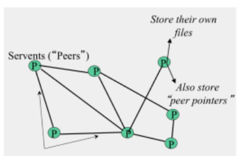

In modo del tutto analogo a Napster, anche in Gnutella i file musicali sono memorizzati e residenti direttamente presso i computer degli utenti del sistema. Tuttavia, a differenza del suo predecessore, non esiste assolutamente alcun server centrale adibito alla localizzazione dei file; il che significa la totale assenza di un indice centrale di ricerca. Per sopperire a questa mancanza, i peer stabiliscono tra loro connessioni dirette e non transitorie, le quali vengono utilizzate unicamente per veicolare le query di ricerca e non per il download effettivo dei contenuti. L'insieme di queste interconnessioni logiche tra pari definisce a tutti gli effetti una rete **overlay**. I vantaggi innegabili di questo approccio "Fully Decentralized" risiedono nella completa assenza di infrastrutture dedicate e di amministrazione centralizzata, eliminando alla radice la minaccia del singolo punto di fallimento. Di contro, queste architetture affrontano debolezze intrinseche notevoli, tra cui la generazione di un elevatissimo traffico di rete per l'inoltro delle ricerche, la mancanza di un sistema di ricerca strutturato ed efficiente, e il gravoso problema del "free-riding", ovvero quegli utenti passivi che sfruttano la rete per scaricare senza mai contribuire condividendo le proprie risorse.

### Il Concetto e l'Implementazione delle Reti Overlay

Per comprendere a fondo i sistemi P2P, è necessario definire la rete overlay: si tratta essenzialmente di una rete logica, costruita idealmente al di sopra di una preesistente rete fisica. I collegamenti in questo overlay si comportano come dei "tunnel" virtuali che attraversano la rete fisica sottostante in modo trasparente. Ne consegue che non tutti i collegamenti logici di un overlay corrispondono a collegamenti fisici diretti. Un singolo collegamento logico tra due peer può infatti corrispondere a un vasto insieme di collegamenti fisici e può richiedere l'attraversamento di una lunga serie di router hardware.

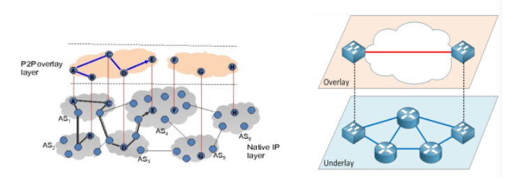

È fondamentale sottolineare come molteplici e differenti reti overlay possano coesistere simultaneamente sulla medesima rete fisica sottostante; ciascuna di esse fornisce un proprio servizio particolare e specializzato, il quale non è reso nativamente disponibile dall'infrastruttura di base. I nodi che compongono l'overlay sono spesso normali host terminali (end hosts) che si assumono l'onere di agire come nodi intermedi, instradando e inoltrando il traffico per fornire un servizio alla collettività della rete, come ad esempio l'accesso a un file. Nella pratica moderna, la stragrande maggioranza delle reti overlay P2P è costruita operando al livello applicativo (application layer), appoggiandosi alla solidità della suite di protocolli di rete TCP/IP. Questo implica formalmente che le reti overlay P2P sono, a tutti gli effetti pratici, delle astrazioni di livello applicativo. Sebbene per il proprio funzionamento l'overlay si affidi e si appoggi imprescindibilmente agli strati sottostanti (underlays) per le funzionalità di rete più basilari come il routing e il forwarding dei bit, esso è in grado di offrire nuove funzionalità proprietarie di instradamento logico senza richiedere alcuna costosa o complessa modifica ai router fisici.

Il comportamento coordinato di questa infrastruttura applicativa è strettamente regolato dal protocollo P2P, il quale ha l'onere di definire con esattezza l'insieme dei messaggi che i peer si scambiano, oltre al loro formato preciso e alla loro semantica. Tale protocollo opera e viene definito esclusivamente sopra l'astrazione dell'overlay P2P e presenta caratteristiche tecniche comuni a quasi tutte le varianti di mercato. In primo luogo, questi protocolli definiscono una specifica strategia di instradamento (routing logico) situata al livello applicativo dello stack TCP/IP. In secondo luogo, l'identificazione di ciascun peer avviene tramite l'assegnazione di identificatori univoci, i quali vengono generalmente calcolati e garantiti attraverso l'uso di una funzione matematica di hash. Infine, esattamente come avviene per i pacchetti standard al livello IP, i messaggi del protocollo P2P sono caratterizzati da un'intestazione (header) per le informazioni di controllo e da un carico utile (payload) per i dati effettivi.

In base alle geometrie e alle regole che ne governano la topologia, gli overlay P2P vengono tipicamente classificati in tre grandi famiglie: gli Overlay Non Strutturati, gli Overlay Strutturati (basati sull'utilizzo di Distributed Hash Tables o DHT) e gli Overlay Ibridi (che introducono la figura del SuperPeer per ottimizzare le prestazioni).

### Architetture Non Strutturate: Topologia, Bootstrap e Scenari Operativi

Negli overlay non strutturati, come suggerisce il nome stesso, i peer sono connessi tra loro in modo del tutto arbitrario e casuale, generando una topologia di rete reticolare priva di qualsiasi regolarità architetturale. In queste specifiche reti, gli algoritmi di ricerca (look-up) non potendosi basare su un indirizzamento geografico o logico, si affidano a tecniche espansive e probabilistiche, quali il flooding (inondazione), l'expanding ring (l'anello in espansione) o il random walk (le camminate casuali). I vantaggi tecnici di questa architettura caotica risiedono principalmente nella grande facilità di scrittura del codice sorgente e di manutenzione del sistema, accompagnati da una fortissima resilienza generale ai guasti, dato che la caduta di singoli nodi non compromette percorsi predeterminati. Tra gli svantaggi principali, però, pesano un elevatissimo costo per le operazioni di ricerca, il quale cresce in modo preoccupantemente lineare rispetto a $n$ (dove $n$ rappresenta il numero totale di nodi presenti nella rete), condannando l'architettura a una scalabilità estremamente bassa. Esempi storici e implementazioni moderne di queste reti abbracciano le versioni pure di Gnutella (fino alla v0.4, prima di evolversi in un modello gerarchico nella 0.6), Kazaa, il protocollo di scambio di base di BitTorrent (che oggi utilizza parallelamente anche DHT) e, non ultima, l'infrastruttura di rete alla base di BitCoin.

Prendendo come caso di studio esemplare Gnutella, la rete si poggia in modo essenziale sul trasferimento dei file veri e propri tramite il tradizionale protocollo HTTP, mentre l'onere della ricerca ricade su delle query che si diffondono a macchia d'olio tra i nodi, senza potersi avvalere di alcuna informazione indicizzata. Siccome le connessioni tra i peer vengono stabilite totalmente a caso, di fronte a questo caotico scenario applicativo si pongono due interrogativi tecnologici fondamentali: come può un nuovo nodo effettuare il "bootstrap" (ovvero il proprio primo ingresso) sulla rete? E, in secondo luogo, come si fa a trovare con certezza un contenuto senza disporre di alcun indice centrale da consultare?.

Per risolvere la prima problematica, ovvero il bootstrap, un nuovo nodo che desidera unirsi al sistema si affida interrogando dei server DNS noti e pubblici, i quali memorizzano e restituiscono gli indirizzi IP di un insieme predefinito di "peer stabili". Ottenuto questo punto di appoggio, il nodo esegue localmente uno script progettato per interagire e dialogare con questi peer veterani. La conoscenza della rete (la cache) del client viene così aggiornata in maniera dinamica e automatica; questa memoria interna conserva accuratamente gli indirizzi IP dei peer contattati durante la sessione di rete in corso, nonché in quelle precedenti. Per non rendere obsolete le proprie informazioni, la cache viene infine mantenuta aggiornata attraverso una comunicazione in background di tipo "gossiping" (un chiacchiericcio costante) con i peer adiacenti.

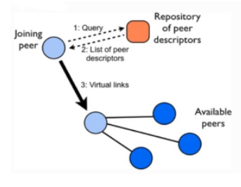

Da un punto di vista procedurale, lo scenario operativo in una rete P2P non strutturata si articola in una chiara sequenza di fasi. Il **Passo 0** consiste nel processo di join per unirsi alla rete, come appena descritto. Il **Passo 1** mira a determinare e tracciare attivamente "chi è attualmente presente sulla rete". Per fare ciò in assenza di un registro, il peer invia in broadcast un pacchetto di "ping" per annunciare formalmente la propria presenza globale; di rimando, gli altri peer che ricevono il segnale rispondono con un pacchetto di "pong", che contiene a sua volta informazioni utili sul peer che lo ha generato. In aggiunta, per diffondere la conoscenza, i nodi provvedono a inoltrare il "ping" originale a tutti gli altri peer a cui sono connessi. Giunti al **Passo 2**, prende luogo la ricerca vera e propria: attraverso la creazione e l'invio di un pacchetto "query", il peer richiede formalmente un determinato contenuto agli altri nodi circostanti (si pensi a una domanda del tipo: "Hai nei tuoi dischi un file che corrisponde esattamente alla stringa 'Back to Black'?"). I peer interpellati verificano i propri database locali alla ricerca di corrispondenze: se trovano il file richiesto inviano una risposta positiva, in caso contrario agiscono da ponti e inoltrano il pacchetto a tutti i peer a cui sono connessi. Per non saturare la rete all'infinito, questo rimpallo esplorativo continua unicamente per un numero di salti rigorosamente limitato da un parametro tecnico chiamato TTL (Time-To-Live). Al termine della ricerca, si giunge al **Passo 3**, corrispondente alla fase di download: in questo step, il trasferimento del contenuto binario avviene abbandonando l'overlay di ricerca e stabilendo connessioni dirette tra il nodo richiedente e quello offerente, prelevando il file tramite l'utilizzo del consolidato metodo GET del protocollo HTTP.

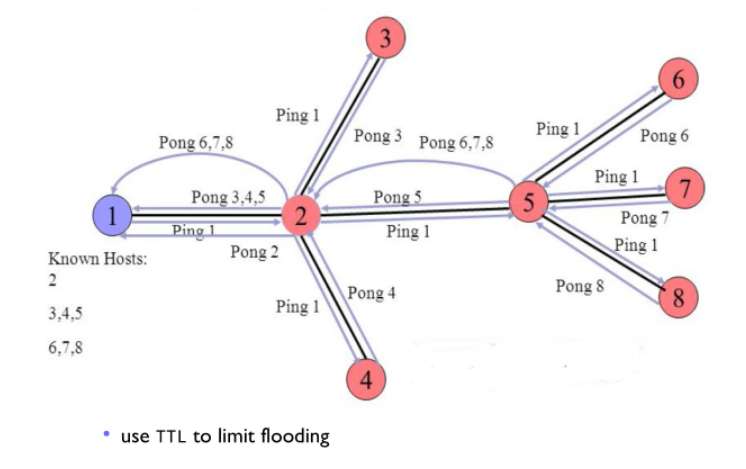

### Meccanismi di Ricerca: Il Flooding

L'algoritmo di ricerca più basilare ed emblematico nelle reti P2P non strutturate è senza dubbio il **flooding** (ovvero l'inondazione della rete mediante messaggi). Quando un nodo sorgente avvia una ricerca, esso semplicemente invia la propria query a tutti i suoi vicini immediati; quest'ultimi, obbedendo alla regola dell'algoritmo, la inoltrano ciecamente ai propri vicini, propagando la richiesta in modo esponenziale nell'intera rete. Come intuibile, per evitare che un simile meccanismo saturi i collegamenti facendo circolare messaggi all'infinito all'interno di eventuali percorsi chiusi, i messaggi di query sono muniti di un tempo di vita (TTL) limitato, e la rete impiega un sistema per rilevare tempestivamente i cicli viziosi, assegnando un identificatore assolutamente univoco a ciascun messaggio generato. Nel momento in cui il pacchetto inonda la rete e incrocia il file desiderato, il contenuto può essere finalmente trasferito in via diretta attraverso una robusta connessione HTTP.

Più in dettaglio, la variante di flooding supportata e potenziata dal TTL impone che una query venga inviata a tutti i vicini di un nodo, con l'unica e ovvia eccezione del nodo esatto dal quale la query è stata appena ricevuta. Questo espediente limita drasticamente l'orizzonte d'azione e lo scope geografico logico della query stessa. Pur essendo impiegato da molte reti P2P storiche estremamente popolari, questo metodo sconta un duplice difetto cronico: da una parte la scalabilità risulta fortemente ridotta, dall'altra l'effettiva scoperta e l'individuazione del contenuto non sono mai assicurate, portando a frequenti falsi negativi (situazioni in cui il file esiste, ma la query esaurisce il suo TTL prima di raggiungerlo).

Da un punto di vista strettamente algoritmico, la logica di inoltro (spesso schematizzata come `FloodForward(Query q, Source p)`) prevede i seguenti passaggi procedurali: il nodo verifica preliminarmente se la specifica query è già stata processata in precedenza esaminando l'identificatore memorizzato nello storico (il controllo dell'ID in una cache di `oldIdsQ`). Se il pacchetto risulta già visto, viene semplicemente scartato ed eliminato. In caso contrario, il nodo ricorda e aggiorna il proprio database inserendo l'ID della nuova query. Subito dopo, si prende carico di decrementare il parametro TTL matematicamente di 1 unità e controlla se la soglia di scadenza è stata raggiunta (ossia se il TTL è diventato uguale a zero). Qualora il TTL sia esaurito, la query, per quanto valida, viene scartata per proteggere la rete; se invece risulta ancora dotato di vita, il nodo procede a inoltrare la query, con il nuovo TTL aggiornato, a tutti i vicini rimanenti, escludendo il nodo mittente *p* originario. Per instradare i successivi messaggi di risposta al mittente, la rete fa affidamento a un routing a ritroso (Backward Routing), percorrendo le briciole di pane delle connessioni non transitorie in senso inverso.

Ricapitolando, il paradigma basato sul flooding si impone quasi per inerzia in tutti quei contesti in cui non esista alcuna regola rigorosa che definisca *a priori* in quali settori o in quali nodi i dati debbano essere memorizzati, né tantomeno quali nodi debbano essere fisicamente vicini tra loro. Analiticamente, l'operazione può essere assimilata a una classica ricerca in ampiezza su grafo (Breadth First Search o BFS) esplorante la rete overlay, con l'unica ma sostanziale limitazione dei salti massimi consentiti, imposta come tetto globale dal TTL. Tale approccio garantisce di trovare il numero massimo teorico di risultati positivi circoscritti in un anello logico che ha come centro il nodo che ha originato la query e come raggio esatto il valore numerico del TTL. Purtroppo, la brutalità del metodo si traduce in una profonda incapacità di scalare al crescere della rete, in quanto genera e pompa sui cavi un numero impressionante di messaggi, di cui la stragrande maggioranza si rivela essere null'altro che inutile duplicazione.

Un ambito di applicazione straordinariamente moderno in cui il flooding viene sfruttato intensivamente è la rete decentralizzata di Bitcoin. In questo dominio il flooding non è circoscritto alle mere procedure di ricerca, ma costituisce il pilastro cardine utilizzato per propagare e inondare le transazioni finanziarie all'interno della rete P2P che fa da substrato alla blockchain. In un simile scenario distribuito e de-fiduciarizzato (trustless), il mantenimento certosino della coerenza dei registri condivisi (ledger) tra tutti i nodi si erge come la problematica e l'obiettivo principale del sistema.

### Approcci Alternativi: Expanding Ring e Iterative Deepening

Proprio per porre rimedio ai disastrosi problemi di sovraccarico del flooding originale, la comunità accademica ha partorito molteplici e variegati schemi alternativi. Questa nutrita selva di algoritmi può essere macro-classificata in due filoni principali: i metodi basati sull'esplorazione in ampiezza (BFS - Breadth First Search) e i metodi basati sull'esplorazione in profondità (DFS - Depth First Search). Il primo gruppo annovera tecniche rinomate come l'Iterative Deepening / Expanding Ring, il k-walker random walk, il two-level k-walker random walk, il directed BFS e il modified random BFS. Il secondo filone, focalizzato sui percorsi in profondità, contempla metodologie basate sulla costruzione e consultazione di indici di vario tipo: la ricerca basata su indici locali, la ricerca guidata da indici di instradamento (routing indices) e la raffinata ricerca basata sui filtri di Bloom attenuati.

All'interno delle strategie puramente BFS, una soluzione ingegnosa e molto diffusa è quella dell'**Expanding Ring**, nota anche come **Iterative Deepening**. Si tratta concettualmente di un'evoluzione strategica della ricerca in ampiezza limitata: l'algoritmo non esegue più un unico e massiccio attacco alla rete, bensì innesca una misurata sequenza di operazioni BFS indipendenti e consecutive, dotate di un parametro TTL che viene sistematicamente incrementato a ogni nuovo tentativo. Il nodo che dà origine alla ricerca può decidere in via euristica di lanciare la richiesta indirizzandola a tutti i suoi vicini, oppure, per limitare ulteriormente l'impatto sul traffico, di dirottarla verso un sottoinsieme selezionato casualmente (una semplice percentuale di essi).

La fase esecutiva ha inizio avviando timidamente la BFS con un valore iniziale di TTL volutamente molto basso (ad esempio, circoscrivendo la ricerca ai primissimi hop limitrofi). Nell'eventualità in cui questa indagine di superficie non dovesse sortire alcun successo, il nodo non demorde, ma anzi ripete l'intera BFS spingendosi verso un raggio di esplorazione più profondo, ottenendo ciò mediante l'incremento matematico del valore di TTL per il nuovo tentativo. Questo loop iterativo, che si allarga metaforicamente come gli anelli nell'acqua attorno a un sasso, perdura fintantoché non viene innescata e intercettata una delle due rigide condizioni di terminazione: l'esito della query viene felicemente soddisfatto (ossia viene rintracciato un nodo che detiene il file bersaglio), oppure viene inesorabilmente raggiunta la profondità massima (il TTL cap) concepita dai creatori del protocollo per difendere l'infrastruttura di rete.

---

### Glossario e Concetti Chiave

- **Rete Overlay P2P**: Costituisce un'astrazione fondamentale a livello logico e applicativo, formata e stabilita appoggiandosi al di sopra delle infrastrutture fisiche di rete preesistenti (come il TCP/IP). Grazie a essa, host periferici fungono essi stessi da instradatori intermedi, creando tunnel per scambiarsi query logiche indipendentemente dalla rigida topologia hardware sottostante.

- **Servent**: Un elegante neologismo accademico coniato unendo le parole "Server" e "Client". Rappresenta il fulcro architetturale dei sistemi P2P, in cui un nodo non è un mero fruitore passivo, bensì contribuisce attivamente alle dinamiche del sistema cedendo banda, spazio di calcolo e metadati.

- **Flooding**: La tecnica archetipica di esplorazione nelle reti senza alcun tipo di struttura d'indice, nella quale un messaggio inonda in broadcast la topologia. Sebbene eccella per affidabilità di base e spiccata resilienza topologica, è notoriamente devastante per il consumo spropositato di banda a causa del traffico esponenziale non filtrato; per questa ragione necessita sempre del parametro di freno TTL.

- **Expanding Ring (Iterative Deepening)**: Soluzione ingegneristica per contenere i difetti scalari del flooding. Sfruttando anelli di ricerca iterativi e concentrici con TTL via via crescenti, esplora e interroga le risorse inizialmente vicine. In questo modo scongiura che un file adiacente inneschi, per errore di parametro, un inutile intasamento planetario dei server globali.

---

### Approfondimento sull'Expanding Ring e l'Iterative Deepening

Come introdotto in precedenza, l'algoritmo di **Expanding Ring** o **Iterative Deepening** rappresenta una soluzione ingegnosa per contenere il traffico generato dalle ricerche in ampiezza limitate dal parametro TTL (Time-To-Live). Il meccanismo si basa su una sequenza di ricerche BFS (Breadth First Search) lanciate con valori di TTL crescenti. Il nodo che origina la richiesta può decidere strategicamente di interrogare solo una percentuale o un sottoinsieme casuale dei propri vicini, oppure tutti quanti. La prima interrogazione parte sempre con un valore di TTL molto basso, ad esempio 1. Se questa esplorazione preliminare non produce alcun esito positivo, il nodo sorgente non dichiara il fallimento, ma ripete la ricerca in ampiezza incrementando la profondità, ovvero aumentando il valore del TTL. Questo processo di espansione a cerchi concentrici termina unicamente quando si verifica una di due condizioni precise: il risultato della query viene soddisfatto trovando la risorsa, oppure si raggiunge la profondità massima di rete prestabilita dal sistema.

Da un punto di vista strettamente algoritmico, la versione "ingenua" o base dell'Iterative Deepening si divide in due flussi logici: uno per il nodo creatore (Originator) e uno per i nodi intermedi (Peer). Il nodo Originator inizia impostando una variabile interna $K=1$. Dopodiché, genera un ID univoco e un messaggio con un parametro $TTL=K$. A questo punto, il nodo attende per un tempo limite predefinito espresso in secondi (TO). Se la risposta arriva entro questo intervallo temporale, il processo ha successo e termina immediatamente. In caso contrario, il nodo incrementa la profondità ponendo $K=K+1$ e riparte ricreando un nuovo messaggio con il nuovo TTL. Parallelamente, il comportamento di un Peer intermedio prevede di attendere l'arrivo di un messaggio. Non appena questo giunge, il nodo verifica se l'ID del messaggio è obsoleto o già visto: in tal caso ignora la richiesta e torna in attesa. Se il messaggio è nuovo, il Peer controlla se possiede la risorsa e, in caso affermativo, invia la risposta direttamente all'Originator. Qualora non possieda il file, decrementa matematicamente il parametro vitale applicando la formula $TTL=TTL-1$. Se il valore residuo risulta $TTL>0$, il Peer inoltra il messaggio a tutti i propri vicini e si rimette in attesa del prossimo pacchetto.

Tuttavia, questa implementazione "naive" comporta una notevole e inutile duplicazione di sforzi, in quanto i nodi più vicini alla sorgente si ritrovano a elaborare esattamente la stessa query a ogni nuovo tentativo. Per ottimizzare l'algoritmo, si sfruttano gli identificatori univoci di ogni query e si calibra il periodo temporale $W$ tra due interrogazioni successive. La sequenza di espansione dei TTL deve essere rigorosamente crescente, sebbene i valori non debbano necessariamente essere contigui (si può saltare, ad esempio, da 2 a 4). L'ottimizzazione cruciale consiste nell'evitare di processare la medesima query più volte all'interno della zona già esplorata. Per ottenere ciò, i nodi che si trovano al "confine" dell'i-esimo anello esplorato provvedono a "congelare" la query in memoria per un periodo di tempo strettamente maggiore del periodo $W$. Quando il nodo sorgente decide di avviare l'anello successivo $i+1$, non invia una query da zero, ma propaga un messaggio di "resend" (reinivio) che porta il medesimo ID della query precedente, ma dotato di un $NewTTL$ incrementato. Ogni nodo "interno" all'anello precedente si limita a inoltrare passivamente questo messaggio di resend, senza sprecare risorse per riprocessare la ricerca. Quando il messaggio di resend raggiunge finalmente i nodi "al confine" dell'i-esimo anello, questi ultimi "scongelano" la query messa in pausa e la propagano ai propri vicini applicando un nuovo ciclo di vita calcolato come $TTL = NewTTL - PreviousTTL$.

### L'approccio Random Walk (Le Camminate Casuali)

Un approccio diametralmente opposto per risolvere i problemi di inondazione della rete è rappresentato dal **Random Walk**, noto in letteratura anche come "la passeggiata dell'ubriaco". Questa tecnica esplorativa costruisce un percorso all'interno dell'overlay compiendo passi successivi in direzioni scelte in maniera puramente casuale. Matematicamente, questo comportamento è descritto in modo eccellente dal concetto di **Catena di Markov**: il sistema gode della "proprietà di Markov", il che lo rende intrinsecamente privo di memoria. Gli stati precedenti del percorso sono del tutto irrilevanti per prevedere quale sarà lo stato successivo, e la distribuzione di probabilità dello stato futuro è calcolabile unicamente come funzione dello stato presente. In questa modalità base, nessuna direzione o nodo adiacente risulta a priori più probabile di un altro. Esistono tuttavia diverse varianti sofisticate, come la ricerca per percolazione (percolation search), le quali assegnano probabilità differenti per la scelta di ciascun vicino.

Operativamente, la ricerca tramite random walk prevede che un singolo e unico messaggio di query venga inviato a un solo vicino selezionato a caso dal nodo sorgente. Proprio come negli altri protocolli, il valore TTL viene inesorabilmente decrementato a ogni salto (hop) della catena. Se durante questo percorso erratico la query riesce a localizzare un nodo in possesso del contenuto richiesto, la ricerca termina istantaneamente e la risorsa viene restituita; in caso contrario, se il TTL si esaurisce senza alcun ritrovamento, la query fallisce e il sistema va in timeout. Come meccanismo di recupero, il peer che ha originato la richiesta conserva sempre la possibilità di riemettere (reissue) una nuova query, lanciandola lungo un altro percorso scelto anch'esso in modo casuale. Il grande e indiscusso vantaggio di questo modello è la drastica riduzione dell'overhead (il traffico di rete generato dai messaggi di controllo); lo scotto da pagare, tuttavia, è un sensibile allungamento dei tempi di ritardo (delay) necessari per individuare la risorsa.

Per mitigare la lentezza intrinseca della camminata singola, i progettisti di reti P2P hanno ideato il protocollo probabilistico del **k-walker parallel random walk**. In questo scenario, il nodo interrogante lancia in parallelo $k$ copie identiche del messaggio di query verso un ugual numero di vicini scelti casualmente. Ciascuna di queste query prende una propria strada indipendente, trasformandosi in quello che viene gergalmente definito un "walker" (camminatore). Ognuno di questi percorsi usa un parametro di stop TTL (spesso indicato con la lettera $T$) per limitare la propria profondità.

Esistono due metodi primari per imporre la terminazione a ciascuno di questi walker esplorativi: il primo, classico, si affida al parametro TTL limitando i salti fisici ; il secondo, noto come "checking method", prevede che i walker interrompano periodicamente il loro cammino per contattare direttamente il nodo sorgente della query e verificare se la condizione di stop generale è già stata raggiunta (ad esempio, se un altro walker ha già trovato il file desiderato).

Per perfezionare ulteriormente l'algoritmo e velocizzarlo, è possibile introdurre dei "bias" decisionali, spingendo le passeggiate casuali a prediligere e visitare con maggiore probabilità quei nodi che vantano un elevato grado di connessione (high-degree nodes), calibrando appositamente le percentuali probabilistiche. Il modello a $k$ camminatori garantisce un numero massimo di messaggi strettamente limitato superiormente da $k \times TTL$. Dal punto di vista probabilistico, si calcola che $k$ walker lasciati liberi per $T$ passi dovrebbero mediamente intercettare ed esplorare lo stesso quantitativo di nodi che raggiungerebbe un singolo walker costretto a camminare in solitudine per un totale di $k \times T$ passi. Ne consegue che parallelizzare il processo permette di tagliare linearmente il ritardo di un fattore $k$. Tuttavia, le prestazioni globali del sistema restano fortemente legate all'equilibrio dei parametri $k$ e $T$ e alla popolarità oggettiva $p$ della risorsa cercata. Una configurazione con valori di $k$ e $T$ troppo bassi genererà ritardi inaccettabili e un tasso di successo misero , mentre valori eccessivamente alti provocheranno un intasamento e un overhead ingiustificato della rete. Il problema cronico risiede nel fatto che il numero di nodi interrogati risulta quasi sempre sbilanciato in eccesso o in difetto rispetto al reale fabbisogno. L'unica soluzione tecnologica solida per ovviare a questo problema consiste nel progettare walker capaci di adattare e settare dinamicamente i propri parametri in base alla popolarità presunta della risorsa.

### Direzionare la Ricerca e gli Indici di Instradamento (Routing Indices)

Sempre nell'ottica di migliorare l'efficienza degli overlay non strutturati, si è sviluppato l'approccio del **Directed BFS** (ricerca in ampiezza direzionata). In questa configurazione selettiva, il nodo sorgente non inonda tutti i vicini indiscriminatamente, ma invia la query esclusivamente a dei vicini considerati "buoni" (good neighbours). La bontà di un nodo vicino viene profilata nel tempo in base a vari parametri storici e qualitativi: potrebbe aver già fornito risultati utili in passato , garantire una bassa latenza di comunicazione , restituire risultati situati a un basso numero di salti di distanza (lowest hop count) , godere di stabilità prolungata o essere a sua volta ben connesso con altri ottimi vicini. Generalmente, dopo aver direzionato con cura il primissimo salto (first hop), la query viene instradata seguendo le normali procedure incontrollate della BFS standard.

Una formalizzazione matematica ancora più potente di questo concetto direzionale è la ricerca basata sui **Routing Indices** (RI). L'obiettivo fondamentale di un Indice di Instradamento è fornire a un nodo gli strumenti logici per selezionare scientificamente il "miglior" vicino possibile a cui inoltrare una specifica query. L'RI è a tutti gli effetti una complessa struttura dati che, prendendo in pasto l'argomento della ricerca, restituisce una lista dei vicini adiacenti ordinata minuziosamente in base a un punteggio di adeguatezza (goodness) calcolato per la specifica query.

Per rendere operativo questo meccanismo, ogni peer della rete deve mantenere due strumenti in memoria: un "indice locale", usato per trovare i documenti presenti sui propri dischi rigidi quando riceve un'interrogazione , e il vero e proprio "Routing Index", il quale mappa e memorizza il numero totale di documenti disponibili lungo ogni percorso in uscita e, ancor più importante, quanti di questi documenti sono classificabili all'interno di specifici argomenti tematici (topics).

Prendiamo come esempio un nodo A connesso a vari rami della rete (B, C, D). Il nodo A sa, tramite il proprio Routing Index, che attraverso il vicino B e i relativi discendenti sono raggiungibili in totale 100 documenti. Tra questi 100, 20 appartengono alla categoria Database (DB), 10 alla teoria (T) e 30 ai linguaggi (L). Dati simili sono censiti anche per i percorsi che partono da C e da D.

| **Percorso** | **Numero totale doc. (#docs)** | **Documenti con topic Database (DB)** | **Documenti con topic Teoria (T)** | **Documenti con topic Linguaggi (L)** |
| ------------ | ------------------------------ | ------------------------------------- | ---------------------------------- | ------------------------------------- |
| **B**        | 100                            | 20                                    | 10                                 | 30                                    |
| **C**        | 1000                           | 0                                     | 0                                  | 50                                    |
| **D**        | 200                            | 100                                   | 100                                | 150                                   |
|              |                                |                                       |                                    |                                       |

Tabella 1: Esempio della struttura di un Routing Index mantenuto da un nodo.

Ma come fa il nodo A a calcolare numericamente la "bontà" di un vicino rispetto a una specifica query tematica? Il protocollo utilizza una precisa equazione matematica che moltiplica il numero totale di documenti disponibili su quel percorso per la produttoria delle frazioni tematiche rilevanti per la ricerca in corso. Supponiamo che l'utente effettui una query complessa cercando simultaneamente risorse relative sia ai "database" sia ai "linguaggi". Il nodo applicherà la formula per ogni vicino:

Grazie a questo calcolo algoritmico basato sull'RI, il nodo A sceglierà senza esitazione di inoltrare la ricerca verso il ramo D, in quanto presenta una concentrazione massicciamente superiore delle tematiche richieste, abbattendo enormemente i percorsi inutili.

### Auto-organizzazione, Sovrastrutture Strutturate e Gerarchiche

Le architetture overlay non strutturate esibiscono affascinanti dinamiche di **Auto-organizzazione** (Self-Organization), concetti ben noti e ampiamente studiati in fisica, biologia e cibernetica. Nelle reti P2P, l'assenza di un controllore centrale impone una pura distribuzione del potere, dove la struttura globale non è preordinata, ma emerge spontaneamente come somma incalcolabile di innumerevoli interazioni, informazioni e decisioni prese rigorosamente su scala locale dai singoli nodi. L'epifenomeno principe di questo approccio è un'eccezionale resilienza ai guasti (failure resilience). La natura offre chiari esempi a cui la cibernetica si è ispirata: in fisica, il fenomeno di Bénard dimostra come una sostanza magnetica, se riscaldata da un lato e raffreddata dall'altro, inizi spontaneamente a strutturarsi in complessi rulli convettivi regolari senza alcun coordinamento imposto . In biologia, le colonie di insetti, come le termiti, sono in grado di edificare complesse megastrutture architettoniche, pur essendo prive di un architetto centrale e agendo solo secondo semplici regole locali. In ambito tecnologico, uno dei casi di auto-organizzazione più celebri è stato rilevato analizzando il grafo della rete di Gnutella, all'interno della quale le interazioni sistemiche hanno portato alla nascita spontanea di un "backbone" (una spina dorsale), un nucleo emergente formato da super-nodi altamente interconnessi (con un grado di connessione superiore a 10 o 20) che iniziano a comportarsi analogamente a dei server, reggendo il carico dell'intera rete senza che alcun programmatore avesse hard-coded tale geometria.

Mentre l'emergere spontaneo di un backbone mostra la potenza dell'auto-organizzazione caotica, la necessità industriale di garantire scalabilità certa ha guidato l'invenzione dei **Structured P2P Overlays** (Reti Overlay Strutturate). In questi raffinati ecosistemi matematici, la scelta dei vicini e l'istaurazione dei collegamenti virtuali avvengono obbedendo a criteri ferrei e topologie geometriche prestabilite. L'obiettivo fondativo è garantire, attraverso un solido substrato di teoria dei grafi, un'alta scalabilità e un meccanismo di *key-based look-up* in cui le prestazioni di ricerca (o del join di nuovi peer) sono matematicamente limitate superiormente a specifiche complessità di calcolo, come l'efficace $O(\log N)$. Questo rivoluzionario risultato viene tipicamente conseguito avvalendosi di architetture a **Distribuited Hash Tables (DHT)**, di cui fanno parte celebri implementazioni come CAN, Chord, Pastry e Kademlia.

In una via di mezzo pragmatica tra il caos non strutturato e il rigore geometrico di una DHT, si sono imposte commercialmente le **Reti Overlay Gerarchiche**. Questi sistemi implementano, non più in maniera caotica ma programmata, l'intuizione del backbone di Gnutella dividendo la popolazione logica in due ranghi distinti: i normali Peers (nodi foglia) e i Super-Peers. I Peer comuni si connettono esclusivamente e in via subordinata ai Super-Peers, e caricano sui loro server le descrizioni (gli indici) delle risorse fisiche che possiedono, affidando a essi ogni query e incombenza di ricerca computazionale. I Super-Peers assumono quindi l'oneroso ruolo di "local search hubs" (snodi di ricerca locali), agendo di fatto come mini-server Napster ma operanti solo per una ridotta e circoscritta porzione di rete. Tali Super-Peers vengono solitamente eletti in maniera autonoma dal sistema stesso e scambiandosi costantemente descrizioni di risorse; l'elevazione al rango superiore avviene calcolando un bilancio tra le elevate capacità hardware (storage, larghezza di banda) e la prolungata affidabilità di connessione (availability). Questo approccio ibrido, adottato dalle evoluzioni di Gnutella (dove gli ultrapeer sono auto-promossi), da eDonkey, Kazaa e dalle prime iterazioni di Skype (con ultrapeer definiti staticamente) , garantisce vantaggi enormi: la devastante inondazione via flooding resta confinata al solo substrato esclusivo dei Super-Peers, i quali instradano il traffico pesante sgravando dal carico di lavoro i nodi più deboli della base utenti. Ne derivano costi di ricerca inferiori, una scalabilità globalmente migliorata e un robusto abbattimento della dipendenza dai guasti di singoli Super-Peers (super-peer churn). Le vere e proprie risorse, una volta scoperte dal sistema di indicizzazione gerarchico, continueranno come sempre a essere materialmente scambiate in P2P puro tra i due nodi originari periferici.

[INSERIRE IMMAGINE: Schema architetturale di un Overlay Gerarchico che mostra chiaramente molteplici costellazioni composte da piccoli "Peer" connesse a stella ai rispettivi "Super-Peers", i quali a loro volta comunicano tramite un'interconnessione logica d'élite dedicata allo scambio tra hub.]

### Applicazioni P2P e Riepilogo delle Classificazioni

Il paradigma overlay si è ritagliato un ruolo dominante all'interno dello scacchiere tecnologico mondiale, supportando le operazioni di svariate macro-categorie applicative. Troviamo la categoria del *Filesharing* (condivisione di file), dominata per lunghi decenni da protocolli e applicativi di stampo parzialmente non strutturato e ibrido come BitTorrent o eDonkey ; piattaforme di erogazione streaming per il *Live TV e Video on Demand* (VoD), come i celebri software SopCast, TVAnts, PPLive e Joost ; servizi di messaggistica real-time e *VoIP/Chat*, i cui esempi paradigmatici rimangono le architetture storiche di Skype e Gtalk ; algoritmi per la pura ed efficiente ricerca dati (Search) incapsulati nella DHT Kademlia (l'archetipo strutturato moderno) ; reti preposte unicamente per lo scaricamento e l'allocamento diffuso degli *aggiornamenti software* (SW Updates), quali RapidUpdate, DebTorrent o Apt-p2p ; e infine, l'espressione più matura e recente dell'uso topologico non strutturato su scala fiduciaria, ovvero la costellazione emergente delle tecnologie blockchain e del protocollo monetario distribuito sostenuto primariamente da nodi Bitcoin, per giungere sino all'universo di calcolo di Ethereum.

Per fare una sintesi accademica comparativa, le quattro grandi famiglie tecnologiche delle architetture di rete presentano dei compromessi ben definiti a livello di latenza logica e mantenimento:

| **Modello Architetturale** | **Complessità Logica (Lookup)** | **Punti di Forza**                                                                                                                           | **Punti di Debolezza**                                                                                                                                    |
| -------------------------- | ------------------------------- | -------------------------------------------------------------------------------------------------------------------------------------------- | --------------------------------------------------------------------------------------------------------------------------------------------------------- |
| **Centralizzato**          | $O(1)$                          | La localizzazione è teoricamente immediata (Fast lookup).                                                                                    | Presenza del singolo punto di fallimento totale del sistema.                                                                                              |
| **Non Strutturato**        | $O(hops_{max})$                 | Topologia fluida, permette una grande facilità nella gestione e manutenzione logica della rete.                                              | Assoluta impossibilità di garantire algoritmicamente la ricerca o il reperimento effettivo delle risorse presenti.                                        |
| **Gerarchico (Superpeer)** | $O(hops_{max})$                 | Notevole potenziamento delle possibilità di estensione e scalabilità in ambienti eterogenei.                                                 | Sebbene più stabile della caotica non strutturata pura, manca ancora di garanzie deterministiche ferree.                                                  |
| **Strutturato (DHT)**      | $O(\log N)$                     | Fornisce e garantisce solidamente le prestazioni limite di attraversamento del grafo e il tasso di successo nel ritrovo del file e del peer. | *N/A (la maggiore complessità d'implementazione e vulnerabilità strutturale all'abbandono di massa, tipica delle DHT, non rientra nel recap essenziale).* |
|                            |                                 |                                                                                                                                              |                                                                                                                                                           |

*Tabella 2: Confronto tecnico tra i vari sistemi di overlay in base al costo logico e alle caratteristiche.*

[RIFERIMENTO VISIVO DEL PROFESSORE: Sequenza grafica finale in cui dei cesti colorati si auto-organizzano in gerarchie strutturate, passando dal caos di cesti mischiati (Non Strutturata) all'unione in piccoli gruppi gerarchici (Superpeer/Gerarchica).]

---

### Glossario e Concetti Chiave

- **Iterative Deepening (Expanding Ring):** Strategia adottata nelle reti non strutturate per arginare lo spreco derivante dal flooding incondizionato, eseguendo le query con profondità limitata esplorando in maniera sequenziale gli strati o anelli di vicinato a partire dal primo vicino utile, ricalibrando e accrescendo il raggio di ricerca (il TTL) se e solo se l'attacco precedente ha dato purtroppo esito negativo.

- **Random Walk:** Modello di navigazione reticolare fondato sui rigori statistici di Markov per l'esplorazione a spesa zero; abbatte a dir poco il traffico logico instradando le query lungo tragitti selezionati del tutto in modo casuale anziché saturare ogni incrocio possibile. Viene massivamente migliorato tramite esecuzioni multiple di tracciamento o "k-walker" affiancati simultaneamente.

- **Routing Index (RI):** Struttura dati e di conteggio fondamentale e memorizzata dal singolo host paritario al fine di indicizzare statisticamente quali cammini garantiscano statisticamente una potenziale "profittabilità" per un certo argomento tematico, aiutando a superare l'inefficiente inondazione casuale optando per un BFS mirato ed estremamente selettivo.

- **Superpeer:** Host appartenente al medesimo livello software dei peer paritari che a seguito di auto-valutazioni o nomine si appropria dinamicamente di compiti direzionali, indicizzazione e assorbimento della congestione della rete, incapsulando il modello client/server (la Napster-era) sul piano ridotto ma unendolo a vantaggi totalmente decentralizzati.

- **Distribuited Hash Table (DHT):** Astrazione matematica cardine usata negli attuali overlay rigidamente strutturati (es. Kademlia o Chord) in modo da forzare il posizionamento spaziale dei file e il collegamento algebrico tra ip e indirizzi IP dei vicini ottenendo così tempistiche, complessità matematiche di calcolo $O(\log N)$ certe per la risoluzione e scalabilità garantita all'interno della nuvola P2P.

---

# Lezione 3: Introduzione alle Distributed Hash Tables (DHT), Hashing Consistente e Routing

#### Il Recupero dei Contenuti nei Sistemi Peer-to-Peer (P2P)

Il recupero dei contenuti nei sistemi P2P puri può avvenire principalmente attraverso due paradigmi operativi: la ricerca (searching) e l'indirizzamento (addressing). La ricerca è un processo guidato dal valore di un insieme di attributi del contenuto stesso, operando con dinamiche simili a una classica ricerca sul motore Google. Questo approccio presenta l'innegabile vantaggio di essere orientato all'utente ("user friendly"), in quanto consente l'esecuzione di query complesse senza richiedere la costruzione di strutture ausiliarie. Tuttavia, tale flessibilità sconta svantaggi significativi a livello prestazionale, tra cui una marcata povertà di scalabilità e un elevato overhead di sistema causato dalla necessità di confrontare per intero gli oggetti ricercati.

Al contrario, l'indirizzamento prevede l'abbinamento di un identificatore unico (ID) a uno specifico contenuto, utilizzando poi tale ID come chiave primaria per recuperarlo. In questo scenario, l'ID corrisponde matematicamente all'hash del contenuto stesso. Questo paradigma, che costituisce la spina dorsale delle Distributed Hash Tables (DHTs), garantisce un rilevamento degli oggetti estremamente efficiente, permettendo di stabilire solidi limiti teorici sulle operazioni di routing. Di contro, l'indirizzamento comporta lo svantaggio architetturale di dover mantenere costantemente aggiornata la struttura di indirizzamento; inoltre, si differenzia dal web tradizionale poiché non è basato sulla posizione (come avviene per le URL classiche), bensì si fonda rigidamente sul contenuto, principio alla base di tecnologie come IPFS.

#### Motivazioni alla Base delle Distributed Hash Tables

Analizzando le motivazioni profonde che giustificano l'adozione delle DHT, risulta utile confrontare l'approccio centralizzato con quello distribuito. In un approccio centralizzato convenzionale, un singolo server funge da indice totale per i dati. In questo contesto, l'operazione di ricerca possiede una complessità temporale eccellente pari a $O(1)$, essendo il contenuto localizzato interamente in un nodo accentratore. Le query complesse possono essere gestite con estrema facilità. Tuttavia, lo spazio di archiviazione richiesto per mantenere l'indice e la larghezza di banda consumata per le connessioni tra il server e l'overlay crescono in modo lineare, attestandosi su un valore di $O(N)$, dove $N$ rappresenta la quantità complessiva di contenuto condiviso nella rete.

All'estremo opposto si posiziona l'approccio completamente distribuito, basato su reti non strutturate. Mancando una vera e propria struttura dati atta a instradare le interrogazioni, il sistema è costretto a ricorrere al meccanismo del flooding. La ricerca, nel caso peggiore, precipita a una complessità di $O(N^2)$, un costo computazionale derivato dal fatto che ogni singolo nodo deve obbligatoriamente contattare ciascuno dei suoi vicini. Solo attraverso l'introduzione di specifiche ottimizzazioni tecniche, come l'impiego del Time-To-Live (TTL) o di identificatori univoci capaci di stroncare i percorsi ciclici, è possibile abbattere tale complessità a $O(N)$. Il vantaggio risiede nello spazio di memoria richiesto al singolo nodo, che crolla a $O(1)$ rimanendo del tutto svincolato dal numero totale di nodi presenti nel sistema.

[INSERIRE IMMAGINE: Grafico cartesiano che mette a confronto il Flooding, il Server Centralizzato e la Distributed Hash Table posizionandoli sugli assi della memoria e dell'overhead di comunicazione].

Visualizzando graficamente il delicato compromesso tra l'overhead di comunicazione e la memoria richiesta, emergono i limiti stringenti delle due soluzioni estreme. Il flooding (reti non strutturate) abbisogna di una memoria irrisoria $O(1)$ ma paga il prezzo di un overhead di comunicazione lineare $O(N)$, trascinando con sé gravi svantaggi come un insostenibile carico di traffico sulla rete e la continua possibilità di incorrere in falsi negativi durante le ricerche. Il server centralizzato, specularmente, garantisce un overhead di comunicazione inarrivabile pari a $O(1)$ ma esige una memoria lineare $O(N)$, sollevando drammatiche criticità legate all'uso intensivo della CPU, alla larghezza di banda necessaria e, non da ultimo, a una pessima tolleranza ai guasti.

La grande domanda è se esista una soluzione intermedia capace di proporsi come compromesso aureo tra i due mondi opposti. Le Distributed Hash Tables (DHT) riempiono esattamente questo vuoto architetturale, garantendo una scalabilità logaritmica pari a $O(\log N)$ sia per l'overhead di comunicazione (garantendo l'assenza di falsi negativi) sia per l'occupazione di memoria. Oltre all'efficienza quantitativa, le DHT portano in dote l'inestimabile proprietà dell'auto-organizzazione (Self Organization): il sistema è in grado di gestire in totale autonomia l'ingresso di nuovi nodi (join) e l'uscita dalla rete (leave), indipendentemente dal fatto che l'abbandono sia volontario o causato da improvvisi guasti hardware o software.

#### Fondamenti di Hashing e Caching Distribuito

Per padroneggiare i meccanismi delle DHT, è imperativo definire cosa sia l'hashing. Sebbene il dizionario Webster lo definisca pittorescamente come "carne tritata mescolata con patate e rosolata", nel rigore della Computer Science una funzione di hash è un algoritmo capace di mappare un dato di lunghezza variabile in un altro frammento di dati a lunghezza rigorosamente fissa, producendo tipicamente un numero intero. Poiché per definizione l'insieme dei possibili input è immensamente più vasto dell'insieme degli output producibili, il sistema andrà incontro inevitabilmente a delle collisioni.

All'interno delle Hash Table (HT), organizzate secondo il modello chiavi-dati, la chiave viene manipolata dall'algoritmo di hashing con lo scopo di trovare in via diretta e immediata il corretto contenitore (denominato "bucket") all'interno della tabella. A livello probabilistico, ci si aspetta che ogni singolo bucket ospiti una quantità di elementi pari al rapporto fra il numero totale degli elementi e il numero di bucket disponibili (#items/#buckets). Le operazioni elementari alla base della struttura sono il recupero dei dati tramite la chiave (lookup) e l'inserimento di nuove coppie (insert), sovente calcolati mediante la funzione modulo $h(key)\%N$. Esiste inoltre una speciale sottocategoria rappresentata dalle funzioni di hash crittografiche, le quali, oltre a mappare i dati, devono inderogabilmente soddisfare una rigorosa serie di proprietà aggiuntive per garantire la sicurezza del sistema.

Un'implementazione pratica e di successo del concetto di hashing è **Memcached**, un celebre sistema distribuito di caching di oggetti in memoria ideato specificamente per velocizzare la navigazione web dinamica. Memcached coordina un pool di server di caching al fine di erogare un accesso rapidissimo alle informazioni memorizzate, abbattendo in modo drastico il carico di lavoro del server che ospita il database principale. L'accesso al database viene infatti confinato alle sole situazioni di "cache miss", ovvero quando il dato richiesto non è presente nella memoria rapida.

[INSERIRE IMMAGINE: Schema che mostra le interazioni e le frecce di 'req' (richiesta) e 'res' (risposta) tra l'Utente, l'Applicazione, il Database e il Server MemCached per l'object caching].

La genialità architetturale di Memcached risiede nel frammentare una singola, enorme tabella hash in diverse porzioni più piccole, ospitandole su server fisicamente separati. Tale frammentazione consente di scavalcare agilmente i severi limiti di memoria imposti dalla singola unità di calcolo. Questo processo di estensione orizzontale, noto come "Scaling Out", sfrutta la potenza dell'hashing distribuito bypassando i colli di bottiglia locali. Il sistema computa l'hash delle risorse (o, in alternativa, direttamente l'hash delle URL di tali risorse) per mapparle fluidamente verso un insieme di cache web in continua, dinamica mutazione. L'hash calcolato dall'URL diviene la chiave maestra per accedere al contenuto, e l'algoritmo si fa carico di mappare tale chiave verso uno e un solo server specifico. Grazie a questa architettura predittiva, ogni macchina (o persino il client dell'utente) ha la capacità di calcolare localmente e in completa autonomia quale precisa cache conterrà la risorsa necessaria riferita dalla URL, annullando totalmente l'esigenza di una dispendiosa comunicazione inter-cache. Proprio questa tecnica formidabile è stata successivamente raffinata ed estesa per concepire le odierne DHT nei sistemi P2P.

#### Il Complesso Problema del Rehashing

Nonostante l'efficienza teorica dell'hashing distribuito, l'inserimento in scenari dinamicamente mutevoli fa emergere il grave problema del ricalcolo dell'hash, noto come "Rehashing". Immaginiamo, a titolo di esempio, un sistema rudimentale dotato di 4 server di caching e una funzione basata sul calcolo del resto della divisione. Qualora una chiave assuma il valore numerico 11, essa verrà indirizzata tramite l'operazione aritmetica $11\%4=3$, venendo fisicamente immagazzinata all'interno del server numero 3.

[INSERIRE IMMAGINE: Diagramma visivo del problema del Rehashing. Mostra i server numerati da 1 a 4, evidenziando il server 3 che va offline e il conseguente blocco rosso sulle chiavi 3, 7 e 11].

Cosa avviene se il numero complessivo dei server disponibili fluttua all'improvviso?. Si consideri un'infrastruttura iniziale a 4 server in cui le chiavi siano distribuite in modo regolare: le chiavi 1, 5 e 9 risiedono nel server 1; le chiavi 2, 6 e 10 nel server 2; le chiavi 3, 7 e 11 nel server 3; e le chiavi 4, 8 e 12 nel server 4. Qualora il server 3 dovesse cedere a causa di un fault, la rete si contrarrebbe a soli 3 nodi operativi. Mappando la totalità dei dati sui 3 server restanti, le chiavi 1, 4, 7 e 10 confluirebbero nel server 1; le chiavi 2, 5, 8 e 11 nel server 2; e le chiavi 3, 6, 9 e 12 nel server 4 (ora numerato come 3 logico). L'effetto a catena di questa semplice rottura è disastroso: quasi tutto l'inventario dati subisce una rilocazione forzata. Specificamente, l'intero blocco di chiavi 3, 4, 5, 6, 7, 8, 9, 10 e 11 subisce una rimappatura. L'aspetto più inefficiente e paradossale è che le chiavi 4, 5, 6, 8, 9 e 10 subiscono uno spostamento massivo pur essendo i loro rispettivi server fisici ancora perfettamente sani e in esecuzione ("up").

Estendendo il concetto con l'uso di una classica funzione di hash per il web, supponiamo di voler memorizzare una risorsa con uno specifico URL $x$ in uno dei 4 nodi di cache utilizzando la formula $SHA(x) \rightarrow \text{ID-160 bit} \% 4$. Se lo store dovesse espandersi, costringendo gli amministratori ad aggiungere altri 2 nodi (raggiungendo così un totale di 6 cache), il sistema si troverebbe di fronte alla necessità titanica di ricalcolare la posizione di ogni singola URL immagazzinata. Alla fine della migrazione, le uniche URL che fortunatamente godrebbero ancora della loro sede originaria sarebbero quelle miracolosamente conformi all'identità logica $SHA(URL) \bmod 4 == SHA(URL) \bmod 6$. Per dare una dimensione tangibile a questo dramma computazionale, basti pensare che in un sistema microscopico con soli 10 bucket e 1000 chiavi, una variazione nell'infrastruttura innescherebbe il remapping di circa il 99% delle chiavi. In ambito industriale, questo fenomeno si traduce in una mole ingestibile di traffico dati (data traffic) destinata a paralizzare l'intera rete.

#### L'Hashing Consistente (Consistent Hashing) come Soluzione

Per fronteggiare e annullare gli enormi costi di traffico legati all'espansione della tabella, l'ingegneria del software ha introdotto il costrutto dell'**Hashing Consistente** (Consistent Hashing). È evidente la vitale necessità di abbracciare uno schema di calcolo che smetta di dipendere matematicamente dal numero assoluto di server in linea. L'obiettivo primario diviene la minimizzazione stringente del numero di chiavi coinvolte nella rilocazione durante gli eventi di aggiunta o rimozione di macchine fisiche, bandendo del tutto pratiche inefficienti quali il riordino globale (global reordering) dell'intera tabella.

La magia dell'hashing consistente si realizza garantendo che l'introduzione o la sparizione di nodi implichi lo spostamento unicamente di una piccola minoranza degli oggetti in archivio. A livello architetturale, ogni nodo smette di occuparsi di chiavi disperse e scollegate, venendo invece incaricato della gestione di uno specifico e continuo "intervallo" di chiavi hash adiacenti, tralasciando gli insiemi sparsi generati in precedenza dalla disastrosa funzione MOD. Se la rete subisce l'abbandono o l'inserimento di un nodo, gli intervalli di competenza non vengono azzerati, ma semplicemente uniti (joined) o spezzati (splitted); il carico di lavoro derivante dalle chiavi orfane viene dolcemente ridistribuito solo tra i peer strettamente adiacenti.

Come si realizza, sul piano tecnico, la mappatura sicura di un intero intervallo su uno specifico nodo?. La procedura richiede che la medesima funzione hash utilizzata per digerire i nomi degli oggetti (siano essi URL o indirizzi IP) venga adoperata parallelamente per "hushare" anche i nomi identificativi ($S_i$) di tutti i nodi operanti all'interno di quello stesso spazio logico comune. Questa simmetria consente di definire una corretta mappatura (mapping) tra gli oggetti e l'hardware. Sul piano operativo, supponendo che il dato $x$ produca il valore hash $h(x)$, l'algoritmo di ricerca inizia a scansionare sistematicamente tutti i bucket posti alla destra di $h(x)$. La scansione prosegue senza sosta fino a intercettare il primissimo bucket $h(s)$ a cui corrisponde il nome di un server $s$ attivo; se la fine dell'array viene raggiunta senza successo, l'algoritmo riprende la scansione dall'inizio della struttura, operando un avvolgimento (wrap around) lineare.

[INSERIRE IMMAGINE: Rappresentazione lineare dell'array di hashing consistente, che mostra come un identificatore x venga mappato in direzione oraria/destra fino a intercettare il nodo s corrispondente].

#### Casi d'Uso Pratico: Web 3, Metaverso e File System

Questa ingegnosa tecnica di hashing consistente funziona splendidamente quando calata all'interno delle complesse reti dei sistemi P2P moderni. Sfruttando l'indirizzamento di contenuto, si impone al sistema di legare il contenuto a un peer specifico, permettendo all'utente di brandire la chiave dell'hash come unico mezzo per il reperimento dell'informazione. Ciononostante, nei veri sistemi P2P emergono dinamiche peculiari: la scala fisica della rete è radicalmente dissimile dalle LAN aziendali e, fattore ancora più gravoso, la spietata volatilità della rete e il continuo avvicendamento dei nodi ("churn") registrano livelli elevatissimi. Date tali contingenze, risulta fisicamente impossibile per i peer mantenere nel proprio inventario locale una traccia completa e aggiornata di tutte le chiavi abbinate a tutti i peer del globo.

Un caso d'uso che incarna il futuro di queste tecnologie abbraccia il Web 3 e i domini digitali del Metaverso. La filosofia del Web 3.0 propone l'utopia concreta di un internet totalmente "distribuito". In aperto contrasto con le logiche centralizzatrici dell'internet classico, ove il patrimonio dei dati viene ceduto a colossi privati come Facebook, Instagram o Dropbox , gli oggetti virtuali del Web 3 trovano asilo in un ambiente fieramente paritetico e condiviso (P2P). Tra i pionieri di questo nuovo paradigma si distingue il sistema IPFS (InterPlanetary File System), uno sbalorditivo file system distribuito forgiato proprio sulle fondamenta matematiche delle DHT. Immaginiamo, ad esempio, l'esigenza di memorizzare spade, scudi o asce per un videogioco: conservando questi preziosi "oggetti" all'interno del file system distribuito IPFS, gli utenti godono del privilegio supremo di non delegare mai la gestione dei propri beni digitali a entità o server di natura centralizzata.

#### Costruzione di una DHT: Spazio degli Identificatori e Nodi Successori

Sotto il profilo ingegneristico, il primo passo per strutturare una rete DHT consiste nel forgiare un rigoroso spazio di chiavi (key space) comune che accolga in simultanea sia i nodi sia i valori informativi. Le logiche di connessione dei nodi all'interno di tale spazio devono prevedere un numero piccolo e limitato (bounded) di collegamenti logici (links), di modo che il conteggio massimo dei salti necessari per la comunicazione (max hop count) rimanga confinato entro soglie di assoluta efficienza. Il design di queste connessioni inter-nodo forgia nel suo insieme la struttura di una topologia "overlay", la quale può assumere profili geometrici differenti come un anello corredato di corde (ring with chords) o una solida struttura ad albero (Tree).

[INSERIRE IMMAGINE: Schema illustrativo raffigurante due topologie di overlay distinte: la struttura "ring with chords" circolare e l'architettura gerarchica "Tree"].

Diviene cruciale stabilire una ferrea strategia di assegnazione che permetta di abbinare univocamente gli "items" (oggetti o file) ai nodi ospitanti. Come discusso in precedenza, l'algoritmo esige che entrambe le entità coesistano e siano mappate dalla funzione di hashing dentro il medesimo spazio identificativo, fissando una relazione simbiotica tra l'hash crittografico del contenuto e l'hash di identità del nodo.

Per innalzare l'infrastruttura di una DHT, si materializza uno spazio logico nominale, battezzato "spazio degli identificatori", governato dall'insieme astratto $\{0, 1, 2, ..., N-1\}$. Questo dominio astratto prende la forma geometrica di un perfetto anello logico operante con aritmetica modulo $N$. All'atto dell'inizializzazione, ciascun nodo fisico ha il compito di estrarre un proprio identificatore casuale passandolo al setaccio della funzione di Hash $H$. A fini didattici, si postuli la presenza di uno spazio ristretto $N=16$, con dominio di valori compreso tra $\{0, ..., 15\}$. All'interno di esso, l'accesso di cinque nodi generici $a, b, c, d, e$ genera le rispettive impronte hash: $H(a)=6$, $H(b)=5$, $H(c)=0$, $H(d)=11$ e l'ultimo nato $H(e)=2$.

L'intera dinamica di ricerca ruota attorno al dogma del **successore sull'anello**. Si dichiara "successore" di un certo identificatore il primissimo nodo che si incontra percorrendo la circonferenza dell'anello in direzione rigidamente oraria, partendo dallo slot occupato dall'identificatore in questione. La definizione formale descrive il comando $succ(x)$ come il primo nodo fisicamente presente sull'anello il cui "id" risulti strettamente maggiore o uguale al valore target $x$. È cruciale in questa fase interiorizzare la marcata differenza ontologica intercorrente tra gli slot matematici vuoti (gli identificatori) e i server tangibili (i nodi). In virtù di questo vincolo orario, il successore del valore logico 12 sarà il nodo fisico 0 ($Succ(12)=0$); partendo dallo slot 1, il primo incontro utile sarà il nodo 2 ($Succ(1)=2$); partendo esattamente dal nodo 6, l'algoritmo restituirà il nodo 6 medesimo ($Succ(6)=6$).

Al fine di costruire un overlay operativo e resiliente, si impone architettonicamente che ogni singolo nodo si colleghi puntando costantemente al suo legittimo successore, realizzando l'istruzione in base alla quale il successore di un nodo "n" corrisponde strutturalmente a $succ(n+1)$. Nello scenario di simulazione, questa catena di puntatori delinea la seguente coreografia spaziale: il successore del nodo 0 diviene il nodo $succ(1)=2$; il successore del nodo 2 salta verso $succ(3)=5$; il nodo 5 trova appoggio sul $succ(6)=6$; il nodo 6 si appoggia al $succ(7)=11$; ed infine, per sigillare topologicamente l'anello logico, il nodo 11 chiuderà la maglia puntando al $succ(12)=0$.

[INSERIRE IMMAGINE: Illustrazione dell'anello logico con le chiavi inserite al suo interno. Evidenzia vari asset virtuali come una corona, uno scudo, una spada, un'ascia e un anello vicino ai loro rispettivi valori numerici e frecce puntate ai nodi di archiviazione].

Con l'infrastruttura definitivamente allestita e connessa, sorge l'interrogativo finale: dove vanno depositati materialmente i dati dell'utenza?. L'eleganza del protocollo impone l'impiego della primordiale e identica funzione hash $H$ per masticare e sintetizzare in hash la celebre tupla dati <chiave, valore>. Per fare un esempio, associando la stringa $\text{key}="\text{crown}"$ a un valore $\text{value}="\text{JPEG of the crown}"$ necessario per i rendering grafici, l'intero "item" si fregia di un identificatore matematico $H(\text{key})=k$. Immettendo in questa equazione vari frammenti del Metaverso precedentemente menzionato, si estraggono i seguenti valori: lo scudo $H(\text{scudo})=12$, l'ascia $H(\text{ascia})=2$, la corona $H(\text{corona})=9$, la spada $H(\text{spada})=14$ e l'anello $H(\text{anello})=4$. La regola di stoccaggio è dogmatica: immagazzina ogni elemento presso il proprio nodo successore diretto. A seguito del calcolo, lo scudo (12) e la spada (14) saranno inghiottiti per conservazione dal nodo 0, la letale ascia (2) viaggerà sicura al nodo 2, l'anello del potere (4) finirà blindato nel nodo 5, ed in conclusione, la corona (9) troneggerà tra i banchi di memoria del nodo 11.

---

### Glossario e Concetti Chiave

- **Indirizzamento Basato sui Contenuti (Content Addressing):** Metodologia, propria di sistemi come IPFS, che localizza le informazioni mediante una chiave hash calcolata direttamente dal contenuto stesso, sostituendo l'arcaico concetto di localizzazione geografica (URL).

- **Hashing Consistente (Consistent Hashing):** Variante evoluta delle strutture Hash che associa i dati a intervalli logici circolari anziché a locazioni puntuali. Permette la rimozione o l'aggiunta indolore di nodi al sistema P2P costringendo alla rilocazione solo di un'infima minoranza di chiavi adiacenti, scongiurando il catastrofico "Rehashing" di massa.

- **Successore (Successor):** Negli algoritmi di DHT su topologia ad anello, indica il primissimo nodo fisicamente online intercettato percorrendo l'anello identificativo (in senso orario) a partire dall'hash generato dal dato da immagazzinare.

- **Overhead di Comunicazione Logaritmico $O(\log N)$:** Rappresenta la performance ideale di scalabilità delle query DHT. All'aumentare enorme del numero di nodi in rete, il costo computazionale e il traffico generato per risolvere la ricerca aumentano solo in misura logaritmica.

---

### Gestione della Dinamicità, Topologie Avanzate e Fondamenti Crittografici nelle DHT

Riprendendo i concetti fondamentali dell'hashing consistente introdotti precedentemente, è fondamentale analizzare come l'architettura delle Distributed Hash Tables (DHT) risponda in modo elegante e matematicamente ineccepibile alla naturale instabilità delle reti Peer-to-Peer (P2P). In questa sezione esploreremo la gestione degli ingressi e delle uscite dei nodi, l'ottimizzazione logaritmica delle ricerche tramite algoritmi come CHORD, per spingerci fino all'implementazione delle funzioni crittografiche che rendono possibile l'indirizzamento basato sui contenuti.

#### La Dinamica dei Nodi: Uscite Volontarie e Gestione dei Guasti

Il vero banco di prova per l'hashing consistente è il fenomeno del "churn", ovvero il continuo ingresso e uscita dei peer dalla rete. Cosa accade, ad esempio, se il peer identificato dal numero 11 viene improvvisamente rimosso dall'anello logico? In un sistema basato sull'hashing consistente, l'impatto di questo evento è rigorosamente circoscritto: si rende necessario rimappare unicamente le chiavi che erano state precedentemente assegnate a quel nodo specifico, le quali verranno automaticamente prese in carico dal suo successore diretto (in questo caso, il nodo 0). Seguendo l'esempio precedente sugli oggetti del Metaverso, la "corona" (il cui hash è 9) che risiedeva sul nodo 11 viene traslata al peer 0. L'assenza del peer 11 non compromette in alcun modo l'integrità e la posizione delle chiavi appartenenti agli altri server attivi.

Matematicamente, questa resilienza si traduce in una proprietà aurea: quando la tabella hash subisce un ridimensionamento, in media soltanto $k/n$ chiavi necessitano di essere rimappate (dove $k$ rappresenta il numero totale delle chiavi e $n$ il numero dei server). Questo presuppone, naturalmente, che la distribuzione della funzione di hash sia idealmente uniforme. Di riflesso, quando un nuovo nodo viene aggiunto alla rete, le chiavi che ricadono nell'intervallo compreso tra il nuovo nodo e il nodo precedente lungo l'anello hash vengono sottratte al vecchio server e riassegnate al nuovo arrivato.

È necessario distinguere due casistiche principali per l'uscita di un nodo:

- **L'uscita volontaria (Voluntary leave):** Avviene in maniera controllata. Il nodo partiziona il proprio spazio di indirizzamento cedendolo ai nodi vicini, copia in modo proattivo le coppie chiave/valore sui nodi corrispondenti e richiede la cancellazione del proprio identificativo dalle tabelle di routing (routing tables) degli altri peer.

- **Il guasto hardware o disconnessione improvvisa (Node failure):** Se un nodo si scollega improvvisamente, tutti i dati in esso custoditi vanno irrimediabilmente perduti se non è stata prevista una strategia di conservazione su altri nodi. Per arginare questa potenziale perdita di informazioni, il sistema deve introdurre una ridondanza controllata tramite la replicazione dei dati. Inoltre, si sfruttano percorsi di routing alternativi e ridondanti, associati a un sondaggio periodico ("probing") dei nodi vicini; non appena viene rilevata inattività, il sistema aggiorna le tabelle di routing aggirando il guasto.

#### Ricerca dei Dati: Dai Limiti del Modello Lineare al Salto Logaritmico

Per rintracciare un dato o una chiave $k$ all'interno dell'overlay, la procedura standard prevede il calcolo dell'impronta $H(k)$ e il successivo scorrimento lungo i puntatori dei successori fino al ritrovamento dell'oggetto desiderato. Ipotizzando di dover lanciare il comando `GET "CROWN"`, e trovandoci fisicamente presso il nodo 2, sapendo che $H(\text{"Crown"}) = 9$, l'algoritmo di ricerca è costretto ad attraversare sequenzialmente i nodi 2, 5, 6 e infine 11. Trovato il dato, il valore viene restituito all'iniziatore della query.

Tuttavia, un approccio così rudimentale cela una gravissima lacuna prestazionale. Un algoritmo distribuito basato su Remote Procedure Calls (RPC) come `procedure n.findSuccessor(id)` – che naviga il segmento circolare aperto-chiuso $(a, b]$ sfruttando un ipotetico puntatore ausiliario al predecessore (`predecessor`) – risulta clamorosamente inefficiente. Se il routing si affidasse esclusivamente al puntatore del successore immediato $succ(n+1)$, il tempo di ricerca nel caso peggiore precipiterebbe a una complessità lineare $O(N)$ per una rete di $N$ nodi.

[INSERIRE IMMAGINE: Diagramma dell'anello logico che mostra l'attraversamento inefficace nodo per nodo per trovare l'anello (Get ring)].

Per scardinare questo limite, i progettisti hanno definito un numero maggiore di connessioni all'interno dell'overlay, potenziando ogni peer con una sofisticata tabella di instradamento ("finger table" o "routing table"). Questa tabella non memorizza solo il successore immediato, ma mantiene puntatori per distanze esponenzialmente crescenti: $succ(n+1)$, $succ(n+2)$, $succ(n+4)$, fino a puntare a $succ(n+2^{M-1})$, dove $M$ indica il numero di bit impiegati per la generazione degli identificatori.

[INSERIRE IMMAGINE: Rappresentazione visiva di come il routing velocizzato consenta salti a distanze esponenziali attraverso l'anello, accorciando drammaticamente il percorso verso il nodo target].

L'effetto di questa architettura è devastante in termini di ottimizzazione: a ogni salto compiuto, la distanza dal nodo di destinazione viene sistematicamente dimezzata. Di conseguenza, la dimensione delle tabelle di routing cresce in misura puramente logaritmica. Assumendo che $N = 2^M$, ogni nodo $n$ dovrà immagazzinare solamente $\log_2(N)$ voci di instradamento (poiché memorizza i successori alla distanza $2^{i-1}$ per $i$ che va da $1$ a $M$). Allo stesso tempo, si garantisce che da qualsiasi nodo a qualsiasi altro nodo siano necessari, nel caso pessimo, solamente $\log_2(N)$ salti (hops). Per contestualizzare questo balzo in avanti, in una rete formata da $100.000$ nodi, il numero massimo di passaggi per ritrovare un dato non sarà $100.000$, ma approssimativamente solo $20$ salti ($\log_2(100.000) \approx 20$). Tale logica è implementata operativamente dalla procedura `closestPrecedingNode(id)`, che cerca a livello locale il predecessore con l'ID più alto scorrendo la finger table in ordine decrescente.

#### CHORD e il Cambio di Paradigma: Dal Location Addressing al Content Addressing

L'infrastruttura circolare basata sull'ottimizzazione logaritmica appena descritta non è un semplice esercizio accademico, bensì costituisce la colonna portante di **CHORD**, una DHT pionieristica sviluppata nel 2001 da un prestigioso gruppo di ricercatori affiliati al MIT e all'Università della California (Ion Stoica, Robert Morris, David Liben-Nowell, David R. Karger, M. Frans Kaashoek, Frank Dabek), presentata nel fondamentale articolo "Chord: A Scalable Peer-to-peer Lookup Protocol for Internet Applications".

[INSERIRE IMMAGINE: La complessa e fitta topologia della rete CHORD, raffigurante un denso intrico di corde rosse (connessioni logiche) incrociate all'interno di un anello].

L'adozione di architetture come CHORD ha facilitato un passaggio epocale per l'informatica moderna: il superamento dell'indirizzamento di posizione (Location Addressing) in favore dell'indirizzamento per contenuto (Content Addressing). Nell'Internet tradizionale (WWW), i link `http://` o `https://` agiscono come puntatori a una posizione geografica e fisica precisa (un server specifico) per localizzare risorse quali pagine web, immagini o dataset. Questo modello accentratore impone che chiunque detenga il controllo di tale posizione stabilisca arbitrariamente quale contenuto debba essere restituito. Persino se un dato file fosse replicato e archiviato in migliaia di postazioni in giro per il mondo da altrettanti utenti, il protocollo HTTP costringe tutti a fingere che esso risieda esclusivamente nell'unica posizione stabilita dal link.

Il Content Addressing distrugge questo paradigma costrittivo. Un contenuto viene identificato unicamente in base alla sua "impronta digitale", generata per mezzo di un hash crittografico. Poiché il contenuto coincide intrinsecamente con il proprio link identificativo (che non può subire variazioni), è possibile prelevare la risorsa desiderata da chiunque ne possieda una copia sulla rete. Il link crittografico restituirà invariabilmente il medesimo contenuto, indipendentemente dalla posizione di provenienza, dall'identità dell'utente che lo ha caricato originariamente o dal momento esatto in cui è stato inserito nel circuito P2P. Questa filosofia emancipatrice è stata interamente assimilata da protocolli di nuova generazione come IPFS (Internet Planetary File System) per gettare le fondamenta del Web 3.0, la declinazione distribuita del World Wide Web.

Affinché questo modello trionfi su scala planetaria, è necessario un routing basato sul contenuto (Content-based Routing) fulmineo. Ogni nodo mantiene unicamente una vista parziale della rete tramite la propria tabella logaritmica, e con soli $O(\log N)$ salti e un impiego di memoria proporzionale di $O(\log N)$, l'informazione desiderata, benché nascosta tra milioni di calcolatori interconnessi globalmente, viene localizzata.

[INSERIRE IMMAGINE: Mappa geografica del mondo che illustra visivamente i salti globali (hops) che compie una query per trovare un'informazione in un sistema distribuito].

#### Sfide Avanzate: Bilanciamento del Carico e Famiglie di DHT

La perfezione matematica dell'hashing consistente deve confrontarsi, nel mondo reale, con lo sbilanciamento del carico (Load Balancing). Un'infrastruttura può collassare sotto la formazione di "hotspots" per tre cause primarie:

1. Un nodo si ritrova, a causa della distribuzione casuale, a gestire una porzione logicamente troppo vasta dello spazio di indirizzamento.

2. Pur essendo lo spazio degli indirizzi suddiviso uniformemente, gli indirizzi associati a un singolo nodo si rivelano essere abbinati a una mole spropositata di dati pesanti.

3. Lo spazio è distribuito equamente e i dati sono bilanciati per dimensione, ma un nodo specifico finisce sepolto sotto una valanga di interrogazioni (queries) poiché i dati associati ai suoi indirizzi godono di un'immensa e subitanea popolarità tra gli utenti.

Le conseguenze dello sbilanciamento sono deleterie: il sistema cede in robustezza, la scalabilità arranca e l'ambìto tempo di risoluzione $O(\log N)$ non viene più matematicamente garantito. La risoluzione ingegneristica più brillante per arginare questa criticità è l'introduzione dei "server virtuali": a ogni peer fisico viene assegnata non una, ma diverse frazioni o segmenti discontinui dell'anello hash, uniformando probabilisticamente il carico.

I progettisti di architetture P2P affrontano una continua sfida d'equilibrio, operando un perenne trade-off asintotico tra tre fattori: la quantità di stato (memoria) necessaria per l'instradamento, il volume del traffico generato nell'overlay e il cosiddetto "stretch" dei percorsi rispetto all'underlay fisico.

[INSERIRE IMMAGINE: Grafico della Curva di Tradeoff Asintotico che posiziona topologie come Chord, Pastry, Tapestry e CAN in relazione alla dimensione della tabella di routing contro la distanza del caso peggiore].

Questi compromessi hanno dato vita a molteplici "sapori" (flavours) di hashing consistente, raggruppabili in base alla geometria spaziale utilizzata per abbinare i dati ai peer e recuperare le informazioni:

- **Ipercubo (Hypercube):** Include implementazioni celeberrime come Plaxton, Chord, Kademlia, Pastry e CAN.

- **Farfalla (Butterfly):** Tra cui spiccano Viceroy e Mariposa.

- **Grafo di De Bruijn (De Bruijn Graph):** Implementato nella soluzione Koorde.

- **Skip List:** Sfruttata in architetture come Skip Graph e SkipNet.

[INSERIRE IMMAGINE: Schema geometrico che raffigura visivamente le differenze topologiche, mostrando ripartizioni dello spazio (come il modello CAN) e strutture di routing ad albero ed a incroci reticolari].

#### API, Applicazioni e Analisi Comparativa delle Architetture

Dal punto di vista della programmazione e dell'interazione con l'utente o le applicazioni sovrastanti, la straziante complessità geometrica delle DHT viene mascherata da un'API (Application Programming Interface) estremamente sobria ed elementare. Le funzioni basilari si riducono, in essenza, a due primitive:

- `PUT(key, value)`: impiegata per l'inserimento coatto del contenuto.

- `GET(key)`: sfruttata per la ricerca e che restituisce come output (reply) il valore cercato. Generalmente, questa API non include e non prevede funzioni per muovere o traslare chiavi in maniera esplicita da parte dell'applicazione esterna, poiché l'anello logico gestisce la mobilità in totale trasparenza.

La seguente tabella comparativa, supportata dalla manualistica accademica di Jörg Eberspächer, riassume e contrappone con chiarezza i tre paradigmi fondanti dei sistemi interconnessi:

| **Approccio**             | **Memoria per ogni nodo** | **Overhead di Comunicazione** | **Query Complesse** | **Falsi Negativi** | **Robustezza** |
| ------------------------- | ------------------------- | ----------------------------- | ------------------- | ------------------ | -------------- |
| **Server Centrale**       | $O(N)$                    | $O(1)$                        | Supportate          | Assenti            | Carente        |
| **P2P Puro (Flooding)**   | $O(1)$                    | $O(N^2)$                      | Non supportate      | Possibili (X)      | Elevata        |
| **DHT (P2P Strutturato)** | $O(\log N)$               | $O(\log N)$                   | Non supportate (X)  | Assenti            | Elevata        |

La robustezza architettonica, l'assenza intrinseca dei colli di bottiglia e la flessibilità nell'aggiunta incrementale delle chiavi eleggono le DHT a servizio di indicizzazione distribuita definitivo ("Structured P2P" è di fatto sinonimo diretto di "DHT" nel panorama informatico). Il valore ("value") abbinato alla chiave in un sistema DHT diviene una vera e propria scatola nera dipendente esclusivamente dai bisogni dell'applicativo sovrastante : può materializzarsi in un file intero (come in IPFS), in un indirizzo di rete IP, nei riferimenti ai vari peer all'interno di uno swarm per il tracciamento dei download (Bittorrent) oppure, crucialmente, per memorizzare le coordinate di indirizzamento dei nodi all'interno della rete blockchain di Ethereum.

#### Il Cuore Crittografico: L'Algoritmo SHA e l'Implementazione in Java

Il vero fulcro che anima e sorregge l'intero castello logico dell'indirizzamento per contenuto è l'algoritmo matematico prescelto per calcolare l'impronta (digest) a partire dal file originario. Lo standard globale di riferimento è la famiglia **Secure Hash Algorithm (SHA)**, nata originariamente per le comunicazioni di sicurezza e declinata in diverse robustezze crittografiche: SHA-1, SHA-224, SHA-256, SHA-384 e SHA-512. Le ultime quattro iterazioni di questo elenco vengono oggi raggruppate tecnicamente sotto la generica etichetta di "SHA-2". Il suffisso numerico (come 256 o 512) denota brutalmente la lunghezza in bit del "message digest" finale eruttato in output dall'operazione matematica.

Implementare SHA-1 tramite codice Java evidenzia immediatamente la pulizia e il comportamento deterministico della funzione. Affidandosi alla classe standard `MessageDigest`, il richiamo al metodo `MessageDigest.getInstance("SHA1")` alloca nell'ambiente un'entità atta alla trasformazione.

[RIFERIMENTO VISIVO DEL PROFESSORE: Dimostrazione del codice Java in cui vengono passate stringhe vuote o brevi stringhe di testo alla funzione digest e il conseguente stampo a terminale delle enormi stringhe esadecimali prodotte].

Stampando in console le proprietà generali, l'algoritmo identificato si palesa regolarmente come `SHA1` ed è alimentato dal provider interno (ad esempio `SUN version 1.8`). Al fine di testarne il comportamento, fornendo in input una stringa vuota (`""`), l'algoritmo reagisce sprigionando la possente firma esadecimale `DA39A3EE5E6B4B0D3255BFEF95601890AFD80709`. Passando ora al digest la breve sequenza `"abc"`, si ricava il dissimile e scorrelato output `A9993E364706816ABA3E25717850C26C9CD0D89D`. Provando infine a falsare unicamente l'ultimissima lettera, sostituendo quindi "abc" con `"abd"`, l'uscita viene completamente stravolta (effetto valanga), ritornando l'hash `CB4CC28DF0FDBE0ECF9D9662E294B118092A5735`.

Per favorire la leggibilità umana, il byte array risultante dalla funzione nativa `md.digest()` deve essere tradotto in caratteri esadecimali. Ciò si ottiene tramite un ingegnoso passaggio binario racchiuso nella funzione `bytesToHex`, la quale fa sfoggio di uno scorrimento (shift) a destra manipolato attraverso la costante aritmetica `0x0f` (un numero esadecimale corrispondente al valore 15 del sistema decimale, o al pattern di bit `0000 1111`). Applicando l'AND logico `(b[j] >> 4) & 0x0f`, il codice impone il congelamento rigido dei soli 4 bit più significativi di ciascun byte processato, epurando la metà sinistra del numero, mentre l'espressione speculare `b[j] & 0x0f` viene parallelamente impiegata per trattenere illesi i 4 bit di coda meno significativi.

Analizzando tali stringhe alfanumeriche, è palese evincere le stringenti proprietà filosofiche fondative della famiglia SHA e dell'hashing in generale:

- Una sequenza di input di lunghezza arbitraria e variabile collasserà sempre in uno stretto output (digest) di dimensioni rigidamente fisse. Nel caso di SHA-1 (denominato talvolta SHA-160), i 40 caratteri esadecimali stampati a schermo rappresentano esattamente $40 \times 4 = 160$ bit complessivi.

- Lo spazio combinatorio degli identificatori è astronomico e garantisce circa $2^{160}$ diramazioni, annientando di fatto il rischio puramente statistico delle collisioni fortuite.

- Piccolissime perturbazioni nell'input originale generano output sideralmente differenti.

- La computazione è strettamente deterministica; la medesima sequenza riproduce, senza possibilità di errore, il medesimo, identico digest in ogni angolo dell'universo e per l'intera durata della sua esistenza.

L'affidabilità ferrea di questi mattoni crittografici non solo regge le complesse fondamenta dell'hashing consistente discusso finora, ma funge anche da base computazionale per algoritmi più spinti ed estesi impiegati nelle blockchain. Ethereum, ad esempio, adotta oggi una versione evoluta della SHA dotata di digest ancor più capiente, nota come Keccak , mentre altre ramificazioni di tali funzioni vengono impiegate come fondamento per enigmi crittografici di insormontabile complessità (come l'algoritmo di consenso Proof of Work del protocollo Bitcoin). Da "Dove custodisco la mia informazione?" a "Dove ritrovo la mia informazione?", l'hashing consistente unito al content addressing forgia architetture P2P scalabili, elastiche dinanzi al logorio del *churn* e matematicamente impermeabili all'usura del tempo.

---

### Glossario e Concetti Chiave

- **Churn:** Fenomeno intrinseco delle reti distribuite che descrive il continuo, dinamico e incessante ingresso e uscita (spesso volontaria o per guasti improvvisi) dei peer (nodi) dalla rete logica.

- **Tabelle di Routing Logaritmiche / Finger Tables:** Sofisticate strutture di instradamento presenti nei nodi DHT (come CHORD) che immagazzinano i puntatori non solo ai successori immediati, ma a nodi posti a distanze esponenzialmente crescenti sull'anello ($succ(n+2^{i-1})$). Abbattono drasticamente le latenze della rete portando la complessità computazionale di esplorazione ad un livello iper-efficiente pari a $O(\log N)$.

- **Secure Hash Algorithm (SHA):** Prestigiosa famiglia standardizzata di funzioni crittografiche mono-direzionali, indispensabili per implementare l'indirizzamento di contenuto. Algoritmi come SHA-1 o le successive iterazioni SHA-2 ingeriscono input variabili e restituiscono stringhe (message digest) di lunghezza rigidamente prefissata e deterministica, essenziali per la ripartizione dei dati.

- **Virtual Servers:** Raffinata e intelligente soluzione ingegneristica per risolvere la grave e ricorrente minaccia dello "sbilanciamento del carico" (Load Unbalance) nelle infrastrutture di Hashing Consistente. Si fonda sull'assegnazione a ogni singola macchina fisica di molteplici segmenti discontinui dell'anello identificativo, garantendo una diluizione omogenea sia dello stoccaggio dei dati sia dei volumi delle query.

---

# Lezione 4: l Protocollo Kademlia: Struttura, Metriche e Assegnazione delle Chiavi

## Ricapitolazione su Chord e introduzione al nuovo paradigma

Per comprendere appieno le innovazioni di Kademlia, è utile fare un breve passo indietro e richiamare il funzionamento di Chord. Nel sistema Chord, i nodi scelgono un identificatore (ID) in modo quasi uniformemente casuale all'interno di un anello logico. Questo approccio partiziona gli identificatori in blocchi contigui lungo la struttura circolare logica. È fondamentale distinguere gli identificatori presenti sull'anello, che vengono definiti **chiavi**, dagli ID veri e propri dei nodi. Ad esempio, le chiavi il cui identificatore ricade in uno specifico segmento colorato dell'anello vengono assegnate al nodo responsabile di quella porzione. Di conseguenza, un nodo con un determinato identificatore $ID$ ha il compito di memorizzare le chiavi calcolate tramite la formula $successor(ID+2^{i})$ per le diverse potenze di 2 fino a $2^{m}$, dove $m$ rappresenta il numero di bit che compongono gli identificatori.

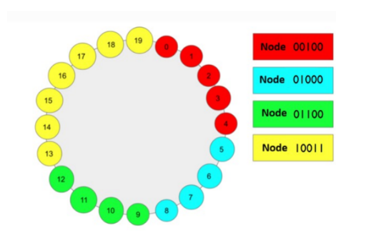

Superando le limitazioni strutturali di Chord, il sistema **Kademlia** si è affermato come l'algoritmo di ricerca standard de facto per le reti P2P (peer-to-peer) su Internet. Progettato da Petar Maymounkov (uno studioso di origini bulgare) e David Mazieres, il sistema è stato presentato per la prima volta nel 2002. Una curiosità interessante riguarda l'origine del nome: "Kademlia" deriva da una parola turca che indica un "uomo fortunato" e, cosa ancora più rilevante per le origini del suo creatore, è il nome di un picco montuoso in Bulgaria. Le specifiche complete del protocollo sono liberamente accessibili online.

Kademlia definisce una specifica di protocollo per memorizzare e recuperare dati in modo efficiente attraverso una rete P2P. La sua architettura è intrinsecamente decentralizzata: i dati non risiedono su un server centrale, ma vengono memorizzati in modo ridondante sui vari peer. Questa caratteristica garantisce un'elevata tolleranza ai guasti (fault tolerance); infatti, se uno o più peer abbandonano improvvisamente la rete, i dati rimangono comunque recuperabili poiché sono stati replicati su nodi multipli. Un ulteriore punto di forza è la sua leggerezza: non sono richiesti motori di database complessi, in quanto i dati sono salvati come semplici coppie chiave-valore. Questo livello di efficienza permette persino a dispositivi IoT, tipicamente dotati di capacità di archiviazione limitate, di partecipare attivamente alla rete.

Grazie a questi notevoli vantaggi, il protocollo Kademlia è oggi il motore delle più grandi DHT pubbliche. Trova applicazione nella rete peer-to-peer di Ethereum, in IPFS (nelle sue varianti S/Kademlia e Sloppy Kademlia), nella Mainline DHT (MDHT) di BitTorrent e nella storica rete KAD di eMule. 

Il successo di Kademlia è dovuto a un insieme di caratteristiche uniche non offerte da altre DHT. Innanzitutto, le informazioni di routing si diffondono automaticamente all'interno del network come effetto collaterale delle operazioni di ricerca (lookup). Inoltre, il protocollo offre la flessibilità di inviare richieste multiple in parallelo (parallel routing), accelerando notevolmente le ricerche ed evitando ritardi dovuti ai timeout. A questo si aggiunge un efficiente meccanismo di routing iterativo.

### Strutturazione dello Spazio degli Identificatori: Il Trie Binario

Il cuore dell'architettura di Kademlia risiede nel modo in cui organizza lo spazio degli identificatori. A differenza dell'anello di Chord, in Kademlia gli identificatori dei nodi e dei dati sono strutturati all'interno di una topologia virtuale che assume la forma di un **trie binario completo**. Un trie binario è una struttura dati ad albero specializzata nella memorizzazione di chiavi o identificatori binari. In questo albero, ogni livello rappresenta esattamente un bit. Procedendo dalla radice verso il basso, ogni nodo interno possiede al massimo due figli: il ramo di sinistra corrisponde al bit 0, mentre il ramo di destra corrisponde al bit 1. Seguendo un percorso completo dalla radice fino a una foglia, si compone un identificatore completo, il quale è logicamente conservato all'interno del nodo foglia stesso.

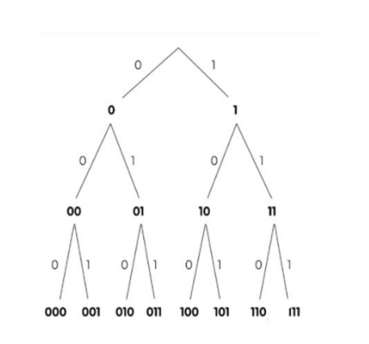

Le foglie di questo albero delineano l'intero spazio degli identificatori disponibile sia per i nodi che per i dati. Tuttavia, nella realtà, solo una minima frazione di queste foglie corrisponde a nodi fisicamente attivi. Immaginiamo, a titolo di esempio, che solo tre nodi partecipino alla DHT. L'identificatore di ciascun peer (tipicamente derivato dall'indirizzo IP) viene sottoposto a una funzione di hash, e l'output risultante corrisponde a uno specifico identificatore (una foglia dell'albero). Nell'esempio mostrato a lezione, i nodi effettivamente partecipanti al protocollo possiedono gli identificatori 000, 110 e 111. È importante tenere a mente che, in uno scenario reale, lo spazio totale degli identificatori è immenso e il numero dei nodi attivi è di gran lunga inferiore rispetto al numero di tutti i possibili identificatori rappresentabili.

### Mappatura delle Chiavi sui Nodi e Risoluzione dei Conflitti

Una volta definita la struttura ad albero, sorge la necessità di partizionare questo enorme spazio di foglie (lo spazio degli identificatori) assegnando la responsabilità dei dati ai nodi effettivamente presenti, detti anche nodi "cerchiati" nei diagrammi di esempio. La regola di base per il partizionamento stabilisce che una determinata chiave (l'identificatore del dato) viene assegnata al nodo attivo nella DHT con cui condivide l'**Antenato Comune Più Basso** (Lowest Common Ancestor, o **LCA**). In un albero, l'LCA tra due nodi è definito come il nodo più profondo che funge da antenato per entrambi. In termini visivi, rappresenta l'ultimo punto nell'albero in cui i percorsi che partono dalla radice e si dirigono verso i due nodi coincidono prima di biforcarsi definitivamente.

Applicando questa regola di partizionamento, si prende una chiave (identificatore del dato) e la si assegna al nodo DHT che possiede l'LCA ottimale con tale chiave. Osservando gli esempi grafici, se abbiamo nodi colorati (es. un nodo rosso, uno blu e uno giallo) e chiavi rappresentate con colori tenui (foglie non cerchiate), le chiavi colorate di azzurro tenue verranno assegnate al nodo blu, mentre le chiavi rosso tenue saranno assegnate al nodo rosso.

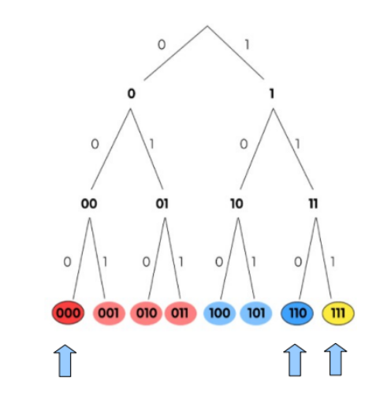

Tuttavia, può presentarsi una situazione di stallo. Potrebbe accadere che l'LCA calcolato tra una specifica chiave e due nodi differenti (ad esempio, il nodo blu e il nodo giallo) risulti essere esattamente lo stesso nodo interno dell'albero. In questo scenario, le chiavi non verrebbero teoricamente assegnate in modo univoco, lasciando potenzialmente un nodo "a secco". Per risolvere questa ambiguità, Kademlia introduce una regola per **spezzare i legami** (breaking the ties) e dividere equamente le chiavi tra le due foglie.

Quando due peer risultano a pari merito per l'LCA rispetto a una chiave, il protocollo analizza i loro identificatori cercando il bit più significativo in cui i due peer differiscono; indicheremo l'indice di questo bit con la lettera $b$. La chiave verrà quindi assegnata al nodo il cui b-esimo bit corrisponde esattamente al b-esimo bit della chiave stessa. Per chiarire, supponiamo di dover assegnare l'identificatore 101 e di dover scegliere tra i peer 110 e 111. L'LCA della chiave 101 con entrambi i peer è lo stesso. Tuttavia, confrontando gli ID dei nodi (110 e 111), notiamo che differiscono al terzo bit. Essendo il terzo bit dell'identificatore 101 pari a 1, la chiave verrà assegnata al nodo 111, poiché condividono lo stesso valore in quella specifica posizione.

### La Distanza XOR: Oltre le Metriche Tradizionali

Per capire come Kademlia calcoli la "vicinanza" o la "distanza" tra nodi e chiavi, dobbiamo analizzare la rappresentazione binaria degli identificatori. Immaginiamo di avere un set di candidati contenente tutti gli ID dei nodi. L'algoritmo esamina gli ID bit per bit, partendo dal bit più significativo e scendendo verso il meno significativo. A ogni posizione, se almeno un nodo candidato possiede lo stesso valore di bit della chiave, vengono immediatamente scartati tutti i candidati che presentano un bit differente in quella posizione. Se invece nessun candidato corrisponde, la procedura passa semplicemente alla posizione del bit successiva senza eliminare nessuno. Al termine di questo processo di esclusione, rimarrà un solo candidato: quello sarà il nodo ID più vicino alla chiave. La complessità computazionale di questa operazione, nel caso peggiore, è pari a $O(n\cdot m)$, dove $n$ è il numero dei nodi e $m$ il numero dei bit.

Per rendere il protocollo ancora più efficiente, Kademlia effettua un fondamentale cambio di prospettiva: invece di calcolare un generico livello di "vicinanza", definisce un valore scalare preciso che rappresenta la **distanza**. Questo valore scalare introduce un sistema di penalità maggiore per gli ID che differiscono in corrispondenza dei bit più significativi. Confrontando una chiave e un nodo ID dal bit più significativo verso il basso, se i bit sono identici, non viene applicata alcuna penalità (il valore rimane 0). Se invece differiscono all'i-esimo bit meno significativo, viene applicata una penalità pari a $2^{i}$. Poiché matematicamente vale la relazione $2^{i}>\Sigma_{j=0}^{i-1} 2^{j}$, l'aggiunta di una penalità pari a una potenza di due superiore per differenze sui bit più significativi garantisce che nessuna somma di differenze sui bit meno significativi possa mai superare o eguagliare la prima discordanza importante.

Straordinariamente, questa logica di penalizzazione per i bit disallineati corrisponde esattamente al comportamento dell'operazione logica **XOR** (OR esclusivo). In Kademlia, dunque, la distanza formale tra una chiave e un nodo ID è data semplicemente dallo XOR dei loro valori binari. Una chiave deve essere memorizzata sul nodo che restituisce il valore XOR più basso con la chiave stessa, confrontato con tutti gli altri ID dei nodi.

#### Proprietà Matematiche dello XOR

Ma lo XOR è realmente una metrica valida in senso matematico? La risposta è sì, poiché rispetta tutte le proprietà fondamentali. Basandosi sulla sua tabella di verità (00→0, 01→1, 10→1, 11→0), possiamo verificare che:

- La distanza di un nodo da se stesso è zero: $d(x,x)=0$.

- La distanza è strettamente positiva se i nodi sono diversi: $d(x,y)>0$ se $x!=y$.

- Gode della proprietà di **simmetria**: la distanza da $x$ a $y$ è identica alla distanza da $y$ a $x$, per ogni $x,y$, ovvero $d(x,y)=d(y,x)$.

- Soddisfa la **disuguaglianza triangolare**: il percorso diretto da $x$ a $z$ è sempre lungo al massimo quanto la deviazione passando per un nodo $y$. Matematicamente, questo deriva dalla transitività dell'operatore ($d(x,y)\oplus d(y,z)=d(x,z)$) da cui consegue che $d(x,y)\oplus d(y,z)\ge d(x,z)$.

- Garantisce l'**unidirezionalità**: fissato un nodo di partenza $x$ e una specifica distanza $\Delta$, esiste uno e un solo nodo $y$ tale che $d(x,y)=\Delta$. Ad esempio, se $x=1001$ e $\Delta=0001$, l'unico punto a quella esatta distanza da $x$ è forzatamente $y=1000$.

La scelta della metrica XOR non è casuale ed è superiore alle implementazioni precedenti. Grazie alla sua simmetria, se il nodo A percepisce il nodo B come vicino, anche B vedrà A come vicino. Questo significa che B può suggerire ad A dei nodi che sono vicini a se stesso, i quali saranno conseguentemente vicini anche ad A, rendendo le ricerche (lookups) incredibilmente affidabili ed efficienti. Questo contrasta nettamente con sistemi come Chord, le cui distanze non simmetriche impediscono di sfruttare ogni singolo nodo per arricchire la tabella di routing, disperdendo informazioni utili. Inoltre, l'unidirezionalità assicura che esista un singolo nodo a distanza minima per ogni chiave. Le ricerche per una medesima chiave convergeranno sempre verso lo stesso percorso di rete, permettendo di memorizzare nella cache gli elementi lungo questo percorso ed evitando così i sovraccarichi (hotspots) sui singoli nodi.

Questa metrica è strettamente legata ai **prefissi degli identificatori**: maggiore è la lunghezza del prefisso iniziale in comune tra due nodi, minore sarà la loro distanza calcolata tramite $\oplus$. I nodi considerati "vicini" sono accomunati proprio da un lungo prefisso condiviso. Per fare un esempio pratico reale su uno spazio a 160 bit, se la chiave di destinazione è l'hash del file "Communication Breakdown", e calcoliamo lo XOR tra questa chiave e gli ID hashati di tre nodi (A, B e C), il nodo che restituisce il valore XOR alfanumerico minore sarà il candidato prescelto per memorizzare i dati (nell'esempio delle slide, il nodo B).

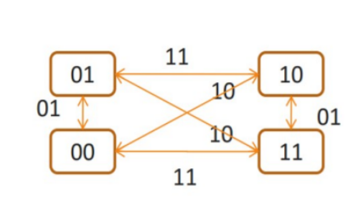

È vitale non confondere la distanza XOR con la semplice differenza numerica. Essendo lo spazio degli identificatori un albero binario bilanciato, due foglie possono apparire molto vicine nell'albero e avere una differenza numerica irrisoria, ma risultare estremamente distanti secondo la metrica $\oplus$. Ad esempio, lo XOR tra 1000 e 0111 genera 1111 (pari a 15, la massima distanza su 4 bit), nonostante la loro differenza aritmetica classica sia soltanto di 1.

### Inserimento e Mappatura nel DHT

Comprese le fondamenta della metrica, possiamo delineare la procedura per memorizzare una coppia (chiave, valore) nella DHT. Come prima fase operativa, si applica la funzione di hash alla chiave del dato per ottenere un keyID compatibile con lo spazio della DHT. A questo punto, il nodo che desidera effettuare il salvataggio esegue una ricerca per l'identificatore keyID, con l'obiettivo di trovare i nodi più prossimi a quell'identificatore, misurati rigorosamente secondo la distanza XOR. La ricerca restituisce i $k$ nodi i cui identificatori minimizzano la distanza rispetto a keyID. Saranno proprio questi $k$ nodi a diventare i responsabili finali dell'archiviazione della chiave. Replicare i dati su un gruppo di $k$ nodi, piuttosto che su un singolo individuo, è una strategia imprescindibile per proteggere il sistema dalla perdita di informazioni causata dal fisiologico turnover dei partecipanti (churn). Da qui prende il via la gestione sofisticata della Routing Table di Kademlia.

---

### Glossario e Concetti Chiave

- **Trie Binario**: Struttura dati ad albero in cui le stringhe binarie determinano il percorso (0 a sinistra, 1 a destra), utilizzata da Kademlia per organizzare topologicamente l'immenso spazio degli identificatori.

- **Lowest Common Ancestor (LCA)**: Il nodo antenato più profondo condiviso da due rami dell'albero, usato come base concettuale per decidere a quale nodo fisico assegnare la giurisdizione su un certo spazio di chiavi.

- **Distanza XOR ($\oplus$)**: L'innovativa metrica matematicamente rigorosa adottata da Kademlia. Penalizza esponenzialmente le differenze sui bit più significativi ed essendo simmetrica e unidirezionale stabilizza e ottimizza grandemente i percorsi di rete.

- **Routing Parallelo (Parallel Routing)**: Capacità di Kademlia di diramare più richieste di ricerca simultaneamente verso nodi diversi, prevenendo colli di bottiglia e latenze dovute a peer non responsivi.

---

### La Tabella di Routing: Architettura e Logica dei K-Bucket

L'obiettivo primario della tabella di routing in Kademlia è definire una procedura di **look-up** efficiente, ovvero stabilire come trovare una specifica chiave all'interno del sistema. Per mantenere il protocollo leggero, ogni nodo deve memorizzare solamente gli indirizzi di una piccola frazione di nodi partecipanti, pur rimanendo in grado di rintracciare qualsiasi chiave in tempi relativamente brevi. L'idea fondamentale è che a ogni singolo passo del processo di interrogazione (query), il sistema debba avvicinarsi di almeno "un bit" alla chiave desiderata, garantendo così un tempo di esecuzione logaritmico pari a $O(\log(n))$. Per ottenere questo risultato, l'algoritmo estrae alcuni contatti dal trie degli identificatori e li organizza in base alla loro distanza relativa rispetto al nodo che ospita la tabella di routing.

Questa organizzazione si concretizza attraverso l'uso dei cosiddetti **k-bucket**. Dal punto di vista del nodo sorgente (ad esempio, il nodo identificato come 0000), l'albero di Kademlia viene suddiviso in diversi sottoalberi. A ogni sottoalbero corrisponde un secchio, o "bucket", che raccoglie un sottoinsieme di nodi appartenenti a quello specifico ramo. Più precisamente, ogni bucket copre un determinato intervallo di distanza (distance range) rispetto al nodo sorgente. Il primo k-bucket copre le distanze nell'intervallo $[2^0, 2^1)$, il secondo copre $[2^1, 2^2)$, il terzo $[2^2, 2^3)$, e così via, fino all'n-esimo k-bucket che gestisce l'intervallo $[2^{n-1}, 2^n)$. Una regola fondamentale di questa architettura impone che ogni bucket possa registrare al massimo $k$ contatti, da cui deriva proprio il nome "k-bucket".

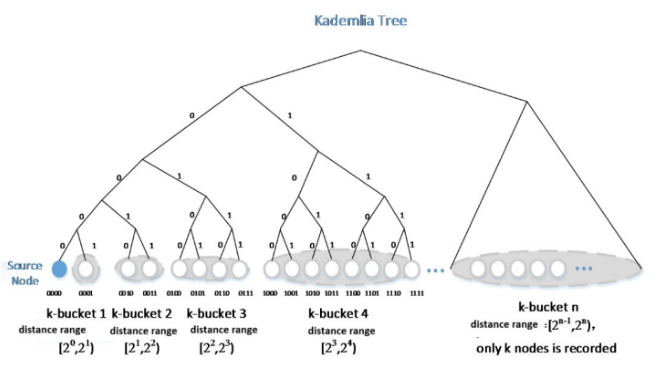

Le relazioni matematiche tra i sottoalberi e la metrica XOR sono essenziali per comprendere il calcolo delle distanze. Considerando due identificatori $x$ e $y$ di lunghezza $L$, se questi condividono un prefisso comune di lunghezza $p$ e differiscono, di conseguenza, negli ultimi $i = L - p$ bit, la loro distanza secondo la metrica XOR ricadrà sempre nell'intervallo $2^{i-1} \le d(x,y) < 2^i$. Per chiarire, se abbiamo $X = 0101010$ e $Y = 0101110$, l'operazione $X \oplus Y$ genera il valore $0000100$, il che equivale a una distanza minima $d(x,y) = 2^3 = 8$. Se invece confrontiamo $X = 010110$ con $Y = 011001$, il loro XOR produce $001111$, indicando una distanza massima pari a $d(x,y) = 2^4 - 1 = 15$. In questo modo, ogni specifico intervallo di distanza viene rigorosamente associato all'estensione di un sottoalbero secondo le regole della metrica XOR.

Queste dinamiche di calcolo spiegano la profonda differenza tra la distanza strutturale nell'albero degli identificatori e la classica differenza numerica. Ad esempio, consideriamo lo spazio dei numeri a 4 bit e prendiamo una foglia situata nel sottoalbero sinistro e una nel sottoalbero destro. Tra questi nodi, la lunghezza del prefisso condiviso è pari a 0 e la loro distanza varia nell'intervallo $2^3 \le d < 2^4$. L'operazione $0000 \oplus 1111$ restituisce $1111$, ovvero una distanza massima di 15, sebbene in questo caso anche la differenza numerica pura rifletta una grande lontananza. Tuttavia, il calcolo $0111 \oplus 1000$ restituisce $1111$ (15), mostrando che due nodi numericamente adiacenti (7 e 8 in decimale) si trovano in realtà alla massima distanza possibile nella topologia XOR. Al contrario, tra due nodi come $0110$ (6) e $0111$ (7), che differiscono unicamente nell'ultimo bit, la distanza risulta minima, ricadendo nell'intervallo $2^0 \le d < 2^1$ poiché $0110 \oplus 0111 = 0001 = 1$.

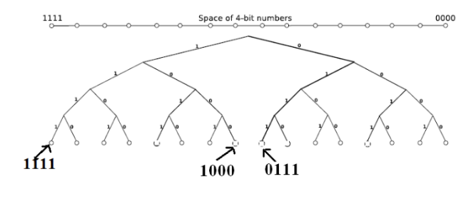

È inoltre fondamentale ricordare che lo spazio degli identificatori, tipicamente vastissimo (ad esempio 160 bit), non è interamente popolato. I nodi fisicamente attivi nella rete sono in numero enormemente inferiore rispetto agli identificatori teorici possibili, il che significa che non a tutti gli identificatori è associato un peer reale. Di conseguenza, l'albero dei nodi si configura come una visione alternativa e semplificata del trie formale: si tratta di un albero binario sbilanciato in cui vengono mostrate esclusivamente le foglie che corrispondono a peer realmente presenti nell'overlay. In questa struttura ottimizzata, una foglia dell'albero dei nodi corrisponde a un preciso prefisso identificativo. Il peer accoppiato a una determinata foglia possiede un prefisso che lo identifica univocamente all'interno della rete; non esisterà nessun altro peer attivo con il medesimo prefisso di routing, rendendo di fatto del tutto superflua la navigazione della parte più profonda del percorso (i bit meno significativi) al fine di individuare quel singolo peer.

Strutturalmente, la tabella di routing di un singolo nodo può essere vista come un array di righe, dove ogni riga rappresenta un **k-bucket** (per identificatori a 160 bit, l'indice $i$ varierà da $0$ a $160$). Ogni riga $i$ contiene al massimo $k$ contatti la cui distanza $d$ dal nodo proprietario rientra nell'intervallo $2^i \le d < 2^{i+1}$. Ciascuna voce immagazzinata consiste in una tripla di informazioni: indirizzo IP, porta UDP e ID del Nodo. La tabella è strutturata in modo che le primissime voci corrispondano ai peer che condividono un lunghissimo prefisso comune con il proprietario della tabella. Essendo questa porzione di spazio estremamente ristretta, i bucket iniziali conterranno generalmente pochissimi contatti. Scendendo nella tabella (o salendo, in caso di ordine invertito dipendente dall'implementazione), si trovano i bucket associati a prefissi via via sempre più brevi, i quali coprono porzioni molto più ampie dello spazio degli identificatori. Questi ultimi bucket ospiteranno fisiologicamente un numero maggiore di contatti, raggiungendo spesso la capienza massima fissata dal parametro $k$. Il valore esatto di $k$ viene scelto a livello di sistema in modo da rendere statisticamente remoto l'evento critico in cui più di $k$ nodi all'interno di uno stesso bucket collassino o si disconnettano simultaneamente.

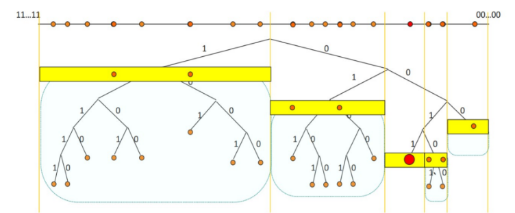

### Gestione e Manutenzione dei Contatti nei K-Bucket

La validità e l'efficienza della rete dipendono strettamente dal continuo e dinamico aggiornamento delle tabelle di routing. I contatti all'interno di ciascun bucket sono rigorosamente mantenuti ordinati secondo il criterio temporale del "least recently seen": i nodi contattati meno di recente vengono spinti verso le primissime posizioni della lista, mentre quelli visti più di recente si collocano in coda.

Quando un nodo riceve un qualsiasi messaggio (che sia una richiesta o una risposta) da un altro peer, innesca immediatamente la procedura per aggiornare il k-bucket appropriato al range in cui ricade l'ID del mittente. Se il nodo mittente è già noto ed è fisicamente presente nel k-bucket, la procedura si limita a spostarlo al termine della lista (tail), confermando la sua vitalità. Se invece il nodo è del tutto nuovo, l'algoritmo verifica innanzitutto se il bucket possiede ancora slot liberi (ha cioè meno di $k$ elementi); in caso affermativo, il nuovo mittente viene semplicemente aggiunto in fondo alla lista. La situazione diventa più complessa se il bucket risulta pieno. In questa evenienza, il nodo locale invia preventivamente un segnale di "ping" al contatto meno visto di recente (quello in testa alla lista). Se questo vecchio nodo non risponde, si deduce che sia offline: viene quindi espulso dal bucket, liberando lo spazio per inserire il nuovo mittente in coda. Se, al contrario, il vecchio nodo risponde confermando la sua presenza, quest'ultimo viene premiato spostandolo in coda alla lista, mentre il contatto del nuovo mittente viene inesorabilmente scartato.

Questa rigorosa politica, che privilegia fortemente il mantenimento dei vecchi contatti a discapito dei nuovi, non è affatto casuale. Questa logica è stata introdotta dagli sviluppatori in seguito a un'attenta analisi dei dati di tracciamento raccolti storicamente dalla rete Gnutella. Le statistiche dimostrano un principio di longevità: maggiore è il tempo in cui un nodo è rimasto online, più alta sarà la probabilità che esso rimanga online anche per l'ora successiva.

[RIFERIMENTO VISIVO DEL PROFESSORE: Grafico logaritmico che mostra sull'asse delle ascisse i minuti di uptime di un nodo e sull'asse delle ordinate la percentuale di probabilità che esso rimanga online per i 60 minuti successivi. La curva illustra chiaramente come la stabilità aumenti drasticamente col passare del tempo.]

Di conseguenza, preservando attivamente i contatti storici vivi, l'architettura dei k-bucket massimizza matematicamente la stabilità e la disponibilità della tabella di routing. L'adozione della logica di sfratto del meno recentemente visto (least recently seen eviction), che cancella i nodi fermi nelle prime posizioni della lista, supporta proprio questo paradigma. Un secondo, e non meno importante, vantaggio derivato dalla gestione conservativa dei k-bucket consiste in una naturale resistenza strutturale contro specifiche forme di attacco informatico di tipo Denial of Service (DoS). In questo framework, un utente malintenzionato è tecnicamente impossibilitato a "inondare" (flush) lo stato di routing di un nodo vittima sommergendolo semplicemente con una moltitudine di nuove finte identità: Kademlia inserirà i nodi aggressori nei k-bucket esclusivamente qualora dei nodi anziani e legittimi dovessero volontariamente abbandonare il sistema.

A garanzia della freschezza dei dati, i k-bucket subiscono aggiornamenti costanti in maniera completamente passiva, rinfrescandosi tramite le normali query che attraversano incessantemente il nodo: ogni qualvolta viene rilevato che un peer ha lasciato la rete, le nuove informazioni catturate dal transito "rinfrescano" la lista. Può però accadere che uno specifico k-bucket, associato a un ramo remoto dell'albero, non riceva traffico passivo per un prolungato periodo di tempo. Per evitare la stagnazione e identificare i nodi offline in modo proattivo, Kademlia innesca un refresh periodico forzato per tutti i bucket inattivi (generalmente impostato a cadenza oraria). Durante questa fase di manutenzione autonoma, il protocollo genera un identificatore casuale compreso nel range di pertinenza del bucket addormentato e lancia una ricerca esplicita per esso; se un nodo responsabile di quell'area remota invia una risposta, il sistema lo intercetta e aggiorna il k-bucket.

### Il Processo di Look-up: Ricerca Iterativa e Routing Parallelo

Il nucleo operativo di Kademlia, da cui dipendono tutte le interazioni della rete, è la procedura di **look-up**, una sofisticata ricerca distribuita che muove progressivamente il richiedente verso l'identificatore bersaglio misurandosi lungo lo spazio XOR. Il target di questa procedura può assumere due forme distinte. Nel caso di un **Node Lookup**, si ricerca l'ID di un nodo specifico, operazione fondamentale sia per mappare e mantenere aggiornate le tabelle di routing, sia per individuare l'host delegato alla memorizzazione di determinati dati associati a una chiave. Nel caso di un **Value Lookup**, invece, il target è direttamente il Key ID, ed è finalizzato al recupero materiale del file o del valore ancorato a tale chiave.

La dinamica del Look-up si articola in tre fasi logiche iterative. Al Passo 1, il nodo che avvia la ricerca (nodo interrogante) esamina la propria tabella di routing per estrarre i nodi conosciuti la cui distanza XOR li renda i più vicini in assoluto all'ID bersaglio. Al Passo 2, il nodo interrogante inoltra a questi contatti la richiesta formale, chiedendo a sua volta l'elenco dei nodi in loro possesso che risultino essere spazialmente ancora più prossimi all'obiettivo. Al Passo 3, il processo si itera ricorsivamente: ricevuti i nuovi contatti (più vicini), il nodo sorgente li interroga, continuando a convergere verso la meta. A ogni singolo passaggio iterativo, la logica del Prefix Match Routing garantisce che il prefisso in comune tra i nodi interrogati e la chiave aumenti, riducendo di fatto la distanza XOR della metà e restringendo progressivamente il campo a k-bucket di dimensioni inferiori.

[RIFERIMENTO VISIVO DEL PROFESSORE: Diagramma ad albero animato in più passi (Passo 1, Passo 2, Passo 3, Passo 4) che illustra come la ricerca parta da un nodo sorgente (indicato in nero), salti verso contatti noti (in verde), i quali a loro volta suggeriscono contatti sempre più profondi (in blu) situati nel ramo di appartenenza del target desiderato (in arancione).]

L'algoritmo di iterazione si interrompe unicamente al verificarsi di due specifiche condizioni: quando l'interrogazione dei nodi non riesce più a restituire alcun peer che sia strettamente più vicino alla meta rispetto al miglior nodo già conosciuto in precedenza, o quando il nodo in assoluto più vicino all'obiettivo è già stato interrogato con successo.

A differenza di molti protocolli concorrenti che si affidano al routing ricorsivo (dove la richiesta transita fisicamente da nodo a nodo delegando l'onere della ricerca, senza l'intervento diretto del nodo iniziale), Kademlia sposa convintamente l'approccio del **Routing Iterativo**. Nel routing iterativo, il nodo $n$ che emette la query originale governa e coordina in solitaria l'intero processo di indagine. A ogni avanzamento (routing step), il nodo $n$ attende diligentemente di ricevere una risposta diretta dai peer interrogati. Questa risposta non contiene i dati finali, ma una notifica strutturata che espone gli indirizzi necessari per procedere al passo di routing immediatamente successivo.

[INSERIRE IMMAGINE: Grafici comparativi che illustrano visivamente la netta differenza di flusso dati tra il routing iterativo (topologia a stella, in cui tutte le frecce ritornano al nodo verde di origine) e il routing ricorsivo (topologia a catena, in cui il segnale passa consecutivamente di nodo in nodo logico fino al target rosso).]

Una delle peculiarità ingegneristiche più potenti di Kademlia risiede nell'implementazione del **Routing Parallelo**. Il protocollo introduce un parametro di concorrenza a livello di sistema, convenzionalmente indicato come $\alpha$ (alpha). Questo valore rappresenta l'esatto ammontare di nodi ai quali la query viene spedita contemporaneamente a ogni ciclo di routing. Sebbene in scenari base si possa porre $\alpha = 1$, trasformando la ricerca in un percorso lineare sequenziale, impostando $\alpha > 1$ (tipicamente pari a 3) il nodo sorgente invia le sue richieste parallelamente a rami di rete distinti.

I vantaggi del routing parallelo emergono chiaramente analizzando la topologia. Immaginiamo una situazione in cui il nodo sorgente sta cercando un target specifico e, nella sua tabella, scorge due candidati: il nodo $y$ (più distante dal target) e il nodo $z$ (matematicamente più vicino al target). Paradossalmente, spedire la richiesta in modo esclusivo al nodo apparentemente più vicino ($z$) non garantisce in alcun modo di intraprendere il percorso più breve o risolutivo. È del tutto plausibile, infatti, che il nodo topologicamente più lontano ($y$) possegga fortuitamente un riferimento diretto al target nei suoi database interni, informazione di cui $z$ potrebbe essere all'oscuro. Grazie all'invio parallelo della medesima query a entrambi, guidato a valle dalla formidabile unidirezionalità intrinseca della metrica XOR, si colma preventivamente questo gap informativo e si ha l'assoluta certezza che tutti i differenti percorsi generati finiranno per convergere infallibilmente e rapidamente sul bersaglio finale.

### Le Operazioni Primitive di Comunicazione (RPC)

Dal punto di vista della connettività a basso livello, il cuore del protocollo Kademlia poggia sull'invio di messaggi tramite il leggero protocollo di trasporto UDP. L'interazione tra i peer della rete è confinata a sole quattro operazioni primitive e non iterabili, architettate come Chiamate di Procedura Remota (Remote Procedure Calls o RPC).

La prima operazione è la **FIND_NODE**, strutturata come $V \rightarrow W (T)$. In questa interazione, il peer $v$ trasmette il messaggio al peer $w$, indicando $T$ come bersaglio della ricerca logica. Alla ricezione di questa RPC, il nodo interrogato $w$ scandaglia la propria tabella di routing e formula una lista di risposta contenente le $k$ triple (Indirizzo IP, Porta UDP, Node ID) afferenti ai $k$ nodi da lui conosciuti che minimizzano la distanza XOR rispetto all'identificatore $T$. Questi contatti possono essere prelevati per intero da un singolo k-bucket altamente popolato o raschiati trasversalmente da molteplici k-bucket adiacenti qualora il secchio ottimale non fosse completamente pieno. In ottemperanza alle direttive del protocollo, il destinatario ha il preciso vincolo di dover sempre far rientrare nel messaggio di responso esattamente $k$ elementi, con l'unica eccezionale deroga per il caso in cui, sommando le conoscenze totali di tutti i suoi k-bucket, il nodo conosca al mondo meno di $k$ nodi: in tal frangente, devolverà all'interrogante semplicemente l'intero database delle sue connessioni note.

La seconda operazione critica è la **FIND_VALUE**, codificata analogamente come $V \rightarrow W (T)$. In questo frangente, il parametro in input $T$ rappresenta un ID a 160 bit corrispondente al valore associato a un file o a un dato ricercato. Il comportamento di questa RPC produce due possibili output condizionali. Nel caso in cui un valore coincidente esattamente alla chiave $T$ risulti essere correntemente memorizzato all'interno dei database del nodo sondato ($w$), l'operazione ha successo immediato e i dati associati vengono ritornati al volo all'interrogante, chiudendo il ciclo di ricerca. Nel caso opposto, ovvero se $w$ non possiede il file richiesto, la funzione commuta istantaneamente il proprio comportamento ricalcando in toto l'esecuzione della precedente direttiva FIND_NODE: restituirà perciò un prezioso set composto dalle fatidiche $k$ triple riferite ai contatti più limitrofi alla chiave $T$. Qualora il output generato si risolva in un tale elenco di peer ausiliari, spetterà esclusivamente al nodo originario richiedente l'onere di persistere iterativamente la propria indagine inviando ulteriori sonde ai nodi della lista per recuperare l'agognato valore.

Tutte le interazioni necessarie all'architettura sono dunque governate dall'equilibrio tra questi comandi essenziali che, abbinati a una topologia ad albero squisitamente rigorosa, definiscono Kademlia come uno dei paradigmi decentralizzati più influenti dello scenario di rete globale.

### Le Ultime Operazioni Primitive: PING e STORE

Nel capitolo precedente abbiamo introdotto le Chiamate di Procedura Remota (RPC) fondamentali per l'esplorazione della rete. A queste si aggiungono altre due operazioni essenziali per il mantenimento dell'infrastruttura. La prima è l'operazione **PING**, formalizzata come $V \rightarrow W$, che ha il semplice ma vitale scopo di sondare il nodo $w$ per verificare se esso sia ancora online e reattivo. La seconda operazione primitiva è lo **STORE**, indicata come $V \rightarrow W (\text{Key, Value})$, la quale impartisce al nodo $w$ l'istruzione diretta di memorizzare in modo persistente una specifica coppia chiave-valore. Affinché questa istruzione vada a buon fine, il nodo destinatario $w$ deve essere stato preventivamente individuato e recuperato attraverso una precedente procedura di ricerca.

### L'Algoritmo di Node Lookup e il Routing Parallelo

Il pilastro dell'efficienza di Kademlia è l'operazione di **NODE LOOKUP**, un algoritmo iterativo progettato per localizzare i $k$ nodi più vicini a un dato identificatore (ID) di nodo . Questa procedura si basa reiteratamente sull'operazione primitiva FIND_NODE. La vera potenza dell'algoritmo risiede nell'utilizzo di un parametro di concorrenza a livello di sistema, denominato $\alpha$ (alpha), che permette di eseguire un numero $\alpha$ di chiamate FIND_NODE in totale parallelo. Per comprendere l'impatto di questo parametro, basti pensare che se si impostasse $\alpha=1$, l'algoritmo di ricerca regredirebbe a un comportamento simile a quello di Chord, producendo un singolo passo di avanzamento alla volta. Kademlia, al contrario, sfrutta la flessibilità intrinseca di poter scegliere liberamente uno qualsiasi dei $k$ nodi a cui inoltrare la richiesta in ogni fase dell'esplorazione. Questa procedura viene impiegata sistematicamente sia per la localizzazione fisica dei nodi, sia per la ricerca di valori veri e propri; in quest'ultimo scenario, il processo si interrompe immediatamente non appena il valore desiderato viene trovato .

Per cristallizzare questi concetti, analizziamo un esempio pratico e completo della procedura di Look-up. Immaginiamo un nodo sorgente $P$ che necessiti di cercare una chiave $Q$, la quale può rappresentare l'identificatore di un altro nodo o di un contenuto . Come prima mossa, il nodo $P$ ispeziona la propria lista di K-Bucket per scovare i nodi attualmente memorizzati che risultano matematicamente più vicini a $Q$ . Nello specifico, $P$ cerca all'interno del k-bucket che copre la distanza più prossima alla chiave e che non risulta vuoto. Se questo specifico bucket contiene un numero di nodi inferiore al parametro $\alpha$ (ipotizziamo $\alpha=3$), l'algoritmo compensa estrapolando i contatti mancanti dai bucket spazialmente più vicini. Di conseguenza, i contatti selezionati per avviare la ricerca possono appartenere a k-bucket differenti.

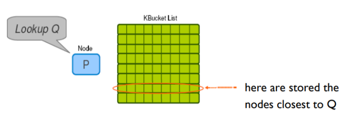

Una volta isolati questi nodi, che chiameremo $A$, $B$ e $C$, il nodo $P$ invia in parallelo e in modo asincrono la query tramite la RPC FIND_NODE(Q) a tutti i contatti selezionati.

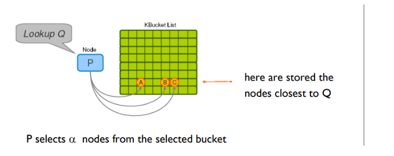

A questo punto, la palla passa ai nodi interpellati: ogni nodo contattato ($A$, $B$ e $C$) analizza a sua volta la propria tabella di routing per individuare i $k$ nodi che ritiene essere ancora più prossimi alla chiave $Q$. Naturalmente, data la diversa prospettiva topologica, ogni nodo interpellato attingerà a un bucket diverso della propria tabella di routing.

Completata questa sotto-ricerca, si manifesta la natura del Routing Iterativo: ogni nodo interrogato restituisce autonomamente i risultati raccolti al nodo sorgente $P$ . Il nodo $P$ funge da centro di controllo, raccogliendo questi nuovi risultati e inserendoli in una lista rigorosamente ordinata in base alla distanza metrica tra ciascun nuovo nodo e la chiave $Q$. Attraverso queste nuove coordinate, $P$ può continuare il processo di routing inabissandosi ulteriormente nella rete.

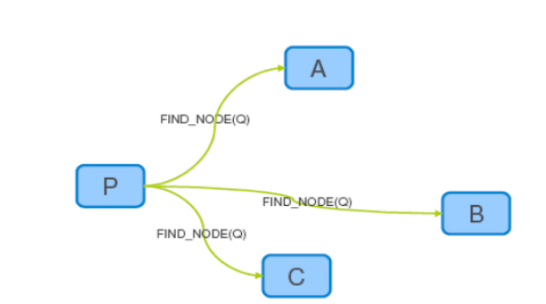

Con le nuove informazioni alla mano (che ipotizziamo abbiano svelato l'esistenza dei nodi $M$, $N$ e $O$), il nodo $P$ aggiorna doverosamente i propri k-bucket. Successivamente, seleziona nuovamente un sottoinsieme di $\alpha$ nodi dalle informazioni appena ricevute. Se questi nuovi nodi risultano effettivamente più vicini al target rispetto a quelli esplorati in precedenza, $P$ avvia un nuovo ciclo di look-up inviando loro delle nuove richieste FIND_NODE(Q). Qualora i nuovi nodi non garantissero un avvicinamento significativo, l'algoritmo non si arrende, ma sceglie ulteriori nodi alternativi tra quelli immagazzinati che non sono ancora stati contattati.

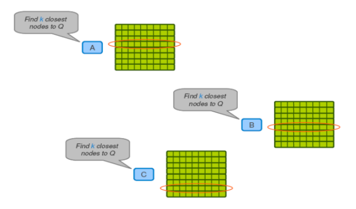

Questo imponente processo ricorsivo non prosegue all'infinito, ma è governato da una rigorosa condizione di terminazione: l'iterazione si conclude definitivamente quando un intero round di chiamate FIND_NODE fallisce nel restituire nodi che siano più vicini di quelli già individuati nel round precedente.

Formalizzando l'intero algoritmo, la procedura inizia popolando una lista chiamata "k-closest" con $\alpha$ contatti prelevati dal k-bucket non vuoto più vicino alla chiave. Nel caso in cui questo bucket disponga di meno di $\alpha$ contatti, la lista viene rimpinguata unendo (tramite operazione logica di unione $U$) i contatti più vicini estratti da altri bucket adiacenti. Viene inoltre inizializzata una variabile "closestNode" che traccia il nodo in assoluto più vicino all'interno della lista. Entrando nel ciclo ricorsivo o iterativo, il sistema seleziona dalla lista "k-closest" gli $\alpha$ contatti più vicini che non sono ancora stati interrogati e invia loro, in parallelo e asincronamente, le chiamate FIND_NODE. Ciascun contatto ancora in vita risponderà restituendo $k$ nodi, i quali verranno aggiunti alla lista "k-closest", permettendo di aggiornare conseguentemente la variabile "closestNode". Questo ciclo si ripete ininterrottamente fino a quando i nodi contattati non riescono più a restituire alcun nodo che sia più vicino al target rispetto all'attuale "closestNode". A questo punto, come ultima azione a garanzia della massima copertura, il nodo sorgente invia parallelamente e asincronamente una chiamata FIND_NODE ai $k$ nodi più vicini che non ha ancora interrogato, restituendo infine all'applicazione utente l'elenco consolidato dei $k$ nodi definitivi.

### Archiviazione dei Dati, Re-publishing e Caching

Completata la comprensione della localizzazione, possiamo esplorare come la rete preservi le informazioni. Per eseguire un'operazione di **NODE STORE** e memorizzare una coppia (chiave, valore), il nodo proponente esegue innanzitutto la complessa operazione di look-up appena descritta per individuare i $k$ nodi più vicini alla chiave desiderata, ai quali invierà successivamente le RPC di STORE . In questo modo, i dati vengono replicati in sicurezza su un cluster di nodi limitrofi.

La persistenza a lungo termine è garantita da un rigoroso meccanismo di **re-publishing** (ripubblicazione): ogni nodo ospitante ha il dovere di ripubblicare periodicamente le coppie (chiave, valore) in suo possesso, un'azione necessaria per mantenerle in vita (alive) all'interno dell'ecosistema. Questo sforzo costante è essenziale per contrastare due fenomeni: la scomparsa di una parte o della totalità dei $k$ nodi che avevano originariamente ricevuto i dati (fenomeno di churn), e l'eventuale ingresso nella rete di nuovi nodi che possiedono un identificatore topologicamente più vicino alla chiave rispetto a quelli su cui il dato era stato originariamente pubblicato . Nel contesto specifico delle applicazioni di file sharing basate su Kademlia, il protocollo impone che l'utente o il nodo che ha pubblicato per primo la coppia sia tenuto a ripubblicarla ogni 24 ore .

In Kademlia, i valori archiviati sono considerati "soft-state" e, come tali, necessitano di continui aggiornamenti (refresh) per non essere epurati. Inoltre, per ottimizzare le future richieste, i valori vengono salvati in un'area di cache in corrispondenza del primo nodo, lungo il percorso di rete, che dichiara di non possederli ancora. Oltre alla ripubblicazione da parte degli autori, ogni singolo nodo che ospita fisicamente i dati pubblica a sua volta periodicamente le coppie per blindare la persistenza delle informazioni. Questa ridondanza attiva previene drasticamente la perdita di dati dovuta ad abbandoni volontari o a crash di sistema. Per evitare che questo meccanismo generi un inquinamento da traffico ridondante, il protocollo implementa alcune eleganti ottimizzazioni: se un nodo riceve dall'esterno un comando di STORE, deduce logicamente che lo stesso comando sia stato inoltrato anche ai suoi vicini più stretti e, pertanto, sopprime la propria pubblicazione automatica per quell'identifica chiave per l'ora successiva.

### Dinamiche di Join, Leave e Maintenance della Rete

La robustezza di Kademlia si evidenzia in particolare nella fluidità con cui gestisce l'ingresso e l'uscita dei peer. L'operazione di **NODE JOIN** inizia quando un nuovo nodo in ingresso (joining node) ottiene fuori banda o offline l'identificatore di un nodo già attivo e vitale, che assumerà il ruolo di "bootstrap node" (spesso abbreviato in *boot*). Il nuovo arrivato genera la sua tabella di routing iniziale creando un singolo k-bucket, all'interno del quale inserisce esclusivamente se stesso e il nodo *boot*. Come primo atto ufficiale, il nuovo nodo invia una richiesta FIND_NODE con il proprio identificatore al nodo *boot*, al fine di estorcergli informazioni topologiche sugli altri nodi della rete. Attraverso questa prima indagine, scopre alcuni nodi limitrofi a se stesso, popolando immediatamente i propri k-bucket caratterizzati dagli indici più alti. Allo stesso tempo, il semplice transito di questi messaggi permette agli altri nodi di scoprire l'esistenza del nuovo arrivato, il quale viene inserito silenziosamente nelle loro tabelle di routing. Successivamente, il nuovo nodo solidifica la propria mappa topologica eseguendo una serie di chiamate FIND_NODE per identificatori generati casualmente, con lo scopo di mappare i k-bucket spazialmente più distanti rispetto al proprio. Col passare del tempo, questi k-bucket verranno fisiologicamente arricchiti setacciando le informazioni intrinseche alle innumerevoli query di terze parti che transiteranno attraverso il nodo stesso. Se confrontiamo questa procedura con il processo di unione del protocollo Chord, la flessibilità logica e l'adattabilità di Kademlia risultano enormemente superiori.

Per quanto riguarda l'operazione di **Leave**, Kademlia adotta un approccio totalmente passivo: l'abbandono volontario di un nodo non richiede alcuna operazione di ricalcolo o riorganizzazione esplicita dell'overlay. Il sistema di autocorrezione subentra unicamente quando un nodo offline non risponde a una query diretta; in quel momento, e solo in quel momento, verrà silenziosamente scartato e sovrascritto nei k-bucket di competenza. La manutenzione ordinaria (Maintenance) è altrettanto essenziale: il protocollo rinfresca periodicamente (ad esempio, ogni ora) tutti quei k-bucket verso i quali non si sono registrati contatti o traffico passivo . Questo rinfresco avviene lanciando artificialmente un'operazione di lookup per un ID estratto casualmente nel range del bucket stagnante.

### Analisi Comparativa: Chord versus Kademlia

Giunti alla conclusione, tracciamo un bilancio analitico mettendo a confronto l'architettura appena studiata con il suo predecessore logico, Chord. Kademlia definisce una tabella di routing incomparabilmente più flessibile, basata su distanze simmetriche che dischiudono la possibilità di percorrere tracciati alternativi e di lanciare ricerche parallele . Il costo di gestione della tabella di routing risulta drasticamente abbattuto. Un aspetto fondamentale è la propensione alla "Località" (Locality): Kademlia memorizza il "round-trip-time" (RTT) affiancandolo a ciascun contatto noto, permettendo all'algoritmo di prediligere e scegliere scientificamente i contatti che offrono il tempo di latenza inferiore per l'inoltro dei pacchetti. In Kademlia, la metrica simmetrica garantisce che ogni singolo nodo possa arricchire costantemente la propria tabella di routing sfruttando le informazioni passive incluse nelle query che lo attraversano. Al contrario, nell'anello asimmetrico di Chord, se un nodo $x$ riceve una query da un nodo $y$, il nodo $y$ deve necessariamente possedere un riferimento (un finger) verso $x$, ma è assai probabile che $x$ non sia affatto un finger di $y$ . Di conseguenza, le preziose informazioni racchiuse in una query ricevuta in Chord non possono, in linea generale, essere sfruttate al volo per arricchire la propria finger table, disperdendo così un immenso potenziale di ottimizzazione topologica.

Tirando le somme, tra i punti di forza (Strengths) di Kademlia spiccano: un irrisorio sovraccarico dovuto ai messaggi di controllo (overhead), una straordinaria tolleranza fisiologica ai guasti e agli abbandoni dei nodi, l'intrinseca capacità di isolare e selezionare i percorsi a minor latenza per il routing delle query, e la presenza di limiti di performance dimostrabili matematicamente . Di contro, permangono alcune limitazioni intrinseche (Weaknesses): la distribuzione tipicamente non uniforme dei nodi nell'immenso spazio degli ID può generare tabelle di routing sbilanciate, degradando localmente l'efficienza del routing . Il bilanciamento del carico di memorizzazione tra i partecipanti (storage load) non è mai stato risolto in maniera definitiva e assoluta. Inoltre, essendo il paper originale in parte non specificato nei minimi dettagli, sono fiorite una pletora di implementazioni divergenti che rendono estremamente complesso fornire risultati analitici universali. A ciò si somma la natura strutturalmente non deterministica dei risultati del routing, sia in termini di tempi di risoluzione che di definizione precisa del vicinato (neighbourhood).

Per i lettori che desiderassero approfondire visualmente la cinematica della rete, si raccomanda l'osservazione dell'animazione interattiva disponibile all'indirizzo *kelseyc18.github.io/kademlia_vis/basics/1/*.

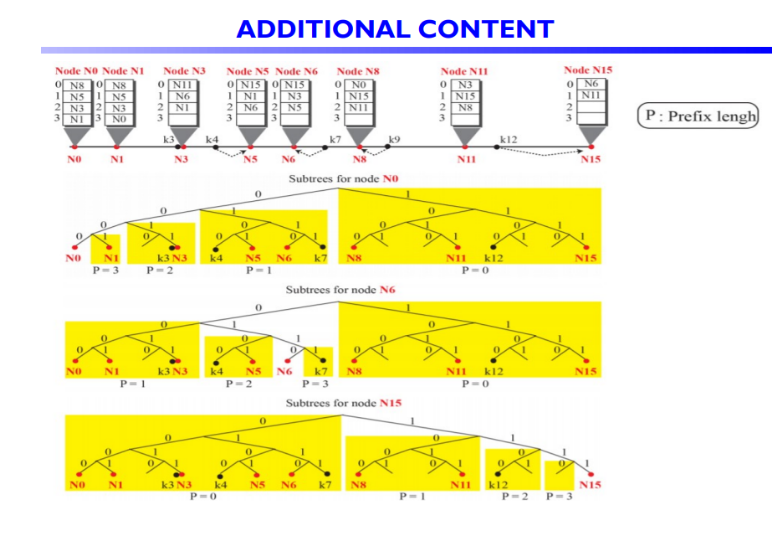

---

### Glossario e Concetti Chiave

- **FIND_NODE e STORE**: Le due chiamate di procedura remota (RPC) su cui si poggia l'architettura. La prima sonda lo spazio degli indirizzi, la seconda impone il salvataggio decentralizzato del dato.

- **Routing Parallelo e parametro $\alpha$**: Il meccanismo di ricerca concorrente, governato dal moltiplicatore $\alpha$, che consente a Kademlia di interrogare più nodi simultaneamente riducendo drasticamente i tempi di ricerca e aggirando le latenze dei singoli peer.

- **Re-publishing e Caching**: Le procedure di manutenzione dei dati soft-state. Impongono il ripristino ciclico delle associazioni chiave-valore nel network e il loro salvataggio temporaneo nei nodi di transito per velocizzare i successivi recuperi.

- **Bootstrap Node**: Un nodo preesistente e stabilmente attivo nella rete, la cui identità è necessaria a un nuovo partecipante per poter effettuare l'accesso iniziale (fase di join) e cominciare a popolare la propria tabella di routing.

- **Round-Trip-Time (RTT)**: Il tempo impiegato da un pacchetto per viaggiare dal nodo sorgente alla destinazione e tornare indietro. Kademlia registra l'RTT di ogni suo contatto per favorire, in fase di routing, la selezione dei percorsi a minor latenza.

---

# Lezione 5: Strumenti Crittografici per DHT e Blockchain

### Le Fondamenta della Crittografia per Sistemi Distribuiti

I mattoni crittografici fondamentali che supportano le architetture Blockchain e le Distributed Hash Table (DHT) si dividono in due categorie principali: le **funzioni di hash crittografiche** e le **firme digitali**. Da un lato, le funzioni di hash vengono impiegate per collegare i blocchi della blockchain in modo da renderli a prova di manomissione (tamper-proof). Dall'altro, le firme digitali permettono agli utenti di firmare digitalmente i propri dati, garantendo che nessuno possa barare o rinnegare le proprie azioni. Nel corso della trattazione verranno citati anche strumenti più avanzati, come le prove a conoscenza zero (zero knowledge), le strutture dati autenticate e gli accumulatori crittografici.

### L'Hashing nelle Strutture Dati Tradizionali

Prima di addentrarci nell'uso crittografico, è utile ricordare come l'hashing venga tradizionalmente impiegato nelle strutture dati. Una **Hash Table** (tabella hash) mappa una chiave di ricerca a un indice specifico per memorizzare e recuperare in modo efficiente il valore associato. Come mostrato nel seguente schema concettuale, nomi di figure note nel mondo crittografico vengono convertiti in indici:

| **Chiave (Key)** | **Funzione di Hash** | **Indice** | **Valore (Value)** |
| ---------------- | -------------------- | ---------- | ------------------ |
| Satoshi Nakamoto | ->                   | 0          | Ethereum           |
| Vitalik Buterin  | ->                   | 1          | Algorand           |
| Silvio Micali    | ->                   | 4          | Bitcoin            |

Per essere efficace in questo contesto, una funzione di hash, tipicamente modellata con equazioni come $y=x\pmod{\text{table\_dim}}$, deve rispettare alcuni requisiti. Deve essere deterministica e facile da calcolare, in modo da garantire l'efficienza. Inoltre, deve comportarsi in modo pseudocasuale, distribuendo le chiavi uniformemente su tutta la dimensione della tabella per minimizzare il rischio di collisioni.

### L'Hash Crittografico: L'Impronta Digitale dei Dati

Passando al dominio crittografico, la funzione di hash agisce come una vera e propria **impronta digitale** (fingerprint) per i contenuti. Esattamente come un'impronta identifica in modo inequivocabile una persona, l'hash crittografico identifica univocamente un contenuto digitale.

Questo identificatore è noto formalmente come **hash crittografico** o **digest**, ed è chiamato in modo informale anche **checksum**. L'idea principale alla base di queste funzioni è la capacità di convertire una stringa binaria di lunghezza arbitraria, persino di lunghezza zero, in una stringa binaria di lunghezza fissa (spesso stringhe di $n$ bit). L'input può essere di qualsiasi tipo: un file di testo, un video, un audio o un file eseguibile. Indipendentemente dalle dimensioni variabili dell'input, l'output manterrà sempre la medesima dimensione. Ad esempio, elaborando le stringhe testuali "a", "tree" e "this is a house" attraverso la funzione di hash, si ottengono stringhe esadecimali complesse e di identica lunghezza.

### Proprietà Fondamentali delle Funzioni di Hash

Affinché una funzione di hash sia sicura e utile in ambito crittografico (ad esempio nelle criptovalute), deve possedere un insieme specifico di proprietà: resistenza alla pre-immagine (pre-image resistance), resistenza alla seconda pre-immagine (second pre-image resistance), resistenza alle collisioni (collision-resistance), "hiding" e "puzzle-friendliness". Intere famiglie di funzioni di hash condividono architetture simili, variando solo in base ai parametri e alla lunghezza dell'output. Analizziamo le dinamiche base.

In primo luogo, l'algoritmo è rigorosamente **deterministico**: l'applicazione ripetuta della funzione sul medesimo documento genererà sempre lo stesso identico risultato. In aggiunta, il calcolo dell'hash deve essere **veloce ed efficiente**.

Una delle caratteristiche più distintive è il cosiddetto **effetto valanga** (avalanche effect). A seconda di come l'algoritmo è implementato, la modifica di un singolo bit nel documento originale stravolge completamente il digest risultante.

La prima grande proprietà di sicurezza è la **monodirezionalità** (one-way) o **resistenza alla pre-immagine** (preimage resistance). Intuitivamente, ciò significa che l'hash deve essere estremamente difficile da invertire. Dal punto di vista matematico, dato un output casuale $y$ (una stringa di $n$ bit scelta a caso dallo spazio di output della funzione in modo che $y=h(x')$), risulta impraticabile rintracciare un qualsiasi input originale $x$ tale che $h(x)=y$. Ciò previene la possibilità che un malintenzionato, disponendo di un input da lui controllato e di un target hash noto, possa trovare facilmente i dati originali sconosciuti che corrispondono a quel digest. L'unico metodo noto per invertire la funzione è l'attacco di forza bruta (brute-force), che consiste nel tentare ogni possibile $x$ per verificare se corrisponde alla $y$ data. Tuttavia, il dispendio computazionale è astronomico: per invertire un'immagine casuale utilizzando SHA-1 (una comune funzione di hash con output a 160 bit), occorrerebbero circa $2^{71}$ anni.

### Gestione delle Collisioni e il Principio della Piccionaia

Sebbene la resistenza alle collisioni sia vitale, le collisioni esistono matematicamente. Questo avviene perché il codominio della funzione di hash (l'insieme finito di numeri a grandezza fissa) è immensamente più piccolo del dominio (l'insieme infinito di tutte le stringhe arbitrarie). Nello specifico, la quantità di documenti generabili è ampiamente superiore al numero di variazioni possibili in un hash a 256 bit come lo SHA-256.

Questo fenomeno è una diretta conseguenza del **principio della piccionaia** (pigeonhole principle), una logica molto semplice usata per dimostrare risultati inaspettati. Il principio stabilisce che se abbiamo $n$ oggetti da collocare in $m$ contenitori, e $n>m$, allora almeno un contenitore dovrà obbligatoriamente ospitare più di un oggetto, generando così una collisione. Come semplice prova matematica: se estraiamo 51 numeri da un insieme di interi compresi tra 1 e 100, possiamo definire le nostre "piccionaie" come coppie di numeri consecutivi ({1,2}, {3,4}, fino a {99,100}) e i "piccioni" come i numeri estratti. Applicando il principio, avremo matematicamente almeno una piccionaia che contiene 2 piccioni, dimostrando che due dei numeri scelti saranno necessariamente consecutivi.

### La Resistenza alle Collisioni e il Paradosso del Compleanno

Essendo le collisioni una certezza matematica, l'obiettivo crittografico non è evitarle in assoluto, ma renderle computazionalmente impercettibili e resistere a collisioni "artificiali" create ad hoc da un avversario. La sicurezza di un hash si misura dalla sua "durezza" (hardness): trovare una collisione richiede un quantitativo enorme di potenza computazionale, ma non è impossibile. Sorge quindi la domanda su quanto tempo e quanti tentativi servano a un computer potente per individuare una collisione e come si misuri questa sicurezza.

Considerando uno scenario con un input a 512 bit e un output a 256 bit, l'approccio a forza bruta imporrebbe di selezionare $2^{256}+1$ valori distinti nel dominio, calcolarne l'hash e verificare l'uguaglianza tra due risultati. Facendo questo, il principio della piccionaia garantisce il ritrovamento della collisione. La complessità spaziale in questo caso è $O(1)$, mentre la complessità temporale per trovare con certezza matematica una collisione risulta pari a $O(2^n)$ tentativi, dove $n$ equivale alla lunghezza dell'hash ($n = len(H)$).

Tuttavia, la matematica delle probabilità ci mostra che è possibile individuare una collisione molto prima di aver analizzato $2^{256}+1$ valori. Esplorando casualmente solo $2^{128}+1$ input, che corrisponde all'incirca alla radice quadrata del numero di output possibili, avremo un'alta probabilità (circa il 50%) che almeno due di questi collidano. Questo abbassa la complessità spaziale e temporale a $O(2^{n/2})$. Il motivo per cui la soglia crolla drasticamente a $2^{128}$ risiede nel **Paradosso del Compleanno**.

Il paradosso del compleanno risponde al seguente quesito: quante persone scelte casualmente ($n$) devono essere presenti in una stanza prima che la probabilità che due di esse condividano lo stesso compleanno superi il 50%?. Ipotizzando un anno non bisestile di 365 giorni e probabilità equamente distribuite, il risultato è un controintuitivo $n=23$ persone (un numero molto vicino alla radice quadrata di 365, $\sqrt{365}$).

La dimostrazione è incrementale:

- Quando la prima persona entra, occupa un giorno.

- Affinché la seconda persona non coincida con la prima, deve occupare uno degli altri 364 giorni. La probabilità di "non collisione" è quindi $\frac{364}{365}=0.9973$.

- Quando entra la terza persona, deve evitare due giorni di compleanno (363 giorni disponibili). Si moltiplica il risultato dello stadio precedente: $0.9973\times\frac{363}{365}=0.9918$.

- Arrivati a 9 persone, la probabilità che tutti evitino di compiere gli anni lo stesso giorno scende al 90% (quindi la probabilità di almeno una collisione sfiora il 10%): $0.9257\times\frac{357}{365}=0.9054$.

- All'ingresso della ventitreesima persona, la probabilità di avere compleanni unici scende allo 0.49% ($0.5243\times\frac{343}{365}=0.4927$). Questo attesta che la possibilità di trovare una coppia con la stessa data di nascita supera definitivamente il 50%.

Collegando il paradosso del compleanno all'hashing crittografico, si deduce che per una funzione di hash $H$ con $n$ output possibili (ovvero $2^n$ hash differenti possibili), il numero di input casuali $k$ necessari per avere una probabilità del 50% di trovare un set $H(y)=H(x)$ è circa $2^{n/2}$, dato che la radice quadrata di $2^n$ equivale a $2^{n/2}$. Per l'algoritmo SHA-1, questo significa processare in media circa $2^{80}$ combinazioni per trovare una collisione, invece dell'imponente $2^{160}$ teorizzato inizialmente. Anche se il paradosso riduce drasticamente i tentativi necessari per un attacco di forza bruta, fortunatamente il quantitativo computazionale richiesto rimane tuttora abbondantemente al di fuori delle possibilità umane.

### Glossario / Concetti Chiave

- **Funzione di Hash Crittografica:** Algoritmo deterministico e monodirezionale che converte un input di lunghezza arbitraria in una stringa di output di lunghezza fissa (digest o checksum), usata come impronta digitale del contenuto.

- **Effetto Valanga (Avalanche Effect):** Proprietà cruciale secondo la quale una variazione infinitesimale dell'input (anche un solo bit) produce un output crittografico radicalmente diverso.

- **Resistenza alla Pre-immagine (Preimage Resistance):** L'impossibilità pratica di ricostruire l'input originale a partire dal suo solo valore di hash risultante.

- **Principio della Piccionaia e Paradosso del Compleanno:** Due concetti matematici alla base della teoria delle collisioni; essi dimostrano che comprimere dati infiniti in un output di dimensioni fisse porterà inevitabilmente a collisioni, e che la frequenza probabilistica di tali impatti cresce molto prima di aver esaurito lo spazio matematico totale (riducendo i tempi del brute-force a $O(2^{n/2})$).

---

### Resistenza alle Collisioni e l'Effetto Valanga

Come abbiamo introdotto in precedenza, la **resistenza alle collisioni** (collision resistance) è un pilastro della crittografia moderna. Essa stabilisce che deve essere estremamente difficile trovare due input differenti che producano lo stesso identico hash. Questa proprietà è vitale per prevenire attacchi in cui un avversario fabbrica documenti fraudolenti. Ad esempio, un malintenzionato potrebbe tentare di generare due versioni di un contratto: una legittima che recita "Accetto di pagare $5.000 per il software" e una malevola che dice "Accetto di pagare $5 per il software". Senza una forte resistenza alle collisioni, l'attaccante potrebbe fare in modo che entrambe le versioni producano lo stesso hash (ad esempio `d41d8cd98f00b204e9800998ecf8427e`), permettendogli di sostituire il documento firmato con la versione alterata senza invalidare la firma.

Esiste anche una nozione di **resistenza debole alle collisioni** (weak collision resistance). In questo scenario, dato un input originale noto e causale, risulta computazionalmente infattibile per un attaccante generare un input artificiale che produca esattamente lo stesso target hash. Questa specifica forma di resistenza è cruciale quando si cerca di prevenire la distribuzione di software corrotto. L'obiettivo dell'attaccante, in questi casi, è ingannare qualcuno inducendolo ad autenticare un set di dati corrotto come se fosse genuino, mascherandolo dietro il medesimo hash del software originale.

Una manifestazione visibile della sicurezza di un hash è il suo **effetto valanga** (avalanche effect). Per illustrare questo concetto, si consideri una citazione dal romanzo *1984* di George Orwell, che descrive la sensazione di essere costantemente sorvegliati dalla "Thought Police". Applicando una funzione di hash al paragrafo originale, si ottiene un digest come `WqNDAdcYgmyO`. Sostituendo semplicemente la parola "sound" con la parola "noise" all'interno del lungo testo, l'hash generato cambia in modo drastico e imprevedibile, diventando ad esempio `a1IMC3mLo9Lx`. Una variazione minima nell'input provoca una rivoluzione totale nell'output.

### Funzioni di Hash Non Crittografiche: Perché Non Bastano

Non tutte le funzioni di hash sono progettate per resistere ad attacchi crittografici. Un esempio classico è la **parità di blocco a 8 bit** (8-bit block parity). In questo metodo, il digest viene calcolato analizzando i bit per colonna. È estremamente facile trovare una collisione in questo sistema: basta invertire un numero pari di bit all'interno della stessa colonna nel messaggio originale ($m_1$) per ottenere un messaggio alterato ($m_2$) che manterrà esattamente lo stesso digest (es. `00011100`). Questa intrinseca vulnerabilità lo rende del tutto insicuro per scopi crittografici.

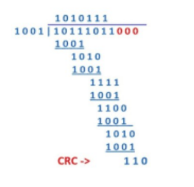

Un altro esempio di hash non sicuro è il **Cyclic Redundancy Check (CRC)**. Essenzialmente, il CRC calcola il resto di una lunga divisione ed è eccellente per rilevare errori di trasmissione casuali (burst errors), poiché è improbabile che errori fortuiti producano una collisione. Tuttavia, per un malintenzionato è un'operazione banale costruire intenzionalmente delle collisioni. Nonostante la sua evidente insicurezza crittografica, il CRC è stato storicamente e rovinosamente impiegato in contesti in cui era richiesta integrità, come nel protocollo di sicurezza wireless **Wired Equivalent Privacy (WEP)**.

### Sicurezza, Complessità Computazionale e Ciclo di Vita

Attaccare una funzione di hash attraverso un metodo a **forza bruta** significa verificare sistematicamente tutte le possibilità fino a trovare la collisione corretta. Questa strada è sempre teoricamente possibile, ma le tempistiche necessarie per le moderne funzioni di hash sono inimmaginabili. Per comprendere la scala, se un computer fosse in grado di calcolare 10.000 hash al secondo, impiegherebbe $10^{27}$ anni per calcolare $2^{128}$ hash. Persino se tutti i computer mai costruiti dall'umanità avessero lavorato incessantemente dall'inizio dell'universo fino a oggi, la probabilità che avessero trovato una collisione sarebbe ancora infinitesimale.

Gli analisti crittografici, pertanto, non ricorrono alla forza bruta pura, ma alla **criptoanalisi**, che mira a sfruttare le debolezze logiche dell'algoritmo, cercando scorciatoie (shortcut) o falle (hole) matematiche. Quando una collisione può essere trovata in un tempo significativamente inferiore rispetto a quello richiesto dalla forza bruta, la funzione di hash viene dichiarata "rotta" (broken).

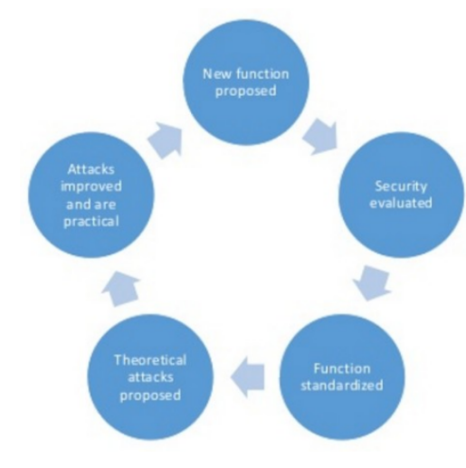

Pertanto, un hash a 56 bit (livello di sicurezza di 56 bit) può essere forzato con $2^{56}$ operazioni. Allo stato attuale, un ammontare di $2^{128}$ operazioni è assolutamente irrealizzabile, mentre $2^{80}$ operazioni iniziano a diventare teoricamente fattibili (con la consapevolezza che calcolare $2^{81}$ operazioni richiede il doppio del tempo rispetto a $2^{80}$). Per garantire un margine di sicurezza adeguato, oggi è richiesto un livello di sicurezza di almeno 80 bit. Analizzando gli algoritmi comuni: l'MD5 offre solo 64 bit di sicurezza ($128/2$), lo SHA-1 offre 80 bit ($160/2$), mentre lo **SHA-256**, l'algoritmo alla base della blockchain di Bitcoin, offre un solidissimo margine di 128 bit di sicurezza ($256/2$). Esistono versioni ancora più potenti come lo SHA-512 che spingono la sicurezza a 256 bit ($512/2$).

Nel panorama reale, gli standard crittografici hanno un ciclo di vita utile di circa 10 anni (come illustrato dai grafici "rainbow chart" storici).

| **Nome**        | **Lunghezza Output (bit)** | **Stato della Sicurezza**                      |
| --------------- | -------------------------- | ---------------------------------------------- |
| MD5             | 128                        | Collisioni trovate                             |
| SHA1            | 160                        | Può essere violato in $\sim 2^{61}$ iterazioni |
| SHA2 -> SHA-256 | 224-512 -> 256             | Nessun attacco noto                            |
| SHA3            | 224-512                    | Nessun attacco noto                            |

Attualmente, algoritmi come SHA1, MD2 e MD4 (creati da Rivest) sono considerati ritirati e vulnerabili. L'MD5 è anch'esso vulnerabile, pur rimanendo tollerato per un'ampia serie di applicazioni non critiche. Gli standard correnti, come la famiglia SHA2 (di cui fa parte lo SHA-256) e SHA3 (noto anche come Keccak), offrono fingerprint a 224, 256, 384 e 512 bit e sono considerati inviolati. Nelle transazioni Bitcoin trova impiego anche l'algoritmo RIPEMD-160 (con output a 160 bit).

### Applicazioni Convenzionali delle Funzioni di Hash

Le funzioni di hash trovano impiego in cinque grandi aree al di fuori delle blockchain: le **firme digitali**, l'**archiviazione delle password**, i **controlli di integrità dei file**, l'**integrità dei dati nelle reti** e la **deduplicazione dei dati** .

Nel campo dell'**archiviazione delle password**, la best practice assoluta vieta di salvare le password in chiaro all'interno dei database. Invece, si calcola l'hash della password e si memorizza solo quest'ultimo. Quando l'utente tenta l'accesso, il sistema calcola l'hash della password appena inserita e verifica se coincide esattamente (match) con l'hash salvato. Questo meccanismo impedisce agli attaccanti di recuperare le password originali anche qualora riuscissero a compromettere e trafugare l'intero database.

I **controlli di integrità (antitampering)** sfruttano i checksum per certificare che un file scaricato o trasmesso su rete non abbia subito alterazioni o corruzioni. L'utente calcola il valore hash del file corrente prima di aprirlo o eseguirlo; se questo valore coincide perfettamente con il checksum (previous digest) fornito originariamente dal creatore, l'integrità del messaggio è confermata e il file non è stato manomesso.

La **deduplicazione dei dati** è un processo vitale per ottimizzare i sistemi di storage. Confrontando i valori hash dei file (o dei blocchi di dati), il sistema può eliminare le copie ridondanti, liberando spazio e migliorando l'efficienza complessiva. Tale approccio è estremamente vantaggioso perché l'hash è di dimensioni minuscole, eliminando la necessità di eseguire costosi confronti byte per byte su file di grandi dimensioni. Programmi storici di file sharing come e-Mule sfruttavano l'algoritmo MD5 proprio per stabilire se due file caricati da utenti diversi fossero identici (ad esempio due ISO di Ubuntu rinominate diversamente), anche se descritti con parole chiave discordanti.

### Vulnerabilità: L'Attacco Rainbow Table e la Proprietà di "Hiding"

Nonostante la robustezza teorica, l'archiviazione delle password basata su hash semplici espone il fianco al cosiddetto **attacco Rainbow Table**. Questo metodo sfrutta l'uso di estese tabelle precompilate di dati, costituite associando preventivamente ogni possibile password in chiaro (solitamente provenienti da set di dizionari o combinazioni comuni) al suo relativo hash generato da una specifica funzione (come l'MD5). Quando un malintenzionato entra in possesso di un database di hash o intercetta un tentativo di login, non deve decodificare nulla: gli basta cercare il digest all'interno della sua immensa tabella; se trova una corrispondenza, ha immediatamente identificato la password in chiaro dell'utente, riducendo drasticamente il tempo necessario per il crack.

| **Plaintext** | **MD5 Checksum**                 |
| ------------- | -------------------------------- |
| 123456        | e10adc3949ba59abbe56e057f20f883e |
| password      | 5f4dcc3b5aa765d61d8327deb882cf99 |
| qwerty        | d8578edf8458ce06fbc5bb76a58c5ca4 |

Il problema di fondo di questo attacco evidenzia una lacuna: la funzione di hash è monodirezionale ed è computazionalmente infattibile derivare l'input dall'output, ma se il dominio di partenza (l'input) è costituito da un insieme di valori ristretto o altamente prevedibile (come le password umane comuni), rintracciare l'input corrispondente a un hash diventa un'operazione banale.

Per ovviare a questo problema serve un livello di sicurezza aggiuntivo, definito come la **proprietà di hiding** (occultamento). La regola stabilisce che, pur possedendo il valore hash $h(x)$, deve rimanere infattibile apprendere qualsiasi informazione utile riguardo al valore originale $x$. Una funzione di hash monodirezionale, da sola, non possiede intrinsecamente questa proprietà. Per ottenerla, si deve ricorrere alla randomizzazione. Si seleziona un valore segreto e casuale $R$ (ad esempio un intero a 256 bit) estratto da una distribuzione con alta "min-entropia", il che garantisce che tutti i valori nella distribuzione abbiano una probabilità trascurabile di essere estratti e che nessun valore sia più probabile degli altri. Questo valore $R$ (il nonce) viene poi concatenato (appended) all'input originale $x$ prima di effettuare l'hash, generando $H(R||x)$. In questo modo, lo spazio di input si espande divenendo estremamente difficile da enumerare; un attaccante che possiede l'hash, ma non conosce la chiave casuale $R$, si troverà nell'impossibilità di dedurre o pre-calcolare il risultato.

### Applicazioni nell'Ecosistema Blockchain: Commitment e Puzzles

Il mondo delle blockchain impiega le funzioni di hash per orchestrare meccanismi complessi che esulano dalla semplice archiviazione, come i protocolli di **commitment**, i **search puzzle** (utilizzati nel Proof of Work di Bitcoin) e gli **hash pointer** (dove l'hash agisce come un riferimento unico e immutabile a un blocco di dati).

I **protocolli di commitment** risolvono un problema strutturale dei sistemi distribuiti privi di un'autorità centrale fidata (trusted third party). Si immagini che Alice e Bob vogliano giocare a "Sasso-Carta-Forbici" attraverso Internet. La regola d'oro della correttezza (fairness) impone che nessuno dei giocatori debba poter decidere o modificare la propria mossa dopo aver appreso quella dell'avversario. Senza un sistema simultaneo e garantito, chiunque comunichi per primo la propria scelta è destinato inevitabilmente a perdere, poiché l'avversario giocherebbe la mossa vincente di conseguenza.

Il **commitment scheme** (schema di impegno) si basa sul principio di "impegnarsi su un valore per rivelarlo solo in seguito". È come inserire la propria scelta in una busta sigillata (fase di commitment) e appoggiarla su un tavolo dove tutti possono vederla; il valore all'interno non può essere alterato poiché è sigillato, ma allo stesso tempo rimane temporaneamente segreto agli occhi altrui. Solo successivamente la busta verrà aperta svelandone il contenuto (fase di rivelazione). Crittograficamente, "sigillare" il valore equivale a calcolarne l'hash, mentre "aprire la busta" corrisponde a rivelare la pre-immagine (il messaggio originale).

Per giocare a Sasso-Carta-Forbici, il protocollo (sfruttando l'API composta dalle funzioni `commit(secret, nonce)` e `verify(com, nonce, value)`) procede in questo modo:

1. Alice esegue per prima la sua mossa, ma non la comunica in chiaro. Genera un valore casuale $R_A$ e calcola l'hash della sua mossa concatenata al valore casuale. Ad esempio, si impegna sulla "carta": $h_A = H(R_A || \text{paper})$.

2. Alice invia esclusivamente il digest $h_A$ a Bob. Grazie alla proprietà di *hiding* (Bob non conosce la randomizzazione $R_A$) e alla *resistenza alla pre-immagine* (l'hash non può essere invertito), Bob è assolutamente incapace di determinare a quale mossa Alice si sia vincolata.

3. Rassicurato dal fatto che la scelta di Alice è ormai bloccata crittograficamente, Bob invia in chiaro la sua mossa ad Alice: "forbici" ($B \rightarrow A$: scissors).

4. A questo punto, Alice sa di aver perso, ma non può assolutamente barare cambiando la sua mossa iniziale. La proprietà di *binding* (vincolo) derivante dalla *resistenza alla seconda pre-immagine*, impedisce ad Alice di trovare un nuovo valore casuale fasullo $R0_A$ tale per cui $H(R0_A || \text{sasso})$ sia uguale al digest $h_A$ generato per la carta. L'impegno è inderogabile.

5. Alice rivela quindi a Bob sia il valore casuale $R_A$ sia la sua mossa originaria ("paper") ($A \rightarrow B$: $R_A$, paper).

6. Bob esegue localmente la funzione di verifica, calcolando lui stesso $H(R_A || \text{paper})$ e confrontandolo con il digest $h_A$ ricevuto all'inizio. Se i valori coincidono, Bob ha la prova matematica che Alice non ha barato e che lui ha vinto la partita. Il medesimo schema può essere esteso affinché entrambi i giocatori si inviino i reciproci *commit* simultaneamente prima della fase di *open* . Questa dinamica fiduciaria è la stessa alla base delle aste online a busta chiusa.

Un'altra colonna portante dei network blockchain è il **Search Puzzle** (o Hash Puzzle), il motore del sistema Proof of Work (POW). A differenza di un attacco alla pre-immagine standard in cui si cerca uno specifico input per un esatto output isolato, il puzzle di ricerca si basa su un attacco alla *pre-immagine parziale*. Il sistema definisce una funzione di hash crittografica $H$, un valore casuale fisso fornito dal protocollo $r$, e un **insieme target (S)** che rappresenta il grado di difficoltà.

L'obiettivo dei miner (i nodi della rete) è trovare un segmento di input mancante (il valore $x$) tale per cui, calcolando l'hash del messaggio concatenato $m = r || x$, il digest risultante $H(m)$ cada all'interno dell'insieme target $S$ ($H(m) \in S$).

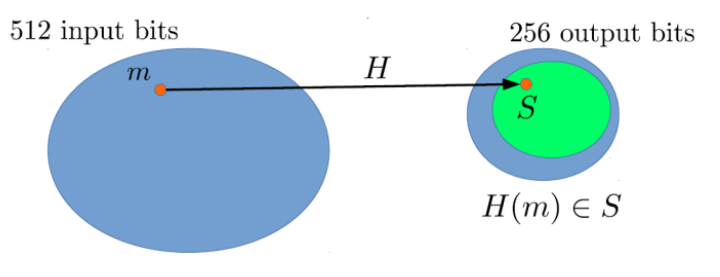

La difficoltà del puzzle viene modulata dinamicamente dal protocollo ridefinendo le dimensioni dell'insieme $S$: se $S$ è grande, trovare un hash che vi ricada all'interno sarà statisticamente meno difficile e richiederà meno potenza di calcolo. Nel caso specifico di Bitcoin, l'insieme $S$ è definito dal numero di "zeri iniziali" che il digest SHA-256 finale deve possedere (ad esempio, un hash valido deve iniziare obbligatoriamente con un certo numero di stringhe `000...`).

### Glossario / Concetti Chiave

- **Attacco Rainbow Table:** Tecnica di decrittazione che riduce i tempi di forzatura delle password confrontando gli hash rubati con un vasto database di coppie (password in chiaro / digest) precalcolate in precedenza.

- **Proprietà di Hiding (Occultamento):** Caratteristica crittografica ottenuta concatenando l'input a un valore segreto e casuale (nonce/R) ad alta entropia. Impedisce a chi possiede l'hash di inferire i dati originali, proteggendo da attacchi a dizionario o rainbow table.

- **Commitment Scheme:** Protocollo crittografico in due fasi (Commit e Open) che permette a un'entità di vincolarsi (binding) a una decisione o a un valore in modo irrevocabile, mantenendolo temporaneamente segreto (hiding) fino alla successiva fase di rivelazione e verifica.

- **Hash / Search Puzzle:** Sfida crittografica alla base del Proof of Work di Bitcoin. Richiede di trovare un input specifico tale che il suo hash finale risulti all'interno di un perimetro target predefinito ($S$), garantendo il dispendio matematicamente verificabile di potenza di calcolo.

---

### Ulteriori Proprietà dell'Hashing e Strutture Decentralizzate

Per concludere l'argomento delle funzioni di hash, è indispensabile citare la proprietà di "puzzle-friendliness". Una funzione di hash $H$ è considerata "amichevole verso i puzzle" (puzzle-friendly) se, per ogni possibile valore di output $y$ a $n$ bit, e supponendo che un valore $k$ sia scelto da una distribuzione con alta min-entropia, risulta computazionalmente infattibile trovare un input $x$ tale che l'equazione $H(k||x)=y$ sia risolta in un tempo significativamente inferiore a $2^n$. Di conseguenza, questa proprietà implica che nessuna strategia analitica per risolvere un search puzzle sia concretamente migliore del tentare in modo esaustivo tutti i possibili valori di $x$.

Tali funzioni robuste trovano la loro massima espressione nelle Tabelle Hash Distribuite (DHT) e nelle Blockchain. Una Distributed Hash Table (DHT) rappresenta una classe di sistema distribuito e decentralizzato che eroga un servizio di ricerca del tutto simile a quello di una tabella hash tradizionale, operando su coppie di "(chiave, valore)". Le coppie di dati vengono archiviate all'interno della DHT in modo che qualsiasi nodo partecipante (peer) possa recuperare in maniera estremamente efficiente il valore associato a una specifica chiave.

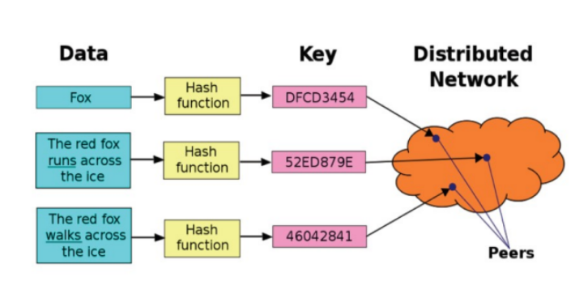

Nel contesto delle criptovalute, Bitcoin impiega una "block chain", la quale è concettualmente una vera e propria catena di hash (hash chain) utilizzata per memorizzare il registro generale delle transazioni (ledger) all'interno di una rete Peer-to-Peer (P2P). Il concatenamento sequenziale degli hash garantisce la totale inviolabilità del registro, una proprietà definita come "tamper freeness" (a prova di manomissione).

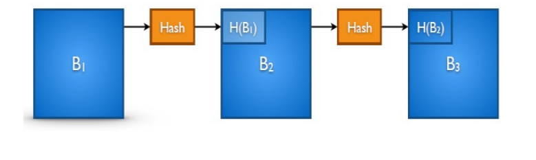

### La Rivoluzione della Crittografia Asimmetrica a Chiave Pubblica

Le architetture moderne si basano su algoritmi a chiave pubblica, i quali sfruttano la crittografia asimmetrica. Questo paradigma si fonda sull'utilizzo di due chiavi matematicamente collegate ma nettamente distinte, denominate rispettivamente chiave privata (Private Key) e chiave pubblica (Public Key). Il principio di base sancisce che ciò che viene crittografato da una chiave, può essere decrittografato unicamente dall'altra, e viceversa. La chiave privata deve essere mantenuta in assoluto segreto e conosciuta esclusivamente dal suo legittimo proprietario, mentre la chiave pubblica è, per l'appunto, di dominio pubblico e accessibile a chiunque. La forza di questo sistema risiede nel fatto che è matematicamente arduo, se non impossibile, derivare la chiave privata partendo dalla conoscenza di quella pubblica.

La crittografia asimmetrica è lo strumento d'elezione per garantire la confidenzialità delle comunicazioni. Se un utente (ad esempio, Alice) desidera inviare un messaggio confidenziale a Bob, ella proteggerà il testo crittografandolo utilizzando la chiave pubblica di Bob. Bob, una volta ricevuto il testo cifrato, dovrà utilizzare la propria chiave privata per decriptare il messaggio e leggerne il contenuto in chiaro. In sintesi, il mittente cripta un'informazione con la chiave pubblica del destinatario, e il destinatario necessita della sua chiave privata, che non ha mai condiviso, per poterla decifrare.

Rispetto ai vetusti algoritmi simmetrici, i sistemi a chiave pubblica offrono vantaggi operativi colossali. Non vi è più alcuna necessità per il mittente e il destinatario di accordarsi in anticipo per scambiarsi e condividere una chiave comune, un processo storicamente rischioso. Affinché un individuo possa ricevere un messaggio crittografato, il mittente necessita esclusivamente di conoscere la chiave pubblica del destinatario. Finché il destinatario custodirà gelosamente la propria chiave privata mantenendola segreta, nessun altro soggetto al mondo sarà in grado di decifrare i messaggi crittografati con la corrispondente chiave pubblica.

### Le Firme Digitali: Dalla Teoria Ingenua all'Ottimizzazione

Passiamo ora a un'applicazione pratica fondamentale della crittografia asimmetrica: le **firme digitali**. Nella vita di tutti i giorni, quando paghiamo con la carta di credito, firmiamo uno scontrino e il venditore verifica che la nostra firma corrisponda a quella stampata sulla carta. Nel mondo digitale ci serve un meccanismo simile ma molto più sicuro, dato che una firma scritta a mano può essere facilmente falsificata.

[INSERIRE IMMAGINE: Un tablet che mostra un blocco di codice binario e il simbolo di una chiave, a rappresentare il metodo di firma digitale tramite crittografia asimmetrica]

Attraverso la firma digitale, il mittente (chiamiamolo Bob) firma un documento per stabilire legalmente di esserne il creatore o il proprietario. Questo sistema è verificabile e non falsificabile (*nonforgeable*): la destinataria (Alice) può dimostrare a chiunque che solo e unicamente Bob ha potuto firmare quel documento. Nello specifico, la firma digitale garantisce tre proprietà essenziali:

- L'**autenticazione**, ovvero la certezza che il messaggio sia stato creato da un mittente riconosciuto.

- Il **non ripudio**, che impedisce al mittente di negare in futuro di aver inviato il messaggio.

- L'**integrità**, che assicura che il documento non sia stato alterato da terzi durante la trasmissione.

### L'Approccio "Ingenuo" e la Verifica della Firma

Per capire come funziona matematicamente, partiamo da un esempio "ingenuo" (*naive*). Chiamiamo $K_B^-$ la chiave privata di Bob e $K_B^+$ la sua chiave pubblica. Bob decide di firmare il suo messaggio $m$ crittografandolo per intero usando la sua chiave privata, creando così il messaggio firmato $K_B^-(m)$. Bob invia poi ad Alice due cose: il messaggio in chiaro $m$, e il messaggio crittografato $K_B^-(m)$. È importante notare che in questo schema di base la confidenzialità non è garantita, dato che il testo viaggia in chiaro affiancato alla sua firma.

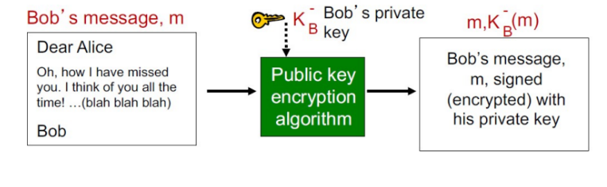

### L'Ottimizzazione: Firmare l'Hash

L'approccio appena visto funziona in teoria, ma ha un grave difetto pratico: crittografare messaggi lunghi richiede troppe risorse ed è un'operazione computazionalmente molto costosa. Per risolvere il problema, si introduce la funzione di hash. Invece di cifrare l'intero documento, il mittente applica una funzione di hash $H$ al messaggio esteso $m$, ottenendo un *digest* di dimensione fissa $H(m)$. A questo punto, il mittente firma (cioè crittografa) esclusivamente questo breve digest, generando l'output $K_B^-(H(m))$.

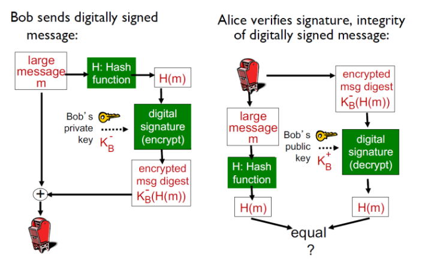

### Il Problema dell'Autenticazione Debole e il "Pizza Prank"

Gli schemi illustrati finora, per quanto robusti, garantiscono solo un'**autenticazione debole** (*weak authentication*). Essi provano matematicamente che chi ha inviato il messaggio possiede la chiave privata associata alla chiave pubblica che abbiamo usato per decifrare la firma. Il problema è che non ci dicono se il mittente è davvero la persona che dichiara di essere; potrebbe benissimo essere un impostore che si sta spacciando per l'utente legittimo creando una propria coppia di chiavi.

Per spiegare questa vulnerabilità, la professoressa usa l'esempio del "pizza prank" (lo scherzo della pizza) ai danni di Bob. Alice decide di fare uno scherzo e crea un finto ordine via e-mail per quattro pizze ai peperoni a nome di Bob. Firma l'ordine usando la *sua* chiave privata e lo invia alla pizzeria. Alice allega all'ordine la sua chiave pubblica, ma mente al negozio dicendo che si tratta della chiave pubblica di Bob. Il sistema informatico del negozio verifica la firma, che matematicamente risulta validissima, e consegna le pizze a Bob (il quale, tra l'altro, detesta i peperoni). L'autenticazione debole, quindi, non basta. Per evitare queste truffe, il mondo reale e i sistemi informatici si affidano ai **certificati digitali** e alle **Autorità di Certificazione** (*Certification Authorities*), ovvero enti terzi fidati che confermano l'identità reale legata a una specifica chiave pubblica.

### Costruzione Tecnica e API delle Firme Digitali

Scendendo nei dettagli di programmazione, le firme digitali si basano su un'API (Interfaccia di Programmazione) composta da tre algoritmi fondamentali: `KeyGen`, `Sign` e `Verify`.

1. L'algoritmo `KeyGen` prende in input un parametro di sicurezza (come la dimensione della chiave) e restituisce una chiave segreta per la firma (`sk`, *secret signing key*) e una chiave pubblica per la verifica (`pk`, *public verification key*).

2. L'algoritmo `Sign` prende in input la chiave segreta `sk` e il messaggio, restituendo la firma cifrata (`sig`).

3. Infine, `Verify` prende in input la chiave di verifica `pk`, il messaggio e la firma, per poi decifrare quest'ultima e restituire `True` (vero) o `False` (falso).

La condizione matematica che deve sempre reggere in questo sistema è: `verify(pk, message, sign(sk, message)) == true`. La vera sfida per chi progetta questi sistemi è evitare che un attaccante possa capire come firmare i messaggi semplicemente analizzando o studiando la chiave di verifica pubblica.

Nella pratica, queste firme digitali sono costruite usando algoritmi standardizzati come l'**RSA** (Rivest Shamir Adleman), che usa una funzione "trapdoor" la cui sicurezza si basa sulla difficoltà matematica del problema della fattorizzazione. Una famosa alternativa è il **DSA**, basato sul problema del logaritmo discreto. Nelle blockchain, e in particolare in Bitcoin, viene utilizzato l'**ECDSA**, che è una variante del DSA progettata per operare sui gruppi di curve ellittiche. In una tipica transazione Bitcoin, l'input contiene la firma e la chiave pubblica dell'utente, mentre l'output contiene il codice (una sorta di *smart contract*) necessario per eseguire l'effettiva procedura di verifica.

### Conclusione: Hashing contro Crittografia

Per chiudere l'argomento, è fondamentale capire bene la differenza tecnica tra crittografia e hashing. La **crittografia** (*encryption*) è un processo bidirezionale ("two way"): richiede l'uso di una chiave per cifrare i dati e permette sempre di tornare al testo originale decifrandolo. Al contrario, l'**hashing** è un processo strettamente monodirezionale ("one-way"). Non esiste nessuna funzione di "de-hashing"; una volta che i dati sono passati per l'algoritmo ed è stato creato il digest, è matematicamente impossibile risalire al testo di partenza.

---

### Glossario / Concetti Chiave

- **Firma Digitale:** Un meccanismo crittografico basato su chiavi asimmetriche che garantisce l'autenticazione, il non ripudio e l'integrità di un messaggio, e che sostituisce in modo molto più sicuro la classica firma scritta a mano.

- **Autenticazione Debole (*Weak Authentication*):** Un limite di sicurezza della crittografia a chiave pubblica; dimostra che il mittente possiede una determinata chiave privata, ma non ne garantisce l'identità reale (come mostra l'esempio del "Pizza Prank"). Per superarlo servono le Autorità di Certificazione.

- **Algoritmi di Firma (RSA, DSA, ECDSA):** Le basi matematiche utilizzate per costruire le firme digitali (tramite le funzioni KeyGen, Sign e Verify). Bitcoin usa specificamente la variante ECDSA, che è basata sulle curve ellittiche.

- **Differenza tra Crittografia e Hashing:** La distinzione cruciale tra un processo reversibile a due vie, che usa chiavi per cifrare e decifrare (crittografia), e un processo irreversibile a una via senza via di ritorno (hashing). 

---

# Lezione 6: Strutture Dati per DHT e Blockchain

## I Puntatori Hash e la Catena di Blocchi

Un concetto cardine per garantire la sicurezza delle strutture dati distribuite è il **Puntatore Hash** (Hash Pointer). A differenza di un puntatore tradizionale, un puntatore hash è composto da due elementi inseparabili: un puntatore classico che indica dove l'informazione è memorizzata fisicamente o logicamente, unito a un hash crittografico di quella stessa informazione.

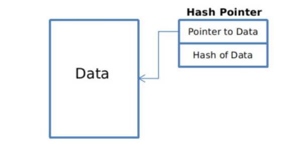

L'idea chiave alla base delle architetture blockchain è proprio quella di costruire intere strutture dati sfruttando questi puntatori hash. La **blockchain**, nella sua accezione più tecnica, non è altro che una lista concatenata in cui i nodi sono uniti tramite puntatori hash. Per calcolare il puntatore hash di un blocco, è necessario eseguire la funzione di hash sull'intero blocco, il che include inevitabilmente anche il puntatore hash che questo blocco possiede verso il suo predecessore. Questo meccanismo a cascata crea un log evidente alle manomissioni (tamper-evident log), che rappresenta la struttura dati di base su cui si fondono criptovalute come Bitcoin ed Ethereum.

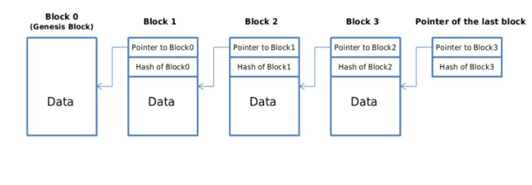

Se un ipotetico avversario tentasse di manomettere i dati contenuti nel blocco $k$-esimo della catena, l'hash memorizzato all'interno del blocco successivo ($k+1$) non corrisponderebbe più ai nuovi dati. La robustezza del sistema è garantita dalla resistenza alle collisioni intrinseca alle funzioni di hash: è computazionalmente infattibile per un malintenzionato modificare i dati in modo tale che il loro nuovo hash sia identico a quello calcolato prima della manomissione. Nei sistemi basati su **Proof of Work** (PoW), il blocco contiene anche la prova crittografica che il calcolo del PoW è stato eseguito con successo. Di conseguenza, se anche un solo bit di dati viene alterato, il Proof of Work deve essere rieseguito non solo per quel blocco, ma per tutti i blocchi successivi ad esso.

Più in generale, i puntatori hash possono essere integrati in qualsiasi struttura dati basata su puntatori che non presenti cicli interni, come ad esempio un Grafo Aciclico Diretto (DAG). Le applicazioni pratiche sono innumerevoli. Una delle prime implementazioni storiche è stata l'Advanced Intelligent Corruption Handling nel software eMule, utilizzato per verificare che un blocco di file scaricato dalla rete non fosse stato manomesso, sfruttando alberi binari con puntatori hash noti come Alberi di Merkle. La blockchain di Bitcoin, come già accennato, utilizza una lista di blocchi di transazioni incatenati tramite puntatori hash, implementando una doppia funzione crittografica (SHA-256 e RIPEMD-160). Similmente, il protocollo IPFS impiega una struttura a Merkle DAG.

---

## Filtri di Bloom e il Problema dell'Appartenenza agli Insiemi

Spostandoci verso l'ottimizzazione delle query, incontriamo il **Problema dell'Appartenenza agli Insiemi** (Set Membership Problem). Si consideri un insieme $S=\{S_{1},S_{2},....,S_{n}\}$ composto da $n$ elementi, dove $n$ è un numero estremamente grande. La necessità tecnica è definire una struttura dati efficiente che supporti query di appartenenza del tipo "$k$ è un elemento di $S$?". Idealmente, una funzione $f(k)$ dovrebbe restituire il valore vero se e solo se $k \in S$, e falso se e solo se $k \notin S$, determinando l'esito unicamente in base alla presenza di $k$ nell'insieme dato.

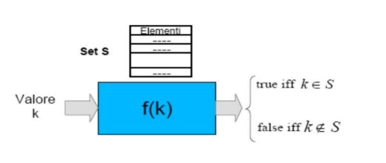

Tuttavia, quando le risorse sono limitate, è necessario virare verso una soluzione approssimata. Il problema si trasforma quindi nella scelta di una rappresentazione degli elementi dell'insieme $S$ che permetta di calcolare il risultato della query in modo efficiente, riducendo drasticamente lo spazio di memoria richiesto. In questo scenario, la funzione $f(k)$ garantisce un risultato "falso" certo se $k \notin S$, ma restituisce un ambiguo "forse $k \in S$" in caso di esito positivo. I risultati vengono quindi approssimati per risparmiare spazio, introducendo la possibilità di ottenere **falsi positivi**. Si delinea così un chiaro compromesso (trade-off) tra lo spazio di memoria richiesto e la probabilità matematica di riscontrare falsi positivi.

### Costruzione e Funzionamento dei Filtri di Bloom

Il **Filtro di Bloom** è la struttura dati probabilistica ideata per risolvere questa specifica problematica. A livello strutturale, viene istanziato a partire da un vettore $B$ (o $S$) costituito da $m$ bit, tutti inizializzati a zero. Per mappare gli $n$ elementi dell'insieme, si definiscono $k$ funzioni di hash indipendenti ($h_{1}, ..., h_{k}$). A livello dimensionale, si assume che il numero di bit $m$ sia di gran lunga superiore al numero di elementi $n$ (generalmente $m > n \cdot k$). Ogni funzione di hash $h_{i}$ esegue una mappatura dall'insieme $S$ a un intervallo $[1..m]$, restituendo un valore distribuito in modo uniforme.

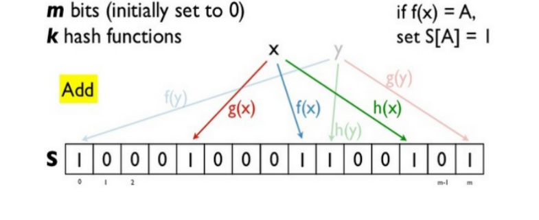

Per inserire un elemento $x \in S$ nel Filtro di Bloom, si applicano tutte le $k$ funzioni di hash all'elemento. Se una funzione restituisce una determinata posizione (ad esempio $f(x)=A$), il bit in quella posizione nel vettore viene impostato a 1 (ossia, si imposta $S[A]=1$). Formalmente, per ogni elemento inserito, il vettore $B$ viene aggiornato in modo tale che $B[h_{j}(x)]=1, \forall j=1,2,...k$. Poiché lo spazio è condiviso, è del tutto normale che un singolo bit del vettore funga da target per più di un elemento.

La fase di **ricerca (Look Up)** per verificare se un elemento $y$ appartiene all'insieme $S$ mappato sul filtro avviene applicando a $y$ le stesse $k$ funzioni di hash. Il sistema conclude che $y \in S$ solo se tutti i bit in quelle specifiche posizioni sono settati a 1 ($B[h_{i}(y)]=1, \forall i=1,...k$). Se, esaminando l'array, si riscontra che anche un solo bit controllato ha valore zero, si ha l'assoluta certezza che l'elemento non appartiene all'insieme ($z \notin S$).

Il prezzo da pagare per questa formidabile efficienza risiede nei **falsi positivi**: la struttura, essendo probabilistica, ci dice che un elemento o non è definitivamente nell'insieme, oppure *potrebbe* esserci. Un falso positivo si verifica quando si interroga il filtro per un elemento non inserito, ma si scopre che tutti i bit restituiti dalle funzioni hash sono comunque pari a 1. Questo accade perché un altro elemento precedentemente inserito, o una combinazione fortuita di altri elementi, ha impostato a 1 quegli stessi identici bit.

## Analisi Matematica: La Probabilità di Falsi Positivi

Per dimensionare correttamente un Filtro di Bloom, è fondamentale valutare matematicamente la probabilità di falsi positivi. Consideriamo la configurazione standard: un insieme di $n$ elementi mappati su un vettore di $m$ bit mediante $k$ funzioni hash. Le funzioni hash impiegate devono essere il più veloci possibile, indipendenti e distribuite uniformemente; non è strettamente richiesto che possiedano robustezza crittografica. A titolo di esempio, varianti del costrutto MD5, come $MD5(x+i)$ oppure $MD5(x||i)$ (dove $i$ è l'indice della funzione di hashing), funzionerebbero adeguatamente.

Basandosi sull'assunto fondamentale che le funzioni di hash si comportino in modo casuale e indipendente, l'analisi matematica può essere condotta applicando il celebre paradigma statistico "balls and bins" (palline e contenitori), modellando il processo come il lancio casuale di $k \times n$ palline all'interno di $m$ secchi.

Il primo passo consiste nel calcolare la probabilità che, dopo aver mappato tutti gli $n$ elementi, uno specifico bit del filtro abbia ancora valore 0. Questa probabilità è data dalla formula $p^{\prime}=(1-\frac{1}{m})^{kn}$, che può essere validamente approssimata all'esponenziale $e^{-kn/m}$. Tale approssimazione deriva direttamente dalla definizione formale del numero di Nepero $e$: $\lim_{x\rightarrow\infty}(1-\frac{1}{x})^{-x}=e$. Da ciò si deduce che, a costruzione ultimata, esattamente una percentuale pari a $e^{-kn/m}$ bit rimarrà a zero.

Se consideriamo ora un elemento estraneo all'insieme e applichiamo le $k$ funzioni hash, genereremo un falso positivo se e solo se tutte e $k$ le funzioni puntano verso un bit già settato a 1. La probabilità matematica che questo evento sfavorevole si verifichi è pari a $(1-e^{-kn/m})^{k}$.

Questa probabilità dipende da due variabili cruciali: il rapporto $m/n$ (ovvero il numero di bit sfruttati per ogni elemento dell'insieme) e il parametro $k$ (il numero di funzioni hash utilizzate). Fissando un determinato rapporto $m/n$, ci si trova di fronte a due fattori apparentemente in conflitto nella scelta del parametro $k$. Da un lato, diminuire $k$ aumenta il numero di bit che rimangono a zero all'interno del filtro, il che dovrebbe intuitivamente far decrescere la probabilità di incappare in un falso positivo. Dall'altro lato, aumentare $k$ incrementa il rigore e la precisione del metodo di verifica (richiedendo più corrispondenze), suggerendo a sua volta che la probabilità di falso positivo dovrebbe diminuire. Trovare l'equilibrio tra questi due fattori determina l'efficienza della struttura.

---

### Glossario e Concetti Chiave

- **Puntatore Hash**: Costrutto formato da un puntatore logico/fisico e dall'hash dei dati puntati. Essenziale per creare architetture *tamper-evident*.

- **Blockchain**: Lista concatenata di blocchi in cui i collegamenti sono realizzati tramite puntatori hash.

- **Proof of Work (PoW)**: Algoritmo di consenso che lega la validità di un blocco al dispendio computazionale. Una manomissione sui dati costringe l'attaccante a ricalcolare il PoW per tutti i blocchi successivi.

- **Set Membership Problem**: Il problema algoritmico di dover stabilire in modo efficiente se un determinato elemento appartiene o meno a un insieme molto vasto.

- **Filtri di Bloom**: Struttura dati probabilistica atta a risolvere in modo approssimato e compatto il problema dell'appartenenza agli insiemi, barattando la certezza matematica con l'efficienza spaziale e ammettendo falsi positivi.

- **Falsi Positivi (Bloom Filter)**: Si verificano quando i bit corrispondenti all'hash di un elemento cercato sono stati accidentalmente settati a 1 da altri elementi pre-esistenti, suggerendo erroneamente la sua presenza nell'insieme.

---

### Dinamiche della Probabilità nei Filtri di Bloom

Riprendendo il concetto di probabilità dei falsi positivi, è cruciale analizzare il comportamento del filtro al variare dei parametri architetturali. Fissato il rapporto $m/n$ (ovvero il numero di bit disponibili per ogni elemento), la probabilità di falsi positivi segue un andamento non lineare rispetto all'aumentare di $k$ (il numero di funzioni di hash). Inizialmente, all'aumentare di $k$, il tasso di falsi positivi diminuisce, ma superata una certa soglia, ricomincia a salire.

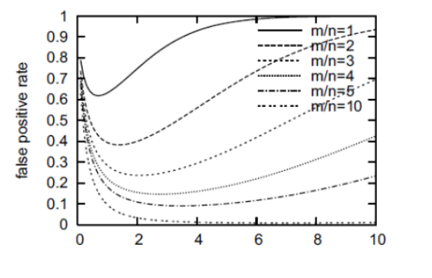

Ad esempio, se imponiamo $m/n=2$, concedendo quindi pochissimi bit per ogni elemento, non è possibile sfruttare "troppe" funzioni di hash. L'eccesso di funzioni finirebbe per saturare rapidamente il filtro riempiendolo di 1, causando l'impennata dei falsi positivi. Al contrario, con un rapporto più generoso come $m/n=10$, l'impiego di un numero maggiore di funzioni di hash abbassa costantemente il tasso di falsi positivi senza mai farlo risalire.

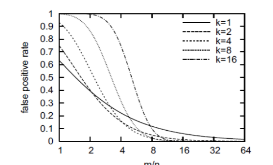

Se invece fissiamo preventivamente il parametro $k$ e facciamo variare la dimensione della struttura, notiamo che la probabilità di incappare in falsi positivi diminuisce in maniera esponenziale all'aumentare di $m$ (la dimensione totale in bit del vettore). Per valori molto bassi di $m/n$, la probabilità di errore si rivela decisamente più alta se si scelgono valori grandi per $k$.

Per dare un'idea concreta dei valori operativi, si consideri la seguente tabella riassuntiva che mette in relazione i bit per elemento ($m/n$), il numero ottimale di funzioni hash ($k$) e la conseguente probabilità di falso positivo ($f$):

| **bits/element (m/n)** | **number of hash functions (k)** | **false-positive probability (f)** |
| ---------------------- | -------------------------------- | ---------------------------------- |
| 2                      | 1.39                             | 0.393                              |
| 8                      | 5.55                             | 0.0216                             |
| 16                     | 11.1                             | $4.59\cdot10^{-4}$                 |
| 24                     | 16.6                             | $9.84\cdot10^{-6}$                 |

Da questi dati emerge che un Filtro di Bloom diventa concretamente efficace quando la dimensione $m$ è pari a una costante $c$ moltiplicata per $n$ ($m = c \times n$), dove $c$ è un valore basso e costante, ad esempio $c=8$. In questo specifico caso, utilizzando 5 o 6 funzioni di hash, si ottengono ottime prestazioni mantenendo una probabilità di falsi positivi decisamente bassa e impiegando un numero limitato di bit.

### Operazioni Logiche sui Filtri di Bloom

I Filtri di Bloom supportano diverse operazioni insiemistiche, essenziali per la gestione di dati distribuiti. L'**Unione** tra due insiemi $S1$ e $S2$, rappresentati rispettivamente dai filtri B1 e B2 (a patto che abbiano lo stesso numero di bit e lo stesso numero di funzioni hash), si ottiene semplicemente calcolando l'operatore logico bit a bit OR (bitwise OR) tra B1 e B2.

L'operazione di **Cancellazione (Delete)**, invece, presenta una complessità intrinseca: non è possibile limitarsi a impostare a 0 tutti i bit indicizzati dall'output delle funzioni hash di un elemento, a causa dei conflitti e delle sovrapposizioni con altri elementi. Per aggirare questo ostacolo, si utilizzano i **Counting Bloom Filters**. In questa variante, ogni cella del filtro non contiene un singolo bit boolean, ma un vero e proprio contatore numerico. Al momento dell'inserimento di un elemento, il contatore viene incrementato; al momento della rimozione, il contatore viene semplicemente decrementato, preservando l'integrità degli altri dati sovrapposti.

Infine, l'**Intersezione** tra due filtri B1 e B2 si calcola attraverso l'operatore AND logico bit a bit (bitwise AND), e fornisce un'approssimazione dell'intersezione reale $S1 \cap S2$. Si parla di approssimazione poiché, se un bit risulta settato a 1 in entrambi i filtri, ciò può dipendere da due scenari. Nel primo scenario (nessuna approssimazione), il bit corrisponde effettivamente a un elemento presente sia in $S1$ che in $S2$. Nel secondo scenario, il bit corrisponde a un elemento esclusivo di $S1 \setminus (S1 \cap S2)$ nel primo filtro, e a un elemento del tutto diverso esclusivo di $S2 \setminus (S1 \cap S2)$ nel secondo filtro. In questo caso, il bit a 1 nel risultato non riflette alcun elemento realmente presente nell'intersezione.

### Casi d'Uso Reali dei Filtri di Bloom

Le applicazioni dei Filtri di Bloom nel panorama informatico sono vaste e nevralgiche. Nel contesto di Bitcoin, l'insieme $S$ mappato sul filtro può essere un insieme di indirizzi crittografici. I nodi leggeri (light weight o mobile nodes), in particolare i client **SPV** (Simplified Payment Verification), non memorizzano l'intera mole della blockchain. Essi costruiscono un Filtro di Bloom contenente esclusivamente gli indirizzi di loro interesse (quelli da cui inviano o ricevono transazioni) e lo trasmettono a un nodo completo (Full node).

Il nodo completo, ricevendo i nuovi blocchi, utilizza questo filtro per verificare rapidamente se qualche transazione all'interno del blocco corrisponde agli indirizzi del client leggero. Questo approccio garantisce un enorme risparmio di banda e un notevole livello di privacy.

Nel network Ethereum, logiche simili sono impiegate per riassumere gli eventi generati dagli smart contract. Per trovare tutti i token venduti da uno specifico utente all'interno di un blocco da 500 transazioni, anziché analizzare sequenzialmente ogni singola transazione, il sistema interroga un **log bloom** inserito nell'header (intestazione) del blocco. La ricerca approfondita all'interno del blocco viene innescata solo se il filtro segnala una potenziale corrispondenza (hit). Al di fuori del mondo blockchain, il browser web Google Chrome utilizza un Filtro di Bloom memorizzato localmente per catalogare URL malevoli: ogni URL visitato viene prima controllato contro il filtro locale e, solo in caso di riscontro positivo, viene effettuato un controllo completo in rete. Allo stesso modo, architetture database imponenti come Google BigTable usano questi filtri per evitare costosi accessi ai dischi di memoria, aumentando in modo considerevole le prestazioni delle query.

---

## Lo Storage di File Autenticati e il Problema del Recupero Parziale

Un altro scenario applicativo cruciale per le strutture distribuite è l'**Authenticated File Storage** (Archiviazione Autenticata di File). Si consideri un client (che funge da *verifier*) che desidera memorizzare un file con identificatore $F$ e contenuto $D$ su un server esterno. Gli scopi (use cases) principali includono il risparmio di spazio di archiviazione locale (es. cloud storage come Microsoft OneDrive, Apple iCloud, Dropbox, Google Drive) e la garanzia di ridondanza per i backup.

Il flusso operativo di base prevede che il client invii il file al server, il server lo memorizzi come coppia $(F, D)$, e il client proceda a cancellare i dati $D$ dal proprio disco locale. A distanza di tempo, il client richiede $F$, il server restituisce il dato e il client lo recupera. Tuttavia, sorge una problematica di sicurezza fondamentale: cosa succede se il server viene corrotto o compromesso e restituisce un contenuto alterato $D^{\prime} != D$? La soluzione più banale sarebbe non cancellare affatto la copia locale e confrontare i file, ma questo vanificherebbe l'intero scopo dell'archiviazione remota, specialmente se il client è a corto di memoria.

Una soluzione più intelligente prevede che il client calcoli e memorizzi localmente solo l'hash dei dati, $H(D)$, prima di cancellare il file. Al momento del recupero, il client confronterà l'hash del file ricevuto $H(D^{\prime})$ con l'hash originale $H(D)$ archiviato. Ma questa soluzione genera a sua volta una nuova limitazione: cosa accade se il client ha bisogno di scaricare solo un singolo byte o una piccolissima parte del file? Non c'è modo di autenticare solo quel frammento senza dover per forza scaricare l'intero file per ricalcolarne l'hash globale. L'idea risolutiva è quella di aggiungere una struttura logica più complessa all'impegno crittografico (commitment), abbandonando l'uso di un singolo hash monolitico in favore di una **gerarchia di hash**.

---

## Gli Alberi di Merkle (Merkle Trees)

La soluzione ottimale al problema appena esposto è fornita dai **Merkle Trees**, strutture dati introdotte dal crittografo Ralph Merkle nel 1979. Un Albero di Merkle è concepito per riassumere grandi quantità di dati con un duplice obiettivo: l'efficienza nella verifica dei dati e la sicurezza della loro integrità. Esso permette infatti di dimostrare in modo inconfutabile che uno specifico segmento di dati appartiene al dataset originario senza dover ispezionare l'intero insieme, garantendo parallelamente che non vi siano state manomissioni (tampering), utilizzando solo un ristrettissimo pacchetto di informazioni.

A livello architetturale, un Albero di Merkle è un albero binario completo e pieno (complete full binary tree) costituito da hash crittografici, generato a partire da un insieme iniziale di dati $\{f_{1}, ... f_{i}, ... f_{n}\}$. Il processo di costruzione, assumendo di avere $n$ blocchi di dati ($x_{1}, x_{2}, ..., x_{n}$) con $n$ che è una potenza di 2, parte dalla base. L'i-esima "foglia" (leaf) dell'albero memorizza l'hash $h_{i}$ del corrispondente dato $f_{i}$ (o $x_{i}$). Salendo di livello, ogni nodo interno immagazzina l'hash risultante dalla concatenazione degli hash dei propri nodi figli. Matematicamente, l'operazione in un nodo interno è espressa come $H(x, y) = H(x || y)$, dove il simbolo $||$ rappresenta la concatenazione crittografica.

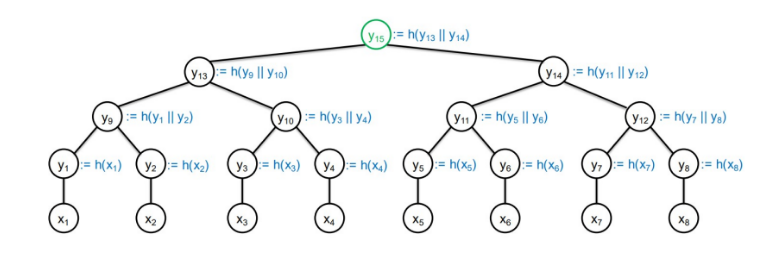

Questo processo iterativo continua fino a confluire nell'unico nodo al vertice della struttura. L'ultimo hash calcolato e conservato nella radice, nonché il "commitment" finale, prende il nome di **Merkle Root Hash** (nell'esempio delle slide, indicato come $y_{2n-1}$ o specificamente $y_{15}$ per 8 blocchi di dati). È sufficiente salvare questo singolo valore per avere la garanzia crittografica dell'intero set di dati sottostante.

### Prove di Appartenenza (Merkle Proofs)

L'utilità suprema di questa struttura risiede nella **Merkle Proof** (Prova di Merkle o prova di inclusione). Supponiamo di possedere un frammento di dato $D$ e di voler dimostrare a un Verifier che esso corrisponde al blocco originale $x_{4}$ contenuto nell'albero. Per farlo, il Prover (il server) non ha bisogno di inviare tutti gli $x_{i}$ originari. Sarà sufficiente fornire al client i cosiddetti "nodi fratelli" (siblings) calcolati lungo il percorso che va dalla foglia di interesse fino alla radice.

Nel nostro caso specifico, per dimostrare l'appartenenza di $x_{4}$, il Prover esibirà i seguenti hash fratelli: $y_{3}$, $y_{9}$ e $y_{14}$. Il Verifier, a questo punto, eseguirà le seguenti operazioni in totale autonomia:

1. Calcolerà in proprio $z_{4} = h(D)$.

2. Calcolerà l'hash del padre concatenando con il fratello fornito: $z_{10} = h(y_{3} || z_{4})$.

3. Salirà ancora di livello: $z_{13} = h(y_{9} || z_{10})$.

4. Calcolerà infine l'hash radice: $z_{15} = h(z_{13} || y_{14})$. Se e solo se il risultato finale $z_{15}$ corrisponde in modo esatto all'hash radice fidato ($y_{15}$) in possesso del client, l'integrità e l'appartenenza del blocco $D$ sono provate oltre ogni ragionevole dubbio.

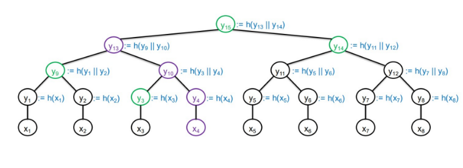

Analizzando le performance computazionali, la costruzione dell'albero necessita di $O(n)$ in termini di spazio e di computazione di hash. La dimensione del commitment è eccezionale: solamente $O(1)$, corrispondente di fatto a un root a 256-bit. Le Merkle Proofs eccellono in efficienza richiedendo un tempo di calcolo, uno spazio di memoria e un numero di hash da verificare pari a soli $O(\log n)$. In termini di consistenza, questo meccanismo annulla i falsi negativi (è sempre possibile costruire una prova corretta se il dato appartiene effettivamente all'insieme) e rende computazionalmente inattuabili i falsi positivi: superare il test con dati alterati significherebbe trovare deliberatamente un "falso fratello" in grado di restituire l'hash genitore corretto, operazione che equivale a forzare la resistenza alle collisioni della funzione crittografica.

### Prove di Non Appartenenza

La versatilità dell'Albero di Merkle si estende alla capacità di provare anche la non-appartenenza di un dato all'insieme $\{x_{1}, x_{2}, ..., x_{n}\}$. Per abilitare questa funzione, è necessaria una modifica in fase costruttiva: le foglie dell'albero devono essere ordinate preventivamente secondo un criterio specifico (arranged in sorted order). Quando si rende necessario dimostrare che un dato elemento $Data$ non è membro dell'insieme, si individua l'indice $i$ tale per cui, in base all'ordinamento, l'elemento dovrebbe idealmente cadere nello spazio logico $x_{i} < Data < x_{i+1}$. A questo punto, il Prover genera semplicemente due Merkle Proof standard di appartenenza: una per l'elemento alla posizione $i$ ($x_{i}$) e una per l'elemento alla posizione immediatamente successiva $i+1$ ($x_{i+1}$). Verificando l'adiacenza di questi due elementi certificati, il client deduce in maniera inoppugnabile che non c'è "spazio" fisico per il dato contestato, provandone l'assenza.

### Implementazione del Protocollo di Storage Autenticato

Unendo questi concetti, il protocollo di storage basato su Merkle Tree assume una forma robusta ed elegante. Alice (il client) inizia inviando i dati del file $D$ al server. Prima di cancellare i file, Alice genera localmente l'Albero di Merkle e ne salva esclusivamente il Merkle Tree Root (MTR), evitando categoricamente di memorizzare l'intero albero o file. Quando in futuro Alice chiederà al server la restituzione di una specifica porzione (chunk) $x$ del suo file, il server le consegnerà il frammento $x$ accompagnato dalla Merkle proof $\pi$. Alice assumerà il ruolo di Verifier e testerà se la prova $\pi$ fornita dal Prover (il server) è coerente rispetto al Root da lei archiviato segretamente.

Le applicazioni industriali di questo paradigma dominano l'attuale ecosistema dei sistemi distribuiti. La rete IPFS sfrutta architetture basate su Merkle, così come Bitcoin utilizza i Merkle Tree per immagazzinare crittograficamente le liste di transazioni all'interno dei blocchi. Nel mondo dei database distribuiti cloud, giga-infrastrutture come Amazon Dynamo, Google BigTable, Apache Cassandra, HBase e ZFS traggono linfa vitale da questi meccanismi di indicizzazione. Allo stesso modo, network storici P2P come Gnutella, DC++ e LimeWire operavano con principi simili. L'ecosistema Ethereum compie un ulteriore balzo evolutivo, utilizzando una versione ancora più sofisticata: il Merkle-Patricia Trie.

## La Struttura Dati Trie (Prefix Tree)

Prima di esplorare la variante complessa usata in Ethereum, è essenziale padroneggiare le basi analizzando il **Trie**, noto anche come Radix tree o **Prefix tree** (albero dei prefissi). Il termine "Trie" (la cui pronuncia accademica corretta è "try") deriva dalla parola inglese "retrieval" (recupero). Si tratta di una struttura dati creata per ottimizzare l'elaborazione intensiva di stringhe, ed è il motore silenzioso dietro i motori di ricerca, i dizionari digitali e gli algoritmi di elaborazione del linguaggio naturale (NLP).

Il Trie è strutturato in modo che le "chiavi" (keys) siano tipicamente stringhe di testo. Gli spigoli (edges) o rami che uniscono i nodi sono etichettati con le singole lettere dell'alfabeto. Seguendo un percorso (path) dal nodo radice verso il basso, la sequenza di rami attraversati definisce fisicamente la composizione della stringa. I nodi includono un indicatore di stato che si attiva per demarcare che quel particolare nodo rappresenta la fine compiuta di una parola valida. Una delle particolarità più interessanti è che, in un Trie, ogni nodo eccetto la radice rappresenta a tutti gli effetti il prefisso di una stringa (da cui il nome prefix-tree). Ad esempio, in un dizionario della lingua inglese, il numero massimo teorico di diramazioni che possono partire da un singolo nodo è 26, corrispondente al numero di lettere dell'alfabeto.

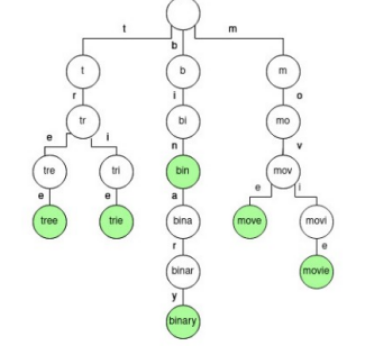

### Dinamiche di Inserimento e Ricerca nel Trie

Per capire operativamente il Trie, immaginiamo l'inserimento della stringa "tree" in una struttura vuota. Il percorso partirà dalla radice con un ramo 't', raggiungerà un nodo intermedio e scenderà nel ramo 'r', poi 'e', e infine un ulteriore ramo 'e', marcando il nodo finale.
Se volessimo ora inserire la stringa "trie", la struttura non ricreerebbe l'intera sequenza. Verrebbe infatti riconosciuto che il prefisso "tr" esiste già in memoria. Il sistema aggiungerebbe semplicemente una biforcazione sul ramo 'i' a partire dal nodo corrispondente al prefisso "tr", proseguendo poi col ramo 'e' e il relativo marcatore finale. Se decidessimo di inserire la stringa "binary", il sistema, non trovando prefissi corrispondenti a partire dalla lettera 'b', costruirebbe ex novo il percorso "b -> i -> n -> a -> r -> y".
Se inseguito dovessimo aggiungere la parola "bin", non verrebbe creato alcun nuovo nodo, dato che il prefisso "bin" è già tracciato come parte strutturale della stringa "binary". In questo caso, il Trie si limiterebbe ad attivare il marcatore (highlight) del nodo che risiede al termine del percorso "b -> i -> n", indicando la presenza di una nuova stringa compiuta di senso.

La fase di interrogazione (searching) di un Trie rispecchia l'inserimento. L'algoritmo discende a cascata dall'albero, partendo dalla radice, e seleziona i bivi in base ai singoli caratteri letti in sequenza nella stringa di ricerca. Se si riesce a esaurire l'intera stringa e il nodo finale raggiunto è contrassegnato dal marcatore, la ricerca ha avuto successo. Al contrario, se ci si ritrova bloccati a metà strada in un nodo privo del ramo corrispondente alla lettera successiva, oppure se si termina la stringa ma il nodo di arrivo è privo del marcatore, si deve concludere che la parola non è presente nel dataset.

---

### Glossario e Concetti Chiave

- **Log Bloom**: Filtro di bloom integrato nell'header dei blocchi (es. Ethereum) utile per indicizzare e localizzare rapidamente gli eventi o transazioni d'interesse all'interno di un grosso blocco.

- **Merkle Root Hash**: L'hash crittografico terminale posto alla radice di un Albero di Merkle, che funge da *commitment* unificatore capace di validare l'integrità matematica dell'intero set di dati sottostante.

- **Merkle Proof (Prova di Inclusione)**: Dimostrazione crittografica compatta ($O(\log n)$) costituita unicamente dalla lista dei "nodi fratelli" indispensabili per ricalcolare l'hash di radice, verificando così l'appartenenza di una foglia all'albero.

- **Trie (Prefix Tree)**: Struttura dati ad albero specializzata nella memorizzazione ottimizzata di stringhe, in cui i nodi intermedi non memorizzano i dati stessi, ma ne incarnano strutturalmente il prefisso in base al percorso intrapreso.

- **Nodi Marcati (nel Trie)**: Flag o indicatore logico posizionato su un nodo specifico dell'albero per certificare che il percorso seguito dalla radice a quel punto compone una parola intera valida e inserita.

---

### Completamento delle Dinamiche del Trie

Per consolidare il funzionamento del **Trie** (o Prefix Tree), consideriamo l'inserimento di due ulteriori stringhe nel nostro albero di esempio: "movie" e "bin". Se inseriamo "movie", l'algoritmo rileva che il prefisso "mov" è già ampiamente rappresentato (ipotizzando di aver precedentemente inserito "move"). Di conseguenza, la struttura si limiterà ad aggiungere una nuova ramificazione a partire dal percorso esistente `m -> o -> v`, aggiungendo il ramo `i` seguito da `e`, e infine apponendo il marcatore di validità sul nodo terminale. Ancora più interessante è il caso dell'inserimento della parola "bin". Questa stringa è l'esatto prefisso di una parola già inserita in precedenza ("binary"). In questo scenario non viene creato assolutamente alcun nuovo nodo o ramo: il sistema si limita a "marcare" (rendendolo un nodo terminale valido) il nodo già esistente alla fine del percorso `b -> i -> n`.

Nonostante la rappresentazione a Trie permetta operazioni di ricerca estremamente veloci, il suo più grande difetto risiede nell'altissimo requisito di spazio in memoria (space requirement is high). Osservando l'albero appena costruito, si nota immediatamente che la stragrande maggioranza dei nodi intermedi possiede un solo figlio (one child). L'idea risolutiva è quindi quella di **comprimere il Trie**: combinando i nodi che presentano una singola discendenza, è possibile ridurre drasticamente la dimensione complessiva dell'albero. Questo principio di compressione è l'idea fondante che ha dato vita ai Patricia Trie.

---

## I Patricia Tries: Ottimizzazione Spaziale

Il termine **PATRICIA** è in realtà un acronimo introdotto nel 1960, che sta per *Practical Algorithm To Retrieve Information Coded In Alphanumeric*. Si tratta di un Trie ottimizzato in termini di spazio.

Il principio logico è semplice: avere lunghe catene di nodi con un solo figlio (ad esempio per immagazzinare stringhe sequenziali come *Ann, Anna, Annab, Annabe, Annabel...*) costituisce un enorme spreco di risorse (wasteful). In un Patricia Trie, qualsiasi percorso isolato composto da nodi non marcati (cioè che non rappresentano la fine di una parola) e che costituiscono gli unici figli della catena, viene fuso (merged) in un singolo spigolo. L'etichetta di questo nuovo spigolo fuso non sarà più una singola lettera, ma l'esatta concatenazione delle etichette dei nodi originali accorpati.

Rispondendo alla domanda accademica *"perché non etichettare i rami con stringhe di più caratteri per ridurre le dimensioni dell'albero?"*, il Patricia Trie fa esattamente questo. Il risultato finale è un albero strutturalmente denso, in cui ogni singolo nodo interno possiede rigorosamente almeno due ramificazioni, eliminando del tutto le catene lineari a figlio singolo.

---

## Il Merkle Patricia Trie (MPT)

Unendo i puntatori crittografici visti nella prima parte della lezione e l'ottimizzazione testuale appena descritta, arriviamo all'**Authenticated Patricia Trie**, formalmente noto come **Merkle Patricia Trie (MPT)**. Si tratta di una combinazione perfetta:

- I **Patricia Tries** sono utilizzati per abilitare ricerche fulminee e memorizzare le chiavi raggruppando i percorsi comuni in nodi singoli.

- I **Merkle Trees** vengono sovrapposti per garantire l'integrità assoluta dei dati e la validazione a prova di manomissione (tamper proof validation).

Questa nuova struttura dati ibrida è stata introdotta ufficialmente nello *Yellow Paper* di Ethereum, rendendola unica nel panorama accademico per la sua capacità di combinare le peculiarità di entrambe le architetture. Oggi è adottata non solo da Ethereum per rappresentare lo stato crittografico degli account e degli smart contract, ma anche da quasi tutte le blockchain basate su EVM (Ethereum Virtual Machine). L'organizzazione prevede che l'albero raggruppi i percorsi comuni (in stile Patricia), ma parallelamente **ogni singolo nodo viene sottoposto ad hashing crittografico**, creando una catena di Merkle Proof ininterrotta.

### Gestione delle Coppie (Chiave, Valore) e Nibble

I Trie non sono limitati alla sola rappresentazione di stringhe testuali fini a se stesse, ma possono essere efficacemente utilizzati per rappresentare dizionari di coppie **(Chiave, Valore)**. In questa declinazione, viene gestita una lista di chiavi dove a ogni chiave è associato un valore di ritorno. Le chiavi, trattate come stringhe, definiscono il percorso all'interno dell'albero, mentre il "valore" effettivo (ad esempio il saldo di un account) viene immagazzinato fisicamente nel nodo che si trova alla fine esatta del percorso dettato dalla chiave. Ethereum sfrutta questo meccanismo per memorizzare l'intero stato dinamico dei suoi contratti.

Per consentire una condivisione dei prefissi ancora più granulare ed efficiente, il Merkle Patricia Trie di Ethereum scompone i dati in **Nibble** (mezzi byte) anziché in byte interi o caratteri ASCII. Un Nibble corrisponde esattamente a 4 bit ed è rappresentabile con un singolo carattere **Esadecimale** (da `0` a `f`). Ad esempio, la lettera `d` corrisponde in ASCII al byte binario `01100100`. Questo byte viene spaccato a metà:

- I primi 4 bit `0110` formano il primo Nibble, che in esadecimale equivale a `6`.

- Gli ultimi 4 bit `0100` formano il secondo Nibble, che in esadecimale equivale a `4`.

Le funzioni di hash applicate ai nodi generano poi indirizzi crittografici unici di puntamento, come ad esempio `0x98dd4acc`, `0x0f0f9344`, o `0x01d41b76`.

### La Tipologia dei Nodi nel MPT

Per gestire questa granularità, il Merkle Patricia Trie impiega tre distinte categorie di nodi:

1. **Leaf Node (Nodo Foglia)**: Memorizza i nibble finali (EndNibbles) che compongono la coda della chiave e, soprattutto, immagazzina il **valore** finale associato a tale chiave.

2. **Shared Node / Extension Node (Nodo Condiviso)**: Creato quando più chiavi condividono un lungo prefisso. Memorizza i nibble condivisi (SharedNibbles) e un puntatore hash crittografico che rimanda al nodo di diramazione successivo (Next).

3. **Branch Node (Nodo di Diramazione)**: È il crocevia dove due o più prefissi si separano. È costituito logicamente da un array di **16 elementi**, uno per ogni possibile carattere esadecimale (da `0` a `f`), più un 17esimo campo destinato a contenere un eventuale Valore, nel caso in cui una chiave termini esattamente in quel nodo di diramazione.

---

## Esempio Pratico di Inserimento e Modifica

Mettiamo alla prova la struttura inserendo sequenzialmente il seguente set di chiavi (parole) e relativi valori semantici:

- "do" (esadecimale `64 6f`) $\rightarrow$ Valore: "verb"

- "dog" (esadecimale `64 6f 67`) $\rightarrow$ Valore: "puppy"

- "doge" (esadecimale `64 6f 67 65`) $\rightarrow$ Valore: "coin"

- "horse" (esadecimale `68 6f 72 73 65`) $\rightarrow$ Valore: "stallion"

**Fase 1: Inserimento di 'do'** Il sistema è vuoto. Viene creato un nuovo *Leaf Node*. Esso conterrà l'hash del nodo (es. `00008f04`), la chiave completa nei suoi nibble esadecimali (`646f`) e il valore testuale ("verb").
| H | EndNibbles | Value |
| :--- | :--- | :--- |
| `00008f04` | `646f` | verb |

**Fase 2: Inserimento di 'dog' ('puppy')** Inserendo la chiave successiva, il sistema riconosce una collisione di prefisso : la sequenza 'do' (`646f`) è in comune tra le due parole. Si procede all'espansione del nodo foglia. Viene creato uno *Shared Node* per raggruppare il prefisso comune, il quale a sua volta punta tramite hash a un nuovo *Branch Node*.

Il nodo condiviso assumerà questa forma:
| H | SharedNibbles | Next (Pointer) |
| :--- | :--- | :--- |
| `ba476c6f` | `646f` | `9fb93297` |

Nel *Branch Node* (che ha hash `9fb93297`), la chiave "do" termina il suo percorso, quindi il valore "verb" viene inserito direttamente nel campo Valore del nodo di diramazione. In corrispondenza dell'indice esadecimale `7` (il nibble successivo necessario per formare "dog"), viene inserito un puntatore crittografico che rimanda a un nuovo *Leaf Node* contenente il valore finale "puppy". Questo puntatore hash che lega il branch node alla nuova foglia è l'essenza stessa della componente Merkle della struttura.

**Fase 3: Struttura Completa e Manomissione** Iterando il processo per tutte le parole, noteremo che tutti i prefissi inseriti iniziano con il nibble `6` (`64` per le prime tre, `68` per horse). Il MPT creerà dunque un nodo condiviso radice esclusivamente per il nibble `6`. Terminata la costruzione, l'albero calcolerà l'hash di root globale, che in questo scenario risulterà essere `fa6dc296`.

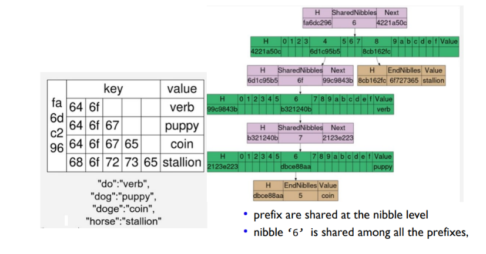

La vera potenza della struttura si manifesta in fase di **modifica**. Cosa accade se alteriamo un singolo dato in profondità nell'albero? Supponiamo di aggiornare il valore della chiave "horse", cambiandolo da "stallion" a "pony". Il Leaf Node finale assumerà un nuovo hash (nell'esempio `e53aed38`). Essendo legato crittograficamente ai suoi genitori, questa variazione di hash si propagherà a cascata verso l'alto (effetto valanga), andando a mutare l'hash di tutti i nodi sovrastanti. Di conseguenza, il Root Hash globale muterà irreversibilmente, passando da `fa6dc296` al nuovo valore `e6ed1967`.

### Il Ruolo in Ethereum

Questa architettura rende computazionalmente impossibile manomettere o falsificare lo stato della rete senza invalidare all'istante l'intera Root crittografica. La Blockchain di Ethereum memorizza nativamente tramite Merkle Patricia Tries lo stato globale di tutti i contratti e le transazioni raggruppate nei blocchi. Nello "State Trie" di Ethereum, ogni registrazione è una combinazione chiave-valore. Tipicamente, la chiave crittografata rappresenta l'**indirizzo** di uno specifico account (o smart contract), mentre il valore associato corrisponde al bilancio dell'account (balance) o allo storage persistente del contratto. Per le ricevute delle transazioni, il valore indicherà invece parametri come gli importi trasferiti e gli esiti dell'esecuzione.

---

### Glossario e Concetti Chiave

- **Patricia Trie**: Struttura dati (Prefix Tree compresso) che evita lo spreco di memoria raggruppando i percorsi lineari costituiti da nodi a figlio singolo in rami unici con etichette concatenate.

- **Merkle Patricia Trie (MPT)**: Struttura ibrida impiegata massivamente da Ethereum. Combina la velocità di ricerca e compressione testuale dei Patricia Trie con i puntatori crittografici (hash) degli Alberi di Merkle, garantendo che ogni minima modifica a un valore modifichi l'Hash Root del sistema.

- **Nibble**: Unità informatica corrispondente a mezzo byte (4 bit), comodamente rappresentata da un singolo carattere esadecimale (0-f). Consente al MPT una condivisione estremamente fine dei prefissi.

- **Architettura a 3 Nodi (Leaf, Extension, Branch)**: Il paradigma logico su cui si poggia il MPT per scomporre le chiavi esadecimali, dove i *Branch* dividono il percorso in sedici potenziali vie, gli *Extension* accorpano i nibble identici e i *Leaf* custodiscono l'informazione semantica finale.

---

# Lezione 7: P2P Systems and Blockchains: Introduzione alle Blockchain

### Concetti Fondamentali e Struttura della Blockchain

A colpo d'occhio, una **blockchain** può essere definita come un registro (ledger) replicato e distribuito tra i nodi di una rete peer-to-peer. La forza di questo sistema risiede nel fatto che tutti i nodi possiedono un'identica replica del registro, rendendolo di fatto immutabile. I vantaggi di questa inalterabilità (tamper-freeness) permettono alla blockchain di agire come una sorta di notaio digitale, introducendo concetti fondamentali come il consenso in un ambiente distribuito, la prova di proprietà (proof of ownership) e la differenziazione tra blockchain permissioned e permissionless.

Guardando all'interno di un singolo blocco, possiamo identificare tre componenti essenziali: i dati veri e propri, l'hash del blocco e l'hash del blocco precedente. Nel contesto specifico delle criptovalute, i dati non sono altro che transazioni che trasferiscono una determinata somma di denaro tra due entità. Ad esempio, una transazione indicherà il mittente (FROM: Alice), il destinatario (TO: Bob) e l'ammontare trasferito (AMOUNT).

### Il Ruolo degli Hash Pointer e l'Inalterabilità

Il collegamento tra i blocchi è garantito fisicamente e logicamente dagli **hash pointer**. Includendo l'hash del blocco precedente, si viene a creare l'effettiva "catena" che rende la blockchain a prova di manomissione. Partiamo ad esempio da un Genesis Block, che possiede un suo Hash (A2F3) e un Previous Hash convenzionalmente nullo (0000). Il blocco successivo avrà il proprio Hash (B43C) e indicherà A2F3 come Previous Hash. Se un malintenzionato alterasse quest'ultimo blocco, il suo Hash cambierebbe radicalmente (ad esempio in H62Y). Di conseguenza, il blocco ancora successivo, che puntava a B43C (con un Hash E56D), non sarebbe più valido, rompendo l'integrità della catena. Ripristinare questa validità non comporterebbe solo il ricalcolo degli hash successivi, ma imporrebbe all'attaccante di trovare un nuovo valore che, combinato con il nuovo hash, risolva la complessa crittografia della Proof of Work, rendendo l'attacco computazionalmente proibitivo. Esistono comunque anche altre blockchain che impiegano meccanismi differenti per garantire questa sicurezza.

### L'Astrazione del Ledger e la Necessità di Consenso

La prima astrazione fondamentale per comprendere il sistema è proprio il **ledger** (registro). Questo strumento si comporta come una bacheca che immagazzina operazioni, mantenendone un rigoroso ordine cronologico sotto forma di lista di eventi in modalità append-only (solo aggiunta).

| **Date**      | **Description**      | **Increase** | **Decrease** | **Balance** |
| ------------- | -------------------- | ------------ | ------------ | ----------- |
| Jan. 1, 20X3  | Balance forward      |              |              | $ 50,000    |
| Jan. 2, 20X3  | Collected receivable | $ 10,000     |              | 60,000      |
| Jan. 3, 20X3  | Cash sale            | 5,000        |              | 65,000      |
| Jan. 5, 20X3  | Paid rent            |              | 7,000        | 58,000      |
| Jan. 7, 20X3  | Paid salary          |              | 3,000        | 55,000      |
| Jan. 8, 20X3  | Cash sale            | 4,000        |              | 59,000      |
| Jan. 8, 20X3  | Paid bills           |              | 2,000        | 57,000      |
| Jan. 10, 20X3 | Paid tax             |              | 1,000        | 56,000      |
| Jan. 12, 20X3 | Collected receivable | 7,000        |              | 63,000      |

Un registro di questo tipo richiede proprietà stringenti: deve essere a prova di manomissione, garantire verificabilità (come un notaio) e, soprattutto, necessita che tutti i partecipanti concordino sul suo contenuto attraverso il consenso. Non si tratta solo di applicazioni finanziarie, ma di qualsiasi sistema che necessiti di un registro cronologico degli eventi. Pensiamo al caso di Alice, che possiede un'azienda intermediaria tra venditori all'ingrosso (wholesale) e al dettaglio (retail). I fornitori inviano le merci ad Alice, la quale a sua volta le trasferisce ai negozianti. Poiché gestire centralmente un registro coerente per centinaia di interlocutori risulta complesso, Alice decide di condividere il ledger con tutti loro. Tuttavia, se ognuno mantiene e aggiorna una propria copia, emerge prepotentemente il problema della coerenza globale dei dati.

### Il Consenso in Rete Distribuita

Organizzando questo ledger come una lista ordinata di blocchi, otteniamo una blockchain. Sebbene esistano strutture alternative come i grafi (utilizzati ad esempio da IOTA), per semplificare possiamo immaginare che ogni blocco contenga una singola operazione, un'astrazione non vera per reti complesse come Bitcoin o Ethereum. In questa dinamica, la rete deve distinguere tra le operazioni che sono già avvenute e sono state scritte con ordine nella root, e le operazioni che "vogliono" accadere e devono ancora essere confermate.

Il **consenso** è proprio il meccanismo che dirime questi conflitti, stabilendo chi ha il diritto di decidere quale operazione aggiungere alla blockchain e, nello specifico, quale tra le operazioni in attesa verrà confermata. In pratica, ogni nodo della rete peer-to-peer propone un elemento da aggiungere (visualizzabile metaforicamente come un nodo che propone una pera, uno una ciliegia, uno una pesca) e la validità risiede nel concordare tutti sull'input proposto da uno dei partecipanti. Questo accordo definisce l'ordine e la validità delle informazioni immagazzinate nel registro replicato. Nei sistemi di criptovaluta, questo processo garantisce l'assenza di un'autorità centrale pur prevenendo il **double spending** (la doppia spesa della stessa valuta digitale), una necessità vitale visto che i bit sono infinitamente più facili da duplicare rispetto alla carta. L'integrità è data dal calcolo degli hash concatenati: ogni modifica richiede il ricalcolo a catena di ogni hash successivo e l'inclusione della prova di lavoro (Proof of Work) nel blocco stesso, permettendo la piena auditabilità. Idealmente, se la maggioranza della rete è onesta, voterà per rigettare le transazioni di double spending. Questa assunzione, però, cade qualora la rete subisca un attacco mirato.

### La Sfida dei Nodi Bizantini e l'Attacco Sybil

I protocolli di consenso cercano di emulare un "mondo ideale" in una rete distribuita, ma devono affrontare ostacoli come le fluttuazioni di latenza (jitter) e ritardi. La difficoltà principale risiede nella potenziale presenza di nodi bizantini, ovvero attori in grado di barare. Se assumiamo un approccio basato sul voto (dove l'operazione viene trasmessa in broadcast per raccogliere i pareri), dobbiamo affidarci alla regola della maggioranza onesta, chiedendo ai nodi: "È questa la bacheca corretta?" basandosi sugli ID di transazione e sui valori associati (es. la transazione `ddbs21239864k...` da `0.084 BTC` oppure `edd98763hn3nr...` da `1.2 BTC` e `mkk8765g4g2j3...` da `0.036 BTC`). Ma come si definisce concettualmente e numericamente questa maggioranza all'interno di un sistema aperto?.

Qui entra in gioco l'**Attacco Sybil**. Il termine prende ispirazione dalle Sibille dell'Antica Grecia (come la Sibilla Delfica), profetesse che vaticinavano sotto l'influenza divina, dove non parlava la persona ma un'entità superiore attraverso di lei. Divenuta una metafora per indicare identità multiple per una singola persona, è stata resa celebre dal libro del 1973 "Sybil" di Flora Rheta Schreiber (racconto di una donna con 16 personalità distinte) e trova rappresentazione anche nel magnifico pavimento del Duomo di Siena.

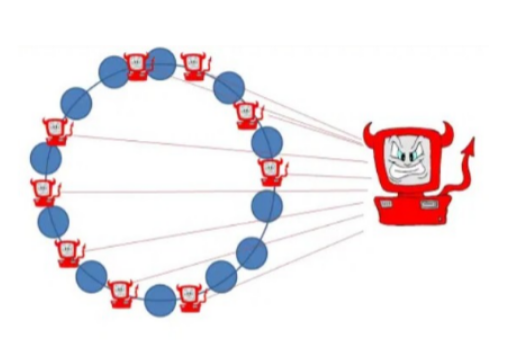

In un sistema P2P, iniettare finte identità è estremamente facile; basta registrarsi ripetutamente in una Distributed Hash Table (DHT). Senza meccanismi di blocco, non c'è garanzia che a un singolo nodo corrisponda una sola identità logica. Gli attaccanti utilizzano queste identità multiple per orchestrare attacchi di routing, controllare i dati replicati, interrompere la connettività di rete e, in ambito blockchain, ottenere la maggioranza fittizia nei voti di consenso. Tornando al problema del double spending, se un'entità (come Alice) esegue un attacco Sybil assumendo più del 50% delle identità della rete (cosa semplice in una rete come Bitcoin qualora non usasse la PoW), ella potrebbe agilmente auto-approvare la spesa della stessa criptovaluta verso due destinatari differenti (Bob e Charlie), rendendo l'attacco vincente. Per difendersi da questo scenario, si implementano difese algoritmiche come la **Proof of Work** (che richiede di dimostrare l'impiego di potenza computazionale, come in Bitcoin ed Ethereum), la **Proof of Stake** (che richiede il blocco di capitali o "stake") o l'utilizzo di Certified Node-IDs, il quale però richiede un'autorità centrale, rinunciando alla natura pura del peer-to-peer.

---

### Glossario / Concetti Chiave

- **Ledger (Registro):** Una struttura dati in modalità sola-aggiunta (append-only) che archivia una sequenza cronologica e inalterabile di eventi o operazioni.

- **Hash Pointer:** Un puntatore crittografico che, collegando l'hash di un blocco precedente a quello attuale, genera l'inviolabilità strutturale della blockchain.

- **Consenso (Consensus):** Il processo decisionale decentralizzato attraverso il quale i vari nodi di una rete distribuita convergono su un'unica versione della verità (validità e ordine delle transazioni).

- **Attacco Sybil (Sybil Attack):** Una strategia d'attacco in cui un singolo attore malevolo sovverte la rete creando e controllando un vasto numero di finte identità logiche, al fine di manipolare le votazioni o il routing.

---

### Il Double Spending e l'Attacco Sybil

Come abbiamo visto in precedenza, l'assenza di un controllo rigoroso sulle identità può portare a conseguenze disastrose in un sistema peer-to-peer. Immaginiamo che Alice, agendo in modo malevolo, decida di orchestrare un attacco Sybil all'interno della rete. Assumendo il controllo di molteplici identità fittizie fino a superare la soglia critica del 50% dei nodi—una manovra che in una rete come Bitcoin risulterebbe estremamente facile se non vi fossero ulteriori difese matematiche—Alice acquisisce di fatto il potere decisionale della maggioranza.

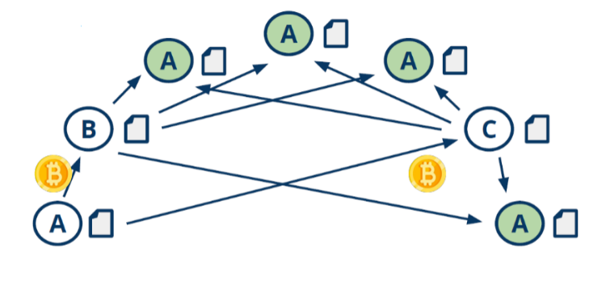

A questo punto, Alice può eseguire un attacco di **double spending** (doppia spesa), inviando lo stesso identico gettone digitale (bitcoin) contemporaneamente sia a Bob che a Charlie. Poiché ogni operazione all'interno della blockchain deve essere approvata dalla rete attraverso il meccanismo di consenso, Alice sfrutterà il suo esercito di identità fittizie per validare e approvare la propria spesa fraudolenta verso entrambi i destinatari. Il risultato è che l'attacco ha successo, minando irrimediabilmente l'integrità del registro distribuito.

### Il Consenso nelle Blockchain basate su Proof of Work (PoW)

Per arginare simili derive, emerge una domanda cruciale: come si può definire il concetto di "maggioranza" in un contesto aperto dove chiunque può unirsi alla rete o assumere facilmente identità multiple?. Se ci si limitasse a contare il numero di voti espressi dai singoli nodi, assumere il controllo della rete risulterebbe banale e a costo quasi zero.

La soluzione a questo paradosso consiste nell'adottare un approccio radicalmente diverso, che sposta il peso del voto dall'identità logica alla potenza di calcolo (computing power) del nodo. Di conseguenza, creare migliaia di identità fittizie diventa un'operazione del tutto inutile se l'attaccante possiede un solo computer fisico. Per poter controllare il consenso in questo nuovo paradigma, un individuo deve fisicamente possedere la maggioranza della potenza di calcolo dell'intera rete, poiché il diritto di voto è subordinato alla risoluzione preventiva di un problema matematico estremamente complesso.

### Le Dinamiche della Proof of Work

Questo meccanismo di validazione, noto come **Proof of Work**, necessita di caratteristiche peculiari per funzionare correttamente. Il problema crittografico da risolvere deve essere computazionalmente difficile da calcolare (hard to find solution), ma al contempo estremamente facile da verificare per il resto della rete (easy to verify).

Richiedendo un enorme dispendio di calcolo, falsificare la propria influenza non equivale più a generare semplicemente una moltitudine di identità, ma impone di risolvere un puzzle complesso prima di poter prendere qualsiasi decisione. Questo rende gli attacchi Sybil non solo proibitivi in termini di costi energetici e hardware, ma di fatto inutili (pointless). Possiamo paragonare la Proof of Work a una vera e propria lotteria organizzata per scegliere quale nodo avrà l'onore di validare e decidere il blocco successivo. I "biglietti" di questa lotteria sono i tentativi computazionali spesi per risolvere il problema e risultano molto costosi in termini di risorse. Il vincitore, in virtù del lavoro svolto, deciderà unilateralmente quale sarà il prossimo blocco ad essere concatenato, ricevendo al contempo degli incentivi finanziari (reward) per essersi comportato in modo onesto. In questo modo, la nuvola astratta del "consenso" si concretizza fisicamente nella PoW.

### Proof of Ownership e le Initial Coin Offering (ICO)

Tuttavia, garantire l'inalterabilità del registro non è sufficiente. Oltre al consenso, è indispensabile stabilire un solido meccanismo di prova di proprietà (**Proof of Ownership**). Consideriamo un nuovo esempio: Alice decide di aprire un ristorante, ma si scontra con affitti molto alti e "venture capitalist" avidi. Per superare l'ostacolo, decide di ricorrere a un'ICO (**Initial Coin Offering**). Attraverso questa operazione, Alice propone al pubblico un progetto aziendale che verrà interamente implementato su una blockchain. In cambio dei finanziamenti ricevuti dai partecipanti, Alice genera e distribuisce dei token come forma di compensazione. Questi token fungono da veri e propri "cryptocoupons", garantendo ai finanziatori sconti sui pasti una volta che il ristorante sarà operativo.

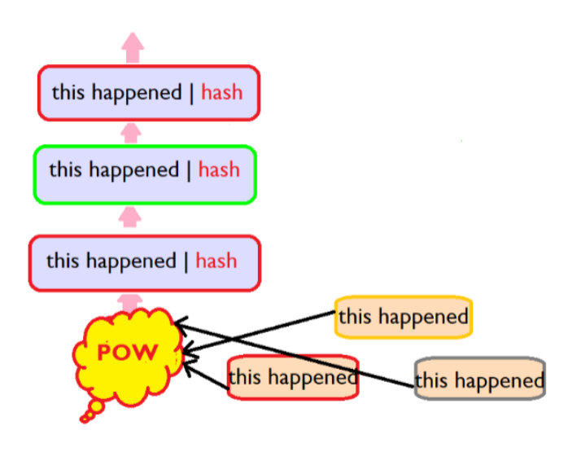

### Crittografia a Chiave Asimmetrica per la Proprietà

Alice utilizzerà il ledger per registrare i trasferimenti dei suoi token, ma ha bisogno di una soluzione tecnologica per garantire in modo inequivocabile la proprietà dei cryptocoupons. Come può dimostrare di possederli? E come può un finanziatore dimostrare di esserne l'unico legittimo proprietario al momento di spenderli?. Poiché l'ecosistema è decentralizzato, non esiste alcuna autorità di certificazione (Certification Authority) o entità centrale preposta a validare le identità.

La risposta risiede nell'utilizzo della crittografia a chiave asimmetrica. In questo sistema, Alice genera una coppia crittografica univoca composta da una **chiave pubblica** e una **chiave privata**. Chiunque sia in possesso della chiave privata associata alla chiave pubblica di Alice risulta esserne il legittimo proprietario: può trattarsi di Alice stessa, di una persona a cui Alice ha confidato la chiave o, sfortunatamente, di chiunque gliela abbia rubata. Mentre la chiave pubblica serve a identificare pubblicamente il proprietario del coupon, è la chiave privata a conferire materialmente la proprietà. Grazie a quest'ultima, l'utente può rivendicare i propri fondi e firmare digitalmente le operazioni di trasferimento. Queste transazioni firmate vengono infine registrate sul ledger distribuito e possono essere matematicamente verificate dal ricevente.

### La Gestione della Spesa e il Concetto di UTXO

Vediamo ora nel dettaglio come avviene la spesa dei coupon. Supponiamo che Alice decida di trasferire il 50% della proprietà di un coupon a ciascuno di due diversi finanziatori. Avendo a disposizione la chiave privata corrispondente alla sua chiave pubblica (es. `af876f536...`), ella identifica innanzitutto le chiavi pubbliche degli utenti a cui intende trasferire il valore (es. `1FE1W2EEJE...` e `A5d65ab38...`). Successivamente, firma la transazione di trasferimento per provare crittograficamente di conoscere la propria chiave privata, risultando quindi autorizzata a disporre dei fondi. L'operazione trasferisce il 50% del valore a ciascuno dei proprietari delle chiavi private corrispondenti alle chiavi pubbliche destinatarie. I due nuovi utenti potranno in seguito sfruttare le proprie chiavi private per incassare e utilizzare la loro metà del coupon.

A differenza del sistema bancario tradizionale, in questa infrastruttura non esiste alcun concetto di "conto corrente" (account) o di saldo (balance) in senso stretto. Esistono esclusivamente trasferimenti di coupon, la cui catena di proprietà è interamente archiviata nel ledger. Un utente può risalire a tutti i propri fondi semplicemente scorrendo e analizzando l'intero registro. Un principio chiave di questo modello è che la spesa di un coupon lo distrugge irrimediabilmente, creandone di nuovi. Questo meccanismo prende il nome di **UTXO** (Unspent Transaction Output), una struttura di dati che registra rigidamente tutti i coupon posseduti da un utente e non ancora spesi.

### Dalle Blockchain Permissionless alle Permissioned

I cryptocoupons generati da Alice operano su una blockchain **permissionless** (non autorizzata). In questo modello, chiunque può partecipare alla rete, chiunque può decidere di diventare un miner per la validazione e non sussiste alcuna traccia di autorità centrale. Tutto si fonda su un sistema di ricompense finanziarie (reward). Tuttavia, questo alto grado di libertà comporta problematiche rilevanti, come la possibilità che si creino fork (biforcazioni) della blockchain e una notevole esposizione a falle degli smart contract, come tristemente ricordato dal famigerato attacco alla DAO che causò una perdita di 54 milioni di dollari ($54M DAO Attack).

Per fronteggiare scenari d'uso specifici, emerge la necessità di reti regolate. Immaginiamo che Alice venda il suo ristorante per aprire una nuova attività di frozen yogurt. Purtroppo, il business si ritrova presto nei guai poiché le spedizioni di yogurt arrivano a destinazione completamente sciolte. Di chi è la colpa?.

### Il Caso di Studio della Supply Chain

Per tracciare il problema, analizziamo la supply chain di Alice. Il prodotto parte dalla fabbrica di Carol (Carol's factory), viene caricato sul camion frigorifero di Bob (Bob's truck) e infine consegnato al punto vendita di Alice, che possiamo chiamare "Los Pollos Hermanos" basandoci sulla grafica del furgone.

Interrogato sull'accaduto, Bob si difende presentando tre possibili scuse: afferma di non aver mai trasportato quello yogurt, o che il prodotto era già sciolto quando lo ha ritirato da Carol, o che al momento della consegna ad Alice fosse in perfette condizioni. Per determinare la responsabilità in modo inoppugnabile senza doversi fidare ciecamente degli attori coinvolti, si rende necessaria l'implementazione di una blockchain **permissioned** (autorizzata). In questa tipologia di architettura, si restringe l'accesso ai nodi che possono leggere e scrivere sul registro. Solamente gli attori concretamente coinvolti nel processo aziendale (in questo caso Bob e Carol) partecipano al meccanismo di consenso.

Per risolvere il mistero della catena del freddo, si integrano nel sistema sensori di temperatura certificati. Tali sensori trasmettono dati immodificabili alla blockchain (ad esempio, registrando temperature di -10 °C alle 13:05, -11 °C alle 13:10, e nuovamente -10 °C alle 13:15). Alle 13:30, momento del passaggio di consegne (handoff) tra Carol e Bob, l'operazione viene firmata digitalmente sia da Alice che da Bob, fissando in modo permanente le responsabilità su un registro inalterabile.

### La Tolleranza ai Guasti Bizantini (PBFT) e le Tipologie di Blockchain

Cosa differenzia tecnicamente una blockchain permissioned da una permissionless? Innanzitutto, le entità possiedono identità ben definite e verificate: gli attori umani utilizzano password e chiavi, e allo stesso modo anche i sensori IoT sono dotati di chiavi crittografiche per l'autenticazione. Essendo un ambiente controllato, con un numero di nodi limitato e noto a priori, il problema degli attacchi Sybil viene gestito in modo del tutto differente, puntando sull'**accountability** (responsabilità tracciabile) di chi viene sorpreso a barare.

Questo cambio di paradigma consente l'utilizzo di algoritmi di consenso differenti, prettamente basati su votazioni strutturate, come il **PBFT (Practical Byzantine Fault Tolerance)**. Come illustrato dall'importante paper scientifico *Practical Byzantine Fault Tolerance* di Miguel Castro e Barbara Liskov, prodotto presso il Laboratory for Computer Science del MIT, questo algoritmo di replicazione è in grado di tollerare guasti bizantini in ambienti asincroni (come lo è intrinsecamente Internet). La sua progettazione risulta fondamentale perché mitiga gli attacchi malevoli e gli errori software imprevisti, ed è altamente efficiente: le ottimizzazioni integrate migliorano i tempi di risposta di un ordine di grandezza rispetto ai precedenti algoritmi, rendendo i servizi replicati come l'NFS (Network File System) più lenti di un mero 3% rispetto a uno standard non replicato.

Per concludere questa panoramica, le blockchain moderne si dividono in diverse macro-categorie, o "sapori" (flavours). Da un lato troviamo le piattaforme **Open and Permissionless** (come Bitcoin, Ethereum, Steemit e Algorand), e dall'altro le architetture **Permission-based** dedicate al mondo aziendale ed enterprise (come Hyperledger, Ethereum Quorum e Corda).

---

### Glossario / Concetti Chiave

- **Double Spending:** Una vulnerabilità nei sistemi di cassa digitali in cui un attore malevolo tenta di spendere la medesima valuta per due transazioni distinte.

- **Proof of Work (PoW):** Un algoritmo di consenso che lega il potere di voto alla capacità di risolvere problemi computazionali complessi, rendendo la manipolazione della rete antieconomica.

- **Initial Coin Offering (ICO):** Un metodo di finanziamento non regolamentato attraverso cui nuovi progetti emettono e vendono token crittografici agli investitori in cambio di fondi.

- **UTXO (Unspent Transaction Output):** Un modello di gestione dei fondi in cui non esistono "saldi" di conto, ma il valore è rappresentato dall'insieme dei resti di transazioni passate non ancora spesi.

- **PBFT (Practical Byzantine Fault Tolerance):** Un efficiente algoritmo di consenso usato primariamente in reti permissioned (chiuse), progettato per funzionare in ambienti asincroni tollerando nodi fraudolenti (bizantini).

---

# Lezione 8: Bitcoin: Transazioni e Script

### Le Origini del Denaro Elettronico e le Firme Cieche

L'idea di un contante elettronico affidabile (reliable Internet e-cash) precede di gran lunga la nascita di Bitcoin. Già nel 1999, durante un discorso alla Chicago School of Economics, Milton Friedman (vincitore del Premio Nobel per le Scienze Economiche nel 1976) profetizzò che l'unica cosa mancante, ma di imminente sviluppo, fosse un eCash affidabile: un metodo per trasferire fondi su Internet da un soggetto A a un soggetto B senza che i due si conoscessero, esattamente come avviene quando si consegna fisicamente una banconota da 20 dollari. Un precedente tentativo di creare un sistema digitale per trasferire fondi anonimamente in rete fu **e-Cash**, proposto all'inizio degli anni Ottanta da David Chaum, professore a Berkeley e vero padrino del movimento cyberpunk.

Il sistema di Chaum si basava sul concetto crittografico delle **blind signatures** (firme cieche). Per comprendere questo meccanismo, si può usare l'analogia di un messaggio sigillato in una busta rivestita internamente di carta carbone (carbon copy paper). Quando si appone una firma (sign) premendo sulla busta, la carta carbone trasferisce il tratto, firmando il messaggio all'interno senza rivelarne il contenuto. Nel sistema e-Cash, l'utente genera una moneta sotto forma di un token casuale univoco, la "acceca" (blinds the coin) e la invia alla banca per la firma. La banca, pur non potendo vedere il token effettivo, appone la firma sulla moneta accecata a condizione che l'utente disponga di fondi sufficienti. Successivamente, l'utente "svela" (unblinds) la moneta, ottenendo una valuta valida e firmata che può essere spesa in modo anonimo. In questa fase, la banca è consapevole di aver firmato una moneta, ma ignora quale sia nello specifico.

Questo ingegnoso sistema presenta però un limite intrinseco. Anche se la banca verifica la disponibilità dei fondi, la firma cieca non previene da sola il **double spending** (doppia spesa), poiché l'utente disonesto potrebbe inviare la medesima moneta a due commercianti differenti. Per arginare il problema, il commerciante deve sottoporre la moneta alla banca per una verifica al momento della spesa. La banca controlla quindi il proprio database delle monete già spese: se la moneta è nuova, approva la transazione; se è già stata spesa, la rifiuta. Pur prevenendo il double spending attraverso la registrazione centralizzata, questo meccanismo evidenzia il fallimento dell'obiettivo di decentralizzazione: è ancora strettamente necessaria l'intermediazione della banca. In sintesi, la sfida storica dei sistemi e-Cash è stata quella di mantenere gli attributi fisici del contante, rendendolo infalsificabile (unforgeable, senza doppia spesa) e irrintracciabile (untraceable, secondo il principio *pecunia non olet*).

### L'Evoluzione dei Sistemi di Pagamento e l'Avvento di Bitcoin

La storia dei sistemi di pagamento affonda le radici nel 2040 a.C. in Mesopotamia con i primi registri contabili (Balance sheet), per poi evolversi nel **Centralized Banking** intorno al 1848 con istituzioni come HSBC, BNP Paribas, American Express e Bank of America. Il ventesimo secolo ha visto innovazioni tecnologiche con Alan Turing nel 1936 e l'introduzione delle carte di credito Visa e Mastercard nel 1958, fino ad arrivare a PayPal nel 1998. Il tentativo di un **Privacy-Preserving Banking** prese forma, come visto, con l'ECash di Chaum nel 1983. Tuttavia, la vera rivoluzione del **Decentralized Banking** si è concretizzata solo con Bitcoin nel 2008, aprendo la strada ad altre criptovalute come Ethereum nel 2015 e ZCash nel 2016.

La situazione ristagnava fino all'ottobre 2008, quando un autore, o un gruppo di autori, sotto il celebre pseudonimo di **Satoshi Nakamoto** (associato all'email satoshin@gmx.com e al dominio www.bitcoin.org, registrato il 18 agosto 2008) pubblicò il whitepaper intitolato "Bitcoin: A Peer-to-Peer Electronic Cash System". Nell'abstract del documento, Nakamoto propose una versione puramente peer-to-peer di contante elettronico, capace di consentire pagamenti online diretti tra le parti senza passare attraverso istituzioni finanziarie. Sebbene le firme digitali fornissero parte della soluzione, Nakamoto notò che i benefici principali andavano persi se era ancora richiesto un ente terzo fidato per prevenire il double-spending. La soluzione innovativa consisteva nell'uso di una rete peer-to-peer (P2P) che marca temporalmente (timestamps) le transazioni, applicando una funzione di hash in una catena continua basata sulla **proof of work** (prova di lavoro).

Nakamoto annunciò pubblicamente il progetto il 31 ottobre 2008 alle 18:10:00 GMT sulla mailing list gmane.comp.encryption.general, scrivendo dall'indirizzo satoshi@vistomail.com. Nell'email evidenziava le proprietà principali del sistema: prevenzione del double-spending tramite rete P2P, assenza di zecche (mint) o terze parti fidate, anonimato dei partecipanti e generazione di nuove monete tramite una proof-of-work in stile Hashcash, la quale serve anche a mettere in sicurezza la rete. Pochi mesi dopo, il 9 novembre 2008, il progetto fu registrato su sourceforge.net. Il blocco fondante, noto come **Genesis block**, fu minato il 3 gennaio 2009 alle 18:15:05 GMT, seguito dal rilascio della versione 0.1 del codice il 9 gennaio e dalla primissima transazione (registrata nel blocco 170) inviata da Satoshi a Hal Finney il 12 gennaio 2009. Curiosamente, Nakamoto interruppe ogni tipo di interazione pubblica a metà del 2010.

### La "Pizza Transaction" e la Natura di Bitcoin

Un evento storico per l'adozione pratica della criptovaluta avvenne nel maggio 2010 con la famosa "Pizza Transaction", il primo acquisto noto di beni reali pagati in Bitcoin. Laszlo Hanyecz, un utente della Florida, pubblicò un annuncio sul forum Bitcointalk il 18 maggio 2010 alle 12:35:20 AM, offrendo 10.000 BTC (che aveva ricevuto come ricompensa di mining) a chiunque gli avesse fatto consegnare "un paio di pizze" (a couple of pizzas). Laszlo specificò di preferire ingredienti standard come cipolle, peperoni, salsiccia, funghi e pomodori, evitando accuratamente strani condimenti a base di pesce ("no weird fish topping"). La richiesta fu soddisfatta da un ragazzo della costa occidentale che ricevette i 10.000 BTC (una somma enorme al valore odierno) in cambio di pizze per un valore di circa 25 dollari.

La transazione è permanentemente incisa sulla blockchain, con l'identificativo (hash) *a1075db55d416d3ca199f55b6084e2115b9345e16c5cf302fc80e9d5fbf5d48d*. Analizzando i dati crudi forniti dagli esploratori di blocchi come blockchain.info, emergono i dettagli tecnici della prima spesa reale.

*Tabella 1: Dettagli della Pizza Transaction sulla Blockchain*

| **Proprietà**           | **Valore**                            |
| ----------------------- | ------------------------------------- |
| Dimensione              | 23620 (byte)                          |
| Ora di Ricezione        | 2010-05-22 18:16:31                   |
| Incluso nei Blocchi     | 57043 (2010-05-22 18:16:31 +0 minuti) |
| Conferme                | 405698 conferme                       |
| Inoltrato dall'IP       | 0.0.0.0 (whois)                       |
| Totale Input            | 10.000,99 BTC                         |
| Totale Output           | 10.000 BTC                            |
| Tasse                   | 0,99 BTC                              |
| Costo per byte          | 4.191,363 sat/B                       |
| Stima dei BTC scambiati | 10.000 BTC                            |

Ma cos'è effettivamente Bitcoin? È definibile come una versione puramente peer-to-peer di "denaro digitale" (digital cash). A differenza di e-Cash, non prevede alcuna autorità di controllo, nessun server centrale e nessuna banca. È un sistema **permissionless** (privo di un ente regolatore che rilasci permessi), resistente alla censura (nessuno può congelare i fondi), transnazionale e senza confini geografici (cross-jurisdictional). Almeno nei primi anni di adozione, i costi di transazione erano considerati trascurabili o del tutto gratuiti. Dal punto di vista della sicurezza, l'impostazione predefinita del protocollo è il sospetto all'interno di un ambiente completamente privo di fiducia (untrusted environment); la soluzione definitiva per la doppia spesa ha rappresentato il problema fondamentale risolto per permettere a Bitcoin di crescere legittimamente.

In pratica, in un pagamento senza intermediari, il compratore crea una transazione utilizzando il proprio *wallet* (portafoglio digitale). Questa transazione viene processata attraverso la rete P2P e, al posto di un tradizionale codice IBAN, viene utilizzato un **Bitcoin address** (indirizzo Bitcoin). Il venditore non deve far altro che trovare la transazione registrata nella blockchain e, a fronte dell'accordo d'acquisto, procedere con la consegna del bene. Paragonato agli approcci precedenti, che necessitavano di un server fidato, imponevano alte commissioni e negavano l'anonimato, Bitcoin garantisce un'apertura totale (openness): è sufficiente avere un client Bitcoin, senza bisogno di conti bancari o carte di credito. Inoltre, il controllo dell'offerta di moneta non è in mano a un'entità centralizzata e la privacy è tutelata da una **pseudo-anonimità**, operando in modo simile al pagamento in contanti fisici ("paying cash") grazie all'uso degli indirizzi come pseudonimi.

### Sfide, Resilienza e Popolarità del Protocollo

Nel corso dei suoi 16 anni di esistenza (con riferimento temporale al 2026), Bitcoin ha superato enormi difficoltà. Nel gennaio 2014, Mt. Gox (il cui acronimo originario era "Magic the Gathering Online exchange") era il più grande exchange al mondo per il cambio USD/Bitcoin. Solo un mese dopo, nel febbraio 2014, l'azienda presentò istanza di fallimento per la protezione dai creditori. Risultarono dispersi o rubati circa 850.000 bitcoin appartenenti ai clienti e all'azienda, una somma valutata all'epoca oltre 450 milioni di dollari. Riguardo alla natura di questo collasso, il dibattito tra frode e furto ha spesso puntato il dito contro una probabile vulnerabilità nel protocollo, nota come **malleability attack** (attacco di malleabilità).

Il protocollo ha dovuto fare i conti anche con una reputazione oscurata da utilizzi illeciti. Tra il 2011 e il 2013, Bitcoin divenne immensamente popolare per l'acquisto di beni illegali sul dark web, in particolare su **Silk Road**. Operando come servizio nascosto sulla rete Tor, Silk Road permetteva agli utenti di acquistare droga e pornografia navigando in modo anonimo, sicuro e senza potenziali monitoraggi del traffico. Lanciato nel febbraio 2011 e chiuso dalle autorità nell'ottobre 2013, ha visto il suo presunto proprietario, Ross William Ulbricht, condannato all'ergastolo, sebbene altri mercati neri siano subito emersi come successori. Più recentemente, la criptovaluta è stata lo strumento di pagamento prediletto per i **Ransomware**. Questi attacchi informatici iniziano tipicamente con un'email non richiesta che inganna la vittima spingendola a cliccare su un allegato, per poi sfruttare le falle del sistema operativo (come nel caso del ransomware WannaCry su Windows) al fine di replicarsi, crittografare i file importanti e richiedere un riscatto pagabile esclusivamente in Bitcoin.

Considerando che a soli 17 anni di vita la rete non ha il sostegno di alcun governo o corporazione, ha superato furti colossali come quello di Mt. Gox ed è sopravvissuta a una reputazione minata da associazioni al terrorismo e al riciclaggio di denaro, ci si chiede legittimamente come Bitcoin possa essere ancora così vivo e vitale ("alive and kicking"). Le ragioni della sua popolarità affondano in forti motivazioni ideologiche, legate alla **criptoanarchia** (l'idea che nessuno debba controllare il denaro) e al movimento cyberpunk. Il tempismo del suo rilascio, coinciso con la crisi finanziaria del 2008, lo ha reso un vero e proprio "figlio della crisi", forte dell'impossibilità di stampare denaro arbitrariamente (no money printing in Bitcoin). Oggi è percepito come un **oro digitale** (digital gold), un asset di investimento con una fornitura rigorosamente controllata dal protocollo e immune agli interventi statali, tanto che alcuni esperti suggeriscono di investirvi fino al 5% del proprio portafoglio. A questo si affianca un ecosistema maturo di *exchangers* sicuri (come CoinDesk, BPI, Bitstamp, Bitfinex, Coinbase, itBit e OKCoin), la nascita di mercati regolamentati e, per lungo tempo, la possibilità di eseguire pagamenti economici rispetto al 2-10% di trattenuta tipico di piattaforme come PayPal.

### Percezione Pubblica, Fluttuazioni di Prezzo e Contesto Economico

L'assenza di un'autorità centrale che difenda dalle minacce classiche alla sicurezza è un'arma a doppio taglio che divide radicalmente l'opinione pubblica. Da un lato, gli entusiasti lo considerano denaro reale a tutti gli effetti; l'ex presidente della Federal Reserve Ben Bernanke affermò che tali innovazioni, pur ponendo rischi per le forze dell'ordine, promettono a lungo termine lo sviluppo di sistemi di pagamento più veloci, sicuri ed efficienti. Dall'altro lato, gli scettici, tra cui figurano personalità di spicco come Paul Krugman e Alan Greenspan, lo etichettano senza mezzi termini come uno Schema Ponzi (in riferimento al truffatore storico Carlo Pietro Ponzi).

Questa tensione continua tra entusiasmo e scetticismo si riflette visivamente nell'estrema volatilità del prezzo registrata nei primi 17 anni, con grafici che mostrano oscillazioni vertiginose e picchi che superano i 120.000 dollari.

[INSERIRE IMMAGINE: Grafico a linee "Price History By Year" che illustra le fluttuazioni di prezzo del Bitcoin suddiviso per anni dal 2017 al picco del 2026]

Per comprendere adeguatamente questo ecosistema, è necessario inquadrarlo nel suo contesto architetturale (Bitcoin in Context). Il cuore decentralizzato del **Bitcoin Ecosystem** è formato dal Protocollo, dal software Client e dai Dati immagazzinati nella blockchain. Questo nucleo dialoga direttamente con un livello parzialmente centralizzato che comprende gli Exchange, le Mining pool e i Remote wallet. L'insieme di queste strutture interagisce parallelamente con il **Settore Finanziario** tradizionale centralizzato (composto da Banche, Fondi, Regolatori e Tesoreria di Stato) e si riverbera, in ultima istanza, sull'**Economia Reale**, fatta di agenti, beni, mercati (sia legali che illegali) e relative esternalità.

---

### Glossario / Concetti Chiave

- **Blind Signatures (Firme Cieche):** Un protocollo crittografico in cui il contenuto di un messaggio viene nascosto prima di essere firmato da una terza parte, utilizzato nei primi sistemi e-Cash per garantire l'anonimato.

- **Double Spending (Doppia Spesa):** Il rischio fondamentale nei sistemi di moneta digitale che uno stesso token venga speso più di una volta. Risolto in Bitcoin tramite la marcatura temporale su una rete peer-to-peer.

- **Proof-of-Work:** Il meccanismo di consenso utilizzato da Bitcoin (derivato dal sistema Hashcash) in cui i nodi della rete competono per risolvere complessi puzzle crittografici, prevenendo frodi e coniando nuove monete.

- **Decentralized Banking / Permissionless:** Un sistema finanziario in cui non esiste un'autorità centrale che approvi le transazioni o registri gli utenti, permettendo a chiunque di partecipare liberamente alla rete.

---

### La Gestione Decentralizzata delle Identità

In un sistema di pagamento tradizionale, le identità sono gestite da un'autorità centrale, come una banca. Bitcoin, essendo decentralizzato, deve risolvere il problema di come rappresentare gli utenti senza affidarsi a un ente certificatore. La soluzione adottata si basa sulla crittografia a chiave pubblica. Ogni utente crea in modo autonomo e casuale una coppia di chiavi: una chiave privata (indicata con **sk**, secret key) e una chiave pubblica (indicata con **pk**, public key). La chiave pubblica appare come una stringa di caratteri casuali e funge da "nome" pubblico dell'utente all'interno della rete, garantendo che nessuno debba rivelare la propria identità reale. Nella pratica, anziché utilizzare direttamente la chiave pubblica, si utilizza molto più spesso il suo hash, indicato come Hash(pk).

Il controllo sui fondi è garantito dal possesso della chiave privata. Solamente il proprietario della chiave privata può autorizzare una spesa. Dal punto di vista matematico, se una transazione contiene una firma digitale (**sig**) e la funzione di verifica *verify(pk, data, sig)* restituisce "vero", la rete ha la garanzia assoluta che la transazione sia stata generata dal possessore di quella specifica chiave pubblica. L'algoritmo crittografico utilizzato da Bitcoin per le firme digitali è l'**Elliptic Curve Signature Algorithm (ECDSA)**, e nello specifico impiega una curva ellittica denominata **secp256k1**, descritta dall'equazione matematica $y^{2}=x^{3}+ax+b$ mod p.

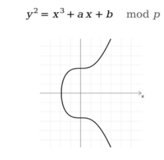

È fondamentale sfatare un malinteso comune: in Bitcoin, nessun dato viene crittografato nel senso di essere reso illeggibile o segreto. Tutti i dettagli delle transazioni sono pubblici e trasparenti sulla blockchain. Le chiavi crittografiche servono unicamente a dimostrare in modo inconfutabile la proprietà dei fondi. Qualora un utente necessiti di maggiore privacy, deve ricorrere a tecniche avanzate esterne, come le prove a conoscenza zero (Zero Knowledge proofs).

La generazione di un **indirizzo Bitcoin** (Bitcoin Address) segue un percorso algoritmico unidirezionale ben preciso. Si parte dalla chiave privata (k), che è semplicemente un numero generato casualmente. Tramite una moltiplicazione sulla curva ellittica (un'operazione "one-way", facile da calcolare in una direzione ma impossibile da invertire), si ottiene la chiave pubblica a 512 bit (K). Successivamente, a questa chiave pubblica completa di prefisso viene applicata una prima funzione di hash, la SHA-256. L'output di questa operazione viene immediatamente passato a una seconda funzione di hash, il RIPEMD-160, ottenendo così l'hash della chiave pubblica.

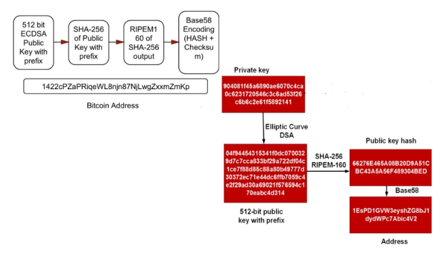

L'ultimo passaggio per ottenere l'indirizzo finale utilizzabile dall'utente consiste nell'applicare la codifica **Base58**. In questa fase, viene anche aggiunto un checksum (un codice di controllo) per rilevare eventuali errori di battitura. La scelta della codifica Base58 è molto intelligente: partendo dai 62 caratteri alfanumerici standard (lettere maiuscole, minuscole e numeri), il protocollo esclude 4 caratteri che possono essere facilmente confusi visivamente tra loro, ovvero lo zero (0), la O maiuscola, l'uno (1) e la l (elle) minuscola. Questo formato riduce la lunghezza delle stringhe e previene costosi errori durante la copiatura manuale degli indirizzi.

In sintesi, all'interno della rete, le identità prendono il nome di indirizzi. Questi rappresentano il proprietario della coppia di chiavi e sono l'equivalente del nome del beneficiario su un assegno bancario. Chiunque può generare quanti indirizzi desidera in qualsiasi momento. Dato che gli indirizzi non sono collegati all'identità anagrafica, Bitcoin offre un livello di **pseudo-anonimato**. Tuttavia, analizzando storicamente i movimenti sulla blockchain pubblica, un osservatore esterno potrebbe collegare tra loro diverse transazioni e dedurre informazioni sulle abitudini dell'utente.

### Il Modello UTXO e la Struttura delle Transazioni

Il processo di pagamento inizia tipicamente al di fuori della rete Bitcoin. Immaginiamo che una cliente, Alice, voglia pagare un commerciante, Bob. Bob genera un nuovo indirizzo e lo comunica ad Alice tramite un canale esterno (ad esempio via email, chat o mostrandole un QR code). Alice utilizza il suo portafoglio software (wallet) per costruire una transazione *t*, la quale specifica l'invio di fondi all'indirizzo di Bob. Alice trasmette quindi questa transazione alla rete peer-to-peer. I nodi della rete, in particolare i miner, raccolgono la transazione, la validano e la inseriscono in un blocco candidato. Una volta che il blocco viene minato, la transazione diventa pubblica. Bob attenderà prudenzialmente un certo numero di "conferme" (ovvero l'aggiunta di blocchi successivi) prima di considerare definitivo il pagamento e consegnare la merce.

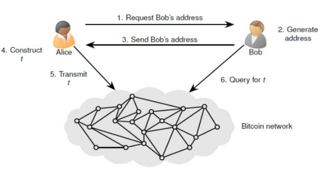

Dal punto di vista tecnico, una transazione è composta da uno o più **input**, uno o più **output** e da una marca temporale (Timestamp). La regola fondamentale e inviolabile del protocollo è che la somma dei fondi inseriti come input deve essere maggiore o uguale alla somma dei fondi in uscita ($\sum inputs\ge\sum outputs$). La differenza tra questi due valori costituisce la **transaction fee** (commissione di transazione). Sebbene opzionale, questa commissione viene incassata dai miner come incentivo per aver validato la transazione; pagarla garantisce tempi di conferma molto più rapidi.

Ma da dove provengono fisicamente gli input? In Bitcoin, le transazioni non sono isolate, ma incatenate tra loro formando una catena cronologica della proprietà. Quando Alice riceve dei bitcoin, questi diventano l'output di una transazione e vengono associati al suo indirizzo. In futuro, per poterli spendere, Alice dovrà utilizzare quello specifico output come input per una nuova transazione. Questo meccanismo è alla base del modello contabile di Bitcoin, noto come **UTXO (Unspent Transaction Output)**, ovvero gli output di transazione non ancora spesi.

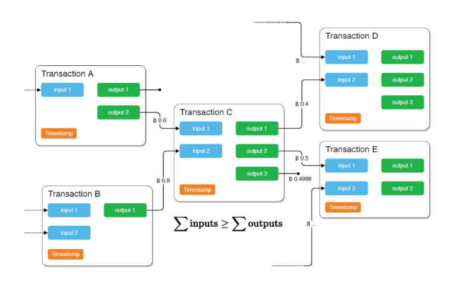

Il concetto di "saldo" di un conto corrente in Bitcoin non esiste a livello di protocollo. Il saldo visualizzato da un utente nel proprio wallet non è altro che la somma matematica di tutti i suoi UTXO sparsi per la rete. Quando un UTXO viene referenziato come input in una nuova transazione, esso viene considerato "speso" e non può essere riutilizzato. Inoltre, gli UTXO devono essere consumati per intero. Se Alice possiede un UTXO da 0.8 BTC e vuole pagare a Bob 0.5 BTC, la sua transazione consumerà l'intero input di 0.8 BTC e genererà due output: uno da 0.5 BTC diretto a Bob, e un secondo output (che chiamiamo "change" o resto) di 0.3 BTC meno le commissioni, che tornerà a un indirizzo di proprietà di Alice.

A seconda di come vengono gestiti input e output, le transazioni assumono diverse forme. La **Common Transaction** (transazione comune) è la più diffusa: presenta un solo input e due output (il pagamento al destinatario e il resto che torna al mittente).

Esiste poi la **Aggregating Transaction** (transazione di aggregazione), che unisce molti piccoli input per formare un unico grande output. Questo formato è utile per fare pulizia nel wallet raccogliendo tutte le minuscole frazioni di resto (la cosiddetta "polvere" o dust) accumulate nel tempo. Viene inoltre impiegato per i pagamenti congiunti o nelle transazioni multisig (a firma multipla). Infine, la **Distributing Transaction** (transazione di distribuzione) esegue l'operazione opposta: prende un unico grande input e lo divide in numerosi output diretti a destinatari diversi. L'esempio classico è quello di un'azienda che paga simultaneamente gli stipendi a tutti i suoi dipendenti in un'unica operazione di rete.

### Gli Script: Come Rendere i Fondi Programmabili

Oltre a indicare i valori monetari, ogni transazione contiene al suo interno piccoli frammenti di codice eseguibile chiamati **script**. Uno script in Bitcoin è un programma rudimentale scritto in un linguaggio di programmazione molto semplice, il cui scopo principale è verificare che chi sta cercando di spendere i fondi ne sia effettivamente il legittimo proprietario.

Una caratteristica fondamentale di questo linguaggio è di non essere "Turing completo" (language is not Turing complete). In particolare, manca del tutto la possibilità di creare dei cicli (loop). Questa severa limitazione è del tutto intenzionale: serve a garantire la massima sicurezza del sistema, impedendo a utenti malintenzionati di inserire codice capace di bloccare i nodi della rete attraverso loop infiniti (endless looping) o esecuzioni errate. Questo assicura che il codice sia leggero ed eseguibile su un'ampia gamma di hardware, e che sia "stateless" (senza stato) e deterministico, producendo sempre lo stesso risultato ovunque venga eseguito.

Il meccanismo degli script funziona in modo complementare. Quando un utente $A_{1}$ invia fondi a un utente $A_{2}$, appone sull'output un **Locking script** (script di blocco), associato alla chiave pubblica del destinatario. Possiamo immaginarlo come un lucchetto crittografico che congela i fondi. Per poter spendere quei bitcoin in futuro, l'utente $A_{2}$ dovrà fornire un **Unlocking script** (script di sblocco) che contiene una firma digitale generata con la propria chiave privata. La rete Bitcoin prenderà l'Unlocking script fornito da $A_{2}$ e lo eseguirà insieme al Locking script originale posto da $A_{1}$. Se l'esecuzione congiunta termina senza errori e restituisce il valore logico "vero" (True), il lucchetto si apre e la transazione viene validata.

Il linguaggio degli script è basato su un'architettura a **Stack** (pila), simile a linguaggi come il FORTH, in cui i dati vengono impilati l'uno sull'altro e le operazioni (OPCODE) elaborano gli elementi situati in cima. Un esempio base è lo script **Pay-to-PubKey (P2PK)**, in cui il lucchetto richiede semplicemente una firma valida contro una specifica chiave pubblica. Tuttavia, lo script di gran lunga più utilizzato è il **Pay-to-Public-Key-Hash (P2PKH)**. In questo caso, il mittente non inserisce la chiave pubblica completa del destinatario nel Locking script, ma solo il suo hash (ovvero l'indirizzo Bitcoin).

Per sbloccare un output P2PKH, il destinatario deve fornire sia la propria firma digitale sia la propria chiave pubblica completa. La rete eseguirà quindi un codice specifico: `<sig> <pubKey> OP_DUP OP_HASH160 <pubKeyHash> OP_EQUALVERIFY OP_CHECKSIG`.

Il processo sullo stack avviene passo dopo passo:

1. La firma (`<sig>`) e la chiave pubblica (`<pubKey>`) vengono impilate.

2. `OP_DUP` duplica la chiave pubblica in cima alla pila.

3. `OP_HASH160` calcola l'hash della chiave pubblica appena duplicata.

4. L'hash atteso (`<pubKeyHash>`, inserito dal mittente originale) viene aggiunto alla pila.

5. `OP_EQUALVERIFY` confronta i due hash. Se coincidono, significa che la chiave pubblica fornita dal destinatario corrisponde effettivamente all'indirizzo a cui erano stati inviati i fondi. Entrambi gli hash vengono rimossi dallo stack.

6. Infine, `OP_CHECKSIG` prende la firma e la chiave pubblica rimaste sullo stack e verifica crittograficamente che la firma sia valida. Se lo è, lo script restituisce True.

Esistono anche script più complessi che permettono di implementare condizioni di spesa articolate, come il MultiSig (dove sono necessarie, ad esempio, 2 firme su 3 per spendere i fondi) o transazioni di tipo escrow e micro-pagamenti.

### Metadati JSON e Validazione sulla Rete

Analizzando i dati nudi e crudi di una transazione così come vengono trasmessi sulla rete, notiamo che essi sono organizzati utilizzando il formato **JSON**.

L'oggetto JSON principale inizia con il campo `hash`, ovvero l'identificativo unico della transazione, e prosegue con parametri amministrativi (housekeeping) come `ver` (la versione del protocollo), `vin_sz` (il numero totale di input) e `vout_sz` (il numero totale di output). Un campo particolarmente interessante è il `lock_time`. Nella stragrande maggioranza delle transazioni ordinarie, questo valore è impostato a 0, indicando che la transazione deve essere eseguita immediatamente. Tuttavia, se impostato con una data o un numero di blocco futuro, agisce come un vincolo temporale ("not valid before"), impedendo che la transazione venga accettata dai miner prima di quel momento preciso.

All'interno del JSON troviamo due liste (array) fondamentali: `in` e `out`.

- L'array **`in`** elenca tutti gli input. Ogni input specifica l'esatta provenienza dei fondi tramite il campo `prev_out`, che contiene l'hash della transazione precedente e l'indice (`n`) dello specifico output che si intende consumare. Subito dopo, si trova il campo `scriptSig`, che contiene lo script di sblocco (la firma e la chiave pubblica).

- L'array **`out`** elenca le destinazioni. Ogni output indica il valore esatto da trasferire (`value`) e il lucchetto crittografico (`scriptPubKey`) che contiene le istruzioni e l'indirizzo del nuovo proprietario.

Un caso particolare è rappresentato dalle **Coinbase Transactions**. Queste transazioni speciali sono il meccanismo con cui vengono creati nuovi bitcoin; esse compaiono sempre come prima transazione di ogni nuovo blocco. A differenza delle transazioni normali, le transazioni Coinbase non possiedono input (non consumano UTXO esistenti), ma generano fondi dal nulla per ricompensare il miner che ha risolto la Proof of Work, trasferendo il premio direttamente in un output a suo favore.

Per comprendere il ciclo di vita completo, prendiamo l'esempio di un cliente che compra un panino da Subway scansionando un codice QR. Una volta che la transazione viene creata e firmata dal wallet del cliente, viene propagata (broadcast) ai nodi vicini nella rete P2P. Ogni nodo che la riceve esegue una rigida serie di controlli locali prima di passarla agli altri:

1. Verifica che gli output referenziati esistano e non siano già stati spesi (controllando nel proprio database degli UTXO).

2. Controlla che la somma dei valori in input sia maggiore o uguale alla somma dei valori in output.

3. Esegue gli script per assicurarsi che tutte le firme siano valide.

Per rendere questi controlli estremamente veloci, i nodi mantengono in RAM una struttura dati chiamata **UTXO Cache**, che contiene solo l'elenco dei fondi attualmente disponibili, risultando molto più leggera dell'intera blockchain. Se tutti i controlli hanno esito positivo, gli input utilizzati vengono rimossi dalla cache locale, e la transazione viene messa in una sala d'attesa chiamata "Memory Pool", pronta per essere prelevata dai miner e definitivamente confermata.

---

### Glossario / Concetti Chiave

- **Chiave Privata e Chiave Pubblica:** La coppia crittografica alla base dell'identità in Bitcoin. La chiave privata autorizza la spesa, mentre la chiave pubblica e il suo hash (l'Indirizzo) indicano la destinazione pubblica dei fondi.

- **UTXO (Unspent Transaction Output):** Output di una transazione non ancora speso. Costituiscono i "pezzi di moneta" indivisibili che un utente possiede. Il saldo di un wallet è la somma aritmetica di tutti i propri UTXO sparsi sulla blockchain.

- **Script:** Linguaggio di programmazione intenzionalmente non Turing-completo (senza loop) usato in Bitcoin per definire le condizioni di spesa. Un output è bloccato da uno *scriptPubKey* e viene sbloccato in spesa fornendo un *scriptSig*.

- **Transaction Fee (Commissione):** La differenza tra i fondi in input e quelli in output in una transazione. Viene incassata dai miner come incentivo per l'inclusione della transazione nel blocco.

- **P2PKH (Pay-to-Public-Key-Hash):** Lo script più comune in Bitcoin. Per spendere i fondi, l'utente deve fornire una firma digitale valida e la chiave pubblica originale il cui hash corrisponda all'indirizzo destinatario.

---

### Le Transazioni Coinbase

Fino a questo momento abbiamo considerato transazioni in cui gli input derivano necessariamente da output di transazioni precedenti. Esiste tuttavia un'eccezione fondamentale a questa regola: la **Coinbase Transaction**. Questa particolare transazione è l'unica all'interno del sistema a non avere alcun input preesistente (0 input), ma a possedere esclusivamente output.

Il suo scopo esclusivo è quello di immettere nuova moneta nel sistema. Attraverso la transazione Coinbase, infatti, vengono generati bitcoin freschi (fresh bitcoin) che fungono da ricompensa per i miner che hanno impiegato potenza di calcolo per risolvere la *Proof of Work*. Questa transazione trasferisce la ricompensa appena creata, insieme alle eventuali commissioni di rete raccolte, direttamente a uno degli indirizzi controllati dal miner vincitore.

### Il Linguaggio di Scripting di Bitcoin: Obiettivi di Design

Il cuore logico che governa la trasferibilità dei fondi risiede nel linguaggio di programmazione integrato nel protocollo. Questo linguaggio di scripting è stato progettato con obiettivi molto specifici, ispirati in parte al linguaggio FORTH. In primo luogo, è un linguaggio basato su **Stack** (una struttura dati a pila), il che lo rende estremamente semplice ed eseguibile in modo efficiente su un'ampia gamma di hardware.

La caratteristica di design più rilevante è che il linguaggio è **intenzionalmente non Turing-completo**. A differenza dei linguaggi di programmazione generici, in Bitcoin mancano del tutto le istruzioni per creare cicli (no loops). Questa limitazione non è un difetto, ma una misura di sicurezza vitale. Poiché tutti i "full nodes" della rete (i nodi completi e i miner, esclusi i client leggeri su dispositivi mobili) devono validare in modo indipendente ogni singolo script, l'assenza di cicli impedisce la creazione di "loop infiniti" malevoli. Questo previene in modo assoluto che il meccanismo di validazione delle transazioni possa essere sfruttato come una vulnerabilità per bloccare i computer della rete.

Inoltre, il linguaggio è rigorosamente **stateless** (senza stato) e deterministico. Non esiste alcuno stato precedente all'esecuzione dello script, né alcuno stato che venga salvato e mantenuto in memoria al termine dell'esecuzione (una differenza sostanziale rispetto agli smart contract di Ethereum). Tutte le informazioni necessarie per risolvere il programma sono contenute all'interno dello script stesso. Questo garantisce che uno script verrà eseguito in modo prevedibile e produrrà esattamente lo stesso risultato su qualsiasi sistema o nodo della rete lo elabori.

Dal punto di vista della sintassi, il linguaggio è molto compatto. Le istruzioni operative, chiamate **OPCODE**, occupano un solo byte, consentendo un massimo di 256 istruzioni possibili. Queste comprendono funzioni matematiche basilari, operatori logici standard (come IF...THEN...ELSE) e, soprattutto, istruzioni crittografiche per scopi speciali, essenziali per verificare gli hash, le firme digitali e i contratti a firma multipla (multisignature).

### L'Esecuzione basata su Stack e le Istruzioni Principali

L'esecuzione di uno script avviene posizionando sequenzialmente i dati e le istruzioni su una pila (Stack). In un'architettura di questo tipo, i dati vengono inseriti in cima (push) e le operazioni prelevano e manipolano i valori che si trovano nei livelli superiori.

Ad esempio, se lo script rimanente da eseguire contiene la sequenza "OP_2 OP_3 OP_ADD", il sistema inserisce prima il numero 2 nello stack, poi inserisce il numero 3 sopra di esso. A questo punto, l'istruzione "OP_ADD" estrae gli ultimi due valori, li somma e posiziona il risultato, ovvero 5, in cima allo stack.

All'interno di Bitcoin, uno script è sostanzialmente un frammento di codice che verifica una serie di condizioni arbitrarie che devono essere necessariamente soddisfatte per poter spendere i fondi. La stragrande maggioranza degli script in circolazione esegue semplici controlli sulle firme, richiedendo all'utente di fornire una firma digitale valida che corrisponda alla chiave pubblica associata ai fondi. Tuttavia, le istruzioni disponibili permettono anche di codificare condizioni di spesa più complesse. Oltre agli script standard, esistono formati come il MultiSig (firme multiple), il Pay-to-Script-Hash (P2SH) o il Proof-of-Burn (la distruzione provabile di monete). Si possono inoltre programmare transazioni di tipo escrow (deposito a garanzia), implementare sistemi come i green addresses o gestire canali per micro-pagamenti.

Per comprendere il funzionamento logico, è utile analizzare alcune delle istruzioni (OPCODE) più utilizzate, riassunte nella seguente tabella.

*Tabella: Principali istruzioni del linguaggio di scripting di Bitcoin*

| **Word**       | **Opcode** | **Descrizione**                                                                                        |
| -------------- | ---------- | ------------------------------------------------------------------------------------------------------ |
| OP_IF          | 0x63       | Se il valore in cima allo stack non è Falso (False), vengono eseguite le istruzioni successive.        |
| OP_DUP         | 0x76       | Duplica l'elemento che si trova in cima allo stack.                                                    |
| OP_EQUAL       | 0x87       | Restituisce 1 se gli input forniti sono esattamente identici, altrimenti restituisce 0.                |
| OP_EQUALVERIFY | 0x88       | Funziona come OP_EQUAL, ma esegue immediatamente un OP_VERIFY subito dopo.                             |
| OP_VERIFY      | 0x69       | Contrassegna l'intera transazione come non valida se il valore in cima allo stack non è "vero" (true). |
| OP_HASH160     | 0xa9       | L'input viene sottoposto a hash due volte: prima con l'algoritmo SHA-256 e poi con RIPEMD-160.         |

Un interesse particolare è rivolto alle istruzioni prettamente crittografiche, come quelle utilizzate per la verifica singola o multipla delle firme (ad esempio `OP_CHECKMULTISIG`), e quelle che impongono vincoli temporali (Locktime) sull'esecuzione, come `OP_CHECKLOCKTIMEVERIFY` e `OP_CHECKSEQUENCEVERIFY`.

### Meccanismi di Locking e Unlocking: P2PK e P2PKH

Ogni output trasferisce valore e lo assicura tramite un lucchetto crittografico (Locking script o ScriptPubKey). Per sbloccarlo, il destinatario deve presentare la chiave corretta (Unlocking script o ScriptSig). Sebbene la tipologia **Pay-to-PubKey (P2PK)** sia concettualmente la più semplice (poiché il Locking script contiene direttamente la chiave pubblica in chiaro seguita dall'istruzione `CHECKSIG`, e richiede come sblocco la sola `<Signature>`), nella pratica odierna il formato standard e di gran lunga più popolare è il **Pay-to-Public-Key-Hash (P2PKH)**.

Nello standard P2PKH, il mittente non invia i fondi a una chiave pubblica completa, ma al suo hash, ovvero all'Indirizzo Bitcoin. Questo approccio richiede un passaggio di verifica aggiuntivo. Il Locking script appare in questa forma: `OP_DUP OP_HASH160 <pubKeyHash> OP_EQUALVERIFY OP_CHECKSIG`. Di conseguenza, l'utente che desidera spendere i fondi deve fornire nel suo Unlocking script non solo la firma (`<sig>`), ma anche la propria chiave pubblica in chiaro (`<pubKey>`).

[INSERIRE IMMAGINE: Sequenza passo-passo dell'esecuzione su stack di uno script P2PKH, mostrando l'inserimento dei dati e l'esecuzione in sequenza di OP_DUP, OP_HASH160, OP_EQUALVERIFY e OP_CHECKSIG fino all'esito True]

L'esecuzione avviene unendo i due script. Prima di tutto, la firma e la chiave pubblica fornite vengono posizionate sullo stack. Successivamente, l'istruzione `OP_DUP` duplica la chiave pubblica. È necessario creare questa copia per preservare la chiave pubblica intatta per il controllo finale della firma. L'istruzione successiva, `OP_HASH160`, calcola l'hash della copia appena creata. A questo punto, lo script inserisce sullo stack l'hash atteso (`<pubKeyHash>`). L'istruzione `OP_EQUALVERIFY` entra in azione verificando che l'hash calcolato dalla chiave pubblica fornita dal destinatario sia esattamente uguale all'hash verso cui erano stati indirizzati i fondi. Se i due hash non combaciano, l'esecuzione fallisce; se coincidono, entrambi vengono rimossi dallo stack. Infine, l'istruzione `OP_CHECKSIG` preleva la firma e la chiave pubblica rimaste per assicurarsi crittograficamente che la firma sia autentica. Se anche questo controllo ha successo, lo script restituisce True.

Questo meccanismo è ciò che permette pagamenti fluidi nella vita di tutti i giorni.

Supponiamo che l'utente Bob voglia acquistare un panino da Subway, che accetta pagamenti in Bitcoin. Il pagamento deve essere bloccato da uno script P2PKH generato da Subway. Il ristorante fornisce quindi a Bob il proprio indirizzo P2PKH, molto spesso codificandolo in un pratico codice QR esposto in vetrina. Bob non deve fare altro che inquadrare il QR code con la fotocamera del suo smartphone (o riceverlo via e-mail in altri scenari commerciali) per far sì che il suo wallet compili automaticamente la transazione di pagamento diretta a quell'hash.

### Il Ciclo di Vita della Transazione e la Rete P2P

Ma cosa accade dopo che Bob preme il tasto "Invia"? Il ciclo di vita inizia con la creazione della transazione nel wallet. Il software firma digitalmente gli input, autorizzando formalmente la spesa dei fondi referenziati. Immediatamente dopo, la transazione viene inviata in *broadcast* (trasmessa) ai nodi vicini all'interno della rete peer-to-peer di Bitcoin, i quali a loro volta la inoltrano ai loro vicini. In breve tempo, l'intera rete raggiungibile viene a conoscenza della nuova transazione.

[INSERIRE IMMAGINE: Diagramma della rete peer-to-peer di nodi Bitcoin che illustra la propagazione a macchia d'olio di una transazione appena creata]

Tuttavia, prima di propagare la transazione, ogni singolo nodo esegue un rigoroso e indipendente algoritmo di verifica per accertarne la validità formale. Le regole impongono che:

1. I precedenti output (UTXO) referenziati dalla transazione esistano effettivamente nel database e non siano già stati spesi in precedenza.

2. La somma matematica dei valori degli input sia maggiore o uguale alla somma dei valori degli output.

3. Le firme presenti negli script degli input siano crittograficamente valide rispetto alle chiavi pubbliche richieste.

Solo se la transazione supera indenne questo severo controllo locale, viene inoltrata agli altri nodi. A questo punto, la transazione validata si ferma in una sala d'attesa virtuale definita **Memory Pool** (mempool), attendendo di essere elaborata. Infine, un nodo specializzato (il miner) raccoglie queste transazioni in attesa, le verifica nuovamente, risolve la *Proof of Work* e le include permanentemente in un blocco della blockchain. Quando questo blocco viene aggiunto alla catena e confermato dai blocchi successivi (le cosiddette "conferme"), la transazione diventa permanente. I fondi, ora assegnati al nuovo proprietario (nel nostro esempio, Subway), diventano nuovi UTXO pronti per essere spesi, prolungando così ininterrottamente la catena della proprietà.

### La Gestione degli UTXO, la Cache e il Consenso

A questo punto è fondamentale ribadire un concetto chiave: a livello di protocollo, gli output di ciascuna transazione possono trovarsi solo in due stati, ovvero "spesi" o "non spesi". Gli output non spesi (**UTXO**) sono semplicemente quelli che non sono ancora stati utilizzati come input per alcuna transazione successiva. L'insieme globale di tutti gli UTXO rappresenta lo "stato" condiviso e attuale dell'intera rete Bitcoin, un approccio molto più semplice e snello rispetto a quello richiesto per mantenere lo stato dei contratti su Ethereum.

I bitcoin appartenenti a un singolo utente non si trovano su un singolo "conto corrente", ma possono essere sparsi come decine di UTXO indipendenti in centinaia di transazioni differenti in vari punti della blockchain. Il "saldo" (balance) dell'utente non è un dato memorizzato dal protocollo, ma è un costrutto astratto calcolato dall'applicazione wallet, la quale scansiona la blockchain e fa una semplice somma aritmetica del valore di tutti gli UTXO controllati dalle chiavi private dell'utente.

Per rendere immediata e scalabile la validazione delle nuove transazioni, i nodi completi non ricalcolano tutto partendo dalla genesi ogni singola volta, ma mantengono una **UTXO Cache** (una memoria temporanea ad accesso rapido). Questa cache contiene unicamente gli output non spesi correnti ed è di dimensioni decisamente inferiori rispetto all'intero database storico della blockchain. Per questo motivo, può essere comodamente allocata nella memoria RAM dei computer, accelerando enormemente le operazioni di verifica.

L'algoritmo di ricezione standard che ogni nodo esegue localmente è molto lineare: non appena arriva una transazione *t*, il nodo analizza i suoi input. Se l'output referenziato non è presente nella UTXO cache locale, o se la firma associata non è valida, il nodo semplicemente scarta (Drop) la transazione e si ferma. Viene poi controllata la somma monetaria per evitare la creazione di moneta dal nulla. Se tutto è corretto, il nodo rimuove gli UTXO referenziati dalla propria cache locale (poiché ora sono stati spesi), aggiunge la transazione *t* alla propria *memory pool* in attesa di conferma globale e la inoltra ai nodi adiacenti.

Tuttavia, l'esecuzione di questo algoritmo garantisce solo una politica di accettazione "locale" da parte del singolo nodo. Una transazione che risiede nella memory pool non è ancora definitiva. Poiché nodi diversi potrebbero ricevere transazioni conflittuali in momenti diversi, affinché le transazioni passino dall'accettazione locale all'ufficialità globale immutabile, devono essere inserite nei blocchi. Per questo motivo, per accordarsi univocamente su una singola versione della storia, la rete ha un bisogno vitale del **Consenso**.

---

### Glossario / Concetti Chiave

- **Coinbase Transaction:** La prima transazione contenuta in ogni nuovo blocco. Non consuma alcun UTXO in input, ma genera nuovi bitcoin dal nulla come ricompensa per il miner.

- **Turing-Completo (Non):** Il linguaggio di scripting di Bitcoin è intenzionalmente limitato e privo di istruzioni per i loop. Questo garantisce che gli script siano eseguiti in modo rapido e prevedibile, impedendo attacchi basati su cicli infiniti.

- **Stack (Pila):** La struttura dati di base (LIFO: Last-In-First-Out) utilizzata per eseguire gli script Bitcoin, in cui dati e istruzioni vengono impilati l'uno sull'altro ed elaborati dall'alto verso il basso.

- **UTXO Cache:** Una memoria ad accesso rapido (solitamente conservata in RAM) mantenuta dai nodi della rete, contenente solo gli output non ancora spesi. Rende la validazione delle nuove transazioni estremamente veloce.

- **Memory Pool (Mempool):** L'area di transito locale di ciascun nodo in cui le transazioni appena ricevute e validate attendono di essere prelevate dai miner e inserite in un blocco definitivo sulla blockchain.

---

# Lezione 9: BITCOIN MINING: Proof of Work

### Il Consenso Distribuito

Prima di addentrarci nei dettagli di Bitcoin, è necessario definire il concetto di **consenso distribuito**, che consiste in una procedura per raggiungere un accordo comune all'interno di un sistema multi-agente distribuito o decentralizzato. Nei sistemi distribuiti tradizionali, l'obiettivo principale di questo consenso è garantire l'affidabilità e la tolleranza ai guasti. Questo significa assicurare operazioni corrette anche in presenza di partizioni di rete o di nodi difettosi, ovvero nodi che improvvisamente si arrestano in modo anomalo o diventano indisponibili. Inoltre, il consenso deve proteggere la rete dai cosiddetti "guasti bizantini" (byzantine faults), che si verificano quando un nodo inizia a comportarsi in modo malevolo. Alcuni esempi classici in cui viene applicato il consenso distribuito includono il commit di una transazione all'interno di un database, la replicazione della macchina a stati (state machine replication) e la sincronizzazione di orologi distribuiti.

### Una Nuova Soluzione: Il Consenso di Nakamoto

Il sistema ideato per Bitcoin introduce una nuova soluzione chiamata **Consenso di Nakamoto**. A differenza dei metodi tradizionali, si tratta di un approccio implicito al consenso. Di conseguenza, non vi è alcuna votazione formale e non esiste alcun algoritmo collettivo di scambio di messaggi eseguito dai nodi della rete. Questo modello garantisce una "eventual consistency" (coerenza eventuale). Ciò significa che occasionalmente i nodi possono avere una visione incoerente del registro condiviso, fenomeno che genera i cosiddetti fork (biforcazioni) nella blockchain. Nonostante ciò, alla fine tutti i partecipanti vedranno la medesima cronologia del registro, a condizione che la maggioranza dei nodi si comporti in modo onesto. Sebbene questo approccio funzioni brillantemente nella pratica, risulta difficile da dimostrare con prove teoriche rigorose. Come illustrato nelle lezioni, il meccanismo attraverso cui Bitcoin raggiunge la decentralizzazione non è puramente tecnico, ma si configura come una combinazione di metodi tecnici e di una sapiente ingegneria degli incentivi.

### Bitcoin Senza Consenso e il Problema del Double Spending

Per comprendere appieno la necessità del consenso, ipotizziamo uno scenario in cui Bitcoin ne sia sprovvisto. Immaginiamo che un utente, Bob, invii dei bitcoin ad Alice, generando così una specifica transazione (che per comodità chiameremo transazione "verde"). Questa transazione viene propagata all'interno della rete P2P fino a raggiungere tutti i nodi. Supponendo l'assenza di un meccanismo di consenso, ogni nodo scriverebbe la transazione direttamente sul proprio ledger (registro) non appena la riceve. In un primo momento, la transazione verde verrebbe inserita in ciascun registro, aggiornandoli tutti contemporaneamente. Tuttavia, la situazione non è sempre così semplice.

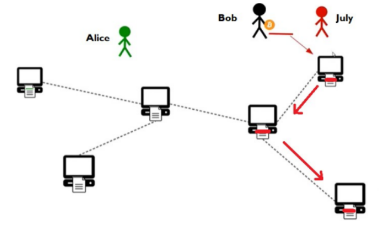

Supponiamo infatti che Bob, successivamente, spenda con un altro utente, July, gli stessi identici bitcoin che ha già inviato ad Alice. Questa nuova transazione (la transazione "rossa") rappresenta un vero e proprio **double spending** (doppia spesa). Ora, supponiamo che questa transazione rossa venga inserita nella rete attraverso un altro nodo, in un momento in cui non tutti i nodi hanno ancora ricevuto la precedente transazione verde. Un nodo specifico, chiamiamolo nodo N, potrebbe ricevere la transazione rossa prima di quella verde. Senza meccanismi di controllo, il nodo N scriverebbe direttamente la transazione rossa sul suo ledger. Più tardi, ricevendo la transazione verde, il nodo N riconoscerebbe il tentativo di doppia spesa e scarterebbe semplicemente quest'ultima transazione.

A questo punto, quando il nodo N riconosce il double spending, le transazioni sono già state memorizzate nei vari ledger sparsi per la rete. Il risultato è che il ledger replicato contiene ora due transazioni in conflitto. Quale delle due è da considerarsi valida? Diventa imperativo trovare un consenso su quale dei due valori debba essere definitivamente aggiunto al registro.

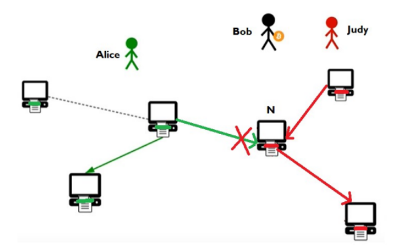

### La MemPool e la Necessità di Consenso

La soluzione a questo dilemma inizia con una specifica area di memoria. Ogni nodo mantiene nella propria memoria RAM una "memoria temporanea" denominata **MemPool**. La MemPool contiene una collezione di tutte le transazioni Bitcoin in attesa di conferma. Tali transazioni devono attendere che venga raggiunto un consenso prima di poter essere incluse nei successivi blocchi del ledger. È fondamentale notare che la MemPool non è da confondersi con l'insieme delle UTXO (Unspent Transaction Output). Le transazioni in conflitto possono verificarsi all'interno della MemPool, ma non nel ledger definitivo. Infatti, quando un nodo riceve una transazione in conflitto, ovvero un double spend, provvede semplicemente a scartarla dalla propria MemPool.

I nodi cercano continuamente di estrarre le transazioni dalla loro MemPool per inserirle nel ledger. Esiste una vera e propria competizione per aggiungerle. La decisione su quale transazione (quella rossa o quella verde) verrà aggiunta al ledger dipenderà unicamente da quale nodo vincerà questa competizione. La cosa più importante è garantire che non vengano aggiunte entrambe le transazioni al registro.

### Il Mining e la Propagazione dei Blocchi

Il consenso di Nakamoto è implementato, di fatto, come se fosse una lotteria. Il processo attraverso il quale i nodi competono per aggiungere le transazioni dalla MemPool al ledger è chiamato **mining**. Il vincitore di questa lotteria prende le transazioni valide dalla propria MemPool, le aggiunge al ledger e successivamente trasmette la versione aggiornata del suo ledger ai nodi vicini. In realtà, non viene inviato l'intero ledger, ma solamente le nuove transazioni che vi sono state appena aggiunte.

Cosa succede quando questa versione aggiornata del ledger raggiunge un nodo N che possedeva la transazione in conflitto?. Il nodo N, verificando il nuovo blocco, espelle la transazione conflittuale (quella verde) dalla propria MemPool. La MemPool agisce quindi come una sorta di stanza di compensazione (clearing house) per le transazioni. Una volta che il ledger aggiornato si è propagato, ogni nodo della rete avrà espulso la transazione in conflitto dalla propria MemPool e, infine, il destinatario legittimo (in questo caso July, nodo rosso) otterrà i suoi bitcoin.

### Struttura del Blocco e del Block Header

Il processo di mining consiste fondamentalmente nell'aggiunta di nuovi blocchi alla blockchain. È una competizione su scala di rete in cui ogni nodo può lavorare per tentare di aggiungere il blocco successivo.

Il processo inizia assemblando un "blocco candidato", costruito prendendo le transazioni dalla MemPool che vengono proposte per essere aggiunte al ledger. Successivamente, il nodo costruisce un **block header** (intestazione del blocco), che rappresenta essenzialmente un breve riassunto di tutte le transazioni contenute nel blocco e include alcuni metadati. Infine, il nodo esegue la Proof of Work (PoW).

Mentre le singole transazioni vengono create da chiunque possieda unità di valuta con lo scopo di trasferirle, i blocchi sono creati esclusivamente dai miner e incapsulano un gran numero di transazioni. L'elenco delle transazioni all'interno di un blocco è quasi 1000 volte più grande rispetto al solo block header. Questi blocchi vengono poi incatenati insieme per formare la blockchain.

Analizziamo ora i campi specifici del block header. Il primo è la **Version**, che indica la versione del protocollo in uso, utile per la risoluzione dei bug, per l'abilitazione di nuove funzionalità, per gestire soft e hard fork e per determinare quali funzionalità sono valide per quello specifico blocco. 

Il secondo campo è il **Time**, ovvero un timestamp basato sull'orologio Unix locale che indica i secondi trascorsi dalle 12:00 AM del 1° gennaio 1970. Questo valore registra l'ora di creazione del blocco e viene utilizzato per calibrare la difficoltà della Proof of Work, pur non essendoci alcuna sincronizzazione formale degli orologi tra i nodi.

Un altro campo vitale è il **mhash** (Merkle Tree Root). Questo è la radice del Merkle tree costruito sulle transazioni contenute nel blocco, dove le foglie dell'albero sono le transazioni stesse. Il Merkle tree viene costruito "on demand" e non è rappresentato esplicitamente all'interno del blocco. È fondamentale sottolineare che qualsiasi modifica a una singola transazione comporterebbe un cambiamento dell'mhash e, di conseguenza, un cambiamento dell'hash dell'intero blocco.

Troviamo poi il campo **hashprev** (Hash of Previous Block), che contiene l'hash del blocco precedente, ovvero il blocco su cui il miner sta costruendo il blocco attuale. Esso viene generato calcolando un doppio SHA-256 di tutti i campi dell'intestazione del blocco precedente, fungendo così da "hash link" che concatena la struttura al blocco passato. Infine, l'header include i campi **target** e **nonce**, che sono strettamente legati all'esecuzione della Proof of Work.

### Il Meccanismo della Proof of Work (PoW)

Il cuore del mining è la Proof of Work. L'operazione inizia impostando il valore del campo nonce nell'header del blocco a zero. Il miner applica quindi una doppia funzione di hash sull'intero block header, includendo questo nonce. L'obiettivo è verificare se il valore risultante è inferiore a una certa soglia stabilita, definita dal campo target.

Se l'hash calcolato non si trova al di sotto di questo target, il miner incrementa il valore del nonce. Mantenendo inalterate tutte le altre informazioni del block header ma incrementando il nonce, il miner ottiene un hash completamente diverso. Questo processo prosegue tramite tentativi continui, incrementando progressivamente il nonce fino a quando non viene trovato un valore che soddisfi il requisito di trovarsi sotto la soglia.

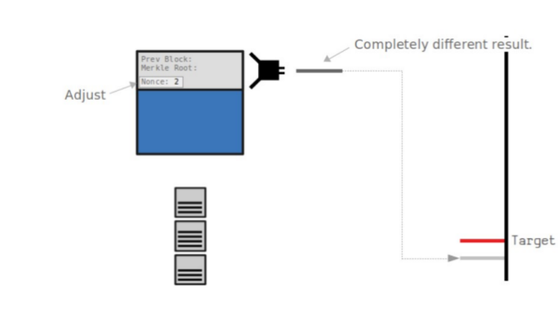

Per riassumere questo ciclo: si esegue il calcolo `SHA256(SHA256(Block-Header + Nonce))`. Se il valore dell'hash non è minore del target, si aggiunge 1 al nonce e si riprova. Se invece la condizione è soddisfatta, il blocco è stato validamente creato e viene inviato a tutti i nodi vicini.

### Un Chiarimento sulla Difficoltà e i "Leading Zeros"

In molti articoli o testi accademici potreste leggere che la Proof of Work viene risolta se e solo se l'hash calcolato produce un certo numero di zeri iniziali (leading zeros). Questa è tuttavia una semplificazione. Il numero di zeri iniziali nell'hash è in realtà un indicatore indiretto della difficoltà. Una difficoltà maggiore significa avere un target hash più basso, il che, a sua volta, richiede tendenzialmente che ci siano più zeri iniziali nell'hash del blocco.

Tuttavia, il numero di zeri iniziali potrebbe rimanere lo stesso anche se la difficoltà aumenta. Questo accade perché il valore del target hash potrebbe essere diminuito (rendendo la PoW più difficile), ma non essere diminuito a sufficienza da richiedere l'aggiunta di un ulteriore zero iniziale nell'hash. Per fare un esempio numerico, se il target iniziale fosse `001001` e venisse ridotto a `001000`, la difficoltà sarebbe oggettivamente aumentata, ma il numero di zeri iniziali rimarrebbe comunque pari a 2.

---

### Concetti Chiave

- **Consenso di Nakamoto**: Un approccio implicito al consenso distribuito basato su una competizione probabilistica, che evita la necessità di una rete chiusa e di votazioni formali.

- **Double Spending**: Il tentativo fraudolento di spendere la stessa unità di valuta in due transazioni diverse, problema storicamente ostico nei sistemi distribuiti e risolto elegantemente dalla blockchain.

- **MemPool**: L'area di memoria temporanea (RAM) in cui i nodi depositano le transazioni valide ricevute, in attesa che i miner le confermino inserendole in un blocco.

- **Block Header**: L'intestazione del blocco che racchiude i metadati essenziali, tra cui la radice di Merkle (mhash), il collegamento al blocco precedente (hashprev), e i campi necessari per il mining (target e nonce).

- **Proof of Work (PoW)**: Il meccanismo di convalida computazionale che richiede di trovare, per forza bruta, un valore *nonce* tale per cui l'hash del blocco risulti inferiore a un determinato *target* (soglia di difficoltà).

---

### All'interno della Proof of Work (PoW)

Come abbiamo visto, i campi **target** e **nonce** all'interno del Block Header sono gli elementi fondanti su cui si basa il lavoro dei miner. Per semplificare la comprensione della Proof of Work, possiamo focalizzarci sul numero di zeri iniziali (leading zeros) richiesti nell'hash risultante. Il target, di fatto, definisce quanti zeri devono essere obbligatoriamente presenti all'inizio dell'hash calcolato per considerare la prova valida.

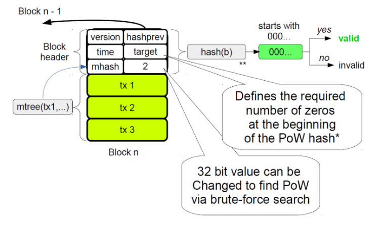

Il **nonce** è un valore a 32 bit che il miner può variare liberamente per tentare di trovare l'hash vincente tramite una ricerca esaustiva (brute-force search). Immaginiamo che il target richieda un hash che inizi con una stringa di zeri (ad esempio `000...`). Se, applicando la funzione di hash al blocco `hash(b)` variando il nonce, il risultato inizia con `010...` oppure `101...`, la prova è considerata invalida. Solo iterando fino a trovare un nonce che produca un hash che inizia effettivamente con `000...` il blocco verrà accettato come valido dalla rete.

È importante notare che blocchi diversi possono avere valori di target differenti. Questo significa che la **difficoltà** del problema matematico può essere sintonizzata (tuned) e modificata dinamicamente dal protocollo. Quando un blocco appena coniato (Block n) viene agganciato al suo precedente (Block n-1), le transazioni al suo interno passano dallo stato di transazioni non confermate (0 confirmation) allo stato di transazioni confermate (1 confirmation).

### La Selezione Casuale dei Nodi e il Consenso di Nakamoto

Ma come si seleziona, ad ogni round, quale nodo avrà il diritto di proporre il nuovo blocco? L'idea chiave alla base del sistema è che i nodi vengono selezionati in proporzione a una risorsa che è estremamente difficile da monopolizzare: la **potenza computazionale**. In Bitcoin, questa selezione avviene proprio sulla base del completamento della Proof of Work. I nodi che tentano di risolvere questo enigma sono chiamati **miner** e l'intero processo di convalida prende il nome di **mining**.

Il **Consenso di Nakamoto** prevede che, ad ogni round, venga eletto un "nodo leader" in modo del tutto casuale, come se pescasse un gettone vincente in una lotteria implementata tramite la PoW. Chiunque riesca a trovare il nonce corretto vince la competizione ed è autorizzato a proporre il blocco successivo. Affinché la rete sia sicura, questo processo deve selezionare un nodo onesto almeno nel 51% dei casi. Il nodo vincitore propone il nuovo blocco unilateralmente, senza dover contattare o chiedere il permesso agli altri nodi, e lo trasmette (broadcast) alla rete. Gli altri partecipanti si limiteranno a verificarne la validità formale per poi aggiornare le rispettive blockchain con il nuovo blocco eletto. Questa procedura è definibile come un'elezione casuale del leader che avviene per ogni singolo blocco.

Questo meccanismo offre un enorme vantaggio contro i cosiddetti **Sybil Attacks**. Rendendo costosa la proposta di nuovi blocchi, la validazione non può più essere manipolata semplicemente creando migliaia di identità fittizie (nodi) all'interno della rete. L'influenza di un utente è invece strettamente proporzionale alla potenza computazionale reale che immette nel sistema. Un attaccante malevolo avrebbe bisogno di risorse hardware ed energetiche incalcolabili per prendere il controllo, rendendo l'attacco impraticabile e garantendo la resistenza ai Sybil Attack.

Si deve quindi riformulare l'ipotesi di base della sicurezza: il sistema è sicuro se la maggioranza dei miner, pesata in base alla loro potenza di hashing (hash power), è onesta e segue il protocollo. Per assicurare questo, il protocollo fornisce potenti incentivi economici per incoraggiare un comportamento virtuoso.

In sintesi, il Consenso di Nakamoto è un approccio *implicito* : non esistono votazioni né algoritmi collettivi eseguiti in sincrono. Anche la gestione dei nodi malevoli è implicita. Nonostante i nodi possano temporaneamente avere visioni incoerenti del registro (dando origine a biforcazioni o *fork*), il consenso convergerà inevitabilmente sulla catena più lunga (eventual consistency), a patto che la maggioranza dei partecipanti sia onesta.

### Definizione Formale e Complessità della PoW

Dal punto di vista matematico, possiamo definire la Proof of Work come una funzione $F_{d}(c,x)\rightarrow\{\text{true, false}\}$. In questa formula:

- $d$ è la **difficoltà**, un numero positivo usato per regolare il tempo di esecuzione.

- $c$ è la **challenge** (sfida), ovvero la stringa di dati data dall'header del blocco senza il nonce.

- $x$ è il **nonce**, la stringa incognita da individuare.

Le proprietà fondamentali di questa funzione prevedono che, con $d$ e $c$ fissati, il calcolo di $F_{d}(c,x)$ sia velocissimo se si conoscono tutti i parametri. Al contrario, trovare un valore $x$ tale per cui l'output sia `true` deve essere un'operazione computazionalmente ardua, seppur fattibile.

Ma cosa rende questa prova così difficile? L'output della funzione di hash (come lo SHA-256) si comporta come una stringa casuale di 256 bit. Ogni singolo bit ha la medesima probabilità di essere 0 o 1, in modo totalmente indipendente dagli altri, come se fosse il risultato del lancio di una moneta (coin flips). Di conseguenza, non esiste alcuna scorciatoia analitica: l'unico modo per trovare l'output corretto è procedere per forza bruta.

La probabilità $p$ che l'hash del blocco scenda sotto la soglia determinata dal target $T$ è data dalla formula $p=\frac{T+1}{2^{256}}$. Ne consegue che il numero medio di tentativi richiesti per trovare un hash valido è esattamente $\frac{1}{p}$. Per dare un ordine di grandezza, osservando il campo `nBits` delle transazioni al 1° gennaio 2017, il numero medio di tentativi richiesti era di circa $2^{70}$.

### Altri Utilizzi della Proof of Work

Sebbene sia diventata celebre con Bitcoin, la PoW non è stata inventata per questo scopo. Nasce come meccanismo crittografico per permettere a una parte di dimostrare a un'altra di aver impiegato un certo ammontare di risorse computazionali per un dato periodo di tempo. Questi "puzzle crittografici" devono poter essere risolti, devono richiedere uno sforzo considerevole impossibile da eludere, ma, al contempo, lo sforzo impiegato deve poter essere verificato in modo estremamente rapido ed economico dal ricevente.

Prima di Bitcoin, la PoW era stata proposta per:

- **Deterrenza contro attacchi DOS (Denial-of-Service)**: un fornitore di servizi concede l'accesso a un utente solo se quest'ultimo risolve un problema computazionalmente costoso, agendo da limitatore (throttle) per le richieste.

- **Deterrenza contro lo SPAM via e-mail**: l'idea era quella di affrancare ogni messaggio con un "francobollo digitale". Invece di pagare con denaro, si paga con cicli di CPU. Per un utente normale che invia poche e-mail, il calcolo della PoW è trascurabile ; per uno spammer che invia milioni di messaggi, il costo computazionale diventerebbe proibitivo.

### Riepilogo: Struttura del Block Header

Per avere un quadro completo, riassumiamo l'anatomia di un blocco e del suo header:

| **Campo**               | **Dimensione**          | **Descrizione**                      |
| ----------------------- | ----------------------- | ------------------------------------ |
| **Block Size**          | 4 byte                  | Dimensione del blocco                |
| **Magic Number**        | 4 byte                  | Identificatore di rete               |
| **Version**             | 4 byte                  | Versione del protocollo              |
| **Previous Block Hash** | 32 byte                 | Hash del blocco precedente           |
| **Merkle Root**         | 32 byte                 | Radice dell'albero delle transazioni |
| **Timestamp**           | 4 byte                  | Data e ora di creazione              |
| **Difficulty Target**   | 4 byte                  | Soglia di validità per la PoW        |
| **Nonce**               | 4 byte                  | Valore arbitrario per il mining      |
| **Transaction Counter** | Variabile (1-9 byte)    | Numero di transazioni incluse        |
| **Transaction List**    | Variabile (fino a 1 MB) | Lista completa delle transazioni     |

*[Tabella basata sui riferimenti strutturali del blocco: cite: 678]*

### Dinamiche del Mining e Propagazione dei Blocchi

Analizziamo ora un esempio pratico. Supponiamo che al Tempo $t$, le transazioni "Alice invia 1 BTC a Bob" e "Dave invia 1 BTC a Bob" vengano trasmesse in broadcast sulla rete, ma non siano ancora sulla blockchain. I vari miner (rappresentati metaforicamente con dei picconi) iniziano a competere per proporre il blocco successivo elaborando la Proof of Work.

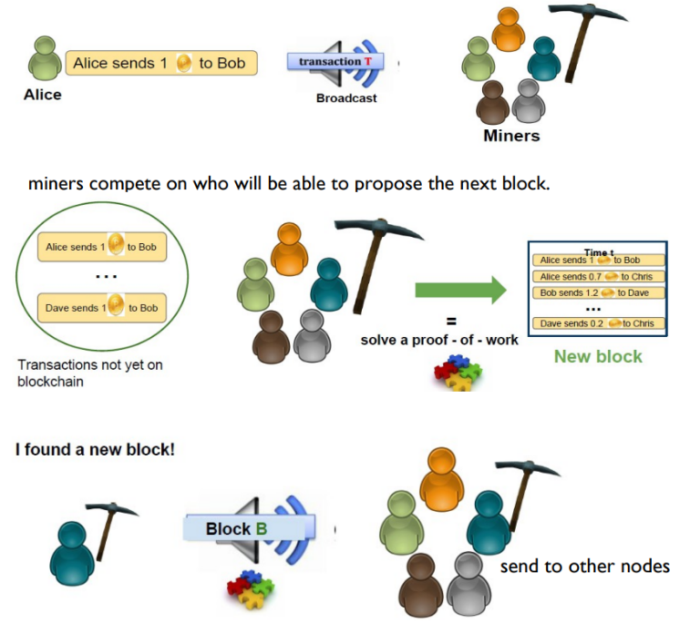

### Perché diventare un Miner? La Coinbase Transaction e gli Incentivi

Mantenere hardware costoso e consumare enormi quantità di energia deve avere una giustificazione economica. Come anticipato, vi sono due meccanismi di incentivo che spingono i miner ad essere onesti e a partecipare alla rete:

1. **Block Reward (Ricompensa del blocco)**: È il primo tipo di incentivo. Il protocollo conia letteralmente nuove monete (mints new coins) e le dona al miner come pagamento per il servizio di creazione del blocco. Questo è in assoluto l'unico modo per immettere nuovi bitcoin in circolazione, motivo per cui il termine "mining" è stato coniato in analogia all'estrazione dell'oro.

2. **Transaction Fee (Commissione di transazione)**: Il secondo tipo di incentivo è dato dalla differenza tra gli input e gli output di una transazione. Gli utenti le inseriscono volontariamente per ottenere una migliore "quality of service" e assicurarsi che i miner diano priorità alle loro transazioni.

Entrambi questi incentivi vengono incassati tramite una transazione speciale inserita nel blocco: la **Coinbase Transaction**. Questa è sempre rigorosamente la primissima transazione elencata in ogni blocco. A differenza delle altre, non consuma alcuna UTXO precedente, ma crea bitcoin dal nulla. Possiede un singolo input fittizio (dummy input) che non è collegato a nulla e funge semplicemente da spazio in cui il miner può inserire un messaggio arbitrario. Celebre è il caso di Satoshi Nakamoto, che nel *Genesis block* (il blocco zero) inserì il titolo di giornale: *"The Times 03/Jan/2009: Chancellor on brink of second bailout for banks."*. L'output di questa transazione, che ammonta alla somma del block reward e di tutte le commissioni del blocco, è indirizzato a uno o più indirizzi bitcoin di proprietà del miner stesso.

### Calibrazione del Reward e L'Halving

Il sistema è progettato in modo che la ricompensa dei blocchi non sia fissa, ma vari dinamicamente nel tempo. Il protocollo prevede che il block reward venga dimezzato (halving) ogni 210.000 blocchi estratti, il che avviene all'incirca ogni 4 anni, a seconda del tasso di creazione dei blocchi.

Per ripercorrere la storia:

- Nell'Era 1 il reward era di $50/1 = 50\text{ BTC}$.

- Nell'Era 2 è sceso a $50/2 = 25\text{ BTC}$.

- Nell'Era 3 è diventato $12.5\text{ BTC}$.

- Attualmente (dopo l'ultimo halving di Maggio 2024), ci troviamo nel quinto periodo e il reward è fissato a $3.125\text{ BTC}$.

- Il processo continuerà fino ad arrivare all'Era 33, quando la ricompensa sarà pari alla più piccola frazione indivisibile, ovvero $1\text{ Satoshi}$ ($0.00000001\text{ BTC}$).

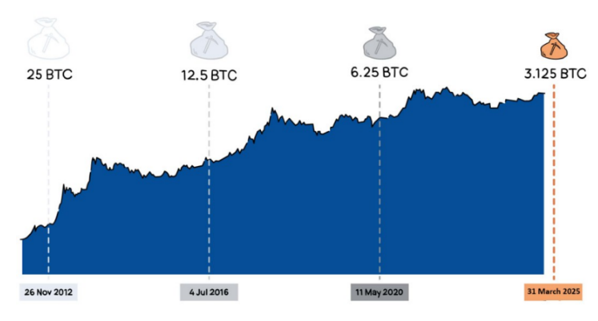

Questo meccanismo di progressiva deflazione garantisce la **Limited Supply** di Bitcoin: non esisteranno mai più di 21 milioni di bitcoin. Questa caratteristica lo rende resistente all'alta inflazione , discostandosi completamente dalle valute legali (fiat currency) dove l'emissione monetaria è decisa arbitrariamente da uno stato o da un ente centrale. La fornitura smetterà matematicamente di crescere intorno all'anno 2140. Se si possiede 1 bitcoin oggi, si avrà la certezza matematica di possedere per sempre almeno un ventunomilionesimo dell'intera riserva monetaria.

Storicamente, la stragrande maggioranza dei profitti dei miner è derivata dal block reward. Nel tempo, tuttavia, col procedere degli halving, le transaction fees andranno a coprire una percentuale sempre più ampia, fino a diventare l'unica fonte di reddito. Contemporaneamente, l'ingresso di nuovi miner in cerca di guadagno abbassa la probabilità statistica per i singoli miner già presenti di trovare un blocco; per restare competitivi, essi sono costretti a incrementare continuamente il proprio hash rate.

### La Difficoltà Variabile e la Regola dei 10 Minuti

Con la tecnologia hardware che migliora costantemente e l'interesse variabile che spinge nuovi nodi ad entrare o uscire dalla rete, come fa il protocollo a mantenere stabile l'emissione? La difficoltà della Proof of Work è determinata da una media mobile (moving average) calibrata per puntare a un numero medio predefinito di blocchi all'ora. Come disse lo stesso Satoshi Nakamoto: *"If they're generated too fast, the difficulty increases"* (Se vengono generati troppo velocemente, la difficoltà aumenta).

L'obiettivo aureo di Bitcoin è far sì che venga estratto un nuovo blocco mediamente ogni **10 minuti**. Il target non è un valore fisso, ma viene costantemente corretto dal protocollo per raggiungere questo scopo. La frequenza effettiva dipende dalla difficoltà della PoW e dalla potenza totale dei miner attivi. Modificando la prima in risposta alla seconda, l'equilibrio viene mantenuto.

Ma perché proprio 10 minuti? Satoshi stabilì questa tempistica per concedere ai nuovi blocchi il tempo fisico di propagarsi attraverso l'intera topologia della rete P2P prima che un altro blocco venga trovato. Se i broadcast si rivelassero più lenti del previsto, il target time andrebbe alzato. *"Vogliamo che i blocchi si propaghino solitamente in molto meno tempo rispetto a quello necessario per generarli, altrimenti i nodi spenderebbero troppo tempo a lavorare su blocchi obsoleti"* (Satoshi Nakamoto).

---

### Concetti Chiave

- **Nonce e Target**: I due parametri fondamentali della PoW. Il primo è la variabile indipendente alterata dal miner, il secondo è la soglia di validazione stabilita dinamicamente dal protocollo.

- **Difesa Anti-Sybil**: Affidando il diritto di voto alla potenza computazionale (PoW) invece che all'identità di rete (indirizzi IP o account), Bitcoin annulla i vantaggi di chi tenta di inondare la rete con finti nodi.

- **Coinbase Transaction**: La transazione speciale posizionata all'inizio di ogni blocco che funge da meccanismo di conio per i nuovi bitcoin ed elargisce le commissioni al miner vincitore.

- **Halving e Hard Cap**: La progressiva riduzione del 50% della ricompensa per il mining, che garantisce un limite massimo asintotico di 21 milioni di Bitcoin circolanti, contrastando l'inflazione sistemica.

- **Aggiustamento della Difficoltà**: Meccanismo omeostatico del protocollo che altera la complessità della PoW per assicurare che, indipendentemente dalla potenza di calcolo globale immessa nella rete, venga emesso un blocco ogni 10 minuti per facilitare la corretta propagazione dei dati ed evitare sprechi di risorse.

---

### L'Importanza di una Frequenza di 10 Minuti

Come discusso in precedenza, il protocollo Bitcoin mira a mantenere un intervallo costante per la generazione dei blocchi. Ma per quale motivo è stata scelta una frequenza di 10 minuti? Se i blocchi venissero estratti troppo frequentemente, si presenterebbe un problema critico: i miner rischierebbero di costruire catene in competizione tra loro. Alla fine, solamente una di queste catene alternative diventerebbe la più lunga e verrebbe accettata dalla rete. Di conseguenza, una parte dei miner sprecherebbe preziose risorse energetiche e computazionali lavorando su una catena destinata a essere abbandonata, fenomeno che si tradurrebbe in una minore sicurezza effettiva per l'intero sistema.

Lo scenario ideale per la stabilità del network prevede che tutti i miner concentrino la loro potenza di calcolo (mining power) sull'estensione di un'unica catena di blocchi condivisa. Questo allineamento è possibile solo se si concede al blocco appena coniato il tempo materiale di propagarsi attraverso l'intera topologia della rete prima che un altro miner riesca a estrarre il blocco successivo.

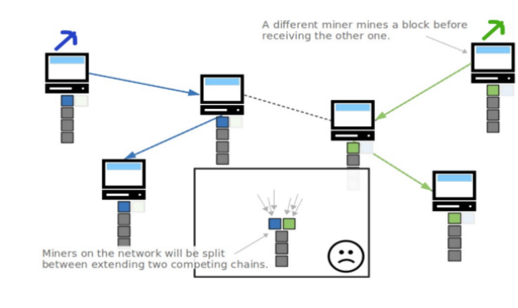

### Bitcoin contro Ethereum: Scelte Progettuali a Confronto

Scegliere un tempo di blocco (block time) più breve offre indubbiamente alcuni vantaggi, tra cui tempi di conferma delle transazioni molto più rapidi e una minore varianza nei pagamenti per i miner. Una ridotta varianza nei profitti diminuisce, a sua volta, la necessità per i miner di aggregarsi in grandi pool (mining pools) per garantirsi entrate costanti. Questa è, ad esempio, la scelta architetturale intrapresa da Ethereum. Tuttavia, una tempistica più serrata non è esente da conseguenze: essa genera intrinsecamente un numero maggiore di fork (biforcazioni) nella catena e costringe gli sviluppatori a implementare un sistema di ricompense (rewarding system) molto più complesso per gestire i blocchi "orfani".

### La Difficoltà Variabile e il Ricalcolo del Target

In un ambiente decentralizzato e aperto, la potenza di calcolo dedicata al mining viene aggiunta in modo continuo, poiché nuovi miner possono decidere di unirsi alla rete in qualsiasi momento. Con l'immissione di maggiore potenza computazionale, aumenta la probabilità che un miner riesca a risolvere la **Proof of Work**, provocando un inevitabile aumento della frequenza con cui i blocchi vengono minati. Per bilanciare questo fenomeno e mantenere il tempo di blocco attorno ai 10 minuti, il protocollo prevede che il **target** (il valore soglia che l'hash del blocco non deve superare) non sia un parametro fisso.

Il target iniziale, scritto nel Genesis Block il 3 gennaio 2009, fu con tutta probabilità una stima (best-guess) di Satoshi Nakamoto per stabilire un punto di partenza sufficientemente difficile da garantire un intervallo di 10 minuti.

[RIFERIMENTO VISIVO DEL PROFESSORE: Confronto tra l'hash del Genesis Block e l'hash di un blocco più recente per evidenziare visivamente l'enorme incremento del numero di zeri iniziali richiesti, indice dell'aumento esponenziale della difficoltà]

Il meccanismo di ricalcolo della difficoltà interviene ogni $2016$ blocchi. Questo numero non è casuale: rappresenta esattamente il numero di blocchi estratti in due settimane, ipotizzando una frequenza perfetta di un blocco ogni 10 minuti ($14 \text{ giorni} \times 24 \text{ ore} \times 6 \text{ blocchi all'ora} = 2016$). Due settimane corrispondono a $20160$ minuti. Il sistema opera misurando la differenza tra il campo "time" dell'ultimo blocco di questo ciclo e il primo, calcolando così il tempo effettivo impiegato per minare gli ultimi 2016 blocchi. Se il tempo effettivo è inferiore a quello atteso — ad esempio, se sono stati impiegati $16128$ minuti invece di $20160$ — significa che i blocchi sono stati estratti troppo velocemente, presumibilmente a causa di un aumento dei miner nella rete. In questo scenario, il protocollo calcola il rapporto $\frac{16128}{20160} = 0.8$ e lo utilizza come moltiplicatore per il target. Moltiplicando per un numero inferiore a 1, il target si abbassa, rendendo la Proof of Work più difficile.

Al contrario, se i blocchi vengono estratti troppo lentamente, ad esempio in $22176$ minuti, il calcolo produrrà un rapporto di $\frac{22176}{20160} = 1.1$. Il target verrà quindi moltiplicato per $1.1$; alzandosi, il target rende più facile ottenere un valore di hash valido, abbassando la difficoltà del sistema.

### Condivisione del Target e la Metafora delle Freccette

Ci si potrebbe chiedere se, in un network decentralizzato, tutti i nodi condividano effettivamente lo stesso target. La risposta è affermativa. Sebbene ogni nodo sia del tutto autonomo e non esista alcuna entità centrale preposta a regolare o comunicare il target, il sistema funziona grazie a un comportamento auto-adattivo. Tutti i nodi eseguono in modo indipendente l'esatto medesimo algoritmo e possiedono la stessa cronologia di blocchi nelle loro catene; di conseguenza, finiranno immancabilmente per ricalcolare e condividere il medesimo target.

Per comprendere intuitivamente la Proof of Work, possiamo ricorrere a un'efficace metafora: è come "lanciare freccette a un bersaglio essendo bendati". In questa analogia, vi è un'uguale probabilità di colpire qualsiasi anello del bersaglio. Il successo si ottiene quando la freccetta atterra all'interno del cerchio verde. La difficoltà dell'impresa è inversamente proporzionale alle dimensioni di questo cerchio verde. L'hardware di mining più potente è paragonabile a "lanciatori più veloci", capaci di effettuare più tiri al secondo. Se i lanciatori diventano progressivamente più abili, il cerchio verde deve rimpicciolirsi per mantenere la competizione equilibrata.

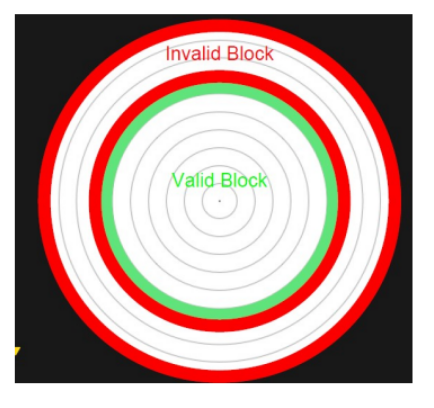

Modificare l'estensione del cerchio verde equivale, nel protocollo, a sintonizzare lo sforzo computazionale aumentando o riducendo il numero di zeri iniziali richiesti nel prefisso dell'hash. Dal punto di vista probabilistico, l'aggiunta di un singolo zero iniziale raddoppia mediamente lo sforzo computazionale necessario, mentre la rimozione di uno zero lo dimezza.

### Un Ecosistema Perfettamente Auto-Adattivo

Tutte queste meccaniche concorrono a creare un sistema brillantemente auto-adattivo. Poiché il lavoro di mining prevede una ricompensa economica, è naturale che sempre più miner si uniscano costantemente alla rete. Questo afflusso di partecipanti si traduce in una maggiore potenza di elaborazione, che a sua volta garantisce maggiori possibilità di trovare l'hash corretto in tempi più rapidi. Con l'incremento del tasso di creazione dei blocchi e la diminuzione del tempo medio di mining, interviene il protocollo. Poiché il sistema è programmato per mantenere un tempo di estrazione ideale di circa 10 minuti, esso reagisce diminuendo il valore del target per aumentare la difficoltà. Questo provvidenziale aumento di difficoltà fa sì che il tasso di creazione dei blocchi rallenti e il tempo medio di mining aumenti nuovamente, stabilizzando il sistema. Naturalmente, lo stesso principio si applica in senso inverso se il tasso di creazione dei blocchi dovesse calare. Questo ciclo continuo dimostra la fondamentale importanza del valore del target nell'architettura di Bitcoin.

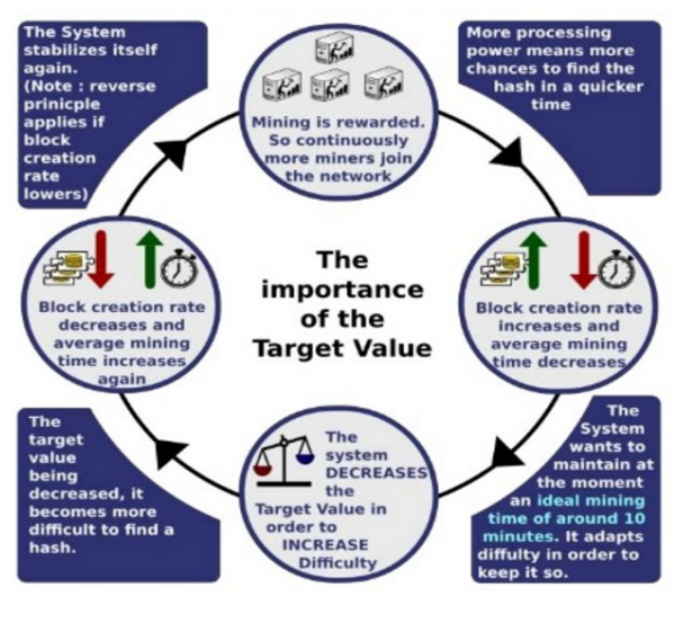

### Struttura e Identificatori della Blockchain

In conclusione di questa sezione, osserviamo la macro-struttura della **Bitcoin Blockchain**. Essa si presenta come una lista lineare di blocchi, ognuno dei quali è strutturalmente composto da un block header e da una lista completa di transazioni. La solidità di questa struttura è garantita dai puntatori hash (hash pointers) che concatenano indissolubilmente ogni blocco al suo predecessore.

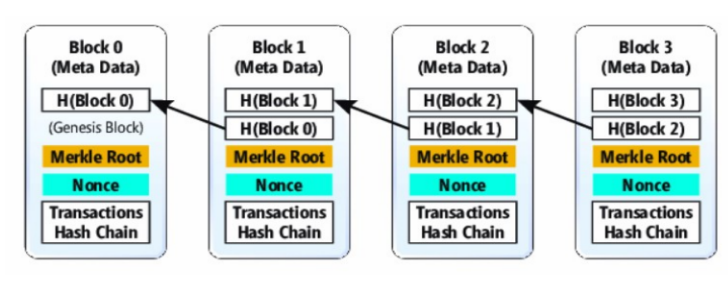

All'interno di questo vasto registro, in che modo i blocchi vengono identificati con precisione dai nodi? Esistono due identificatori primari. Il primo è il **block hash**, un valore che non viene memorizzato fisicamente all'interno del blocco, ma viene ricalcolato dal nodo non appena il blocco viene ricevuto dalla rete. Questo approccio facilita le operazioni di indicizzazione locale e di recupero rapido delle informazioni. Il secondo identificatore è la **block height** (altezza del blocco), che rappresenta il numero esatto di blocchi che lo precedono nella blockchain. Il conteggio della *height* inizia sempre dal Genesis Block, il quale, essendo il primo tassello in assoluto della catena, si trova per definizione all'altezza $0$.

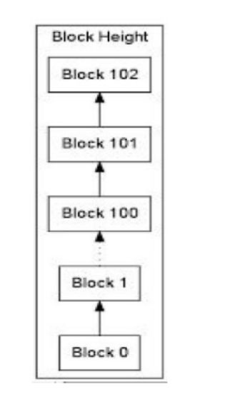

---

### Concetti Chiave

- **Tempo di Blocco (Block Time)**: Il protocollo punta a un intervallo ideale di 10 minuti per consentire la corretta propagazione globale dei dati ed evitare catene concorrenti.

- **Difficoltà Variabile (Difficulty Adjustment)**: Il meccanismo automatico che, ogni 2016 blocchi, altera il parametro "Target" per contrastare le fluttuazioni della potenza di calcolo (hashrate) dei miner.

- **Sistema Auto-Adattivo**: Un ecosistema omeostatico in cui incentivi economici, potenza computazionale e complessità crittografica si bilanciano costantemente senza alcun intervento umano.

- **Block Hash e Block Height**: I due identificatori principali di un blocco. Il primo è generato al volo dai nodi per l'indicizzazione, il secondo esprime la distanza cronologica dal Genesis Block.

---

### Inviolabilità della Blockchain (Tamper Freeness)

Una delle domande più frequenti quando si studia Bitcoin riguarda la sua effettiva resistenza alle manomissioni, definita in inglese **Tamper Freeness**. Immaginiamo che un attaccante decida di alterare una singola transazione all'interno di un blocco già confermato. Questa minima modifica comporterebbe un effetto a catena devastante per l'attaccante (avalanche effect). Alterando la transazione, la radice dell'albero di Merkle (il Merkle root) cambierebbe inevitabilmente, modificando a sua volta l'intero header del blocco. Di conseguenza, il **nonce** faticosamente trovato per quel blocco non sarebbe più valido, e l'attaccante sarebbe costretto a ri-eseguire l'intera Proof of Work per calcolare un nuovo nonce corretto.

Ma il problema non si ferma qui. Poiché ogni blocco successivo contiene un puntatore hash (hash pointer) al blocco precedente, la modifica del primo blocco invalida automaticamente l'header del blocco successivo. Il nonce del blocco successivo non sarà più valido, costringendo l'attaccante a ri-eseguire la PoW anche per esso, e poi per il successore del successore, in una catena inarrestabile. In sintesi, per manomettere un blocco passato, un attaccante dovrebbe ricalcolare la Proof of Work per l'intera porzione di catena che lo segue, richiedendo una potenza di calcolo talmente enorme da rendere l'operazione di fatto impossibile.

### Perché i Blocchi e non le Singole Transazioni?

A questo punto, è lecito chiedersi: perché i miner utilizzano i blocchi come unità di lavoro anziché validare le singole transazioni una per una? Le motivazioni sono principalmente tre. In primo luogo, una catena di hash composta da blocchi è nettamente più corta rispetto a una catena composta da singole transazioni, rendendo i processi di verifica molto più rapidi. In secondo luogo, fare mining su singole transazioni richiederebbe un quantitativo di lavoro complessivo enormemente superiore e frammentato. Infine, dal punto di vista dell'architettura di rete, trasmettere un singolo blocco aggregato risulta molto più efficiente in termini di comunicazione rispetto alla trasmissione di migliaia di transazioni isolate.

### I Fork Temporanei della Blockchain

Nonostante la natura deterministica della crittografia, il sistema è soggetto a eventi probabilistici. Cosa succede se due miner "vincono" la Proof of Work quasi contemporaneamente? Questo scenario genera i cosiddetti **temporary forks** (biforcazioni temporanee). I due miner validano e trasmettono in broadcast il loro blocco quasi in simultanea. Entrambi i blocchi puntano al medesimo blocco genitore, creando di fatto un bivio, una biforcazione nella blockchain: la rete vede ora due rami distinti che partono dallo stesso punto.

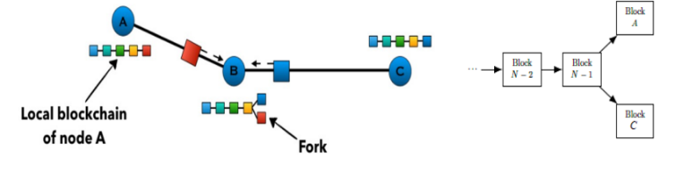

È fondamentale sottolineare che entrambi i rami sono assolutamente legittimi, in quanto creati da miner onesti che hanno seguito alla lettera le regole del protocollo. Tuttavia, questa duplicazione crea due istanze parallele della blockchain, portando alcune transazioni ad apparire in un blocco ma non nell'altro. Diventa quindi imperativo per il sistema riconciliare queste due versioni per stabilire in modo univoco quali bitcoin siano stati realmente spesi. Questo fenomeno è radicalmente diverso da un attacco di *double spending* orchestrato da un miner disonesto.

A livello di propagazione di rete, ogni nodo riceverà il blocco A o il blocco C per primo, a seconda della sua vicinanza topologica ai rispettivi miner. Il nodo aggiungerà il blocco ricevuto per primo alla sua copia locale della blockchain e, se è a sua volta un miner, inizierà immediatamente a fare mining costruendo su di esso. Se successivamente dovesse ricevere anche il secondo blocco concorrente, riconoscerà la creazione di un fork e archivierà temporaneamente questo blocco secondario in una cache locale.

### La Regola della Catena Più Lunga e le Sei Conferme

In presenza di un fork, i due rami possono crescere in modo indipendente poiché i diversi miner stanno lavorando su diramazioni separate. Il protocollo risolve questa ambiguità imponendo la **Nakamoto Rule** (la regola di Nakamoto): vince sempre il fork più lungo. Se un miner riceve un nuovo blocco che rende una delle diramazioni più lunga dell'altra, esso abbandona istantaneamente il ramo più corto per agganciarsi a quello vincente. Tutte le transazioni incluse nel ramo "abbandonato" (che non sono state incluse anche nel ramo vincente) vengono reinserite nel pool delle transazioni non ancora approvate (la MemPool).

Questa dinamica spiega l'importanza della regola delle **6 conferme** (six confirmation rule). Una transazione non viene considerata definitivamente confermata fino a quando non vi sono almeno 5 blocchi successivi ad essa all'interno del fork più lungo (per un totale di 6 blocchi). Questo lasso di tempo concede alla rete il margine necessario per raggiungere un accordo definitivo sull'ordine dei blocchi. Sebbene 6 sia il valore di default, il numero di conferme richieste può essere deciso autonomamente anche dai client che ricevono i pagamenti.

### L'Algoritmo di Ricezione dei Blocchi

Per comprendere l'implementazione logica, analizziamo l'algoritmo eseguito da un nodo quando riceve un nuovo blocco $b$. Il nodo identifica la testa attuale della sua catena come il blocco $b_{max}$, situato a un'altezza $h_{max}$. Quando riceve $b$, lo connette all'albero come figlio del suo blocco genitore $p$, assegnandogli un'altezza $h_{b} = h_{p} + 1$.

Se l'altezza del nuovo blocco risulta maggiore dell'altezza massima registrata fino a quel momento (se $h_{b} > h_{max}$), il nodo aggiorna i suoi parametri: la nuova altezza massima diventa $h_{max} = h_{b}$ e il nuovo blocco di testa diventa $b_{max} = b$. Successivamente, il nodo ricalcola l'UTXO (Unspent Transaction Cache, la cache delle transazioni non spese) per il percorso che porta al nuovo $b_{max}$ ed esegue una pulizia della MemPool, eliminando le transazioni appena confermate.

### I Soft Fork e la Probabilità di Estensione Parallela

Sorge spontaneo chiedersi se sia possibile che, durante un fork, blocchi validi continuino a essere trovati contemporaneamente su entrambi i rami, facendoli crescere perfettamente in parallelo (fenomeno noto come **soft fork** involontario a lungo termine). Dal punto di vista teorico è possibile, ma nella realtà è estremamente improbabile. La probabilità che questa simmetria si ripeta ricorsivamente per un lungo periodo è quasi nulla, poiché la casualità crittografica del mining e le variabili di ritardo nella propagazione di rete impediscono questo parallelismo. Inevitabilmente, i nodi, tenendo traccia degli header in entrambi i fork, passeranno sempre al ramo che per primo si dimostrerà più lungo.

Questa dinamica trova fondamento formale nel **Teorema del Consenso di Nakamoto,** il quale afferma che i fork vengono inevitabilmente risolti e tutti i nodi finiranno per convergere (eventual consistency) sulla medesima blockchain più lunga. La dimostrazione logica (proof sketch) si basa sul fatto che, per far sopravvivere un fork, coppie di blocchi dovrebbero essere estratte in rapida successione su rami distinti all'infinito. La probabilità che i rami vengano estesi quasi simultaneamente diminuisce in modo esponenziale all'aumentare della lunghezza del fork, garantendo che, alla fine, un solo ramo prevarrà.

### La Vera Struttura: Un Albero, non una Catena

Alla luce di queste dinamiche, emerge che la vera struttura di Bitcoin non è una semplice linea retta, ma piuttosto un albero di blocchi. Quella che noi chiamiamo comunemente "blockchain" è semplicemente il percorso più lungo all'interno di questo albero. I percorsi "morti", ovvero i rami abbandonati, contengono i cosiddetti **orphan blocks** (blocchi orfani).

[RIFERIMENTO VISIVO DEL PROFESSORE: Diagramma ad albero che mostra la biforcazione dal Blocco 100, evidenziando il ramo vincente (Blocchi 101-107) e i rami morti contenenti i blocchi orfani]

In questa struttura, l'altezza del blocco (Block Height) rappresenta il suo ordine numerico sequenziale all'interno del percorso più lungo, partendo dal Genesis Block. La testa della blockchain (blockchain head) è, di conseguenza, l'ultimissimo blocco aggiunto in cima a questo percorso. A livello di dati grezzi, ogni nodo di questo albero si porta dietro una struttura stratificata di identificatori che include, tra gli altri: Magic Number, Block Size, Version, Previous Block Hash, Merkle Root, Timestamp, Difficulty Target, Nonce, Transaction Counter e l'intera lista delle transazioni.

### Conclusioni: Consenso Esplicito e i Limiti degli Approcci Classici

Per chiudere questo capitolo, è utile posizionare il lavoro di Nakamoto rispetto alla letteratura preesistente sui sistemi distribuiti. Esistono storicamente numerosi algoritmi per raggiungere il **consenso esplicito**, in cui i nodi eseguono procedure distribuite di scambio messaggi per accordarsi su uno stato. Modelli classici e ampiamente studiati includono Paxos, Raft, la Byzantine Fault Tolerance (BFT) e la Practical Byzantine Fault Tolerance (PBFT).

Nonostante il consenso sia studiato da oltre 30 anni, algoritmi celebri come Paxos non funzionano per Bitcoin. Questo perché le soluzioni tradizionali sono state progettate per ambienti "chiusi" o reti di tipo permissioned (autorizzate), dove i nodi sono preventivamente identificati, ognuno conosce l'identità degli altri e può indirizzare messaggi a destinatari specifici.

Al contrario, Bitcoin è una rete P2P aperta, pubblica e priva di permessi (permissionless). La rete è caratterizzata da un **high churn** (elevato tasso di abbandono), i nodi vanno e vengono costantemente, chiunque può unirsi al sistema in qualsiasi momento e non si conoscono a priori. In questo ecosistema dominato dalla regola *"I do not know the identity of all other nodes"* (Non conosco l'identità di tutti gli altri nodi), mancano canali di comunicazione autenticati e non c'è sincronizzazione di rete. Ecco perché il colpo di genio di Bitcoin non è stato puramente tecnico, ma ha richiesto l'invenzione di un approccio completamente implicito: il Consenso di Nakamoto.

---

### Concetti Chiave

- **Tamper Freeness**: La resistenza intrinseca della blockchain alle manomissioni, garantita dal fatto che alterare un dato richiede il ricalcolo della Proof of Work per quel blocco e per tutti i blocchi successivi.

- **Temporary Forks**: Biforcazioni naturali e temporanee della rete che si verificano quando due miner validano un blocco quasi contemporaneamente, creando rami concorrenti legittimi.

- **Regola della Catena Più Lunga (Nakamoto Rule)**: Il principio di risoluzione dei conflitti secondo cui i nodi convergono sempre sul ramo della blockchain che presenta il maggior accumulo di Proof of Work (il ramo più lungo).

- **Albero dei Blocchi e Blocchi Orfani**: La struttura reale di Bitcoin è un albero; la blockchain ne rappresenta solo il percorso più lungo, mentre i rami abbandonati diventano blocchi orfani (orphan blocks) contenenti transazioni che verranno ributtate nella MemPool.

- **Limiti del Consenso Classico**: Algoritmi tradizionali come Paxos o PBFT falliscono in Bitcoin perché richiedono reti chiuse con nodi a identità nota, incompatibili con l'alta volatilità (high churn) e l'apertura totale (permissionless) delle reti P2P decentralizzate.

---

# Lezione 10: Attacchi alla Rete Bitcoin - Selfish Mining, Malleability e Mining Pools

### Architettura e Modelli di Sicurezza

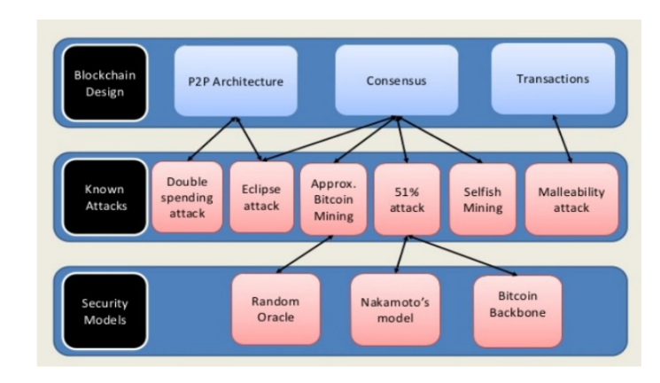

---

### L'Attacco di Double Spending: Approcci Ingenui

Il concetto alla base del **Double Spending Attack** consiste nel tentativo fraudolento di un compratore di spendere lo stesso identico bitcoin due volte, inviandolo simultaneamente a due venditori diversi.

Una prima soluzione "ingenua" per tentare questo attacco prevede semplicemente l'invio contemporaneo delle due transazioni alla rete. Di conseguenza, entrambe le transazioni finiscono nella Mempool dei minatori. Tuttavia, un minatore onesto inserirà solamente una delle due transazioni nel blocco successivo, mentre la seconda verrà considerata non valida e, pertanto, non verrà confermata dal minatore che estrarrà il blocco seguente.

Sorge spontanea una domanda: cosa accade se le due transazioni vengono validate simultaneamente da due minatori diversi? In questo scenario, la blockchain si biforca (fork). Mentre questa divisione è in corso, una qualsiasi delle due catene potrebbe essere abbandonata (orphaned). Alla fine, solamente uno dei due blocchi, e la corrispondente transazione in esso contenuta, verrà definitivamente inserito nella catena a lungo termine. È per mitigare questo problema vige la regola della catena più lunga (longest chain rule), la quale impone di attendere 6 conferme prima di considerare una transazione definitivamente accettata.

Un secondo approccio, anch'esso ingenuo, prevede che il compratore stesso agisca come un minatore malintenzionato. Egli potrebbe validare un blocco e includervi deliberatamente entrambe le transazioni in conflitto. In questo caso, però, gli altri nodi della rete, verificando la validità del blocco, lo rigetterebbero istantaneamente. L'attacco fallirebbe miseramente e nessun minatore razionale tenterebbe mai questa strada, poiché comporterebbe un inutile spreco di sforzo computazionale e la conseguente perdita della ricompensa per il blocco (block reward).

---

### Double Spending Avanzato e l'Attacco del 51%

Per comprendere un attacco di Double Spending più sofisticato, analizziamo uno scenario reale. Immaginiamo che un utente malintenzionato, Bob, spenda 10 bitcoin per acquistare una barca a vela. I suoi bitcoin vengono inviati all'azienda produttrice e, dopo l'attesa canonica di 6 conferme, la barca viene fisicamente consegnata a Bob. Bob, che in questo caso è un minatore disonesto, tenta di eseguire un double spending cercando di "creare" la catena più lunga. Per farlo, opera in modalità furtiva (stealth mode): continua a minare blocchi ma non trasmette la sua catena privata al resto dei nodi della rete.

In sintesi, Bob spende tutti i suoi bitcoin sul ramo "onesto" della blockchain pubblica, ovvero quella creata dai minatori onesti che continuano a trasmettere i loro blocchi. Contemporaneamente, Bob esclude volutamente la transazione dell'acquisto della barca dalla sua blockchain privata. Su questo ramo segreto, egli risulta possedere ancora quei bitcoin.

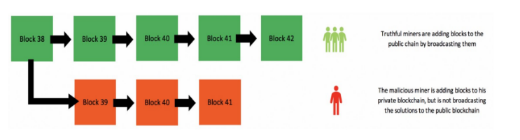

L'obiettivo di Bob è creare una catena più lunga di quella pubblica. Non appena ci riesce, la trasmette improvvisamente al resto della rete. A causa della regola della catena più lunga (longest chain rule), questa versione manipolata verrà inesorabilmente accettata da tutti gli altri minatori, che abbandoneranno il loro lavoro precedente per allinearsi alla nuova catena predominante. Affinché questa strategia abbia successo, il minatore malintenzionato ha bisogno di una potenza di calcolo superiore a quella di tutto il resto della rete combinato, detenendo idealmente il **51% dell'hashing power**. Solo così può sperare di aggiungere blocchi alla sua versione della blockchain più velocemente degli altri e costruire una catena più lunga.

Se questo attacco, noto come **Attacco del 51%**, ha successo, la vecchia catena viene abbandonata e tutte le transazioni in essa contenute perdono validità. Il risultato è drammatico per il venditore: Bob ha già ricevuto la sua barca a vela, ma è rientrato in possesso dei suoi bitcoin ed è libero di spenderli nuovamente.

In condizioni normali, per Bob è estremamente difficile rendere il suo fork più lungo di quello della rete pubblica. Dovrebbe essere incredibilmente fortunato per minare sei blocchi di fila nella sua catena prima che il resto della rete trovi un singolo blocco extra. Questa probabilità è infinitesimale e dipende direttamente dalla potenza computazionale a sua disposizione; l'attacco è plausibile solo se Bob risolve i puzzle Proof of Work (PoW) a una velocità prossima o superiore a quella di tutti gli altri minatori messi insieme.

---

### Concentrazione dell'Hashing Power: Il Caso GHash.IO

La teoria dell'Attacco del 51% si è scontrata con la realtà il 18 Giugno 2014, quando la distribuzione dell'hashing power ha mostrato segnali di pericolosa centralizzazione. In quel periodo, la mining pool GHash.IO deteneva il 38.24% della potenza totale. Le altre porzioni erano divise tra attori sconosciuti (16.52%), F2Pool (13.34%), BTC Guild (11.61%), Eligius (7.04%), KnCMiner (5.01%), Slush (3.67%), Polmine (1.84%), BitMinter (1.49%), EclipseMC (0.60%), AntPool (0.50%), Triplemining.com (0.05%), DigitalBTC (0.05%) e SockThing (0.05%).

GHash.IO arrivò pericolosamente vicino a superare la soglia del 50%, scatenando il panico generale, ma di fatto non si verificò alcun attacco. La spiegazione risiede nella teoria economica: anche se un minatore (o una pool) ottiene oltre il 50% del potere di mining, non significa necessariamente che avvierà un attacco distruttivo. Mantenere una potenza simile ha costi enormi, ed è di gran lunga più redditizio continuare a minare blocchi onestamente, incassando le ricompense, piuttosto che minare la fiducia nel sistema per annullare una singola transazione.

Questo evento ha generato un ciclo comportamentale peculiare documentato dalla community. Quando la quota di GHash.IO si avvicinava al 50%, la comunità su /r/bitcoin entrava nel panico. I singoli minatori, percependo il rischio (definito in gergo "shitstorm"), abbandonavano la pool spostando altrove le loro macchine. Questo esodo faceva scendere rapidamente la quota di GHash.IO. Di conseguenza, la comunità si tranquillizzava e dimenticava la minaccia, portando i minatori a pensare che il pericolo fosse passato e a reindirizzare la loro potenza di calcolo nuovamente verso GHash.IO, facendo ripartire il ciclo.

---

### La Vulnerabilità di Transaction Malleability

Un'altra storica minaccia alla rete, per la maggior parte corretta oggi, è la **Transaction Malleability** (Malleabilità delle Transazioni). Questa vulnerabilità permetteva a un attore esterno di alterare l'identificativo di una transazione, noto come **TXID**, senza in alcun modo alterare il nucleo operativo della transazione stessa, ovvero il mittente, il destinatario e l'importo inviato. Di conseguenza, la transazione rimaneva del tutto valida e finiva per essere confermata regolarmente sulla blockchain, sebbene il suo identificativo fosse cambiato. Si può paragonare questa dinamica alla spedizione di un pacco postale: il pacco arriva correttamente a destinazione intatto, ma il numero di tracciamento viene modificato durante il tragitto, portando il destinatario (e il mittente) a credere che il pacco non sia mai giunto.

Per illustrare il concetto, consideriamo una metafora. Alice scrive una lettera (la transazione) in cui dichiara di voler inviare 50 BTC a Bob, e imbuca la lettera nella cassetta postale (che rappresenta il Transaction Pool di Bitcoin). Questa lettera originale possiede un identificativo fittizio $TXID=1234$. Bob, che agisce da attaccante, intercetta e duplica la lettera, inserendo la copia nella cassetta postale; questa copia possiederà un nuovo identificativo, ad esempio $TXID=4567$. I contenuti delle due transazioni sono virtualmente identici, poiché entrambe sanciscono il trasferimento di 50 BTC da Alice a Bob, ma presentano TXID differenti.

A questo punto si innesca una competizione (race). I minatori, incaricati di validare le operazioni, controllano la firma di Alice per accertarsi dell'autenticità. Nel momento in cui una delle due transazioni viene confermata, la seconda viene ignorata dalla rete perché riconosciuta come un banale duplicato. Il problema sorge se è la transazione duplicata e alterata da Bob ad essere validata per prima. I 50 bitcoin vengono regolarmente scalati dal conto di Alice e trasferiti a Bob, in quanto la firma di Alice rimane crittograficamente valida anche sulla copia. Tuttavia, a questo punto, Bob può sostenere fraudolentemente di non aver mai ricevuto i fondi. Alice non ha alcun modo per dimostrare l'avvenuto pagamento: per farlo le servirebbe la ricevuta originale associata al $TXID=1234$, ma quella transazione è stata scartata dalla rete in favore di quella validata da Bob. Ignara dell'esistenza della transazione "malleata" da Bob, Alice si ritrova costretta a reinviare i 50 BTC per onorare il suo presunto debito.

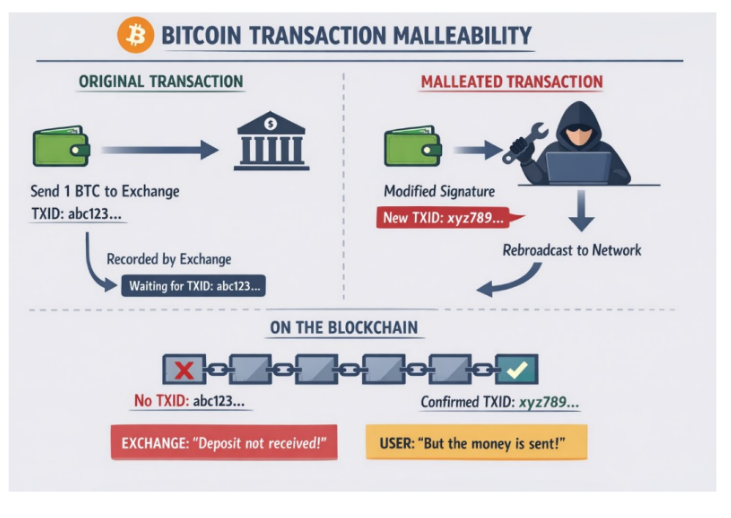

---

### Dettagli Tecnici della Malleabilità: La Firma ECDSA

Ma come è tecnicamente possibile modificare il TXID senza invalidare la firma e la transazione stessa? Si tratta di un attacco subdolo basato sull'alterazione di dati secondari che compongono l'hash della transazione, ma che non compromettono i campi critici. Una transazione su Bitcoin coinvolge svariati componenti, tra cui un set di input e output. Gli input della transazione sono sempre firmati con la chiave privata del proprietario dei fondi, un meccanismo essenziale per verificare la reale proprietà del denaro. Il **TXID** non è altro che l'hash combinato di tutte le componenti della transazione: input, firma, output e altri campi ausiliari.

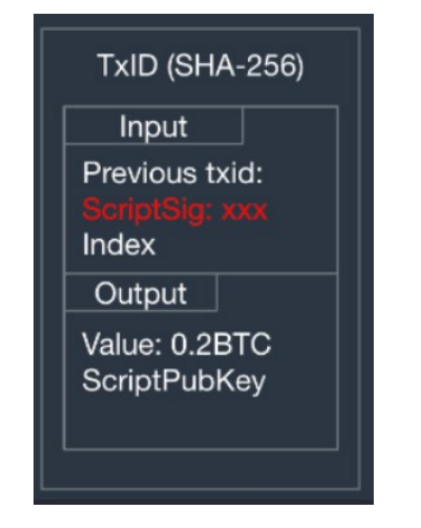

Il cuore del problema risiede nell'algoritmo crittografico **ECDSA** (Elliptic Curve Digital Signature Algorithm), impiegato da Bitcoin per firmare digitalmente i dati e verificarne l'autenticità. Nell'algoritmo ECDSA, una firma digitale non si esprime come un'unica stringa monolitica, bensì è composta da una coppia di numeri denotati come $(r,s)$.

A causa delle specifiche proprietà matematiche delle curve ellittiche utilizzate in ECDSA, esiste una particolarità : se la firma $(r,s)$ è matematicamente valida, lo sarà obbligatoriamente anche la firma $(r,n-s)$, dove $n$ rappresenta una costante fissa associata alla curva ellittica in uso. Sfruttando questa simmetria, un attaccante può sostituire la firma originale con la sua controparte equivalente. Dal punto di vista della validazione, non cambia assolutamente la firma "logica" (il sistema riconosce che l'autore aveva il diritto di firmare), ma cambia la sua rappresentazione digitale equivalente. Poiché il TXID è generato calcolando l'hash dell'intera transazione (firma inclusa), questa singola variazione matematica altera radicalmente l'hash finale (il TXID), completando così l'attacco di malleabilità.

---

### Concetti Chiave

- **Double Spending**: Attacco che mira a spendere le stesse criptovalute più di una volta, tentando di biforcare la blockchain e invertire le conferme stabilite.

- **Attacco del 51%**: Eventualità in cui un'entità controlla la maggioranza della potenza di calcolo della rete, potendo così monopolizzare la creazione dei blocchi e orchestrare double spending.

- **Transaction Malleability**: Vulnerabilità informatica che consente a terzi di alterare l'identificativo crittografico di una transazione (TXID) senza invalidarne il contenuto o la firma crittografica.

- **ECDSA (Elliptic Curve Digital Signature Algorithm)**: Standard crittografico alla base di Bitcoin, le cui proprietà matematiche intrinseche hanno inizialmente reso possibile la malleabilità delle firme digitali rappresentate dalla coppia $(r,s)$.

---

### Dettagli Tecnici della Malleabilità: Rappresentazioni Equivalenti

Riprendendo il concetto della malleabilità delle firme introdotto in precedenza, è fondamentale scendere nel dettaglio del meccanismo crittografico che lo rende possibile. Come abbiamo visto, Bitcoin si affida all'algoritmo ECDSA per la validazione. Questo algoritmo genera una firma composta da due valori, indicati come **$(r,s)$**. La vulnerabilità si annida in una specifica proprietà matematica delle curve ellittiche: data una costante $n$ associata alla curva, se la firma originale $(r,s)$ è ritenuta valida dal sistema, anche la sua rappresentazione equivalente **$(r,n-s)$** sarà matematicamente valida.

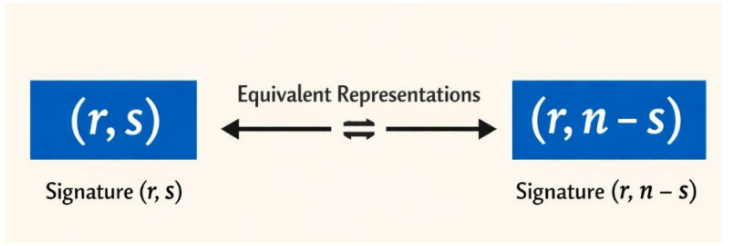

All'atto pratico, questo significa che un attaccante può prendere la firma originale di Alice e alterarla matematicamente nella sua forma manomessa $(r,n-s)$ senza invalidare l'autorizzazione al trasferimento dei fondi. Poiché l'identificativo della transazione originale è calcolato come l'hash dei dati della transazione combinati con la firma $(r,s)$ — ovvero $TXID\_A = Hash(Transaction Data + (r,s))$ — la minima variazione crittografica genera un risultato diverso. Sostituendo la firma, l'attaccante produce un nuovo identificativo, calcolato come $TXID\_B = Hash(Transaction Data + (r,n-s))$. Di conseguenza, ci si ritrova con due TXID differenti per la medesima operazione logica, ed entrambi i formati risultano perfettamente validi agli occhi della rete.

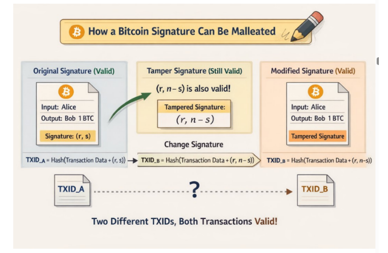

---

### Il Caso Storico: Il Fallimento di Mt. Gox

Per comprendere la gravità di questa vulnerabilità, è essenziale analizzare il più celebre disastro finanziario legato a Bitcoin: il fallimento di Mt. Gox. Nato originariamente come "Magic The Gathering Online Exchange" (da cui l'acronimo) e fondato nel 2010, Mt. Gox era diventato nel 2013 l'exchange di criptovalute più famoso del Giappone e del mondo intero, arrivando a gestire quotidianamente almeno il 72% di tutte le transazioni globali di Bitcoin.

La situazione precipitò improvvisamente quando la piattaforma sospese il trading, chiuse il proprio sito web e il servizio di scambio, per poi richiedere la protezione per bancarotta dai creditori. Nell'aprile del 2014, l'azienda avviò ufficialmente le procedure di liquidazione. L'annuncio fu scioccante: circa 744.408 BTC appartenenti ai clienti risultavano mancanti e presumibilmente rubati. Questa cifra colossale rappresentava all'epoca ben il 6% di tutti i bitcoin esistenti al mondo, per un valore stimato che superava i 450 milioni di dollari.

Sebbene vi sia ancora una certa divergenza di opinioni su cosa sia realmente accaduto, molti esperti attribuiscono la bancarotta proprio a un attacco di malleabilità delle transazioni. Il disastro ebbe origine da un'implementazione tecnica peculiare: Mt. Gox non utilizzava una codifica standard per le firme crittografiche. Poiché i client ufficiali della rete non trasmettevano le transazioni contenenti firme non standard, la propagazione delle operazioni di Mt. Gox risultava estremamente difficoltosa. Alcuni utenti, accorgendosi del problema, iniziarono a correggere spontaneamente le transazioni bloccate, inserendo le codifiche standard delle firme. Questo processo, noto come **reverse malleability** (creazione di una transazione standard a partire da una non standard), ha inavvertitamente fornito agli attaccanti l'idea che la malleabilità delle transazioni fosse un vettore d'attacco sfruttabile.

La dinamica fraudolenta si svolgeva in questo modo: un attaccante richiedeva un prelievo da Mt. Gox, intercettava la transazione legittima e ne alterava il TXID. Essendo la transazione manomessa ancora provvista di una firma valida, essa veniva confermata regolarmente dalla blockchain, permettendo all'attaccante di intascare i bitcoin. Tuttavia, il sistema interno di Mt. Gox monitorava la rete in attesa del TXID originale; non vedendolo mai confermato all'interno di un blocco, il sistema non decurtava il saldo dell'attaccante. Approfittando di questo disallineamento, l'attaccante poteva richiedere nuovamente il prelievo, ricevendo di fatto i fondi due volte (o più) dalla piattaforma ignara.

---

### La Soluzione Definitiva: Segregated Witness (SegWit)

Per porre fine in modo definitivo al problema della malleabilità, la comunità ha introdotto una celebre modifica al protocollo Bitcoin, implementata tramite un **Soft Fork** (una biforcazione non temporanea dovuta a un aggiornamento retrocompatibile delle regole di consenso). Questa soluzione prende il nome di **Segregated Witness**, o semplicemente **SegWit**.

L'idea principale alla base di SegWit consiste nel cambiare la struttura stessa dei dati della transazione, separando fisicamente (segregando) tutte le informazioni malleabili, inclusa la firma, e collocandole in una sezione dati separata denominata "witness data". Di conseguenza, il TXID viene ora calcolato escludendo lo script della firma dall'operazione di hash.

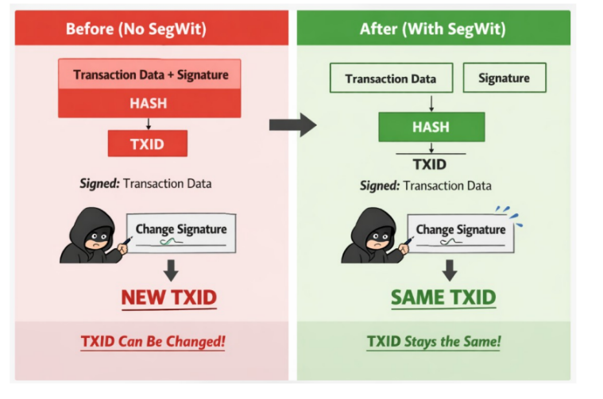

Grazie a questa innovazione architettonica, anche se un attaccante riuscisse a modificare la firma crittografica sfruttando le proprietà matematiche, l'identificativo principale (TXID) della transazione non subirebbe alcuna variazione. La transazione diventa così immutabile nel suo tracciamento, neutralizzando del tutto il vettore di attacco.

---

### Attacchi di Denial of Service e Architettura dei Nodi

Esistono anche minacce di natura differente, seppur meno distruttive, come l'attacco di **Denial of Service (DoS)**. Ipotizziamo uno scenario in cui un minatore, chiamiamola Alice, provi una forte antipatia verso un altro utente, Bob, e decida deliberatamente di negargli il servizio di validazione. Alice può configurare il proprio nodo per scartare sistematicamente qualsiasi transazione proveniente dagli indirizzi di Bob, rifiutandosi di includerle nei blocchi che lei propone alla blockchain. Tuttavia, l'architettura distribuita di Bitcoin mitiga questo problema in modo naturale: se Alice ignora la transazione di Bob, questa rimarrà semplicemente in attesa nella Mempool globale. Bob dovrà solamente pazientare fino a quando un nodo onesto non riuscirà a estrarre un nuovo blocco. A quel punto, il minatore onesto includerà la transazione di Bob nel suo blocco, confermandola e inserendola stabilmente nella blockchain, rendendo il boicottaggio di Alice del tutto inefficace a lungo termine.

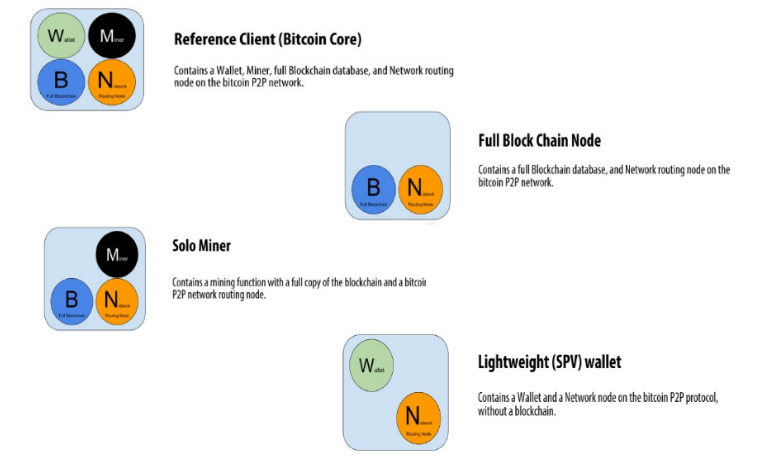

Per comprendere meglio come i vari utenti interagiscono con la rete durante queste dinamiche, è utile classificare gli attori di Bitcoin in base alle funzionalità del software che eseguono:

- Il **Reference Client (Bitcoin Core)** rappresenta il nodo più completo. Include un Portafoglio (Wallet), un modulo Minatore (Miner), il database completo della Blockchain (Full Blockchain) e un nodo di routing di Rete (Network routing node) per comunicare sul protocollo P2P.

- Il **Full Block Chain Node** è identico al Reference Client, ma è sprovvisto del portafoglio e del modulo di mining. Il suo scopo è unicamente mantenere l'intero database della blockchain e fungere da nodo di instradamento per la rete.

- Il **Solo Miner** possiede una copia completa della blockchain, il nodo di routing di rete e, soprattutto, la funzione di mining attivata.

- Infine, il **Lightweight (SPV) wallet** è progettato per gli utenti comuni. Contiene un Portafoglio e un nodo di Rete per interfacciarsi con il protocollo P2P, ma è privo dell'ingombrante copia dell'intera blockchain, affidandosi alla verifica di pagamento semplificata (Simplified Payment Verification).

---

### L'Evoluzione del Mining: Dalle CPU ai Circuiti Integrati

Focalizzandoci ora sui minatori, è essenziale comprendere che il processo di mining è, nella sua essenza più basilare, una continua e intensiva computazione dell'algoritmo SHA-256. Il cuore logico di questa operazione può essere riassunto in un semplice pseudocodice in cui il minatore incrementa incessantemente un parametro (il nonce) all'interno dell'header del blocco, fino a quando il doppio hash dell'header non risulta inferiore a un parametro di difficoltà prestabilito dalla rete: `while (1) { HDR[kNoncePos]++; if (SHA256(SHA256(HDR)) < (65535 << 208)/ DIFFICULTY) return; }`.

Questa implacabile ricerca matematica ha scatenato una vera e propria corsa agli armamenti hardware, suddivisibile in quattro generazioni storiche.

La **Prima Generazione (CPU Mining)** si basava sui processori dei computer generici (CPU). In questa fase primordiale, la ricerca dei nonce corretti avveniva in modo sequenziale o con una modesta parallelizzazione limitata a pochi core (ad esempio, architetture a 4 core). Poiché il calcolo SHA-256 veniva eseguito via software senza alcun hardware specializzato, l'efficienza era infima. Per dare un'idea della lentezza, se si fosse utilizzato un computer desktop di fascia alta con la difficoltà di rete registrata nel 2015, ci sarebbero voluti in media ben 139.461 anni per minare un singolo blocco!.

La **Seconda Generazione (GPU Mining)** è esplosa nell'ottobre del 2010 con il rilascio del primo software di mining OpenCL. L'intuizione fu quella di sfruttare le schede video (GPU), originariamente progettate per il rendering grafico ad alte prestazioni. Le GPU offrivano un parallelismo massiccio grazie ai numerosi multiprocessori interni, permettendo di calcolare simultaneamente hash differenti variando i nonce. Questo garantiva un throughput (capacità di elaborazione) drasticamente superiore, incrementabile ulteriormente tramite pratiche di overclocking. Questa innovazione sconvolse il mercato videoludico: i videogiocatori si trasformarono improvvisamente in minatori, sebbene l'hardware fosse sottoutilizzato per le sue reali capacità e consumasse quantità esorbitanti di energia elettrica. Nonostante il balzo tecnologico, anche assemblando un sistema con un centinaio di GPU, sarebbero occorsi mediamente 300 anni per estrarre un blocco alle difficoltà successive.

La **Terza Generazione (FPGA Mining)** ha visto l'introduzione dei Field Programmable Gate Area (FPGA). Si tratta di circuiti integrati programmabili tramite linguaggi di descrizione hardware come il Verilog, permettendo di riconfigurare la scheda "sul campo" per ottimizzarla specificamente per Bitcoin. Le FPGA garantivano prestazioni superiori alle GPU, in particolare grazie all'eccellente gestione delle operazioni a livello di singolo bit (bitwise operations), e presentavano sistemi di raffreddamento più efficienti. Tuttavia, i costi d'acquisto erano sensibilmente più alti e il vantaggio in termini di rapporto prestazioni/costo rispetto alle schede video risultava solo marginale. Con un sistema FPGA, il tempo medio di attesa per la scoperta di un blocco scendeva a circa 25 anni.

Infine, la **Quarta Generazione (ASIC Mining)**, iniziata nel 2013, ha segnato il definitivo passaggio all'hardware specializzato. Gli ASIC (Application Specific Integrated Circuits) sono chip progettati, ingegnerizzati e costruiti per svolgere un unico, singolare compito: minare Bitcoin eseguendo l'algoritmo SHA-256 nel modo più rapido ed efficiente possibile. Questa nicchia di mercato è stata inizialmente dominata da pochi grandi produttori che sfornavano chip a ritmi serrati, sebbene i primissimi modelli non fossero sempre affidabili. Un esempio emblematico dell'epoca è stato il *TerraMiner 4*, un dispositivo dal costo di circa 3.500 dollari USA in grado di sprigionare una sbalorditiva potenza di 2 TeraHash al secondo.

---

### La Nascita delle Mining Pools: Gestire l'Incertezza del Poisson

Nonostante l'enorme potenza degli ASIC, minare in solitaria (il cosiddetto **solo mining**) si è presto rivelato insostenibile per la maggior parte degli utenti. Matematicamente, il solo mining è modellabile come un processo di Poisson. Sebbene la ricompensa sia estremamente allettante a causa dell'alto tasso di cambio del Bitcoin, si tratta di un'impresa caratterizzata da un'enorme incertezza e da una deviazione standard larghissima.

Ipotizziamo, ad esempio, che un minatore solitario calcoli di poter trovare statisticamente 4 blocchi in un mese; a causa della deviazione standard, che in questo caso sarebbe circa $\sqrt{4} = 2$, in alcuni mesi potrebbe trovarne 6, in altri 2, e in altri ancora rimanere totalmente a secco trovandone 0. La realtà, tuttavia, è ben più severa: analizzando il tasso di hash globale del 5 Novembre 2014, che si attestava a 283.494.086 GHash/s, un utente dotato del potente e costoso minatore *Achilles Labs AM-1700* (capace di 1.700 GHash/s per un costo di 1.095 USD), avrebbe dovuto aspettare mediamente oltre 3 anni per estrarre un singolo blocco, e questo assumendo irrerealisticamente che la difficoltà di rete non aumentasse nel frattempo!.

Questa situazione creava uno stress psicologico e finanziario insostenibile per i minatori indipendenti. Chi investiva migliaia di dollari in hardware si chiedeva costantemente se le macchine funzionassero correttamente durante quegli anni di interminabile attesa, o se altri minatori stessero barando per accaparrarsi una fetta ingiusta delle ricompense.

Per abbattere l'alta varianza delle entrate, i minatori hanno iniziato a unire le forze, creando dei veri e propri cartelli chiamati **Mining Pools**. Unendosi in grandi strutture (che oggi assumono le dimensioni di enormi capannoni industriali come i centri BitFury in Georgia), i partecipanti condividono il rischio ottenendo ricompense economiche molto più modeste, ma incredibilmente più stabili e costanti nel tempo, applicando di fatto il principio classico dell'assicurazione reciproca.

---

### Centralizzazione e Condivisione del Lavoro (Mining Shares)

L'infrastruttura di una mining pool può essere progettata seguendo un paradigma decentralizzato P2P, oppure, come avviene più comunemente, attraverso un operatore centrale (il pool manager). Nel modello centralizzato, i partecipanti (i worker) si affidano completamente al manager. È lui a coordinare i lavori inviando i template dei blocchi ai minatori, ed è sempre lui ad assumersi l'onere di distribuire i ricavi ai vari membri in base alla mole di lavoro svolta, trattenendo spesso una commissione (fee) per il servizio offerto.

Questo sistema introduce però importanti sfide tecniche e di fiducia: come fa il manager a sapere con precisione quanto lavoro ha effettivamente svolto ogni singolo membro?. Inoltre, poiché l'obiettivo della pool è mitigare il rischio, è necessario retribuire anche tutti quei minatori che hanno lavorato duramente senza però avere la fortuna di estrarre il blocco vincente. Al contempo, il manager deve difendersi dai partecipanti disonesti che potrebbero mentire gonfiando artificiosamente i propri sforzi per ottenere una quota maggiore dei ricavi.

La soluzione adottata dall'industria per quantificare in modo inoppugnabile il lavoro svolto si basa sull'invio delle cosiddette **Mining Shares** (quote di lavoro). Quando il manager distribuisce il lavoro, fissa un parametro di difficoltà temporaneo ($n$) nettamente inferiore a quello reale della rete Bitcoin. I minatori cercano quindi un nonce che soddisfi questa difficoltà ridotta. Quando lo trovano, non hanno estratto un vero blocco Bitcoin, ma hanno generato una *share*, ovvero una prova crittografica tangibile del loro impegno.

Queste shares possono essere concettualizzate come blocchi "quasi validi" (near-valid blocks). Dal punto di vista crittografico, si presentano come stringhe alfanumeriche i cui hash iniziano con un numero di zeri inferiore a quanto richiesto dalla blockchain globale in quel momento, ma sufficientemente elevato da essere statisticamente rari. Inviando continuamente questi "near optimal hashes" al coordinatore, i minatori dimostrano in maniera probabilistica ed inequivocabile l'esatto ammontare di potenza computazionale che stanno riversando nella rete.

### Glossario / Concetti Chiave

- **Firma ECDSA (r, s)**: Standard crittografico alla base delle transazioni Bitcoin; la sua proprietà intrinseca di ammettere la variante equivalente $(r, n-s)$ è alla base della vulnerabilità della malleabilità.

- **Segregated Witness (SegWit)**: Importante aggiornamento del protocollo Bitcoin (Soft Fork) che ha risolto la malleabilità estraendo i dati della firma dal calcolo dell'identificativo primario della transazione (TXID).

- **Reference Client (Bitcoin Core)**: L'implementazione software originaria e più completa del nodo Bitcoin, comprensiva di portafoglio, database dell'intera blockchain, routing di rete e (storicamente) modulo di mining.

- **ASIC (Application Specific Integrated Circuit)**: Chip hardware di quarta generazione progettati per un unico scopo esclusivo; nel contesto di Bitcoin, sono ottimizzati unicamente per calcolare l'algoritmo SHA-256 alla massima velocità possibile.

- **Mining Shares**: "Blocchi parzialmente validi" estratti a una difficoltà inferiore rispetto a quella della rete principale. Vengono inviati dai minatori al gestore della pool come prova crittografica e probabilistica del lavoro computazionale effettivamente svolto.

---

### Sistemi di Ricompensa Centralizzati: Il Modello FPPS

Nelle mining pool gestite da un operatore centrale, uno dei problemi fondamentali è stabilire come suddividere i proventi tra i partecipanti. Un approccio molto diffuso è il modello **Fully Pay Per Share (FPPS)**. In questo schema, i minatori ricevono un pagamento fisso per ogni quota di lavoro (share) valida che inviano al gestore, a prescindere dal fatto che la pool riesca effettivamente o meno a estrarre un blocco valido sulla blockchain principale.

Questo sistema garantisce ai minatori un guadagno stabile e prevedibile, eliminando l'ansia dell'attesa per la scoperta di un blocco. Tuttavia, i minatori vengono pagati attingendo dal saldo esistente della pool. Di conseguenza, l'intero rischio d'impresa ricade sulle spalle dell'operatore della pool, il quale è costretto a pagare i suoi collaboratori anche nei periodi sfortunati in cui non vengono trovati blocchi. Per proteggersi da questo rischio, gli operatori FPPS impongono generalmente delle commissioni (fee) di partecipazione molto più elevate rispetto ad altri modelli.

Inoltre, il modello FPPS presenta un grave svantaggio strutturale: non prevede alcun bonus specifico per il singolo minatore che trova materialmente il blocco valido. Questo crea un disallineamento degli incentivi: i lavoratori non hanno un reale motivo per trasmettere un blocco valido al manager. Essi potrebbero deliberatamente scartare i blocchi validi appena trovati, continuando comunque a essere pagati la stessa cifra per le normali share di lavoro inviate.

### Modelli Basati sui Risultati: PPLNS e Pay Proportional

Per ovviare alle inefficienze del modello FPPS, sono nati sistemi alternativi che legano la retribuzione al successo effettivo della pool. Il modello **Pay-Per-Last-N-Shares (PPLNS)** prevede che i minatori vengano pagati esclusivamente quando la pool estrae con successo un blocco. I pagamenti sono determinati dal numero di share che ogni singolo minatore ha contribuito all'interno di una finestra temporale o quantitativa specifica, ad esempio considerando solo le share inviate nel periodo trascorso dall'ultimo blocco minato dalla pool.

Il vantaggio principale del PPLNS è l'applicazione di commissioni (fee) decisamente più basse, a fronte però di guadagni meno prevedibili e più fluttuanti per l'utente. Per fare un esempio numerico pratico: supponiamo che una mining pool riesca a minare un blocco dopo aver ricevuto un totale di $N=200.000$ share dai suoi membri. La pool calcola immediatamente la proporzione di share fornite da ciascun partecipante. Se il "Minatore A" ha contribuito con 200 share su questo totale di 200.000, riceverà una porzione della ricompensa Coinbase calcolata come $3.125 \times 200 / 200.000 = 0.003125$ BTC. Simultaneamente, anche le commissioni di transazione (transaction fees) generate e incassate in quel blocco verranno distribuite al Minatore A seguendo l'identica proporzione.

Una variante molto simile è il sistema **Pay Proportional**. Invece di pagare una quota fissa per share, l'importo del pagamento dipende dal ritrovamento di un blocco valido. Ogni volta che viene trovato un blocco, le ricompense da esso derivanti vengono distribuite ai membri in modo strettamente proporzionale alla quantità di lavoro che hanno effettivamente svolto per quel round. Questo approccio abbatte drasticamente il rischio per il gestore della pool, poiché i fondi escono solo quando nuove entrate sono assicurate. Soprattutto, i minatori sono fortemente incentivati a inviare i blocchi validi, poiché è proprio quell'evento a innescare il flusso di ricavi verso di loro. Sebbene le entrate dipendano dalla fortuna, se la pool è sufficientemente grande, la varianza statistica della frequenza con cui si trovano i blocchi rimarrà piuttosto bassa, garantendo comunque una certa regolarità.

---

### L'Architettura delle Mining Pool Decentralizzate

Sebbene le pool centralizzate siano dominanti, la necessità di doversi fidare ciecamente di un operatore centrale per la verifica dei contributi e la distribuzione dei fondi ha spinto la comunità a cercare soluzioni alternative. È nato così il concetto di **Mining Pool Decentralizzata**, adottato per la prima volta da *P2Pool* nel 2011 ed esplorato attualmente in molteplici altre soluzioni.

L'idea di base consiste nel creare una rete di minatori parallela a quella di Bitcoin, che non necessita di un manager. I minatori della pool costruiscono una blockchain separata e privata, definita **sharechain** (catena delle quote). Su questa catena privata vengono estratti dei "blocchi deboli" (weak blocks), caratterizzati da una difficoltà di rete ($n'$) di gran lunga inferiore rispetto alla difficoltà ufficiale di Bitcoin ($n$). Il parametro $n'$ viene calibrato in modo che un nuovo blocco debole appaia molto frequentemente, ad esempio uno ogni 30 secondi.

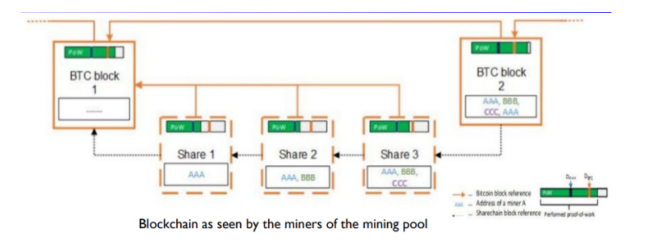

Questa sharechain viene costruita appoggiandosi crittograficamente in cima all'ultimo blocco valido della blockchain pubblica. Ogni blocco della sharechain corrisponde esattamente a una "share" di lavoro completata da uno specifico minatore. Invece di inviare privatamente questa prova a un operatore centrale, il minatore la scrive indelebilmente sulla blockchain condivisa della pool.

Il meccanismo di distribuzione dei compensi avviene in maniera progressiva e trasparente. Il primo blocco della sharechain includerà una transazione di pagamento destinata ad AAA, il primo minatore ad aver generato una share. Il secondo blocco includerà un pagamento sia ad AAA sia a BBB, il secondo minatore che è riuscito a risolvere la Proof of Work (PoW) ridotta. Questo processo iterativo continua accumulando i beneficiari.

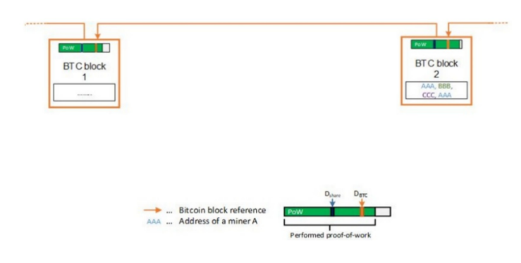

Quando, in base alla pura probabilità, un minatore della pool riesce a risolvere la PoW con la difficoltà reale ($n$), l'ultimo blocco viene definitivamente collegato alla vera blockchain pubblica di Bitcoin attraverso un processo chiamato **merge mining**. Questo sistema garantisce equità e sicurezza: nessun minatore può barare "dimenticandosi" di inserire nei blocchi successivi i pagamenti dovuti a tutti i colleghi che hanno lavorato prima di lui. La totale tracciabilità (auditability) della tecnologia blockchain permette a chiunque di verificare in tempo reale la correttezza delle operazioni. Gli obiettivi di questo design sono chiari: creare uno schema di pagamenti assolutamente equo e trasparente, garantendo al contempo un'efficienza tecnica con un sovraccarico prestazionale (overhead) minimo.

---

### Distribuzione Globale: Top Mining Pools ed Evoluzione dell'Hashrate

Storicamente, la prima pool di mining è apparsa alla fine del 2010, durante l'era d'oro delle GPU. La convenienza di questi sistemi è stata tale che già nel 2014 circa il 90% dell'intero processo di mining mondiale era gestito da queste aggregazioni.

Analizzando il mercato in tempi recenti (dati del 2025), la situazione mostra un ecosistema maturo e stratificato, dominato da enormi potenze di calcolo misurate in Exahash al secondo (EH/s) e dall'utilizzo massiccio di hardware ASIC e, in minor parte, GPU. L'uso di protocolli standardizzati facilita enormemente il passaggio rapido e indolore dei minatori da una pool all'altra in base alla convenienza economica del momento.

Di seguito è riportata la panoramica delle principali mining pool attive nel 2025, con i rispettivi modelli di ricompensa, tassi di hash, commissioni e hardware supportato:

| **BITCOIN MINING POOLS** | **POOL FEE**                    | **BTC POOL HASHRATE** | **REWARD DISTRIBUTION METHOD** | **SUPPORTED HARDWARE** |
| ------------------------ | ------------------------------- | --------------------- | ------------------------------ | ---------------------- |
| **Foundry USA**          | 2% fee for PPLNS and 4% for PPS | 231.5 EH/s            | FPPS                           | ASIC                   |
| **F2Pool**               | 2.5%                            | 25.81 EH/s            | PPS+                           | ASIC, GPU              |
| **Antpool**              | 0% for PPLNS, 4% for PPS+       | 30.5 EH/s             | PPLNS, PPS+                    | ASIC                   |
| **ViaBTC**               | 2% for PPLNS, 4% for PPS        | 20.32 EH/s            | PPLNS, PPS                     | ASIC                   |
| **Binance**              | 2.50%                           | 23.86 EH/s            | FPPS, PPS+, and PPS            | ASIC, GPU              |
| **BTC.com**              | 1.38%                           | 161.44 EH/s           | Advanced FPPS                  | GPU                    |
| **Poolin**               | 2.50%                           | 23.59 EH/s            | FPPS                           | ASIC                   |

Oltre alla concentrazione nelle pool, è cruciale osservare la distribuzione geografica dell'hashing power. Analizzando la quota globale di hashrate tra il 2019 e il 2021, è possibile notare profondi mutamenti geopolitici. Paesi come Stati Uniti, Kazakistan, Russia, Canada, Irlanda, Malesia, Germania, Iran e Cina si sono contesi il predominio della rete.

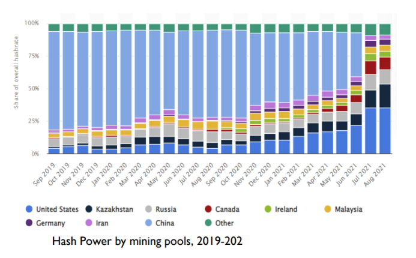

La predominanza delle mining pool è facilmente verificabile in modo empirico sfruttando un qualsiasi Block Explorer, come ad esempio *Blockchain.info*. Osservando i blocchi estratti di recente, è evidente che la quasi totalità di essi viene ritrasmessa (relayed) dai nodi appartenenti alle grandi pool commerciali. La tabella sottostante mostra un estratto reale degli ultimi blocchi minati (all'altezza 626299), confermando il monopolio di entità come F2Pool, SlushPool, ViaBTC e AntPool.

| **Altezza (blocchi)** | **Minatore** | **Taglia**      |
| --------------------- | ------------ | --------------- |
| **626299**            | F2Pool       | 1.372.096 bytes |
| **626298**            | SlushPool    | 1.399.861 bytes |
| **626297**            | ViaBTC       | 1.253.979 bytes |
| **626296**            | Poolin       | 1.287.223 bytes |
| **626295**            | F2Pool       | 1.476.546 bytes |
| **626294**            | Unknown      | 1.243.231 bytes |
| **626293**            | BTC.com      | 1.228.894 bytes |
| **626292**            | AntPool      | 1.405.031 bytes |
| **626291**            | ViaBTC       | 1.261.756 bytes |
| **626290**            | BTC.com      | 1.207.850 bytes |
| **626289**            | Unknown      | 1.257.467 bytes |
| **626288**            | Unknown      | 1.195.426 bytes |
| **626287**            | F2Pool       | 1.390.637 bytes |
| **626286**            | BTC.com      | 1.278.988 bytes |
| **626285**            | Poolin       | 1.175.396 bytes |

---

### Glossario / Concetti Chiave

- **Fully Pay Per Share (FPPS)**: Modello di pagamento centralizzato in cui la mining pool retribuisce i minatori con una quota fissa per ogni share valida fornita, assumendosi il rischio imprenditoriale dei periodi di sfortuna, ma disincentivando il corretto inoltro dei blocchi validi.

- **Pay-Per-Last-N-Shares (PPLNS)**: Sistema di remunerazione che distribuisce la ricompensa e le commissioni di transazione solo dopo l'effettivo ritrovamento di un blocco, basandosi sul volume di share fornite dal singolo utente in una finestra temporale recente.

- **Sharechain**: Una blockchain privata e parallela generata dai partecipanti a una mining pool decentralizzata; serve a registrare immutabilmente le quote di lavoro (share) svolte da ciascun utente.

- **Merge Mining**: Tecnica che permette di sfruttare il lavoro svolto su una blockchain secondaria (come la sharechain) per validare e collegare in modo trasparente e automatico un blocco alla blockchain principale (Bitcoin).

---

# Lezione 11: Script Bitcoin Avanzati e Indirizzi Multisig

### Il Concetto di Multi-Signature (Firme Multiple)

I protocolli a firma multipla consentono a un gruppo di firmare collettivamente un determinato contenuto. La verifica della validità della firma viene eseguita utilizzando le chiavi pubbliche di tutti i soggetti coinvolti. 

Un modo banale per implementare questo meccanismo consiste nel far produrre a ciascun firmatario una firma autonoma utilizzando la propria chiave privata, per poi concatenare tutte le firme ottenute. 

Tuttavia, questo approccio presenta un problema di efficienza, poiché la dimensione della firma cresce in modo lineare all'aumentare del numero di firmatari. L'ideale, invece, sarebbe ottenere una dimensione indipendente dal numero di firmatari e il più possibile vicina a quella di una firma ordinaria.

Bitcoin ha originariamente adottato la soluzione più semplice per gestire questo processo. L'algoritmo standard utilizzato, basato sulle firme ECDSA, richiede infatti la generazione di firme multiple separate, non aggregate. Soltanto in seguito, con l'introduzione del protocollo Taproot, è stato possibile abilitare l'aggregazione delle firme tramite l'utilizzo delle firme Schnorr. In questo contesto, gli indirizzi multisignature (multisig) si configurano come un indirizzo Bitcoin accoppiato a uno script di blocco (locking script) che richiede, per poter spendere i fondi associati, un numero specificato (M) di firme valide estrapolate da un set prefissato di chiavi pubbliche (N).

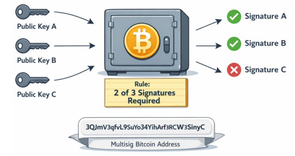

### Applicazioni Pratiche dei Multisig

Le applicazioni pratiche degli script multisig sono svariate e rispondono a diverse esigenze di sicurezza e fiducia. Ad esempio, uno schema **1-of-2** può essere utilizzato per gestire un fondo cassa congiunto tra marito e moglie, dove basta la firma di uno dei due per operare. Al contrario, uno schema **2-of-2** è ideale per un conto di risparmio coniugale, in cui ciascuna delle due parti separate deve approvare una transazione da quell'indirizzo per prelevare. Un'ulteriore variante è il **2-of-3**, utile per un conto di risparmio genitoriale destinato a un figlio: in questo modo, il figlio non può prelevare denaro senza il consenso di almeno uno dei partner (genitori).

La logica multisig si applica anche alla sicurezza personale attraverso wallet con autenticazione a due fattori (**2-of-2**). Di norma, con una singola chiave, se un trojan infetta il telefono cellulare, un attaccante può prendere il controllo del nodo dell'utente e inviare denaro a se stesso. Mantenendo invece il software del wallet sia sul cellulare che sul portatile, e richiedendo la firma da entrambi i dispositivi, si eleva drasticamente il livello di sicurezza. Infine, i multisig (in particolare il modello **2-of-3**) sono comunemente usati per contratti di deposito a garanzia (escrow) senza necessità di fiducia diretta (trustless) tra acquirente e venditore, e costituiscono il blocco fondamentale (building block) per la costruzione della Lightning Network. Nei contratti escrow, le due controparti, per raggiungere un accordo, coinvolgono una terza parte affinché agisca come arbitro in caso di disputa.

### Struttura degli Script Locking e Unlocking per Multisig

La forma generale di un *locking script* (script di blocco) che imposta una condizione Multi-signature M-di-N (Pay-to-Multisig o P2MS) segue una sintassi ben precisa.

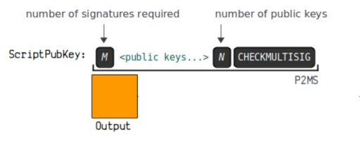

All'interno di questa struttura, N rappresenta il numero totale di chiavi pubbliche elencate, mentre M indica la soglia, ovvero il numero di firme richieste per poter spendere l'output. Di conseguenza, un esempio reale di locking script per una condizione Multi-Signature 2-di-3 si presenterebbe come: `2 <PkA><PkB><PkC> 3 OP_CHECKMULTISIG`.

Per soddisfare questo *locking script*, l'utente deve fornire un *unlocking script* (script di sblocco) che contenga una qualsiasi combinazione valida del numero richiesto di firme. La sintassi del cosiddetto ScriptSig è semplicemente l'elenco delle firme. 

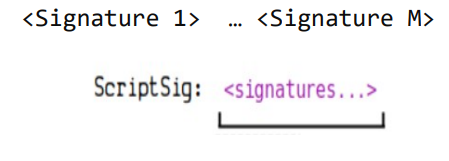

Riprendendo l'esempio della condizione 2-di-3 precedente, lo script di blocco può essere soddisfatto con uno script di sblocco contenente una combinazione qualsiasi di due firme derivanti dalle chiavi private corrispondenti alle tre chiavi pubbliche elencate. Un esempio valido sarebbe presentare la firma di A e la firma di C, codificate come `<Signature A> <Signature C>`. In sintesi, un output di transazione protetto da uno script P2MS che include le chiavi pubbliche di tre persone diverse richiederà che solo due di queste persone forniscano le rispettive firme nell'input della nuova transazione per spendere i bitcoin lì memorizzati.

### Le Transazioni Escrow (Deposito a Garanzia)

Il meccanismo multisig risulta fondamentale per risolvere problemi di fiducia nelle compravendite online. Immaginiamo che Alice voglia acquistare un libro raro da Bob. Vivendo in città diverse, non c'è possibilità di uno scambio diretto delle merci. Il problema sorge perché Alice e Bob non si fidano l'uno dell'altro: Alice non vuole pagare finché non riceve il libro, mentre Bob promette di spedire il libro solo dopo aver ricevuto il pagamento in Bitcoin e non vuole inviare la merce prima di essere stato pagato.

Per risolvere questo stallo, si introduce una terza parte, ad esempio Judy, creando una transazione di tipo escrow (traducibile in italiano come deposito in garanzia). Alice e Bob si fidano di Judy per risolvere un'eventuale disputa, ma non desiderano affidarle direttamente i fondi. In questo scenario, i bitcoin vengono messi in una sorta di "limbo". Naturalmente, il contratto di escrow fallirebbe se Judy decidesse di colludere in segreto con Alice o Bob; tuttavia, durante il normale corso della transazione, nessuna singola persona può muovere i fondi da sola.

Operativamente, Alice crea una transazione multi-sig 2-di-3. L'input della transazione è un indirizzo contenente i bitcoin di Alice destinati al pagamento, sbloccati dalla sua firma. L'output della transazione, invece, contiene una chiave pubblica per ciascuno dei partecipanti: Alice, Bob e Judy. Alice pubblica quindi la transazione sulla blockchain. A questo punto, le monete sono trattenute in garanzia tra Alice, Bob e Judy, e solo due qualsiasi di loro possono riscattare i bitcoin e specificarne il destinatario.

Se la transazione si svolge senza intoppi, Alice riceve il libro. In questo scenario onesto, Alice e Bob possono firmare congiuntamente per rilasciare i fondi a Bob, senza alcun coinvolgimento da parte di Judy. Nel caso normale, questa procedura richiede solo una transazione aggiuntiva sulla blockchain: la prima transazione per mettere i soldi nel deposito a garanzia dall'indirizzo di Alice, e la seconda transazione per inviare i soldi a Bob, firmata sia da Bob che da Alice.

I problemi sorgono nel caso di una disputa, ad esempio se Bob non ha effettivamente inviato la merce, se questa è andata persa per posta, o se Alice si rifiuta di pagare perché pensa di essere stata truffata e rivuole i suoi soldi indietro. In questo frangente, Bob non firmerà una transazione che restituisca i soldi ad Alice, potendo negare l'accusa di frode di Alice, e allo stesso tempo Alice non rilascerà i fondi a Bob. Entrambi non vogliono firmare una transazione che svincoli il denaro dall'escrow. In questa situazione di stallo, Judy può intervenire per giudicare. Ella ha il potere di muovere i fondi in congiunzione con Alice o con Bob. Se, ad esempio, Judy decide che Bob ha imbrogliato e che Alice prova di non aver ricevuto nulla, firmerà una transazione insieme ad Alice per rispedire il denaro dall'escrow ad Alice stessa. Fornendo due delle tre firme richieste, l'operazione ha successo. Lo stesso procedimento si applica nella direzione opposta se Alice rifiuta di firmare dopo aver ricevuto la merce e Bob fornisce la prova di spedizione a Judy.

### Le Problematiche degli Script Multi-Signature (P2MS)

Nonostante la loro utilità, gli script multisignature nativi sono macchinosi da utilizzare. Il difetto principale risiede nel fatto che l'intero script deve essere comunicato a chiunque intenda effettuare un pagamento verso un indirizzo multi-sig. 

Immaginiamo, ad esempio, l'indirizzo multisig del fondo cassa congiunto di marito e moglie: se un amico desidera inviare del denaro a quell'indirizzo per fare un regalo, la coppia dovrà comunicargli l'intero *locking script*. L'amico dovrà poi inserire manualmente questo script multi-sig nella parte di blocco della sua transazione.

Questo problema diventa ancora più evidente in ambito aziendale. Immaginiamo un cliente che vuole inviare dei bitcoin a un'azienda formata da 5 partner, la quale richiede una multisignature 2-di-5 per spendere quei bitcoin. Lo script si presenterebbe come: `2 <Public Key 1> <Public Key 2> <Public Key 3> <Public Key 4> <Public Key 5> 5 CHECKMULTISIG`. 

I problemi che ne derivano sono molteplici: in primo luogo, l'azienda deve trasmettere queste complesse informazioni ai propri clienti. Il cliente, a sua volta, ha bisogno di un software wallet speciale in grado di creare uno script di transazione multisignature personalizzato. Inoltre, la transazione risultante è cinque volte più grande di una normale, il che significa che necessita di più commissioni (fees) per essere presa in considerazione dai minatori. L'onere economico di questa transazione extra-large verrebbe quindi sostenuto dal cliente. Lo script potrebbe essere persino troppo lungo per essere inserito in una singola immagine di un codice QR. Infine, dal punto di vista dell'architettura di rete, un grande script di transazione rimarrebbe memorizzato nel set UTXO all'interno della memoria RAM di ogni nodo completo (full node) fino al momento in cui viene speso, inquinando i dati di sistema.

### L'Introduzione del Pay-to-Script-Hash (P2SH)

Per risolvere queste inefficienze, nel gennaio del 2012 è stato introdotto il meccanismo Pay-to-Script-Hash (P2SH) attraverso il BIP-16. L'idea principale del P2SH è quella di designare come beneficiario di una transazione bitcoin l'hash di uno script, anziché il proprietario di una chiave pubblica. In pratica, anziché includere il lungo script originale nel *locking script*, si include solamente l'hash di tale script.

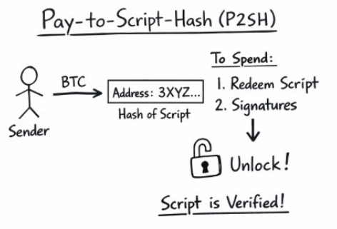

Con questo sistema, il mittente invia il denaro a un hash invece che a un indirizzo pubblico complesso, e può utilizzare dei software wallet semplici per farlo. Per sbloccare e riscattare la transazione, il destinatario deve presentare sia lo script originale che produce lo stesso hash contenuto nello script di blocco, sia le firme richieste da quello script. Questo approccio si rivela un'ottima soluzione per gli script multi-sig e, più in generale, per permettere di specificare script arbitrari e complessi come destinazioni di pagamento.

Tecnicamente, il *locking script* in un'operazione P2SH assume la forma standardizzata: `OP_HASH160 <RedeemScriptHash> OP_EQUAL`. L' *unlocking script*, invece, deve fornire la risposta (ovvero le firme) e l'intero script originale: `<Response To Redeem Script> <Redeem Script>`. Riprendendo l'esempio di un multisig 1-di-2, dove il locking script originale sarebbe `OP_1 <PubKey1> <PubKey2> OP_2 OP_CHECKMULTISIG` e lo script di sblocco `OP_0 <Sig1>` oppure `OP_0 <Sig2>`, con il P2SH la struttura cambia. Il locking script P2SH conterrà solo l'hash: `OP_HASH160 <RedeemScriptHash> OP_EQUAL`, mentre lo sblocco sarà formulato come: `OP_0 <Sig1><Sig2>|<OP_2 <PubKey1> <PubKey2> <PubKey3> OP_3 OP_CHECKMULTISIG>`. In questo modo, la prima parte funge da risposta allo script di riscatto, mentre la seconda espone l'array di byte del Redeem Script originale.

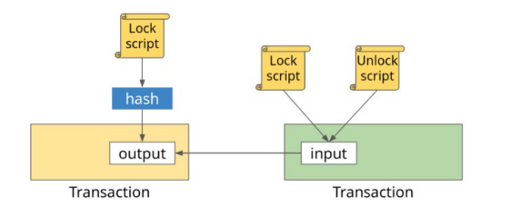

I benefici del P2SH sono notevoli. Gli script complessi vengono sostituiti da impronte digitali (fingerprints) più brevi nell'output della transazione, rendendo la transazione molto più piccola. Gli script vengono così codificati come normali indirizzi. Soprattutto, il P2SH sposta un enorme onere dal mittente al destinatario. Nello specifico, sposta il carico della costruzione dello script sul destinatario anziché sul mittente. Inoltre, trasferisce l'onere dell'archiviazione dei dati per il lungo script dall'output (che risiede nella preziosa memoria UTXO) all'input (che viene semplicemente archiviato staticamente sulla blockchain). Questo posticipa anche l'onere dell'archiviazione dati dal momento presente (quando avviene il pagamento) a un momento futuro (quando i fondi vengono spesi). Infine, sposta il costo delle commissioni di transazione dovute alla grandezza dello script dal mittente al destinatario.

---

### Concetti Chiave

Per riassumere questa prima parte, ecco i concetti fondamentali affrontati:

- **Multi-signature (Multisig):** Un meccanismo che richiede un numero "M" di firme su un totale di "N" chiavi pubbliche per autorizzare una spesa. È fondamentale per la sicurezza (es. 2FA) e per creare meccanismi di fiducia decentralizzati.

- **Transazioni Escrow:** Contratti di deposito a garanzia che permettono ad acquirente e venditore di tutelarsi tramite un arbitro terzo, utilizzando un sistema multisig (es. 2-di-3) senza affidare direttamente i fondi a quest'ultimo.

- **P2SH (Pay-to-Script-Hash):** Un protocollo introdotto tramite BIP-16 per risolvere le inefficienze degli script complessi. Permette di inviare fondi all'hash di uno script, spostando l'onere computazionale, di memoria (UTXO) e delle commissioni dal mittente al destinatario.

---

## I Benefici del Pay-to-Script-Hash (P2SH)

Prima di procedere, è essenziale completare il discorso relativo al P2SH introdotto in precedenza. I vantaggi di questo paradigma sono strutturali : gli script complessi vengono sostituiti da impronte digitali (fingerprints) molto più brevi all'interno dell'output della transazione, rendendo di fatto la transazione più piccola. In questo modo, gli script vengono codificati e trattati come normali indirizzi, permettendo l'utilizzo di software wallet molto più semplici. Il paradigma P2SH sposta un onere significativo dal mittente al destinatario. Nello specifico:

- Il compito di costruire materialmente lo script ricade sul destinatario.

- L'archiviazione dei dati relativi al lungo script viene spostata dall'output (che risiede nel set UTXO in RAM) all'input (che viene registrato storicamente sulla blockchain).

- Il peso della memorizzazione dei dati viene posticipato dal momento presente (quando avviene il pagamento) a un tempo futuro (quando l'output viene effettivamente speso).

- Il costo delle commissioni di transazione (transaction fee) generato dalla lunghezza dello script si sposta dal mittente al destinatario.

### Hash-Time Locked Contracts (HTLC)

Gli Hash-Time Locked Contracts (HTLC) sono una tipologia speciale di script caratterizzati da una condizione di riscatto complessa, alla base del funzionamento di canali di pagamento come la Lightning Network di Bitcoin.

Un HTLC combina due meccanismi di blocco crittografico:

1. **Hash Locks:** Un segreto viene sottoposto ad hashing e il risultato viene memorizzato pubblicamente in uno script (o smart contract). I fondi possono essere sbloccati solo ed esclusivamente se il destinatario designato fornisce pubblicamente il segreto originario.

2. **Time Locks:** Oltre al blocco basato sull'hash del segreto , questa componente garantisce che i fondi possano essere sbloccati in due casi alternativi : se il destinatario designato fornisce il segreto pubblicamente , OPPURE, in caso contrario, se scade un tempo limite (timeout) specificato direttamente nello script o nel contratto.

### Atomic Swaps e Scambi Trustless

La combinazione di Hash Lock e Time Lock è lo strumento che rende possibili gli **Atomic Swaps**. Solitamente, se si desidera scambiare una criptovaluta con un'altra (es. Bitcoin con Ethereum), è necessario rivolgersi a un intermediario o *exchanger* che offra la coppia di trading di interesse. Questo processo richiede inevitabilmente di inviare i propri fondi all'indirizzo dell'exchanger, introducendo la necessità di fidarsi di una terza parte.

Gli atomic swaps superano questo limite: sono una tecnologia che permette di effettuare scambi P2P (Peer-to-Peer) senza alcun bisogno di intermediari. Il problema principale degli scambi diretti è il rischio di controparte: qualcuno dovrebbe inviare i propri fondi per primo, e l'altra parte potrebbe decidere di non rispettare l'accordo e non inviare la sua quota. Gli HTLC evitano che ciò accada.

In uno scambio "trustless" basato su HTLC, la procedura standard è la seguente:

- Alice blocca i propri fondi utilizzando l'hash di un segreto, matematicamente definito come H(s).

- Alice invia l'hash H(s) a Bob.

- Bob esegue la stessa identica operazione di blocco dei propri fondi su un'altra blockchain, utilizzando il medesimo hash H(s) fornitogli da Alice.

- Quando uno dei due (in questo caso Alice) rivela il segreto "s" per prelevare i fondi di Bob, tale segreto viene registrato on-chain. L'altra controparte (Bob) può quindi leggerlo e utilizzarlo per riscattare a sua volta i fondi di Alice.

In questa complessa danza crittografica, l'hashlock ha il compito di sincronizzare lo scambio, mentre il timelock fornisce protezione: se qualcosa dovesse andare storto, o se una parte smettesse di rispondere, i fondi possono essere recuperati allo scadere del tempo.

#### Esempio Pratico di Atomic Swap

Ipotizziamo che Alice possieda dei Bitcoin e Bob dei token ZEN, e che concordino di scambiarsi una certa quantità dei loro asset. Alice inizia generando un contratto HTLC (indirizzo "ABC") sulla blockchain di Bitcoin. Sceglie un segreto (es. "XYZ") e lo sottopone a funzione di hash, ottenendo una stringa come "1b9f...". Crea quindi il blocco `lock = hash(secret)` e invia 1 BTC all'indirizzo ABC. Infine, Alice invia a Bob solo il lock (l'hash "1b9f...").

Le condizioni forzate dal contratto di Alice sono ferree:

- **Timelock:** Ritorna 1 BTC ad Alice tra 24 ore se non succede nulla. Questo garantisce che Alice non perda il suo denaro nel caso in cui Bob non risponda mai o sia offline.

- **Hashlock:** Invia i fondi a Bob solo se egli può fornire un segreto tale per cui `hash(secret) = Lock`. Al momento, Bob non conosce il segreto, pur conoscendone l'hash, poiché le funzioni di hashing sono unidirezionali (one-way). Qualora Bob riuscisse a fornire il segreto, i bitcoin verrebbero trasferiti al suo indirizzo automaticamente.

Parallelamente, Bob crea un contratto simile sulla blockchain ZEN (indirizzo "BCD"). Bob utilizza il lock che Alice gli ha inviato ("1b9f...") e crea una transazione inviando 200 ZEN all'indirizzo BCD. Le condizioni del contratto di Bob rispecchiano quelle di Alice: un timelock per restituire i 200 ZEN a Bob dopo 24 ore, e un hashlock per inviare i fondi ad Alice se lei fornisce il segreto corrispondente al lock.

La magia si compie quando Alice usa il segreto che aveva scelto all'inizio per sbloccare l'hashlock del contratto di Bob sulla blockchain ZEN, facendo sì che gli ZEN le vengano rilasciati. Questa è un'operazione pubblica, verificabile (auditable) sulla blockchain. Bob, osservando la blockchain ZEN, può ora vedere il segreto esposto da Alice e lo utilizza per sbloccare i bitcoin intrappolati nel contratto di Alice. L'HTLC rilascia automaticamente i fondi all'indirizzo Bitcoin di Bob.

### Implementazione degli Script HTLC in Bitcoin

Queste complesse condizioni di riscatto possono essere codificate tramite il linguaggio script basato su architettura a stack (FORTH) nativo di Bitcoin. A tale scopo, esistono numerosi codici operativi (OpCodes) per la gestione del flusso logico, della crittografia e dello stack, tra cui, a titolo di esempio : `OP_0`, `OP_TRUE`, `OP_ADD`, `OP_SHA256`, `OP_HASH160`, `OP_CHECKSIG`, fino a `OP_INVALIDOPCODE`.

Uno script HTLC reale appare diviso in due rami logici principali:

- Un ramo **Hash lock verso Bob**, che verifica se la dimensione del segreto e il suo hash coincidono con i parametri attesi (`OP_IF`, `OP_SIZE`, `OP_SHA256`, `OP_EQUALVERIFY`, ecc.).

- Un ramo **Time lock verso Alice**, eseguito se il primo ramo fallisce, che verifica se è trascorso il tempo necessario per il rimborso (`OP_ELSE`, `OP_CHECKLOCKTIMEVERIFY`, ecc.).

- Il controllo si chiude con le verifiche della firma (`OP_ENDIF`, `OP_EQUALVERIFY`, `OP_CHECKSIG`).

### Altri Script: Registrazione Dati (Data Registering)

Oltre ai pagamenti, è emersa l'esigenza di sfruttare l'irreversibilità della blockchain come una sorta di registro notarile (notary ledger). Calcolando l'impronta digitale (fingerprint) di un file e registrandola sulla blockchain, si può stabilire in modo inconfutabile la "prova di esistenza" (proof-of-existence) di quel file in una data specifica.

Inizialmente, per fare ciò, si utilizzava l'indirizzo di destinazione dell'output come un campo generico a forma libera di 20 byte. Questo generava un pagamento "falso" che non poteva mai essere speso, in quanto a quell'indirizzo non corrispondeva alcuna chiave privata. Tuttavia, questa pratica ha sollevato un grosso problema: la registrazione (entry) corrispondente nel set UTXO non poteva mai essere rimossa, causando inquinamento dei dati (data pollution) e facendo aumentare a dismisura le dimensioni della RAM necessaria per gestire gli UTXO. Questo ha generato una forte controversia nella comunità sul permettere o proibire la scrittura di dati sulla blockchain.

#### Lo Script OP_RETURN

Dopo il 2013, è stata adottata una soluzione di compromesso con l'introduzione di un nuovo script : `OP_RETURN <Data>`. Questo OP_CODE fornisce un metodo standardizzato per incorporare (embedding) dati arbitrari in un output dichiaratamente non spendibile. L'inserimento di un output fittizio (dummy output) con testo arbitrario fa sì che i bitcoin forniti in input a quella transazione non possano mai più essere spesi. Oggi, l'OP_RETURN viene utilizzato per due scopi principali:

1. Esclusivamente per registrare dati sulla blockchain, senza spendere effettivamente bitcoin se non le commissioni.

2. Per bruciare (burn) bitcoin intenzionalmente.

### Proof of Burn

Uno script *proof-of-burn* non può mai essere riscattato. L'invio di monete verso un "burn address" (un indirizzo privo di chiave privata) le distrugge per sempre. Poiché non esiste alcun modo possibile per spenderle, è matematicamente dimostrabile (provable) che quei bitcoin sono stati distrutti.

Ma perché qualcuno dovrebbe distruggere il proprio denaro? Le applicazioni principali sono due:

1. **Bootstrap di una criptovaluta alternativa:** Si costringono le persone a distruggere i propri preziosi Bitcoin per ottenere in cambio monete nuove (fresh coins) della nuova criptovaluta in fase di lancio.

2. **Implementare una forma alternativa di consenso:** Invece di pagare in energia come nella Proof of Work (PoW), i minatori "pagano con monete". "Bruciare" o distruggere monete equivale ad acquistare biglietti per vincere una lotteria: più monete bruci, più alta è la probabilità che tu abbia di vincere il diritto di forgiare il blocco successivo. Tuttavia, questo sistema è difficile da implementare perché il rapporto tra le monete bruciate e le ricompense ottenute (rewards) dovrebbe essere perfettamente bilanciato.

### Client SPV (Simplified Payment Verification)

Passando all'architettura di rete, sorge una domanda: è davvero necessario scaricare l'intera blockchain di Bitcoin per effettuare una transazione? Farlo richiederebbe un'enorme quantità di tempo, considerando che la maggior parte dei nodi si troverebbe a dover immagazzinare più di 649 GB di dati (stima al 7 Aprile 2025).

La soluzione a questo ostacolo è rappresentata dai client SPV. I client SPV (o client leggeri - lightweight client) richiedono il download esclusivamente degli header dei blocchi. Poiché un header pesa solo 80 byte, si registra una differenza di dimensioni di circa 1.000 volte rispetto a un full node. Questo approccio permette l'installazione di wallet su telefoni cellulari, risultando decisamente meno intensivo sia dal punto di vista della memoria (RAM/Storage) che della CPU, in quanto non è necessario impiegare grande potenza di calcolo per validare le transazioni di altri utenti.

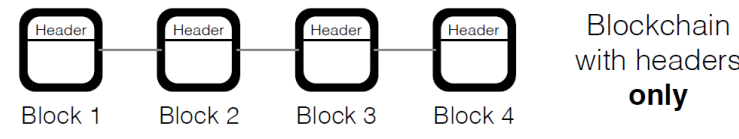

Un client SPV è interessato unicamente a ricevere e processare le transazioni che riguardano gli indirizzi contenuti nel proprio portafoglio (wallet). Per tale ragione, non scarica l'intera blockchain e non riceve le innumerevoli transazioni che gli sarebbero inutili. Ciononostante, la sicurezza delle transazioni rimane elevata : l'header contiene infatti il "nonce", permettendo all'SPV di verificare la Proof of Work (PoW), e, attraverso un meccanismo specifico, l'SPV può verificare anche la validità dell'inclusione di una transazione.

#### Verifica della Validità della Transazione in SPV

Ma come può un client SPV accertarsi che una transazione sia realmente presente in un blocco, senza scaricare il blocco stesso? Il processo avviene tramite l'interrogazione di un full node:

1. L'SPV richiede una specifica transazione, e il full node gliela invia.

2. Poiché il full node potrebbe barare (cheat) inviando transazioni non valide o inesistenti, deve provare all'SPV che la transazione inviata appartiene realmente a un blocco confermato della blockchain.

3. Per farlo, il full node invia all'SPV il cosiddetto **Merkle branch** (ramo di Merkle), ovvero una prova crittografica (Merkle proof) che collega gerarchicamente la singola transazione all'intestazione (header) del blocco.

4. Ricevuti questi dati, l'SPV applica ricorsivamente la funzione di hashing partendo dalla transazione ricevuta che vuole controllare.

5. Infine, l'SPV confronta il risultato finale di questi calcoli con la "Merkle tree root" (la radice dell'albero di Merkle) memorizzata nell'header del blocco che aveva precedentemente scaricato in sicurezza. Se i due valori combaciano, l'SPV ha la prova matematica e inconfutabile che la transazione appartiene realmente a quel blocco.

[INSERIRE IMMAGINE: Illustrazione di un albero di Merkle (Merkle Root e rami di hash sottostanti) che mostra il percorso logico per verificare se una transazione è inclusa nella blockchain]

---

### Concetti Chiave

- **Hash-Time Locked Contracts (HTLC):** Smart contract che utilizzano un segreto crittografato (Hash Lock) e una scadenza temporale (Time Lock) per garantire scambi sicuri e vincolati.

- **Atomic Swaps:** Tecnologia che sfrutta gli HTLC per permettere lo scambio diretto e senza intermediari (trustless) di criptovalute residenti su blockchain differenti.

- **OP_RETURN e Proof of Burn:** Sistemi utilizzati rispettivamente per inscrivere in modo inalterabile dati arbitrari nella blockchain e per distruggere permanentemente frazioni di criptovaluta per fini di consenso o creazione di nuovi asset.

- **Client SPV:** Dispositivi leggeri (come i wallet mobile) che verificano le transazioni scaricando solo le intestazioni (header) dei blocchi, utilizzando i "Merkle branch" forniti dai full node per confermare l'inclusione delle transazioni in totale sicurezza.

---

### La Verifica delle Transazioni nei Client SPV

Come abbiamo visto, un client SPV (Simplified Payment Verification) possiede una versione ridotta della blockchain, costituita unicamente dagli header dei blocchi. Quando un client SPV ha bisogno di sapere se una determinata transazione è effettivamente inclusa nella blockchain, si affida all'interrogazione di un nodo completo (full node). Tuttavia, l'SPV non deve fidarsi ciecamente della risposta del nodo.

Il processo di verifica, illustrato visivamente nelle diapositive tramite la ricostruzione passo-passo di un albero di hash, si basa sui rami di Merkle. Il full node, per dimostrare l'autenticità del dato, invia all'SPV non solo la transazione richiesta, ma anche il **Merkle branch** (ramo di Merkle) a essa associato. A questo punto, l'SPV calcola l'hash della transazione ricevuta e lo combina iterativamente con gli hash forniti nel Merkle branch, risalendo l'albero crittografico. L'operazione si conclude con successo solo se l'hash finale calcolato dall'SPV coincide perfettamente con la **Merkle Root** memorizzata all'interno dell'header del blocco. Questo rigoroso passaggio matematico garantisce che la transazione appartenga inequivocabilmente a quel blocco, prevenendo qualsiasi tentativo di falsificazione da parte del full node.

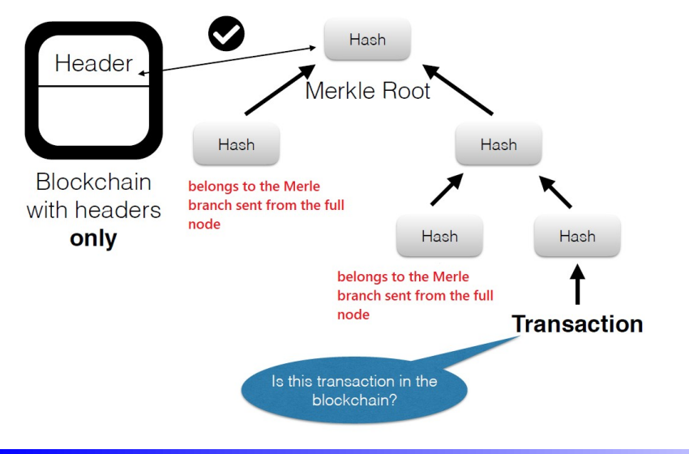

### Il Problema della Privacy e i Filtri Bloom

Il meccanismo di interrogazione degli SPV introduce però una grave criticità: richiedere a un full node informazioni su transazioni specifiche (es. "Per favore, inviami tutte le transazioni relative all'indirizzo 16c...") significa rivelare quali indirizzi appartengono al portafoglio dell'utente. Questa richiesta specifica provoca un'evidente perdita di informazioni sensibili (information leak), compromettendo la privacy.

Per mitigare questo problema, si adotta una soluzione algoritmica elegante: l'invio di un **Filtro Bloom** (Bloom filter) da parte dell'SPV al full node. Il client SPV crea questo filtro in modo che corrisponda agli indirizzi di suo interesse (quelli contenuti nel wallet). La creazione avviene prendendo ciascun hash di chiave pubblica (PKH) presente nel portafoglio e applicandovi tutte le funzioni di hashing previste dal filtro Bloom; i risultati vengono poi fusi calcolando un'operazione logica OR bit a bit (bitwise OR). Il risultato è una stringa binaria (es. 0101010) che offusca gli indirizzi reali.

Una volta ricevuta la connessione e il filtro Bloom, il full node testa gli indirizzi di output di ogni singola transazione contro il filtro stesso. Il full node utilizza le medesime funzioni di hashing. Se tutte le funzioni restituiscono l'indice di un elemento impostato a 1 all'interno del filtro Bloom, significa che la transazione *potrebbe* essere interessante per l'SPV. In questa fase sono possibili dei falsi positivi, il che contribuisce all'offuscamento. Al contrario, se anche solo una funzione restituisce uno 0, la transazione è definitivamente da scartare in quanto non interessante per quel wallet. Il nodo completo invierà all'SPV esclusivamente le transazioni rilevanti, garantendo così un duplice vantaggio: un risparmio notevole di larghezza di banda (bandwith saving) e un livello di offuscamento degli indirizzi (address obfuscation) che, seppur limitato e oggetto di continue proposte di miglioramento, tutela la privacy dell'utente.

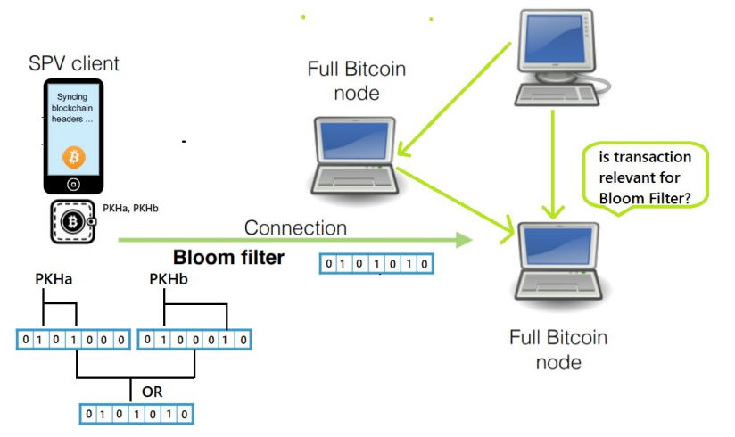

### Lo Stack del Protocollo Bitcoin e il Bootstrapping della Rete P2P

Per comprendere appieno il flusso dei dati, è necessario inquadrare il Bitcoin Protocol Stack, una struttura a strati sovrapposti. Partendo dall'alto troviamo l'**Application layer**, che ospita le applicazioni rivolte all'utente (user facing) che sfruttano la tecnologia blockchain. Subito sotto risiede il **Transaction layer**, il quale contiene la Virtual Machine (VM) e gli script, ospitando la logica necessaria per decidere se le transazioni siano valide. Più in basso opera il **Consensus layer**, incaricato di eseguire gli algoritmi e i protocolli per concordare quali transazioni debbano essere incorporate in via definitiva. Alla base di tutto vi è il **Network (P2P) layer**, responsabile della trasmissione (broadcasting) dei dati tra i nodi.

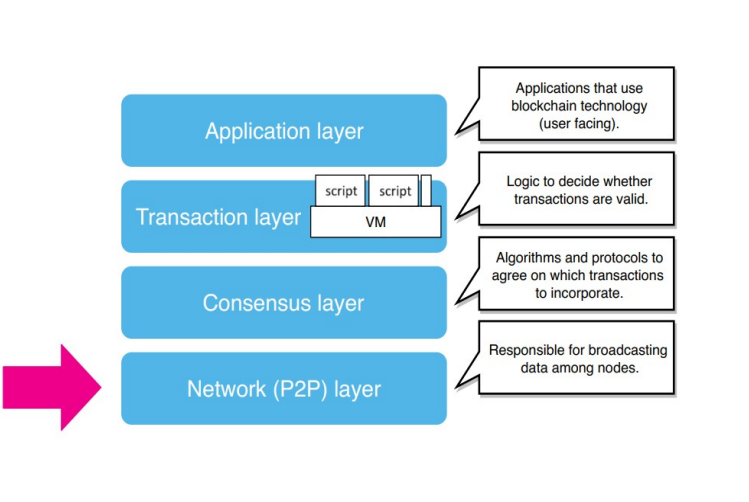

Questa infrastruttura di rete P2P è intrinsecamente non strutturata (unstructured) e aperta a chiunque. Ma in che modo un nuovo client riesce a connettersi? Il processo iniziale, definito bootstrapping, richiede che il client contatti altri peer (nodi) per iniziare a ricevere i blocchi. Esistono diversi metodi per farlo:

1. Utilizzo di "seed address" (indirizzi seme) scritti permanentemente nel codice del client (hard coded). Questi indirizzi puntano a nodi stabili, operativi da lungo tempo, i cui indirizzi IP devono necessariamente essere statici.

2. Un sistema DNS Bootstrap, composto da alcuni nodi dedicati che forniscono elenchi di indirizzi IP utili.

3. Metodi manuali tramite chat o forum, dove, in caso di fallimento dei metodi precedenti, un utente può chiedere gli indirizzi IP ad altri partecipanti e inserirli manualmente nel proprio client Bitcoin.

Inoltre, per velocizzare le riconnessioni future, un nodo che ha completato il bootstrap ricorderà nel suo database locale gli indirizzi delle sue connessioni recenti di maggior successo, ristabilendole rapidamente al riavvio del sistema.

### Peer Discovery e Connessioni di Rete

Affidarsi esclusivamente ai "seed nodes" (nodi seme) non è consigliabile, in quanto non sono un elemento fortemente decentralizzato. È imperativo scoprire ulteriori peer a cui connettersi. Per la "Peer Discovery", un nodo invia un messaggio **GETADDR** ai propri vicini, chiedendo loro di restituire un elenco di indirizzi di rete di altri partecipanti. Queste informazioni vengono ricevute sotto forma di messaggi **ADDR**, che possono essere inviati sia in risposta a una richiesta esplicita, sia spontaneamente. Parallelamente, un nuovo peer annuncia la propria esistenza alla rete inviando un messaggio ADDR contenente il proprio indirizzo IP ai nodi vicini, i quali si preoccuperanno di propagare l'informazione (forward) ai loro rispettivi vicini.

A livello di parametri di connessione, il sistema prevede di default 117 connessioni TCP in uscita (outgoing) e 8 connessioni TCP in entrata (incoming). Il nodo apre una porta TCP ben nota e standardizzata, la numero 8333, per accettare le connessioni in ingresso. È importante sottolineare che queste connessioni TCP avvengono in chiaro, senza alcuna forma di autenticazione o crittografia nativa (no authentication/encryption).

Una volta stabilita la connessione fisica, il nodo avvia un processo logico di "handshake" (stretta di mano). Il primo passo consiste nell'inviare un messaggio **VERSION**, il quale contiene informazioni identificative di base, tra cui un parametro fondamentale: il **bestHeight**, ovvero l'altezza attuale della blockchain posseduta dal nodo (il numero totale di blocchi). Il nodo ricevente confronta questo valore con la propria blockchain: se si accorge che la propria catena è più corta del valore `bestHeight` ricevuto nel messaggio, procederà immediatamente a richiedere e scaricare i blocchi mancanti. La ricezione del messaggio VERSION viene confermata con un messaggio di risposta chiamato **VERACK**.

### Il Protocollo Gossip e la Condivisione dei Dati

La diffusione delle informazioni a livello di rete nella maggior parte delle blockchain non autorizzate (permissionless) avviene tramite un protocollo di propagazione di tipo broadcast o **gossip**. Questo modello "any-to-all" fa sì che ciascun nodo propaghi la transazione o il blocco appena ricevuto a tutti i suoi vicini, formando nel complesso una rete sovrapposta casuale ma ben interconnessa (well-connected random overlay network).

Tuttavia, per non saturare la banda passante, i dati pesanti non vengono inviati alla cieca. Si utilizza una procedura di annuncio standard. Quando un nodo riceve una nuova transazione o un nuovo blocco, ne estrapola l'hash e invia ai vicini un messaggio di annuncio chiamato **INV**. Il messaggio INV contiene solo le impronte digitali (hash) degli oggetti, non i dati completi. Se un peer vicino si accorge di non possedere quei dati, risponde con un messaggio di richiesta **GETDATA**. Solo a questo punto il nodo originario trasmetterà l'effettivo blocco o transazione all'interno dei rispettivi messaggi **BLOCK** o **TRANSACTION**. Un aspetto cruciale per minimizzare il consumo di banda è la regola per cui un nodo deve richiedere un qualsiasi oggetto a un *singolo* peer alla volta: anche se riceve lo stesso hash (INV) contemporaneamente da più nodi vicini, invierà il comando "get" esclusivamente a uno di essi.

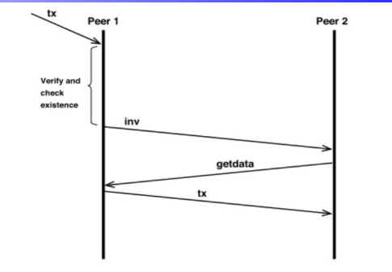

Questo complesso sistema di scambio dati funge anche da protezione contro attacchi informatici. Per prevenire attacchi di tipo Denial of Service (DoS) – in cui nodi malevoli inondano (flooding) la rete con oggetti non validi per saturarla e aumentare i ritardi di trasmissione – si adotta una semplice ma ferrea decisione di design: un nodo invia un messaggio INV ai suoi peer *solo ed esclusivamente dopo* aver validato localmente il blocco o la transazione (verificando, ad esempio, le firme o l'integrità degli UTXO). In aggiunta, i nodi mantengono un sistema di reputazione dei propri peer basato su euristiche predefinite. Se un nodo si comporta in modo anomalo (ad esempio inviando transazioni con firme non valide), la sua reputazione viene declassata. Una volta raggiunta una certa soglia minima di tolleranza, il nodo disonesto viene definitivamente disconnesso.

### Eccezioni e Sincronizzazione: Unsolicited Block Push e GETBLOCK

Esistono tuttavia delle eccezioni alla regola dell'annuncio preventivo tramite INV. I minatori (miners), ad esempio, eseguono regolarmente un **Unsolicited Block Push**: inviano direttamente il blocco intero agli altri peer senza preavviso. Questo comportamento è giustificato dal fatto che il minatore sa con certezza di essere l'unico nodo della rete a possedere quel blocco specifico che ha appena estratto; di conseguenza, è inutile attendere che l'altro peer ne faccia richiesta, poiché è matematicamente impossibile che ne sia già in possesso.

Infine, per gestire situazioni più complesse, come un peer che è rimasto disconnesso per lungo tempo o che si sta avviando per la prima volta, si utilizza il messaggio **GETBLOCK**. Ricostruire la catena corretta può essere complicato a causa dei *fork* (biforcazioni) della blockchain. Attraverso il comando GETBLOCK, un nodo chiede a un suo vicino di esporre la propria visione locale della blockchain. Il vicino non invia tutti i blocchi, ma risponde con un elenco di hash di blocchi posizionati a varie altezze (heights) sulla propria catena locale. Il nodo che si sta sincronizzando analizza questa lista, individua il primo hash che ha in comune con il vicino e, partendo da quel punto esatto di convergenza, inizia a richiedere tutti i blocchi successivi tramite messaggi GETDATA. Essendo spesso una mole imponente di dati, questo processo è iterativo: dopo aver scaricato un primo set di blocchi, viene inviato un nuovo comando GETBLOCK per continuare l'aggiornamento fino alla perfetta sincronizzazione.

---

### Concetti Chiave

- **Merkle Branch Verification:** Il processo crittografico mediante il quale i client SPV verificano l'inclusione di una transazione ricevendo dal full node solo la transazione e il percorso di hash (ramo) necessario a ricalcolare la Merkle Root presente nell'header del blocco.

- **Filtri Bloom:** Strutture dati probabilistiche inviate dagli SPV ai full node per richiedere transazioni in modo offuscato. Permettono di risparmiare banda e di non rivelare esplicitamente quali indirizzi appartengano al portafoglio dell'utente, a costo di possibili falsi positivi.

- **Handshake e Peer Discovery:** Il meccanismo di avvio della rete P2P, basato sulla scoperta di nuovi nodi tramite richieste (GETADDR/ADDR) e su una fase di negoziazione (VERSION/VERACK) dove i nodi confrontano l'altezza delle loro blockchain (bestHeight).

- **Protocollo Gossip e INV/GETDATA:** Il metodo decentralizzato di diffusione delle informazioni, progettato per risparmiare banda e prevenire attacchi DoS: un nodo annuncia prima l'hash del dato (INV) e lo trasmette fisicamente (BLOCK/TRANSACTION) solo se un vicino lo richiede esplicitamente (GETDATA), e solo dopo averne verificato internamente la validità.

---

# Lezione 12:  Scalabilità della Blockchain e il Bitcoin Lightning Network

### Il Trilemma della Blockchain

Il concetto fondamentale per comprendere i limiti delle attuali architetture decentralizzate è il **Trilemma della Blockchain**, un termine introdotto originariamente da Vitalik Buterin. Nelle slide viene citato anche come "Butlerin's trilemma", indicando che in fase di progettazione si può scegliere solo una specifica "faccia" o lato del triangolo concettuale. Questo trilemma solleva una questione cruciale: è possibile massimizzare contemporaneamente i tre attributi desiderabili di una blockchain? La risposta è no, perlomeno per il momento.

I tre attributi in competizione sono la decentralizzazione, la scalabilità e la sicurezza. La **decentralizzazione** consiste nel creare un sistema blockchain che non si affidi a un singolo punto centrale di controllo, garantendo così la resistenza alla censura. La **scalabilità** è definita come l'abilità del sistema di gestire una quantità di transazioni in continua e crescente espansione nell'unità di tempo. Infine, la **sicurezza** rappresenta la capacità della rete di operare secondo le aspettative e di difendersi efficacemente dagli attacchi informatici.

Analizzando i sistemi esistenti attraverso questa lente, emergono compromessi evidenti. Piattaforme storiche come Bitcoin ed Ethereum sono considerate decentralizzate e sicure, ma non sono affatto scalabili. Inoltre, la loro reale decentralizzazione viene messa in discussione a causa della presenza delle cosiddette mining pools. Al contrario, soluzioni come Hyperledger, Ripple, EOS e Stellar scelgono di privilegiare la sicurezza e la scalabilità. Il prezzo di questa scelta è la centralizzazione, poiché pochi nodi controllano l'intera rete, offrendo di conseguenza una minima resistenza alla censura. Infine, progetti come NANO, IOTA e Vechain puntano a essere scalabili e decentralizzati, ma sacrificano la sicurezza adottando meccanismi di consenso leggeri, come il "light PoW".

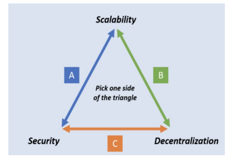

### I Limiti di Scalabilità delle Criptovalute

Il motivo principale per cui le criptovalute tradizionali non scalano è che ogni singola transazione deve essere registrata globalmente sulla blockchain. Questo limite strutturale porta a due lamentele principali da parte degli utenti. La prima lamentela riguarda la lentezza dei trasferimenti: un blocco Bitcoin richiede circa 10 minuti per essere minato e, considerando i 6 blocchi necessari per le conferme, il tempo di regolamento (settlement) raggiunge all'incirca un'ora.

La seconda lamentela evidenzia che Bitcoin non scala fisicamente. La dimensione del blocco è stata storicamente limitata a 1MB, passando teoricamente a 4MB a partire dal 2017. Poiché la dimensione media di una singola transazione è di circa 250 bytes, un blocco può contenere all'incirca 400 transazioni ogni 10 minuti. 

### Le Soluzioni "On-Chain" e le Loro Criticità

Per ovviare a queste restrizioni, sono state proposte diverse soluzioni di scalabilità cosiddette "on-chain", ma tutte presentano svantaggi critici. La prima opzione consiste nell'aumentare la dimensione del blocco. Tuttavia, blocchi più grandi richiedono più tempo per propagarsi nella rete, il che diminuisce gli incentivi per i validatori e porta a una maggiore centralizzazione. Una seconda alternativa è aumentare il tasso di produzione dei blocchi (block rate). Questa via causa una maggiore proliferazione di fork e, di conseguenza, comporta una minore sicurezza del network. 

Una terza soluzione prevede l'utilizzo di protocolli di consenso alternativi, come la Proof of Stake o altri meccanismi "lightweight". Questi protocolli offrono vantaggi significativi, tra cui un basso costo energetico, un'elevata scalabilità, transazioni veloci e la neutralizzazione degli attacchi al 51%. Tuttavia, gli svantaggi sono notevoli: in molti casi queste reti non sono realmente decentralizzate e favoriscono le disuguaglianze economiche, un concetto riassunto con l'espressione "poor stay poor".

Un esempio pratico del tentativo di incrementare la dimensione del blocco si è visto con BitcoinCash, un hard fork di Bitcoin che ha innalzato il limite inizialmente a 8MB e, più di recente, a 32MB. In realtà, questa non rappresenta una vera soluzione per la scalabilità. Per poter processare lo stesso volume di transazioni di VISA, la dimensione di un blocco dovrebbe raggiungere gli 8GB. In un simile scenario, i nodi della rete dovrebbero essere in grado di immagazzinare 400 TB di dati generati ogni anno, imponendo requisiti di spazio di archiviazione elevatissimi. Inoltre, i nodi necessiterebbero di un'altissima larghezza di banda, pari a 120 megabit al secondo. Queste barriere tecnologiche condurrebbero a una drastica riduzione del numero di nodi capaci di supportare la rete blockchain, sfociando in una centralizzazione più alta e in una conseguente perdita di sicurezza.

### Il Cambio di Paradigma: Off-Chain Payment Channels

Per superare l'inefficienza delle soluzioni on-chain, sono stati ideati i canali di pagamento off-chain (**Off Chain Payment Channels**). L'idea chiave è che non vi è alcun bisogno di trasmettere e registrare tutte le transazioni sulla rete globale. Al contrario, si propone di effettuare la maggior parte delle transazioni in modalità "off-chain" e di interpellare la blockchain principale esclusivamente nel ruolo di arbitro, solo quando strettamente necessario.

L'idea di base si traduce in un meccanismo "trustless" per lo scambio di transazioni tra due parti al di fuori della blockchain. Transando direttamente alla velocità della rete, le parti riescono a evitare completamente la lentezza insita nella blockchain. In questo contesto, le transazioni off-chain funzionano esattamente come delle cambiali (promissory notes), mentre la blockchain viene utilizzata solo per il regolamento finale (settlement). Questa infrastruttura si appoggia su reti preesistenti come Bitcoin o Ethereum, garantendo un sistema decentralizzato e "trustless" ideale per micro-pagamenti istantanei ad alto volume. Sebbene si parta da canali di pagamento off-chain unidirezionali, le estensioni possibili includono i canali bidirezionali e la composizione di canali multipli.

Per comprendere perché i payment channels sono così efficaci, basti immaginare un'utente (Alice) che deve effettuare numerosi micro-pagamenti (ad esempio per l'utilizzo di una stazione di ricarica gestita da Bob). Anziché pagare una tariffa on-chain per ogni frazione di servizio (es. 10 sat, 15 sat, 12 sat, 8 sat, 20 sat), Alice esegue questi pagamenti off-chain. Dopo ogni singolo micro-pagamento, Alice e Bob aggiornano lo stato del canale scambiandosi nuove transazioni di impegno (commitment transactions). Ad esempio, dal bilancio iniziale in cui Alice possiede 1.000 sat e Bob 0 sat (Stato 1), si passa a uno stato intermedio (Alice 960 sat, Bob 40 sat), per poi approdare a uno stato finale più recente (Alice 875 sat, Bob 125 sat). Nel canale esiste ed è valido solamente l'ultimo stato aggiornato; tutti gli stati precedenti diventano obsoleti e non verranno mai pubblicati sulla rete. Quando la sessione di ricarica giunge al termine, Alice e Bob chiudono il canale effettuando un singolo regolamento on-chain: i saldi finali (Alice riceve 875 sat e Bob riceve 125 sat) vengono scritti sulla blockchain di Bitcoin in un'unica transazione finale. Grazie a questo sistema, centinaia o migliaia di micro-pagamenti fluiscono istantaneamente in pochi millisecondi e in modo economico, con commissioni ridotte a frazioni di un satoshi. Si ottiene il risultato senza dover elaborare una transazione on-chain per ogni singolo pagamento.

I vantaggi di questo approccio sono molteplici. Prendendo quasi tutte le operazioni fuori catena, si eliminano i colli di bottiglia senza la necessità di ricorrere ad un "hard-fork" nel protocollo di base. Inoltre, si mantiene pressoché inalterata la sicurezza della catena principale, poiché il canale off-chain eredita le stesse assunzioni di sicurezza ed usa la blockchain come entità arbitrale per prevenire comportamenti disonesti. Infine, i tempi di regolamento e le commissioni di transazione si riducono drasticamente, poiché si ottiene un "local settlement" che non richiede il costoso consenso globale. Ovviamente, sussistono alcuni problemi potenziali, tra cui il blocco dei fondi (fund locking), una possibile centralizzazione (le cui dinamiche non sono ancora del tutto chiare) e la necessità che i dispositivi siano sempre connessi (always-on requirement).

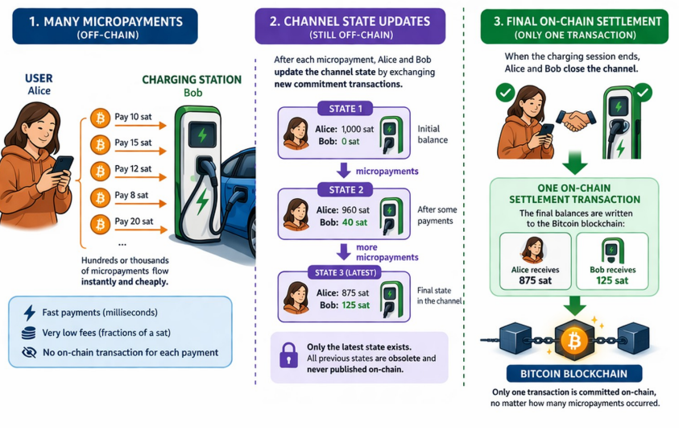

### Il Lightning Network e un'Analogia Concreta

La maturità tecnologica dei canali di pagamento è dimostrata dal fatto che sono ormai pronti per l'ambiente di produzione. L'esempio più illustre è il **Bitcoin Lightning Network**. Rilasciato in versione Alpha nel Gennaio del 2017, ha visto il suo primo acquisto verificato nel Gennaio del 2018. Questo risultato è frutto degli sforzi di sviluppo congiunti di numerosi gruppi. La rete ha dimostrato resilienza anche superando il suo primo attacco DDoS il 20 Marzo 2018, evento che portò temporaneamente offline 200 nodi. Tentativi simili sono stati effettuati anche altrove: ad esempio, il Raiden Network (o uRaiden) è stato lanciato sulla mainnet di Ethereum nel Novembre 2017, ma non ha ottenuto il successo sperato, lasciando spazio ad altre soluzioni "layer-2".

A livello architetturale, i canali instaurati tra i vari nodi Bitcoin formano una rete "Layer 2" sovrapposta al livello base di Bitcoin. Questa infrastruttura si configura come una rete P2P di canali di pagamento. Poiché è basata nativamente su Bitcoin, le transazioni che avvengono nel Lightning Network sono a tutti gli effetti transazioni Bitcoin. Applicando la filosofia del "cosa succede se non pubblichiamo tutto?", il Lightning Network rende possibili pagamenti economici e micro-pagamenti istantanei, dando vita a un sistema estremamente scalabile.

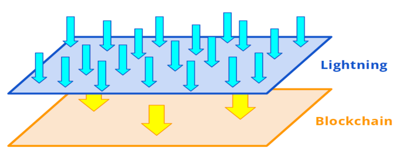

Per visualizzare in modo intuitivo il funzionamento del Lightning Network, si può ricorrere a un'analogia legata alla vita quotidiana. Immaginiamo che un cliente si rechi in un locale, consegni la propria carta di credito al barista e inizi a ordinare da bere. Invece di addebitare la carta di credito per ogni singola consumazione, il barista annota semplicemente le birre su un conto aperto (tab). Questa pratica evita di dover pagare le commissioni bancarie ogni volta che la carta viene strisciata e permette di conservare il saldo complessivo fino alla fine della serata. Non c'è alcun rischio per il barista poiché egli detiene fisicamente la carta di credito; se anche il cliente dovesse scappare, il barista possiede la carta come garanzia certa per coprire il debito.

---

### Glossario e Concetti Chiave

- **Trilemma della Blockchain**: Il principio formulato da Vitalik Buterin secondo cui un sistema blockchain può massimizzare solo due caratteristiche su tre tra Decentralizzazione, Scalabilità e Sicurezza.

- **Scalabilità On-Chain**: I tentativi di aumentare il numero di transazioni elaborabili (es. aumentando le dimensioni dei blocchi come in BitcoinCash), i quali tendono però a compromettere la decentralizzazione o la sicurezza.

- **Payment Channels (Off-Chain)**: Sistemi "trustless" che permettono a due entità di scambiarsi transazioni privatamente ad altissima velocità, aggiornando localmente il proprio saldo e interpellando la blockchain solo per il saldo finale.

- **Lightning Network**: La più nota rete Layer-2 basata su Bitcoin. Permette pagamenti istantanei e a bassissimo costo attraverso una rete P2P di canali di pagamento, evitando di registrare ogni singola transazione on-chain.

---

### L'Idea Generale del Lightning Network

Per tradurre l'analogia del barista in termini tecnici, nel Lightning Network il cliente non consegna una carta di credito, ma deposita i propri fondi (ad esempio, un deposito di 50.000 Satoshi o 50K) in un indirizzo crittografico specifico chiamato **payment channel** (canale di pagamento). A questo punto, i singoli pagamenti non vengono registrati immediatamente sulla blockchain come transazioni standard. Al contrario, essi vengono annotati in "registri privati" (private ledgers) gestiti direttamente dalle due parti coinvolte, in questo caso il cliente e il barista. Questo approccio è paragonabile ai pagamenti a rate o ai conti aperti che tradizionalmente si tenevano con il droghiere di fiducia.

Quando il cliente ordina la prima consumazione, crea una transazione (ad esempio di 5.000 Satoshi) dal canale di pagamento verso il barista. Proprio come il barista dell'analogia non striscia subito la carta di credito, anche in questo caso il ricevente non trasmette la transazione alla blockchain, consapevole che il cliente potrebbe ordinare un altro drink. Questa scelta porta a due vantaggi immediati: non si spreca tempo per attendere la conferma del blocco (che richiederebbe decine di minuti) e non si spendono soldi per le commissioni di transazione della rete principale.

Ogni volta che il cliente consuma una nuova birra, genera e firma una nuova transazione che aggiorna il saldo totale (ad esempio, passando a 15.000 Satoshi e poi a 10.000 Satoshi). Fondamentalmente, ogni nuova transazione sostituisce la precedente, mantenendo aggiornato il bilancio senza mai alterare il registro globale. Il barista non corre alcun rischio finanziario: possedendo l'ultima transazione firmata validamente dal cliente (Bob), ha la garanzia matematica di poterla inviare e registrare sulla blockchain in qualsiasi momento lo desideri. Solo quando le consumazioni sono terminate, le parti creano una transazione finale (nota come "2nd Layer Transaction") che distribuisce i saldi definitivi. Questa è l'unica transazione che viene effettivamente trasmessa alla rete Bitcoin. Oltre all'efficienza, questo metodo aumenta notevolmente la privacy, poiché la blockchain manterrà traccia esclusivamente della transazione di apertura e di quella di chiusura del canale.

### Il Protocollo Lightning: Strumenti Tecnici e Operazioni Base

A livello formale, il Lightning Network è un protocollo "Layer-2" proposto dai ricercatori Poon e Dryja, basato sull'utilizzo di canali off-chain che possono essere unidirezionali o bidirezionali. Un canale di pagamento è una struttura crittografica che definisce tre operazioni fondamentali: l'apertura del canale (channel opening), gli impegni fuori catena (offchain commitments) e la chiusura del canale (channel closing). Come già accennato, solo l'apertura e la chiusura sono visibili sulla blockchain.

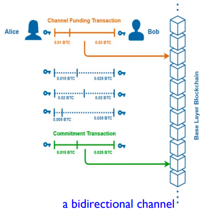

Evitando di inserire ogni singola transazione nella blockchain principale, gli utenti non devono più attendere 10 minuti per la conferma del blocco, non pagano alte commissioni di transazione (sebbene una piccolissima fee sia prevista anche sul Lightning Network) e non sovraccaricano la rete con volumi di dati insostenibili. Tuttavia, operando fuori catena, è necessario un sistema per punire i comportamenti scorretti degli utenti. Se una delle due parti tenta di imbrogliare (ad esempio, pubblicando un vecchio saldo), tutti i fondi del canale vengono assegnati alla controparte lesa. Questo meccanismo di difesa è implementato tramite un "**remedy script**" (script di rimedio), che invalida il tentativo di frode e applica la punizione.

Per implementare questa architettura, il Lightning Network si affida a specifici mattoni tecnologici (Building Blocks). Questi includono le firme multiple (**multisignature**), i blocchi temporali (**Time Locks**), i valori di hash uniti ai segreti crittografici (**Hash Value and Secrets**) e l'utilizzo di transazioni non confermate (**unconfirmed transactions**) per garantire la protezione contro il problema della doppia spesa (double spend protection).

### Apertura e Gestione dei Fondi (Escrow)

Il cuore tecnico di un canale di pagamento è un indirizzo multi-firma a due utenti (2-users multi-signature address), spesso definito come **Escrow** (deposito a garanzia). Per spendere i fondi contenuti in questo indirizzo, è necessaria l'approvazione crittografica e la firma contemporanea di entrambe le parti (ad esempio, Alice e Bob). Il funzionamento è del tutto simile a quello di un conto bancario cointestato che richiede due firme per consentire i prelievi.

L'apertura del canale avviene tramite la **Funding Transaction** (transazione di finanziamento). In questa fase, Alice preleva fondi da un suo indirizzo personale e li versa nell'indirizzo multi-firma condiviso (ad esempio, mettendo 100 BTC in escrow). Questa operazione iniziale deve obbligatoriamente essere registrata sulla blockchain. Una volta che i fondi sono bloccati nell'escrow, Alice e Bob iniziano a transare scambiandosi transazioni non confermate chiamate **Commitment Transactions**. Queste transazioni prendono i fondi dall'indirizzo multi-firma (Input) e li ridistribuiscono agli indirizzi individuali di Alice e Bob (Output). È fondamentale notare che Alice firma queste transazioni prima di inviarle a Bob; esse non vengono trasmesse alla rete, ma conservate localmente, permettendo a ciascuna parte di avere una propria "fotografia locale" e aggiornata dei saldi.

Seguiamo un esempio pratico della dinamica dei saldi:

1. Inizialmente, tramite una prima Commitment Txn, Alice invia 80 BTC a Bob. L'output aggiornato riflette quindi 20K per Alice e 80K per Bob. La transazione, firmata da entrambi, è salvata localmente.

2. Successivamente, Bob decide di rimandare 10 BTC ad Alice. Viene creata una nuova Commitment Txn con i saldi aggiornati: 30K per Alice e 70K per Bob. Questa nuova transazione sostituisce la precedente.

3. Bob invia ulteriori 10 BTC ad Alice. I saldi cambiano nuovamente in 40K per Alice e 60K per Bob. Entrambi conservano questa copia firmata, e fino a questo momento nessuna transazione è stata pubblicata sulla blockchain.

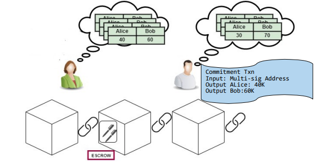

### Chiusura del Canale, Protezione e Prevenzione delle Truffe

Quando arriva il momento di riscuotere (ad esempio, è sabato sera e Bob ha bisogno di contanti per divertirsi), Bob pubblica semplicemente l'ultima transazione valida e firmata da entrambi sulla blockchain. Questa singola operazione finale stabilisce in modo definitivo i saldi on-chain, permettendo a ciascuno di ricevere quanto gli spetta e concludendo l'interazione con soddisfazione reciproca.

Ma cosa impedisce ad Alice o a Bob di barare? Qui entra in gioco la **protezione dalla doppia spesa** (Double Spending Protection). Nel momento in cui una transazione viene pubblicata e confermata sulla blockchain, i fondi dell'indirizzo multi-firma vengono spesi. Di conseguenza, né Alice né Bob possono provare a inviare una transazione più vecchia e più favorevole (ad esempio, lo stato in cui Alice aveva 80 BTC invece di 40 BTC). Se ci provassero, la rete Bitcoin respingerebbe immediatamente il tentativo classificandolo come una doppia spesa illegittima.

Esiste tuttavia un'altra potenziale vulnerabilità critica, nota come **scam del blocco dei fondi** (Trapping the Funds). Immaginiamo che Alice depositi 100 BTC nell'indirizzo multi-firma e, subito dopo, Bob scompaia nel nulla. Poiché per sbloccare i fondi dall'escrow sono necessarie entrambe le firme, il denaro di Alice rimarrebbe irrimediabilmente intrappolato. Per disinnescare questa truffa, si utilizza un meccanismo di garanzia preventiva basato sui **Time Locks** (blocchi temporali). Prima ancora di pubblicare la transazione di finanziamento (Funding Transaction) sulla rete, Alice obbliga Bob a firmare una "transazione di garanzia" (warranty transaction) off-chain. Questa transazione speciale stabilisce, ad esempio, un rimborso totale di 100 BTC ad Alice dopo un ritardo temporale prestabilito, come 7 o 30 giorni. Se Bob si dimostra non responsivo o scompare, Alice deve semplicemente attendere lo scadere del tempo e pubblicare la transazione di rimborso sulla blockchain, recuperando interamente il proprio capitale.

---

### Concetti Chiave

- **Payment Channel (Canale di Pagamento)**: Un'infrastruttura crittografica basata su un indirizzo multi-firma (Escrow) che permette a due parti di depositare fondi e aggiornare i rispettivi saldi fuori dalla blockchain.

- **Commitment Transaction**: Transazioni non confermate, create e firmate localmente dalle parti, che aggiornano continuamente i saldi del canale di pagamento sostituendo le versioni precedenti.

- **Remedy Script (Script di Rimedio)**: Un meccanismo di sicurezza vitale nel Lightning Network che punisce severamente qualsiasi tentativo di frode, riassegnando tutti i fondi alla parte onesta se l'altra cerca di pubblicare uno stato vecchio e revocato.

- **Time Lock (Blocco Temporale)**: Strumento crittografico che rende una transazione valida e spendibile solo dopo lo scadere di un certo intervallo di tempo o al raggiungimento di un blocco specifico, fondamentale per evitare che i fondi rimangano bloccati (scam del trapping) se una delle due parti scompare.

---

### Riepilogo dei Canali Off-Chain e la Chiusura

Per comprendere appieno i meccanismi di sicurezza, è utile riepilogare le dinamiche di un canale off-chain. Supponiamo che Alice invii 10 BTC a Bob attraverso il canale. Questa operazione si traduce in una transazione fuori catena, firmata da Alice, che preleva i fondi dall'escrow e assegna 90 BTC ad Alice e 10 BTC a Bob. In questa fase, Bob non pubblica la transazione sulla blockchain. Successivamente, Alice decide di inviare ulteriori 10 BTC a Bob. Viene così generata una nuova transazione off-chain che sostituisce la precedente, ripartendo i fondi con 80 BTC per Alice e 20 BTC per Bob, sempre previa firma di Alice. Questa seconda transazione risulta economicamente più vantaggiosa per Bob, il quale, di conseguenza, la conserva scartando la precedente.

Al momento della chiusura del canale, Bob firma l'ultima transazione valida e preleva i fondi dall'escrow. In questo modo, Bob riceve il saldo totale che gli è stato inviato nel corso del tempo , mentre Alice riceve il resto rimanente. Questa procedura garantisce che ogni partecipante ottenga la propria quota corretta, lasciando tutti soddisfatti.

### Il Problema delle Transazioni Obsolete e la Frode

Tuttavia, il sistema appena descritto presenta una criticità fondamentale. Nonostante la regola imponga che ogni transazione venga sostituita dall'ultima, la quale mostra il saldo corretto e aggiornato del canale, le transazioni precedenti rimangono tecnicamente valide. Esse sono conservate privatamente da Alice e Bob, recano le firme di entrambi e potrebbero, in linea teorica, essere pubblicate sulla blockchain.

Questo scenario apre le porte a una possibile truffa. Alice potrebbe decidere in malafede di pubblicare sulla blockchain una transazione precedente che risulta essere più favorevole per lei, come ad esempio la transazione iniziale di finanziamento che le assegnava 100K BTC. In realtà, avendo Bob già fornito a lei una consumazione (un "drink"), il vero saldo di Alice non è più di 100K. Purtroppo, la rete Bitcoin accetterebbe questa transazione obsoleta senza obiezioni, poiché essa è stata precedentemente firmata in modo crittograficamente valido da Bob.

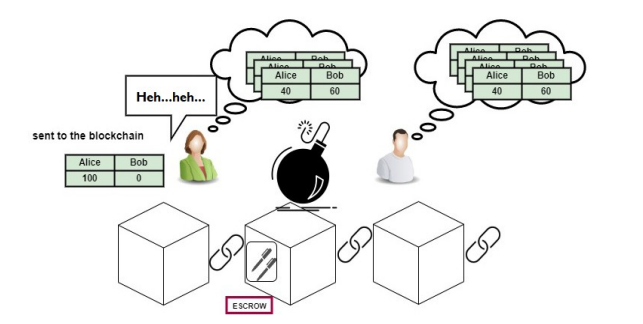Per chiarire questo concetto, si può utilizzare la metafora degli assegni. Le transazioni nei canali di pagamento sono paragonabili alla firma di assegni staccati da un conto cointestato a favore l'uno dell'altro, senza però incassarli immediatamente. Nel mondo fisico, ogni volta che si firma un nuovo set di assegni, si stracciano i precedenti per evitare che la controparte incassi una transazione annullata. Tuttavia, nel protocollo Bitcoin, non esiste alcun modo per "stracciare" digitalmente una transazione inviata fuori catena. Non vi è alcuna garanzia intrinseca che Alice non conservi una copia di un vecchio stato per poi trasmetterla alla rete in un secondo momento. Di conseguenza, è assolutamente necessario un meccanismo per garantire la sicurezza. Questa sfida rappresenta il problema più complesso da affrontare nell'implementazione della rete.

### La Soluzione Punitiva e i Segreti di Revoca

Il Lightning Network non potendo garantire tecnicamente la cancellazione fisica di una transazione off-chain da parte di Alice e Bob ogni volta che ne viene generata una nuova, adotta un approccio radicale: una soluzione basata sulla punizione. Il protocollo è progettato per punire severamente Alice o Bob qualora pubblichino una transazione più vecchia.

Questo meccanismo si fonda sull'utilizzo dei **segreti di revoca** (revocation secrets). Ogni singola transazione include un segreto di revoca specifico. Se Alice dovesse pubblicare una transazione precedente e ormai invalidata, chiunque possieda il relativo segreto di revoca ha il potere di "punire il comportamento illegale". La regola d'oro del protocollo stabilisce che Alice deve consegnare a Bob il segreto di revoca relativo alla transazione corrente *prima* di poter emettere una nuova transazione successiva. Di conseguenza, se Alice tenta la frode pubblicando una transazione passata (non più valida), Bob la punisce dimostrando alla rete di possedere il segreto di revoca corrispondente, arrogandosi così il diritto di prelevare l'intero importo del canale, comprese le quote di Alice.

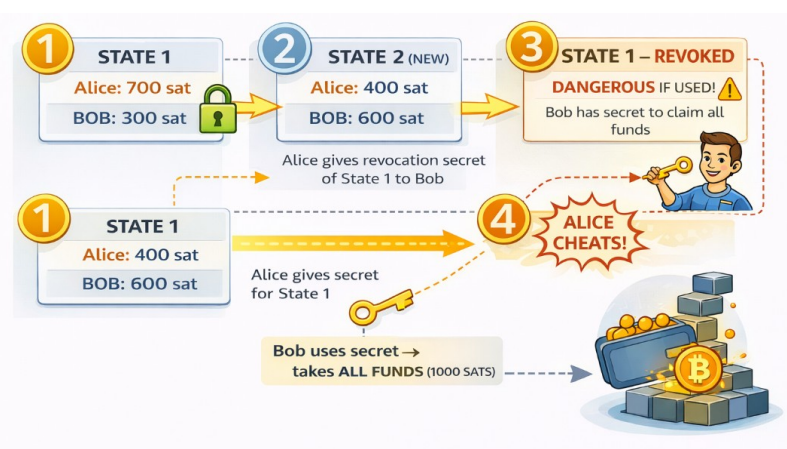

A livello di codice Bitcoin, questo sistema è implementato attraverso uno script noto come **hash lock script**. Analizzando la struttura di una "Commitment TXN" (transazione di impegno) dotata di segreto di revoca, notiamo che l'Input preleva costantemente i fondi dall'indirizzo multi-firma. L'Output distribuisce il denaro a Bob o ad Alice basandosi su condizioni rigorose. Ad esempio, l'Output1 (pari a 90k) stabilisce la seguente logica condizionale: "Se viene fornito il segreto di revoca, paga a Bob, altrimenti paga ad Alice". L'Output2, invece, assegna incondizionatamente 10k a Bob. Questo significa che uno degli output può essere sbloccato unicamente se viene esibito il segreto di revoca corretto. Se Bob possiede tale segreto e Alice pubblica uno stato a lei più favorevole, Bob attiverà la clausola punitiva prelevando anche la quota di Alice.

Tuttavia, emerge un'ultima complicazione. Il protocollo deve concedere a Bob il tempo materiale per accorgersi della truffa di Alice e applicare la punizione. Alice non deve avere la possibilità di prelevare i fondi da una vecchia transazione in modo istantaneo, eludendo i controlli di Bob. Per risolvere questo ostacolo, la transazione viene modificata introducendo un ritardo temporale (Time Lock). Lo script finale diventa quindi: "Se viene fornito il segreto di revoca, paga a Bob, altrimenti *dopo 24 ore* paga ad Alice". Grazie a questa finestra di 24 ore, Bob ha tutto il tempo necessario per monitorare la blockchain, accertarsi della frode e incassare l'intero ammontare prima che Alice possa accedere ai fondi.

### Watchtower e il Monitoraggio della Rete

L'introduzione del ritardo temporale implica che le due parti debbano controllare periodicamente la blockchain per monitorare eventuali comportamenti fraudolenti della controparte. L'azione anti-frode deve essere intrapresa tempestivamente, ad esempio prima che vengano estratti 1000 blocchi , richiedendo un controllo della blockchain almeno una volta a settimana. Per alleggerire questo onere e garantire l'efficacia del sistema anche quando un utente è offline, entra in gioco la figura della **Watchtower**. Una watchtower è un servizio di terze parti che si incarica di monitorare costantemente la blockchain per conto degli utenti , ed è strutturata in modo tale da non poter tradire la fiducia dell'utente che la impiega.

Riassumendo i pagamenti off-chain, si evidenzia come il trasferimento di bitcoin avvenga in modo decentralizzato, istantaneo e "trustless". Vengono eseguite solamente due transazioni on-chain (per aprire e chiudere il canale) , mentre all'interno del canale aperto le nuove transazioni sostituiscono quelle vecchie a livello locale. I bitcoin possono così essere trasferiti direttamente tra le parti senza alcuna necessità di trasmissione globale alla rete , fino al momento in cui i pagamenti non terminano e il canale viene definitivamente chiuso.

### Il Routing nel Lightning Network e il Problema della Fiducia

Il potenziale del Lightning Network si esprime appieno quando si considera la necessità di scambiare fondi con soggetti con cui non si ha un canale diretto. Immaginiamo che Alice desideri acquistare un trancio di pizza, ma non possieda un canale preesistente con la pizzeria. Benché possa aprirne uno nuovo , questa soluzione si rivela impraticabile su larga scala: non è pensabile aprire un canale per ogni singola persona a cui si desidera inviare denaro. L'apertura di un canale, infatti, richiede in ogni caso una costosa transazione sul livello base (Layer-1) della rete Bitcoin.

La soluzione consiste nel routing. Alice, ad esempio, potrebbe avere già un canale aperto con il barista della caffetteria locale. A sua volta, il barista ha un canale aperto con la pizzeria. Alice può quindi sfruttare questi canali già esistenti per raggiungere la sua destinazione.

Tuttavia, emerge un problema di fiducia: Alice non si fida ciecamente del barista e non può semplicemente inviargli il denaro sperando che egli lo inoltri alla pizzeria. Per superare questo ostacolo "trust", Alice crea uno speciale script Bitcoin che detta una regola inequivocabile: "paga il barista solamente se egli ha pagato la pizzeria".

### Pagamenti Multi-Hop e Contratti HTLC

Espandiamo questo concetto a una rete di pagamento più complessa, introducendo un percorso multi-hop (a più salti) composto da Alice, Bob, Carol e Dave. Alice ha bisogno di inviare 1 BTC a Dave , ma non vuole (o non può) aprire un nuovo canale direttamente con lui. Alice decide quindi di sfruttare i canali esistenti: paga 1 BTC a Bob, il quale paga 1 BTC a Carol, che a sua volta paga 1 BTC a Dave.

Il rischio insito in questa catena è l'inaffidabilità dei nodi intermedi. Cosa succede se Bob decide di imbrogliare e si rifiuta di inoltrare il pagamento, trattenendo i fondi per sé? La soluzione anti-frode combina due degli strumenti crittografici già citati: l'**Hash Lock** e il **Time Lock**. L'unione di questi due elementi genera l'**HTLC (Hashed Timelock Contract)**.

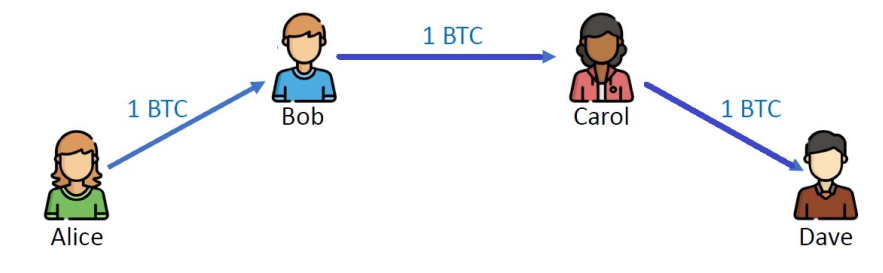

Il funzionamento dell'HTLC in un pagamento multi-hop si articola in fasi precise che garantiscono l'atomicità dell'operazione, ovvero il fatto che il pagamento avvenga interamente con successo oppure venga annullato per tutti:

1. **Generazione del segreto:** Il destinatario finale, Dave, genera un segreto casuale denominato **R** e ne calcola l'hash, **H = H(R)**. Successivamente, Dave invia l'hash H ad Alice.

2. **Inizializzazione del pagamento bloccato:** Alice invia il pagamento di 1 BTC a Bob, ma i fondi sono bloccati all'interno di uno script hashed timelock. Alice crea questa transazione verso Bob inserendovi l'output vincolato dall'hash H del segreto. Bob potrà riscattare quell'1 BTC proveniente da Alice esclusivamente se sarà in grado di produrre il segreto R originale che genera l'hash H specificato nello script.

3. **Propagazione in avanti (Forwarding):** Ogni nodo intermedio sul percorso replica lo stesso meccanismo, generando una nuova transazione "hash time locked" (basata sempre sullo stesso hash H) verso il nodo successivo. Fino a questo punto, nessuno può prelevare l'1 BTC.

4. **Sblocco e propagazione a ritroso:** Infine, quando il pagamento bloccato raggiunge Dave, quest'ultimo risponde svelando il segreto R al contratto hash locked, prelevando così i suoi bitcoin. Poiché il segreto R è ora di dominio pubblico nella catena, si propaga a ritroso: tutti gli altri nodi intermedi (Carol, poi Bob) vengono pagati nel momento in cui esibiscono il segreto R ai rispettivi contratti precedenti.

5. **Conferma:** Nel momento in cui Alice riceve indietro la prova del segreto R, ha l'assoluta certezza matematica che chiunque lungo il percorso sia stato correttamente pagato e che la transazione sia andata a buon fine.

In conclusione, è grazie all'architettura dei contratti HTLC che le operazioni di routing diventano completamente atomiche e prive di necessità di fiducia (trustless).

---

### Glossario e Concetti Chiave

- **Segreto di Revoca (Revocation Secret)**: Una chiave crittografica associata a ogni transazione off-chain. Viene scambiata tra le parti alla creazione di un nuovo stato del canale per invalidare (e rendere punibile) la pubblicazione degli stati vecchi.

- **Hash Lock Script**: Lo script condizionale utilizzato per implementare i meccanismi di punizione e i pagamenti vincolati, subordinando il trasferimento dei fondi alla rivelazione di uno specifico segreto.

- **Watchtower**: Un servizio di terze parti che monitora costantemente la blockchain per conto degli utenti offline, al fine di sventare tentativi di pubblicazione di stati vecchi e fraudolenti del canale.

- **HTLC (Hashed Timelock Contract)**: Un contratto crittografico che combina un blocco basato su hash (Hash Lock) e un blocco temporale (Time Lock). Consente di instradare pagamenti multi-hop in modo "trustless" e atomico, assicurando che i fondi vengano trasferiti correttamente o completamente rimborsati in caso di fallimento.

- **Routing Multi-Hop**: Il processo di inoltro di un pagamento attraverso una serie di canali di pagamento intermedi (nodi) interconnessi, permettendo transazioni tra parti che non hanno un canale diretto aperto tra loro.

---

### La Gestione dei Fallimenti nei Pagamenti Multi-Hop e i Contratti HTLC

In un percorso di pagamento multi-hop, sorge un interrogativo fondamentale: cosa accade se il segreto crittografico non viene fornito in tempo utile? Il destinatario finale, Dave, potrebbe infatti decidere di non rivelare il valore segreto $R$ necessario per ricevere i propri bitcoin. In questo scenario, entra in gioco la componente temporale del contratto, ovvero il **Time Lock**. Il sistema garantisce un rimborso automatico a chi ha trasferito i fondi (transferor) nel caso in cui $R$ non venga fornito entro il tempo limite stabilito, assicurando così che nessun partecipante possa agire da inadempiente (defaulter) bloccando indefinitamente i capitali altrui.

Questo meccanismo di sicurezza è implementato riducendo progressivamente il parametro **nLockTime** ad ogni salto (hop) lungo il percorso. Ad esempio, il nodo iniziale Alice potrebbe impostare un `nLockTime` di 20 giorni. Il nodo successivo, Bob, inoltrerà il pagamento verso Carol con un `nLockTime` ridotto a 15 giorni. Infine, Carol lo invierà a Dave con un `nLockTime` di 10 giorni. Questa decrescita temporale assicura che ogni nodo intermedio abbia tempo a sufficienza per reclamare i fondi dal nodo precedente, qualora il contratto fallisca a valle. L'unione indissolubile di un blocco basato su hash (Hash Lock) e di uno temporale (Time Lock) dà origine all'**HTLC (Hashed Timelock Contract)**.

Il modello di pagamento basato su HTLC si fonda sulla promessa: "Ti pagherò in cambio della pre-immagine dell'hash; se non rispondi, riavrò i miei soldi dopo un certo ritardo". All'atto pratico, questo si concretizza in una richiesta di pagamento (Payment Request) che contiene l'importo, l'hash e il ritardo temporale.

Un esempio pratico di fattura generata riporta l'ordine identificato dal codice `#CS6198295DE0E31C5B55CF1330EX675` per un totale di `0.000036 BTC`. I metadati associati a questa richiesta includono una descrizione dei beni acquistati ("1 Espresso Coin Panna, 1 Scala Chip Frappuccino"), l'hash di riferimento $H$ (`c2f7adaac99b5609b7df702ab9cf2b096b806e1a3c040994dde427811cfb071f`), l'identificativo del nodo (`035b55e3e08538afeef6ff9804e3830293eec1c4a6a9570f1e96a478dad1c86fed`), l'importo preciso di `3600000 MilliSatoshis` e un Timestamp specifico (`1514890568`). L'utente può quindi procedere al pagamento scansionando la fattura e cliccando su "OPEN WITH YOUR WALLET".

### Il Routing e il Ruolo dei Fornitori di Liquidità

La struttura del Lightning Network si presenta come un grafo complesso e densamente interconnesso. La regola aurea di questa topologia è che è possibile pagare chiunque, a patto di riuscire a trovare una rotta valida per raggiungerlo. Tuttavia, per far viaggiare il denaro, non è sufficiente individuare un percorso qualsiasi tra due punti: è imperativo che tale rotta disponga di fondi sufficienti al suo interno per sostenere l'importo del pagamento.

Nel processo di instradamento, i pagamenti vengono inoltrati utilizzando i contratti HTLC, ma con una dinamica peculiare: ogni nodo intermediario impegna i *propri* fondi, piuttosto che limitarsi a passare i fondi appena ricevuti. Un nodo di routing deve quindi fungere da fornitore di liquidità (liquidity provider), disponendo di una cosiddetta **outbound liquidity** (liquidità in uscita). Questo avviene perché il nodo blocca il proprio bilancio in un contratto HTLC (una promessa di pagamento condizionata alla rivelazione del segreto) prima ancora di venire pagato dal nodo precedente. Ancora una volta, gli HTLC garantiscono l'atomicità: o ogni salto viene completato con successo (Success) e tutti vengono pagati, oppure l'operazione fallisce e tutti i fondi tornano al sicuro ai legittimi proprietari (Refund).

A questo punto è fondamentale distinguere due concetti di base. La **capacità del canale** (channel capacity) rappresenta la somma totale di denaro depositata al momento dell'apertura con la transazione iniziale, ed è un valore fisso. Il **bilancio del canale** (channel balance), invece, indica come il denaro è suddiviso tra i due nodi in un dato momento e varia dinamicamente in base alle transazioni effettuate.

Per chiarire le dinamiche di liquidità, consideriamo due operatori di routing, identificati convenzionalmente come nodo arancione e nodo blu, che decidono di aprire un canale congiunto. Il nodo arancione mette a disposizione 1.000.000 di satoshis per instradare i pagamenti. In questa fase iniziale, la sua liquidità in uscita (outbound liquidity) è pari a 1.000.000, mentre la sua liquidità in entrata (inbound liquidity) è zero. Di conseguenza, il nodo arancione può inviare pagamenti verso l'operatore blu, ma non possiede ancora lo spazio per riceverne.

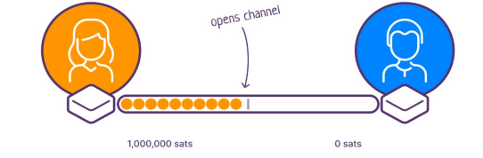

Se il nodo arancione riceve una richiesta per instradare un pagamento di 100.000 sats attraverso quel canale, esso blocca preventivamente i 100.000 sats. Questo gesto rappresenta una "promessa" di inviare i fondi all'operatore blu non appena riceverà il segreto. Una volta ottenuto il segreto, la transazione si concretizza: la nuova liquidità in uscita del nodo arancione scende a 900.000 sats, mentre la sua liquidità in entrata sale a 100.000 sats. Qualora venga instradato un ulteriore pagamento di 400.000 sats in ritardo, la liquidità in uscita si ridurrà ulteriormente a 500.000 sats, eguagliando la liquidità in entrata, ora anch'essa a 500.000 sats. Solamente a questo punto il nodo blu disporrà di una propria outbound liquidity e sarà in grado di inoltrare, ad esempio, un pagamento a ritroso di 200.000 sats verso il nodo arancione. A seguito di quest'ultima operazione, i saldi si stabilizzeranno a 700.000 sats in uscita e 300.000 sats in entrata per il nodo arancione. Un fornitore di liquidità può ovviamente aprire canali verso più nodi contemporaneamente; aprendo un ulteriore canale da 2.000.000 sats con un nodo verde, il nodo arancione andrà a combinare la liquidità dei due canali, incrementando la propria capacità di ricevere fondi. Questo processo di scambio continuo contribuisce al ribilanciamento dei canali (Rebalancing channels) all'interno della topologia di rete.

### Nodi Mobile, Requisiti del Routing e Privacy

La composizione strutturale del Lightning Network non si limita ai grandi nodi di routing. Attorno ad essi gravitano anche i cosiddetti Merchant node (nodi commerciali) e i Mobile nodes (dispositivi mobili), i quali si connettono all'infrastruttura principale per usufruire del servizio.

Perché il routing sia funzionale su questa scala, deve soddisfare requisiti stringenti. In primo luogo, l'efficienza: è necessario mantenere un basso tasso di fallimenti nella ricerca dei percorsi (low rate of failures in finding paths), che rappresenta ad oggi il problema principale degli algoritmi correnti. Altri pilastri irrinunciabili sono la decentralizzazione, la necessità di avere canali bilanciati e, naturalmente, la scalabilità, intesa come la capacità del sistema di sostenere un numero elevato di transazioni in relazione alle dimensioni della rete.

Infine, un requisito cruciale è la privacy. Quando un nodo instrada un pagamento, non deve essere a conoscenza né dell'origine dei fondi né della loro destinazione finale; utenti come Alice e Bob desiderano transare senza che gli altri nodi scoprano i loro affari. L'anonimato viene garantito da una tecnica chiamata **Onion Routing**. In questo schema, Alice prepara un "pacchetto a cipolla" multi-livello (coinvolgendo più nodi intermediari) e lo invia lungo la rete. Ogni nodo, a partire da Bob, decripta unicamente il proprio strato esterno utilizzando la propria chiave privata, svelando così solo l'indirizzo del nodo immediatamente successivo a cui inoltrare il pacchetto (ad esempio, Carol). Poiché ogni intermediario esegue il "peeling" (sbucciatura) del proprio livello di crittografia (encrypted for A, for B, for C, for D), nessun nodo conosce l'intero percorso, ma solo l'anello precedente e quello successivo della catena.

[INSERIRE IMMAGINE: Illustrazione di una cipolla divisa a strati, con le diciture 'encrypted for A', 'encrypted for B', ecc., a rappresentare l'architettura crittografica dell'Onion Routing]

### Il Path Probing e il Problema dei Fallimenti

La crittografia dell'Onion Routing introduce però una difficoltà logistica. Come detto in precedenza, per calcolare una rotta un nodo deve affidarsi alla capacità pubblica del canale. Tuttavia, per preservare la privacy, il bilancio effettivo del canale (channel balance) rimane sconosciuto al resto della rete. Questo crea un'incertezza intrinseca: chi instrada non è mai matematicamente certo che vi sia abbastanza denaro disponibile in quello specifico momento sul percorso scelto. Potrebbe verificarsi il caso in cui la capacità di un canale sia di 3 BTC, ma il saldo attuale di Alice sia sceso a 1 BTC, impedendole di trasferire importi superiori.

Di fronte a questa carenza di informazioni, la rete si affida a un approccio empirico denominato **Brute Force Path Probing** (sondaggio dei percorsi a forza bruta). Alice tenta una rotta che, sulla carta, ha capacità sufficiente. Se il pagamento fallisce (per mancanza di liquidità effettiva in un nodo intermedio), Alice ritenta con una rotta alternativa, e continua ciclicamente fino a quando il pagamento non va a buon fine. Purtroppo, questo metodo genera un tasso di fallimento elevato: il processo di instradamento può richiedere più di 3 minuti per il 5% dei pagamenti totali.

[INSERIRE IMMAGINE: Grafo di rete che mostra molteplici nodi (Alice, Charlie, Bob, Eve, Mary) e i rispettivi bilanci di canale, evidenziando il "percorso verde" funzionante scelto da Alice per inviare 3 monete a Bob]

Consideriamo un esempio in cui Alice intenda inviare 3 monete a Bob. Tra Alice e Charlie esiste un canale con una capacità totale di 9 monete (6 dal lato di Alice e 3 dal lato di Charlie). Tra Charlie e Bob c'è un altro canale in cui Charlie detiene 6 monete e Bob 0. Alice individua questo "percorso verde" come ottimale e trasferisce con successo i fondi. Di conseguenza, lo stato dei canali cambierà senza però intaccarne le capacità fisse. Tuttavia, se successivamente Alice volesse inviare altre 3 monete, quel percorso potrebbe risultare inutilizzabile qualora i bilanci intermedi non fossero più sufficienti per coprire l'importo, obbligando Charlie a utilizzare una strada alternativa attraverso altri nodi come Eve o Mary.

### Glossario e Concetti Chiave

- **HTLC (Hashed Timelock Contract)**: Il contratto intelligente che regola i pagamenti multi-hop nel Lightning Network. Affiancando l'obbligo di fornire una soluzione crittografica (Hash Lock) a una scadenza temporale (Time Lock), assicura rimborsi automatici se la catena di pagamento si interrompe.

- **Liquidità di Canale (Outbound/Inbound Liquidity)**: Nel routing dei pagamenti, i nodi fungono da fornitori di liquidità impegnando i propri fondi. L'outbound liquidity indica la quantità di satoshi che un nodo può spingere verso l'esterno; l'inbound liquidity indica la capacità di riceverne.

- **Onion Routing**: Un protocollo di instradamento crittografico a strati concentrici, utilizzato per nascondere mittente, destinatario e percorso totale ai nodi intermediari, garantendo così l'anonimato finanziario.

- **Brute Force Path Probing**: Un metodo euristico impiegato dai nodi per trovare percorsi validi. Poiché i saldi reali dei canali sono privati, il mittente testa vari percorsi in sequenza (andando per tentativi) finché non individua una strada dotata di sufficiente liquidità istantanea.

---

# Dinamiche Pratiche di Routing, Standardizzazione e Sfide Aperte

In questa sezione finale, analizzeremo un esempio pratico di come i saldi si modificano dinamicamente all'interno della rete durante il routing, per poi esplorare le implementazioni software, gli standard tecnici e le questioni di ricerca ancora irrisolte che circondano il Lightning Network.

### Un Esempio Pratico di Routing e Variazione dei Saldi

Per consolidare la comprensione del path probing e della liquidità, esaminiamo uno scenario in cui una rete di nodi (Alice, Charlie, Eve, Mary e Bob) è interconnessa tramite canali di pagamento. Inizialmente, Alice desidera inviare 3 monete a Bob. Alice ha un canale aperto con Charlie con una capacità totale fissa di 9 monete.

Attraverso un percorso valido (ad esempio il "percorso verde" che passa per Charlie), Alice invia le 3 monete. A seguito di questa operazione, lo stato del canale cambia, sebbene la capacità complessiva rimanga inalterata. Nello specifico, il saldo di Alice scende, mentre quello di Charlie aumenta di 3 unità sul loro canale condiviso.

Successivamente, Alice desidera inviare ulteriori 3 monete a Bob. Charlie, ricevuta la richiesta di inoltro, potrebbe tentare di instradare i fondi attraverso Eve; tuttavia, questo percorso risulta inutilizzabile. Il motivo risiede nel fatto che la liquidità in uscita di Charlie verso Eve è insufficiente (dispone solo di 1 moneta dal suo lato del canale), rendendo impossibile il passaggio delle 3 monete richieste. Di conseguenza, Charlie è costretto a utilizzare un percorso alternativo, instradando i fondi direttamente a Bob, verso il quale possiede un saldo sufficiente di 6 monete.

Dopo questa seconda transazione, lo stato dei canali muta nuovamente in modo drastico. Nel canale tra Alice e Charlie, Alice si ritrova con 0 monete e Charlie con 9. Nel canale tra Charlie e Bob, Charlie scende a 0 monete mentre Bob sale a 6. A questo punto, si verifica una situazione di stallo: se Charlie volesse inviare 3 monete a Bob per conto proprio (o di terzi), il trasferimento non sarebbe più possibile. La sua liquidità in uscita verso Bob è scesa a 0 , e anche il percorso alternativo tramite Eve rimane bloccato per mancanza di fondi. Questo esempio illustra chiaramente come la topologia finanziaria della rete muti ad ogni transazione, richiedendo un continuo ribilanciamento.

[RIFERIMENTO VISIVO DEL PROFESSORE: Diagrammi di rete sequenziali che mostrano l'aggiornamento dei saldi nei canali tra Alice, Charlie, Eve, Mary e Bob, evidenziando i percorsi bloccati con una 'X' rossa per mancanza di liquidità locale]

### Implementazioni e Standardizzazione: I Protocolli BOLT

Il Lightning Network non è un singolo software monolitico, bensì un protocollo implementato in modo indipendente da diversi team open source. Tra le implementazioni più note troviamo C-Lightning, Eclair (scritto in linguaggio Scala), Lnd (sviluppato in Go), oltre a Ptarmigan (C++), Rust-Lightning (Rust), LIT (Python) ed Electrum (Python).

Per garantire che tutti questi client possano comunicare e operare fluidamente sulla stessa rete, la comunità ha redatto delle specifiche tecniche open source, simili alle classiche RFC di Internet, denominate **BOLT (Basis Of Lightning Technology)**.
Questi documenti normano ogni aspetto dell'infrastruttura:

- Il **BOLT #1** definisce il protocollo di base (Base Protocol).

- Il **BOLT #2** regola il protocollo peer-to-peer per la gestione dei canali.

- Il **BOLT #3** standardizza i formati delle transazioni e degli script Bitcoin utilizzati.

- Il **BOLT #4** descrive il protocollo di Onion Routing per la privacy.

- Il **BOLT #5** fornisce raccomandazioni per la gestione delle transazioni on-chain.

- Il **BOLT #7** si occupa della scoperta dei nodi P2P e dei canali (Node and Channel Discovery).

- Il **BOLT #8** stabilisce le regole per un trasporto dati cifrato e autenticato.

- Il **BOLT #9** mappa i flag delle funzionalità assegnate (Assigned Feature Flags).

- Il **BOLT #10** definisce il DNS Bootstrap e la localizzazione assistita dei nodi.

- Infine, il **BOLT #11** standardizza il protocollo di fatturazione (Invoice Protocol) per i pagamenti.

### Sfide di Ricerca Aperte e Sviluppi Futuri

Nonostante la solida base tecnica, il Lightning Network presenta numerose sfide di ricerca ancora aperte. In primo luogo, vi è la necessità di sviluppare nuovi algoritmi di routing che siano decentralizzati, scalabili e altamente efficienti; in questo ambito, si stanno esplorando algoritmi basati sul comportamento delle formiche (ant algorithms) o modelli "gossip-based".

Ulteriori interrogativi riguardano l'ottimizzazione della rete: quando è strategicamente conveniente aprire nuovi canali? E come gestire in modo sicuro i pagamenti quando un nodo è offline, magari ricorrendo a meccanismi di delega (delegation)? Un filone di ricerca particolarmente promettente è quello dei **pagamenti multi-percorso atomici (atomic multi-path payments)**: l'idea è che, qualora non esista un singolo percorso con liquidità sufficiente per instradare una transazione, il pagamento possa essere frammentato su percorsi multipli in modo simultaneo e atomico. Inoltre, si studiano le relazioni con i trasferimenti inter-ledger, gli scambi atomici (atomic swaps) tra criptovalute differenti e l'analisi del Lightning Network come rete complessa, al fine di monitorarne e ricostruirne l'esatta topologia.

### Conclusioni: Il Trilemma e il Futuro di Bitcoin

Il Lightning Network ha il potenziale rivoluzionario di trasformare Bitcoin da un mero asset di investimento in una vera e propria moneta di scambio utilizzabile nel quotidiano. Tuttavia, questo passaggio introduce nuovi problemi e compromessi.

Come discusso in precedenza, se non si utilizza una "watchtower", i nodi devono rimanere costantemente online per proteggersi da chiusure di canale fraudolente. Un'alternativa è delegare il controllo a un servizio di "watchover", il quale però reintroduce un elemento di fiducia (trust) in un sistema nato per esserne privo. Inoltre, l'infrastruttura ha economicamente senso soprattutto quando le controparti effettuano scambi frequenti , considerando anche che il comportamento scorretto di un nodo può portare al blocco dei fondi (fund locking) per lunghi periodi di tempo. Sebbene le enormi commissioni della blockchain vengano evitate, sono comunque necessarie delle piccole commissioni di rete per remunerare i nodi di routing.

A livello di accessibilità, un utente non può semplicemente "entrare nella rete", ma necessita di un canale di pagamento e del capitale necessario per gestirlo (liquidity). Architetturalmente, percorsi di routing più lunghi aumentano proporzionalmente le probabilità di ritardo e fallimento del pagamento. Tutti questi fattori spingono a domandarsi se il Lightning Network non rischi di evolvere verso una forma di centralizzazione occulta.

Tornando al punto di partenza del nostro modulo, il **Trilemma della Blockchain** postula che un sistema decentralizzato possa soddisfare al massimo due delle seguenti tre proprietà:

1. **Decentralizzazione**: ogni partecipante ha accesso solo a risorse nell'ordine di $O(c)$.

2. **Scalabilità**: il sistema è in grado di elaborare transazioni nell'ordine di $\Omega(n) > O(c)$.

3. **Sicurezza**: il sistema è sicuro contro attaccanti che dispongono di risorse fino a $O(n)$.

Sebbene l'impossibilità matematica di superare questo trilemma non sia stata ancora rigorosamente provata ("Not proved yet!") , esso rimane il paradigma di riferimento. La domanda conclusiva che guida l'innovazione odierna è quindi: i canali off-chain rappresentano la soluzione definitiva al trilemma della blockchain?

### Glossario e Concetti Chiave

- **BOLT (Basis Of Lightning Technology)**: L'insieme di specifiche open source, simili alle RFC, che standardizzano i protocolli del Lightning Network per garantire l'interoperabilità tra client sviluppati in linguaggi diversi.

- **Atomic Multi-path Payments**: Una funzionalità avanzata in fase di ricerca che permette di dividere un singolo pagamento di grosso importo in frammenti più piccoli, instradandoli contemporaneamente su percorsi diversi per aggirare la mancanza di liquidità in un singolo canale.

- **Watchtower / Watchover**: Servizi di terze parti progettati per monitorare la blockchain per conto di un utente offline, necessari per sventare frodi ed evitare che l'utente debba mantenere il proprio nodo costantemente connesso alla rete.

- **Trilemma della Blockchain (Formulazione Matematica)**: Il principio secondo cui è estremamente difficile bilanciare contemporaneamente Decentralizzazione (risorse limitate $O(c)$ per nodo), Scalabilità (transazioni $\Omega(n)$ maggiori della capacità del singolo) e Sicurezza (resistenza contro attacchi di potenza $O(n)$).

---

# Lezione 13:# Hard and Soft Forks in Bitcoin

L'evoluzione dei sistemi informatici distribuiti richiede continui adattamenti, e le tecnologie decentralizzate non fanno eccezione. Questo capitolo raccoglie ed espande i concetti esposti nella Lezione 13 del corso "P2P Systems and Blockchains" , erogato nel Dipartimento di Informatica dell'Università degli Studi di Pisa nella primavera del 2026 (indicata formalmente sulle slide con la data 31/83/2026 ). Guidati dai docenti Laura Ricci e Damiano Di Francesco Maesa , con riferimento principale al materiale redatto dalla Prof.ssa Ricci , ci concentreremo sul concetto generale di fork all'interno delle blockchain, applicandolo nello specifico al caso di Bitcoin.

### Il Concetto di Blockchain Fork

Nello sviluppo software tradizionale, il codice necessita di aggiornamenti costanti; nel mondo delle criptovalute, questi aggiornamenti prendono il nome specifico di **fork**. Un fork si definisce come un cambiamento apportato al protocollo di una rete blockchain e alle sue relative strutture dati.
Le motivazioni che spingono una rete a implementare un fork sono molteplici. Innanzitutto, possono essere necessari per implementare nuove funzionalità o per apportare miglioramenti diretti al protocollo. Inoltre, risultano fondamentali per risolvere vulnerabilità di sicurezza critiche o per correggere bug del sistema. Un altro obiettivo primario è affrontare in modo efficace le sfide legate alla scalabilità e alle prestazioni generali della rete. Infine, i fork rappresentano uno strumento sociale e tecnico vitale per risolvere eventuali disaccordi sorti all'interno della comunità e tra gli sviluppatori riguardo alla direzione futura che la rete dovrebbe intraprendere.

### Protocol Fork contro Chain Fork

Quando analizziamo le ramificazioni di una catena, è essenziale distinguere tra due fenomeni fondamentalmente diversi: i *Protocol Fork* e i *Chain Fork*.

Il **Protocol Fork** comporta un vero e proprio cambiamento delle regole di base (Rule Change). Questo fenomeno è causato da modifiche dirette alle regole di consenso della rete e si verifica attraverso un aggiornamento che è al tempo stesso intenzionale e coordinato dai partecipanti. A seguito di questo cambiamento, i nodi della rete potrebbero iniziare a seguire set di regole differenti, generando così una divisione persistente (persistent split) che dà vita a due blockchain, e conseguentemente a due asset, completamente separati. Sotto questo cappello rientrano due categorie principali: il Soft Fork, che mantiene una certa compatibilità, e l'Hard Fork, che non risulta compatibile.

Il **Chain Fork**, al contrario, è un fenomeno di natura temporanea legato ad attacchi o al normale funzionamento tecnico. È causato da eventi come il mining simultaneo di blocchi da parte di minatori diversi, dalla fisiologica latenza della rete o da azioni ostili. Il risultato è la presenza temporanea di molteplici blocchi validi situati alla stessa altezza (height) della catena. Il sistema risolve automaticamente questi conflitti applicando la regola della "catena più lunga", prediligendo il ramo che presenta la maggior quantità di lavoro cumulativo. Il ramo perdente diventa orfano e i suoi blocchi vengono definiti "stale blocks". In questo scenario non avviene alcun cambiamento delle regole né tantomeno la creazione di un nuovo asset digitale , trattandosi di una dinamica che si verifica regolarmente nelle operazioni di routine.

### Esempi di Applicazione dei Fork

Nella pratica, i fork della blockchain vengono utilizzati per implementare diverse tipologie di modifiche sostanziali. Tra gli esempi più emblematici troviamo:

- L'aumento della dimensione dei blocchi (Increase Block Size), una scelta tecnica che consente di inserire un numero maggiore di transazioni per ogni singolo blocco.

- L'aumento delle ricompense di mining (Increase Mining Reward), strategia volta a offrire incentivi economici più alti per attrarre e trattenere i minatori. [INSERIRE IMMAGINE: Illustrazione di tre pile di monete dorate con una freccia azzurra rivolta verso il basso, a simboleggiare visivamente l'aumento delle ricompense di mining descritte come "Increase Mining Reward" ]

- Il potenziamento della privacy (Enhance Privacy), focalizzato sull'aumento della riservatezza e della confidenzialità dei dati in transito.

- La conformità normativa (Regulatory Compliance), necessaria per adattare la rete a nuovi requisiti legali o fiscali (TAX) imposti dagli enti regolatori.

### Tipologie di Protocol Fork: Hard e Soft

I Protocol Fork si diramano in due categorie diametralmente opposte, a seconda dell'impatto che hanno sull'ecosistema.

L'**Hard Fork** è un evento traumatico per la rete che si traduce in una divisione permanente della catena (Chain Splits).

- Questo processo porta alla creazione di una moneta completamente nuova (New Coin Created).

- Per continuare a partecipare alla rete aggiornata, tutti i nodi devono obbligatoriamente effettuare l'upgrade del proprio software (Nodes Must Upgrade).

- A partire dal punto di biforcazione (fork point), il sistema originario basato su "Old Rules" si divide irreversibilmente in "Two Separate Networks", ciascuna con le proprie regole e la propria storia futura.

Il **Soft Fork**, invece, rappresenta un approccio molto più morbido, configurandosi come un aggiornamento organico della catena (Chain Updates).

- In questo scenario, la stessa moneta originale viene preservata (Same Coin Maintained).

- La caratteristica chiave è che l'aggiornamento è retrocompatibile (Backward Compatible).

- Il risultato è il mantenimento di una singola catena continua (Single Chain) e di una singola rete (Single Network) che passa ordinatamente dalle vecchie alle nuove regole ("New Rules").

[INSERIRE IMMAGINE: Schema grafico che confronta i flussi di un Hard Fork e di un Soft Fork. A sinistra, la freccia "SINGLE CHAIN" porta a una "Single Network" nel caso Soft, mentre a destra porta a "Two Separate Networks" nel caso Hard ]

### Il Processo di Votazione e Accettazione

Affinché un fork venga integrato, è necessario seguire un processo specifico di proposta e approvazione. Gli sviluppatori propongono inizialmente un aggiornamento del software , progettato per diventare effettivamente operativo alcuni mesi più tardi. In questo lasso di tempo, i nodi sono in grado di monitorare in tempo reale quanti altri minatori hanno deciso di accettare l'aggiornamento ; questo controllo avviene analizzando i numeri di versione (version) inseriti all'interno dei blocchi appena minati. Raggiunta una certa soglia, la rete si domanda: la maggior parte dei minatori ha accettato l'aggiornamento? Se sì, questo diventa effettivo?. È fondamentale sottolineare che i minatori hanno la totale libertà di scegliere se adottare o meno il fork proposto. Se decidono di supportarlo, generalmente aggiornano il numero di versione (version number) presente nell'header dei blocchi che minano. [INSERIRE IMMAGINE: Struttura di base di un blocco che mostra l'header (contenente i campi version, time, mhash) e l'elenco delle transazioni (tx 1, 2, 3, 4) unificate tramite un Merkle tree ]

La decisione dei minatori di accettare o rifiutare la nuova versione equivale a un vero e proprio "voto distribuito" sull'aggiornamento. L'esito di questa votazione determinerà la conferma o il rifiuto della proposta di fork. Di per sé, il bit di versione è solamente un segnale e non costituisce una regola di consenso attiva. Attraverso questi bit, i minatori consapevoli delle nuove regole segnalano il loro supporto, dimostrando di essere pronti a implementarle, ma di fatto non le applicano immediatamente. L'effettiva applicazione delle nuove regole scatta soltanto nel momento in cui il fork viene approvato a tutti gli effetti. A titolo di esempio, il soft fork del 2015 che introdusse il BIP66 (che implementava un cambiamento nel formato delle firme crittografiche) ottenne un travolgente successo, vedendo il 95% della potenza di hashing dei minatori concorde nell'accettarlo.

### Approfondimento sui Soft Fork e la Sopravvivenza della Rete

In un Soft Fork, la modifica al software blockchain è strutturata per essere retrocompatibile. Questo garantisce che un nodo non ancora aggiornato possa continuare a transare senza interruzioni con i nodi che hanno già effettuato l'aggiornamento. Solitamente, questi aggiornamenti servono ad applicare regole più restrittive rispetto alle precedenti. Un esempio classico è la decisione di ridurre la dimensione massima del blocco, passando magari da 2MB a 1MB.
[INSERIRE IMMAGINE: Diagramma temporale che illustra il processo di un Soft Fork. A sinistra i blocchi viola rappresentano le "Old Rules" (2MB), attraversano un orologio ("SOFT FORK") per diventare i blocchi blu delle "New Rules" (1MB) a destra ] La logica di compatibilità risiede nel fatto che i nodi non aggiornati sono comunque in grado di ricevere e gestire i nuovi blocchi. Infatti, se un nodo è stato programmato per gestire blocchi di grandi dimensioni, sarà intrinsecamente in grado di elaborare anche blocchi di dimensioni inferiori.

Ma cosa succede realmente alla vecchia versione e come fa a "morire"? Il processo è guidato da incentivi economici durante la fase di adattamento al nuovo consenso. All'inizio del fork, i vecchi minatori che utilizzano ancora il vecchio protocollo ("Old Miners") continuano a generare blocchi compatibili con le proprie regole (ad esempio blocchi da 2MB o 3MB). Parallelamente, chi è passato alle nuove regole inizia a costruire la nuova catena. Man mano che la maggioranza adotta le nuove regole, la catena che contiene blocchi troppo grandi (es. 3MB) viene categorizzata come rifiutata ("Rejected Chain"). Di conseguenza, l'unica catena valida considerata dal network è quella che contiene blocchi aderenti alle nuove restrizioni ("Valid Chain <2MB Blocks"). Poiché solo i blocchi della catena valida permettono ai minatori di ricevere la ricompensa finanziaria (Receives Reward) , i vecchi minatori si renderanno presto conto dell'inefficienza e inizieranno a minare blocchi inferiori a 2MB per poter seguire "la catena che paga". [INSERIRE IMMAGINE: Schema del processo di "morte" della vecchia versione, che mostra un minatore intento a spostarsi dalla catena rifiutata con blocchi da 3MB alla catena valida con blocchi <2MB, spinto dalla ricezione della ricompensa ("Receives Reward") ]

Di conseguenza, gli esiti possibili per un soft fork sono essenzialmente tre:

1. Tutti i minatori concordano immediatamente; in tal caso, il fork non genera alcuna scissione percepibile e funge semplicemente da aggiornamento software fluido.

2. La maggioranza dei minatori concorda; il nuovo fork si consolida ("sticks") e la vecchia versione scompare gradualmente e inesorabilmente.

3. La maggioranza dei minatori è in disaccordo; in questo scenario la proposta fallisce e il nuovo fork muore.

L'agonia e la scomparsa definitiva della vecchia versione ("how the old version dies") è un processo inesorabile. Una volta che la maggioranza dell'hash power ha accettato le nuove regole, la versione ereditata (legacy) non ha scampo. Questo accade semplicemente perché qualsiasi blocco generato da un nodo non aggiornato, se in violazione delle nuove regole, viene immediatamente scartato dalla maggioranza della rete ormai aggiornata. Essendo entità razionali focalizzate sul profitto economico, i minatori scelgono inevitabilmente di seguire la catena che genera rendimento, evitando di sprecare costosa potenza di calcolo (hashing power) per tentare di minare blocchi che verrebbero certamente ignorati dall'ecosistema.

---

### Glossario e Concetti Chiave

- **Fork**: Qualsiasi modifica apportata al software e al protocollo di una blockchain, utilizzata per introdurre aggiornamenti o per correggere bug tecnici.

- **Hard Fork**: Un tipo di aggiornamento non retrocompatibile che forza una spaccatura netta e permanente nella catena di blocchi originale, portando le due parti della rete a operare come entità separate, potendo generare un nuovo asset.

- **Soft Fork**: Un aggiornamento del protocollo che rimane retrocompatibile con il passato. Di solito stringe le regole e permette alla rete di non spaccarsi, mantenendo la coesione dei nodi.

- **Chain Fork**: Una deviazione temporanea della catena causata da contingenze esterne (latenza o attacchi) e non da modifiche al software. Si risolve affidandosi al ramo con più Proof of Work.

- **Voto Distribuito (Distributed Voting)**: Il processo tramite il quale la rete di minatori accetta e implementa in maniera trasparente un aggiornamento, utilizzando campi specifici del blocco (come il 'version bit') per dichiarare il proprio consenso.

---

# L'Evoluzione di Bitcoin: Da SegWit a Taproot

Dopo aver compreso le dinamiche teoriche che governano i fork in un sistema decentralizzato, è fondamentale analizzare come la rete Bitcoin si sia evoluta nella pratica nel corso degli anni. Questo capitolo esplora la cronologia dei principali aggiornamenti del protocollo, concentrandosi in particolare sulle rivoluzioni tecniche introdotte da SegWit e, successivamente, da Taproot.

### La Cronologia dei Principali Soft Fork di Bitcoin

La storia di Bitcoin è costellata da aggiornamenti cruciali che ne hanno potenziato le capacità senza fratturare irrimediabilmente la rete. Il percorso inizia nel 2012 con l'introduzione di **P2SH** (Pay-to-Script-Hash), un aggiornamento pensato per rendere molto più semplice la gestione delle transazioni multifirma (easier multisig). Successivamente, nel 2015, è stato implementato il **Check Sequence Verify**, fondamentale per abilitare le transazioni bloccate nel tempo (time-locked transactions) a livello relativo.

L'anno della vera svolta è stato però il 2017, che ha visto una duplice innovazione: da un lato l'introduzione del **Check Lock Time Verify** (per i blocchi temporali assoluti) , e dall'altro l'attivazione di **Segregated Witness** (noto come SegWit), un aggiornamento epocale finalizzato a garantire una migliore scalabilità del sistema (better scalability). Infine, nel 2021, la rete ha fatto un ulteriore salto di qualità con **Taproot**, un aggiornamento progettato per migliorare drasticamente la privacy e l'efficienza degli smart contract sulla rete.

### L'Avvento di SegWit (Agosto 2017) e il Problema della Malleabilità

Per comprendere l'importanza di SegWit, dobbiamo prima analizzare come funzionava Bitcoin prima dell'agosto 2017. In origine, una transazione Bitcoin conteneva diverse componenti fondamentali: gli **Inputs** (che indicano la provenienza dei fondi), gli **Outputs** (che indicano la destinazione dei fondi) e le **Signatures** (le firme digitali che provano l'autorizzazione del mittente). Il problema critico risiedeva nel fatto che queste firme erano incluse direttamente all'interno dei dati della transazione.

Questa struttura esponeva la rete a un difetto tecnico insidioso: un attaccante poteva alterare leggermente i dati della firma senza invalidare la transazione stessa. Pur rimanendo valida, questa impercettibile alterazione causava la modifica del **txid** (l'identificatore univoco della transazione). Questo fenomeno, noto come *malleabilità delle transazioni*, creava enormi problemi per i protocolli di secondo livello in fase di sviluppo, come il Lightning Network, che facevano affidamento sull'immutabilità degli identificatori.

### La Soluzione: Separare la Firma

La soluzione implementata con SegWit è letteralmente descritta dal suo nome: "Testimone Segregato". L'aggiornamento ha separato i dati della firma dai dati base della transazione, spostandoli in una nuova e apposita sezione chiamata **Witness**.

[INSERIRE IMMAGINE: Schema comparativo tra un "Old Block" (Pre-SegWit) e un "SegWit Block". Nel primo, le firme sono inserite all'interno delle transazioni; nel secondo, le transazioni contengono solo i dati base (Input e Output), mentre le firme sono separate e collocate nella sezione "Witness Data" sottostante.]

Questa riorganizzazione strutturale ha risolto alla radice il problema: poiché il txid viene ora calcolato escludendo i dati della firma, è diventato impossibile alterarlo dopo che la transazione è stata firmata. Le conseguenze di questa correzione sono state enormi: l'eliminazione della manipolazione del txid ha reso molto più sicure le transazioni non ancora confermate (safer unconfirmed transactions) e ha finalmente permesso il corretto funzionamento del Lightning Network. Inoltre, lo spazio risparmiato estraendo le firme ha fornito una capacità extra (extra capacity) per inserire più transazioni all'interno del singolo blocco.

### Un Nuovo Paradigma: Il Block Weight

SegWit non è stato progettato esplicitamente per aumentare le dimensioni del blocco (che all'epoca erano rigorosamente limitate a 1MB), ma lo ha fatto in modo indiretto, aumentando l'effettivo throughput delle transazioni. Per farlo, ha introdotto un nuovo concetto di misurazione: il **Block Weight** (peso del blocco).

Nel nuovo sistema, le firme digitali "pesano meno". Il protocollo assegna 4 unità di peso per ogni byte che costituisce la transazione base, mentre assegna solo 1 unità di peso per ogni byte che compone i dati Witness (le firme). Il limite massimo consentito per un blocco non è più calcolato in megabyte, ma è fissato a 4 milioni di unità di peso (4.000.000 weight units). Poiché i dati Witness occupano meno spazio logico nel calcolo del blocco, i minatori possono stipare molte più transazioni, arrivando a superare le 5.000 transazioni per blocco (come mostrato nell'esempio con 5.714 transazioni).

[INSERIRE IMMAGINE: Grafico che illustra il calcolo del "Block Weight" a 4.000.000 di unità. Mostra l'esempio di una singola transazione dove 150 byte di dati base valgono 600 unità (150 x 4) e 100 byte di Witness ne valgono solo 100 (100 x 1), per un peso totale di 700 unità.]

### Il "Trucco" della Retrocompatibilità: Perché SegWit è un Soft Fork

Come abbiamo visto nel capitolo precedente, un soft fork richiede che i vecchi nodi non aggiornati continuino ad accettare i blocchi. A prima vista, l'aumento effettivo della capacità introdotto da SegWit sembrerebbe violare il limite storico di 1MB, rendendolo un hard fork. Tuttavia, gli sviluppatori hanno implementato un "trucco" brillante per garantire la retrocompatibilità (backward compatibility), un aggiornamento graduale e nessuna rottura della rete.

Il segreto risiede nel fatto che le firme sono state spostate all'esterno della porzione di dati che i vecchi nodi conteggiano. I nodi non aggiornati, semplicemente, non effettuano il parsing (l'analisi) delle firme della sezione Witness. Ai loro occhi, il blocco appare sempre inferiore o uguale a 1MB; di conseguenza, ai loro "occhi" tutto risulta valido, nessuna regola viene violata e il blocco viene regolarmente accettato e aggiunto alla blockchain.

[INSERIRE IMMAGINE: Illustrazione riassuntiva "SEGWIT: RECAP" che chiarisce il concetto di "Same block, two views". Da una parte si mostra come i Legacy Nodes vedano solo la Base Data (entro 1MB) ignorando il Witness, dall'altra come i Modern Nodes vedano l'intero pacchetto fino a 4 milioni di unità di peso.]

I vecchi nodi, pur non potendo sfruttare le nuove funzionalità di SegWit fino all'aggiornamento, possono continuare a effettuare transazioni "old-style" e rimanere sincronizzati con il network. Questa soluzione, definibile come una sorta di "hack" ingegnoso (hacky way), ha permesso a Bitcoin di scalare risolvendo il problema della malleabilità, evitando del tutto lo scenario disastroso di costringere l'intera comunità ad aggiornarsi forzatamente per non rimanere tagliata fuori.

### L'Era di Taproot (Novembre 2021)

Quattro anni dopo SegWit, il network ha accolto un altro fondamentale soft fork: **Taproot**, attivato ufficialmente il 14 novembre 2021. Questo aggiornamento è entrato in vigore con estrema fluidità, forte del supporto di oltre il 90% dei minatori, il che ne ha facilitato un'adozione priva di traumi.

L'obiettivo principale di Taproot è duplice: migliorare esponenzialmente le capacità di scripting (scripting capabilities) dei contratti complessi e innalzare il livello di privacy (privacy of the Bitcoin network) per gli utenti. Per raggiungere questi ambiziosi traguardi, l'aggiornamento fonde insieme due potenti tecnologie crittografiche: la **Merkelized Abstract Syntax Tree (MAST)** e le **Firme di Schnorr** (Schnorr Signatures). Le meccaniche e i vantaggi di queste due tecnologie costituiranno il fulcro della nostra prossima analisi.

---

### Glossario e Concetti Chiave

- **P2SH (Pay-to-Script-Hash)**: Aggiornamento del 2012 che ha standardizzato e semplificato la creazione di transazioni multifirma, migliorando la flessibilità del protocollo.

- **SegWit (Segregated Witness)**: Soft fork del 2017 che ha separato le firme digitali (Witness) dai dati base della transazione, risolvendo il bug della malleabilità del *txid* e aprendo la strada al Lightning Network.

- **Block Weight**: Nuovo sistema di misurazione dello spazio nel blocco introdotto da SegWit, che sconta il peso crittografico delle firme, permettendo di superare di fatto il limite storico di 1MB in totale sicurezza e retrocompatibilità.

- **Taproot**: Soft fork attivato nel 2021 per migliorare la privacy e le potenzialità degli smart contract su Bitcoin, basato sull'unione sinergica degli alberi MAST e delle firme crittografiche di Schnorr.

---

# Le Tecnologie alla Base di Taproot: Firme di Schnorr e MAST

Per comprendere appieno l'importanza del soft fork Taproot, è necessario scendere nel dettaglio delle due innovazioni crittografiche su cui si fonda: le firme di Schnorr e gli alberi MAST. Queste tecnologie, lavorando in sinergia, hanno ridefinito il modo in cui Bitcoin gestisce la privacy e la scalabilità dei contratti complessi.

### Le Firme di Schnorr e le loro Proprietà

Le **Firme di Schnorr** (Schnorr Signatures) rappresentano uno schema di firma digitale basato sui problemi del logaritmo discreto (discrete logarithm problems). Rispetto al precedente standard utilizzato da Bitcoin, questo schema è caratterizzato da diverse proprietà fondamentali che ne elevano l'efficienza e la sicurezza.

In primo luogo, garantiscono un elevato livello di **privacy**, poiché non è possibile distinguere le singole firme all'interno di una transazione. Una delle caratteristiche più rivoluzionarie è la **linearità** (linearity): questo schema fornisce un metodo semplice ed efficiente che permette a molteplici parti che collaborano tra loro di produrre un'unica firma che risulta valida per la somma delle loro chiavi pubbliche. Questo processo produce, di fatto, una singola chiave pubblica e una singola firma, la quale può essere verificata esattamente come se fosse stata creata da un unico firmatario (one signer). Tuttavia, per raggiungere questo risultato, è richiesta una cooperazione interattiva tra i firmatari, che include lo scambio delle chiavi pubbliche e il coordinamento dell'intero processo di firma.

[INSERIRE IMMAGINE: Diagramma del processo delle Firme di Schnorr, diviso in "SIGNING" (dove le Public Key P1, P2 e P3 con le rispettive Signature S1, S2, S3 vengono combinate) e "VERIFYING" (che mostra l'Aggregated Signature e l'Aggregated Public Key verificate come una singola entità)]

Un'altra proprietà cruciale è la **batch verification** (verifica in batch), che ottimizza i calcoli computazionali dei nodi. Nel precedente sistema di verifica sequenziale (Sequential Verification) basato su ECDSA, validare tre firme richiedeva tre operazioni distinte, rappresentabili con la formula $Ver(sig1)+Ver(sig2)+Ver(sig3)=3$ operazioni. Con le firme di Schnorr, la verifica in batch permette di accorpare il calcolo, rendendo l'equazione $Ver(sig1 + sig2+ sig3) = 1$ operazione. Infine, lo schema offre la **non malleabilità** (non malleability), impedendo che le firme possano essere modificate dopo la creazione, e vanta una sicurezza matematicamente dimostrabile (provable security).

### La Struttura MAST: Merkle Abstract Syntax Tree

La seconda componente fondamentale di Taproot è il **MAST** (Merkelized Abstract Syntax Tree), una struttura dati che unisce le logiche degli Abstract Syntax Tree (AST) con gli alberi di Merkle.

La porzione relativa all'**Abstract Syntax Tree** (AST) ha il compito di definire come suddividere la logica di spesa (spending logic) in diverse "foglie" (leaves). Questa struttura astrae la struttura dello script e analizza le condizioni (parse the conditions). Se uno script prevede una condizione "OR" logica (ad esempio, l'opzione "A OR B OR C"), in cui è necessaria una sola condizione per sbloccare i fondi, queste opzioni vengono separate in foglie distinte (separate leaves). Al contrario, se le condizioni sono legate da un "AND" logico, per cui devono avverarsi simultaneamente, esse vengono raggruppate nella stessa foglia (same leaf).

[INSERIRE IMMAGINE: Diagramma dell'Abstract Syntax Tree all'interno del MAST. Mostra come una condizione "AND" e una "OR" si scompongano in "Leaf 1" (contenente un 2-of-3 Multisig) e "Leaf 2" (contenente un Timelock AND Hash Preimage legati assieme)]

Una volta che la logica è stata suddivisa in foglie, entra in gioco la porzione **Merkle Tree** del MAST. Ogni condizione di spesa viene hashata individualmente, generando ad esempio "Hash 3" per un Hashlock, "Hash 4" per un Timelock inferiore a 3 mesi, "Hash 5" per un Multisig 2-su-3 e "Hash 6" per una singola firma. Questi hash vengono poi combinati a coppie (ad esempio, generando l'Hash dell'unione di Hash 3 e Hash 4, e l'Hash di Hash 5 e Hash 6), risalendo la struttura ad albero fino a culminare in un'unica radice crittografica: la **MAST Root**.

[INSERIRE IMMAGINE: Rappresentazione completa del MAST. In basso si vedono le singole condizioni logiche (Hashlock, Timelock, Multisig, Single Signature) che vengono hashate, combinate a coppie e infine unificate nella MAST Root in cima all'albero]

Per comprendere l'impatto del MAST, consideriamo un esempio pratico con quattro condizioni di spesa: uno Script 1 (un multisig 2-su-3 tra Alice, Bob e Charlie), uno Script 2 (un timelock di 1 anno), uno Script 3 (un Hash preimage) e uno Script 4 (una singola firma di Alice). Senza l'utilizzo del MAST, tutte le condizioni verrebbero inevitabilmente incluse nella transazione (le slide riportano testualmente "all 3 scripts are included", riferendosi al blocco di logica da inserire). Con il MAST, invece, vengono inclusi nella blockchain esclusivamente lo script effettivamente eseguito e la relativa prova di Merkle (Merkle proof), garantendo un enorme risparmio di spazio e una privacy superiore.

### La Creazione della Tweaked Public Key

Il punto di incontro tra le Firme di Schnorr e il MAST si concretizza nella **Tweaked Public Key** (chiave pubblica modificata). Si tratta di una chiave pubblica che combina al suo interno una normale chiave pubblica con un "impegno" (commitment) verso delle condizioni di spesa nascoste.

Dal punto di vista matematico, il processo inizia prendendo una chiave pubblica $P$ (che può essere una chiave singola o una chiave aggregata, come ad esempio l'unione delle chiavi di Alice, Bob e Charlie) e la radice di Merkle degli script, ovvero il MAST, denotata con $m$. A questo punto, si calcola il "tweak" (la modifica) attraverso la formula $t = H(P || m)$, calcolando quindi l'hash della concatenazione tra la chiave pubblica $P$ e la Merkle root $m$. Infine, si applica questo tweak effettuando una somma su curva ellittica (a sum on elliptic curve), mediante la formula $P^{\prime}=P+t\cdot G$. Il risultato finale è, appunto, la tweaked public key.

Ma cosa viene effettivamente registrato sulla blockchain (What is written on chain)? L'output on-chain non contiene separatamente né la chiave pubblica originale, né la radice del MAST. Al contrario, contiene esclusivamente la singola tweaked public key. Questa singola chiave modificata funge da vincolo crittografico che racchiude, all'interno di un unico oggetto, sia la chiave Schnorr interna sia l'intero albero degli script.

[INSERIRE IMMAGINE: Diagramma concettuale della "Tweaked Key". Mostra un lucchetto (Original Public Key) che, passando attraverso un documento di testo (Secret Script), si trasforma in un nuovo lucchetto con una spunta verde (Tweaked Key), a simboleggiare la "Modified Public Key"]

Il vantaggio cruciale della tweaked key risiede nel fatto che essa è letteralmente indistinguibile da una normale chiave pubblica (looks like a normal key). Sebbene abbia condizioni nascoste (has hidden conditions), gli script sottostanti non sono visibili pubblicamente, pur essendo impegnati crittograficamente (cryptographically committed) al suo interno. In sintesi, questa architettura abilita regole di spesa estremamente flessibili pur preservando in modo assoluto la privacy della transazione.

### Spendere tramite il Taproot Script Path

Quando un utente decide di spendere i fondi utilizzando una delle condizioni nascoste, effettua una spesa tramite il **Taproot Script Path** (percorso dello script). Questo processo richiede di rivelare alla rete tre componenti specifiche.

In primo luogo, deve essere fornito **The Script** (chiamato Tapleaf): questa componente rappresenta la diramazione specifica (specific branch) del MAST che viene utilizzata in quel momento, mostrando alla rete lo script completo che deve essere soddisfatto (ad esempio la stringa `<pubkey> OP_CHECKSIG`). In secondo luogo, si deve presentare **The Witness Stack** (la pila dei testimoni): esso contiene gli input effettivi necessari per soddisfare le condizioni dello script rivelato, come ad esempio la firma digitale (`<signature>`), la controimmagine di un hash (`<preimage>`) o altri dati arbitrari (`<data>`). Infine, è necessario includere **The Control Block** (il blocco di controllo), un elemento vitale che collega logicamente lo script rivelato all'output di Taproot originale. Il blocco di controllo è composto da un byte identificativo (che indica parità e versione), dalla chiave interna (Internal Key) e dal percorso di Merkle (Merkle Path), rappresentato da una serie di hash (`[hash1]`, `[hash2]`) necessari per dimostrare crittograficamente che lo script mostrato fa effettivamente parte dell'albero originale.

---

### Glossario e Concetti Chiave

- **Firme di Schnorr**: Algoritmo crittografico che consente la *linearity* (aggregazione di più chiavi e firme in una sola) e la *batch verification* (verifica simultanea), aumentando l'efficienza e la privacy.

- **MAST (Merkelized Abstract Syntax Tree)**: Struttura dati che permette di inserire contratti complessi nella blockchain rivelando unicamente la parte di logica (foglia) che viene effettivamente eseguita per sbloccare i fondi.

- **Tweaked Public Key ($P'$)**: Chiave pubblica generata sommando una chiave pubblica originale a un *tweak* derivato dall'hash di un albero MAST. Appare come una normale chiave ma nasconde al suo interno l'impegno crittografico di uno o più script.

- **Taproot Script Path**: La modalità di spesa dei fondi di un indirizzo Taproot che avviene rivelando uno specifico script nascosto nel MAST, fornendo il Witness Stack e il Control Block per dimostrarne la validità.

---

### Le Modalità di Spesa in Taproot: Il Key Path

Il meccanismo più efficiente e privato introdotto dall'aggiornamento è il **Key Path Spend** (la spesa tramite percorso della chiave). Questa strada si percorre quando tutti i partecipanti a un contratto cooperano all'unanimità. Dal punto di vista della blockchain, l'output on-chain (il cosiddetto *scriptPubKey*) si presenta esattamente come un normale output a chiave singola. Al suo interno, sia la chiave originale $P$ sia gli script complessi del MAST rimangono totalmente invisibili.

Durante la fase di firma, i partecipanti aggregano matematicamente le loro chiavi pubbliche ($P = P_A + P_B + P_C$) per formare un'unica chiave aggregata. Successivamente, calcolano il *tweak* ($t = H(P||m)$) ricavandolo dalla radice di Merkle del MAST e lo sommano alla chiave privata, ottenendo la chiave privata modificata ($x^{\prime}=x+t$). Questo procedimento collaborativo culmina nella produzione di un'unica firma crittografica di Schnorr. Infine, un nodo della rete verifica la validità della spesa semplicemente confrontando la firma prodotta con la chiave pubblica modificata ($P^{\prime}$), tramite l'operazione *Verify(sig, P')*. L'aspetto straordinario è che, on-chain, tutta questa operazione complessa risulta assolutamente indistinguibile da una banale transazione a chiave singola.

[INSERIRE IMMAGINE: Diagramma del Taproot Key Path Spending che mostra la cooperazione tra Alice, Bob e Charlie per formare una singola Tweaked Public Key P', invisibile e indistinguibile on-chain.]

### L'Alternativa d'Emergenza: Lo Script Path

Qualora la collaborazione tra i partecipanti venga a mancare, subentra la seconda modalità: lo **Script Path Spend** (la spesa tramite percorso dello script). In questo scenario, per sbloccare i fondi i partecipanti devono rivelare apertamente la specifica condizione di spesa che intendono utilizzare.

Sebbene i dettagli esatti delle condizioni di spesa siano inizialmente ignoti, l'albero di Merkle (MAST) integrato nella chiave ne codifica in modo sicuro l'esistenza. Per attivare lo script, l'utente deve fornire il percorso di Merkle necessario a dimostrare il collegamento tra lo script svelato e la radice dell'albero. Di conseguenza, è richiesta la produzione di firme multiple che corrispondano esplicitamente allo script rivelato. Durante la fase di verifica, il network controlla che le firme presentate combacino perfettamente con le condizioni dello script. Questo meccanismo permette l'implementazione di regole di spesa incredibilmente flessibili ed espressive, garantendo sempre una via d'uscita anche nei contratti più elaborati.

[INSERIRE IMMAGINE: Diagramma del Taproot Script Path che illustra come sbloccare i fondi (icona del lucchetto che si apre) rivelando uno specifico ramo di un albero di Merkle e producendo le relative firme.]

### Il Ritorno agli Hard Fork: Il Caso Studio di Bitcoin Cash

Se i soft fork come Taproot permettono evoluzioni non traumatiche, la storia delle blockchain è costellata anche da fratture permanenti. Ricordiamo che un **Hard Fork** è una modifica alle regole di consenso non retrocompatibile: i nodi sono obbligati ad aggiornarsi e i vecchi nodi inizieranno a rifiutare i nuovi blocchi, generando una vera e propria scissione della catena (chain split) in cui le due nuove reti condividono la cronologia solo fino al punto di biforcazione.

La comunità di Bitcoin ha sempre tentato di evitare tali eventi, ma nell'agosto del 2017 il crescente conflitto sulla scalabilità del protocollo ha portato a un punto di non ritorno. Il dibattito si è polarizzato sulla dimensione del blocco (block size). Da una parte emerse la visione di *Bitcoin (Core)*, volta a mantenere piccoli blocchi (circa 1MB) e affidare lo sviluppo a SegWit e al Lightning Network. Dall'altra parte, si compattò la fazione di **Bitcoin Cash**, che scelse di incrementare drasticamente e in modo diretto la dimensione dei blocchi portandola a 8MB o più.

La divisione produsse effetti immediati sui capitali degli utenti: poiché le storie delle catene erano identiche fino al momento del fork, chi possedeva 10 bitcoin si ritrovò automaticamente in possesso di 10 bitcoin tradizionali e 10 **bitcoincash**. Le chiavi private e gli indirizzi dei wallet rimanevano gli stessi per entrambe le valute. Inoltre, gli utenti potevano spendere liberamente un UTXO (transazione non spesa) su una catena senza che questo invalidasse il corrispondente UTXO sull'altra, eliminando il rischio di *double spending* essendo i network ormai separati. Molti investitori colsero l'opportunità per vendere i propri Bitcoin Cash a prezzi inizialmente molto alti, con lo scopo di comprare ulteriori Bitcoin. Nonostante un successivo fisiologico rallentamento dei prezzi, Bitcoin Cash è sopravvissuto, arrivando a gestire fino a 200 transazioni al secondo e mantenendo lo stesso algoritmo di mining di Bitcoin (cosa che permette ai minatori di estrarre indifferentemente entrambe le criptovalute).

### Hard Fork Strategici: Il Lancio di Nuove Criptovalute

L'episodio di Bitcoin Cash aprì gli occhi del mercato su una dinamica interessante: gli hard fork possono essere sfruttati in modo strategico. Quando un creatore decide di lanciare una nuova criptovaluta (altcoin) da zero, il timore principale è che le persone non vi prestino alcun interesse. Tuttavia, invece di creare un sistema ex novo, si può effettuare un hard fork della catena di Bitcoin, pubblicizzando l'evento nei blog e nei forum specializzati.

Attraverso questo meccanismo, ogni possessore di Bitcoin riceve gratuitamente la nuova valuta. Dopo la spaccatura della catena, gli utenti si ritrovano in tasca due valute indipendenti, duplicando virtualmente l'ammontare dei loro asset digitali (anche se il loro valore di mercato reale sarà indipendente). Questa pratica è diventata un metodo popolare per avviare (*bootstrap*) nuove monete, tanto che nel corso del 2017 individui esterni alla comunità originale di sviluppatori hanno creato propri hard fork, dando vita a progetti paralleli come Bitcoin Gold (BTG) o il discusso SegWit2x (B2X).

[INSERIRE IMMAGINE: Grafico temporale ad albero che mostra le biforcazioni di Bitcoin nel 2017. Evidenzia la catena verde principale da cui si ramificano la catena azzurra di Bitcoin Cash (BCH), l'aggiornamento verde del Softfork SegWit e le successive nascite di Bitcoin Gold (BTG) in rosso e SegWit2x (B2X) in grigio.]

### L'Hard Fork Come Risposta a Vulnerabilità Software

Sebbene i fork precedentemente descritti derivassero da scelte umane o divergenze politiche, in scenari estremi un hard fork può diventare una necessità imposta da gravi vulnerabilità tecnologiche (software flaws) scoperte nelle basi crittografiche del network.

Se, ad esempio, il celebre algoritmo di hashing SHA-256 dovesse un giorno essere compromesso, l'unica soluzione per la blockchain sarebbe quella di migrare verso un algoritmo più moderno, come SHA-3. Mentre l'aggiunta opzionale di SHA-3 potrebbe essere gestita con un soft fork, la completa rimozione e sostituzione del vulnerabile SHA-256 implicherebbe un hard fork inevitabile. Un pericolo ancora più grave e potenziale è rappresentato dall'avvento dei computer quantistici (quantum computers), le cui enormi capacità di calcolo potrebbero abbattere la sicurezza delle curve ellittiche, delle firme digitali classiche e persino delle moderne firme di Schnorr. In uno scenario del genere, un attaccante potrebbe intercettare impunemente le chiavi private degli utenti e sottrarre i fondi altrui; per prevenire questo esito fatale, la rete sarebbe costretta a eseguire un hard fork d'emergenza per adottare un algoritmo di firma digitale *quantum resistant*.

---

### Glossario e Concetti Chiave

- **Key Path Spend**: La modalità di spesa di Taproot utilizzata quando i partecipanti a uno smart contract cooperano, apparendo on-chain come una normale transazione indistinguibile per proteggere la privacy dei contraenti.

- **Script Path Spend**: Modalità di spesa in cui si rivelano solo specifiche condizioni nascoste in un albero MAST per poter mobilitare i fondi in assenza di cooperazione.

- **Chain Split**: La spaccatura permanente di una blockchain che si verifica durante un Hard Fork, portando alla creazione di reti parallele (es. Bitcoin e Bitcoin Cash).

- **Double Spending (Assenza di)**: Nei fork, siccome le due nuove reti operano in isolamento dopo il momento della rottura, spendere una valuta su un lato della catena non invalida i fondi sull'altra catena, evitando conflitti di consenso.

- **Quantum Resistant Algorithms**: Sofisticati algoritmi di crittografia che si renderebbero necessari, tramite implementazione via Hard Fork, per proteggere la rete in un futuro in cui la crittografia attuale venga violata dall'informatica quantistica.

---

# Lezione 14:
